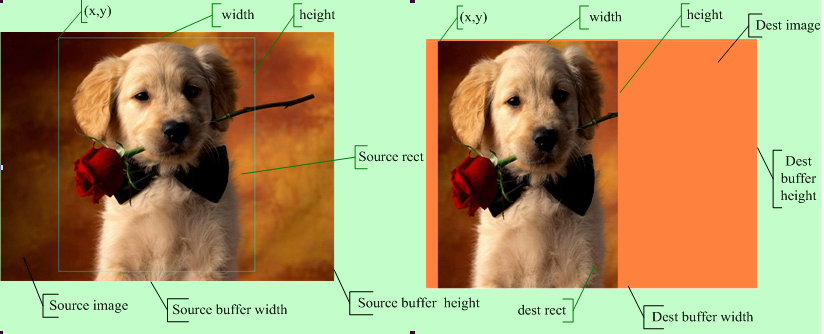

# G2D

G2D 驱动主要实现图像旋转/数据格式/颜色空间转换, 以及图层合成功能(包括包括alpha、colorkey、rotate、mirror、rop、maskblt) 等图形加速功能。

支持的格式如下：

```
G2D_FORMAT_ARGB8888/G2D_FORMAT_ARGB8888/G2D_FORMAT_ABGR8888/
G2D_FORMAT_RGBA8888/G2D_FORMAT_BGRA8888/G2D_FORMAT_XRGB8888,
G2D_FORMAT_XBGR8888/G2D_FORMAT_RGBX8888/G2D_FORMAT_BGRX8888/
G2D_FORMAT_RGB888/G2D_FORMAT_BGR888/G2D_FORMAT_RGB565,
G2D_FORMAT_BGR565/G2D_FORMAT_ARGB4444/G2D_FORMAT_ABGR4444/
G2D_FORMAT_RGBA4444/G2D_FORMAT_BGRA4444/G2D_FORMAT_ARGB1555,
G2D_FORMAT_ABGR1555/G2D_FORMAT_RGBA5551/G2D_FORMAT_BGRA5551/
G2D_FORMAT_ARGB2101010/G2D_FORMAT_ABGR2101010,
G2D_FORMAT_RGBA1010102/G2D_FORMAT_BGRA1010102
G2D_FORMAT_IYUV422_V0Y1U0Y0,
G2D_FORMAT_IYUV422_Y1V0Y0U0,
G2D_FORMAT_IYUV422_U0Y1V0Y0,
G2D_FORMAT_IYUV422_Y1U0Y0V0,
G2D_FORMAT_YUV422UVC_V1U1V0U0,
G2D_FORMAT_YUV422UVC_U1V1U0V0,
G2D_FORMAT_YUV422_PLANAR,
G2D_FORMAT_YUV420UVC_V1U1V0U0,
G2D_FORMAT_YUV420UVC_U1V1U0V0,
G2D_FORMAT_YUV420_PLANAR,
G2D_FORMAT_YUV411UVC_V1U1V0U0,
G2D_FORMAT_YUV411UVC_U1V1U0V0,
G2D_FORMAT_YUV411_PLANAR,
G2D_FORMAT_Y8,
G2D_FORMAT_YVU10_P010,
G2D_FORMAT_YVU10_P210,
G2D_FORMAT_YVU10_444,
G2D_FORMAT_YUV10_444,
```


