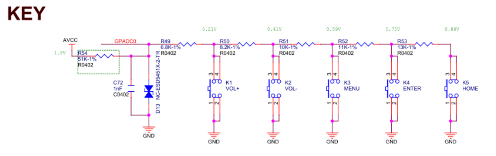

# GPADC 高精度模数转换

## 模块介绍

GPADC 是 12bit 采集精度的模数转换模块，支持 4 路通道，模拟输入范围 0-1.8v，最高采样率 1MHZ，并且支持数据比较，自校验功能，同时工作于可配置的四种工作模式：

- Single mode：在指定的通道完成一次转换并将数据放在响应数据寄存器中；
- Single-cycle mode：在指定的通道完成一个周期转换并将数据放在响应数据寄存器中；
- Continuous mode：在指定的通道持续转换并将数据放在响应数据寄存器中；
- Burst mode：边采样边转换并将数据放入 32 字节的 FIFO，支持中断控制。

一般来说 GPADC 接口用于 KEY 模块按键的读取，一般包括 VOL+、VOL-、HOME、MENU、ENTER 等等，GPADC0 用于 KEY 的电路如上图。AVCC-AP 为 1.8V 的供电，不同的按键按下，GPADC 口的电压不同，CPU 通过对这个电压的采样来确定具体是那一个按键按下。如下图，VOL+、VOL-、MENU、ENTER、HOME对应的电压分别为 0.21V、0.41V、0.59V、0.75V、0.88V。



## 模块配置

其 menuconfig 的配置如下：

```
Kernel Setup --->
    Drivers Setup --->
        SoC HAL Drivers --->
            GPADC devices --->
                [*] enable gpadc driver
                [*] enbale gpadc hal APIs Test command
```

## 源码结构

GPADC 模块源码结构如下所示：

```c
rtos-hal/
|--hal/source/gpadc/hal_gpadc.c    // hal层接口代码
|--include/hal/sunxi_hal_gpadc.h   // 头文件
```

## 模块接口说明

头文件：

```c
#include <sunxi_hal_gpadc.h>
```

###  GPADC 初始化接口

GPADC 模块初始化，主要初始化时钟，中断以及采样率配置等

```c
int hal_gpadc_init(void)
```

参数：

- 无

返回值：

- 0 代表成功
- 负数代表失败


### GPADC 通道配置接口

 选择并配置 GPADC 某个通道

```c
hal_gpadc_status_t hal_gpadc_channel_init(hal_gpadc_channel_t channal)
```

参数：

- channel：通道号

返回值：

- 0 代表成功
- 负数代表失败


### GPADC 通道取消配置接口

 取消 GPADC 某个通道配置

```c
hal_gpadc_status_t hal_gpadc_channel_exit(hal_gpadc_channel_t channal)
```

参数：

- channel：通道号

返回值：

- 0 代表成功
- 负数代表失败


### GPADC 去初始化接口

 GPADC 模块去初始化

```c
hal_gpadc_status_t hal_gpadc_deinit(void)
```

参数：

- 无

返回值：

- 0 代表成功
- 负数代表失败


### GPADC 注册回调接口

 向应用层提供注册回调接口的功能

```c
hal_gpadc_status_t hal_gpadc_register_callback(hal_gpadc_channel_t channal, gpadc_callback_t user_callback)
```

参数：

- channel：通道号
- user_callback：应用层回调接口

返回值：

- 0 代表成功
- 负数代表失败

## 模块使用范例

### 读取电压

```c
#include <stdio.h>
#include <stdlib.h>
#include <stdint.h>
#include <string.h>
#include <unistd.h>

#include <hal_log.h>
#include <hal_cmd.h>
#include <sunxi_hal_gpadc.h>

int channel = -1;

int cmd_test_gpadc(int argc, char **argv)
{
    int ret = -1;
    uint32_t vol_data;

    printf("Run gpadc test\n");

    if (argc < 2)
    {
	    hal_log_err("usage: hal_gpadc channel\n");
	    return -1;
    }

    ret = hal_gpadc_init();
    if (ret) {
        hal_log_err("gpadc init failed!\n");
        return -1;
    }

    channel = strtol(argv[1], NULL, 0);

    if (channel < 0 || channel > CHANNEL_NUM)
    {
        hal_log_err("channel %d is wrong, must between 0 and %d\n", CHANNEL_NUM);
        return -1;
    }

    hal_gpadc_channel_init(channel);
    vol_data = gpadc_read_channel_data(channel);
    printf("channel %d vol data is %u\n", channel, vol_data);
    hal_gpadc_channel_exit(channel);
    hal_gpadc_deinit();

    return 0;
}

FINSH_FUNCTION_EXPORT_CMD(cmd_test_gpadc, hal_gpadc, gpadc hal APIs tests)
```

### 回调方式读取电压

```c
#include <stdio.h>
#include <stdlib.h>
#include <stdint.h>
#include <string.h>
#include <unistd.h>

#include <hal_log.h>
#include <hal_cmd.h>
#include <sunxi_hal_gpadc.h>

int channel = -1;

int sunxigpadc_irq_callback(uint32_t dada_type, uint32_t data)
{
    int vol_data;
    data = ((VOL_RANGE / 4096) * data);
    vol_data = data / 1000;
    printf("channel %d vol data: %d\n", channel, vol_data);
    hal_gpadc_channel_exit(channel);
    hal_gpadc_deinit();
    return 0;
}

int cmd_test_gpadc_callback(int argc, char **argv)
{
    int ret = -1;
    uint32_t vol_data;

    printf("Run gpadc test\n");

    if (argc < 2)
    {
	    hal_log_err("usage: hal_gpadc channel\n");
	    return -1;
    }

    ret = hal_gpadc_init();
    if (ret) {
        hal_log_err("gpadc init failed!\n");
        return -1;
    }

    channel = strtol(argv[1], NULL, 0);

    if (channel < 0 || channel > CHANNEL_NUM)
    {
        hal_log_err("channel %d is wrong, must between 0 and %d\n", CHANNEL_NUM);
        return -1;
    }

    hal_gpadc_channel_init(channel);
    hal_gpadc_register_callback(channel, sunxigpadc_irq_callback);

    return 0;
}

FINSH_FUNCTION_EXPORT_CMD(cmd_test_gpadc_callback, hal_gpadc callback, gpadc hal APIs tests callback)
```

