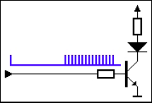
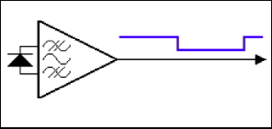
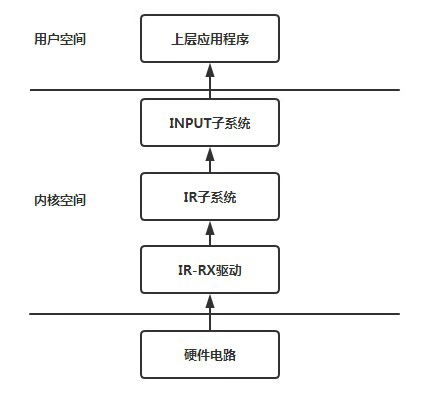
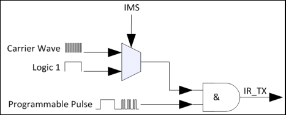
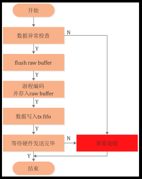
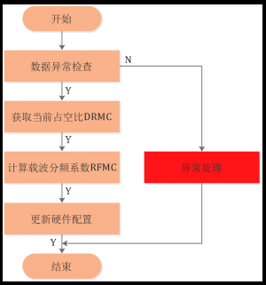
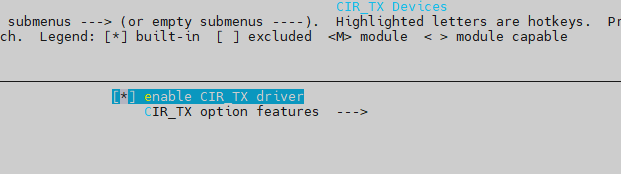
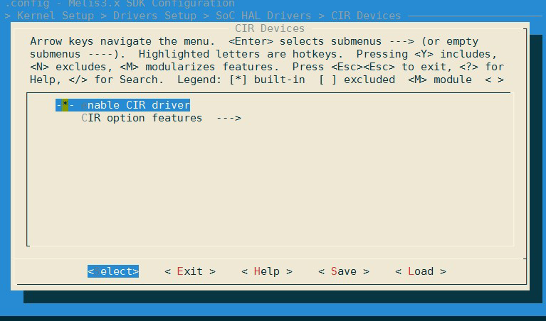

# IR 

红外是一种电磁波，可以实现数据的无线传输，由发送和接收两个部分组成。发送端对红外信号进行脉冲编码，接收端完成对红外信号的脉冲解码。红外遥控协议有多种，如 NEC、SIRC、 RC-5 等，这些协议都比较简单，基本都是以脉冲宽度或脉冲间隔来编码。当遥控器按下按键时，遥控器逻辑单元会产生一个完整的脉冲波形，包含遥控指令的信息，即红外传输的基带信号。这个波形被送到遥控器的调制单元，经调制单元调制成高频红外电磁波信号，由发光二极管发射出去，如下图所示。



红外电磁波信号一般使用一体化接收头接收，同时完成信号的解调和放大，其输出信号就是红外的基带脉冲信号。解调后的信号可直接送入信号处理单元，由处理单元对脉冲波形进行解码，典型红外接收电路如下图所示。



相对应的，IR RX 模块属于INPUT 输入设备，支持红外遥控器的按键遥控。具体规格如下所示：



整个系统框架流程如上图所示：当用户按下遥控器的时候，会触发一个中断。IR 驱动会进入中断，然后解析遥控器发送的键值，然后对该电压值进行解码，然后将该事件上报给INPUT 子系统。INPUT 子系统找到相应的事件处理程序之后，会将该按键事件上报给用户空间，等待用户程序对该按键信息的读取与处理。

## IR TX 发送 （CIR_TX）

### 模块内部调制原理

内部调制原理如下图所示。其中 IMS（Internal Modulation Select），为选择使用内部调制或不调制。软件需设置使用IMS。



### 载波频率设置

载波频率计算公式为：

```
Fc = Fclk / [(RFMC + 1) * (DRMC + 2)] (公式1)
```

其中

- Fc为载波频率；
- Fclk为Sunxi IR-TX时钟源，目前配置为12MHz；
- RFMC为载波分频系数，由MCR寄存器（0x04）bit[7:0]设定；
- DRMC为载波占空比设置，由GLR寄存器（0x00）bit[6:5]设定，可配置1/2、1/3或1/4。

通常，载波占空比DRMC 和载波频率 Fc 由应用层设定，因此设置载波占空比即转换为设置GLR bit[6:5]，设置载波频率即转换成设置MCR bit[7:0]，由公式1 变换得计算RFMC 的公式为：

```
RFMC = Fclk / [Fc *(DRMC + 2)] - 1 (公式2)
```

### 数据发送流程

CIR-TX 驱动数据发送流程如下图所示：



### 设置载波占空比

由于硬件只支持1/4、1/3 和1/2 三挡占空比设置，因此Sunxi IR-TX 驱动设置载波占空比的流
程比较简单：上层传递一个0~100 的数值，如果该数值小于30，则设定占空比为1/4；如果该
数值大于30 且小于40，则设定占空比为1/3；如果该数值大于40，则设定占空比为1/2。最后
更新硬件配置。

### 设置载波频率

IR-TX 驱动设置载波频率流程如下图所示：



### 模块配置介绍

IR_TX 在 `menuconfig ` 中配置如下



### 模块源码结构

CIR_TX 模块源码结构如下所示：

```
rtos-hal/
|--hal/source/cir_tx/hal_cir_tx     // hal层接口代码
|--include/hal/sunxi_hal_cir_tx.h   // 头文件
```

### 模块接口说明

头文件

```
#include <sunxi_hal_cir_tx.h>
```

#### IRTX 初始化

IRTX 模块初始化，主要完成clk 初始化

函数原型：

```c
cir_tx_status_t hal_cir_tx_init(struct sunxi_cir_tx_t *cir_tx);
```

参数：

- `cir_tx` ：操作结构体

返回值：

- `0`：成功初始化
- 负数：初始化失败

#### IRTX 设置载波占空比

配置 IRTX 模块占空比

函数原型：

```c
void hal_cir_tx_set_duty_cycle(int duty_cycle);
```

参数：

- `duty_cycle`：占空比大小

返回值：

- 无

#### IRTX 设置载波频率

设置载波频率

函数原型：

```c
void hal_cir_tx_set_carrier(int carrier_freq);
```

参数：

- `carrier_freq`：载波频率大小

返回值：

- 无

#### IRTX 使能发送

发送IRTX 数据

函数原型：

```c
void hal_cir_tx_xmit(unsigned int *txbuf, unsigned int count);
```

参数：

- `txbuf`： 代表数据 `buf`
- `count`： 代表数据长度

返回值：

- 无

### 模块使用范例

```c
#include <stdint.h>
#include <stdio.h>
#include <stdlib.h>
#include <string.h>
#include <unistd.h>

#include <hal_cmd.h>

#include "sunxi_hal_cir_tx.h"

#define NS_TO_US(nsec) ((nsec) / 1000)

#define NEC_NBITS 32
#define NEC_UNIT 562500 /* ns. Logic data bit pulse length */
#define NEC_HEADER_PULSE \
  (16 * NEC_UNIT) /* 9ms. 16 * Logic data bit pulse length*/
#define NEC_HEADER_SPACE (8 * NEC_UNIT) /* 4.5ms */
#define NEC_BIT_PULSE (1 * NEC_UNIT)
#define NEC_BIT_0_SPACE (1 * NEC_UNIT)
#define NEC_BIT_1_SPACE (3 * NEC_UNIT)
#define NEC_TRAILER_PULSE (1 * NEC_UNIT)
#define NEC_TRAILER_SPACE (10 * NEC_UNIT) /* even longer */

#define GPIO_IR_RAW_BUF_SIZE 128
#define DEFAULT_DUTY_CYCLE 33
#define DEFAULT_CARRIER_FREQ 38000

#define LIRC_MODE2_PULSE 0x01000000
#define LIRC_MODE2_SPACE 0x00000000

#define LIRC_VALUE_MASK 0x00FFFFFF
#define LIRC_MODE2_MASK 0xFF000000

#define LIRC_PULSE(val) (((val)&LIRC_VALUE_MASK) | LIRC_MODE2_PULSE)
#define LIRC_SPACE(val) (((val)&LIRC_VALUE_MASK) | LIRC_MODE2_SPACE)

uint32_t tx_raw_buf[GPIO_IR_RAW_BUF_SIZE];

static int nec_modulation_byte(uint32_t *buf, uint8_t code) {
  int i = 0;
  uint8_t mask = 0x01;

  while (mask) {
    if (code & mask) {
      /* bit 1 */
      *(buf + i) = LIRC_PULSE(NS_TO_US(NEC_BIT_PULSE));
      *(buf + i + 1) = LIRC_SPACE(NS_TO_US(NEC_BIT_1_SPACE));
    } else {
      /* bit 0 */
      *(buf + i) = LIRC_PULSE(NS_TO_US(NEC_BIT_PULSE));
      *(buf + i + 1) = LIRC_SPACE(NS_TO_US(NEC_BIT_0_SPACE));
    }
    mask <<= 1;
    i += 2;
  }
  return i;
}

static int ir_lirc_transmit_ir(uint32_t *raw_buf, size_t n) {
  int ret, count;

  count = n / sizeof(unsigned int);
  if (count > 1024 || count % 2 == 0) {
    return -1;
  }
}

static int nec_ir_encode(uint32_t *raw_buf, uint32_t key_code) {
  uint8_t address, reverse_address, command, reverse_command;
  uint32_t *head_p, *data_p, *stop_p;

  address = (key_code >> 24) & 0xff;
  reverse_address = (key_code >> 16) & 0xff;
  command = (key_code >> 8) & 0xff;
  reverse_command = (key_code >> 0) & 0xff;

  /* head bit */
  head_p = raw_buf;
  *(head_p) = LIRC_PULSE(NS_TO_US(NEC_HEADER_PULSE));
  *(head_p + 1) = LIRC_PULSE(NS_TO_US(NEC_HEADER_SPACE));

  /* data bit */
  data_p = raw_buf + 2;
  nec_modulation_byte(data_p, address);

  data_p += 16;
  nec_modulation_byte(data_p, reverse_address);

  data_p += 16;
  nec_modulation_byte(data_p, command);

  data_p += 16;
  nec_modulation_byte(data_p, reverse_command);

  /* stop bit */
  stop_p = data_p + 16;
  *(stop_p) = LIRC_PULSE(NS_TO_US(NEC_TRAILER_PULSE));
  *(stop_p + 1) = LIRC_PULSE(NS_TO_US(NEC_TRAILER_SPACE));

  return ((NEC_NBITS + 2) * 2 - 1);
}

int cmd_test_cir_tx(int argc, char **argv) {
  int key_code = 0x04fb13ec;
  int i, size;
  int count = 67;
  struct sunxi_cir_tx_t *cir_tx;

  hal_cir_tx_init(cir_tx);

  hal_cir_tx_set_duty_cycle(DEFAULT_DUTY_CYCLE);
  hal_cir_tx_set_carrier(DEFAULT_CARRIER_FREQ);

  size = nec_ir_encode(tx_raw_buf, key_code);
  for (i = 0; i < size; i++) {
    printf("%d ", *(tx_raw_buf + i) & 0x00FFFFFF);
    if ((i + 1) % 8 == 0) {
      printf("\n");
    }
  }
  printf("\n");

  for (i = 0; i < size; i++) tx_raw_buf[i] = (tx_raw_buf[i] & 0x00FFFFFF);

  hal_cir_tx_xmit(tx_raw_buf, count);
  printf("end test!\n");

  return 0;
}
```


## IR RX 接收（CIR）

### 模块配置介绍

IR 在 `menuconfig ` 中配置如下



### 模块源码结构

CIR 模块源码结构如下所示：

```
rtos-hal/
|--hal/source/cir/hal_cir.c     // hal层接口代码
|--include/hal/sunxi_hal_cir.h  // 头文件
```

### 模块返回值定义

| 返回值 | 枚举           | 定义                    |
| ------ | -------------- | ----------------------- |
| -4     | `CIR_PIN_ERR`  | 配置的 CIR 引脚错误     |
| -3     | `CIR_CLK_ERR`  | 配置的 CIR 模块时钟错误 |
| -2     | `CIR_IRQ_ERR`  | 中断配置错误            |
| -1     | `CIR_PORT_ERR` | 配置 CIR 端口错误       |
| 0      | `CIR_OK`       | 成功                    |

```c
typedef enum {
   CIR_PIN_ERR = -4,
   CIR_CLK_ERR = -3,
   CIR_IRQ_ERR = -2,
   CIR_PORT_ERR = -1,
   CIR_OK = 0,
} cir_status_t;
```

### 模块接口说明

头文件

```c
#include <sunxi_hal_cir.h>
```

#### IR 初始化接口

IR 模块初始化，主要初始化采样率、通道选择及注册中断等

函数原型：

```c
cir_status_t sunxi_cir_init(cir_port_t port);
```

参数：

- `port` ：CIR 通道

返回值：

- `0`：成功初始化
- 负数：初始化失败

#### IR 注册回调接口

向应用层提供注册回调接口的功能

函数原型：

```c
void sunxi_cir_callback_register(cir_port_t port, cir_callback_t callback);
```

参数：

- `port` ：CIR 通道
- `callback`：应用层回调接口

返回值：

- 无

#### IR 去初始化接口

函数原型：

```c
void sunxi_cir_deinit(cir_port_t port);
```

参数：

- `port` ：CIR 通道

返回值：

- 无

### 模块使用范例

```c
#include <stdint.h>
#include <stdio.h>
#include <stdlib.h>
#include <string.h>
#include <unistd.h>

#include <hal_cmd.h>
#include <hal_log.h>

#include "sunxi_hal_cir.h"

static cir_callback_t cir_irq_callback(uint32_t data_type, uint32_t data) {
  printf("reg_val:0x%u\n", data);
  return 0;
}

int cmd_test_cir(int argc, char **argv) {
  cir_port_t port;
  int ret = -1;
  int timeout_sec = 15;
  TickType_t start_ticks, current_ticks;

  printf("Run ir test\n");

  if (argc < 2) {
    hal_log_err("usage: hal_ir channel\n");
    return -1;
  }

  port = strtol(argv[1], NULL, 0);
  ret = sunxi_cir_init(port);
  if (ret) {
    hal_log_err("cir init failed!\n");
    return -1;
  }

  sunxi_cir_callback_register(port, cir_irq_callback);
  start_ticks = xTaskGetTickCount();
  printf("start_ticks: %u\n", start_ticks);

  while (1) {
    current_ticks = xTaskGetTickCount();
    if ((current_ticks - start_ticks) * portTICK_PERIOD_MS >=
        timeout_sec * 1000) {
      printf("current_ticks: %u\n", current_ticks);
      break;
    }
  }
  sunxi_cir_deinit(port);
  return 0;
}
```

