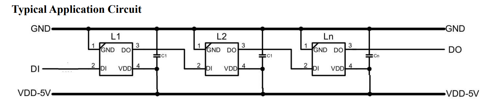
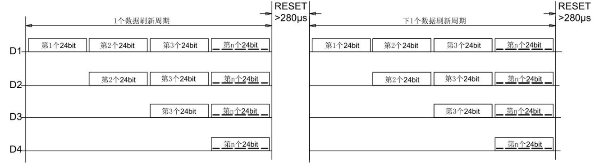

# LEDC

LEDC（Light Emitting Diode Controller），发光二极管控制器。支持驱动目前市场上已有成熟的智能外控 LED，例如 WS2812 系列，每个 LED 的三基色均可实现 256 级亮度显示，因此整个 LED 可完成 256ˆ3（即 16777216）种颜色的全真色彩显示。模块支持最大1024颗外控 LED级联。

## 模块介绍

LEDC 硬件方框图如上图所示，CPU 通过 APB 总线操作 LEDC 寄存器来控制 LEDC；当 CPU配置好 LEDC 的相关寄存器之后，通过 CPU 或 DMA 将 R、G、B 数据从 DRAM 搬到 LEDCFIFO 中，启动 LEDC 之后就可以通过 PIN 脚向外部的 LED 发送数据了。



LED 典型电路如图所示，其中 DI 表示控制数据输入脚，DO 表示控制数据输出脚。DI 端接收从控制器传过来的数据，每个 LED 内部的数据锁存器会存储 24bit 数据，剩余的数据经过内部整形处理电路整形放大后通过 DO 端口开始转发输出给下一个级联的 LED。因此，每经过一个LED，数据减少 24bit。



注意，如果在单次直接设置第 n 个 LED 的亮度和色彩的时候，前面 n-1 个 LED 的亮度数据会在第 n 个 LED 的数据前发送，不过这些数据将会是原来 n-1 个 LED 的亮度数据。

## 模块配置

配置路径如下:

```
Kernel Setup --->
    Drivers Setup --->
        SoC HAL Drivers --->
            LEDC devices --->
                [*] enable ledc driver
```

## 源码结构

LEDC 模块源码结构如下所示：

```
rtos-hal/
|--hal/source/ledc/hal_ledc.c   // hal层接口代码
|--include/hal/sunxi_hal_ledc.h // 头文件
```

## 模块接口说明

头文件：

```c
#include <sunxi_hal_ledc.h>
```

### LEDC 初始化接口

LEDC 模块初始化，主要初始化时钟，GPIO 以及 DMAC 通道等

函数原型：

```c
int hal_gpadc_init(void)
```

参数：

- 无

返回值：

- 1：成功
- 其他：失败

###  LEDC 数据传输接口

发送 RGB 数据

函数原型：

```c
int hal_ledc_trans_data(struct ledc_config *ledc)
```

参数：

- ledc: 配置参数信息，包括待发送数据、数据长度、发送方式（CPU/DMA）及各时间参数设置

返回值：

- 1：成功
- 其他：失败

### LEDC 清除中断接口

清除 LEDC 中断

函数原型：

```c
void hal_ledc_clear_all_irq(void)
```

参数：

- 无

返回值：

- 无

###  LEDC 获取中断状态接口

获取 LEDC 中断状态

函数原型：

```c
unsigned int hal_ledc_get_irq_status(void)
```

参数：

- 无

返回值：

- LEDC 中断状态寄存器值

### LEDC DMA 回调接口

获取 DMA 状态信息

函数原型：

```c
void hal_ledc_dma_callback(void *para)
```

参数：

- DMAC 状态信息指针

返回值：

- 无

###  LEDC 复位接口

复位 LEDC

函数原型：

```c
void hal_ledc_reset(void)
```

参数：

- 无

返回值：

- 无

###  LEDC 去初始化接口

LEDC 模块去初始化

函数原型：

```c
void hal_ledc_deinit(void)
```

参数：

- 无

返回值：

- 无

###  LEDC 初始化接口

LEDC 模块初始化

函数原型：

```c
int sunxi_led_init(void);
```

参数：

- 无

返回值：

- 1：成功
- 其他：失败

###  LEDC 设置单个 LED 颜色亮度

LEDC 设置 LED 的亮度

函数原型：

```c
int sunxi_set_led_brightness(int led_num, unsigned int brightness);
```

参数：

- led_num：led 数量
- brightness：待配置的亮度

返回值：

- 1：成功
- 其他：失败

###  LEDC 设置全部 LED 颜色亮度

LEDC 设置 LED 的亮度

函数原型：

```c
int sunxi_set_all_led(int led_num, unsigned int brightness);
```

参数：

- led_num：led 数量
- brightness：待配置的亮度

返回值：

- 1：成功
- 其他：失败


## 模块使用范例

```c
#include <stdlib.h>
#include <string.h>
#include <stdint.h>
#include <stdio.h>
#include <hal_timer.h>
#include <hal_cmd.h>

#include "sunxi_hal_ledc.h"

#define DEFAULT_BRIGHTNESS	127

void show_default_rgb(void)
{
	printf("======show default RGB======\n");
	sunxi_set_led_brightness(1, DEFAULT_BRIGHTNESS << 8);
	sunxi_set_led_brightness(1, DEFAULT_BRIGHTNESS << 16);
	sunxi_set_led_brightness(1, DEFAULT_BRIGHTNESS << 0);
	sunxi_set_led_brightness(1, 0);
}

int ledc_test_single(int argc, char **argv)
{
	int brightness = 0;
	int led_num;
	int err;

	printf("========SINGLE LEDC TEST========\n");

	err = hal_ledc_init();
	if (err) {
		printf("ledc init error\n");
		return -1;
	}

	if(argc < 3)
	{
		show_default_rgb();
		printf("uasge : hal_ledc [led_num] [RGB] [rgb_brightness], eg: hal_ledc 1 R 100\n");
		return -1;
	}

	led_num = atoi(argv[1]);
	if (led_num < 1 || led_num > 1024)
	{
		printf("The led_num you entered should be between 1 and 1024\n");
	}

	brightness = atoi(argv[3]);

	switch(argv[2][0])
	{
		case 'R' : brightness <<= 8; break;
		case 'G' : brightness <<= 16; break;
		case 'B' : brightness <<= 0; break;
		default  : printf("parameters err\n");
			   return -1;
	}

	err = sunxi_set_led_brightness(led_num, brightness);
	if (err) {
		printf("set all led error\n");
		return -1;
	}

	printf("led is %d\n", led_num);
	printf("brightness is %d\n", brightness);

	return 0;
}

FINSH_FUNCTION_EXPORT_CMD(ledc_test_single, hal_ledc, drv single ledc test_code);

int ledc_test_all(int argc, char **argv)
{
	int brightness = 0;
	int led_num;
	int err;

	printf("========ALL LEDC TEST========\n");

	err = hal_ledc_init();
	if (err) {
		printf("ledc init error\n");
		return -1;
	}

	if(argc < 3)
	{
		printf("uasge : hal_ledc_all [led_num] [RGB] [rgb_brightness], eg: hal_ledc_all 34 R 100\n");
		return -1;
	}

	led_num = atoi(argv[1]);
	if (led_num < 1 || led_num > 1024)
	{
		printf("The led_num you entered should be between 1 and 1024\n");
	}

	brightness = atoi(argv[3]);

	switch(argv[2][0])
	{
		case 'R' : brightness <<= 8; break;
		case 'G' : brightness <<= 16; break;
		case 'B' : brightness <<= 0; break;
		default  : printf("parameters err\n");
			   return -1;
	}

	err = sunxi_set_all_led(led_num, brightness);
	if (err) {
		printf("set all led error\n");
		return -1;
	}

	return 0;
}

FINSH_FUNCTION_EXPORT_CMD(ledc_test_all, hal_ledc_all, drv all ledc test_code);
```

