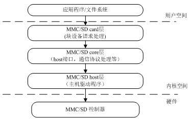

# MMC

## MMC 特性

- Compatible with Secure Digital Memory (SD mem-version 2.0)
- Compatible with Secure Digital I/O (SDIO-version 3.0)
- Compatible with embedded MultiMediaCard (eMMC-version 5.0)
- Supports Card insertion and removal interrupt
- Supports hardware CRC generation and error detection
- Supports programmable baud rate
- Supports SDIO interrupts in 1-bit and 4-bit modes
- Supports block size of 1 to 65535 bytes
- Supports descriptor-based internal DMA controller
- Internal 1024-Bytes RX FIFO and 1024-Bytes TX FIFO
- Supports 1-bit, 4-bit SD and SDIO data bus width
- Supports 1-bit, 4-bit eMMC data bus width

## 模块介绍

RTOS 提供了MMC 子系统来实现对各种SD/SDIO 设备访问，MMC 子系统由上到下可以分为三层，MMC/SD card 层，MMC/SD core 层以及MMC/SD host 层，它们之间的层次关系如下所示。

MMC/SD card 层负主要是按照RTOS 块设备驱动程序的框架实现一个卡的块设备驱动。负责块设备请求的处理，以及请求队列的管理。MMC/SD core 层负责通信协议的处理，包括SD/SDIO，为上一层提供具体读写接口，同时为下一层提供host 端接口。MMC/SD host 是实现对SD/MMC 控制器相关的操作，直接操作硬件，也是主要实现部分。




## 模块配置

其 menuconfig 的配置如下：

```
Kernel Setup --->
    Drivers Setup --->
        SoC HAL Drivers --->
            SDMMC devices --->
                [*] enable SDMMC drivers    
                -*-   enable SD
                [*]   enable SDIO
                [ ]   enable mmc
                [ ]   enable emmc
                [ ]   enable detect card
                [*]   enable dma transmission
                [*]   enable sdio irq
                [*]   enable SD Card test case.
                (64)  SD Card Align DMA Buffer Size(Kbyte).
                (0)   sdc card detect pin present value
                [*]   support SDMMC filesystem
```

## 源码结构

MMC 模块源码结构如下所示：

```c
.
├── cmd
│   ├── cmd_sd.c
│   └── Kconfig
├── core.c
├── _core.h
├── hal
│   └── hal_ccm.c
├── hal_sdhost.c
├── hal_sdpin.c
├── Kconfig
├── Makefile
├── mmc.c
├── _mmc.h
├── osal
│   ├── Makefile
│   └── os
│       ├── FreeRTOS
│       │   ├── Makefile
│       │   ├── os_debug.c
│       │   ├── os_debug.h
│       │   ├── os_mutex.c
│       │   ├── os_queue.c
│       │   ├── os_semaphore.c
│       │   ├── os_thread.c
│       │   ├── os_timer.c
│       │   └── os_util.h
│       ├── Kconfig
│       └── Makefile
├── platform
│   └── mmc_sun20iw2p1.h
├── platform_mmc.h
├── quirks.c
├── sd.c
├── _sd_define.h
├── _sd.h
├── _sdhost.h
├── sdio.c
├── _sdio.h
├── sdio_irq.c
└── test.c
```

## 模块接口说明

### SDMMC 接口

```c
/**
 * @brief read SD card.
 * @param card:
 *        @arg card->card handler.
 * @param buf:
 *        @arg buf->for store readed data.
 * @param sblk:
 *        @arg sblk->start block num.
 * @param nblk:
 *        @arg nblk->number of blocks.
 * @retval  0 if success or other if failed.
 */
extern int32_t mmc_block_read(struct mmc_card *card, uint8_t *buf, uint64_t sblk, uint32_t nblk);

/**
 * @brief write SD card.
 * @param card:
 *        @arg card->card handler.
 * @param buf:
 *        @arg buf->data will be write.
 * @param sblk:
 *        @arg sblk->start block num.
 * @param nblk:
 *        @arg nblk->number of blocks.
 * @retval  0 if success or other if failed.
 */
extern int32_t mmc_block_write(struct mmc_card *card, const uint8_t *buf, uint64_t sblk, uint32_t nblk);

/**
 * @brief scan or rescan SD card.
 * @param card:
 *        @arg card->card handler.
 * @param sdc_id:
 *        @arg sdc_id->SDC ID which card on.
 * @retval  0 if success or other if failed.
 */
extern int32_t mmc_rescan(struct mmc_card *card, uint32_t sdc_id);

/**
 * @brief deinit SD card.
 * @param card:
 *        @arg card->card handler.
 * @retval  0 if success or other if failed.
 */
extern int32_t mmc_card_deinit(struct mmc_card *card);

/**
 * @brief malloc for card_info.
 * @param card_id:
 *        @arg card ID.
 * @retval  0 if success or other if failed.
 */
extern int32_t mmc_card_create(uint8_t card_id, SDCard_InitTypeDef *param);

/**
 * @brief free for card_info.
 * @param card_id:
 *        @arg card ID.
 * @retval  0 if success or other if failed.
 */
extern int32_t mmc_card_delete(uint8_t card_id);

/**
 * @brief get pointer of mmc_card.
 * @param card_id:
 *        @arg card ID.
 * @retval  pointer of mmc_card if success or NULL if failed.
 */
extern struct mmc_card* mmc_card_open(uint8_t card_id);

/**
 * @brief close mmc_card.
 * @param card_id:
 *        @arg card ID.
 * @retval  0 if success or other if failed.
 */
extern int32_t mmc_card_close(uint8_t card_id);
extern struct mmc_card_info* mmc_card_save(uint8_t card_id);
extern int32_t mmc_card_restore(struct mmc_card_info *s_card_info);
```

### SDIO 接口

```c
typedef struct mmc_card sdio_t;

/**
 *  sdio_readb - read a single byte from a SDIO function
 *  @card: SDIO to access
 *  @addr: address to read
 *  @err_ret: optional status value from transfer
 *
 *  Reads a single byte from the address space of a given SDIO
 *  function. If there is a problem reading the address, 0xff
 *  is returned and @err_ret will contain the error code.
 */
extern uint8_t
sdio_readb(struct mmc_card *card, uint32_t func_num, uint32_t addr,
           int32_t *err_ret);

/**
 *  sdio_writeb - write a single byte to a SDIO function
 *  @card: SDIO to access
 *  @b: byte to write
 *  @addr: address to write to
 *  @err_ret: optional status value from transfer
 *
 *  Writes a single byte to the address space of a given SDIO
 *  function. @err_ret will contain the status of the actual
 *  transfer.
 */
extern void
sdio_writeb(struct mmc_card *card, uint32_t func_num, const uint8_t b,
            uint32_t addr, int32_t  *err_ret);

/**
 *	sdio_readw - read a 16 bit integer from a SDIO function
 *	@func: SDIO function to access
 *	@addr: address to read
 *	@err_ret: optional status value from transfer
 *
 *	Reads a 16 bit integer from the address space of a given SDIO
 *	function. If there is a problem reading the address, 0xffff
 *	is returned and @err_ret will contain the error code.
 */
extern uint16_t sdio_readw(struct sdio_func *func, unsigned int addr, int *err_ret);
/**
 *	sdio_writew - write a 16 bit integer to a SDIO function
 *	@func: SDIO function to access
 *	@b: integer to write
 *	@addr: address to write to
 *	@err_ret: optional status value from transfer
 *
 *	Writes a 16 bit integer to the address space of a given SDIO
 *	function. @err_ret will contain the status of the actual
 *	transfer.
 */
extern void sdio_writew(struct sdio_func *func, uint16_t b, unsigned int addr, int *err_ret);
/**
 *	sdio_readl - read a 32 bit integer from a SDIO function
 *	@func: SDIO function to access
 *	@addr: address to read
 *	@err_ret: optional status value from transfer
 *
 *	Reads a 32 bit integer from the address space of a given SDIO
 *	function. If there is a problem reading the address,
 *	0xffffffff is returned and @err_ret will contain the error
 *	code.
 */
extern uint32_t sdio_readl(struct sdio_func *func, unsigned int addr, int *err_ret);
/**
 *	sdio_writel - write a 32 bit integer to a SDIO function
 *	@func: SDIO function to access
 *	@b: integer to write
 *	@addr: address to write to
 *	@err_ret: optional status value from transfer
 *
 *	Writes a 32 bit integer to the address space of a given SDIO
 *	function. @err_ret will contain the status of the actual
 *	transfer.
 */
extern void sdio_writel(struct sdio_func *func, uint32_t b, unsigned int addr, int *err_ret);

/**
 *  memcpy_fromio - read a chunk of memory from a SDIO function
 *  @dst: buffer to store the data
 *  @addr: address to begin reading from
 *  @count: number of bytes to read
 *
 *  Reads from the address space of a given SDIO function. Return
 *  value indicates if the transfer succeeded or not.
 */
extern int
sdio_memcpy_fromio(struct mmc_card *card, unsigned int func_num, void *dst,
                   unsigned int addr, int count);

/**
 *  memcpy_toio - write a chunk of memory to a SDIO function
 *  @addr: address to start writing to
 *  @src: buffer that contains the data to write
 *  @count: number of bytes to write
 *
 *  Writes to the address space of a given SDIO function. Return
 *  value indicates if the transfer succeeded or not.
 */
extern int
sdio_memcpy_toio(struct mmc_card *card, unsigned int func_num, unsigned int addr,
                 const void *src, int count);

/**
 *    sdio_claim_irq - claim the IRQ for a SDIO function
 *    @card: SDIO card
 *    @func_num: function num
 *    @handler: IRQ handler callback
 *
 *    Claim and activate the IRQ for the given SDIO function. The provided
 *    handler will be called when that IRQ is asserted.  The host is always
 *    claimed already when the handler is called so the handler must not
 *    call sdio_claim_host() nor sdio_release_host().
 */
//extern int sdio_claim_irq(struct mmc_card *card, unsigned int func_num,
//                          sdio_irq_handler_t *handler);
extern int sdio_claim_irq(struct sdio_func *func, sdio_irq_handler_t *handler);

/**
 *    sdio_release_irq - release the IRQ for a SDIO function
 *    @card: SDIO card
 *    @func_num: function num
 *
 *    Disable and release the IRQ for the given SDIO function.
 */
//extern int sdio_release_irq(struct mmc_card *card, unsigned int func_num);
extern int sdio_release_irq(struct sdio_func *func);

/**
 *  sdio_align_size - pads a transfer size to a more optimal value
 *  @func: SDIO function
 *  @sz: original transfer size
 *
 *  Pads the original data size with a number of extra bytes in
 *  order to avoid controller bugs and/or performance hits
 *  (e.g. some controllers revert to PIO for certain sizes).
 *
 *  If possible, it will also adjust the size so that it can be
 *  handled in just a single request.
 *
 *  Returns the improved size, which might be unmodified.
 */
//unsigned int sdio_align_size(struct mmc_card *card, unsigned int sz);
unsigned int sdio_align_size(struct sdio_func *func, unsigned int sz);
```

