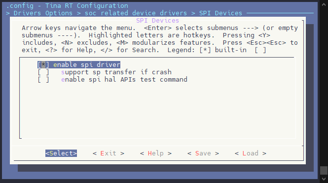
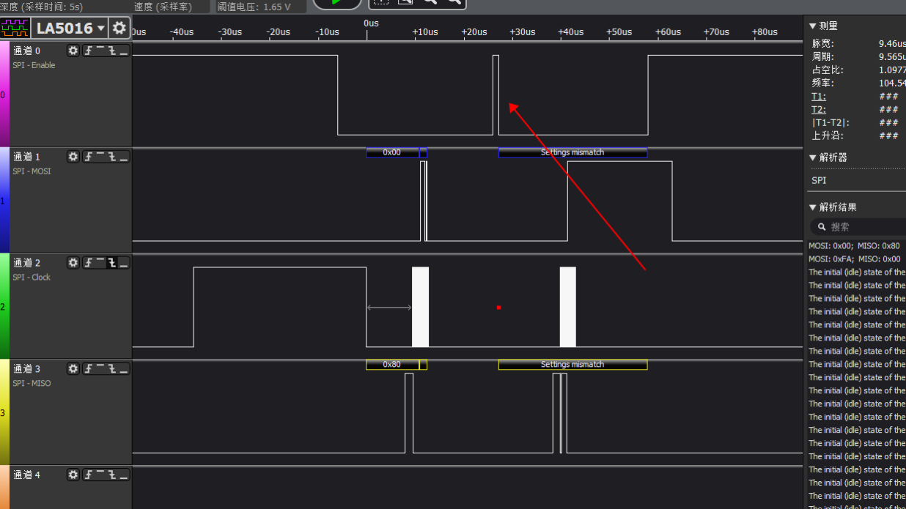

# SPI 

## 模块功能介绍

SPI是一种全双工同步串行接口，可以工作在Master模式和Slave模式，SPI主要有以下特点：
 * 全双工同步串行接口
 * Master/Slave模式可配置
 * 支持最大96MHz时钟频率
 * 支持SPI Mode0/1/2/3
 * 片选和时钟的极性和相位可配置
 * 5个时钟源
 * 支持中断或DMA传输
 * 支持多片选
 * 支持Standard Single/Dual/Quad SPI，FIFO深度64B
 * 支持BIT模式，用于3Wire场景，支持可编程0~32bits帧长度（仅支持Master模式，且不支持DMA和FIFO功能）
 * 支持DBI模式，用于显示设备场景，用于传输视频数据

## 模块配置介绍

目前有两种方法进行引脚配置：`sys_config`和平台头文件。

这两种方法选其中一种使用即可，在没有`sys_config`文件配置时，默认使用平台头文件。当检测到有`sys_config`文件并有相关关键字时，自动切换为该方法。
### sys_config文件引脚配置说明

引脚配置在 `source/project/方案/configs/sys_config.fex` 

```
[spi1]
spi1_used       = 1
spi1_cs_number  = 1
spi1_cs_bitmap  = 1
spi1_cs0        = port:PA02<2><0><2><default>
spi1_sclk       = port:PA03<2><0><2><default>
spi1_mosi       = port:PA04<2><0><2><default>
spi1_miso       = port:PA05<2><0><2><default>
spi1_hold       = port:PA06<2><0><2><default>
spi1_wp         = port:PA07<2><0><2><default>
```
### 平台头文件资源配置说明

引脚配置在 `rtos-hal/hal/source/spi/platform/spi_sun20iw2.h`

```c
static struct sunxi_spi_params_t g_sunxi_spi_params[] = {
	/* SPI0 */
	{	.port = 0,
		.reg_base = SUNXI_SPI0_PBASE, .irq_num = SUNXI_IRQ_SPI0, .gpio_num = 6,
		.pclk_pll_type = HAL_SUNXI_AON_CCU, .pclk_pll_id = CLK_DEVICE,
		.pclk_hosc_type = HAL_SUNXI_AON_CCU, .pclk_hosc_id = CLK_HOSC,
		.bus_type = HAL_SUNXI_CCU, .bus_id = CLK_BUS_SPI0,
		.mclk_type = HAL_SUNXI_CCU, .mclk_id = CLK_SPI0,
		.reset_type = HAL_SUNXI_RESET, .reset_id = RST_SPI0,
		.gpio_clk = GPIOB(6), .gpio_mosi = GPIOB(5), .gpio_miso = GPIOB(15),
		.gpio_cs0 = GPIOB(4), .gpio_wp = GPIOB(14), .gpio_hold = GPIOB(7),
		.mux = 4, .driv_level = GPIO_DRIVING_LEVEL2,
	#ifdef CONFIG_DRIVERS_DMA
		.drq_tx = DRQDST_SPI0_TX, .drq_rx = DRQSRC_SPI0_RX,
	#endif
		.rx_fifosize = 64, .tx_fifosize = 64, .dma_force_fixed = true,
	},
	......
};
```

### menuconfig 配置说明

配置路径如下：
```
Kernel Setup  --->
	Drivers Setup  --->
		SoC HAL Drivers  --->
			SPI Devices  --->
```



## 源码结构介绍

SPI 模块代码结构如下所示：
```
rtos-hal/
|--include/hal/sunxi_hal_spi.h          // hal层数据结构和API接口相关头文件
|--hal/source/spi/platform_spi.h        // hal层平台相关头文件
|--hal/source/spi/platform/spi_xxx.h    // hal层平台信息相关头文件
|--hal/source/spi/common_spi.h          // hal层控制器寄存器相关头文件
|--hal/source/spi/hal_spi.c             // hal层接口驱动代码
|
|--hal/test/spi/test_spi.c              // hal层接口测试代码
|--hal/test/spi/spi_slave_driver.c      // hal层slave模式驱动代码
|--hal/test/spi/test_spi_slave.c        // hal层slave模式测试代码
```

## 模块接口说明

需要包含头文件：
```c
#include <hal/sunxi_hal_spi.h>
```

## 重要结构体及宏定义

### SPI模式功能选择

```c
#define	SPI_CPHA		BIT(0)	/* clock phase */
#define	SPI_CPOL		BIT(1)	/* clock polarity */

#define	SPI_MODE_0		(0|0)
#define	SPI_MODE_1		(0|SPI_CPHA)
#define	SPI_MODE_2		(SPI_CPOL|0)
#define	SPI_MODE_3		(SPI_CPOL|SPI_CPHA)

#define	SPI_CS_HIGH		BIT(2)	/* chipselect active high? */
#define	SPI_LSB_FIRST	BIT(3)	/* per-word bits-on-wire */
#define	SPI_3WIRE		BIT(4)	/* SI/SO signals shared */
#define	SPI_LOOP		BIT(5)	/* loopback mode */
#define	SPI_NO_CS		BIT(6)	/* 1 dev/bus, no chipselect */
#define	SPI_READY		BIT(7)	/* slave pulls low to pause */
#define	SPI_TX_DUAL		BIT(8)	/* transmit with 2 wires */
#define	SPI_TX_QUAD		BIT(9)	/* transmit with 4 wires */
#define	SPI_RX_DUAL		BIT(10)	/* receive with 2 wires */
#define	SPI_RX_QUAD		BIT(11)	/* receive with 4 wires */
```

- SPI_MODE_0/1/2/3：设置SPI的传输模式。
- SPI_CS_HIGH：设置CS片选是否为高电平有效。
- SPI_LSB_FIRST：设置发送顺序是低位在前。
- SPI_3WIRE：设置SPI工作在3线模式下，及MOSI即用作输入也用作输入，实现半双工通信

### SPI控制器模式配置

```c
typedef enum
{
	HAL_SPI_BUS_MASTER = 0,
	HAL_SPI_BUS_SLAVE = 1,
	HAL_SPI_BUS_BIT = 2,
} hal_spi_master_bus_mode_t;
```

- HAL_SPI_BUS_MASTER：处于Master模式，外接SPI Device。
- HAL_SPI_BUS_SLAVE：处于Slave模式，被其他Master访问。
- HAL_SPI_BUS_BIT：处于BIT模式，使用3Wire方式进行数据传输。

### SPI控制器片选模式

```c
typedef enum
{
	HAL_SPI_CS_AUTO = 0,
	HAL_SPI_CS_SOFT = 1,
} hal_spi_master_cs_mode_t;
```

- HAL_SPI_CS_AUTO：硬件自动控制，不需要驱动或软件介入。
- HAL_SPI_CS_SOFT：软件手动控制，由驱动完成相关操作。

### SPI控制器采样模式

```c
typedef enum
{
	SUNXI_SPI_SAMP_MODE_OLD = 0,
	SUNXI_SPI_SAMP_MODE_NEW = 1,
} hal_spi_master_bus_sample_mode_t;
```

- SUNXI_SPI_SAMP_MODE_OLD：粗调模式，共有3档可调
- SUNXI_SPI_SAMP_MODE_NEW：细调模式，共有7档可调

> 粗调模式为驱动根据时钟频率自动识别，不需要额外配置

```c
typedef enum
{
	SUNXI_SPI_SAMP_DELAY_CYCLE_0_0 = 0,
	SUNXI_SPI_SAMP_DELAY_CYCLE_0_5 = 1,
	SUNXI_SPI_SAMP_DELAY_CYCLE_1_0 = 2,
	SUNXI_SPI_SAMP_DELAY_CYCLE_1_5 = 3,
	SUNXI_SPI_SAMP_DELAY_CYCLE_2_0 = 4,
	SUNXI_SPI_SAMP_DELAY_CYCLE_2_5 = 5,
	SUNXI_SPI_SAMP_DELAY_CYCLE_3_0 = 6,
} hal_spi_master_spi_sample_mode_t;
```

- SUNXI_SPI_SAMP_DELAY_CYCLE：采样延时调节挡位选择

> 当采样模式处于细调时，才会使用到该参数

### SPI控制器配置结构体

```c
typedef struct
{
	hal_spi_master_bus_mode_t bus_mode; // SPI控制器配置
	hal_spi_master_cs_mode_t cs_mode;   // SPI控制器片选模式
	hal_spi_master_bus_sample_mode_t bus_sample_mode;   // SPI控制器采样模式 - 粗调
	hal_spi_master_spi_sample_mode_t spi_sample_mode;   // SPI控制器采样模式 - 细调
	uint32_t spi_sample_delay;  // SPI控制器细调采样延时
	uint8_t chipselect; /* SPI slave device selection */
	uint32_t clock_frequency; /* SPI master clock frequency setting */
	uint32_t mode;  // SPI模式/功能选择
	bool sip;
	bool flash;
} hal_spi_master_config_t;
```

### SPI传输结构体

```c
typedef struct
{
	const uint8_t *tx_buf;	/* Data buffer to send */
	uint32_t tx_len;		/* The total number of bytes to send */
	uint32_t tx_single_len;	/* The number of bytes to send in single mode */
	uint8_t *rx_buf;		/* Received data buffer, */
	uint32_t rx_len;		/* The valid number of bytes received */
	uint8_t tx_nbits : 3;	/* Data buffer to send in nbits mode */
	uint8_t rx_nbits : 3;	/* Data buffer to received in nbits mode */
	uint8_t dummy_byte;		/* Flash send dummy byte, default 0*/
#define	SPI_NBITS_SINGLE	0x01 /* 1bit transfer */
#define	SPI_NBITS_DUAL		0x02 /* 2bits transfer */
#define	SPI_NBITS_QUAD		0x04 /* 4bits transfer */
	uint8_t bits_per_word;	/* transfer bit_per_word */
} hal_spi_master_transfer_t;
```

## 对外提供的API接口

### hal_spi_init
* 原型: 

```c
hal_spi_master_status_t hal_spi_init(int port, hal_spi_master_config_t *cfg)
```

* 作用：SPI模块初始化，主要申请中断、pinctrl初始化、clk初始化、SPI模块，包括SPI总线最大传输速率、片选模式等等
- 参数：
	- port:SPI端口号
	- cfg:配置信息
- 返回：
	- 0:成功
	- 负数:失败

### hal_spi_deinit
- 原型: 

```c
hal_spi_master_status_t hal_spi_deinit(int port)
```

- 作用：SPI模块去初始化
- 参数：
	- port:SPI端口号
* 返回：
	- 0:成功
	- 负数:失败

### hal_spi_write
* 原型: 

```c 
hal_spi_master_status_t hal_spi_write(int port, const uint8_t *buf, uint32_t size)
```

* 作用：发送数据，调hal_spi_xfer接口
* 参数：
	- port:SPI端口号
    - buf:发送数据
    - size:发送数据大小
* 返回：
	- 0:成功
	- 负数:失败

### hal_spi_read
* 原型: 
```c
hal_spi_master_status_t hal_spi_read(int port, uint8_t *buf, uint32_t size)
```
* 作用：接收数据，调hal_spi_xfer接口
* 参数：
	- port:SPI端口号
    - buf:接收数据
    - size:接收数据大小
* 返回：
	- 0:成功
	- 负数:失败

### hal_spi_xfer
* 原型:

```c 
hal_spi_master_status_t hal_spi_xfer(int port, hal_spi_master_transfer_t *t, int num)
```

* 作用：发送或接收数据
* 参数：
	- port:SPI端口号
    - t:指向传输包头的指针
	- num:传输包的个数
* 返回：
	- 0:成功
	- 负数:失败

### hal_spi_slave_abort
* 原型: 

```c
hal_spi_master_status_t hal_spi_slave_abort(int port)
```

* 作用：终止slave模式传输
* 参数：
	- port:SPI端口号
* 返回：
	- 0:成功
	- 负数:失败

## 模块使用范例

### Master模式使用及测试范例

```c
hal_spi_master_config_t cfg = { 0 };
cfg.bus_mode = HAL_SPI_BUS_MASTER;
cfg.cs_mode = HAL_SPI_CS_AUTO;
cfg.clock_frequency = 10000000;
cfg.chipselect = 0;
cfg.mode = SPI_MODE_0;
cfg.sip = 0;
cfg.flash = 0;
hal_spi_init(port, &cfg);
```

### BIT模式使用及测试范例

```c
hal_spi_master_config_t cfg = { 0 };
cfg.bus_mode = HAL_SPI_BUS_BIT;
......
hal_spi_init(port, &cfg);

hal_spi_master_transfer_t tr = {
	.tx_buf = &buf,
	.tx_len = 1,
	.rx_buf = NULL,
	.rx_len = 0,
	.bits_per_word = 8,
};
hal_spi_xfer(port, tr, 1);
```
### 测试范例

```c
#include <stdio.h>
#include <stdlib.h>
#include <stdint.h>
#include <string.h>
#include <unistd.h>
#include <errno.h>
#include <getopt.h>
#include <sys/time.h>

#include <hal_log.h>
#include <hal_cmd.h>
#include <hal_mem.h>
#include <hal_timer.h>
#include <sunxi_hal_spi.h>

#define KB (1024)
#define MB (1024*KB)
#define US (1)
#define MS (1000*US)
#define S  (1000*MS)

static void pabort(const char *s)
{
	if (errno != 0)
		perror(s);
	else
		hal_log_err("%s\n", s);

	abort();
}

static int port = 1;
static uint32_t mode;
static uint8_t bits = 8;
static uint32_t speed = 5000000;
static int verbose;
static int transfer_size;
static int iterations;

static uint8_t default_tx[] = {
	0xFF, 0xFF, 0xFF, 0xFF, 0xFF, 0xFF,
	0x40, 0x00, 0x00, 0x00, 0x00, 0x95,
	0xFF, 0xFF, 0xFF, 0xFF, 0xFF, 0xFF,
	0xFF, 0xFF, 0xFF, 0xFF, 0xFF, 0xFF,
	0xFF, 0xFF, 0xFF, 0xFF, 0xFF, 0xFF,
	0xF0, 0x0D,
};

static uint8_t default_rx[sizeof(default_tx)];
static char *input_tx;

static void hex_dump(const void *src, size_t length, size_t line_size,
			 char *prefix)
{
	int i = 0;
	const unsigned char *address = src;
	const unsigned char *line = address;
	unsigned char c;

	printf("%s | ", prefix);
	while (length-- > 0) {
		printf("%02X ", *address++);
		if (!(++i % line_size) || (length == 0 && i % line_size)) {
			if (length == 0) {
				while (i++ % line_size)
					printf("__ ");
			}
			printf(" |");
			while (line < address) {
				c = *line++;
				printf("%c", (c < 32 || c > 126) ? '.' : c);
			}
			printf("|\n");
			if (length > 0)
				printf("%s | ", prefix);
		}
	}
}

/*
 *  Unescape - process hexadecimal escape character
 *      converts shell input "\x23" -> 0x23
 */
static int unescape(char *_dst, char *_src, size_t len)
{
	int ret = 0;
	int match;
	char *src = _src;
	char *dst = _dst;
	unsigned int ch;

	while (*src) {
		if (*src == '\\' && *(src+1) == 'x') {
			match = sscanf(src + 2, "%2x", &ch);
			if (!match)
				pabort("malformed input string");

			src += 4;
			*dst++ = (unsigned char)ch;
		} else {
			*dst++ = *src++;
		}
		ret++;
	}
	return ret;
}

static unsigned long transfer(int port, uint8_t const *tx, uint8_t const *rx, size_t len)
{
	hal_spi_master_status_t ret = 0;
	unsigned long usec = 0;
	struct timeval start, end;
	hal_spi_master_transfer_t tr = {
		.tx_buf = (uint8_t *)tx,
		.tx_len = len,
		.rx_buf = (uint8_t *)rx,
		.rx_len = len,
		.tx_single_len = len,
		.dummy_byte = 0,
		.bits_per_word = bits,
	};

	if (mode & SPI_TX_QUAD)
		tr.tx_nbits = 4;
	else if (mode & SPI_TX_DUAL)
		tr.tx_nbits = 2;
	else if (mode & SPI_RX_QUAD)
		tr.rx_nbits = 4;
	else if (mode & SPI_RX_DUAL)
		tr.rx_nbits = 2;
	if (!(mode & SPI_LOOP)) {
		if (mode & (SPI_TX_QUAD | SPI_TX_DUAL))
			tr.rx_buf = 0;
		else if (mode & (SPI_RX_QUAD | SPI_RX_DUAL))
			tr.tx_buf = 0;
		else if (mode & SPI_3WIRE)
			tr.rx_buf = 0;
	}

	gettimeofday(&start, NULL);
	ret = hal_spi_xfer(port, &tr, 1);
	gettimeofday(&end, NULL);
	if (ret < 0)
		pabort("can't send spi message");

	if (verbose)
	{
		hex_dump(tx, len, 32, "TX");
		hex_dump(rx, len, 32, "RX");
	}

	if (memcmp(tx, rx, len))
		hal_log_info("rx/tx buffer is not same, data error!!!\n");

	usec = (1000000 * (end.tv_sec - start.tv_sec) + end.tv_usec - start.tv_usec);
	return usec;
}

static void print_usage(const char *prog)
{
	hal_log_info("Usage: %s [-DsblHOLC3vpNR24SI]\n", prog);
	puts("  -D --device   device port to use (default 1)\n"
	     "  -s --speed    max speed (Hz)\n"
	     "  -b --bpw      bits per word\n"
	     "  -l --loop     loopback\n"
	     "  -H --cpha     clock phase\n"
	     "  -O --cpol     clock polarity\n"
	     "  -L --lsb      least significant bit first\n"
	     "  -C --cs-high  chip select active high\n"
	     "  -3 --3wire    SI/SO signals shared\n"
	     "  -v --verbose  Verbose (show tx buffer)\n"
	     "  -p            Send data (e.g. \"1234\\xde\\xad\")\n"
	     "  -N --no-cs    no chip select\n"
	     "  -R --ready    slave pulls low to pause\n"
	     "  -2 --dual     dual transfer\n"
	     "  -4 --quad     quad transfer\n"
	     "  -S --size     transfer size\n"
	     "  -I --iter     iterations\n");
}

static int parse_opts(int argc, char *argv[])
{
	int ret = 0;

	while (1) {
		static const struct option lopts[] = {
			{ "device",  1, 0, 'D' },
			{ "speed",   1, 0, 's' },
			{ "bpw",     1, 0, 'b' },
			{ "loop",    0, 0, 'l' },
			{ "cpha",    0, 0, 'H' },
			{ "cpol",    0, 0, 'O' },
			{ "lsb",     0, 0, 'L' },
			{ "cs-high", 0, 0, 'C' },
			{ "3wire",   0, 0, '3' },
			{ "no-cs",   0, 0, 'N' },
			{ "ready",   0, 0, 'R' },
			{ "dual",    0, 0, '2' },
			{ "verbose", 0, 0, 'v' },
			{ "quad",    0, 0, '4' },
			{ "size",    1, 0, 'S' },
			{ "iter",    1, 0, 'I' },
			{ NULL, 0, 0, 0 },
		};
		int c;

		c = getopt_long(argc, argv, "D:s:b:lHOLC3NR24p:vS:I:",
				lopts, NULL);

		if (c == -1)
			break;

		switch (c) {
		case 'D':
			port = atoi(optarg);
			break;
		case 's':
			speed = atoi(optarg);
			break;
		case 'b':
			bits = atoi(optarg);
			break;
		case 'l':
			mode |= SPI_LOOP;
			break;
		case 'H':
			mode |= SPI_CPHA;
			break;
		case 'O':
			mode |= SPI_CPOL;
			break;
		case 'L':
			mode |= SPI_LSB_FIRST;
			break;
		case 'C':
			mode |= SPI_CS_HIGH;
			break;
		case '3':
			mode |= SPI_3WIRE;
			break;
		case 'N':
			mode |= SPI_NO_CS;
			break;
		case 'v':
			verbose = 1;
			break;
		case 'R':
			mode |= SPI_READY;
			break;
		case 'p':
			input_tx = optarg;
			break;
		case '2':
			mode |= SPI_TX_DUAL;
			break;
		case '4':
			mode |= SPI_TX_QUAD;
			break;
		case 'S':
			transfer_size = atoi(optarg);
			break;
		case 'I':
			iterations = atoi(optarg);
			break;
		default:
			print_usage(argv[0]);
			ret = -1;
		}
	}
	if (mode & SPI_LOOP) {
		if (mode & SPI_TX_DUAL)
			mode |= SPI_RX_DUAL;
		if (mode & SPI_TX_QUAD)
			mode |= SPI_RX_QUAD;
	}

	return ret;
}

static void transfer_escaped_string(int port, char *str)
{
	size_t size = strlen(str);
	uint8_t *tx;
	uint8_t *rx;

	tx = hal_malloc(size);
	if (!tx)
		pabort("can't allocate tx buffer");

	rx = hal_malloc(size);
	if (!rx)
		pabort("can't allocate rx buffer");

	size = unescape((char *)tx, str, size);
	transfer(port, tx, rx, size);
	hal_free(rx);
	hal_free(tx);
}

static void show_transfer_info(unsigned long size, unsigned long time)
{
	double rate;

	printf("total size   : ");
	if (size >= MB) {
		printf("%.2lf MB", (double)size/(double)MB);
	} else if (size >= KB) {
		printf("%.2lf KB", (double)size/(double)KB);
	} else {
		printf("%lu B", size);
	}
	printf("\n");

	printf("total time   : ");
	if (time >= S) {
		printf("%.2lf s", (double)time/(double)S);
	} else if (time >= MS) {
		printf("%.2lf ms", (double)time/(double)MS);
	} else {
		printf("%.2lf us", (double)time/(double)US);
	}
	printf("\n");

	rate = ((double)size / (double)MB) / ((double)time / (double)S);
	printf("averange rate: %.2lf MB/s\n", rate);
}

static unsigned long transfer_buf(int port, int len)
{
	uint8_t *tx;
	uint8_t *rx;
	int i;
	unsigned long usec = 0;

	tx = hal_malloc(len);
	if (!tx)
		pabort("can't allocate tx buffer");

	srand(time(NULL));
	for (i = 0; i < len; i++)
		tx[i] = random();

	rx = hal_malloc(len);
	if (!rx)
		pabort("can't allocate rx buffer");

	usec = transfer(port, tx, rx, len);

	if (mode & SPI_LOOP) {
		if (memcmp(tx, rx, len)) {
			fprintf(stderr, "transfer error !\n");
			hex_dump(tx, len, 32, "TX");
			hex_dump(rx, len, 32, "RX");
			exit(1);
		}
	}

	hal_free(rx);
	hal_free(tx);

	return usec;
}

static int cmd_spidev_test(int argc, char **argv)
{
	hal_spi_master_config_t cfg = { 0 };

	port = 1;
	mode = 0;
	bits = 8;
	speed = 5000000;
	verbose = 0;
	transfer_size = 0;
	iterations = 0;
	input_tx = NULL;
	memset(default_rx, 0, sizeof(default_rx));

	if (parse_opts(argc, argv) < 0) {
		return 0;
	}

	if (mode & SPI_3WIRE)
		cfg.bus_mode = HAL_SPI_BUS_BIT;
	else
		cfg.bus_mode = HAL_SPI_BUS_MASTER;
	cfg.cs_mode = HAL_SPI_CS_AUTO;
	cfg.clock_frequency = speed;
	cfg.chipselect = 0;
	cfg.mode = mode;
	cfg.sip = 0;
	cfg.flash = 0;
	hal_spi_init(port, &cfg);

	hal_log_info("spi mode: 0x%x\n", mode);
	hal_log_info("bits per word: %u\n", bits);
	hal_log_info("max speed: %u Hz (%u kHz)\n", speed, speed/1000);

	if (input_tx)
		transfer_escaped_string(port, input_tx);
	else if (transfer_size) {
		unsigned long total_size = transfer_size * iterations;
		unsigned long total_usec = 0;
		int i;

		for (i = 0; i < iterations; i++)
			total_usec += transfer_buf(port, transfer_size);

		show_transfer_info(total_size, total_usec);
		printf("averange time: %.2lf us\n", (double)total_usec/(double)(iterations));
	} else
		transfer(port, default_tx, default_rx, sizeof(default_tx));

	hal_spi_deinit(port);

	return 0;
}

FINSH_FUNCTION_EXPORT_CMD(cmd_spidev_test, hal_spidev_test, spidev hal APIs tests)
```

## Slave模式使用及测试范例

### Slave模式使用范例

重点代码：

```c
hal_spi_master_config_t cfg = { 0 };
cfg.bus_mode = HAL_SPI_BUS_SLAVE;
cfg.clock_frequency = 10000000;
cfg.chipselect = 0;
cfg.mode = SPI_MODE_0;
hal_spi_init(port, &cfg);
```

```c
#include <stdio.h>
#include <stdlib.h>
#include <stdint.h>
#include <string.h>
#include <unistd.h>
#include <sys/time.h>

#include <hal_log.h>
#include <hal_cmd.h>
#include <hal_mem.h>
#include <hal_timer.h>
#include <hal_thread.h>
#include <sunxi_hal_spi.h>
#include <platform_spi.h>

#ifdef CONFIG_ARCH_SUN20IW2
#define SPI_SLAVE_THREAD_STACK_SIZE 4096
#else
#define SPI_SLAVE_THREAD_STACK_SIZE 8192
#endif

#define SLAVE_CACHE_MAX (4096)

#define PKT_HEAD_LEN 5
#define OP_MASK		0
#define ADDR_MASK_0	1
#define ADDR_MASK_1	2
#define LEN_MASK_0	3
#define LEN_MASK_1	4

#define SUNXI_OP_WRITE	0x01
#define SUNXI_OP_READ	0x03
#define SUNXI_OP_HEAD	0xff

enum sunxi_spi_slave_status {
	SUNXI_SPI_SLAVE_NONE = 0,
	SUNXI_SPI_SLAVE_RUNNING,
	SUNXI_SPI_SLAVE_RETRY,
	SUNXI_SPI_SLAVE_STOP,
};

struct sunxi_spi_slave_head {
	u8 op_code;
	u16 addr;
	u16 len;
};

struct sunxi_spi_slave_frame {
	u8 data[PKT_HEAD_LEN];
	struct sunxi_spi_slave_head pkt_head;
	u8 *tx_buf;
	u8 *rx_buf;
};

struct sunxi_spi_slave_cache {
	hal_spinlock_t buffer_lock;
	u8 *buffer;
	u32 size;
};

struct sunxi_spi_slave_test {
	int  port;
	hal_spi_master_config_t cfg;
	hal_sem_t semaphore_finished;
	hal_spi_master_transfer_t xfer;
	struct sunxi_spi_slave_frame frame;
	struct sunxi_spi_slave_cache cache;
	enum sunxi_spi_slave_status status;
	hal_thread_t thread_handle;
	char task_name[256];
};

static struct sunxi_spi_slave_test spi_slave_test[HAL_SPI_MASTER_MAX];

static bool sunxi_spi_dump_data(const uint8_t *buf, uint32_t offset, uint32_t len)
{
	int col = 16;
	int line = len / col;
	int last = len % col;
	int i, j;
	uint8_t *buffer = (int8_t *)buf + offset;

	for (i = 0; i < line; i++) {
		printf("%08X: ", i + offset);
		for (j = 0; j < col; j++) {
			printf("%02x ", buffer[col * i + j]);
		}
		printf("\n");
	}

	printf("%08X: ", col * line + offset);
	for (j = 0; j < last; j++) {
		printf("%02x ", buffer[col * line + j]);
	}
	printf("\n");
}

int sunxi_spi_init_slave_data(struct sunxi_spi_slave_test *slave, u8 pattern)
{
	memset(slave->cache.buffer, pattern, slave->cache.size);
	return 0;
}

static bool sunxi_spi_slave_has_ptk_head(struct sunxi_spi_slave_head *head)
{
	if (head->op_code || head->addr || head->len)
		return true;

	return false;
}

static void sunxi_spi_slave_head_data_parse(unsigned char *data, struct sunxi_spi_slave_head *head)
{
	head->op_code = data[OP_MASK];
	head->addr = (data[ADDR_MASK_0] << 8) | data[ADDR_MASK_1];
	head->len = (data[LEN_MASK_0] << 8) | data[LEN_MASK_1];
}

static void sunxi_spi_slave_head_data_clear(unsigned char *data, int len)
{
	memset(data, 0, len);
}

static int sunxi_spi_slave_set_cache_data(struct sunxi_spi_slave_test *slave,
									struct sunxi_spi_slave_head *head, u8 *buf)
{
	struct sunxi_spi_slave_cache *cache = &slave->cache;
	int real_size = head->len;

	if (cache->size < head->addr) {
		hal_log_err("Set data addr over range");
		return 0;
	}

	if (cache->size < head->addr + head->len) {
		real_size = cache->size - head->addr;
		hal_log_err("Write size %d over range, some of data will be lost, real size to write is %d",
				head->len, real_size);
	}

	hal_spin_lock(&cache->buffer_lock);
	memcpy(cache->buffer + head->addr, buf, real_size);
	hal_spin_unlock(&cache->buffer_lock);

	return 0;
}

static int sunxi_spi_slave_get_cache_data(struct sunxi_spi_slave_test *slave,
										struct sunxi_spi_slave_head *head, u8 *buf)
{
	struct sunxi_spi_slave_cache *cache = &slave->cache;
	int real_size = head->len;

	if (cache->size < head->addr) {
		hal_log_err("Get data addr over range");
		return 0;
	}

	if (cache->size < head->addr + head->len) {
		real_size = cache->size - head->addr;
		hal_log_err("Read size %d over range, some of data will be lost, real size to read is %d",
			head->len, real_size);
	}

	hal_spin_lock(&cache->buffer_lock);
	memcpy(buf, cache->buffer + head->addr, real_size);
	hal_spin_unlock(&cache->buffer_lock);

	return 0;
}

static int sunxi_spi_slave_test_submit(struct sunxi_spi_slave_test *slave)
{
	struct sunxi_spi_slave_head *pkt_head = &slave->frame.pkt_head;
	int ret;

	sunxi_spi_slave_head_data_parse(slave->frame.data, pkt_head);

	if (!sunxi_spi_slave_has_ptk_head(pkt_head)) {
		hal_log_debug("No Package head, wait revice from master");
		pkt_head->op_code = SUNXI_OP_HEAD;
		slave->xfer.rx_buf = slave->frame.data;
		slave->xfer.rx_len = sizeof(slave->frame.data);
	} else {
		sunxi_spi_slave_head_data_clear(slave->frame.data, sizeof(slave->frame.data));
		hal_log_debug("op=0x%x addr=0x%x len=0x%x", pkt_head->op_code, pkt_head->addr, pkt_head->len);

		switch (pkt_head->op_code) {
		case SUNXI_OP_WRITE:
			slave->frame.rx_buf = hal_malloc(pkt_head->len);
			slave->xfer.rx_buf = slave->frame.rx_buf;
			slave->xfer.tx_buf = NULL;
			slave->xfer.rx_len = pkt_head->len;
			break;
		case SUNXI_OP_READ:
			slave->frame.tx_buf = hal_malloc(pkt_head->len);
			slave->xfer.tx_buf = slave->frame.tx_buf;
			slave->xfer.rx_buf = NULL;
			slave->xfer.tx_len = pkt_head->len;
			sunxi_spi_slave_get_cache_data(slave, pkt_head, (u8 *)slave->xfer.tx_buf);
			hal_log_debug("sunxi slave get package operation read, send write buffer");
			sunxi_spi_dump_data(slave->xfer.tx_buf, 0, slave->xfer.len);
			break;
		default:
			hal_log_debug("unknown op code %d, wait revice from master", pkt_head->op_code);
			sunxi_spi_slave_head_data_clear(slave->frame.data, sizeof(slave->frame.data));
			pkt_head->op_code = SUNXI_OP_HEAD;
			slave->xfer.rx_buf = slave->frame.data;
			slave->xfer.tx_buf = NULL;
			slave->xfer.rx_len = sizeof(slave->frame.data);
			break;
		}
	}

	return hal_spi_xfer(slave->port, &slave->xfer, 1);
}

static void spi_slave_driver_thread(void *pArg)
{
	struct sunxi_spi_slave_test *slave = (struct sunxi_spi_slave_test *)pArg;
	struct sunxi_spi_slave_head *pkt_head;
	int ret;

	while (1) {
		ret = sunxi_spi_slave_test_submit(slave);
		if (ret != HAL_SPI_MASTER_OK) {
			switch (slave->status) {
			case SUNXI_SPI_SLAVE_RETRY:
				hal_log_warn("slave transfer retry");
				sunxi_spi_slave_head_data_clear(slave->frame.data, sizeof(slave->frame.data));
				goto retry;
				break;
			case SUNXI_SPI_SLAVE_STOP:
				hal_log_warn("slave transfer stop");
				goto terminate;
				break;
			default:
				hal_log_err("error status %d and ret %d", slave->status, ret);
				break;
			}
		}
		
		pkt_head = &slave->frame.pkt_head;
		switch (pkt_head->op_code) {
		case SUNXI_OP_HEAD:
			hal_log_debug("sunxi slave get package head");
			// sunxi_spi_dump_data(slave->xfer.rx_buf, 0, slave->xfer.len);
			break;
		case SUNXI_OP_WRITE:
			hal_log_debug("sunxi slave get package operation write, recv read buffer");
			// sunxi_spi_dump_data(slave->xfer.rx_buf, 0, slave->xfer.len);
			sunxi_spi_slave_set_cache_data(slave, pkt_head, slave->xfer.rx_buf);
			hal_free(slave->xfer.rx_buf);
			slave->xfer.rx_buf = NULL;
			slave->frame.rx_buf = NULL;
			break;
		case SUNXI_OP_READ:
			hal_log_debug("send write buffer done");
			hal_free((void *)slave->xfer.tx_buf);
			slave->xfer.tx_buf = NULL;
			slave->frame.tx_buf = NULL;
			break;
		default:
			hal_log_debug("sunxi slave get op_code filed");
			sunxi_spi_slave_head_data_clear(slave->frame.data, sizeof(slave->frame.data));
			break;
		}
	retry:
		memset(&slave->xfer, 0, sizeof(slave->xfer));
	}

terminate:
	hal_sem_post(slave->semaphore_finished);
}

static int spi_slave_driver_abort(int port)
{
	struct sunxi_spi_slave_test *slave = &spi_slave_test[port];

	hal_log_info("slave transfer abort");

	slave->status = SUNXI_SPI_SLAVE_RETRY;
	hal_spi_slave_abort(port);

	return 0;
}

static int spi_slave_driver_dump(int port, int addr, int size)
{
	struct sunxi_spi_slave_test *slave = &spi_slave_test[port];

	if (addr > slave->cache.size || addr + size > slave->cache.size) {
		hal_log_err("dump addr/size out of bounds");
		return -1;
	}

	sunxi_spi_dump_data(slave->cache.buffer, addr, size);

	return 0;
}

static int spi_slave_driver_probe(int port, uint32_t freq)
{
	struct sunxi_spi_slave_test *slave = &spi_slave_test[port];

	slave->port = port;
	slave->cfg.clock_frequency = freq;
	slave->cfg.chipselect = 0;
	slave->cfg.mode = SPI_MODE_0;
	slave->cfg.bus_mode = HAL_SPI_BUS_SLAVE;
	if (HAL_SPI_MASTER_OK != hal_spi_init(slave->port, &slave->cfg)) {
		hal_log_err("spi init failed");
		return -1;
	}

	slave->semaphore_finished = hal_sem_create(0);
	if (slave->semaphore_finished == NULL)
	{
		hal_log_err("[spi%d] creating semaphore_finished failed", slave->port);
		return -1;
	}

	hal_spin_lock_init(&slave->cache.buffer_lock);
	slave->cache.size = SLAVE_CACHE_MAX;
	slave->cache.buffer = hal_malloc(slave->cache.size);
	if (!slave->cache.buffer) {
		hal_log_err("alloc slave cache memory failed (size %d)", slave->cache.size);
		return -1;
	}

	sunxi_spi_init_slave_data(slave, 0xff);

	snprintf(slave->task_name, sizeof(slave->task_name), "spi%d-slave-task\0", slave->port);
	slave->thread_handle = hal_thread_create(spi_slave_driver_thread, slave, slave->task_name,
							SPI_SLAVE_THREAD_STACK_SIZE, HAL_THREAD_PRIORITY_SYS);
	if (slave->thread_handle == NULL) {
		hal_log_err("create thread %s failed", slave->task_name);
		return -1;
	}

	slave->status = SUNXI_SPI_SLAVE_RUNNING;

	hal_thread_start(slave->thread_handle);

	return 0;
}

static int spi_slave_driver_remove(int port)
{
	struct sunxi_spi_slave_test *slave = &spi_slave_test[port];

	slave->status = SUNXI_SPI_SLAVE_STOP;
	hal_spi_slave_abort(port);
	hal_sem_wait(slave->semaphore_finished);
	hal_thread_stop(slave->thread_handle);
	hal_free(slave->cache.buffer);
	hal_spin_lock_deinit(&slave->cache.buffer_lock);
	hal_spi_deinit(slave->port);

	return 0;
}

static void print_usage(const char *name)
{
	hal_log_info("Usage:");
	hal_log_info("\t%s probe <port> <freq>", name);
	hal_log_info("\t%s remove <port>", name);
	hal_log_info("\t%s abort <port>", name);
	hal_log_info("\t%s dump <port> <addr> <size>", name);
}

static int cmd_spi_slave_driver(int argc, const char **argv)
{
	int port;
	uint32_t freq;
	int addr, size;

	if (argc < 3) {
		print_usage(argv[0]);
		return -1;
	}

	port = strtol(argv[2], NULL, 0);
	if (port < 0 && port > HAL_SPI_MASTER_MAX) {
		hal_log_err("spi port %d not exist", port);
		return -1;
	}

	if (!strcmp(argv[1], "probe")) {
		freq = strtol(argv[3], NULL, 0);
		spi_slave_driver_probe(port, freq);
	}
	else if (!strcmp(argv[1], "remove"))
		spi_slave_driver_remove(port);
	else if (!strcmp(argv[1], "abort"))
		spi_slave_driver_abort(port);
	else if (!strcmp(argv[1], "dump")) {
		addr = strtol(argv[3], NULL, 0);
		size = strtol(argv[4], NULL, 0);
		spi_slave_driver_dump(port, addr, size);
	}
	else
		print_usage(argv[0]);

	return 0;
}

FINSH_FUNCTION_EXPORT_CMD(cmd_spi_slave_driver, hal_spi_slave_driver, spi hal slave driver test)
```

### Slave 模式测试范例

```c
#include <stdio.h>
#include <stdlib.h>
#include <stdint.h>
#include <string.h>
#include <unistd.h>
#include <sys/time.h>

#include <hal_log.h>
#include <hal_cmd.h>
#include <hal_mem.h>
#include <hal_timer.h>
#include <sunxi_hal_spi.h>
#include <platform_spi.h>
#define PKT_HEAD_LEN 5

#define OP_MASK		0
#define ADDR_MASK_0	1
#define ADDR_MASK_1	2
#define LEN_MASK_0	3
#define LEN_MASK_1	4

#define SUNXI_OP_WRITE	0x01
#define SUNXI_OP_READ	0x03

#define PKT_HEAD_DELAY	100
#define PKT_XFER_DELAY	500

#define KB (1024)
#define MB (1024*KB)
#define US (1)
#define MS (1000*US)
#define S  (1000*MS)

struct sunxi_spi_slave_head {
	unsigned int op_code;
	unsigned int addr;
	unsigned int len;
};

static int verbose;

static void hex_dump(const void *src, size_t length, size_t line_size,
		     char *prefix)
{
	int i = 0;
	const unsigned char *address = src;
	const unsigned char *line = address;
	unsigned char c;

	printf("%s | ", prefix);
	while (length-- > 0) {
		printf("%02X ", *address++);
		if (!(++i % line_size) || (length == 0 && i % line_size)) {
			if (length == 0) {
				while (i++ % line_size)
					printf("__ ");
			}
			printf(" |");
			while (line < address) {
				c = *line++;
				printf("%c", (c < 32 || c > 126) ? '.' : c);
			}
			printf("|\n");
			if (length > 0)
				printf("%s | ", prefix);
		}
	}
}

static void show_transfer_info(unsigned long size, unsigned long time)
{
	double rate;

	printf("total size   : ");
	if (size >= MB) {
		printf("%.2lf MB", (double)size/(double)MB);
	} else if (size >= KB) {
		printf("%.2lf KB", (double)size/(double)KB);
	} else {
		printf("%lu B", size);
	}
	printf("\n");

	printf("total time   : ");
	if (time >= S) {
		printf("%.2lf s", (double)time/(double)S);
	} else if (time >= MS) {
		printf("%.2lf ms", (double)time/(double)MS);
	} else if (time >= US) {
		printf("%.2lf us", (double)time/(double)US);
	} else {
		printf("%lu ns", time);
	}
	printf("\n");

	rate = ((double)size / (double)MB) / ((double)time / (double)S);
	printf("averange rate: %.2lf MB/s\n", rate);
}

static int transfer_pkg_create(char *buf, struct sunxi_spi_slave_head *head)
{
	buf[OP_MASK] = head->op_code;
	buf[ADDR_MASK_0] = (head->addr >> 8) & 0xff;
	buf[ADDR_MASK_1] = head->addr & 0xff;
	buf[LEN_MASK_0] = (head->len >> 8) & 0xff;
	buf[LEN_MASK_1] = head->len & 0xff;

	return 0;
}

static int transfer_slave_package(int port, struct sunxi_spi_slave_head *head, char *tx_buf, char *rx_buf)
{
	char head_buf[PKT_HEAD_LEN];
	hal_spi_master_transfer_t tr[2];
	int i;
	int ret;

	memset(tr, 0, sizeof(tr));

	transfer_pkg_create(head_buf, head);
	if (verbose) {
		printf("package head : { ");
		for (i = 0; i < PKT_HEAD_LEN; i++) {
			printf("0x%02x ", head_buf[i]);
		}
		printf("}\n");
	}

	tr[0].tx_buf = (uint8_t *)head_buf;
	tr[0].tx_nbits = SPI_NBITS_SINGLE;
	tr[0].tx_len = sizeof(head_buf);
    tr[0].tx_single_len = sizeof(head_buf);
	tr[0].rx_buf = (uint8_t *)NULL;
	tr[0].rx_nbits = 0;
    tr[0].rx_len = 0;

    tr[1].tx_buf = (uint8_t *)tx_buf;
	tr[1].tx_nbits = SPI_NBITS_SINGLE;
	tr[1].tx_len = head->len;
    tr[1].tx_single_len = head->len;
	tr[1].rx_buf = (uint8_t *)rx_buf;
	tr[1].rx_nbits = SPI_NBITS_SINGLE;
    tr[1].rx_len = head->len;

    hal_spi_xfer(port, &tr[0], 1);
    hal_usleep(PKT_HEAD_DELAY);
    hal_spi_xfer(port, &tr[1], 1);

	return 0;
}

static int transfer_slave(int port, uint32_t addr, uint32_t size)
{
	struct sunxi_spi_slave_head pkt_head;
	char *tx_buf = NULL;
	char *rx_buf = NULL;
	struct timeval start, end;
	unsigned long nsec = 0;
	int i;

	tx_buf = hal_malloc(size);
	srand(time(0));
	for (i = 0; i < size; i++)
		tx_buf[i] = random() % 256;

	rx_buf = hal_malloc(size);
	memset(rx_buf, 0, size);

	gettimeofday(&start, NULL);
	// Write forward
	pkt_head.op_code = SUNXI_OP_WRITE;
	pkt_head.addr = addr;
	pkt_head.len = size;
	transfer_slave_package(port, &pkt_head, tx_buf, NULL);
	hal_usleep(PKT_XFER_DELAY);
	// Read back
	pkt_head.op_code = SUNXI_OP_READ;
	pkt_head.addr = addr;
	pkt_head.len = size;
	transfer_slave_package(port, &pkt_head, NULL, rx_buf);
	gettimeofday(&end, NULL);
	// Debug
	if (verbose) {
		hex_dump(tx_buf, size, 32, "TX");
		hex_dump(rx_buf, size, 32, "RX");
	}
	// Compare buffer
	if (memcmp(tx_buf, rx_buf, size))
		printf("rx/tx buffer is not same, compare error!!!\n");
	else
		nsec += (1000000 * (end.tv_sec - start.tv_sec) + end.tv_usec - start.tv_usec);

	free(tx_buf);
	free(rx_buf);

	return nsec;
}

static void print_usage(const char *name)
{
    hal_log_info("Usage:");
	hal_log_info("\t%s <port> <freq> <addr> <size> <loop> [debug]", name);
}

static int cmd_test_spi_slave(int argc, const char **argv)
{
    int  port;
    hal_spi_master_config_t cfg;
    uint32_t addr, size;
    int loop = 1;
	unsigned long usec;
	unsigned long total_usec = 0;
	unsigned long total_size = 0;
    int i;

    if (argc < 6) {
		print_usage(argv[0]);
		return -1;
	}

    memset(&cfg, 0, sizeof(cfg));
    port = strtol(argv[1], NULL, 0);
	if (port < 0 && port > HAL_SPI_MASTER_MAX) {
		hal_log_err("spi port %d not exist", port);
		return -1;
	}

    addr = strtol(argv[3], NULL, 0);
    size = strtol(argv[4], NULL, 0);
    loop = strtol(argv[5], NULL, 0);

    if (argc == 7 && strcmp(argv[6], "debug") == 0)
        verbose = 1;
    else 
        verbose = 0;

	hal_log_info("run spi slave test");

    cfg.clock_frequency = strtol(argv[2], NULL, 0);
    cfg.chipselect = 0;
	cfg.mode = SPI_MODE_0;
	cfg.bus_mode = HAL_SPI_BUS_MASTER;
    hal_spi_init(port, &cfg);

	hal_log_info("max speed: %u Hz (%u kHz)", cfg.clock_frequency, cfg.clock_frequency/1000);
	hal_log_info("op addr : %d", addr);
	hal_log_info("op size : %d", size);

    if (size) {
		for (i = 0; i < loop; i++) {
			usec = transfer_slave(port, addr, size);
			if (usec) {
				total_usec += usec;
				total_size += (size * 2);
			}
		}
		show_transfer_info(total_size, total_usec);
		printf("averange time: %.2lf us\n", (double)total_usec/(double)US/(double)(loop));
	}

    hal_spi_deinit(port);

    hal_log_info("spi slave test finish");

	return 0;
}

FINSH_FUNCTION_EXPORT_CMD(cmd_test_spi_slave, hal_spi_slave_test, spi hal slave tests)
```

# 调试方法

使用 `hal_log_info/warn/err/debug` 等调试打印方法，可以根据需求修改系统配置，达到不同的打印等级

```c
#define SPI_INFO(sspi, fmt, arg...)	hal_log_info("hal-sspi %08lx.sspi%d: " fmt, sspi->base, sspi->bus_num, ##arg)
#define SPI_WARN(sspi, fmt, arg...)	hal_log_warn("hal-sspi %08lx.sspi%d: " fmt, sspi->base, sspi->bus_num, ##arg)
#define SPI_ERR(sspi, fmt, arg...)	hal_log_err("hal-sspi %08lx.sspi%d: " fmt, sspi->base, sspi->bus_num, ##arg)
#define SPI_DBG(sspi, fmt, arg...)	hal_log_debug("hal-sspi %08lx.sspi%d: " fmt, sspi->base, sspi->bus_num, ##arg)
```

使用 `SPI_DATA_LEVEL/SPI_DUMPREG_LEVEL` 宏开关，可以在传输的过程中打印收发数据 `buffer` 及控制器寄存器值

## 调试工具

如果在 `menuconfig` 中将 `spi test` 配置打开，那么可以在 RTOS 系统中运行相应的 SPI 调试命令。

`hal_spidev_test`    测试SPI Single模式，可以配置端口，频率，数据量，循环次数等参数

- `hal_spidev_test -D <port> -s <freq> -S <size> -I <loop> [-v]`

`hal_spi_slave_driver` Slave模式驱动，需要先再slave设备端跑起该驱动，才能在master端进行相应测试

- `hal_spi_slave_driver probe <port> <freq>`
- `hal_spi_slave_driver remove <port>`
- `hal_spi_slave_driver abort <port>`
- `hal_spi_slave_driver dump <port> <addr> <size>`

`hal_spi_slave_test`  Slave模式测试命令，该命令需要在master端运行

- `hal_spi_slave_test <port> <freq> <addr> <size> <loop> [debug]`

## FAQ

### 多笔数据连续发送时，如何让CS脚保持使能

**问题现象**：每包数据发送后，CS脚都会翻转一次，重新使能，导致与外设通信异常



**解决方法**：将 `cs_mode` 配置为手动，并将需要CS信号包在内的多包数据，一次性传给驱动

```c
hal_spi_master_config_t cfg = { 0 };
hal_spi_master_transfer_t tr[2];
......
cfg.cs_mode = HAL_SPI_CS_SOFT;
......
hal_spi_init(port, &cfg);
......
hal_spi_xfer(port, &tr, ARRAY_SIZE(tr));
```
