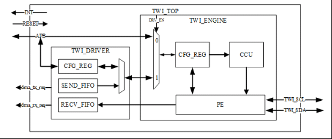

# TWI

## 模块介绍



TWI 控制器的框图如上所示，该控制器支持的标准通信速率为 100Kbps，最高通信速率可以达到 400Kbps。其中 CPUX 域的 TWI 控制器时钟源来自于 APB2，CPUS 域的 S‑TWI 时钟源来自于APBS。

TWI 传输数据的方式包括包传输和 DMA 运输。

## 模块配置

模块配置在 `menuconfig` 位于如下位置

```c
Kernel Setup --->
    Drivers Setup --->
        SoC HAL Drivers --->
            TWI devices --->
                [*] enable twi driver
```

TWI 模块寄存器的基本配置位于 `common_twi.h` 文件里面，包括每个 TWI 的寄存器地址和中断号，部分配置如下：

```c
/* TWI Register Offset */
#define TWI_ADDR_REG        (0x00)  /*  31:8bit reserved,7-1bit for slave addr,0 bit for GCE */
#define TWI_XADDR_REG       (0x04)  /*  31:8bit reserved,7-0bit for second addr in 10bit addr */
#define TWI_DATA_REG        (0x08)  /*  31:8bit reserved, 7-0bit send or receive data byte */
#define TWI_CTL_REG         (0x0C)  /*  INT_EN,BUS_EN,M_STA,INT_FLAG,A_ACK */
#define TWI_STAT_REG        (0x10)  /*  28 interrupt types + 0xF8 normal type = 29  */
#define TWI_CLK_REG         (0x14)  /*  31:7bit reserved,6-3bit,CLK_M,2-0bit CLK_N */
#define TWI_SRST_REG        (0x18)  /*  31:1bit reserved;0bit,write 1 to clear 0. */
#define TWI_EFR_REG         (0x1C)  /*  31:2bit reserved,1:0 bit data byte follow read command */
#define TWI_LCR_REG         (0x20)  /*  31:6bits reserved  5:0bit for sda&scl control*/
#define TWI_DVFS_REG        (0x24)  /*  31:3bits reserved  2:0bit for dvfs control. only A10 support. */
#define TWI_DRIVER_CTRL     (0x200)
...
```

TWI 模块对于不同平台的区分位于 `platform\twi_sun20iw3.h` 中。包括基地址以及平台相关参数

```c
/** the irq of each TWI **/
#ifdef CONFIG_ARCH_SUN20IW3
#define SUNXI_GIC_START 16
#else
#define SUNXI_GIC_START 0
#endif

/** the base address of TWI*/
#define SUNXI_TWI0_PBASE 0x02502000
#define SUNXI_IRQ_TWI0 (41 - SUNXI_GIC_START)
#define TWI0_SCK GPIOA(16)
#define TWI0_SDA GPIOA(17)
#define TWI0_PIN_MUXSEL 4

#define SUNXI_TWI1_PBASE 0x02502400
#define SUNXI_IRQ_TWI1 (42 - SUNXI_GIC_START)
#define TWI1_SCK GPIOA(6)
#define TWI1_SDA GPIOA(7)
#define TWI1_PIN_MUXSEL 4
...
```

## 源码结构

```c
rtos‑hal/
|‑‑hal/source/twi/hal_twi.c    /* hal层接口代码 */
|‑‑include/hal/sunxi_hal_twi.h    /* 头文件 */
```

## 模块接口说明

头文件：

```
#include <sunxi_hal_twi.h>
```

### TWI 端口号 twi_port_t

该数据结构主要用来表明 TWI 的编号，用户可以用来调用 TWI 的控制器。具体定义如下：

```
typedef enum
{
    TWI_MASTER_0,           /**< TWI master 0. */
    TWI_MASTER_1,           /**< TWI master 1. */
    TWI_MASTER_2,           /**< TWI master 0. */
    TWI_MASTER_3,           /**< TWI master 1. */
    TWI_MASTER_4,           /**< TWI master 4. */
    TWI_MASTER_5,           /**< TWI master 5. */
    S_TWI_MASTER_0,           /**< S_TWI master 0. */
    S_TWI_MASTER_1,           /**< S_TWI master 1. */
    S_TWI_MASTER_2,           /**< S_TWI master 2. */
    TWI_MASTER_MAX              /**< max TWI master number, \<invalid\> */
} twi_port_t;
```

### TWI 消息结构体 twi_msg_t

该数据结构是 TWI 通信时的消息结构，定义每个通信数据的格式：

```c
typedef struct twi_msg
{
    uint16_t addr;          /* slave address */
    uint16_t flags;
/* read data, from slave to master
 * TWI_M_RD is guaranteed to be 0x0001!
 */
#define TWI_M_RD        0x0001  
#define TWI_M_TEN       0x0010  /* this is a ten bit chip address */
    uint16_t len;           /* msg length */
    uint8_t *buf;       /* pointer to msg data */
} twi_msg_t;
```

###  TWI 控制结构体 hal_twi_transfer_cmd_t

该数据接口储存了一些用户在调用 twi_control 的时候可以用到的一些参数，具体如下：

```c
typedef enum
{
    I2C_SLAVE = 0,  /* 设置从机地址 */
    I2C_SLAVE_FORCE = 1, /* 强制设置从机地址 */
    I2C_TENBIT = 2,  /* 支持10位地址 */
    I2C_RDWR = 3 /* 读写支持 */
} hal_twi_transfer_cmd_t;
```

### TWI 频率结构体 twi_frequency_t

```c
typedef enum
{
    TWI_FREQUENCY_100K = 100000,          /**<  100kbps. */
    TWI_FREQUENCY_200K = 200000,          /**<  200kbps. */
    TWI_FREQUENCY_400K = 400000,          /**<  400kbps. */
} twi_frequency_t;
```

### TWi 返回值结构体

```
typedef enum
{
    TWI_STATUS_ERROR = -4,                        /**<  An error occurred and the transaction has failed. */
    TWI_STATUS_ERROR_BUSY = -3,                   /**<  The TWI bus is busy, an error occurred. */
    TWI_STATUS_INVALID_PORT_NUMBER = -2,          /**<  A wrong port number is given. */
    TWI_STATUS_INVALID_PARAMETER = -1,            /**<  A wrong parameter is given. */
    TWI_STATUS_OK = 0                             /**<  No error occurred during the function call. */
} twi_status_t;
```

### TWI 初始化接口

TWI 模块初始化，主要初始化时钟，中断以及引脚配置等

函数原型：

```c
twi_status_t hal_twi_init(twi_port_t port)
```

参数：

- port：TWI 端口号

返回值：

-  0 代表成功
- 负数代表失败


### TWI 控制接口

更改 TWI 的一些配置，包括从设备地址以及读写数据等

函数原型：

```c
twi_status_t hal_twi_control(twi_port_t port, hal_twi_transfer_cmd_t cmd, void *args)
```

参数：

- port：端口号
- cmd：控制参数
- args：传入的配置数据

返回值：

-  0 代表成功
- 负数代表失败


### TWI 数据发送接口

函数原型：

```c
twi_status_t hal_twi_write(twi_port_t port, unsigned long pos, const void *buf, uint32_t size)
```

参数：

- port：通道号
- pos：偏移量（目前支持 1 个字节大小）
- buf：待发送数据
- size：发送数据大小，不包括偏移量

返回值：

-  0 代表成功
- 负数代表失败


###  TWI 数据接收接口

函数原型：

```c
twi_status_t hal_twi_read(twi_port_t port, unsigned long pos, void *buf, uint32_t size)
```

参数：

- port：通道号
- pos：偏移量（目前支持 1 个字节大小）
- buf：接收的数据
- size：接收数据大小，不包括偏移量

返回值：

-  0 代表成功
- 负数代表失败


### TWI 去初始化接口

函数原型：

```c
twi_status_t hal_twi_deinit(twi_port_t port)
```

参数：

- port：TWI 端口号

返回值：

-  0 代表成功
- 负数代表失败


## 模块使用范例

```c
#include <stdio.h>
#include <stdlib.h>
#include <stdint.h>
#include <string.h>
#include <unistd.h>

#include <hal_log.h>
#include <hal_cmd.h>
#include <sunxi_hal_twi.h>

#define TEST_READ 0
#define TEST_WRITE 1

static int cmd_test_twi(int argc, const char **argv)
{
    twi_msg_t msg;
    twi_port_t port;
    uint16_t addr;
    char reg_addr, reg_val = 0, rw = TEST_READ;
    int c;

    if (argc < 5)
	{
        hal_log_info("Usage:");
        hal_log_info("\ttwi [port] [slave_addr] [reg] -r");
        hal_log_info("\t                              -w [val]");
        return -1;
    }

	hal_log_info("Run twi test");

    port = strtol(argv[1], NULL, 0);
    addr = strtol(argv[2], NULL, 0);
    reg_addr = strtol(argv[3], NULL, 0);
    if (argv[5])
    {
        reg_val = strtol(argv[5], NULL, 0);
    }

    while ((c = getopt(argc, (char *const *)argv, "rw")) != -1)
	{
        switch (c)
        {
            case 'r':
				hal_log_info("twi read test");
                rw = TEST_READ;
                break;
            case 'w':
				hal_log_info("twi write test");
                rw = TEST_WRITE;
                reg_val = strtol(argv[5], NULL, 0);
                break;
	default:
				hal_log_err("invalid param!");
        }
    }

    hal_twi_init(port);
    hal_twi_control(port, I2C_SLAVE, &addr);

    if (rw == TEST_READ)
    {
        hal_twi_read(port, reg_addr, &reg_val, 1);
        hal_log_info("reg_val: 0x%x", reg_val);
    }
    else if (rw == TEST_WRITE)
    {
        /*
         * hal_twi_write bug workaround
         */
        uint8_t buf[2];

        buf[0] = reg_addr;
        buf[1] = reg_val;
        msg.flags = 0;
        msg.addr =  addr;
        msg.len = 2;
        msg.buf = buf;

        hal_twi_control(port, I2C_RDWR, &msg);
    }

	hal_log_info("Twi test finish");

	//hal_twi_uninit(port);

	hal_log_info("Twi test1 finish");
    return 0;
}

FINSH_FUNCTION_EXPORT_CMD(cmd_test_twi, hal_twi, twi hal APIs tests)

```

