# 简介

R128是一颗专为“音视频解码”而打造的全新高集成度 SoC，主要应用于智能物联和专用语音交互处理解决方案。

- 单片集成 MCU+RISCV+DSP+CODEC+WIFI/BT+PMU，提供生态配套成熟、完善的用于系统、应用和网络连接开发的高效算力；
- 集成 8MB/16MB/32MB PSRAM，为音视频解码、大容量存储、扫码以及网络连接提供充裕的高容量、高带宽的内存支持；
- 拥有丰富的音频接口 IIS/PCM、OWA、DMIC、LINEOUT、MICIN 以及通用通讯接口 IIC、UART、SDIO、 SPI、ISO7816卡接口；同时支持 U 盘、SD卡、IR-TX/RX；
- 内置 LDO、GPADC、LEDC，简化系统方案设计，降低 BOM成本。

!> 文档目前正在施工，敬请期待


## 关于本文档

本文档为 R128 开放文档，包括芯片简述，环境搭建，快速入门，SDK手册等内容，方便快速掌握 R128 开发。

在线文档地址：https://yuzukihd.top/R128Module/

PDF文档下载：https://github.com/YuzukiHD/R128Module/releases

请注意，PDF文档并不是最新的，网页文档滚动更新可能不会及时同步PDF

| 文档   | 版本  |
| ------ | ----- |
| 网页端 | 0.4.5 |
| PDF    | 0.4.5 |

## 文档约定

### 地址与数据描述方法约定

本文档在描述地址、数据时遵循如下约定：

| 符号 | 例子                | 说明                                                         |
| ---- | ------------------- | ------------------------------------------------------------ |
| 0x   | 0x0200，0x79        | 地址或数据以16 进制表示。                                    |
| 0b   | 0b010，0b00 000 111 | 数据采用二进制表示(寄存器描述除外)。                         |
| X    | 00X，XX1            | 数据描述中，X 代表0 或1。<br />例如：00X 代表000 或 001；XX1 代表001，011，101 或111。 |

### 数值单位约定

本文档在描述数据容量（如NAND 容量）时，单位词头代表的是1024 的倍数；描述频率、数据
速率等时则代表的是1000 的倍数。具体如下：

| 类型                     | 符号 | 对应数值      |
| ------------------------ | ---- | ------------- |
| 数据容量（如 NAND 容量） | 1 K  | 1024          |
|                          | 1 M  | 1 048 576     |
|                          | 1 G  | 1 073 741 824 |
| 频率，数据速率等         | 1 K  | 1000          |
|                          | 1 M  | 1 000 000     |
|                          | 1 G  | 1 000 000 000 |


# 芯片简介

R128是一颗专为“音视频解码”而打造的全新高集成度 SoC，主要应用于智能物联和专用语音交互处理解决方案。

- 单片集成 MCU+RISCV+DSP+CODEC+WIFI/BT+PMU，提供生态配套成熟、完善的用于系统、应用和网络连接开发的高效算力；
- 集成 8MB/16MB/32MB PSRAM，为音视频解码、大容量存储、扫码以及网络连接提供充裕的高容量、高带宽的内存支持；
- 拥有丰富的音频接口 IIS/PCM、OWA、DMIC、LINEOUT、MICIN 以及通用通讯接口 IIC、UART、SDIO、 SPI、ISO7816卡接口；同时支持 U 盘、SD卡、IR-TX/RX；
- 内置 LDO、GPADC、LEDC，简化系统方案设计，降低 BOM成本。

## 芯片应用场景


## 芯片实物图


## 芯片框图


## 芯片特性

- **CPU Architecture**
  - XuanTie C906 64-bit RISC-V CPU up to 600 MHz 
    - 32 KB I-cache + 32 KB D-cache

  - ARM Cortex M33 Star@240 MHz MCU 
    - 32 KB I-cache + 32 KB D-cache
    - TrustZone 

-  **DSP Architecture**
  - HiFi5 Audio DSP@400 MHz 
    - 32 KB I-cache + 32 KB D-cache 

- **Memory Subsystem**
  -  **PSRAMC** 
    - Up to 2 PSRAM controllers (HS_PSRAMC, LS_PSRAMC) 
    - HS_PSRAMC:
      - 8 MB OPI PSRAM for R128-S1/R128-S2.
      - 32 MB OPI PSRAM for R128-S3. 
      - Supports AP memory PSRAM 
      - Supports 64 Mbit/256 Mbit PSRAM 
      - Supports OPI as the interface of PSRAM 
      - Supports the auto-refreshing and self-refreshing of PSRAM 
      - Supports up to 800 MHz PSRAM. The ratio of PSRAM controller and PSRAM clock is 1:4. 
      - Supports indirectly accessing the registers of PSRAM through interface configuration 
      - Supports caching reading/writing commands through CAM 
      - Supports out-of-order execution of commands 
      - Supports prefetching read passage 

    - LS_PSRAMC:
      - 8 MB OPI PSRAM for R128-S2 
      - Supports any frequency ratio of AHB and OPI clock 
      - Supports CPU/DMA to operate PSRAM through SBUS 
      - Supports PSRAM Wrap Mode (enter/exit) 
      - Supports APmemory APS3208 and APS6408 and Winbond W95*8 
      - Supports 4 offset address ranges 
      - Supports CBUS out-of-order reading/writing and XIP code execution 

  - **SMHC** 
    - Compatible with Secure Digital Memory (SD mem-version 2.0) 
    - Compatible with Secure Digital I/O (SDIO-version 3.0) 
    - Compatible with embedded MultiMediaCard (eMMC-version 5.0) 
    - Supports Card insertion and removal interrupt 
    - Supports hardware CRC generation and error detection 
    - Supports programmable baud rate 
    - Supports SDIO interrupts in 1-bit and 4-bit modes 
    - Supports block size of 1 to 65535 bytes 
    - Supports descriptor-based internal DMA controller 
    - Internal 1024-Bytes RX FIFO and 1024-Bytes TX FIFO 
    - Supports 1-bit, 4-bit SD and SDIO data bus width 
    - Supports 1-bit, 4-bit eMMC data bus width 

  - **Flash Controller & Flash Encryption**
    - Supports arbitrary frequency ratio of AHB clock and SPI clock 
    - Supports 4 segments of offset address range 
    - Supports receiving and transmitting in 1/2/4-wire SPI 
    - Supports up to `2^32Bytes` Nor-Flash (the common capacity is 64 MB, 128 MB and 256 MB) and 
    - large-capacity flash 
    - Supports flash programing and reading by configuring registers (SBUS) 
    - Supports out-of-order reading CBUS and running codes through XIP 
    - Supports continuous reading mode (enter/exit) and wrap mode (enter/exit) 
    - Supports the basic operation of SPI flash 
    - Supports 8 Mb SIP Nor Flash (for R128-S1) and 16 Mb SIP Nor Flash (for R128-S2) 
    - Supports real-time AES encoding and decoding when reading and writing data through SBUS data andreading data through CBUS

-  **System**
  - **PMU** 
    - Supports 2.2 V-5 V external single supply
    - Integrates DCDC/LDO and other power modules, and power all circuits within the IC
    - The internal digital circuit is divided into power domains. Each of them has independent power switch,which is determined by system low-power status.
    - Supports standby, hibernation and other low-power modes, which can be switched over by PMU.
    - Manages the opening and close of analog modules like DCDC/LDO, DCXO/DPLL. The starting duration is configured by the software.

  -  **GPRCM** 
    - Manages the power of this system
    - Manages the reset of each system
    - Manages the OSC clock

  - **CCU**
    - Up to 2 CCU controllers (CCU, CCU_AON)
    - CCU: 
      - Supports configuring module clock
      - Supports clock output control
      - Supports bus clock gating
      - Supports bus software reset

    - CCU_AON: 
      - Supports managing the OSC clock
      - Supports bus source and divisions
      - Supports configuring modules clock
      - Supports clock output control
      - Supports bus clock gating
      - Supports bus software reset

  - **BROM** 
    - On-chip memory 
    - Supports system boot from the following devices: 
      - SD/eMMC 
      - SPI Nor Flash 
      - SPI Nand Flash 

    - Supports secure boot and normal boot 
    - Secure brom supports load only certified firmware 
    - Secure brom ensures that the secure boot is a trusted environment 
    - Supports USB eFEX protocol and UART mboot protocol for firmware upgrade 

  - **DMAC**
    - Up to 2 DMACs 
    - Up to 16 DMA channels 
    - Provides 32 peripheral DMA requests for data reading and 32 peripheral DMA requests for data writing
    - Supports transferring data with a linked list 
    - Supports programmable 8-bit, 16-bit, 32-bit, and 64-bit data width 
    - Supports programmable DMA burst length 
    - DRQ response includes the waiting mode and handshake mode 
    - DMA channel support pause function 
    - Memory devices support non-aligned transfer 

  - **Timer** 
    - 8 timers: 5 for SW domain and 3 for AON domain 
    - Configurable counting clock: LOSC and OSC40M. Whether LOSC is internal low-frequency clock or external low-frequency clock (with greater accuracy) depends on LOSC_SRC_SEL. 
    - Supports 8 prescale factors 
    - Programmable 32-bit down timer 
    - Supports two timing modes: periodic mode and single counting mode 
    - Generates an interrupt when the count is decreased to 0 

  - **Watchdog** 
    - Up to 4 watchdogs, and one of them is secure world watchdog 
    - HOSC_32K clock sources and 32K system 
    - Supports 12 configurable initial count value 
    - Supports generating timeout interrupt 
    - Supports outputting reset signal 
    - Supports restarting timer 

  -  **RTC** 
    - Implements time counter and timing wakeup 
    - Provides counters for counting year, month, day, hour, minute, and second 
    - 4-channel clock sources: hosc_32K, rccal_32K, rcosc, losc_clk 
    - Configures initial value by software anytime 
    - Supports timing alarm, and generates interrupt and wakes up the PMU system 

  -  **Message Box**
    - Supports 3 CPU to transmit information through channels. Each CPU has a MSGBOX. 
      - CPU0: ARM CPU 
      - CPU1: RISC-V 
      - CPU2: DSP

    - There are four channels every two CPU, and the FIFO depth of one channel is 8 x 32 bits. 
    - Supports interrupts 

  - **Spinlock** 
    - Supports 32 lock units 
    - Two kinds of lock status: locked and unlocked 
    - Lock time of the processor is predictable (less than 200 cycles) 

- **Video and Graphics** 
  - **DE**
    - Supports output size up to 1024x1024 pixels 
    - Supports two alpha blending UI channels for main display 
    - Supports four overlay layers in each channel, and channel0 has an independent scaler 
    - Supports potter-duff compatible blending operation 
    - Supports input format ARGB8888/XRGB8888/RGB888/ARGB4444/ARGB1555/RGB565 
    - Supports SmartColor2.0 for excellent display experience 
      - Fully programmable color matrix 
      - Dynamic gamma 
    - Supports write back only for verification 
  -  **G2D** 
    - Supports layer size up to 1024x1024 pixels 
    - Supports pre-multiply alpha image data 
    - Supports color key 
    - Supports two pipes Porter-Duff alpha blending 
    - Supports multiple video formats 4:2: 0, 4:2:2, 4:1:1 and multiple pixel formats (8/16/24/32 bits graphics layer) 
    - Supports any format convert function above 
    - Supports 1/16× to 32× resize ratio
    - Supports 32-phase 8-tap horizontal anti-alias filter and 32-phase 4-tap vertical anti-alias filter. 
    - Supports window clip 
    - Supports FillRectangle, BitBlit, StretchBlit and MaskBlit 
    - Supports horizontal and vertical flip, clockwise 0/90/180/270 degree rotate for normal buffer 
  
-  **Video Input Interfaces**
  - **CSI & JPEG** 
    - CSI:
      - Supports YUV422 format input and YUV420 format NV12 output 
      - Supports scaling image down 1/2 and cropwin 
      - Supports receiving JPEG streams directly output by sensor 
      - Supports receiving the images with unconventional resolutions (X and Y can be an integer multiple of 16, such as: 192\*192, 304\*224) 
      - Supports receiving the images with conventional resolutions (such as 128\*128, 256\*256, 320\*240, 640\*480, 1280\*720, 1920\*1088) 
    - JPEG: 
      - Supports 640\*480@60fps in the online mode, and 640\*480@30fps in the offline mode 
      - Supports 1280\*720@40fps in the online mode, and 1280\*720@20fps in the offline mode 
      - Supports up to 1920\*1088 online/offline encoding 
      - Supports encoding after scaling images down 1/2 and cropwin 
      - Supports block output in the online mode to reduce SRAM usage and improve bandwidth utilization ratio 
      - Supports online/offline encoding (such as 192\*192 and 304\*224) the images with non-conventional resolution 
      - Supports the online/offline encoding the images with conventional resolution images 
  
-  **Video Output Interfaces** 
  
  -  **TCON_LCD** 
    - Supports RGB interface with DE/SYNC mode, up to 1024x768@60fps 
    - Supports serial RGB/dummy RGB interface, up to 800x480@60fps 
    - Supports i8080 interface, up to 800x480@60fps 
    - Supports BT656 interface for NTSC and PAL 
    - Supports RGB666 and RGB565 with dither function
  -  **SPI DBI**
    -  Supports DBI Type C 3 Line/4 Line Interface Mode 
    -  Supports 2 Data Lane Interface Mode 
    -  Supports data source from CPU or DMA 
    -  Supports RGB111/444/565/666/888 video format 
    -  Maximum resolution of RGB666 240 x 320@30Hz with single data lane 
    -  Maximum resolution of RGB888 240 x 320@60Hz or 320 x 480@30Hz with dual data lane 
    -  Supports tearing effect 
    -  Supports software flexible control video frame rate 
  
- **Audio Interfaces** 

  - **Audio Codec** 

    - HiFi Audio ADC 
      - 3-channel ADCs @ 24-bit 
      - Up to 95 dB SNR during ADC recording path (signal through PGA and ADC with A-weighted filter) 
      - 3 fully-differential analog microphone inputs with 0 dB~30 dB amplifier gain 
      - Supports sample rates ranging from 8 kHz to 96 kHz 
      - Digital volume control with 0.5 dB step 
      - Digital high-pass filter 
      - 128x24-bit FIFO for recording received data 
    - HiFi Audio DAC 
    
      - 2-channel DACs @ 24-bit (for R128-S1 and R128-S2) 
      - 1-channel DAC @ 24-bit (for R128-S3) 
      - Up to 105 dB SNR in the DAC playback path (signal through DAC and lineout with A-weighted filter) 
      - Supports sample rates ranging from 8 kHz to 384 kHz 
      - Digital volume control with 0.5 dB step 
      - 20-band Biquads filter for EQ 
      - 3-band dynamic range control 
      - 128x24-bit FIFO for playing transmitted data
      - Three differential microphone inputs: MICIN1P/N, MICIN2P/N, MICIN3P/N. 
      - Two stereo LINEOUT outputs: LINEOUTLP/N and LINEOUTRP/N (for R128 S1 and R128 S2) 
      - One single-end LINEOUT output: LINEOUTLP/N (for R128 S3) 
      - Built-in audio PLL with flexible clocking scheme 
      - DMA and interrupt support both receiving and transmitting 
      - Integrated ALDO for analog part 
      - One low-noise analog microphone bias output three audio inputs 
    - **I2S/PCM** 
    
      - Compliant with standard Philips Inter-IC sound (I2S) bus specification 
        - Left-justified, Right-justified, PCM mode, and TDM (Time Division Multiplexing) format 
        - Programmable PCM frame width: 1 BCLK width (short frame) and 2 BCLKs width (long frame) 
      - Transmit and Receive data FIFOs 
        - Programmable FIFO thresholds 
        - 128 depth x 32-bit width TXFIFO, 64 depth x 32-bit width RXFIFO 
      - Supports multiple function clock 
        - Clock up to 24.576MHz Data Output of I2S/PCM in Master mode (Only if the IO PAD and Peripheral I2S/PCM satisfy Timing Parameters) 
        - clock up to 12.288MHz Data Input of I2S/PCM in Master mode 
      - Supports TX/RX DMA Slave interface 
      - Supports Multiple application scenarios 
        - Up to 16 channel (fs = 48 kHz) which has adjustable width from 8-bit to 32-bit 
        - Sample rate from 8 kHz to 384 kHz (CHAN = 2) 
        - 8-bits u-law and 8-bits A-law companded sample 
      - Supports Master/Slave mode 
    - **DMIC** 
      - Supports up to 8 channels 
      - Sample rate from 8 kHz to 48 kHz 
    - **OWA**
      - In compliance with S/PDIF Interface 
      - Compatible with standard IEC-60958 and IEC-61937 
        - IEC-60958 supports 16-bit, 20-bit and 24-bit data formats 
        - IEC-61937 uses the IEC-60958 series for the conveying of non-linear PCM bit streams, each sub-frame transmits 16-bit 
      - TXFIFO and RXFIFO 
        - One 128×24bits TXFIFO and one 64×24bits RXFIFO for audio data transmission 
        - Programmable FIFO thresholds 
      - Supports TX/RX DMA slave interface
      - Supports multiple function clock 
        - Separate clock for OWA TX and OWA RX 
        - The clock of TX function includes a series of 24.576 MHz and 22.579 MHz frequency
        - The clock of RX function includes a series of 24.576\*8 MHz frequency (RX function clock 24.576\*8 MHz supports CDR of sample rate from 8 kHz to 192 kHz) 
      - Supports hardware parity on TX/RX
        - Hardware parity generation on the transmitter 
        - Hardware parity checking on the receiver 
      - Supports channel status capture for the receiver 
      - Supports channel sample rate capture on the receiver 
      - Supports insertion detection for the receiver 
      - Supports channel status insertion for the transmitter 
      - Supports interrupts and DMA 
  
-  **Security Subsystem** 

  - **Crypto Engine** 
    - Supports Symmetrical Algorithm: AES, DES, 3DES 
    - Supports 128-bits, 192-bits and 256-bits key size for AES 
    - Supports ECB, CBC, CTR, CTS, OFB, CFB modes for AES 
    - Supports 1, 8, 64, 128bit width for AES-CFB 
    - Supports 16bit, 32bit, 64bit, 128bit wide size for AES CTR 
    - Supports ECB, CBC, CTR, CBC_MAC modes for DES/3DES 
    - Supports 16bit, 32bit, 64bit wide size for DES/3DES CTR 
    - Supports Hash Algorithms: MD5, SHA1, SHA224, SHA256, SHA384, SHA512, HMAC 
    - Supports multi-package mode for MD5, SHA1, SHA224, SHA256, SHA384, SHA512 
    - Supports Asymmetrical Algorithm: RSA512/1024/2048bit 
    - Supports internal DMA Controller for data transmission with memory 
    - Supports secure and non-secure interfaces respectively 
    - Supports accessing Secure and non-secure interfaces by non-secure host when secure_mode is 0 

  -  **SMC** 
    - The SMC (GSecure Memory Control) is always secure, only secure CPU can access the SMC 
    - Sets secure area of HSPSRAM 
    - Sets secure property that Master accesses to HSPSRAM 

  -  **SPC** 
    - The SPC (Secure Peripherals Control) is always secure, only secure CPU can access the SPC 
    - Sets secure property of peripherals 
    - Supports safety access of flash controller 

- **USB2.0 DRD** 

  - Complies with USB 2.0 Specification 
  - Supports High-Speed (HS, 480-Mbps), Full-Speed (FS, 12-Mbps), and Low-Speed (LS, 1.5-Mbps) in Host mode 
  - Supports High-Speed (HS, 480 Mbps), Full-Speed (FS, 12 Mbps) in Device mode 
  - Supports the UTMI+ Level 3 interface. The 8-bit bidirectional data buses are used 
  - Supports bi-directional endpoint0 for Control transfer 
  - Supports up to 8 User-Configurable Endpoints for Bulk, Isochronous and Interrupt bi-directional transfers (Endpoint1, Endpoint2, Endpoint3, Endpoint4) 
  - Supports up to (4KB+64Bytes) FIFO for EPs (Including EP0) 
  - Supports High-Bandwidth Isochronous & Interrupt transfers 
  - Automated splitting/combining of packets for Bulk transfers 
  - Supports point-to-point and point-to-multipoint transfer in both Host and Peripheral mode 
  - Includes automatic ping capabilities 
  - Soft connect/disconnect function 
  - Performs all transaction scheduling in hardware 
  - Power Optimization and Power Management capabilities 
  - Includes interface to an external Normal DMA controller for every Eps 

-  **UART** 

  - Compatible with industry-standard 16450/16550 UARTs 
  - 64-Byte Transmit and receive data FIFOs 
  - Supports DMA controller interface 
  - Supports Software/ Hardware Flow Control 
  - Supports IrDA 1.0 SIR 
  - Supports RS-485 mode 

- **SPI** 

  - Up to 2 SPI controllers (SPI0, SPI1) 
  - The SPI0 only supports SPI mode. The SPI1 supports SPI mode and display bus interface (DBI) mode 
  - Full-duplex synchronous serial interface 
  - Master/slave configurable 
  - 8-bit wide by 64-entry FIFO for both transmitting and receiving data 
  - Polarity and phase of the Chip Select (SPI_SS) and SPI Clock (SPI_SCLK) are configurable 
  - Supports interrupts and DMA 
  - Supports mode0, mode1, mode2, and mode3 
  - Supports 3-wire/4-wire SPI 
  - Supports programmable serial data frame length: 0 bit to 32 bits 
  - Supports standard SPI, dual-output/dual-input SPI, dual I/O SPI, quad-output/quad-input SPI 
  - Supports maximum IO rate of the mass production: 100 MHz 
  - Supports 5 clock sources, Interrupt or DMA 

- **TWI** 

  - Supports 2 TWIs 
  - Software-programmable for Slave or Master 
  - Supports Repeated START signal 
  - Allows 10-bit addressing with TWI bus 
  - Performs arbitration and clock synchronization 
  - Owns address and General Call address detection 
  - Interrupt on address detection 
  - Supports speeds up to 400 kbits/s in fast mode 
  - Allows operation from a wide range of input clock frequencies 
  - TWI Driver Supportss packet transmission and DMA when TWI works in Master mode 

- **PWM** 

  - Supports 8 independent PWM channels (PWM0 to PWM7) 
    - Supports PWM continuous mode output 
    - Supports PWM pulse mode output, and the pulse number is configurable 
    - Output frequency range: 0 to 24 MHz or 0 to 100 MHz 
    - Various duty-cycle: 0% to 100% 
    - Minimum resolution: 1/65536 

  - Supports 4 complementary pairs output
    - PWM01 pair (PWM0 + PWM1), PWM23 pair (PWM2 + PWM3), PWM45 pair (PWM4 + PWM5), PWM67 pair (PWM6 + PWM7) 
    - Supports dead-zone generator, and the dead-zone time is configurable 

  - Supports 4 groups of PWM channel output for controlling stepping motors 
    - Supports any plural channels to form a group, and output the same duty-cycle pulse 
    - In group mode, the relative phase of the output waveform for each channel is configurable 

  - Supports 8 channels capture input 
    - Supports rising edge detection and falling edge detection for input waveform pulse
    - Supports pulse-width measurement for input waveform pulse 

- **GPADC** 

  - 12-bit Resolution and 10-bit effective SAR type A/D converter 
  - 9-channel multiplexer including 7 channels general purpose ADC (ADC0-ADC6) and 2 channels special ADC (ADC8, ADC12) for R128-S1 and R128-S2 
  - 10-channel multiplexer including 8 channels general purpose ADC (ADC0-ADC7) and 2 channels special 
  - ADC (ADC8, ADC12) for R128-S3 
  - The ADC8 is used for VBAT voltage detection and the ADC12 is used for temperature sensor 
  - 64 FIFO depth of data register 
  - Power Supply Voltage: 2.5V, Analog Input Range: 0 to 2.5V 
  - Maximum Sampling frequency: 1 MHz 
  - Support self-calibration 
  - Support data compare and interrupt 
  - Support four operation modes 
    - Single conversion mode
    - Single-cycle conversion mode 
    - Continuous conversion mode
    - Outbreak conversion mode 

- **CIR Receiver** 

  - Supports CIR remote control receiver 
  - Supports NEC IR protocol 
  - 64x8 bits RX FIFO for data buffer 
  - Programmable RX FIFO thresholds 
  - Supports interrupt 
  - Sample clock up to 1 MHz 

- **CIR Transmitter**

  - Supports CIR remote control transmitter 
  - 128 Bytes FIFO for data buffer 
  - Configurable carrier frequency 
  - Supports Interrupt and DMA 
  - Supports handshake mode and waiting mode of DMA

- **LEDC**

  - Configurable LED input high-/low-level width 
  - Configurable LED reset time 
  - LEDC data supports DMA configuration mode and CPU configuration mode 
  - Maximum 1024 LEDs serial connect 
  - LED data transmission rate up to 800 kbit/s 
  - Configurable RGB display mode 
  - Configurable default level of non-data output 

-  **SCR** 

  - Supports the ISO/IEC 7816-3:1997(E) and EMV2000 (4.0) Specifications 
  - Performs functions needed for complete smart card sessions, including: 
    - Card activation and deactivation 
    - Cold/warm reset 
    - Answer to Reset (ATR) response reception 
    - Data transfers to and from the card 

  - Supports adjustable clock rate and bit rate 
  - Configurable automatic byte repetition 
  - Supports commonly used communication protocols: 
    - T=0 for asynchronous half-duplex character transmission
    - T=1 for asynchronous half-duplex block transmission 

  - 128bits FIFO for data transmit & receive 
  - Supports FIFOs for receive and transmit buffers (up to 128 bits) with threshold 
  - Supports configurable timing functions: 
    - Smart card activation time 
    - Smart card reset time
    - Guard time 
    - Timeout timers 

  - Supports synchronous and any other non-ISO 7816 and non-EMV cards 

- **Wi-Fi MAC** 

  - 802.11d: Regulatory domain operation 
  - 802.11e: QoS including WMM 
  - 802.11h: Transmit power control dynamic and frequency selection 
  - 802.11i: Security including WPA2 compliance
  - 802.11w: Supports STA Mode with PMF, SA Query, SAE 
  -  **Wi-Fi Baseband** 
    - Compatible with IEEE 802.11 b/g/n standard on 2.4 GHz 
    - Up to 20 MHz bandwidth 
    - MCS0-7 data rate for 802.11n 
    - 6 MB-54MB data rate for 802.11g 
    - DSSS, CCK modulation with long and short preamble 
    - Short Guard Interval 
    - Long Guard Interval 
    - RX antenna Diversity 
    - Supports RX STBC 

  - **Wi-Fi Radio** 
    - Integrated 2.4GHz PA, LNA, and T/R switch 
    - Internal impedance matching network and harmonic filter allow chip to connect to antenna directly
    - High Power Amplifier with 3 V-5.5 V full range directly support XRADIOTECH's MPDTM technology ensure linearity tracking automatically to always keep EVM and mask within specifications 
    - Special Architecture and Device design to keep the reliability of PA and also deliver high output power (>25 dBm) 

- **Bluetooth Subsystem**
  - BLE V5.0 
    - Bluetooth 5.0 Dual Mode complies with V2.1/4.0/4.2/5.0" 
    - Supports GFSK, pi/4 DQPSK, and 8DPSK modulation 
    - Data rates support: 125Kbps, 500Kbps, 1Mbps, 2Mbps 
    - supports long range 
    - TRNG generator 
    - AES-128 data encryption with ECB and CCM mode 
    - Supports advertising extension 
    - Packet assembly and disassembly 
    - Data Whitening and De-whitening 
    - Data CRC generation and checking 
    - Packet filtering based on filter policies (white and resolving lists) 
    - Private address generation and Accelerate address resolution 
    - Access address generation and matching 
    - Frequency hopping and channel mapping 
    - RSSI Reporting to host
    
  - BR/EDR 
    - Adaptive Frequency Hopping 
    - SCO and eSCO support 
    - 1, 3 and 5 slots all packet types support 
    - Transcoders for A-law, µ-law and CVSD voice over air 
    - Supports piconet and scatternet 
    - Secure simple pairing 
    - Supports sniff/sniff subrating low power mode 
  - Transmits Power: -20 dBm (0.01 mW) to +10 dBm (10 mW) 
  - Receiver Sensitivity: 
    - 95.0 dBm@BR 
    - 98 dBm@BLE 1 Mbit/s 
    - 105 dBm@BLE S = 8 
- **Package** 
  - QFN80 balls, 0.35mm ball pitch, 8mm x 8mm body


## 不同版本芯片的区别

R128 共有R128-S1、R128-S2 和R128-S3 三个型号，各型号具体配置差异如下表：

| Contents       | R128-S1                                        | R128-S2                                        | R128-S3                      |
| -------------- | ---------------------------------------------- | ---------------------------------------------- | ---------------------------- |
| CPU            | M33 + C906                                     | M33 + C906                                     | M33 + C906                   |
| DSP            | HiFi5                                          | HiFi5                                          | HiFi5                        |
| PSRAM          | 8MB HS-PSRAM                                   | 8MB HS-PSRAM + 8MB LS-PSRAM                    | 32MB HS-PSRAM                |
| FLASH          | 8MB                                            | 16MB                                           | /                            |
| DAC            | 2 Audio DAC<br />LINEOUTLP/N <br />LINEOUTRP/N | 2 Audio DAC<br />LINEOUTLP/N <br />LINEOUTRP/N | 1 Audio DAC<br />LINEOUTLP/N |
| GPADC Channels | 7                                              | 7                                              | 8                            |
| Package        | QFN80 8*8mm 0.35pitch                          | QFN80 8*8mm 0.35pitch                          | QFN80 8*8mm 0.35pitch        |

请注意，R128-S1、R128-S2引脚封装是相同的，而 R128-S3 与R128-S1、R128-S2是不同的。具体请参照《R128_PINOUT.xlsx》


# 手册与资料

## 芯片手册

- [R128_Product_Brief_V1.2.pdf](https://github.com/YuzukiHD/R128Module/blob/master/docs/assets/datasheets/R128_Product_Brief_V1.2.pdf)


## CPU手册

- Arm Cortex-M33 核心手册： [Arm® Cortex®-M33 Processor Technical Reference Manual](https://developer.arm.com/documentation/100230/latest/)
- XuanTie C906 核心手册：[T-Head XuanTie C906 Processor Datasheet](https://xuantie.t-head.cn/product/xuantie/3817197695983423488)


## DSP 相关

- HIFI 5 DSP 相关：[HiFi 5 DSP](https://www.cadence.com/en_US/home/tools/ip/tensilica-ip/hifi-dsps/hifi-5.html)
- Xtensa Xplorer 下载地址：[Xplorer Software (SDK) Download](https://www.cadence.com/en_US/home/tools/ip/tensilica-ip/sdk-download.html)
- Xtensa Xplorer 授权申请： [Cadence Tensilica Offerings](https://www.cadence.com/en_US/home/tools/ip/tensilica-ip/technologies.html)
- Xtensa Xplorer 试用申请：[request an evaluation license](https://www.cadence.com/en_US/home/tools/ip/tensilica-ip/tensilica-sdk-evaluation-request-form.html)


!> 其余手册将在发布后上传


# 测试固件下载

- [R128-S2测试固件20230321](https://www.aw-ol.com/downloads/resources/88)


# 芯片硬件设计指南

## 原理图设计

### 硬件系统框图

R128是一颗专为“音视频解码”而打造的全新高集成度 SoC，主要应用于智能物联和专用语音交互处理解决方案。

- 单片集成 MCU+RISCV+DSP+CODEC+WIFI/BT+PMU，提供生态配套成熟、完善的用于系统、应用和网络连接开发的高效算力；
- 集成 8MB/16MB/32MB PSRAM，为音视频解码、大容量存储、扫码以及网络连接提供充裕的高容量、高带宽的内存支持；
- 拥有丰富的音频接口 IIS/PCM、OWA、DMIC、LINEOUT、MICIN 以及通用通讯接口 IIC、UART、SDIO、 SPI、ISO7816卡接口；同时支持 U 盘、SD卡、IR-TX/RX；
- 内置 LDO、GPADC、LEDC，简化系统方案设计，降低 BOM成本。


### 硬件系统基本工作原理

R128硬件系统基本工作流程如下：

- 硬件系统正常上电，主控复位之后，CPU开始执行 BROM固化代码，对系统资源和关键外设进行配置及初始化，包括电源，时钟，总线，复位，存储接口等。
- 根据配置，在 BROM阶段将系统初始化信息（串口、PSRAM等）从存储介质读取到系统 SRAM，进行芯片及系统的进一步详细配置和初始化工作；执行完 Boot0 程序后进入 boot 阶段。
- 从外部存储介质中读取下一阶段需要的软件代码，启动操作系统，并对系统资源和外设进行管理。
- 操作系统启动之后，根据产品不同需求加载相关启动，比如 USB、音频、WIFI、显示、蓝牙等模块，最终完成开机启动，进入普通操作界面。
- 系统支持 watchdog 应用监视系统的运行，当程序跑飞或者发生死循环时，watchdog模块会发出一个复位信号，使 SOC复位，软件系统重新启动。

R128硬件系统组成如下表：

| 系统           | 说明                                                         |
| -------------- | ------------------------------------------------------------ |
| CPU小系统      | 时钟，复位，中断，系统配置                                   |
| 存储系统       | PSRAM，SPI NAND/SPI NOR/EMMC/SD CARD                         |
| 音频系统       | MIC IN、FMIN、IIS/PCM/TDM、DMIC、LINEOUT                     |
| 输入输出子系统 | RGB、SD CARD、USB OTG/HOST、TWI、UART、PWM、GPADC、TPADC、CSI、 IR TX/RX 等 |
| 电源系统       | DCDC、LDO                                                    |
| 无线           | WIFI/BT                                                      |
| 其他           | 功放、LED                                                    |

### CPU小系统

R128 CPU小系统包括时钟系统，系统配置 PIN、复位系统和 Debug 部分。

#### 时钟系统信号PIN说明

R128 硬件系统包含 DCXO 40M/RTC 32.768K 两个时钟，对应时钟信号说明如表所示。

| 信号名    | 信号描述     | 应用说明                             |
| --------- | ------------ | ------------------------------------ |
| HXTAL_IN  | DCXO晶振输入 | 默认使用 40M晶振，频率误差为 10PPM； |
| HXTAL_OUT | DCXO晶振输出 | 默认使用 40M晶振，频率误差为 10PPM； |
| LXTAL_IN  | 32K晶振输入  | 32.768K晶振电路，频率误差为 20PPM    |
| LXTAL_OUT | 32K晶振输出  | 32.768K晶振电路，频率误差为 20PPM    |

!> RTC 32.768K时钟可以从内部 RC振荡电路产生，可不使用外部 32K晶振。

#### 小系统配置说明

R128小系统配置 PIN说明如表所示。

| 信号名   | 信号说明                     | 应用说明                                        |
| -------- | ---------------------------- | ----------------------------------------------- |
| RESET    | system reset                 | 1，系统复位 PIN<br/>2，Watchdog 输出 PIN        |
| CHIP-PWD | Chip power down/System reset | 1，内部 PMU 下电控制 pin；<br />2，系统复位 pin |
| PA1/FEL0 | FEL功能选择 pin 0            | 当[FEL0,FEL1]= 00时，SOC进入 FEL升级状态        |
| PA2/FEL1 | FEL功能选择 pin 1            | 当[FEL0,FEL1]= 00时，SOC进入 FEL升级状态        |

- RESET和 CHIP-PWD均可实现系统复位功能，但 CHIP-PWD包含 R128内部 PMU掉电控制功能，可让R128实现上电复位功能。
- RESET/CHIP-PWD信号上接下地电容默认为 1nF，用于滤波和增强 ESD 防护能力
- 为避免 SOC启动时误进入升级状态，PA1/FEL0和 PA2/FEL1 不能同时接下拉电阻。

#### 主晶振电路

- R128 DCXO模块推荐使用 40M 晶振以获得更好的射频性能。
- 晶振选型参考如下:
  - R128集成 WIFI/BT功能，为获得更好的射频性能，建议晶振选型频率容限与频率稳定性均≤ 10ppm
  - 晶体负载电容指标 CL，建议 CL≥10pF。CL过小会导致晶体温飘过大
  - 晶体驱动能力 DL，建议典型值 100uW，最大不超过 200uW。取值过小会影响晶体寿命。
- 外挂匹配电容大小根据晶振规格和 PCB而定，要求匹配电容+板级杂散电容总值等于晶振规格要求的负载电容大小。
- 串接电阻需要预留位置，便于调试振荡幅度处理 EMI 问题。


!> 晶振参数不得随意更改，需保证晶体自身负载电容、外挂匹配电容、PCB走线负载电容三者匹配。

#### 32.768K时钟电路

- 支持内部 RCOSC时钟，支持 HOSC校准，满足 32.768K时钟输出。
- 外挂 32.768K 晶振时，外挂匹配电容大小根据晶振规格和 PCB而定，要求匹配电容+板级杂散电容总值等于晶振规格要求的负载电容大小。
- LXTAL_IN/LXTAL_OUT 之间并接的电阻，必须保留，用于对频率微调。


!> 晶振参数不得随意更改，需保证晶体自身负载电容、外挂匹配电容、PCB走线负载电容三者匹配。

#### 复位电路设计

R128可以选择使用外部复位 IC提供复位信号，也可以使用内部复位源。

- 内部上电复位触发门槛：VBAT爬升至约 2.4V；
- 内部下电复位触发门槛：VBAT跌落至 3.0V/2.9V/2.8V/2.7V/2.6V/2.5V(软件可配置)，详见 R128用户手册；
- 使用外部复位 IC 复位，时长不得低于 64ms；
- RESET Pin放置 1nF电容。


#### DEBUG电路设计

R128支持 USB（OTG）、UART、JTAG与 SWD 等多种调试方式，客户可根据需要选择合适的调试方式，建议在设计时对相应的调试接口预留测试点方便后续调试验证。


### 电源系统设计

#### SOC端电源质量要求

R128集成 PMU，外部仅需提供 VBAT 电源即可满足 R128 电源应用需求，其他电源由内部 PMU 产生。

#### SOC端电源电容设计

R128 SOC端各电源要求滤波电容容值如下：

- VDD_LX管脚建议预留放置 1个 2.2uF电容；
- VDD_SENSE管脚建议放置 1个 4.7uF电容；

- VDD_CLK、VDD18_ANA1、VDD18_TX1、VDD18_ANA2、VDD18_TX2电源 pin建议各放置 1个 100nF电容，靠近管脚放置；


- VDD_DSP建议放置 1个 1uF电容，靠近管脚放置；
- VDD_RTC建议放置 1个 1uF电容，靠近管脚放置；

- VDD_SYS1、VDD_SYS2建议各放置 1 个 1uF电容，靠近管脚放置；
- VDD_AON建议放置 1个 1uF电容，VDD12_PSM 建议放置 1 个 100nF 电容，靠近管脚放置；

- VDD_3V3建议放置 1个 1uF电容， VDD33_LB1、VDD33_LB2 建议各放置 1 个 100nF 电容，靠近管脚放置；
- VDD_IO1、VDD_IO2、VDD_IO_5VTOL建议各放置 1 个 100nF 电容，靠近管脚放置；


- AVDD电源与 AGND之间至少 1个 2.2uF电容，靠近引脚放置。

#### 上电时序设计

R128各模块供电采用内部 PMU，其上电时序如图所示，时序描述如下：

- VBAT为 SOC外部电源输入，其上电至 2.4V附近触发内部 POR复位；
- 完成 POR 复位后，PMU各路 DCDC、LDO按照下图所示时序进行上电；


当使用外部 DCDC 或 LDO为 R128 的 VDD_IO1、VDD_IO2和 VDD_IO_5VTOL进行供电时，为避免电源从
IO漏电导致 SOC启动失败，建议使用 EXT_LDO（pin VDD_3V3）对外部 DCDC或 LDO 进行时序控制。

#### 下电时序设计

R128下电时序如图所示，时序描述如下：

- R128内部集成掉电复位功能，通过检测 VBAT电压触发复位，可软件使能掉电复位功能和配置门槛电压，详见 R128 用户手册描述；
- 复位信号拉低后，DXCO、RCOSC停止振荡，各路 DCDC、LDO停止输出。


### PSRAM 电路设计

R128内置 PSRAM，无需外部电路，只需满足 R128 电源设计要求即可。

### Flash 电路设计

R128支持合封 SPI Nor FLSAH，支持外挂 SPI Nand/Nor、eMMC，设计说明如下：

- 使用合封 SPI Nor FLASH 时，VDD-IO1必须使用 3.3V电源；
- 使用外挂 SPI Nand/Nor、eMMC 器件时，可选择从 PA24-PA29、PB4-PB7&PB14/15、PA2-PA7 三个地方启动；
- 启动介质选择支持 Try 与 eFuse Select 两种方式；
- Try 方式启动顺序为 SDC0->SPI NOR->SPI NAND->EMMC，该模式仅支持轮询 PA 口的启动介质
- eFuse Select方式启动顺序由 eFuse决定，具体启动顺序及烧码值可定制

#### SPI NOR/NAND 参考设计


### GPIO 电路设计

R128 有PA/PB 2 组GPIO,GPIO 逻辑电平与供电电压有关。

- 未使用的GPIO 优先建议接地或者Floating，软件设定为disabled 状态；
- IO 上拉电阻上拉电压选择IO 所在电源域。

| GPIO 分组 | 控制器电源域 | IO电源域     | IO电压       |
| --------- | ------------ | ------------ | ------------ |
| PA0~PA14  | VDD-SYS      | VDD-IO2      | 3.3V/1.8V    |
| PA18~PA23 | VDD-SYS      | VDD-IO2      | 3.3V/1.8V    |
| PA16~PA17 | VDD-SYS      | VDD-IO-5VTOL | 5V/3.3V/1.8V |
| PA15      | VDD-SYS      | VDD-IO1      | 3.3V/1.8V    |
| PA24~PA29 | VDD-SYS      | VDD-IO1      | 3.3V/1.8V    |
| PB0~PB15  | VDD-SYS      | VDD-IO1      | 3.3V/1.8V    |

### LED电路设计

R128集成 LEDC功能，可以直接驱动集成式 LED。

集成式 LED一般供电范围是 3.5～5.3V，Vih必须大于 0.7*VDD，如 WS2812C。当 VDD为 5V供电时，Vih必须大于 3.5V，已超出 SOC IO输出电压范围。解决方案：

- 5V供电串联 1N4148二极管，降低 VDD电压，理论 VDD电压为 4.3V，此时 Vih 大于 3V 即可；
- 市场已有 5V 供电且支持 3.3V逻辑控制的集成式 LED，如 WS2128B-V4/V5。

### USB电路设计

R128 USB接口具有 HOST和 OTG功能，在产品功能定义上需要注意区别。

- 若使用 Micro USB 供电，建议在 VBUS上放置限流和防倒灌 IC、TVS 保护器件；
- USB-ID 信号为 OTG 检测信号，上拉电压选择 USB-ID Pin所在电源域；
- USB-ID 信号到 SOC端的 GPIO 串接 1K~1.5K电阻提升 ESD性能；
- 建议在 VBUS 上放置稳压管和 TVS保护器件；
- D+/D-信号线为高速信号线，并接的 TVS 要求低容值，否则影响数据传输，以小于 4pF 为宜；串接预留 5 电阻。


### SD Card 电路设计

- SDC0-CLK串接 33R电阻，靠近 SoC摆放；
- SDC0-CMD和 SDC0-DET Pin芯片内部集成 15K上拉电阻，外部 10K上拉默认 NC；
- SDC0-DET串接 1K电阻，减缓信号下冲和提供 IO ESD能力；
- 靠近 SD 卡座，每个信号 Pin放置 ESD器件。
- SD卡座电源 VDD预留串联 0R电阻，防止卡插入时，瞬间大电流烧卡。


### 音频电路设计

- 3个 ADC，可支持 3 个差分 MIC 输入；
- 2个 DAC，R128-S1/S2可支持差分立体声输出，R128-S3可支持单声道差分音频输出；
- 支持 1 套 I2S/PCM 接口，支持 TDM模式，支持主从模式；
- 支持 OWA 输出，兼容 SPDIF 协议；
- 支持 DMIC 8 声道输入。

音频设计建议如下：

- AVDD对地电容为 2.2uF；VRA1对地电容为 470nF；VRA2对地电容为 470nF；MBIAS对地电容为 2.2uF；
- AVDD/VRA1/VRA2的 AGND通过 0R电阻单点到 GND；


- MIC1-3建议组合成 2MIC+1AEC 电路；

MIC和 AEC参考设计如图所示。AEC 回路电阻电容参数与功放输出幅度和算法公司要求有关，参数以实际开发环境为准。


##### 硅MIC参考电路


##### 驻极体MIC参考电路


### ADC电路设计

支持 1 路 GPADC 接口，12bit采样分辨率，9bit采样精度，单通道最高采样率为 1MHz，最大支持 8 通道，可以用作按键功能或采集电池电压使用。

- GPADC 量程范围为 0～2.5V，应用时建议使用 0.2～2.3V作为输入检测电平；
- 按键按键分压电阻，请使用推荐的阻值，如 5 个按键以下，推荐使用 1%精度电阻。添加按键时保证按键按下后，ADC网络电压范围为 0~1.08V，最小间隔大于 200mV。


### LCD电路接口

R128 支持一路 RGB屏接口和一路 SPI屏接口。其中 RGB屏接口可支持并行 RGB666 模式（1024x768@60fps）、串行 RGB模式（800x480@60fps）和 i8080模式（800x480@60fps），各种模式下管脚功能描述如下表。


SPI屏支持以下几种模式：

| 3 线 1 DATA | 3 线 2 DATA | 4线1 DATA | 4线2 DATA | 2 DATA Lane |
| ----------- | ----------- | --------- | --------- | ----------- |
| DBI-CSX     | DBI-CSX     | DBI-CSX   | DBI-CSX   | DBI-CSX     |
| /           | /           | DBI-DCX   | DBI-DCX   | /           |
| DBI-SCLK    | DBI-SCLK    | DBI-SCLK  | DBI-SCLK  | DBI-SCLK    |
| DBI-SDA     | DBI-SDO     | DBI-SDA   | DBI-SDO   | DBI-SDA     |
| /           | DBI-SDI     | /         | DBI-SDI   | WRX         |
| DBI-TE      | DBI-TE      | DBI-TE    | DBI-TE    | DBI-TE      |

#### DBI接口与SPI1复用关系

| SPI       | DBI                  |
| --------- | -------------------- |
| SPI1-CS   | DBI-CSX              |
| SPI1-CLK  | DBI-SCLK             |
| SPI1-MOSI | DBI-SDO/SDA          |
| SPI1-MISO | DBI-SDI(WRX)/TE/DC X |
| SPI1-HOLD | DBI-DCX/WRX          |
| SPI1-WP   | DBI-TE               |

### CSI电路接口

| PIN脚     | CSI接口     | 说明              | DVP   |
| --------- | ----------- | ----------------- | ----- |
| PA18/PB0  | NCSI0-HSYNC | 摄像头行同步      | HSYNC |
| PA19/PB1  | NCSI0-VSYNC | 摄像头场同步      | VSYNC |
| PA20/PB14 | NCSI0-PCLK  | 摄像头像素时钟    | PCLK  |
| PA21/PB15 | NCSI0-MCLK  | 摄像头主时钟      | MCLK  |
| PA22      | NCSI0-D0    | Parallel CSI Data | Y2    |
| PA23      | NCSI0-D1    | Parallel CSI Data | Y3    |
| PA27      | NCSI0-D2    | Parallel CSI Data | Y4    |
| PA26      | NCSI0-D3    | Parallel CSI Data | Y5    |
| PA29      | NCSI0-D4    | Parallel CSI Data | Y6    |
| PA25      | NCSI0-D5    | Parallel CSI Data | Y7    |
| PA24      | NCSI0-D6    | Parallel CSI Data | Y8    |
| PA28      | NCSI0-D7    | Parallel CSI Data | Y9    |

### 射频端口设计

射频输出端口（ANT pin）无需匹配电路，但可预留天线 PI 型匹配电路。如上图所示。为了方便天线PI型匹配电路调试，需在射频输出端口与天线间预留 0Ω电阻 WR1。如图所示。


因 R128 芯片射频前端已设计滤波器用于射频认证时滤除谐波杂散，因此，硬件方案端只需要预留一个PI型匹配电路用于匹配天线，无需额外多预留一个 PI型滤波网络用于滤除谐波杂散。

### 原理图设计其他

- I2C/TWI 最大支持 400Kbit/s 的传输速率，总线上加上拉电阻，推荐值为 2.0K~4.7K，上拉电源为对应 GPIO电源域，各设备地址不得有冲突；
- GPIO分配时，请确保电平相匹配，上拉的电压域必须为此 GPIO的电源域，以防外设向 SOC漏电情况发生；
- 串口调试电路 TX/RX 信号要加防倒灌电/隔离保护电路。可以选择 MOS管或二极管方案，二极管方案必须选择肖特基二极管。加工生产时为节约成本，MOS管和二极管隔离保护电路可以 NC，但板级至少要串接 100Ω电阻。 

## PCB设计

### 叠层设计

R128采用两层板或四层板设计。

#### 2层板设计参考


#### 4层板设计参考


### SoC Fanout

R128封装采用 8x8mm QFN设计，0.35mm ball pitch，0.17mm ball size，可支持 2 层板方案与 4 层板方案。

#### 两层板 Fanout 建议

- 尽量保证 SOC 背面 GND 完整；


#### 四层板 Fanout 建议


### 小系统 Layout 设计建议

#### 时钟系统Layout设计

R128 40Mhz 时钟建议 Layout 采用以下原则：

- 晶振尽量靠近 IC 摆放，使 HXTAL-OUT/HXTAL-IN 走线长度小于 400mil，减少 PCB走线寄生电容，保证晶振频偏精度；
- 晶体必须和 SOC放置同一面。避免换层过孔，增加杂散电容而引起频率偏移；
- 晶振的匹配电容必须靠近晶振管脚摆放；
- 晶振及其走线区域的外围和相邻层，用 GND屏蔽保护，禁止其它走线；
- 晶体下方不允许走线，内层或另一面无法避开时不能与时钟线平行走线。

#### 复位和系统配置Pin Layout 设计

复位和系统配置PIN 建议Layout 采用以下原则：

- SOC 复位信号上拉电阻靠近SOC，复位信号两边包地，对地1nF 电容靠近SOC 放置，提高ESD 性能；

#### SOC 电源Layout 设计

SOC 端电源建议Layout 采用以下原则：

- 每1A 电流对应40mil 线宽（铜厚1oz），电源换层尽量多打Via 孔，保证连接性;

### SPI FLASH Layout 设计

- SPI FLASH应靠近主控摆放，走线长度≤2000mil；
- 走线间距≥2倍线宽，CLK 单独包地处理；
- CLK信号串接电阻靠近主控摆放，串阻与主控连接走线距离≤300mil；
- DATA信号串接电阻为兼顾读写方向信号匹配，建议靠近链路中间放置。

### EMMC Layout 设计

- EMMC与主控间走线长度≤2000mil；线间距≥2W；D0~D3、DS 相对 CLK等长控制+/-300mil 以内；且 D0~D3 上使用过孔的数量尽量相同；
- 除 Reset 外，保证所有信号线控制阻抗 50Ω ；
- 电源走线线宽不小于 12mil；
- CLK和 DS 信号尽量包地处理，包地通过过孔与 GND 平面连接。如果不能包地,则保持线间距≥3倍线宽，所有信号避开高频信号；
- VCCQ, VCC, VDDi的所有去耦电容均靠近 eMMC摆放；
- CLK信号串接电阻靠近主控摆放，串阻与主控 CLK连接走线距离≤300mil；
- DS信号下拉电阻靠近 eMMC摆放。下拉电阻引入桩线长度≤200mil；

请注意：

1.	eMMC NC/RFU等保留引脚都悬空，不可为了走线方便将这些信号与电源、地、或其他 eMMC信号连接在一起。如果确实走线有困难，可适当修改 eMMC PCB 封装，去掉一些 NC/RFU 的 ball。
2.	如果期望eMMC运行在较高频率，则建议只使用eMMC，保证主控IO与eMMC点对点连接。如果NAND/eMMC双 Layout时，走线采用菊花链方式，将 eMMC 作为走线的终点，尽量减少分叉线长度

### SDIO Layout 设计

SDIO 建议 Layout 采用以下原则：

- CLK串接电阻靠近主控摆放；
- D0~D3相对 CLK等长控制<500mil；
- 走线尽量避开高频信号，信号线走线参考平面完整；
- 2层板设计时，CLK信号走线要求包地处理。

### USB Layout 设计

USB建议 Layout 采用以下原则：

- 阻抗要求：差分 90ohm
- 等长需求：差分对内长度差 50mil内，总长度控制在 4000mil以内；
- USB-5V 按照电流要求走线；
- USB-DM/USB-DP走线的过孔不超过 2个；
- USB-DM/USB-DP建议与其它信号的间距大于 10mil，保证 USB信号参考平面完整，避免走线走在器件下面或者与其他信号交叉；
- TVS器件需要靠近 USB座子摆放；
- USB座子金属外壳接地管脚 TOP面建议全铺接地。

### 音频 Layout 设计

SOC端音频部分建议 Layout 采用以下原则：

- AVCC/HPVCC/VRA1/VRA2/AGND接地电容、电阻依次靠近主控摆放；
- PCB走线 AVCC、VRA1、VRA2线宽≥10 mil；线长≤300mil，远离高速干扰信号；
- AGND走线线宽尽量大，空间允许情况下增加大片覆铜，若耳机座远离 SOC，建议 AGND 分别在 SOC端和耳机座端放置 0 ohm电阻到地，连接到 GND平面的过孔≥2个。

MIC 建议 Layout 采用以下原则：

- ESD 器件必须靠近 MIC 摆放，从 MIC 引出来的走线必须先经过 ESD器件，在连接其他器件；
- MICxP、MICxN，类差分走线，线宽 4mil，线距 4mil，包地。如果 MIC的滤波电容接地点是 EARCOM，则用 EARCOM 包地；

### LCD Layout 设计

RGB建议 Layout 采用以下原则：

- R\G\B、行场同步、DE等信号参考时钟做等长处理≤500mil；
- 时钟信号包地，串电阻靠近主控；

### CSI Layout 设计

CSI建议 Layout 采用以下原则：

- PCLK的对地电容靠近主控，串联电阻靠近模组；
- MCLK的对地电容靠近模组，串联电阻靠近主控；
- PCLK/MCLK信号包地处理，如空间受限，需保持该信号线在间距≤15mil 空间内无其他走线，尽量与 DATA 线拉开距离；
- 连接时保证较少的换层（MCLK、PCLK换层过孔≤2 个）；
- 走线间距大于 2 倍线宽；
- CSI接口走线长度要求控制在 4000mil以内；
- DATA、HSYNC、VSYNC 参考 PCLK做 500mil的组内等长，PCLK尽量不要因为追求等长而走蛇形线；
- PCLK包地需延长到 sensor和 IC近端。PCLK 两边不要出现 CSI_DATA 线，远离高速翻转的信号线，或用地线隔离。如果 PCLK 和 DATA的 BALL相邻，则 PCLK和 DATA在出线时就往不同层走。

### WIFI 和天线 Layout 设计

WIFI 建议 Layout 采用以下原则：

- 射频端口尽量靠近天线或天线接口，射频走线远离电源、LCD电路、摄像头、马达、HPOUT、USB等易产生干扰的模块；
- 天线馈线阻抗控制 50ohm，为了增大线宽减少损耗，通常馈线相邻层挖空，隔层参考参考平面需要是完整地，同层地距离天线馈线距离保持一致，两边多打地过孔；
- 射频线需要圆滑走线，不能换层，并进行包地处理，两边均匀的打地过孔，射频线需要远离时钟线的干扰；
- 合理布局天线馈线的匹配电容电阻，使馈线平滑，最短，无分支，无过孔，少拐角，避免阻抗突变；
- 如使用 PCB走线作天线，请确保天线走线附近区域完全净空，净空区大于 50mm²，天线本体至少距周围的金属 1cm以上；


## 热设计

### 热工作条件

- 热设计的最主要目的是确保电子设备中元器件的工作温度低于其最大的许可温度。
- 元器件的最大许可温度根据可靠性要求及失效率确定。对于半导体器件和集成电路，主要是控制结温 Tj，热设计要保证 Tj≤0.9*Tjmax，其中 Tjmax 是器件的最大许可结温。
- 对于 R128而言，其 Tjmax=125℃，设计应保证 Tj 应小于 112℃。

### 散热设计参考

#### 布局布线的热设计原则

- 大功耗器件尽量靠近 PCB板上的大面积地层铜箔，借助铜箔散热；QFN芯片的中间 EPAD是专门设计来散热的，因此一定要接到地层上；
- PCB 板上功耗大的器件，放在出风口附近；热敏感器件，放在进风口附近；不要将发热器件相互靠得太近，更不要将高的元器件挡在功耗大的器件前面；对于功率密度高的器件，建议不要靠压在PCB 的铜箔上散热，而要立起来，用散热器散热，功耗大的器件立起来自然散热时，建议将面积大的散热面与空气流动方向平行；
- PCB板上的元器件加散热器时，要注意使散热器的肋片方向与气流方向平行，对于确实无法保证这点的，可以使用对气流方向不敏感的指型散热器；
- 对模块内部不能够吹到风的 PCB 板，在布置元器件时，元器件与元器件之间，元器件与结构件之间应保持一定距离，以利空气流动，增强对流换热。
- 在 PCB上布置各种元器件时，应将功率大、发热量大的元器件放在 PCB边沿和顶部(重力 top面)，以利于散热；
- 应将不耐热的元件(如电解电容)放在靠近进风口的位置，而将本身发热而又耐热的元件(如电阻，变压器等)放在靠近出风口的位置；
- 在 PCB上布置各种元器件时，应将功率大、发热量大的元器件放在出风口的位置；
- 对热敏感元件，在结构上应采用“热屏蔽”方法解决：
  - 尽可能将热通路直接连接到热沉；
  - 减少高温与低温元器件之间的辐射耦合，加热屏蔽板，形成热区和冷区；
  - 尽量降低空气的温度梯度；
  - 将高温元器件安装在内表面高黑度，外表面低黑度的机壳中。

- 要保证印制线的载流容量，印制线的宽度必须适于电流的传导，不能引起超过允许的温升和压降。
- 较大的焊盘及大面积铜皮对管脚的散热十分有利，但在过波峰焊或回流焊时由于铜皮散热太快，容易造成焊接不良，必须进行隔热设计，如 GND 花接等，常见的隔热设计方法如图所示。


### 散热器选择原则

- 选择合适的散热器，不仅与散热器的大小有关，而且和地域、环境、温度（季节）、通风条件及安装密度，模块工作电流大小等因素有关。
- 接触面：要求发热件与散热器要有良好接触，尽可能降低接触热阻，所以最好有大的接触面，接触面还需要有较高的光洁度，为了弥补因接触面的粗糙而导致的贴合不良，可以在中间涂抹导热脂，可以有效降低接触热阻；
- 导热材料：铜、铝都有较好的导热性能，铜的导热系数虽然优于铝，但铜有密度太高、价格贵的缺点，所以实际应用中铝材是应用最多；
- 固定方式：这个也是比较重要的一环，如果不能把发热件与散热片良好接触，也是无法有效把热量传导到散热器上的，应用中有直接用螺丝钉紧固的，也有用弹簧片压固的，可以根据需要选择设计；
- 形状：包括页片与基材的形状尺寸，要有尽可能加大散热表面积，这样散热片的热量才能快速与周围空气对流，比如说增加页片数目，在页片上做波浪纹都是好办法；基材要厚一些比较好，长而薄的散热片效率很差，在远端基本上是不起作用的了自然对流：发热器件或者散热片的热量可以是依靠；
- 自然对流散热：在使用功率器件时最重要的是如何使其产生的热量有效地散发出去，以获得高可靠性。散热的最一般方法是把器件安装在散热器上，散热板将热量辐射到周围的空气中去，以及通过自然对流来散发热量。

### 器件安装的原则

- 元器件的安装应尽量减少元器件壳与散热器表面间的热阻，即接触热阻；
- 为尽量减小传导热阻，应采用短通路，即尽可能避免采用导热板或散热块把元器件的热量引到散热器表面，而元器件直接贴在散热器表面则是最经济、最可靠、最有效的散热措施；
- 为了改善器件与散热器接触面的状况，应在接触面涂导热介质，常用的导热介质有导热脂、导热胶、导热硅油、热绝缘胶等；
- 对器件须与散热器绝缘的情况，采用的绝缘材料应同时具有良好的导热性能，且能够承受一定的压力而不被刺穿；
- 把器件装配在散热器上时，应控制安装压力或力矩进行装配，压力不足会使接触热阻增加，压力过大会损坏器件；
- 将大功率混合微型电路芯片安装在比芯片面积大的散热片上；
- 对于多层印制线路板，应利用电镀通孔来减少通过线路板的传导热电阻。这些小孔就是热通路或称热道；
- 当利用接触界面导热时，采用下列措施使接触热阻减到最小。
  - 尽可能增大接触面积；
  - 确保接触表面平滑；
  - 利用软材料接触；
  - 扭紧所有螺栓以加大接触压力(注意不应残留过大应力)；
  - 利用合理的紧固件设计来保证接触压力均匀。

### 功耗管理参考建议

- 提高电源转换效率，对于小型化的产品或者对热设计要求较高的产品，电路设计时推荐采用 DCDC代替 LDO 供电，尽量少用高压差的 LDO；
- 软件优化场景功耗，不使用的内部模块或者外设，可以通过软件关闭相应模块的供电；
- 软件根据应用场景和 VF表实时选择合适的 CPU工作电压，以降低芯片功耗；
- 实时监控芯片内部温度 Sensor，限定芯片最高工作温度，保护芯片。

## EMC设计

### ESD设计

原理图 ESD设计建议参考如下：

- 系统挂死与 IO的抗 ESD能力有关，提高各接口输入 PIN的 ESD 能力有助于提高系统 ESD，如USB-ID/CARD-DET检测 PIN到 SOC端串接电阻提高 ESD性能；
- 各接口均要根据接口类型在电源和信号上预留合适的 ESD保护器件；
- Reset信号建议增加 1nF电容接地，电容靠近主控摆放 ；电容接地端需用过孔加强连接；Reset走线需要全程用 GND走线保护；
- 对于模组上的 reset 信号，需在模组上靠近芯片管脚的位置增加 1~100nF 电容接地；
- 关键敏感电源采用 LC 滤波设计。

PCB ESD设计建议参考如下：

- PCB层叠设计必须保证比较完整的 GND平面，所有的 ESD泄放路径直接通过过孔连接到这个完整的GND平面；其他层尽可能多的铺 GND。
- POWER平面要比 GND平面内缩不少于 3H（H指 POWER平面相对 GND平面的高度）。
- 在 PCB四周增加地保护环。
- 关键信号（RESET/Clock等）与板边距离不小于 5mm，同时必须与走线层的板边 GND铜皮距离不小于 10mils。
- CPU/晶振等 ESD敏感的关键器件，离外部金属接口的距离不小于 20mm，如果小于 20mm，建议预留金属屏蔽罩，并且距离其他板边不小于 5mm。
- 关键信号（RESET/Clock等）尽量避免与外部接口信号或经过 IO附近的走线相邻并行走线；如果不可避免，相邻并行的走线长度不超过 100mils；IO保护地下方尽量不要走线，在必须走线的情况下建议走内层。
- 无论外部接口信号还是内部信号，走线必须避免多余的桩线。
- 必须保证外部连接器金属外壳接地良好，在板边直接通过过孔连接 GND平面，每个 GND焊盘与 GND平面之间的连接过孔不少于 3 个。
- 对于部分 ESD 整改难度较大的 IO，可将 IO GND独立出来，与主 GND 用磁珠连接以防止静电能量进入主 GND（需在信号质量可接受的范围内）。
- 外部接口信号必须连接外部 ESD 器件，进行 ESD保护。如下图所示，外部接口信号 ESD 器件放置位置尽可能靠近外部连接器，与连接器间避免过孔；ESD器件接地端直接通过过孔连接到 GND平面，而且过孔数量不少于 3 个；从外部接口进来，必须最先看到 ESD器件；ESD器件的信号端与外部信号端必须尽可能短，尽可能宽，建议直接搭接在信号走线上。


软件 ESD 设计建议参考如下：

- 把不用的 IO 口设置为低电平；
- 加看门狗，对保护的目标状态位进行检测。

结构 ESD 设计建议参考如下：

- 建议在 PCB板双面四周均匀留出多个不小于 25mm2 的 GND裸露铜皮（此铜皮直接通过过孔与 GND平面相连），并通过导电棉与金属平面相连接；
- 把端口的地与金属壳相连接而加大 ESD的泄放空间。
- 如果结构允许，建议增加屏蔽罩，对关键电路进行屏蔽，同时必须保证屏蔽罩的各边良好接地；
- （避免屏蔽罩电荷积累，对内部信号放电）；
- 螺丝钉要避免伸入机构成为天线；
- 塑胶内层喷导电漆屏蔽。

### EMI设计

产品设计设计当初，应了解硬件系统有哪些时钟信号，对这些信号加以防护，以提高产品 EMI性能，减少后续 DEBUG 成本。

R128 各模块主时钟频率如表所示。

| 接口 | 时钟     | 时钟频率              | 是否支持展频 |
| ---- | -------- | --------------------- | ------------ |
| TWI  | TWI-SCK  | 100K~400 KHz          | 支持         |
| IIS  | IIS-MCLK | 24.576MHz、22.5792MHz | 支持         |
| SDIO | SDC-CLK  | 50MHz、100MHz、150MHz | 支持         |
| SPI  | SPI-CLK  | 50MHz、100MHz         | 支持         |
| USB  | DP/DM    | 12Mbps、480Mbps       | 不支持       |

EMI设计建议参考如下：

- 各接口按照各模块原理图和 PCB 设计要求进行。
- 多层板设计时，硬件系统上高速时钟线建议走内层；且较高速的单端的时钟线上均要预留 RC滤波电路，抑制高频分量，对于各模块时钟线进行包地处理。
- 差分对信号进行按照差分对要求走线，若无空间，需要满足 3W 原则。
- 排线座子合理布局，排线下方尽量不要有元器件和 PCB 走线；
- 若受结构限制，排线必须拉得很长，则建议排线座子信号线采用两两包地方式，排线必要时要采用带屏蔽线。
- PCB 背面预留一些空白地位置，使用导电泡棉与机壳金属接触，改善地回路；
- 喇叭线采用双绞线。

## Checklist

### 原理图设计Checklist

| 模块                   | 序号 | 检查内容                                                     | 级别     |
| ---------------------- | ---- | ------------------------------------------------------------ | -------- |
| BLOCK  DIAGRAM         | 1    | BLOCK DIAGRAM  页请根据实际产品进行更新                      | 建议     |
| POWER TREE             | 1    | POWER  TREE红色部分电源具有默认的电压和上电时序，SOC部分的电源分配不能调整。 | 必须遵守 |
|                        | 2    | 确保FLASH/LCD/TP/EPHY/WIFI等外设的电压与DCDC、LDO电源电压匹配。 | 建议     |
|                        | 3    | 确保DCDC、LDO各路电源的负载能力满足外设的需求。              | 必须遵守 |
|                        | 4    | POWER  TREE 页请根据实际产品进行更新                         | 建议     |
| POWER      (DCDC、LDO) | 1    | DCDC、LDO选型可以参考原理图；若使用原理图选型，电容按推荐设计，不要随意更改。 | 必须遵守 |
|                        | 2    | DCDC电源电感选型必须满足该路电源的电流需求。                 | 必须遵守 |
|                        | 3    | 评估好各路电源的工作电压和最大工作电流，并必须在各路DCDC、LDO电源上标注清楚，以便PCB  layout设计走线。 | 必须遵守 |
|                        | 4    | VDD_IO1、VDD_IO2、VDD_IO_5VTOL在使用外部DCDC/LDO进行供电时，为避免时序错误造成IC漏电，必须使用VDD_3V3电源对外部DCDC/LDO进行时序控制。 | 必须遵守 |
|                        | 5    | VDD_DSP电源建议预留一路外部LDO进行供电。                     | 建议     |
|                        | 6    | 若有其特殊待机场景或者供电需求，请列出让全志FAE确认。        | 必须遵守 |
| SOC                    | 1    | 晶振部分的电路设计必须符合参考设计，串并接电阻不能删除，并联电容不能随意更改。 | 必须遵守 |
|                        | 2    | 选用的晶振工作温度必须符合产品设计工作温度。                 | 建议     |
|                        | 3    | SOC部分的电源滤波电容必须与参考设计相同，不能修改容值，也不能删减个数，且要备注靠近SOC  pin放置。 | 必须遵守 |
|                        | 5    | CHIP-PWD和RESET信号上必须接1nF下地电容，靠近SOC  PIN放置。   | 必须遵守 |
|                        | 6    | 为避免SOC启动时误进入升级状态，PA1/FEL0和PA2/FEL1  不能同时接下拉对地电阻。 | 必须遵守 |
|                        | 7    | SOC的系统功能配置脚必须正确无误，无特殊需求可以保持与标案设计一致。 | 必须遵守 |
|                        | 8    | GPIO口使用时，需确保GPIO口电平匹配，若需要加上拉电阻，需保证上拉电压为其供电电压域，防止有漏电情况发生。 | 必须遵守 |
| FLASH                  | 1    | R128-S1/S2默认使用内置FLASH，此时VDD-IO1必须使用3.3V电源。   | 必须遵守 |
|                        | 2    | R128-S3无内置FLASH,必须使用外置FLASH、EMMC器件，建议使用PB口作为存储介质启动端口。 | 建议     |
|                        | 3    | R128可通过boot_sel烧码选择不同的启动介质与启动端口，具体烧码值建议联系全志FAE。 | 建议     |
|                        | 4    | FLASH、EMMC的物料选型必须采用全志AVL支持列表里面的型号。     | 建议     |
| RGB                    | 1    | R128支持RGB接口，使用时需保证LCD的IO电压与SOC端的IO电压保持一致，若不一致,必须做电平转换处理,建议使用3.3V  IO电平。 | 必须遵守 |
|                        | 2    | 确保LCD的背光电路与LCD的规格匹配，反馈电路必须采用精度为1%的电阻，电流采样电阻精度必须为1%，封装满足功率需求。 | 必须遵守 |
|                        | 3    | 确保LCD的正负压电源与LCD的规格匹配。                         | 必须遵守 |
|                        | 4    | 必须在原理图中标注清楚LCD部分电源的工作电压和最大工作电流，以便PCB  layout设计。 | 建议     |
| CTP                    | 1    | CTP的I2C必须接上拉电阻,CTP与SOC的IO电平必须匹配。            | 必须遵守 |
|                        | 2    | CTP的供电合理，不能存在漏电情况。                            | 必须遵守 |
| AUDIO                  | 1    | AVCC/VRA1/VRA2的AGND通过0R电阻单点到GND                      | 必须遵守 |
|                        | 2    | Audio  codec所有外围电阻以及电容的参数不能修改。             | 必须遵守 |
|                        | 3    | 所有喇叭、LINEIN、MIC接口必须接ESD器件，且靠近座子摆放。     | 建议     |
|                        | 4    | 单喇叭的默认使用LINEOUTLP/N信号。                            | 必须遵守 |
|                        | 5    | MIC单端或差分配置是否正确。                                  | 必须遵守 |
|                        | 6    | 功放的使能脚必须要有下拉电阻，推荐值为100K。                 | 必须遵守 |
|                        | 7    | 建议在原理图中标注清楚AUDIO部分电源的工作电压和最大工作电流，以便PCB  layout设计。 | 建议     |
| USB                    | 1    | USB接口支持OTG/HOST功能，USB电源建议通过限流开关进行控制。   | 建议     |
|                        | 2    | USB接口必须挂ESD器件，USB  D+/D-必须使用容抗小于5PF的ESD器件。 | 必须遵守 |
|                        | 3    | USB-DP/DM建议预留串接电阻位置,建议阻值5Ω。                   | 建议     |
|                        | 4    | USB具有OTG功能，USB-ID的设计必须参考标案原理图设计。         | 建议     |
|                        | 5    | 必须在原理图中标注清楚USB信号线的走线阻抗要求，以便PCB  layout设计。 | 建议     |
|                        | 6    | 必须在原理图中标注清楚USB电源的最大工作电流，以便PCB  layout设计。 | 建议     |
| CARD                   | 1    | SDC0-CLK信号需串接33R电阻，并靠近SOC摆放。                   | 必须遵守 |
|                        | 2    | SDC0所有信号都不需要外接上拉,禁止使用外部上拉。              | 建议     |
|                        | 3    | SD接口所有信号需挂ESD器件，若支持SD3.0高速模式，其中CLK、CMD、DATA信号的ESD器件容抗必须小于5PF。SD2.0需小于35PF。 | 必须遵守 |
|                        | 4    | Card-DET信号建议串1K电阻，提高系统ESD                        | 必须遵守 |
|                        | 5    | 建议在原理图中标注清楚TF卡信号线的走线阻抗要求，以便PCB  layout设计。 | 建议     |
|                        | 6    | 建议在原理图中标注清楚CARD电源的最大工作电流，以便PCB  layout设计。 | 建议     |
| WIFI/BT                | 1    | WIFI射频走线需靠近天线部分，要求平滑走线，远离电源、LCD电路、摄像头、马达、功放、USB等易产生干扰的模块。 | 必须遵守 |
|                        | 2    | 天线馈线阻抗控制50ohm，为了增大线宽减少损耗，通常馈线相邻层挖空，隔层参考参考平面需要是完整地，同层地距离天线馈线距离保持一致，两边多打地过孔； | 必须遵守 |
|                        | 3    | WiFi的天线需预留π型滤波电路，便于天线匹配调试。              | 必须遵守 |
|                        | 4    | 必须在原理图中标注清楚射频信号线的走线阻抗要求，以便PCB  layout设计。 | 建议     |
| KEY                    | 1    | GPADC网络的采样范围为0-1.08V，需保证任意两个按键按下时GPADC电压差必须>=0.2V。 | 必须遵守 |
|                        | 2    | GPADC按键阻值建议和参考设计保持一致，采用1%的高精度电阻；    | 必须遵守 |
|                        | 4    | GPADC按键建议保留去抖电容和ESD器件。                         | 建议     |
|                        | 5    | FEL、RESET按键建议保留去抖电容和ESD器件。                    | 建议     |
| DEBUG                  | 1    | UART0调试接口必须保留，建议串接100ohm电阻。                  | 必须遵守 |
|                        | 2    | JTAG调试接口预留测试点                                       | 建议     |
| ESD                    | 1    | 复位信号在靠近AP端，必须保留一个对GND的滤波电容，容值固定选择1nF。 | 建议     |
|                        | 2    | 部分与外部直连或者裸露的接口，如speaker、MIC、耳机、USB、TF、DCIN等，必须加上ESD器件  。 | 必须遵守 |
|                        | 3    | 所有按键必须挂ESD器件。                                      | 必须遵守 |
| DRC                    | 1    | 所有电气规格检查必须无ERROR，所有WARNING与QUESTION必须逐一确认合理，不合理的问题项需要优化处理。 | 建议     |
|                        | 2    | 所有物理规格检查必须无ERROR，所有WARNING与QUESTION必须逐一确认合理，不合理的问题项需要优化处理。 | 建议     |

### PCB设计 Checklist

| 模块      | 序号 | 检查内容                                                     | 级别     |
| --------- | ---- | ------------------------------------------------------------ | -------- |
| 基本要求  | 1    | 主控以及配套芯片封装是否有更改；                             | 必须遵守 |
|           | 2    | PCB  的叠层参数与阻抗控制                                    | 必须遵守 |
| SOC       | 3    | 晶振尽量靠近 IC  摆放，走线长度小于 400mil；                 | 必须遵守 |
|           | 4    | 晶振及其走线区域的外围和相邻层，用  GND 屏蔽保护。晶振及其走线区域的相邻层，禁止其它走线； | 必须遵守 |
|           | 5    | 所有模块的CLK串接电阻（SDC0-CLK/CARD-CLK/LCD-CLK）靠近主控摆放，串阻与主控CLK连接走线距离≤300mil； | 必须遵守 |
|           | 6    | 关键信号（EN，FEL等）单线包地，远离板边≥5mm。避免与外部接口信号（USB/SD/等）相邻并行走线；电容靠近主控摆放。 | 必须遵守 |
| 电源      | 7    | 电源铜箔尽量宽，换层过孔是否足够，一般定义1oz铜厚，宽度40mil铜箔可通过1A电流，V8X16的Via过0.5A电流。 | 必须遵守 |
| EMMC      | 8    | CLK和DS信号做包地处理，如果不能包地则保持3W间距；            | 必须遵守 |
|           | 9    | D0~D3、DS相对CLK等长控制≤300mil；                            | 必须遵守 |
|           | 10   | CLK  串接 33R 电阻靠近主控摆放，串阻与主控 CLK 连接走线距离≤300mil； | 必须遵守 |
|           | 11   | DS  下拉电阻靠近 EMMC 摆放。下拉电阻引入桩线长度≤200mil。    | 必须遵守 |
| SD-SDIO   | 12   | CLK做包地处理，如果不能包地则保持3W间距；                    | 必须遵守 |
|           | 13   | D0~D3相对CLK等长控制<500mil；                                | 必须遵守 |
|           | 14   | CLK  串接 电阻靠近主控摆放，串阻与主控 CLK 连接走线距离≤300mil。 | 必须遵守 |
| USB2.0    | 15   | 去耦电容和滤波电容，需要靠近IC摆放，接口ESD器件靠近连接器端摆放，且ESD器件与连接器的传输线长度要小于等于500mils。SS_TX串接的电容应靠近IC端摆放； | 必须遵守 |
|           | 16   | USB信号线DN\DP长度差50mil内，总长度控制在4000mil以内         | 必须遵守 |
| 音频      | 17   | AVCC、VRP、VRA1、VRA2和AGND接地电容、电阻靠近主控摆放；      | 必须遵守 |
|           | 18   | ESD  器件必须靠近MIC摆放，从MIC引出来的走线必须先经过ESD器件； | 必须遵守 |
|           | 19   | MICxP、MICxN，类差分走线，线宽4mil，线距4mil，包地。         | 必须遵守 |
| WIFI/BT   | 20   | WiFi模组尽量靠近天线或天线接口。远离电源、LCD电路、摄像头、SPEAKER等易产生干扰的模块。 | 必须遵守 |
|           | 21   | 射频线需要圆滑，不能换层，并进行包地处理，两边均匀的打地过孔，射频线需要远离时钟线的干扰； | 必须遵守 |
|           | 22   | 合理布局天线馈线的匹配电容电阻，使馈线平滑，最短，无分支，无过孔，少拐角，避免阻抗突变； | 必须遵守 |
|           | 23   | 用PCB走线作天线，请确保天线走线附近区域完全净空，净空区大于50mm²，天线本体至少距周围的金属1cm以上。 | 必须遵守 |
| SPI/FLASH | 24   | SPI、FLASH应靠近主控摆放，走线长度≦2000mil；                 | 必须遵守 |
|           | 25   | 走线间距≧2倍线宽，CLK单独包地处理；                          | 必须遵守 |
|           | 26   | 时钟信号串接电阻靠近阻抗摆放，串阻与主控连接走线距离≦300mil。 | 必须遵守 |
|           | 27   | 数据信号串接电阻为兼顾读写方向信号匹配，建议靠近链路中间放置。 | 建议     |
|           | 28   | 使用4线FLASH时，要求MISO/MOSI/WP/HOLD信号等长约束控制在300mil以内 | 必须遵守 |
| CSI       | 28   | PLCK对地电容靠近主控，串联电阻靠近模组；                     | 必须遵守 |
|           | 29   | MCLK对地电容靠近模组，串联电阻靠近主控；                     | 必须遵守 |
|           | 30   | HSync对地电容靠近主控；                                      | 必须遵守 |
|           | 31   | VSync、HSync、Data串联电阻靠近模组。                         | 必须遵守 |
| ESD       | 32   | 关键信号（RESET/Clock等）单线包地，远离板边≥5mm。避免与外部接口信号（USB/SD/等）相邻并行走线; | 必须遵守 |
|           | 33   | reset单线包地，1nF电容靠近主控摆放，电容接地端需用过孔加强连接; | 必须遵守 |
|           | 34   | 在PCB四周增加地保护环；DDR线束四周建议用GND保护;             | 必须遵守 |
|           | 35   | 部分与外部直连或者裸露的接口，如speaker、MIC、耳机、USB、SD等，必须加上ESD器件  ，走线路径为先经过ESD器件再到SOC。 | 必须遵守 |


# 硬件设计参考

!> 参考设计将在模组量产后开源


# 芯片物料支持列表

## 摄像头 Sensor

| 厂商       | 分辨率            | 型号   | Size  | 接口 | FPS  |
| ---------- | ----------------- | ------ | ----- | ---- | ---- |
| GalaxyCore | VGA, 640 x 480    | GC0308 | 1/6.5 | DVP  | 30   |
| GalaxyCore | UXGA, 1616 x 1232 | GC2145 | 1/5   | DVP  | 13   |


# R128 模块

针对 R128 芯片，我们推出了一种型号模块，如下表所示

| 型号                 | SoC     | CPU0           | CPU1        | DSP       | SRAM   | LS-PSRAM | HS-PSRAM | Flash         | DAC                                         |
| -------------------- | ------- | -------------- | ----------- | --------- | ------ | -------- | -------- | ------------- | ------------------------------------------- |
| R128-S2-WROOM-N16R16 | R128-S2 | Arm Cortex-M33 | C906 RISC-V | HIFI5 DSP | 1MByte | 8Mbyte   | 8Mbyte   | 16M NOR Flash | 2 Audio DAC<br/>LINEOUTLP/N<br/>LINEOUTRP/N |

## R128-S2-WROOM-N16R16


### 实物图


### 引脚图

- [高清引脚图.svg](https://yuzukihd.top/R128Module/assets/info/R128-S2.svg)

```pdf
/R128Module/assets/info/R128-S2.pdf
```


# R128 DevKit 开发板


# 开发环境搭建

系统需求：

- 需要 x64 位处理器和操作系统
- 操作系统: Windows 7 以上，WSL2，Docker，Linux (必须为64bit)
- 处理器: Intel Pentium Processor E2160
- 内存: 2 GB RAM

## Windows 开发环境搭建

Windows 下开发环境使用的是 Cygwin 搭建。下载地址 [https://www.cygwin.com/install.html](https://www.cygwin.com/install.html)

## Linux 开发环境搭建

这里以常用的几款 Linux 发行版作为示例，搭建开发环境：

### Ubuntu 22.04 / 20.04

1. 更新软件源，更新系统软件包

```shell
sudo apt-get update
sudo apt-get upgrade -y
```

2. 安装开发依赖

```shell
sudo apt-get install build-essential subversion git libncurses5-dev zlib1g-dev gawk flex bison quilt libssl-dev xsltproc libxml-parser-perl mercurial bzr ecj cvs unzip lsof 
```

3. 安装相关工具

```shell
sudo apt-get install kconfig-frontends android-tools-mkbootimg python2 libpython3-dev 
```

4. 增加架构支持

```shell
sudo dpkg --add-architecture i386
sudo apt-get update
```

5. 安装支持包

```shell
sudo apt install gcc-multilib 
sudo apt install libc6:i386 libstdc++6:i386 lib32z1
```

### Ubuntu 18.04
1. 更新软件源，更新系统软件包

```shell
sudo apt-get update
sudo apt-get upgrade -y
```

2. 安装开发依赖

```shell
sudo apt-get install build-essential subversion git libncurses5-dev zlib1g-dev gawk flex bison quilt libssl-dev xsltproc libxml-parser-perl mercurial bzr ecj cvs unzip lsof 
```

3. 安装相关工具

```shell
sudo apt-get install android-tools-mkbootimg libpython3-dev 
```

4. 增加架构支持

```shell
sudo dpkg --add-architecture i386
sudo apt-get update
```

5. 安装支持包

```shell
sudo apt install gcc-multilib 
sudo apt install libc6:i386 libstdc++6:i386 lib32z1
```

### Arch Linux / Manjaro

1. 更新软件源，更新系统软件包

```shell
pacman -Syyuu
```

2. 安装开发依赖

```shell
pacman -S --needed base-devel autoconf automake bash binutils bison bzip2 fakeroot file findutils flex gawk gcc gettext git grep groff gzip time unzip util-linux wget which zlib asciidoc help2man intltool perl-extutils-makemaker swig 
```

3. 安装相关工具

```shell
pacman -S --needed libelf libtool libxslt m4 make ncurses openssl patch pkgconf python rsync sed texinfo
```

4. 增加架构支持

```shell
pacman -S --needed multilib-devel
```

### CentOS / Fedora / openEuler

```shell
sudo dnf --setopt install_weak_deps=False --skip-broken install bash-completion bzip2 gcc gcc-c++ git make ncurses-devel patch rsync tar unzip wget which diffutils python2 python3 perl-base perl-Data-Dumper perl-File-Compare perl-File-Copy perl-FindBin perl-Thread-Queue glibc.i686
```

### openSUSE

```shell
sudo zypper install --no-recommends asciidoc bash bc binutils bzip2 fastjar flex gawk gcc gcc-c++ gettext-tools git git-core intltool libopenssl-devel libxslt-tools make mercurial ncurses-devel patch perl-ExtUtils-MakeMaker python-devel rsync sdcc unzip util-linux wget zlib-devel glibc-devel-32bit
```

## Docker 搭建开发环境


## 驱动安装

### Windows 驱动安装

Windows 驱动下载地址：[https://www.aw-ol.com/downloads/resources/15](https://www.aw-ol.com/downloads/resources/15)

1. 下载后解压 `UsbDriver` 到任意文件夹


2. 右键此电脑，管理


3. 链接待烧录的设备，并使设备进入下载模式，找到资源管理器里的`USB Device(VID_1f3a_PID_efe8)`


4. 右键，更新驱动程序


5. 浏览我的电脑查找


6. 让我从计算机上的可用驱动列表中选取


7. 从磁盘安装


8. 浏览


9. 选择刚才解压出来的文件夹中的`usbdrv.inf` 文件


10. 确定


11. 下一页


12. 安装完成，关闭窗口


#### Windows 驱动常见问题

- 问题：

出现两个 USB Devices


解决方法：

- 右键卸载设备
- 勾选卸载驱动程序


- 重新安装一遍


# 获取SDK

SDK 使用 Repo 工具管理，拉取 SDK 需要配置安装 Repo 工具。

> Repo is a tool built on top of Git. Repo helps manage many Git repositories, does the uploads to revision control systems, and automates parts of the development workflow. Repo is not meant to replace Git, only to make it easier to work with Git. The repo command is an executable Python script that you can put anywhere in your path.

Repo官网：[git-repo](https://gerrit.googlesource.com/git-repo)

## 安装 Repo 工具

可以用包管理器进行安装：

```bash
# Debian/Ubuntu.
$ sudo apt-get install repo

# Gentoo.
$ sudo emerge dev-vcs/repo
```

也可以手动单独安装：

```bash
$ mkdir -p ~/.bin
$ PATH="${HOME}/.bin:${PATH}"
$ curl https://storage.googleapis.com/git-repo-downloads/repo > ~/.bin/repo
$ chmod a+rx ~/.bin/repo
```

国内镜像源安装：

```bash
$ mkdir -p ~/.bin
$ PATH="${HOME}/.bin:${PATH}"
$ curl https://mirrors.bfsu.edu.cn/git/git-repo > ~/.bin/repo
$ chmod a+rx ~/.bin/repo
```

由于谷歌服务器位于国外，每次运行时Repo会检查更新导致下载较慢，国内用户可以配置镜像源。否则会像下图一样卡住不动然后失败。


### 更换镜像源

Repo 的运行过程中会尝试访问官方的 git 源更新自己，更换镜像源可以提高下载速度。将如下内容复制到你的`~/.bashrc` 里

```bash
$ echo export REPO_URL='https://mirrors.bfsu.edu.cn/git/git-repo' >> ~/.bashrc
$ source ~/.bashrc
```

如果您使用的是 dash、hash、 zsh 等 shell，请参照 shell 的文档配置。

### 配置保存身份认证

新版本 git 默认加强了安全性，身份认证不会保存，导致拉取 repo 需要多次输入密码，可以用下列命令配置：

```
git config --global credential.helper store
```


### 常见问题

- 卡在`Downloading Repo source from https://gerrit.googlesource.com/git-repo` 不动。
   - 国内网络较慢，参照上面的更换镜像源解决。

- 配置保存身份认证无效不启用
   - 检查是否运行了 `sudo git config --global credential.helper store` 使用了 `sudo` 后保存的信息会存储到 `root` 用户下并非当前用户。
- 出现错误 `fatal: cannot make  directory: File exists`
   - 之前拉取了 repo 但是不完整，需要删除 `.repo` 文件夹重新拉取


## SDK 拉取

以 `tina-v853-open` 为例，讲述如何拉取 SDK。

### 新建文件夹保存 SDK

使用 `mkdir` 命令新建文件夹，保存之后需要拉取的 SDK，然后 `cd` 进入到刚才新建的文件夹中。

```bash
$ mkdir tina-v853-open
$ cd tina-v853-open
```

### 初始化 Repo 仓库

使用 `repo init` 命令初始化仓库，`tina-v853-open` 的仓库地址是 `https://sdk.aw-ol.com/git_repo/V853Tina_Open/manifest.git` 需要执行命令：

```bash
$ repo init -u https://sdk.aw-ol.com/git_repo/V853Tina_Open/manifest.git -b master -m tina-v853-open.xml
```


如果提示 `Username for 'https://sdk.aw-ol.com':` 请输入 [全志在线开发者论坛](https://bbs.aw-ol.com/) 的用户名和密码。**（注：需要全志在线开发者论坛LV2等级以上用户才有权限拉取 SDK）**


### 拉取 SDK

使用命令 `repo sync` 拉取 SDK

```bash
$ repo sync
```

由于 SDK 普遍较大，拉取可能需要一定的时间。


### 创建开发环境

使用命令 `repo start` 创建开发环境分支

```bash
$ repo start devboard-v853-tina-for-awol --all
```


至此，SDK 获取完毕。


# SDK 架构与目录结构

R128 S2 是全志提供的一款 M33(ARM)+C906(RISCV-64)+HIFI5(Xtensa) 三核异构 SoC，同时芯片内部 SIP 有 1M SRAM、8M LSPSRAM、8M HSPSRAM 以及 16M NORFLASH。本文档作为 R128 FreeRTOS SDK 开发指南，旨在帮助软件开发工程师、技术支持工程师快速上手，熟悉 R128 FreeRTOS SDK 的开发流程。

## SDK 架构

R128 包含 3 个核，需要编译 M33+C906+HIFI5 共3 个核的镜像。启动时同时运行三个 RTOS 系统。其中 M33 与 C906 使用的是 FreeRTOS v10.4.3，从 https://www.freertos.org/RTOS.html 获取，HIFI5 使用的 FreeRTOS 是根据Cadence Support 的推荐的 [https://github.com/foss‑xtensa/amazon‑freertos](https://github.com/foss‑xtensa/amazon‑freertos) （tag：v1.7‑xtensa）版本

!> 开发 HIFI5 需要 Cadence Xtensa 的 IDE 工具, DSP 的 XCC 工具链包。Cadence Xtensa 的授权 License，用于服务器代码编译和 Xplorer 仿真使用。**这些工具需要向 Cadence 申请授权**，链接：[https://www.cadence.com/en_US/home/tools/ip/tensilica-ip/technologies.html](https://www.cadence.com/en_US/home/tools/ip/tensilica-ip/technologies.html)，Xplorer 下载链接：[https://www.cadence.com/en_US/home/tools/ip/tensilica-ip/sdk-download.html](https://www.cadence.com/en_US/home/tools/ip/tensilica-ip/sdk-download.html)。

## SDK 软件框架


R128 软件框架如上图所示，一共4 层，分别为硬件层、内核层、组件层、应用层。

- Hardware。硬件层包括处理器、内存、存储介质、无线网卡、总线以及外设等。
- Kernel。内核层包括FreeRTOS 核心系统、文件系统、网络系统、BSP 驱动等。
- Component。组件层包括控制台、多媒体、功耗管理、OTA、音频系统、显示系统、图像采集等。
- APP。应用层包括各种应用demo。

## SDK 目录结构

SDK 目录结构如下，重点目录进行了展开处理

```
.
├── board               # 板级配置目录
│   ├── common          # 公共板级配置目录
│   │   ├── configs     # 公共板级配置
│   │   └── data        # 公共数据
│   │       ├── reserve # Wi-Fi & BT 固件
│   │       ├── secret  # 公共安全区
│   │       └── UDISK   # 公共 UDISK 分区
│   └── r128s2          # R128 S2 芯片配置目录
│       ├── 86panel     # R128 S2 86面板开发板 板级配置目录 
│       │   ├── bin     # 86面板开发板固件，引导等bin
│       │   ├── configs # 86面板开发板配置文件，引脚复用，分区表等配置文件
│       │   │   └── ota # 86面板开发板配置文件，OTA相关配置文件
│       │   └── data    # 86面板开发板数据
│       │       ├── reserve
│       │       ├── secret
│       │       └── UDISK
│       └── module      # R128 S2 Module 模块板级配置目录
│           ├── bin     # R128 S2 Module 固件，引导等bin
│           ├── configs # R128 S2 Module 配置文件，引脚复用，分区表等配置文件
│           │   └── ota # R128 S2 Module 配置文件，OTA相关配置文件
│           └── data    # R128 S2 Module 数据
│               ├── reserve
│               ├── secret
│               └── UDISK
├── lichee              # 系统源码目录
│   ├── brandy-2.0      # 启动相关目录
│   │   ├── tools       # U-Boot 使用的工具链
│   │   └── u-boot-2018 # U-Boot 启动代码
│   ├── rtos            # M33/C906 FreeRTOS 系统、组件、应用
│   │   ├── arch        # 处理器架构相关代码
│   │   │   ├── arm     # ARM 处理器初始化、中断处理、异常处理、内存映射相关功能的实现
│   │   │   │   ├── armv8m
│   │   │   │   └── common
│   │   │   ├── common
│   │   │   └── risc-v  # RISC-V 处理器初始化、中断处理、异常处理、内存映射相关功能的实现
│   │   │       ├── c906
│   │   │       ├── common
│   │   │       ├── includes
│   │   │       └── sun20iw2p1
│   │   ├── build       # 编译临时文件输出目录
│   │   ├── components  # 应用组件，libc、多媒体、lvgl等
│   │   │   ├── aw      # Allwinner 提供的组件
│   │   │   │   ├── blkpart
│   │   │   │   ├── bluetooth
│   │   │   │   ├── ...
│   │   │   │   └── wireless_video
│   │   │   ├── common -> ../../rtos-components
│   │   │   └── thirdparty # 第三方提供的组件
│   │   │       ├── common
│   │   │       ├── console
│   │   │       ├── ...
│   │   │       └── vfs
│   │   ├── drivers     # RTOS 驱动
│   │   │   ├── drv
│   │   │   │   ├── bluetooth
│   │   │   │   ├── ...
│   │   │   │   └── wireless
│   │   │   ├── osal
│   │   │   │   └── src
│   │   │   └── rtos-hal -> ../../rtos-hal/
│   │   ├── include     # RTOS 头文件目录
│   │   │   ├── arch    # 架构相关头文件
│   │   │   │   ├── arm
│   │   │   │   └── riscv 
│   │   │   ├── drivers # 驱动相关头文件
│   │   │   ├── FreeRTOS_POSIX
│   │   │   ├── ...
│   │   │   └── sys
│   │   ├── kernel      # FreeRTOS 内核
│   │   ├── projects    # 方案工程目录，后文有详细介绍
│   │   ├── scripts     # 编译脚手架脚本
│   │   └── tools       # RTOS 使用的工具链
│   ├── rtos-components # 公共应用组件，libc、多媒体、lvgl等
│   │   ├── aw          # Allwinner 提供的公共应用组件
│   │   └── thirdparty  # 第三方提供的公共应用组件
│   └── rtos-hal        # RTOS HAL驱动
│       ├── hal         # HAL 驱动
│       ├── include     # HAL 头文件
│       └── tools       # HAL 相关工具
├── out                 # 打包输出的临时文件与最终镜像文件
│   └── r128s2
│       └── pro
└── tools               # 用于存放打包相关的脚本、工具
    ├── image-file
    ├── scripts
    ├── tool
    │   └── cppcheck
    ├── win-tools
    └── xradio-tools
        ├── data
        ├── HcidumpXr
        ├── NLink
        ├── NTest
        └── sdd_editor
```

R128 SDK 目录结构如上所示，主要包括如下几个关键目录：

- `board`：板级配置目录，用于存放芯片方案的配置文件，主要包括 `env` 配置、分区表配置、
  `sys_config.fex` 引脚复用配置等。
- `lichee/brandy‑2.0`：主要存放uboot 等代码。
- `lichee/rtos`：存放 M33/C906 FreeRTOS 系统、组件、应用。
- `lichee/rtos‑components`：公共组件目录。
- `lichee/rtos‑hal`：HAL BSP 驱动目录。用于存放各种驱动代码。
- `out`：用于保存打包时输出的临时文件与最终镜像文件。打包时自动生成此目录。
- `tools`：工具目录，用于存放打包相关的脚本、工具等。

### lichee/rtos 目录

```
lichee/rtos
    ├── arch        # 处理器架构相关
    ├── build       # 编译临时文件输出目录
    ├── components  # 组件
    ├── drivers     # 驱动
    ├── include
    ├── kernel      # FreeRTOS内核
    ├── projects    # 方案工程
    ├── scripts
    └── tools       # 工具链
```

lichee/rtos 目录主要包括arch（架构相关）、components（组件）、drivers（驱动）、include（头文件）、kernel（内核）、projects（工程）、toos(工具链) 几个目录。

#### arch 目录

arch 目录主要放置跟SoC 架构相关的内容，每个SoC 单独目录管理，主要包括跟R128 处理器相关的ARCH 初始化、中断处理、异常处理、内存映射相关功能的实现。

#### drivers 目录

drivers 目录包含R128 所需的外设驱动，主要包括各外设控制器驱动的具体实现（rtos‑hal 软连接）以及OSAL 层接口实现（osal）。

#### kernel 目录

kernel 目录主要包含FreeRTOS 的kernel 源码，ARMv8M 的portable 源码以及全志实现的系统功能相关代码。

```
.
├── FreeRTOS
│   ├── Makefile
│   └── Source
├── FreeRTOS-orig
│   ├── License
│   ├── Makefile
│   └── Source
├── Kconfig
├── Makefile
├── objects.mk
└── Posix
    ├── CMakeLists.txt
    ├── include
    ├── Makefile
    └── source
```

#### projects 目录

projects 目录下的每一个子目录代表一个SoC 类别，每个 SoC 类别下面存放对应的方案，每个方案都有 m33 与c906 目录，在这些目录下面实现各处理器上第一个任务，选择不同的 project 编译出来的 bin 具有不同功能。每个 `project` 有独立的 `FreeRTOSConfig` 配置。

```
.
├── config.h                       # 公共配置头文件
├── Kconfig                        # Kconfig 引索文件
├── Makefile                       # Makefile
├── objects.mk                     # Makefile 构建脚本
└── r128s2                         # R128 S2 平台方案
    ├── bt.lds.S                   # 蓝牙协议栈等链接脚本
    ├── Makefile                   # Makefile 构建脚本
    ├── 86panel_c906               # 86panel 方案 C906 RISC-V 核相关文件
    │   ├── defconfig              # 软件包配置文件
    │   ├── freertos.lds.S         # 链接脚本
    │   ├── Kconfig                # Kconfig 引索文件
    │   ├── Makefile               # Makefile 构建脚本
    │   └── src                    # 86panel 方案 C906 RISC-V 核相关源码
    │       ├── alsa_config.c      # alsa 框架插件配置文件
    │       ├── assert.c           # 断言处理
    │       ├── card_default.c     # 声卡配置文件
    │       ├── FreeRTOSConfig.h   # FreeRTOS 配置文件
    │       ├── hooks.c            # FreeRTOS 相关钩子函数配置
    │       └── main.c             # FreeRTOS 程序入口
    ├── wlan.lds.S                 # WiFi 链接文件
    └── xip.lds.S                  # xip 链接文件
```

#### Tools 目录

这个目录主要包含一些预编译好的交叉编译工具链，目前M33 基于GCC 8.3.1 的交叉编译环境，C906 基于GCC 8.4.0 的交叉编译器。

##### M33 编译器

```
Using built-in specs.
COLLECT_GCC=./arm-none-eabi-gcc
COLLECT_LTO_WRAPPER=/R128-FreeRTOS/lichee/rtos/tools/gcc-arm-none-eabi-8-2019-q3-update/bin/../lib/gcc/arm-none-eabi/8.3.1/lto-wrapper
Target: arm-none-eabi
Configured with: /tmp/jenkins/jenkins-GCC-8-build_toolchain_docker-594_20190704_1562200936/src/gcc/configure --target=arm-none-eabi --prefix=/tmp/jenkins/jenkins-GCC-8-build_toolchain_docker-594_20190704_1562200936/install-native --libexecdir=/tmp/jenkins/jenkins-GCC-8-build_toolchain_docker-594_20190704_1562200936/install-native/lib --infodir=/tmp/jenkins/jenkins-GCC-8-build_toolchain_docker-594_20190704_1562200936/install-native/share/doc/gcc-arm-none-eabi/info --mandir=/tmp/jenkins/jenkins-GCC-8-build_toolchain_docker-594_20190704_1562200936/install-native/share/doc/gcc-arm-none-eabi/man --htmldir=/tmp/jenkins/jenkins-GCC-8-build_toolchain_docker-594_20190704_1562200936/install-native/share/doc/gcc-arm-none-eabi/html --pdfdir=/tmp/jenkins/jenkins-GCC-8-build_toolchain_docker-594_20190704_1562200936/install-native/share/doc/gcc-arm-none-eabi/pdf --enable-languages=c,c++ --enable-plugins --disable-decimal-float --disable-libffi --disable-libgomp --disable-libmudflap --disable-libquadmath --disable-libssp --disable-libstdcxx-pch --disable-nls --disable-shared --disable-threads --disable-tls --with-gnu-as --with-gnu-ld --with-newlib --with-headers=yes --with-python-dir=share/gcc-arm-none-eabi --with-sysroot=/tmp/jenkins/jenkins-GCC-8-build_toolchain_docker-594_20190704_1562200936/install-native/arm-none-eabi --build=x86_64-linux-gnu --host=x86_64-linux-gnu --with-gmp=/tmp/jenkins/jenkins-GCC-8-build_toolchain_docker-594_20190704_1562200936/build-native/host-libs/usr --with-mpfr=/tmp/jenkins/jenkins-GCC-8-build_toolchain_docker-594_20190704_1562200936/build-native/host-libs/usr --with-mpc=/tmp/jenkins/jenkins-GCC-8-build_toolchain_docker-594_20190704_1562200936/build-native/host-libs/usr --with-isl=/tmp/jenkins/jenkins-GCC-8-build_toolchain_docker-594_20190704_1562200936/build-native/host-libs/usr --with-libelf=/tmp/jenkins/jenkins-GCC-8-build_toolchain_docker-594_20190704_1562200936/build-native/host-libs/usr --with-host-libstdcxx='-static-libgcc -Wl,-Bstatic,-lstdc++,-Bdynamic -lm' --with-pkgversion='GNU Tools for Arm Embedded Processors 8-2019-q3-update' --with-multilib-list=rmprofile
Thread model: single
gcc version 8.3.1 20190703 (release) [gcc-8-branch revision 273027] (GNU Tools for Arm Embedded Processors 8-2019-q3-update)
```

##### C906 RISC-V 编译器

```
Using built-in specs.
COLLECT_GCC=./riscv64-unknown-elf-gcc
COLLECT_LTO_WRAPPER=/R128-FreeRTOS/lichee/rtos/tools/riscv64-elf-x86_64-20201104/bin/../libexec/gcc/riscv64-unknown-elf/8.4.0/lto-wrapper
Target: riscv64-unknown-elf
Configured with: /ldhome/software/toolsbuild/slave/workspace/riscv64_build_elf_x86_64/build/../source/riscv/riscv-gcc/configure --target=riscv64-unknown-elf --with-mpc=/ldhome/software/toolsbuild/slave/workspace/riscv64_build_elf_x86_64/lib-for-gcc-x86_64-linux/ --with-mpfr=/ldhome/software/toolsbuild/slave/workspace/riscv64_build_elf_x86_64/lib-for-gcc-x86_64-linux/ --with-gmp=/ldhome/software/toolsbuild/slave/workspace/riscv64_build_elf_x86_64/lib-for-gcc-x86_64-linux/ --prefix=/ldhome/software/toolsbuild/slave/workspace/riscv64_build_elf_x86_64/install --disable-shared --disable-threads --enable-languages=c,c++ --with-system-zlib --enable-tls --enable-libgcctf --with-newlib --with-sysroot=/ldhome/software/toolsbuild/slave/workspace/riscv64_build_elf_x86_64/install/riscv64-unknown-elf --with-native-system-header-dir=/include --disable-libmudflap --disable-libssp --disable-libquadmath --disable-libgomp --disable-nls --src=../../source/riscv/riscv-gcc --with-pkgversion='T-HEAD RISCV Tools V1.10.2 B20201104' --enable-multilib --with-abi=lp64d --with-arch=rv64gcxthead 'CFLAGS_FOR_TARGET=-Os  -mcmodel=medany' 'CXXFLAGS_FOR_TARGET=-Os  -mcmodel=medany' CC=gcc CXX=g++
Thread model: single
gcc version 8.4.0 (T-HEAD RISCV Tools V1.10.2 B20201104)
```


# SDK 入门

本文档旨在介绍基础的SDK编译，打包等操作，方便快速上手 SDK 开发。

## 初始化SDK环境

在编译之前，需要初始化 SDK 的环境，使用下列命令初始化环境。

```bash
source envsetup.sh
```


## 载入项目方案

使用下列命令载入方案

```bash
lunch_rtos
```


这里我们需要开发的是 `r128s2_module_c906` 方案，对应的是 R128 模块的最小化系统开发板的 C906 核心的 RTOS。输入 `1` 回车即可。

第一次载入方案会解压工具链，解压完成后会提示方案载入成功：


第二次开始就会跳过解压工具链，并且会记录上一次选择的方案。


## 更换项目方案

在开发过程中如果需要开发 M33 核心方案，需要重新执行 ` lunch_rtos` 选择 M33 方案。


## 配置 RTOS 基本设置与软件包配置

SDK 提供了 `mrtos_menuconfig` 命令来配置基本SDK配置与软件包。相关文档位于 [RTOS软件包配置](https://yuzukihd.top/R128Module/#/sdk_base/rtos_package)。下图为进入的配置界面。


## 编译系统

可以使用 `m` 命令或者 `mrtos` 命令编译RTOS系统。


## 打包系统

使用 `p` 或者 `pack` 命令打包系统


注意，打包如果出现 

````
err: failed to open bin file rtos_xxx.fex
Generate image file failed
ERROR: mkimage run error
````

则是因为系统配置勾选启用了这个核心但是实际没有编译这个核心的 RTOS 系统，导致找不到这个核心的 RTOS 的固件。这时候需要编译完成 RTOS 系统然后重新打包。例如报错 `err: failed to open bin file rtos_arm.fex` 


则需要编译对应的 `arm` 核心的固件，在这里是 m33 核心。`lunch_rtos` 选择 `M33` 核心，然后 `m` 编译。


此时 `pack` 就可以通过了


## 扩展命令

了解上面的命令即可开始开发 RTOS ，不过 SDK 还提供了一些其他命令简化使用。

### 一键编译 + 打包

SDK 提供了 `mp` 命令以供一键编译 + 打包方案。

### 编译 `U-boot`

 可以使用 `muboot` 命令编译 `u-boot` 


编译完成后会自动拷贝生成的镜像到指定位置等待打包


### 编译 `boot0` 

可以使用 `mboot0` 编译 `boot0`，编译完成后会自动拷贝生成的镜像到指定位置等待打包


### 编译 `U-boot` + `boot0`

 可以使用 `mboot` 命令编译  `U-boot` + `boot0`


编译完成后会自动拷贝生成的镜像到指定位置等待打包


### 文件夹跳转快捷命令

```
- croot:        Jump to the top of the tree.
- cboot:        Jump to uboot.
- cboot0:       Jump to boot0.
- cbin:         Jump to uboot/boot0 bin directory.
- cconfigs:     Jump to configs of target.
- cout:         Jump to out directory of target.
- cdsp:         Jump to dsp.
- chal:         Jump to rtos-hal.
- ccomponents:  Jump to rtos-components.
- cbuild:       Jump to rtos build dir.
- cprojects:    Jump to rtos projects dir.
```


# 刷写固件

编译系统源码后，打包后生成的系统文件称之为固件。固件一般为`.img`格式。把固件下载到开发板或者产品上的过程称之为**烧写固件**。

## 烧录模式

R128 有两种烧录模式，分别为 USB 烧录与UART烧录。烧录模式以芯片 RST 时 PA1，PA2 引脚高低电平控制。

| PA1  | PA2  | 模式      |
| ---- | ---- | --------- |
| 1    | 1    | 非法模式  |
| 1    | 0    | 正常启动  |
| 0    | 1    | UART 下载 |
| 0    | 0    | USB 下载  |

## USB 烧写

R128 支持使用 USB 烧写系统。对于 Windows 用户可以使用 PhoenixSuit 进行烧写。是最常用的烧写工具，通过数据线将PC和开发板连接，把固件烧到开发板上。PhoenixSuit 支持分区烧写，适用于开发和小规模生产使用。

### PhoenixSuit - Windows

1. 打开PhoenixSuit，当设备上电启动并插入USB与PC相连的时，PhoenixSuit会提示识别到设备
2. 点击 `一键刷机-浏览` 选择要烧写的固件
3. 点击 `立即升级`，此时会通过USB给设备发送重启命令，设备会带着烧写标识重启，并在重启阶段进入烧写模式
4. 设备重新到 boot 的时候会自动进行烧写，可以看到 PhoenixSuit 的烧写进度
5. 烧写成功，设备重启


### PhoenixSuit - Linux

Linux 版本 PhoenixSuit 支持的发行版本包括 Ubuntu、Fedora、Redhat 及 CentOS 等几个常见的发行版本。目前驱动已经可以支持 4.11.0 版本以上内核，建议安装内核版本号大于4.11.0 的 Linux 发行版本。

#### 安装 PhoenixSuit - Linux

1. 二进制可执行文件为 PhoenixSuit.run。如果该文件没有执行权限，请在终端下使用命令：`chmod +x PhoenixSuit.run` 为该文件添加可执行权限
2. 打开终端，输入 `sudo ./PhoenixSuit.run` 来运行安装程序。如果提示缺少 dkms 模块，Ubuntu 用户请使用命令：`sudo apt-get install dkms` 安装，其他发行版本用户请使用 `yum install` 或者网络下载对应自己版本的 dkms 安装。
3. 程序安装在当前用户 Home 目录的 Bin 目录下面。
4. 安装完程序，进入程序目录输入命令 `sudo ./PhoenixSuit` 运行 PhoenixSuit。

#### 烧录

1. 使用命令 `sudo ./PhoenixSuit rtos_xxx_uart0_16Mnor.img ` 下载烧录 `rtos_xxx_uart0_16Mnor.img`
2. 设备重新到 boot 的时候会自动进行烧写

### PhoenixSuit - MacOS

1. 下载解压 `PhoneixSuit_MacOS.zip` 
2. 在 Mac 电脑中进入终端，将目录切到工具目录下
3. 执行命令 `chmod 777 ./phoenixsuit` 赋予运行权限
4. 使用命令 `./phoenixsuit rtos_xxx_uart0_16Mnor.img ` 下载烧录 `rtos_xxx_uart0_16Mnor.img`
5. 设备重新到 boot 的时候会自动进行烧写
6. 烧写成功，设备重启


### USB 烧写的流程

R128 系统的烧写流程如下：

1. 片内引导 BROM 初始化芯片，识别到 PA1，PA2 脚为 USB 烧录模式，初始化 USB
2. 上位机通过 USB 烧写 BOOT0 到 SRAM 中，并运行 BOOT0
3. BOOT0 初始化 PSRAM，返回完成信号等待上位机下载 BOOT1（U-Boot）
4. 上位机收到信号，下载 BOOT1（U-Boot）到 PSRAM 中，并引导运行 BOOT1（U-Boot）
5. BOOT1（U-Boot） 初始化系统资源，初始化内部 SPI NOR，USB2.0 等资源，等待上位机下载
6. 上位机下发固件，进入烧写模式，烧写固件

#### USB 烧录 log

```
[0]fes begin commit:61c5f1c6
[2]set pll end
[3]board init ok
[5]fake dram ok
[7]heap: 0x40a0000 size:0xe000
[9]lpsram init
[11]lspsram init aps64
[13]lspsram dqs:0x011b01b0
[18]psram chip APS64 init ok!, freq 1920000000
[22]Init psram controller ok
[24]hpsram init
[26]DRAM DQS gate is PD mode.
[29]DRAM BOOT DRIVE INFO 001: V2.00
[32]DRAM CLK = 800 MHZ
[34]dram_tpr11 = 0x0 , dram_tpr12 =0x0
[38]dram_tpr9 = 0x2222
[68]DRAM simple test OK.
[70]DRAM SIZE =8 MB
[82]fes1 done


U-Boot 2018.05-g024e8cd (Jul 04 2023 - 03:57:33 +0000) Allwinner Technology

[01.080]CPU:   Allwinner Family
[01.083]Model: sun20iw2
[01.086]DRAM:  8 MiB
[01.096]Relocation Offset is: 00799000
[01.131]secure enable bit: 0
[01.135]CPU=384 MHz,PLL6=192 Mhz,AHB=192 Mhz, APB1=96Mhz  MBus=4125Mhz
[01.142]sunxi flash type@0 not support fast burn key
[01.146]flash init start
[01.149]workmode = 16,storage type = 0
try card 0
set card number 0
get card number 0
[01.157][mmc]: mmc driver ver uboot2018:2021-07-19 14:09:00
[01.166][mmc]: get sdc_type fail and use default host:tm1.
[01.209][mmc]: can't find node "mmc0",will add new node
[01.214][mmc]: fdt err returned <no error>
[01.218][mmc]: Using default timing para
[01.221][mmc]: SUNXI SDMMC Controller Version:0x50310
[01.235][mmc]: mmc 0 cmd timeout 100 status 100
[01.240][mmc]: smc 0 err, cmd 8,  RTO
[01.243][mmc]: mmc 0 close bus gating and reset
[01.248][mmc]: mmc 0 cmd timeout 100 status 100
[01.253][mmc]: smc 0 err, cmd 55,  RTO
[01.256][mmc]: mmc 0 close bus gating and reset
[01.265][mmc]: mmc 0 cmd timeout 100 status 100
[01.269][mmc]: smc 0 err, cmd 1,  RTO
[01.272][mmc]: mmc 0 close bus gating and reset
[01.277][mmc]: Card did not respond to voltage select!
[01.282][mmc]: mmc_init: -95, time 56
[01.285][mmc]: mmc_init: mmc init fail, err -95
MMC init failed
try emmc fail
spi sunxi_slave->max_hz:50000000
sr3:0x68 --> 0x68
SF: Detected w25q128 with flag 0x301 with page size 256 Bytes, erase size 4 KiB, total 16 MiB
not boot mode, unlock all
[01.360]Loading Environment from SUNXI_FLASH... OK
[01.369]try to burn key
[01.372]out of usb burn from boot: not need burn key
Hit any key to stop autoboot:  0
sunxi work mode=0x10
run usb efex
delay time 2500
weak:otg_phy_config
usb init ok
set address 0xe
set address 0xe ok
SUNXI_EFEX_ERASE_TAG
erase_flag = 0x12
origin_erase_flag = 0x1
FEX_CMD_fes_verify_status
FEX_CMD_fes_verify last err=0
the 0 mbr table is ok
*************MBR DUMP***************
total mbr part 9

part[0] name      :env
part[0] classname :DISK
part[0] addrlo    :0x20
part[0] lenlo     :0x8
part[0] user_type :32768
part[0] keydata   :0
part[0] ro        :0

part[1] name      :env-redund
part[1] classname :DISK
part[1] addrlo    :0x28
part[1] lenlo     :0x8
part[1] user_type :32768
part[1] keydata   :0
part[1] ro        :0

part[2] name      :arm-lpsram
part[2] classname :DISK
part[2] addrlo    :0x30
part[2] lenlo     :0x960
part[2] user_type :32768
part[2] keydata   :0
part[2] ro        :0

part[3] name      :rv-lpsram
part[3] classname :DISK
part[3] addrlo    :0x990
part[3] lenlo     :0xfa0
part[3] user_type :32768
part[3] keydata   :0
part[3] ro        :0

part[4] name      :dsp-hpsram
part[4] classname :DISK
part[4] addrlo    :0x1930
part[4] lenlo     :0x640
part[4] user_type :32768
part[4] keydata   :0
part[4] ro        :0

part[5] name      :rtos-xip
part[5] classname :DISK
part[5] addrlo    :0x1f70
part[5] lenlo     :0x1388
part[5] user_type :32768
part[5] keydata   :0
part[5] ro        :0

part[6] name      :arm-b
part[6] classname :DISK
part[6] addrlo    :0x32f8
part[6] lenlo     :0x960
part[6] user_type :32768
part[6] keydata   :0
part[6] ro        :0

part[7] name      :config
part[7] classname :DISK
part[7] addrlo    :0x3c58
part[7] lenlo     :0x20
part[7] user_type :32768
part[7] keydata   :0
part[7] ro        :0

part[8] name      :UDISK
part[8] classname :DISK
part[8] addrlo    :0x3c78
part[8] lenlo     :0x0
part[8] user_type :33024
part[8] keydata   :0
part[8] ro        :0

need erase flash: 18
The Chip Erase size is: 16M ...
SUNXI_EFEX_MBR_TAG
mbr size = 0x4000
write primary GPT success
spinor: skip backup GPT
[43.156]update partition map
FEX_CMD_fes_verify_status
FEX_CMD_fes_verify last err=0
FEX_CMD_fes_verify_value, start 0x20, size high 0x0:low 0x1000
FEX_CMD_fes_verify_value 0x8c999e79
FEX_CMD_fes_verify_value, start 0x28, size high 0x0:low 0x1000
FEX_CMD_fes_verify_value 0x8c999e79
FEX_CMD_fes_verify_value, start 0x30, size high 0x0:low 0x121e48
FEX_CMD_fes_verify_value 0xe3775740
FEX_CMD_fes_verify_value, start 0x1930, size high 0x0:low 0x7a168
FEX_CMD_fes_verify_value 0x3b80dabd
FEX_CMD_fes_verify_value, start 0x1f70, size high 0x0:low 0x23c230
FEX_CMD_fes_verify_value 0x8bdd937b
FEX_CMD_fes_verify_value, start 0x32f8, size high 0x0:low 0xe8338
FEX_CMD_fes_verify_value 0x3e12775c
FEX_CMD_fes_verify_value, start 0x3c58, size high 0x0:low 0x3c00
FEX_CMD_fes_verify_value 0xe5de21c
flash sectors: 0x8000
FEX_CMD_fes_verify_value, start 0x3c78, size high 0x0:low 0x7e5400
FEX_CMD_fes_verify_value 0x4536d51f
bootfile_mode=4
SUNXI_EFEX_BOOT1_TAG
boot1 size = 0x8000, max size = 0x80000
uboot size = 0x124000
storage type = 3
skip toc1
FEX_CMD_fes_verify_status
FEX_CMD_fes_verify last err=0
bootfile_mode=4
SUNXI_EFEX_BOOT0_TAG
boot0 size = 0xc080
storage type = 3
burn first boot0 ok!
burn boot0 redund ok!
FEX_CMD_fes_verify_status
FEX_CMD_fes_verify last err=0
sunxi_efex_next_action=2
exit usb
next work 2
SUNXI_UPDATE_NEXT_ACTION_REBOOT
free spi flash
```

## UART 烧写

R128 支持使用 UART 烧写系统。不过由于烧录速率较慢（正常烧写16M固件需要8分钟以上），这里不做过多说明。仅给出通讯协议方便定制开发。

| Host | Main-CMD | Sub-CMD | CMD Value | Description              | Remarks                                        |
| ---- | -------- | ------- | --------- | ------------------------ | ---------------------------------------------- |
| PC   | 0x00     | 0x00    | 0x00      | Read 1 byte              |                                                |
| PC   | 0x00     | 0x01    | 0x01      | Write 1 byte             |                                                |
| PC   | 0x00     | 0x02    | 0x02      | Read 2 bytes             |                                                |
| PC   | 0x00     | 0x03    | 0x03      | Write 2 bytes            |                                                |
| PC   | 0x00     | 0x04    | 0x04      | Read 4 bytes             |                                                |
| PC   | 0x00     | 0x05    | 0x05      | Write 4 bytes            |                                                |
| PC   | 0x00     | 0x06    | 0x06      | Read 8 bytes             |                                                |
| PC   | 0x00     | 0x07    | 0x07      | Write 8 bytes            |                                                |
| PC   | 0x01     | 0x00    | 0x08      | Read n bytes             |                                                |
| PC   | 0x01     | 0x01    | 0x09      | Write n bytes            |                                                |
| PC   | 0x02     | 0x00    | 0x10      |                          | Change the UART transmission condition         |
| PC   | 0x02     | 0x01    | 0x11      |                          | Enable/Disable JTAG                            |
| PC   | 0x02     | 0x02    | 0x12      |                          | reboot                                         |
| PC   | 0x02     | 0x03    | 0x13      | Set PC pointer           |                                                |
| PC   | 0x02     | 0x04    | 0x14      |                          | Enable/disable MCU transmission and validation |
| PC   | 0x02     | 0x05    | 0x15      |                          | Obtain baud rate list                          |
| PC   | 0x02     | 0x06    | 0x16      |                          | Modify the buffer                              |
| PC   | 0x00     | 0x00    | 0x18      | Obtain flash information |                                                |
| PC   | 0x01     | 0x01    | 0x19      | Chip erase               |                                                |
| PC   | 0x01     | 0x02    | 0x1A      | Read n sectors           |                                                |
| PC   | 0x01     | 0x03    | 0x1B      | Write n sectors          |                                                |
| PC   | 0x01     | 0x04    | 0x1C      | Obtain flash information |                                                |
| PC   | 0x01     | 0x05    | 0x1D      | Chip erase               |                                                |
| PC   | 0x01     | 0x06    | 0x1E      | Read n sectors           |                                                |
| PC   | 0x01     | 0x07    | 0x1F      | Write n sectors          |                                                |
| MCU  | 0x00     | 0x00    |           |                          | Send message to PC                             |


# RTOS 使用说明

## 使用串口访问设备


使用USB TypeC 连接线连接开发板 USB转串口 的接口，安装串口驱动程序：[CH341SER.EXE](https://www.wch.cn/download/CH341SER_EXE.html)


到设备管理器找到需要的串口，这里是 `COM8`


使用串口访问工具 PuTTY 打开串口，这里是 COM8，波特率 115200。


打开之后回车即可访问控制台。


可以输入 `help` 命令查看支持的命令。


## 查看三个核心运行频率

连接开发板的时候可以点击 RESET 按钮重置 CPU，查看输出。


这里可以看到 M33 核心运行频率 192MHz，DSP 运行频率 400MHz，C906 运行频率 480MHz


## 系统调试命令

### help

```
help
```

获取系统支持的终端命令


### backtrace

查看指定任务堆栈回溯信息

```
backtrace [taskname | tasknumber]
```


### top

查看系统任务状态

```
top [‑d 2]
```


### ts

展示所有FreeRTOS任务的状态

```
ts
```


### list_irq

列出所有支持的中断及其状态

````
list_irq
````


### free

查看系统堆的内存

```
free
```


### p

读取地址 `reg_start_addr` 对应长度 `len` 的内容

```
p [reg_start_addr] [len]
```


### m

向地址 `reg_address` 写值 `reg_value`

```
m [reg_address] [reg_value]
```


### forkarg

修改fork命令参数，可设置fork命令创建的任务的优先级及其栈大小

```
forkarg [‑p priority] [‑s size]
```


### fork

不占用控制台任务，在后台运行命令

```
fork command [arg1 ...]
```


## 文件系统命令

### df

查看文件系统剩余空间

```
df [path]
```


### ls

列出指定文件或者目录信息

```
ls [‑h] [‑l] [‑k] [file1]
```


### cat

以ACSII码的形式，读取指定的文件

```
cat <file>
```


### hexdump

查看二进制文件内容

```
hexdump [‑n num] [‑C] file
```


# 快速开发入门


# 编写 HelloWorld


# 配置引脚复用

## 本文中的约定

- 描述 GPIO 配置的形式：`Port:端口 + 组内序号<功能分配><内部电阻状态><驱动能力><输出电平状态>`
- 文中的 `<X>=0,1,2,3,4,5…..`，如 twi0，twi1….；uart0，uart1….。
- 文中的 `{PROJECT}` 代表不同的方案，例如 `module` 方案。

## 引脚配置文件配置复用

R128 平台使用 `sys_config.fex` 作为引脚配置文件，他会在打包时打包编译进入系统，在系统运行时会解析并配置，系统解析 `sys_config.fex` 的驱动配置位于 `lichee\rtos-components\aw\sys_config_script` 中。

对于配置引脚复用，只需要修改  `board\r128s2\{PROJECT}\config\sys_config.fex`  文件即可。

### GPIO描述格式

```
Port:端口 + 组内序号<功能分配><内部电阻状态><驱动能力><输出电平状态>
```

示例

```ini
uart_tx = port:PA16<5><1><2><0>
                |----------------------> 端口号 PA
                  |--------------------> 序号 19
                    |------------------> 功能分配 5 （参考 PINMUX）
                       |---------------> 内部电阻状态为 1  
                          |------------> 驱动能力为 2
                             |---------> 默认输出电平 0
```

### [product]

配置文件信息

| 配置项  | 配置项含义   |
| ------- | ------------ |
| version | 配置的版本号 |
| machine | 方案名字     |

示例

```ini
[product]
version = "100"
machine = "module"
```

### [target]

启动介质配置


| 配置项       | 配置项含义                                                   |
| ------------ | ------------------------------------------------------------ |
| storage_type | 启动介质选择 <br />0:nand <br />1:sd<br />2:emmc<br />3:spinor <br />4:emmc <br />5:spinand <br />6:sd <br />-1:(defualt) 自动扫描启动介质 |

示例

```ini
[target]
storage_type    = 3
```

!> 对于内置 SPI NOR 的 R128 平台，请配置为 `3`

### [platform]

配置 boot0 调试信息打印

| 配置项     | 配置项含义                                     |
| ---------- | ---------------------------------------------- |
| debug_mode | 配置0时，boot0 不打印调试信息，配置不为0时打印 |

示例

```ini
[platform]
debug_mode = 2
```

### [uart_para]

boot0 调试串口配置

| 配置项          | 配置项含义                     |
| --------------- | ------------------------------ |
| uart_debug_port | boot0 调试输出串口使用的串口号 |
| uart_debug_tx   | boot0 调试串口 tx 使用的引脚   |
| uart_debug_rx   | boot0 调试串口 rx 使用的引脚   |

示例

```ini
[uart_para]
uart_debug_port = 0
uart_debug_tx   = port:PA16<5><1><default><default>
uart_debug_rx   = port:PA17<5><1><default><default>
```

### [uartX]

UART 引脚配置

| 配置项    | 配置项含义                                    |
| --------- | --------------------------------------------- |
| uart_tx   | UART TX 的 GPIO 配置                          |
| uart_rx   | UART RX 的 GPIO 配置                          |
| uart_type | UART 类型，有效值为：2/4/8; 表示 2/4/8 线模式 |

示例

```ini
[uart0]
uart_tx         = port:PA16<5><1><default><default>
uart_rx         = port:PA17<5><1><default><default>
```

### [twiX]

TWI 引脚配置


| 配置项   | 配置项含义             |
| -------- | ---------------------- |
| twiX_sck | TWI 的时钟的 GPIO 配置 |
| twiX_sda | TWI 的数据的 GPIO 配置 |

### [sdcX]

SDIO，MMC 引脚配置


| 配置项          | 配置项含义                      |
| --------------- | ------------------------------- |
| card_ctrl       | 控制器                          |
| card_high_speed | 速度模式 0 为低速，1 为高速     |
| card_line       | 1，4 线卡可以选择               |
| sdc_d1          | sdc 卡数据 1 线信号的 GPIO 配置 |
| sdc_d0          | sdc 卡数据 2 线信号的 GPIO 配置 |
| sdc_clk         | sdc 卡时钟信号的 GPIO 配置      |
| sdc_cmd         | sdc 命令信号的 GPIO 配置        |
| sdc_d3          | sdc 卡数据 3 线信号的 GPIO 配置 |
| sdc_d2          | sdc 卡数据 4 线信号的 GPIO 配置 |

示例

```ini
[sdc0]
card_ctrl       = 0
card_high_speed = 0
card_line       = 4
sdc_d1          = port:PA27<2><1><3><default>
sdc_d0          = port:PA26<2><1><3><default>
sdc_clk         = port:PA29<2><1><3><default>
sdc_cmd         = port:PA25<2><1><3><default>
sdc_d3          = port:PA24<2><1><3><default>
sdc_d2          = port:PA28<2><1><3><default>
```

### [sdcXdet_para]

卡检测引脚配置


| 配置项   | 配置项含义   |
| -------- | ------------ |
| sdcX_det | 卡插入检测脚 |

示例

```ini
[sdc0det_para]
sdc0_det        = port:PA23<0><1><3><default>
```

### [usbX]

USB 配置


| 配置项            | 配置项含义                                                   |
| ----------------- | ------------------------------------------------------------ |
| usb_used          | USB使能标志。置1，表示系统中USB模块可用,置0,则表示系统USB禁用。 |
| usb_port_type     | USB端口的使用情况。 0: device only;1: host only;2: OTG       |
| usb_detect_type   | USB端口的检查方式。0: 不做检测;1: vbus/id检查;2: id/dpdm检查 |
| usb_detect_mode   | USB端口的检查方式。0: 线程轮询;1: id中断触发                 |
| usb_id_gpio       | USB ID pin脚配置                                             |
| usb_det_vbus_gpio | USB DET_VBUS pin脚配置                                       |
| usb_drv_vbus_type | vbus设置方式。0: 无; 1: gpio; 2: axp。                       |
| usb_det_vbus_gpio | "axp_ctrl",表示 axp 提供。                                   |
| usbh_driver_level | usb驱动能力等级                                              |
| usbh_irq_flag     | usb中断标志                                                  |

示例

```ini
[usbc0]
usb_used                = 1
usb_port_type           = 2
usb_detect_type         = 1
usb_detect_mode         = 0
usb_id_gpio             = port:PB04<0><0><default><default>
usb_det_vbus_gpio       = port:PA24<0><0><default><default>
usb_drv_vbus_gpio       = port:PA29<0><0><default><default>
usb_drv_vbus_type       = 1
usbh_driver_level       = 5
usbh_irq_flag           = 0
```

### [audiocodec]

内置 audiocodec 配置

| 配置项        | 配置项含义       |
| ------------- | ---------------- |
| dacl_vol      | DAC L 音量       |
| dacr_vol      | DAC R 音量       |
| lineout_vol   | LINEOUT 音量     |
| lineoutl_en   | LINEOUTL 使能    |
| lineoutr_en   | LINEOUTR 使能    |
| mic1_gain     | MIC1 增益        |
| mic2_gain     | MIC2 增益        |
| mic3_gain     | MIC3 增益        |
| mic1_en       | MIC1 启用        |
| mic2_en       | MIC2 启用        |
| mic3_en       | MIC3 启用        |
| mad_bind_en   | MAD 模块绑定     |
| pa_pin_msleep | 功放使能引脚延时 |
| pa_pin        | 功放使能引脚     |

示例

```ini
[audiocodec]
dacl_vol	= 129
dacr_vol	= 129
lineout_vol	= 5
lineoutl_en	= 1
lineoutr_en	= 0
mic1_gain	= 19
mic2_gain	= 19
mic3_gain	= 0
mic1_en		= 1
mic2_en		= 1
mic3_en		= 1
mad_bind_en	= 0
pa_pin_msleep	= 10
pa_pin		= port:PB3<1><default><1><1>
```

### [daudio0]

数字音频配置

| 配置项    | 配置项含义         |
| --------- | ------------------ |
| i2s_mclk  | I2S MCLK 引脚配置  |
| i2s_bclk  | I2S BCLK 引脚配置  |
| i2s_lrck  | I2S LRCK 引脚配置  |
| i2s_dout0 | I2S DOUT0 引脚配置 |
| i2s_din0  | I2S DIN0 引脚配置  |

示例

```ini
[daudio0]
i2s_mclk                    = port:PA23<2><0><1><default>
i2s_bclk                    = port:PA20<2><0><1><default>
i2s_lrck                    = port:PA19<2><0><1><default>
i2s_dout0                   = port:PA22<2><0><1><default>
i2s_din0                    = port:PA21<2><0><1><default>
```

### [dram_para]

!> 此项配置仅为兼容配置，实际有用配置项为 `dram_clk`，`dram_no_lpsram` ，其余 `dram_para` 参数没有实际意义。

| 配置项         | 配置项含义                 |
| -------------- | -------------------------- |
| dram_clk       | 如果不为 0，初始化 hspsram |
| dram_no_lpsram | 如果为 0，初始化 lspsram   |

```ini
[dram_para]
dram_clk       = 800
dram_type      = 0xB
dram_zq        = 0x3dbdfda0
dram_odt_en    = 0x1
dram_para1     = 0x000010f2
dram_para2     = 0x02000000
dram_mr0       = 0x1c70
dram_mr1       = 0x42
dram_mr2       = 0x8
dram_mr3       = 0x0
dram_tpr0      = 0x004A2195
dram_tpr1      = 0x02423190
dram_tpr2      = 0x0008B061
dram_tpr3      = 0xB4787896
dram_tpr4      = 0x0
dram_tpr5      = 0x48484848
dram_tpr6      = 0x48
dram_tpr7      = 0x1
dram_tpr8      = 0x0
dram_tpr9      = 0x00
dram_tpr10     = 0x0
dram_tpr11     = 0x00000000
dram_tpr12     = 0x00000000
dram_tpr13     = 0x34050f00
dram_no_lpsram = 0x0
```

### [lcd_fb0]

SPI LCD  配置

!> SPI LCD 配置项目较多，部分详细描述可以参照 [显示框架](/sdk_base/disp)

| 配置项           | 配置项含义                                                   |
| ---------------- | ------------------------------------------------------------ |
| lcd_used         | 启用 LCD                                                     |
| lcd_model_name   | lcd 屏模型名字，非必须，可以用于同个屏驱动中进一步区分不同屏。 |
| lcd_driver_name  | lcd面板驱动名称，必须与屏驱动中`strcut __lcd_panel`变量的`name`成员一致。 |
| lcd_x            | lcd X像素                                                    |
| lcd_y            | lcd Y像素                                                    |
| lcd_width        | lcd 物理宽度（单位mm）                                       |
| lcd_height       | lcd 物理高度（单位mm）                                       |
| lcd_data_speed   | lcd 数据速率                                                 |
| lcd_pwm_used     | lcd 背光使用 pwm                                             |
| lcd_pwm_ch       | lcd 背光使用的 pwm 通道                                      |
| lcd_pwm_freq     | lcd 背光使用的频率                                           |
| lcd_pwm_pol      | lcd 背光使用的相位                                           |
| lcd_if           | 0：SPI接口（spi 接口就是俗称的 4 线模式，这是因为发送数据时需要额外借助 DC 线来区分命令和数据，与sclk，cs 和 sda 共四线）<br />1：DBI接口（如果设置了 dbi 接口，那么还需要进一步区分 dbi 接口，需要设置lcd_dbi_if） |
| lcd_pixel_fmt    | 选择传输数据的像素格式                                       |
| lcd_dbi_fmt      | 0：RGB111<br />1：RGB444<br />2：RGB565<br />3：RGB666<br />4：RGB888 |
| lcd_dbi_clk_mode | 选择 dbi 时钟的行为模式                                      |
| lcd_dbi_te       | 使能 te 触发                                                 |
| fb_buffer_num    | 显示 framebuffer 数量，为了平滑显示，这里一般是 2 个，为了省内存也可以改成 1。 |
| lcd_dbi_if       | 0：L3I1<br />1：L3I2<br />2：L4I1<br />3：L4I2<br />4：D2L1  |
| lcd_rgb_order    | 输入图像数据 rgb 顺序识别设置                                |
| lcd_fps          | 设置屏的刷新率，单位 Hz                                      |
| lcd_spi_bus_num  | 选择 spi 总线 id                                             |
| lcd_frm          | frm抖动控制                                                  |
| lcd_gamma_en     | gamma控制使能                                                |
| lcd_backlight    | 背光                                                         |
| lcd_gpio_0       | 用户定义IO定义，一般作为RST                                  |


# RTOS 软件包配置

本文将介绍 RTOS 软件包、地址，内核配置等。

## Kconfig 简介

有过 linux 内核开发经验的人，对 menuconfig 不会陌生。对于各类内核，只要是支持 menuconfig 配置界面，都是使用 Kconfig。

换言之：

- menuconfig：支持配置内核的图形化界面。
- Kconfig：生成 menuconfig 界面的脚本语言。

## menuconfig 操作简介

我们运行 mrtos_menuconfig 之后，会打开如下图所示的界面


整个显示界面大致分为三部分

上方是操作的说明和图例说明。


- `<Enter>` 按下Enter键进入子菜单。
- `<Y>` 按下Y键，选中这项功能。
- `<N>` 按下N键，排除这项功能 。
- `<M>` 按下M键，以模块的形式选择。
- `<Esc><Esc>` 按两下Esc键，返回上一级菜单
- `<?>` 按下?键，查看高亮功能的帮助信息
- `</>` 按下/键，搜索
- `[*]` 被选中的项目
- `[ ]` 未被选择的项目
- `<M>` 以模块形式被选择的项目
- `< >` 未被选择的模块

中间部分就是我们要选择的各项功能了，使用上下两个方向键进行选择，也可以使用关键字进行跳转。 


最下方是功能选择按钮，功能与案件基本重合。使用左右方向键选择，Enter键选中。


- `<Select> `进入下级菜单
- `< Exit >` 退回上一级菜单，在最顶层菜单就是退出menuconfig
- `< Help >` 显示当前选项的帮助信息
- `< Save >` 手动保存配置文件
- `< Load >` 加载指定的配置文件，默认加载的是.config

## RTOS menuconfig 说明

了解了menuconfig的基本操作，我们再来了解一下 RTOS 的 menuconfig 具体都有是么内容。

### Build target sunxi arch

分别选择芯片的系列，对于R128平台，使用的是 `sun20iw2p1` 平台


### Build OS or Library

选择编译为 Library 还是 OS，这里我们使用的是 OS 所以设置为编译 OS


### Build System

这部分配置 RTOS 的配套编译脚手架，配置编译使用的编译工具链的路径，libc的类型等等。


### Architecture Options 

架构配置，配置CPU的架构，入口地址，分配的内存长度，RV核心的地址，DSP核心的地址。这里也也配置默认启动的核心，可以关闭 C906 和 DSP 核心的启动。


### Kernel Options

FreeRTOS 内核相关的配置，一般不需要修改。


### Drivers Options

驱动配置，分为 `soc related device drivers` 和 `other drivers`


#### soc related device drivers

包括各种外设驱动，与驱动的单元测试。


#### other drivers

包括 WiFi 驱动，蓝牙驱动等等


### System components

组件选择，软件包，协议栈等相关选择


####  aw components

全志提供的相关组件，核间通信组件，多媒体组件等。


#### thirdparty components

第三方提供的组件，lvgl，协议栈等等


### Projects Options 

项目配置，选择项目方案


## menuconfig 配置保存

完成配置之后，我们可以选择使用左右方向键选择 **< save >** 并按下Enter键。

如果修改配置文件名称的话，就是将当前的配置另外保存到指定文件；不修改的话默认保存在.config中， 然后选择 **ok** 确认，就可以继续进行配置了修改了。如果不想保存，那么可以按两下 **Esc** 键返回。


当然也可以不使用上面的操作，在全部修改都完成之后，连按 **Esc** 键，就会退出menuconfig。 在退出时会提醒是否保存配置文件，选择 **Yes** 即可保存配置，如果不想保存可以选择 **No** ， 如果还想继续修改，可以按两下 **Esc** 键返回 menuconfig 继续修改。


# 启动

下面简单介绍一下 R128 方案的资源划分与启动流程。

## 资源划分

### CPU 资源划分

!> 这只是默认配置方案，CPU 资源划分可以按照需求任意修改。

| CPU   | 功能说明                                                     |
| ----- | ------------------------------------------------------------ |
| M33   | 控制核。运行 WI-FI/BT 固件、协议栈、驱动、休眠唤醒、安全启动、安全控制 |
| C906  | 应用核。运行大部分驱动与主要应用，控制台                     |
| HIFI5 | 算法核。运行音频相关驱动与算法                               |

### 内存配置

R128 方案目前三个核 OS 运行的地址范围如下表。

!> 这只是默认配置方案，运行地址可以按照需求任意修改。

| CPU   | 内存使用地址                                  |
| ----- | --------------------------------------------- |
| M33   | `lspsram`，运行地址范围 0x8000000 - 0x8300000 |
| C906  | `lspsram`，运行地址范围 0x8300000 - 0x8800000 |
| HIFI5 | `hspsram`，运行地址范围 0xC000660 - 0xC0A0660 |

## 启动流程

R128 方案非安全启动流程如下，其中 M33 为启动核：

!> 这只是默认配置方案，启动流程可以按照需求任意修改。

1. BROM
   1. 加载 M33 BOOT0 至 SRAM
   2. 跳转 M33 BOOT0 运行
2. M33 BOOT0
   1. 初始化 LSPSRAM 与 HSPSRAM
   2. 加载 M33 RTOS 至 LSPSRAM
   3. 加载 C906 RTOS 至 LSPSRAM
   4. 加载 HIFI5 RTOS 至 HSPSRAM
   5. 跳转运行 M33 RTOS
3. M33 RTOS
   1. 启动运行 C906 RTOS
   2. 启动运行 HIFI5 RTOS
4. C906 RTOS
   1. 启动运行用户程序

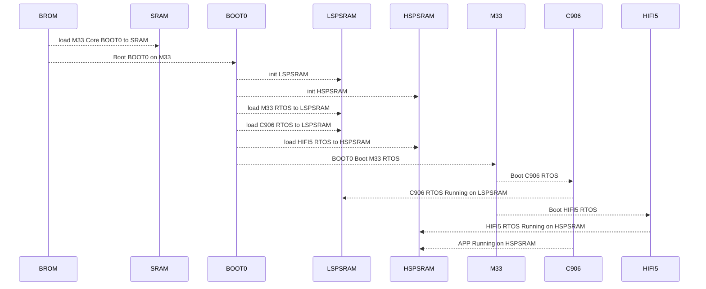

## 修改运行核心

系统有三个不同的核心，分别是 M33，C906，HIFI5，其中M33是启动核心不可以关闭，另外两个核心都可以关闭。当不需要使用 C906 核心或者 HIFI5 DSP 核心的时候，可以将这两个核心关闭。方法如下：

### 关闭 HIFI5 核心

首先，选择好 M33 的方案，因为 HIFI5 是由 M33 来启动的。

```
source envsetup.sh
lunch_rtos r128s2_m33
```

直接取消勾选即可：


### 关闭 C906 核心

首先，选择好 M33 的方案，因为 C906 是由 M33 来启动的。

```
source envsetup.sh
lunch_rtos r128s2_m33
```

直接取消勾选即可：


## 修改核心运行内存空间

### 修改到 HSPSRAM 运行

R128 的 M33 和 C906 两个核运行的系统都是默认运行在 LSPSRAM，这里示例如何修改到 HSPSRAM

1. 关闭启动 HIFI5 核心

首先，选择好 M33 的方案，因为 HIFI5 是由 M33 来启动的。

```
source envsetup.sh
lunch_rtos r128s2_m33
```

由于默认 HIFI5 是运行在 HSPSRAM 的，这里需要释放 HSPSRAM。运行 `mrtos_menuconfig` 启动配置。

直接取消勾选即可。


2. 将 M33 和 C906 设置成在 HSPSRAM 运行

首先选择 M33 的方案：

```
source envsetup.sh
lunch_rtos r128s2_m33
```

接着运行 `mrtos_menuconfig` 修改启动地址，所需要修改的配置如下图所示：


!> lspsram 地址空间为 0x8000000-0x87fffff，hspsram 地址空间为 0xc000000-0xc7fffff。

这里将所需要的修改的核的地址，将8改成c即可。如修改 M33 的起始地址，将 `0x08004000`，修改成`0x0c004000` 即可，如下图。


然后保存配置，重新编译 M33 方案。接下来修改 C906 的地址，选择 C906 的方案

```
source envsetup.sh
lunch_rtos r128s2_c906
```

接着运行 `mrtos_menuconfig` 修改启动地址，所需要修改的配置如下图所示：


然后保存配置，重新编译 C906 方案。

3. 修改配置文件

首先，确认自己方案使用的 `image_header` 文件，运行一次打包的命令 `pack`，从打包的 `log` 中能看出方案所选的文件，如下图：


如果需要修改 M33 的地址，则只修改 M33 的即可，C906同理。如果取消启动 DSP，则直接注销掉 DSP的配置代码。

最后，修改 M33 和 C906 在 HSPSRAM 运行，并且取消运行 HIFI5 的 `image_header` 文件修改可如下所示：

```diff
diff --git a/r128s2/pro/configs/image_header_xip.cfg b/r128s2/pro/configs/image_header_xip.cfg
index 5c83ac1..fc87d06 100755
--- a/r128s2/pro/configs/image_header_xip.cfg
+++ b/r128s2/pro/configs/image_header_xip.cfg
@@ -30,9 +30,9 @@
         {"id": "0xa5e05a00", "bin": "boot0_spinor.fex", "attr": "0x01", "sram_offs": "0x40b0000", "ep": "0x40b0080"},
         {"id": "0xa5e05a00", "bin": "boot0_sdcard.fex", "attr": "0x01", "sram_offs": "0x40b0000", "ep": "0x40b0080"},
         {"id": "0xa5e15a01", "bin": "freertos-gz.fex", "attr": "0x01"},
-        {"id": "0xa5e05a01", "bin": "rtos_arm.fex", "attr": "0x01", "sram_offs": "0x8004000", "ep": "0x8004000"},
-        {"id": "0xa5e05a01", "bin": "rtos_riscv.fex", "attr": "0x01", "sram_offs": "0x8200000", "ep": "0x8200000"},
-           {"id": "0xa5e05a01", "bin": "rtos_dsp.fex", "attr": "0x01", "sram_offs": "0xc000000", "ep": "0xc000660"},
+        {"id": "0xa5e05a01", "bin": "rtos_arm.fex", "attr": "0x01", "sram_offs": "0xc004000", "ep": "0xc004000"},
+        {"id": "0xa5e05a01", "bin": "rtos_riscv.fex", "attr": "0x01", "sram_offs": "0xc200000", "ep": "0xc200000"},
+       //    {"id": "0xa5e05a01", "bin": "rtos_dsp.fex", "attr": "0x01", "sram_offs": "0xc000000", "ep": "0xc000660"},
         {"id": "0xa5e05a01", "bin": "etf.fex", "attr": "0x01", "sram_offs": "0x4000000", "ep": "0x4000000"},
         {"id": "0xa5e05a01", "bin": "rtos_xip_rv.fex", "attr": "0x02"},
         {}
```


# USB 外设功能配置

## USB 功能简介

USB 功能模块包括了USB Host，USB Device 和OTG 功能。

USB Host 目前已经支持上的功能有：Mass Storage，UVC。

USB Device 目前已经支持上的功能有：ADB，UAC。

OTG 主要用作Host 与Device 的切换，如当板子通过 USB 线连接到 USB 主机 (PC) 上时，
此时 OTG 是加载成 USB Device；若当前板子是通过 OTG 线连接一个USB 设备，此时 OTG 则加载
成 USB Host。

## USB 外设特性

- Complies with USB 2.0 Specification
- Supports High-Speed (HS, 480-Mbps), Full-Speed (FS, 12-Mbps), and Low-Speed (LS, 1.5-Mbps) in Host mode
- Supports High-Speed (HS, 480 Mbps), Full-Speed (FS, 12 Mbps) in Device mode
- Supports the UTMI+ Level 3 interface. The 8-bit bidirectional data buses are used
- Supports bi-directional endpoint0 for Control transfer
- Supports up to 8 User-Configurable Endpoints for Bulk, Isochronous and Interrupt bi-directional transfers (Endpoint1, Endpoint2, Endpoint3, Endpoint4)
- Supports up to (4KB+64Bytes) FIFO for EPs (Including EP0)
- Supports High-Bandwidth Isochronous & Interrupt transfers
- Automated splitting/combining of packets for Bulk transfers
- Supports point-to-point and point-to-multipoint transfer in both Host and Peripheral mode
- Includes automatic ping capabilities
- Soft connect/disconnect function
- Performs all transaction scheduling in hardware
- Power Optimization and Power Management capabilities
- Includes interface to an external Normal DMA controller for every Eps

## USB 配置介绍

### `sys_config.fex` 配置说明

sys_config.fex 中主要是对 OTG 功能进行配置，各个配置的含义可如下所示：

| Key  | Value |
| ---- | ----- |
|[usbc0]|控制器0的配置。|
|usb_used:|USB使能标志。置1，表示系统中USB模块可用,置0,则表示系统USB禁用。|
|usb_port_type| USB端口的使用情况。 0: device only;1: host only;2: OTG;usb_detect_type: USB|端口的检查方式。0: 不做检测;1: vbus/id检查;2: id/dpdm检查|
|usb_detect_mode| USB端口的检查方式。0: 线程轮询;1: id中断触发|
|usb_id_gpio| USB ID pin脚配置。具体请参考gpio配置说明。|
|usb_det_vbus_gpio| USB DET_VBUS pin脚配置。具体请参考gpio配置说明。|
|usb_drv_vbus_gpio| USB DRY_VBUS pin脚配置。具体请参考gpio配置说明。|
|usb_drv_vbus_type| vbus设置方式。0: 无; 1: gpio; 2: axp。|
|usb_det_vbus_gpio| "axp_ctrl",表示axp 提供。|
|usbh_driver_level| usb驱动能力等级|
|usbh_irq_flag| usb中断标志|

示例：


```
;--------------------------------
;---       USB0控制标志
;--------------------------------
[usbc0]
usb_used                = 1
usb_port_type           = 2
usb_detect_type         = 1
usb_detect_mode         = 0
usb_id_gpio             = port:PB04<0><0><default><default>
usb_det_vbus_gpio       = port:PA24<0><0><default><default>
usb_drv_vbus_gpio       = port:PA29<1><0><default><default>
usb_drv_vbus_type       = 1
usbh_driver_level       = 5
usbh_irq_flag           = 0
```

### rtos menuconfig 配置说明

- 使能USB 驱动

```
‑> Drivers Options
    ‑> soc related device drivers
        ‑> USB Drivers
            [*] USB
```

- 使能OTG

```
‑> Drivers Options
    ‑> soc related device drivers
        ‑> USB Drivers
            [*] USB_MANAGER
```

- 使能USB Host

使能完USB Host 之后，还需要选择：OHCI 与EHCI（一共有0 和1 两组，对于R128 来说，只需要使能USB0）。另外，还要选择功能驱动（Mass Storage，UVC），不然只是使能USB Host 则无法正常运行USB Host 的功能。

USB Host 控制器驱动配置如下：

```
USB Host
‑> Drivers Options
    ‑> soc related device drivers
        ‑> USB Drivers
            [*] USB_HOST

OHCI
‑> Drivers Options
    ‑> soc related device drivers
        ‑> USB Drivers
            ‑> USB HOST
                [*] USB_OHCI_0

EHCI
‑> Drivers Options
    ‑> soc related device drivers
        ‑> USB Drivers
            ‑> USB HOST
                [*] USB_EHCI_0
```

- 使能USB Device

USB Device 除了UDC 的使能之外，也需要选择对应的功能驱动Gadget 以及功能驱动对应的上层应用。

USB Device 控制器驱动配置如下：

```
USB Device
‑> Drivers Options
    ‑> soc related device drivers
        ‑> USB Drivers
            [*] USB_DEVICE

USB Device使能dma通信
‑> Drivers Options
    ‑> soc related device drivers
        ‑> USB Drivers
            ‑> USB DEVICE
                [*] UDC_USE_DMA
```

## USB 源码结构

```
lichee/rtos‑hal/hal/source/usb
├── common/
├── core/
├── gadget/
│ ├── function/
├── hid/
│ ├── Class/
│ ├── Client/
│ │ ├── KeyBoard/
│ │ └── Mouse/
│ ├── Include/
├── host/
├── include/
├── manager/
├── platform/
├── storage/
│ ├── Class/
│ ├── Disk/
│ ├── include/
│ └── Misc/
├── udc/
└── uvc/
├── Class/
├── drv_webcam/
│ ├── dev_cfg/
│ └── webcam_core/
├── Include/
├── Misc/
└── Webcam/
```

- common: USB 驱动初始化公用文件。
- core: USB Host 驱动框架层文件。
- gadget: USB Deivce 功能驱动gadget 驱动总入口文件，function 则是各个功能驱动的驱动文件。
- hid: USB Host HID 协议及驱动文件。
- host: USB Host 硬件控制器驱动。
- include: USB 公用头文件。
- manager: USB OTG 驱动。
- platform: 不同平台的配置文件。
- storage: USB Host Mass Storage 协议及驱动文件。
- udc: USB Deivce 硬件控制器驱动。
- uvc: USB Host UVC 协议及驱动文件。

详细说明请见：[HAL USB](/sdk_module/usb)

## USB 常用功能说明

### 配置OTG 功能

OTG 功能下，需要根据USB ID 脚去进行Device/Host 模式的切换；如果需要支持NULL 模式（既不加载Device 也不加载Host 驱动）, 那么还需要VBUS 状态检测引脚。

涉及到的主要改动点：

```
在sys_config.fex，修改如下配置：
usb_port_type配置为2,即OTG模式。
usb_id_gpio配置对应的USB ID引脚。
usb_det_vbus_gpio, 需要根据实际情况进行配置:

1.如果需要检测VBUS状态，则按下面情况进行配置：
配置成对应的gpio即可。

2.如果不需要检测VBUS状态(缺少NULL模式)
那么直接填写USB ID的gpio配置(也就是VBUS与ID状态一致)。
```

USB OTG 驱动，会根据ID 和VBUS 的状态，自动切换成对应的模式。ID 和VBUS 的对应关系如下表：

| ID   | VBUS | 模式   |
| ---- | ---- | ------ |
| 0    | 0    | Host   |
| 1    | 0    | Null   |
| 0    | 1    | Host   |
| 1    | 1    | Device |

- ID 脚一般情况下为高电平，只有接入OTG 线时会拉低;
- VBUS 为1 表示micro USB 口有接入外部电源;
- 一般不会出现ID 为0，VBUS 为1 的情况。这表示接入OTG 线，但是还检测到VBUS;
- 如果没有VBUS 检测，ID 只有0 和1 的两种情况, 也就是说要么加载device 驱动，要么加载host 驱动; 这会带来一些影响：usb 相关时钟一直被打开，导致有一定功耗，以及硬件射频。

### USB Gadget 功能配置

USB Gadget 支持众多功能，它们的配置方法比较类似，只需要在mrtos_menuconfig 中选上对应的Gadget 功能驱动即可在系统初始化时自动加载。与Linux 不一样的是，RTOS 的gadget 功能配置全部hardcode 在功能驱动里，无需像Linux 一样需要在应用层手动进行gadget 配置。

另外，目前RTOS 的USB 驱动还不支持composite gadget，因此只能支持加载单一的gadget 功能驱动，无法同时多个功能。

#### ADB 功能

adb 的全称为Android Debug Bridge，就是起到调试桥的作用。通过ADB，可以直接在PC 上通过命令行控制小机端的控制台；也可以通过ADB 进行文件传输。

menuconfig 驱动相关配置：

```
‑> Drivers Options
    ‑> soc related device drivers
        ‑> USB Drivers
            ‑> USB DEVICE
                [*] DRIVERS_USB_GADGET_ADB
```

menuconfig ADBD 应用相关配置：

```
‑> System components
    ‑> aw components
        ‑> USB Components Support
            ‑> USB Gadget Support
                [*] adbd service
```

在RTOS 的USB 框架中，一旦加载了adb gadget，就会自动启用adbd 服务，直接连上PC 就可以使用了。

adb 正常启动的相关log：

```
[usb0] insmod device driver!
adbd version:AW‑V1.1.6, compiled on: Apr 11 2023 10:33:24
adbd service init successful
```

PC 运行效果图如下图所示：


#### UAC 功能

UAC 全称为USB Audio Class，USB 音频类。

通过UAC，可以实现实时获取音频设备的音频数据，并且通过UAC 实现操控设备音量，采样率，等参数。UAC 实现对外接音频操作，从用户功能来说，主要包括USB 麦克风、USB 声卡和其它音频设备的功能控制和接口标准。

menuconfig 驱动相关配置：

```
‑> Drivers Options
    ‑> soc related device drivers
        ‑> USB Drivers
            ‑> USB DEVICE
                [*] DRIVERS_USB_GADGET_UAC
```

menuconfig UACD 应用相关配置：

````
‑> System components
    ‑> aw components
        ‑> USB Components Support
            ‑> USB Gadget Support
                [*] uacd service

‑> System components
    ‑> aw components
        ‑> USB Components Support
            ‑> USB Gadget Support
                ‑> uacd audio function
                    [*] AudioSystem local audio
````

uacd 正常启动的相关log：

```
[usb0] insmod device driver!
uacd version:AW‑V0.5, compiled on: Apr 27 2023 10:44:02
[UACD‑INFO][u_audio_init] line:167 stream=1, rate=48000, ch=2, bits=16, audio_buf_size=192
[UACD‑INFO][u_audio_init] line:167 stream=0, rate=16000, ch=2, bits=16, audio_buf_size=64
[UACD‑INFO][u_audio_stop_capture] line:320
[UACD‑INFO][u_audio_stop_playback] line:457
[UACD‑INFO][u_audio_stop_capture] line:320
[UACD‑INFO][u_audio_stop_playback] line:457
```

启动成功之后，能够在PC 端看到新增了一个音频输入和输出的设备，如下图：


### USB Host 功能配置

接入OTG 线后，成功切换成 USB Host 的log 可参考如下：

```
[ehci‑usb0] insmod host driver!
calibration finish, val:0x19, usbc_no:0
ehci insmod status = 1
[usbh core]: add gen_dev SW USB2.0 'Enhanced' Host Controller (EHCI) Driver
[D(rv.)] devops: register dev(sunxi_timer) ok
USB 0.0 started, EHCI 1.00
[usbh core]: adding sub dev (config #1, interface 0)
usb match id suceessfull
[hub]: usb hub probe
[hub]: 1 port detected
[usbh hub]: local power source is good
[E(rv.)] pm device sunxi_ehci0(00000000082AE1D0) has already registered
[ohci‑usb0] insmod host driver!
calibration finish, val:0x19, usbc_no:0
[usbh core]: add gen_dev SW USB2.0 'Open' Host Controller (OHCI) Driver
[usbh core]: adding sub dev (config #1, interface 0)
usb match id suceessfull
[hub]: usb hub probe
[hub]: 1 port detected
[usbh hub]: local power source is good
[D(rv.)] devops: register dev(sunxi_ohci0) ok
```

#### U 盘功能

选上以下配置：

```
Mass Storage
‑> Drivers Options
    ‑> soc related device drivers
        ‑> USB Drivers
            ‑> USB HOST
                [*] Mass Storage support
                [*] USB CD support	
```

等待U 盘挂载成功，可以发现根目录下多了一个usb_msc 的文件夹，这个即是U 盘挂载的文件夹。可以通过该文件夹与U 盘进行读取/传输文件。

- 目前R128 只支持fat32 文件系统的U 盘，其他文件系统U 盘会挂载失败。
- 只支持挂载单分区的U 盘，如果U 盘被分解成了多个分区的话，只能挂载上第一个分区。

接入U 盘后，系统开始识别U 盘。成功识别到U 盘的log 信息如下：

```
ehci_irq: highspeed device connect
port debounce 0...
port debounce 0...
port debounce 25...
port debounce 50...
port debounce 75...
hub_port_init: udev address = 0
[hub_port_init]: new high speed USB device address 0
usb hub set new address(2)
[usbh core]: adding sub dev (config #1, interface 0)
usb match id suceessfull
mscDevProbe begin
[msc]: GetMaxLUN successful, max lun is 0
begin mscLunAdd
disk, send last lun msg.........
mscLun‑>LunNo=0
mscLun‑>mscDev‑>MaxLun=1
BlkDev‑>last_lun=1
Wrn: short transfer, urb_state(0), want_len(192), real_len(70)
Wrn: short transfer, urb_state(0), want_len(192), real_len(24)
‑‑‑‑‑‑‑‑‑‑‑‑‑‑‑‑‑Disk Information‑‑‑‑‑‑‑‑‑‑‑‑‑‑‑‑‑
WriteProtect = 0
MediaPresent = 1
WCE = 0
RCD = 0
capacity = 29532M, sector number = 60481536
sector_size = 512
DevNo = 0
ClassName =
DevName = SCSI_DISK_000
‑‑‑‑‑‑‑‑‑‑‑‑‑‑‑‑‑‑‑‑‑‑‑‑‑‑‑‑‑‑‑‑‑‑‑‑‑‑‑‑‑‑‑‑‑‑‑‑‑‑
hub_port = 1
cnt = 0
Classname = DISK
DevName = SCSI_DISK_000
DeviceName = SCSI_DISK_000
Vender = TOSHIBA USB FLASH DRIVE PMAP
Product = USB FLASH DRIVE PMAP
Serial = PMAP
HubPortNo = 1
DeviceType = 2
DiskRead: block(0, 1) is adjacence max capacity(39ae000), can't use special write
mount usb mass storage successull!!
..............................................................................
[USB Disk]: Register new device, class = [DISK], dev = [SCSI_DISK_000]
..............................................................................
end mscLunAdd
mscDevScanThread end...
```

然后通过ls 查看usb_msc，可以看到U 盘里的文件：

```
c906>ls
dev data usb_msc

c906>ls usb_msc
System Volume Information 3.txt
```

### USB 摄像头

选上以下配置：

```
UVC
‑> Drivers Options
    ‑> soc related device drivers
        ‑> USB Drivers
            ‑> USB HOST
                [*] USB_CAMERA
```

接上USB 摄像头后，成功识别出摄像头后会出现以下log:

```
ehci_irq: highspeed device connect
port debounce 0...
port debounce 0...
port debounce 25...
port debounce 50...
port debounce 75...
hub_port_init: udev address = 0
[hub_port_init]: new high speed USB device address 0
usb hub set new address(3)
[hub] :skipped 1 descriptor after configuration
skipped 6 descriptors after interface
skipped 1 descriptor after endpoint
skipped 26 descriptors after interface
num_ep:0
skipped 1 descriptor after endpoint
skipped 4 descriptors after interface
num_ep:0
num_ep:0
skipped 2 descriptors after interface
skipped 1 descriptor after endpoint
[usbh core]: adding sub dev (config #1, interface 0)
usb match id suceessfull
UVCDevProbe begin
Probing generic UVC device
device quirks 0x0
Found format MJPEG.
‑ 1920x1080 (30.0 fps)
‑ 1280x720 (30.0 fps)
‑ 640x480 (30.0 fps)
‑ 640x360 (30.0 fps)
‑ 352x288 (30.0 fps)
‑ 320x240 (30.0 fps)
‑ 320x180 (30.0 fps)
‑ 176x144 (30.0 fps)
‑ 160x120 (30.0 fps)
‑ 1920x1080(30.0 fps)
Found format YUV 4:2:2 (YUYV).
‑ 1920x1080 (5.0 fps)
‑ 1280x720 (10.0 fps)
‑ 640x480 (30.0 fps)
‑ 640x360 (30.0 fps)
‑ 352x288 (30.0 fps)
‑ 320x240 (30.0 fps)
‑ 320x180 (30.0 fps)
‑ 176x144 (30.0 fps)
‑ 160x120 (30.0 fps)
‑ 1920x1080 (5.0 fps)
Found UVC 1.00 device USB 2.0 Camera (0c45:6366)
num_altsetting=7
UVC device initialized.
DRV_WEBCAM_MInit
webcam plug in message...
[usbh core]: adding sub dev (config #1, interface 1)
[usbh core]: adding sub dev (config #1, interface 2)
[usbh core]: adding sub dev (config #1, interface 3)
```

通过log 信息能够看到，在识别出USB 摄像头后，会打印出该摄像头支持的格式以及分辨率。

接着通过uvc 测试命令，对UVC 功能进行测试：

```
usb uvc_test
```

测试命令调用完成之后，会在/data 目录下生成5 张名为/data/source_frame_x.jpg 的图片。通过adb pull 将图片拉到PC 端，然后在PC 端打开图片即可看到USB 摄像头拍下的照片。

## USB 调试方法

### USB OTG 功能调试

除了OTG 的自动切换功能，还可以进行手动的切换，需要使用到USB 命令。

USB Device/Host 的手动切换方法：

输入usb ‑h 能够看见usb 的全部命令。

- USB Device 的相关命令

```
usb udc {‑i|‑r} [<port>]
‑i：指的是指定需要进行切换的USB口。目前R128芯片只有USB0是支持Device模式的。
‑r：指的是remove，注销当前的Device模式。

比如说将USB0切换成Device模式，则运行：
usb udc ‑i 0
```

- USB Host 的相关命令

```
usb hci {‑i|‑r} [<port>]
‑i：指的是指定需要进行切换的USB口。
‑r：指的是remove，注销当前的Host模式。

比如说将USB0切换成Host模式，则运行：
usb hci ‑i 0
```

## USB 相关工具
### ADB

ADB 功能是从Android 移植过来的，设备端会运行adbd 服务，而Host 端(一般为PC) 通过adb工具进行调试，如adb shell, adb push/pull 等。

### ADB 功能说明

#### adb shell 功能

PC端执行adb shell,可进入控制台。

PC端执行adb shell + command, 例如adb shell ls /可以直接将结果输出到终端。


#### adb push/pull 功能

```
推送文件到小机端：
adb push test.bin /data

从小机端拉取文件：
adb pull /data/test.bin .
```


#### adb 网络连接

如果需要用此功能，需要额外进行menuconfig 的配置，配置方法如下：

```
‑> System components
    ‑> aw components
        ‑> USB Components Support
            ‑> USB Gadget Support
                [*] adb local transport
                (5555) adb local transport port
```

adb local transport port 是用于配置端口号的，用于在adb 网络连接时匹配端口的，默认为5555。

!> 在进行网络adb 连接之前，需要保证PC 和小机端在同一个局域网中，并且可以ping 通。

小机端运行ifconfig，查看当前小机端的IP，假设IP为192.168.1.101。

则PC端执行adb connect 192.168.1.101建立连接，然后就可以开始执行adb shell等命令了。


# PMU 电源管理

## BMU 功能简介

目前已支持的BMU 为：AXP2585。

该BMU 主要用于电池管理以及充电管理，主要有以下功能：
1. 读取电池电量、电池温度。
2. 设置充电时的充电电流，截止充电电压、充电超时等。
3. 自动根据连接PC 或者适配器设置USB 输入的最大限流。
4. 电池温度过高时自动触发停充。
5. 检测USB 线的接入和拔出。
6. BMU 芯片过温保护。

## BMU 配置介绍

### `sys_config.fex` 配置说明

```ini
[pmu]
pmu_irq_pin      = port:PA14<14><0><default><default>
pmu_irq_wakeup   = 2
pmu_hot_shutdown = 1
pmu_bat_unused = 0
pmu_usbad_vol = 4600
pmu_usbad_cur = 1500
pmu_usbpc_vol = 4600
pmu_usbpc_cur = 500
pmu_chg_ic_temp = 0
pmu_battery_rdc = 100
pmu_battery_cap = 3568
pmu_runtime_chgcur = 900
pmu_suspend_chgcur = 1200
pmu_shutdown_chgcur = 1200
pmu_init_chgvol = 4200
pmu_init_chg_pretime = 50
pmu_init_chg_csttime = 1200
pmu_chgled_type = 0
pmu_init_bc_en = 1
pmu_bat_temp_enable = 0
pmu_bat_charge_ltf = 2261
pmu_bat_charge_htf = 388
pmu_bat_shutdown_ltf = 3200
pmu_bat_shutdown_htf = 237
pmu_bat_para[0] = 0
pmu_bat_para[1] = 0
pmu_bat_para[2] = 0
pmu_bat_para[3] = 0
pmu_bat_para[4] = 0
pmu_bat_para[5] = 0
pmu_bat_para[6] = 1
pmu_bat_para[7] = 1
pmu_bat_para[8] = 2
pmu_bat_para[9] = 4
pmu_bat_para[10] = 5
pmu_bat_para[11] = 12
pmu_bat_para[12] = 19
pmu_bat_para[13] = 32
pmu_bat_para[14] = 41
pmu_bat_para[15] = 45
pmu_bat_para[16] = 48
pmu_bat_para[17] = 51
pmu_bat_para[18] = 54
pmu_bat_para[19] = 59
pmu_bat_para[20] = 63
pmu_bat_para[21] = 68
pmu_bat_para[22] = 71
pmu_bat_para[23] = 74
pmu_bat_para[24] = 78
pmu_bat_para[25] = 81
pmu_bat_para[26] = 82
pmu_bat_para[27] = 84
pmu_bat_para[28] = 88
pmu_bat_para[29] = 92
pmu_bat_para[30] = 96
pmu_bat_para[31] = 100
pmu_bat_temp_para[0] = 7466
pmu_bat_temp_para[1] = 4480
pmu_bat_temp_para[2] = 3518
pmu_bat_temp_para[3] = 2786
pmu_bat_temp_para[4] = 2223
pmu_bat_temp_para[5] = 1788
pmu_bat_temp_para[6] = 1448
pmu_bat_temp_para[7] = 969
pmu_bat_temp_para[8] = 664
pmu_bat_temp_para[9] = 466
pmu_bat_temp_para[10] = 393
pmu_bat_temp_para[11] = 333
pmu_bat_temp_para[12] = 283
pmu_bat_temp_para[13] = 242
pmu_bat_temp_para[14] = 179
pmu_bat_temp_para[15] = 134
```

配置含义：

```c
pmu_irq_pin
	AXP芯片IRQ引脚连接的IO，用于触发中断

pmu_irq_wakeup
	Press irq wakeup or not when sleep or power down.
    0: not wakeup
    1: wakeup
    
pmu_hot_shutdown
    when PMU over temperature protect or not.
    0: disable
    1: enable

pmu_bat_unused
    unused bat
    0: disable
    1: enable

pmu_usbpc_vol <u32>
	usb pc输入电压限制值，单位为mV
	
pmu_usbpc_cur <u32>
	usb pc输入电流限制值，单位为mA
	
pmu_usbad_vol <u32>
	usb adaptor输入电压限制值(vimdpm)，单位为mV
	
pmu_usbad_cur <u32>
	usb adaptor输入电流限制值，单位为mA
	
pmu_chg_ic_temp <u32>
    1: TS current source always on
    0: TS current source off
    
pmu_battery_rdc <u32>
	电池内阻，单位为mΩ
	
pmu_battery_cap <u32>
	电池容量，单位为mAh
	
pmu_runtime_chgcur <u32>
	运行时constant充电电流限制，单位为mA
	
pmu_suspend_chgcur <u32>
	休眠时constant充电电流限制，单位为mA
	
pmu_shutdown_chgcur <u32>
	关机时constant充电电流限制，单位为mA
	
pmu_terminal_chgcur <u32>
	截止电流，停止充电的标志位之一，单位为mA
	
pmu_init_chgvol <u32>
	电池满充电压，单位为mV
	
pmu_init_chg_pretime <u32>
	当电池电压低于REG 0x8C[1]时，属于pre charge阶段。
	如果此阶段时间超过pmu_init_chg_pretime，视为超时，停止充电。
	
pmu_init_chg_csttime <u32>
	当电池电压高于REG 0x8C[1]且低于截止电压(REG 0X8C[7:2])时，属于恒流充电阶段。
	如果此阶段时间超过pmu_init_chg_csttime，视为超时，停止充电。
	
pmu_chgled_type <bool>
    0: Enable CHGLED pin funciton
    1: Disable CHGLED pin funciton
    
pmu_init_bc_en <bool>
    0: Enable BC1.2
    1: Disable BC1.2
        
pmu_bat_temp_enable <u32>
	设置电池温度检测、ntc是否使能
        
pmu_bat_charge_ltf <u32>
    触发电池低温停充的TS pin电压阈值，单位：mV
    默认：1105mV
    范围：0‑8160mV
        
pmu_bat_charge_htf <u32>
    触发电池高温停充的TS pin电压阈值，单位：mV
    默认：121mV
    范围：0‑510mV
        
pmu_bat_shutdown_ltf <u32>
	非充电模式下，触发电池低温中断的TS pin电压阈值，单位：mV
	默认：1381mV
        
pmu_bat_shutdown_htf <u32>
	默认：89mV
	范围：0‑510mV
        
pmu_bat_para1 <u32>
pmu_bat_para2 <u32>
...
pmu_bat_para32 <u32>
	电池曲线参数
	电池参数根据使用的电池不同，通过仪器测量出来
        
pmu_bat_temp_para1 <u32>
	电池包‑25度对应的TS pin电压，单位：mV
        
pmu_bat_temp_para2 <u32>
	电池包‑15度对应的TS pin电压，单位：mV
        
pmu_bat_temp_para3 <u32>
	电池包‑10度对应的TS pin电压，单位：mV
        
pmu_bat_temp_para4 <u32>
	电池包‑5度对应的TS pin电压，单位：mV
        
pmu_bat_temp_para5 <u32>
	电池包0度对应的TS pin电压，单位：mV
        
pmu_bat_temp_para6 <u32>
	电池包5度对应的TS pin电压，单位：mV
        
pmu_bat_temp_para7 <u32>
	电池包10度对应的TS pin电压，单位：mV
        
pmu_bat_temp_para8 <u32>
	电池包20度对应的TS pin电压，单位：mV
        
pmu_bat_temp_para9 <u32>
	电池包30度对应的TS pin电压，单位：mV
        
pmu_bat_temp_para10 <u32>
	电池包40度对应的TS pin电压，单位：mV
        
pmu_bat_temp_para11 <u32>
	电池包45度对应的TS pin电压，单位：mV
        
pmu_bat_temp_para12 <u32>
	电池包50度对应的TS pin电压，单位：mV
        
pmu_bat_temp_para13 <u32>
	电池包55度对应的TS pin电压，单位：mV
        
pmu_bat_temp_para14 <u32>
	电池包60度对应的TS pin电压，单位：mV
        
pmu_bat_temp_para15 <u32>
	电池包70度对应的TS pin电压，单位：mV
        
pmu_bat_temp_para16 <u32>
	电池包80度对应的TS pin电压，单位：mV

不同电池包的温敏电阻特性不一样，根据电池包的TS温敏电阻手册，找到pmu_bat_temp_para[1‑16]对应温度点的电阻阻值，将阻值除以20得到的电压数值（单位：mV），将电压数值填进pmu_bat_temp_para[1‑16]的节点中即可
```

### rtos menuconfig 配置说明

AXP 是依赖于I2C 进行通过的，所以首先就需要确认I2C 驱动是已经被选上的。

- 使能I2C 驱动

```
‑> Drivers Options
    ‑> soc related device drivers
        ‑> TWI Devices
            [*] enable twi driver
```

- 使能PMU 驱动

```
‑> Drivers Options
	‑> soc related device drivers
		[*] POWER Devices
```

- 选择AXP2585

```
‑> Drivers Options
	‑> soc related device drivers
		‑> POWER Devices
			[*] enable power driver
```

### BMU 源码结构

```
lichee/rtos‑hal/hal/source/power/
├── axp2585.c
├── axp2585.h
├── axp.c
├── axp_twi.c
├── ffs.h
├── Kconfig
├── Makefile
├── sun20iw2p1
│ ├── core.c
└── type.h
```

- axp2585.c: AXP2585 驱动。
-  axp.c: AXP 框架API 接口。
-  axp_twi.c: 初始化以及I2C 接口。
-  sun20iw2p1: R128 配置以及总初始化接口。

## BMU 常用功能

### 驱动初始化

若 `mrtos_menuconfig` 中已经选上了该设备，并且 `sys_config.fex`  中也配置完成，那么系统加载时就已经自动将 BMU 驱动加载完成，无需软件工程师再进行初始化。

初始化成功的 log 可如下所示：

```
axp2585 chip version C !
axp2585 chip id detect 0x49 !
current limit not set: usb adapter type
axp2585 init finished !
```

若是没有打印上述的打印 log 信息，可能是 BMU 驱动加载失败了，可以从 `sys_config.fex` 配置中确认是否有配置漏配置了，或者是从 I2C 方向去排查，确认I2C 通信是正常的。

### AXP 接口使用

BMU 驱动有一个统一的驱动入口，初始化和一些功能接口，都是由AXP 驱动统一管理的。具体请参照 [PMU](/sdk_module/pmu)章节的说明。

### 电源管理应用healthd

healthd 是一个电源管理的应用，主要功能为：检测电池电量、设置充电电流、电量变低警报、电压过低关机、电池温度过高过度保护等等。

应用配置方法：

```
‑> System components
	‑> aw components
		[*] healthd for axp
```

应用源码路径为：

```
lichee/rtos/components/aw/healthd/healthd.c
```

#### healthd 用法

##### 开启应用

应用在默认SDK 中并不会启动，在系统启动之后，需要手动输入：

```
healthd
```

然后就开启了电池管理应用了。开启了之后，就会启动了电量变低警报、电压过低关机、电池温度过高过度保护的功能。

##### 获取电池电量

运行命令：

```
healthd_get_capacity
```

##### 设置充电电流

运行命令：

```
healthd_set_chgcur 1500
```

命令的后缀为充电电流大小，单位为mA，范围为0~3072mA。


# LVGL


# RTOS 多媒体解码

介绍 FreeRTOS 下如何使用 rtplayer 的接口来开发播放器应用程序，方便播放器开发人员快速正确地开发，以及播放器测试人员如何根据该文档对 rtplayer 播放器进行验证测试。

### rtplayer 状态图

这张状态转换图清晰地描述了 rtlayer 的各个状态，也列举了主要的方法的调用时序，每种方法只能在一些特定的状态下使用，否则会出错。另外，只有在 Prepared、Started、Paused、Play‑backCompleted 这四种状态下可以进行 seekTo() 操作，并且 seekTo() 之后，状态不变。


#### Idle 状态

Idle 状态：当调用 player_init() 创建一个 rtplayer 或者调用了其 reset() 方法时，rtplayer 处于 idle状态。

#### Initialized 状态

这个状态比较简单，调用 setDateSource_url() 方法就进入 Initialized 状态，表示此时要播放的文件已经设置好了

####  Preparing 状态

调用 prepare() 函数还没返回或者是调用 prepareAsync() 并且还没收到 RTPLAYER_NOTIFY_PREPARED 这个回调消息的时候就处于 Preparing 状态

#### Prepared 状态

调用 prepare() 函数已经返回或者是调用 prepareAsync() 并且已经收到 RTPLAYER_NOTIFY_PREPARED 这个回调消息之后的状态就处于 Prepared 状态。在这个状态下说明所有的资源都已经就绪了，调用 start() 函数就可以播放了。

#### Started 状态

rtplayer 一旦 prepare 完成，就可以调用 start() 方法，这样 rtplayer 就处于 Started 状态，这表明 rtplayer 正在播放文件过程中。可以使用 XPlayerIsPlaying() 测试 rtplayer 是否处于了 Started 状态。如果播放完毕，而又设置了循环播放，则 rtplayer 仍然会处于 Started 状态。

####  Paused 状态

Started 状态下可以调用 pause_l() 方法暂停 rtplayer，从而进入 Paused 状态，rtplayer 暂停后再次调用 start() 则可以继续 TPlayer 的播放，转到 Started 状态。

#### Stopped 状态

Started 或者 Paused 状态下均可调用 stop() 停止 rtplayer，而处于 Stop 状态的 rtplayer 要想重新播放，需要通过 prepareAsync() 和 prepare() 回到先前的 Prepared 状态重新开始才可以。

####  PlaybackCompleted 状态

文件正常播放完毕，而又没有设置循环播放的话就进入该状态，并且会通过 RTPLAYER_NOTIFY_PLAYBACK_COMPLETE 这个消息回调给应用。此时可以调用 start() 方法重新从头播放文件，也可以 stop() 停止 rtplayer，或者也可以 seekTo() 来重新定位播放位置。

#### Error 状态

由于某种原因 rtplayer 出现了错误，就会进入该状态，并且会通过 RTPLAYER_NOTIFY_MEDIA_ERROR 这个消息回调给应用。如果 rtplayer 进入了 Error 状态，可以通过调用 reset() 来恢复，使得 rtplayer 重新返回到 Idle 状态。

#### End 状态

通过 plater_deinit() 的方法可以进入 End 状态，只要 rtplayer 不再被使用，就应当尽快将其 destroy 掉。

##  rtplayer 层接口

### 创建一个 rtplayer

函数原型

```c
uint32_t player_init(void)
```

参数：

- 无

返回值：

- 成功返回 rtplayer 的指针，失败返回 NULL

### 销毁一个 rtplayer

函数原型

```c
void player_deinit(void* handle)
```

参数：

-  handle: 通过 player_init() 函数创建的 rtplayer 指针

返回值：

- 无

### 设置 rtplayer 的消息回调函数

函数原型

```c
void registerCallback(void* handle, void* userData, player_callback_t fn)
```

参数：

-  handle: 通过 player_init() 函数创建的 rtplayer 指针
- userData: 回调消息处理对象
- fn: 回调消息处理函数指针，需要由应用实现

返回值：

- 无

!> 创建完 rtplayer 播放器之后，就要调用该函数设置回调消息处理函数。

### 设置播放文件的 url

可以是本地文件也可以是网络源

函数原型

```c
status_t setDataSource_url(void* handle,void* userData, const char * url, int id)
```

参数：

- handle: 通过 player_init() 函数创建的 rtplayer 指针
- userData: 回调消息处理对象
- url: 需要播放的文件的 url
- id: 回调时使用的播放索引, 为 0 即可

返回值：

- 成功返回 0，失败返回‑1 或错误码

### 解析文件头部信息，获取元数据

函数原型

```c
status_t prepare(void* handle)
```

参数：

- handle: 通过 player_init() 函数创建的 rtplayer 指针;

返回值：

- 成功返回 0，失败返回‑1 或错误码

### 异步解析文件头部信息，获取元数据

函数原型

```c
status_t prepareAsync(void* handle)
```

参数：

- handle: 通过 player_init() 函数创建的 rtplayer 指针;

返回值：

- 成功返回 0，失败返回‑1

!> 该函数是非阻塞函数，需要等到 RTPLAYER_NOTIFY_P‑ REPARED 消息回调之后才能调 start() 函数进行播放，而且 start() 函数不能在回调函数中调用

### 开始播放

函数原型

```c
status_t start(void* handle)
```

参数：

- handle: 通过 player_init() 函数创建的 rtplayer 指针;

返回值：

- 成功返回 0，失败返回‑1

### 暂停播放

函数原型

```c
 status_t pause_l(void* handle)
```

参数：

-  handle: 通过 player_init() 函数创建的 rtplayer 指针;

返回值：

- 成功返回 0，失败返回‑1

### 停止播放

函数原型

```c
 status_t stop(void* handle)
```

参数：

- handle: 通过 player_init() 函数创建的 rtplayer 指针

返回值：

- 成功返回 0，失败返回‑1

### 重置播放器

函数原型

```c
status_t reset(void* handle)
```

参数：

- handle: 通过 player_init() 函数创建的 rtplayer 指针;

返回值：

- 成功返回 0，失败返回‑1

!> 在任何状态下都可以调用该函数，每次播放不同的音频之前，都需要调用该函数重置播放器，另外，一般收到 RTPLAYER_NOTIFY_MEDIA_ERROR 这个消息的时候，也需要通过调用该函数来重置播放器。但是不能在回调函数中调用该函数，否则会出现死锁

### 跳播

函数原型

```c
status_t seekTo(void* handle, int sec)
```

参数：

- handle: 通过 player_init() 函数创建的 rtplayer 指针
- sec: 跳播的位置，单位是：s

返回值：

- 成功返回 0，失败返回‑1

### 获取当前播放的位置

函数原型

```c
status_t getCurrentPosition(void* handle, int * sec)
```

参数：

- handle: 通过 player_init() 函数创建的 rtplayer 指针;
- sec: 存放当前播放的位置值，单位：s

返回值：

- 成功返回 0，失败返回‑1

### 获取播放的文件总时长

函数原型

```c
status_t getDuration(void* handle, int * sec)
```

参数：

- handle: 通过 player_init() 函数创建的 rtplayer 指针;
- sec: 存储文件总时长，单位：s

返回值：

- 成功返回 0，失败返回‑1

!> 需要在 prepared 状态之后才可以调用该函数

### 获取播放的文件信息

函数原型

```c
MediaInfo* getMediaInfo(void* handle)
```

参数：

- handle: 通过 player_init() 函数创建的 rtplayer 指针;

返回值：

- 成功返回 0，失败返回‑1

!> 需要在 prepared 状态之后才可以调用该函数

### 设置循环播放模式

函数原型

```c
status_t setLooping(void* handle, int loop)
```

参数：

-  handle: 通过 player_init() 函数创建的 rtplayer 指针;
- loop:1 表示单曲循环，0 表示不会单曲循环

返回值：

- 成功返回 0，失败返回‑1

##  XPlayer 层播放接口

### 创建一个 XPlayer

函数原型

```c
XPlayer* XPlayerCreate()
```

参数：

- 无

返回值：

- 成功: XPlayer 指针; 失败: NULL

### 设置 XPlayer 的回调通知

函数原型

```c
int XPlayerSetNotifyCallback(XPlayer* p, XPlayerNotifyCallback notifier, void* pUserData)
```

参数：

- P：通过 XPlayerCreate 创建的 Xplayer 指针 
- notifier：回调通知
- pUserData：应用程序传下来的自定义数据

返回值：

- 成功：XPlayer 指针；失败：NULL

!> Xplayer 将接收来自下层的回调通知，进行相应的操作

### 创建指向音频播放设备管理模块的指针，用于播放音频

函数原型

```c
SoundCtrl* RTSoundDeviceCreate(int card)
```

参数：

- card:声卡序号0：default;1：sw:audio1;2:sw:audio2;3:sw:audio3;4:sw:audio4;5:sw:audio5

返回值：

- 成功：音频播放设备管理模块的指针；失败：NULL

### 创建指向音频播放设备管理模块的指针，用于播放音频

函数原型

```c
int XPlayerSetDataSourceUrl(XPlayer* p, const char* pUrl, void* httpService, const CdxKeyedVectorT* pHeaders)
```

参数：

- pUrl：url 地址 
- httpService：服务器信息 
- pHeaders：头文件信息

返回值：

- 返回值: 成功：0；失败：‑1 或线程响应设置数据源命令的返回值或线程响应 xplayer prepare 命令的返回值

!> 调用说明: 发送 SetDataSource 命令，获取需要播放的音频数据内容

### 将 XPlayer 置为准备状态, 解析头部信息，获取元数据

函数原型

```c
int XPlayerPrepare(XPlayer* p)
```

参数：

- p：通过 XPlayerCreate 创建的 Xplayer 指针

返回值：

- 成功：线程响应异步 Prepare 命令的返回值；失败：NULL

!> 该函数是阻塞函数，调用完返回之后就进入了 Prepared 状态，此时可调 XPlayerStart() 函数进行播放

### 将 XPlayer 置为异步准备状态

函数原型

```c
int XPlayerPrepareAsync(XPlayer* p)
```

参数：

- p：通过 XPlayerCreate 创建的 XPlayer 指针

返回值：

- 成功：线程响应异步 Prepare 命令的返回值；失败：NULL

!>  网络播放源一般采用 PrepareAsync，而不是 Prepare 命令，PrepareAsync 命令的返回值为 0 时说明响应成功，播放器准备工作已经完成可以开始播放，为‑1 时说明响应失败

### 将 XPlayer 置为启动状态

函数原型

```c
int XPlayerStart(XPlayer* p)
```

参数：

-  p：通过 XPlayerCreate 创建的 XPlayer 指针

返回值：

- 成功：线程响应 start 命令的返回值；失败：NULL

!> Start 命令的返回值为 0 时说明响应成功，为‑1 时说明响应失败

### 将 XPlayer 置为暂停状态

函数原型

```c
int XPlayerPause(XPlayer* p)
```

参数：

- p：通过 XPlayerCreate 创建的 XPlayer 指针

返回值：

- 成功：线程响应 pause 命令的返回值；失败：NULL

!> 在 XPlayer 处于 start 状态时可调用此接口，Pause 命令的返回值为 0 时说明响应成功，为‑1 时说明响应失败

### 将 XPlayer 置为停止状态

函数原型

```c
int XPlayerStop(XPlayer* p)
```

参数：

- p：通过 XPlayerCreate 创建的 XPlayer 指针

返回值：

- 成功：返回 0；失败：返回‑1

### 重置 XPlayer

将相关变量复位，并销毁各模块，如音频解码模块、音频解码数据接收模块等

函数原型

```c
int XPlayerReset(XPlayer* p)
```

参数：

- p：通过 XPlayerCreate 创建的 XPlayer 指针

返回值：

- 成功：线程响应 Reset 命令的返回值；失败：NULL

!>  Reset 命令的返回值为 0 时说明响应成功，为‑1 时说明响应失败

### 获取节目时长

函数原型

```c
int XPlayerGetDuration(XPlayer* p, int *msec)
```

参数：

- p：通过 XPlayerCreate 创建的 Xplayer 指针
- msec：保存节目时长

返回值：

- 成功：0；失败：‑1

!> 在 XPlayer 处于 PREPARED、STARTED、PAUSED、STOPPED 或 COMPLETE 状态下才可调用此接口，否则操作无效

###  Seek 到给定的时间点

函数原型

```c
int XPlayerSeekTo(XPlayer* p, int nSeekTimeMs)
```

参数：

- p：通过 XPlayerCreate 创建的 Xplayer 指针 
- nSeekTimeMs：跳转的时间点

返回值：

-  成功：线程响应 Seek 命令的返回值；失败：NULL

!> 如果跳转前播放处于暂停状态，则跳转后将保持在暂停状态

### 获取媒体文件的总时长

函数原型

```c
int XPlayerGetDuration(XPlayer* p, int *msec)
```

参数：

- p：通过 XPlayerCreate 创建的 XPlayer 指针 
- msec：保存媒体文件的总时长

返回值：

- 成功：0；失败：‑1

!> 需要在 prepared 状态之后才可以调用该函数

### 获取当前的播放时间点（即播放位置）

在 XPlayer 处于 PREPARED、STARTED、PAUSED、STOPPED 或 COMPLETE 状态下才可调用此接口，否则操作无效，在 complete 状态下，可能会调用 prepare 方法并更改媒体信息，获取的播放时间以 ms 为单位

函数原型

```c
int XPlayerGetCurrentPosition(XPlayer* p, int* msec)
```

参数：

-  p：通过 XPlayerCreate 创建的 XPlayer 指针
-  msec：保存当前的播放时间

返回值：

- 成功：0；失败：‑1

### 获取媒体信息

函数原型

```c
MediaInfo* XPlayerGetMediaInfo(XPlayer* p)
```

参数：

- p：通过 XPlayerCreate 创建的 XPlayer 指针

返回值：

- 成功返回 0，失败返回‑1。如果失败，则 mediaInfo 指针为 NULL

!> 需要在 prepared 状态之后才可以调用该函数

### 设置循环播放模式

函数原型

```c
int XPlayerSetLooping(XPlayer* p, int loop)
```

参数：

- p：通过 XPlayerCreate 创建的 XPlayer 指针 
- loop: 1: 表示单曲循环模式；0：表示不会循环

返回值：

- 无

### 查询是否正在播放

函数原型

```c
int XPlayerIsPlaying(XPlayer* p)
```

参数：

- p：通过 XPlayerCreate 创建的 XPlayer 指针

返回值：

-  1：正在播放；0：未播放


### 销毁一个 XPlayer

函数原型

```c
void XPlayerDestroy(XPlayer* p)
```

参数：

- p：通过 XPlayerCreate 创建的 XPlayer 指针

返回值：

- 无

## 播放器开发示例

1. player_init() 创建一个播放器
2. registerCallback()  设置消息回调函数
3. setDataSource_url() 设置 url
4. prepare() 或 prepareAsync()  解析头部信息，获取元数据，并根据元数据的信息初始化对应的解码器
5. start() 播放 (注: 如果是用 prepareAsync() 函数，则需要等到 RTPLAYER_NOTIFY_PREPARED 消息回调之后才可以调用 start() 函数进行播放)
6. 如果需要跳播，则可以调用 seekTo() 函数
7. 如果需要暂停，则调用 pause_l() 函数进行暂停
8. 如果需要停止，则可以调用 stop() 或 reset() 函数进行停止 (注：建议用 reset() 函数进行停止，因为任何状态下都可以调用 reset() 函数)
9. 如果需要播放下一个或其他的，则可以先调用 reset() 函数使播放器进入 idle 状态，然后再重复 (3)(4)(5) 的步骤

```c
#include <stdio.h>
#include <stdint.h>
#include <FreeRTOS.h>
#include <task.h>
#include <portable.h>
#include <string.h>
#include <console.h>
#include <semaphore.h>
#include <pthread.h>
#include <unistd.h>
#include <mqueue.h>
#include <fcntl.h>
#include <stdlib.h>
#include "FreeRTOS_POSIX/utils.h"
#include "rtplayer.h"
#include "xplayer.h"

#define PAUSE_CMD           'P'
#define PING_CMD            'p'
#define STOP_CMD            'S'
#define SEEK_TO_CMD         's'
#define SEEK_TO_CMD2        'j'
#define BACKGROUND_CMD      'b'
#define SHOW_BUFFER_CMD     'B'
#define QUIT_CMD            'q'
#define LOOP_CMD            'l'
#define GET_DURATION_CMD    'G'
#define GET_POSITION_CMD    'g'
#define HELP_CMD            'h'
#define INFO_CMD            'i'
#define REPLAY_CMD          'r'
#define RETRY_CMD           256

#define USE_PREPARE_ASYNC 0

#define LOGD(msg, arg...)      //printf("[PLAYER_DBG] <%s : %d> " msg "\n", __func__, __LINE__, ##arg)
#define LOGI(msg, arg...)      //printf("[PLAYER_INFO] <%s : %d> " msg "\n", __func__, __LINE__, ##arg)
#define LOGW(msg, arg...)      printf("[PLAYER_WRN] <%s : %d> " msg "\n", __func__, __LINE__, ##arg)
#define LOGE(msg, arg...)      printf("[PLAYER_ERR] <%s : %d> " msg "\n", __func__, __LINE__, ##arg)
typedef struct DemoPlayerContext
{
    RTPlayer* mRTplayer;
    sem_t mPreparedSem;
    mqd_t mRTplayerMq;
    pthread_t mThreadId;
    char *pUrl;
    int mSeekable;
    char isPlayingFlag;
    char mError;
    int inputMode;
    int isSetLoop;
    char quitFlag;//no_shell_input mode quitFlag
    int testMode;
    MediaInfo* mMediaInfo;
    int SoundCard;
}DemoPlayerContext;

typedef struct DemoPlayerMsg
{
    int msg;
    int data;
}DemoPlayerMsg;

#define INVALID_MQD     ( ( mqd_t ) -1 )
#define DEFAULT_MODE    0600
static const char *pcRTplayerMqName = "/rtplayerMq";
static volatile mqd_t mRTplayerMq = INVALID_MQD;
static int mRTplayerUserInput = 0;
static struct mq_attr xRTplayerMqAttr =
    {
        .mq_flags   =   0,
        .mq_maxmsg  =   3,
        .mq_msgsize =   sizeof(DemoPlayerMsg),
        .mq_curmsgs =   0
    };

static void showHelp(){
    printf("\n");
    printf("**************************\n");
    printf("* This is a simple audio player, when it is started, you can input commands to tell\n");
    printf("* what you want it to do.\n");
    printf("* Usage: \n");
    printf("*   tplayer_demo /data/test.mp3  : this means play test.mp3\n");
    printf("*   P  :this will Pause if in playing status,or Play in paused status \n");
    printf("*   S  :this means Stop \n");
    printf("*   s  :this means seek to 10s \n");
    printf("*   B  :show buffer \n");
    printf("*   b  :this means player will run in the background \n");
    printf("*   q  :this means quit the player \n");
    printf("*   l  :this means loop play \n");
    printf("*   G :this means Get  duration \n");
    printf("*   g :this means get  position \n");
    printf("*   i :this means show media info \n");
    printf("*   h :this means show the help information \n");
    printf("*   r : replay the current audio\n");
    printf("**************************\n");
}
static int rtplayer_clear_cmd(mqd_t mq){
    struct timespec cur, delay, abstime;
    clock_gettime( CLOCK_REALTIME, &cur );
    delay.tv_sec = 0;
    delay.tv_nsec = 5*1000*1000;
    UTILS_TimespecAdd(&cur, &delay, &abstime);
    DemoPlayerMsg msg;
    while(mq_timedreceive(mq, (char *)&msg, sizeof(msg), NULL, &abstime)!=-1);
    return 0;
}
static int rtplayer_send_cmd(mqd_t mq, int msg, int data){
    DemoPlayerMsg pmsg = {msg, data};
    struct timespec tsn, ts;
    clock_gettime(CLOCK_REALTIME, &tsn);
    UTILS_TimespecAddNanoseconds(&tsn, 20*1000*1000, &ts);
    int status = mq_timedsend(mq, (char *)&pmsg, sizeof(pmsg), 0, &ts);
    if(status)
        LOGE("send cmd %c,%d failed!", pmsg.msg, pmsg.data);
    return status;
}

static int rtplayer_send_cmd_force(mqd_t mq, int msg, int data){
    int try_times = 0;
    DemoPlayerMsg pmsg = {msg, data};
    struct timespec tsn, ts;
    int status;
try_send:
    clock_gettime(CLOCK_REALTIME, &tsn);
    UTILS_TimespecAddNanoseconds(&tsn, 20*1000*1000, &ts);
    status = mq_timedsend(mq, (char *)&pmsg, sizeof(pmsg), 0, &ts);
    if(status){
        try_times++;
        if(try_times<5){
            LOGE("send cmd %c,%d failed, retry...", pmsg.msg, pmsg.data);
            goto try_send;
        }
        else if(try_times<10){
            DemoPlayerMsg tmp;
            LOGE("send cmd %c,%d failed, retry...", pmsg.msg, pmsg.data);
            clock_gettime(CLOCK_REALTIME, &tsn);
            UTILS_TimespecAddNanoseconds(&tsn, 20*1000*1000, &ts);
            status = mq_timedreceive(mq, (char *)&tmp, sizeof(tmp), NULL, &ts);
            if(status<0){
                LOGE("mq_receive fail %d", status);
                goto fail_exit;
            }
            LOGW("drop: %c, %d", tmp.msg, tmp.data);
            goto try_send;
        }
        goto fail_exit;
    }
    return status;
fail_exit:
    LOGE("send cmd %c,%d failed!\n", pmsg.msg, pmsg.data);
    return status;
}

static void callbackFromRTplayer(void* userData,int msg, int id, int ext1, int ext2);
static void* RTplayerThread(void* arg){
    DemoPlayerContext* demoPlayer = (DemoPlayerContext*)arg;
    char quitFlag = 0;

    if(demoPlayer->inputMode)
    {
	while(1)
	{
	     if(demoPlayer->quitFlag)
	     {
		if(demoPlayer->mRTplayer != NULL)
		{
			printf("player finsh, quit the rtplayer\n");
			mRTplayerMq = INVALID_MQD;
#if USE_PREPARE_ASYNC
			sem_destroy(&demoPlayer->mPreparedSem);
#endif
			player_deinit(demoPlayer->mRTplayer);
			free(demoPlayer->pUrl);
			free(demoPlayer);
		}
		break;
	     }
		usleep(50*1000);
	}
	return NULL;

    }
    while(!quitFlag){
        int cRxed = 0;
        int data = 0;
        DemoPlayerMsg msg;
        ssize_t status;
        if(demoPlayer->mRTplayerMq!=INVALID_MQD){
            usleep(50*1000);
            ssize_t status = mq_receive(demoPlayer->mRTplayerMq, (char *)&msg, sizeof(msg), NULL);
            if(status<=-1){
                LOGE("mq_receive fail %d", status);
                usleep(1*1000*1000);
                continue;
            }
            printf("receive %c,%d\n", msg.msg, msg.data);
            cRxed = msg.msg;
            data = msg.data;
        }
        else{
            cRxed = QUIT_CMD;
        }
        switch(cRxed){
            case PAUSE_CMD:
            {
                if(demoPlayer->isPlayingFlag){
                    printf("pause the rtplayer\n");
                    pause_l(demoPlayer->mRTplayer);
                    demoPlayer->isPlayingFlag = 0;
                }else{
                    printf("play the rtplayer\n");
                    start(demoPlayer->mRTplayer);
                    demoPlayer->isPlayingFlag = 1;
                }
                break;
            }
            case STOP_CMD:
            {
                printf("stop the rtplayer\n");
                stop(demoPlayer->mRTplayer);
                demoPlayer->isPlayingFlag = 0;
                break;
            }
            case SEEK_TO_CMD:
            {
                printf("rtplayer seek to 10 second\n");
                seekTo(demoPlayer->mRTplayer,10);
                break;
            }
            case SEEK_TO_CMD2:
            {
                printf("rtplayer seek to %d second\n", data);
                seekTo(demoPlayer->mRTplayer,data);
                break;
            }
            case QUIT_CMD:
            {
                printf("quit the rtplayer\n");
                mRTplayerMq = INVALID_MQD;
                //mq_close(demoPlayer->mRTplayerMq);
#if USE_PREPARE_ASYNC
                sem_destroy(&demoPlayer->mPreparedSem);
#endif
                player_deinit(demoPlayer->mRTplayer);
                free(demoPlayer->pUrl);
                free(demoPlayer);
                quitFlag = 1;
                break;
            }
            case LOOP_CMD:
            {
                printf("let the rtplayer loop play\n");
                demoPlayer->isSetLoop = 1;
                setLooping(demoPlayer->mRTplayer,1);
                break;
            }
            case GET_DURATION_CMD:
            {
                printf("get the audio duration\n");
                int duration;
                getDuration(demoPlayer->mRTplayer,&duration);
                printf("duration:%d s\n",duration);
                break;
            }
            case GET_POSITION_CMD:
            {
                printf("get the current position\n");
                int position;
                getCurrentPosition(demoPlayer->mRTplayer,&position);
                printf("current position:%d s\n",position);
                break;
            }
            case HELP_CMD:
            {
                printf("show the help information\n");
                showHelp();
                break;
            }
	    case INFO_CMD:
	    {
		printf("**************************\n");
		printf("* show media information:\n");
		MediaInfo* mi = NULL;
		demoPlayer->mMediaInfo = getMediaInfo(demoPlayer->mRTplayer);
		if(demoPlayer->mMediaInfo != NULL){
                        mi = demoPlayer->mMediaInfo;
                        printf("* file size = %lld KB\n",mi->nFileSize/1024);
                        printf("* duration = %lld ms\n",mi->nDurationMs);
                        printf("* bitrate = %d Kbps\n",mi->nBitrate/1024);
                        printf("* container type = %d\n",mi->eContainerType);
                        printf("* audio stream num = %d\n",mi->nAudioStreamNum);
                        if(mi->pAudioStreamInfo != NULL){
                            printf("* audio codec tpye = %d\n",mi->pAudioStreamInfo->eCodecFormat);
                            printf("* audio channel num = %d\n",mi->pAudioStreamInfo->nChannelNum);
                            printf("* audio BitsPerSample = %d\n",mi->pAudioStreamInfo->nBitsPerSample);
                            printf("* audio sample rate  = %d\n",mi->pAudioStreamInfo->nSampleRate);
                        }
		printf("**************************\n");
                    }
                    break;

	    }
	    case SHOW_BUFFER_CMD:
	    {
		printf("**************************\n");
		printf("* show buffer information:\n");
		player_show_buffer();
		printf("**************************\n");
		break;

	    }
            case REPLAY_CMD:
            {
                printf("replay %s\n", demoPlayer->pUrl);
                int ret;
                if(demoPlayer->testMode){
                    printf("test mode: destroy & create instead of reset\n");
                    player_deinit(demoPlayer->mRTplayer);
                    usleep(50*1000);
                    demoPlayer->mRTplayer = (RTPlayer*)(uintptr_t)player_init();
                    printf("demoPlayer.mRTplayer = %p\n",demoPlayer->mRTplayer);
                    if(!demoPlayer->mRTplayer){
                        printf("init rtplayer fail\n");
                        free(demoPlayer->pUrl);
                        free(demoPlayer);
                        quitFlag = 1;
                        continue;
                    }
                    registerCallback(demoPlayer->mRTplayer, demoPlayer, callbackFromRTplayer);
                }
                else
                    reset(demoPlayer->mRTplayer);
                ret = setDataSource_url(demoPlayer->mRTplayer, demoPlayer, demoPlayer->pUrl, 0);
                if(ret){
                    printf("setDataSource_url failed\n");
                    break;
                }
                ret = prepare(demoPlayer->mRTplayer);
                if(ret){
                    printf("prepare failed\n");
                    break;
                }
                start(demoPlayer->mRTplayer);
                demoPlayer->isPlayingFlag = 1;
		if(demoPlayer->isSetLoop)
		{
                    setLooping(demoPlayer->mRTplayer,1);
		}
                break;
            }
            case RETRY_CMD:
            {
                int position = data;
                if(data==-1)
                    getCurrentPosition(demoPlayer->mRTplayer,&position);
                printf("retry %s\n", demoPlayer->pUrl);
                int ret;
                if(demoPlayer->testMode){
                    printf("test mode: destroy & create instead of reset\n");
                    player_deinit(demoPlayer->mRTplayer);
                    usleep(50*1000);
                    demoPlayer->mRTplayer = (RTPlayer*)(uintptr_t)player_init();
                    printf("demoPlayer.mRTplayer = %p\n",demoPlayer->mRTplayer);
                    if(!demoPlayer->mRTplayer){
                        LOGE("init rtplayer fail");
                        free(demoPlayer->pUrl);
                        free(demoPlayer);
                        quitFlag = 1;
                        continue;
                    }
                    registerCallback(demoPlayer->mRTplayer, demoPlayer, callbackFromRTplayer);
                }
                else
                    reset(demoPlayer->mRTplayer);
                ret = setDataSource_url(demoPlayer->mRTplayer, demoPlayer, demoPlayer->pUrl, 0);
                if(ret){
                    LOGE("setDataSource_url failed");
                    rtplayer_send_cmd_force(demoPlayer->mRTplayerMq, RETRY_CMD, position);
                    usleep(500*1000);
                    break;
                }
                ret = prepare(demoPlayer->mRTplayer);
                if(ret){
                    LOGE("prepare failed");
                    rtplayer_send_cmd_force(demoPlayer->mRTplayerMq, RETRY_CMD, position);
                    usleep(500*1000);
                    break;
                }
                start(demoPlayer->mRTplayer);
                demoPlayer->isPlayingFlag = 1;
                //seekTo(demoPlayer->mRTplayer, position);
                if(demoPlayer->isSetLoop)
                    setLooping(demoPlayer->mRTplayer,1);
                break;
            }
            default:
            {
                LOGW("warning: unknown command,cmd = %d",cRxed);
                break;
            }
        }
        if(quitFlag){
            return NULL;
        }
    }
    return NULL;
}
static void callbackFromRTplayer(void* userData,int msg, int id, int ext1, int ext2){

    LOGI("call back from RTplayer,msg = %d,id = %d,ext1 = %d,ext2 = %d\n",msg,id,ext1,ext2);

	DemoPlayerContext* pDemoPlayer = (DemoPlayerContext*)userData;
    switch(msg)
    {
        case RTPLAYER_NOTIFY_PREPARED:
        {
            printf("RTPLAYER_NOTIFY_PREPARED:has prepared.\n");
 #if USE_PREPARE_ASYNC           
            sem_post(&pDemoPlayer->mPreparedSem);
            pDemoPlayer->mPreparedFlag = 1;
 #endif
            break;
        }
        case RTPLAYER_NOTIFY_PLAYBACK_COMPLETE:
        {
            printf("RTPLAYER_NOTIFY_PLAYBACK_COMPLETE:play complete\n");
            pDemoPlayer->isPlayingFlag = 0;
	    if(pDemoPlayer->inputMode)
	    {
		pDemoPlayer->quitFlag = 1;
	    }
            break;
        }
        case RTPLAYER_NOTIFY_SEEK_COMPLETE:
        {
            printf("RTPLAYER_NOTIFY_SEEK_COMPLETE:seek ok\n");
            break;
        }
        case RTPLAYER_NOTIFY_MEDIA_ERROR:
        {
            switch (ext1)
            {
                case RTPLAYER_MEDIA_ERROR_UNKNOWN:
                {
                    printf("erro type:TPLAYER_MEDIA_ERROR_UNKNOWN\n");
                    break;
                }
                case RTPLAYER_MEDIA_ERROR_UNSUPPORTED:
                {
                    printf("erro type:TPLAYER_MEDIA_ERROR_UNSUPPORTED\n");
                    break;
                }
                case RTPLAYER_MEDIA_ERROR_IO:
                {
                    printf("erro type:TPLAYER_MEDIA_ERROR_IO\n");
                    break;
                }
            }
            printf("RTPLAYER_NOTIFY_MEDIA_ERROR\n");
            pDemoPlayer->mError = 1;
#if USE_PREPARE_ASYNC            
            if(pDemoPlayer->mPreparedFlag == 0){
                printf("recive err when preparing\n");
                sem_post(&pDemoPlayer->mPreparedSem);
            }
#endif 
            if( pDemoPlayer->mRTplayerMq!=INVALID_MQD ){
                rtplayer_send_cmd_force(pDemoPlayer->mRTplayerMq, RETRY_CMD, -1);
            }
            else{
                printf("io error, mqueue not exist\n");
            }
            break;
        }
        case RTPLAYER_NOTIFY_NOT_SEEKABLE:
        {
            pDemoPlayer->mSeekable = 0;
            printf("info: media source is unseekable.\n");
            break;
        }
        case RTPLAYER_NOTIFY_DETAIL_INFO:
        {
            int flag = *(int *)(uintptr_t)ext2;
            //printf("detail info: %d\n", flag);
            break;
        }
        default:
        {
            printf("warning: unknown callback from RTplayer.\n");
            break;
        }
    }
}
int cmd_rtplayer_test(int argc, char ** argv)
{
    int inputMode = 0;
    int testMode = 0;
	/*
    printf("argc = %d\n",argc);
    for(int i=0; i < argc;i++){
        printf("argv[%d]=%s\n",i,argv[i]);
    }
	*/
	printf("rtplayer source:%s\n", argv[1]);

    if(argc == 3){
        if( !strncmp("no_shell_input", argv[2], sizeof("no_shell_input")-1) ){
            argc--;
            inputMode = 1;
        }
        else if( !strncmp("test_mode", argv[2], sizeof("test_mode")-1) ){
            argc--;
            testMode = 1;
        }
    }
    if(argc != 2){
        LOGW("the parameter is error,usage is as following:");
        showHelp();
        goto rtp_failed;
    }
#if USE_PREPARE_ASYNC
    int waitErr = 0;
#endif
    DemoPlayerContext* demoPlayer = (DemoPlayerContext*)malloc(sizeof(DemoPlayerContext));
    if(demoPlayer == NULL){
        LOGE("malloc DemoPlayerContext fail");
        goto rtp_failed;
    }
    memset(demoPlayer, 0, sizeof(DemoPlayerContext));
    demoPlayer->mSeekable = 1;
    demoPlayer->mRTplayerMq = INVALID_MQD;
    demoPlayer->inputMode = inputMode;
    demoPlayer->testMode = testMode;
    demoPlayer->quitFlag = 0;
    demoPlayer->mMediaInfo = NULL;
    if(strlen(argv[1])<=0){
        LOGE("url error");
        goto rtp_url_failed;
    }
    demoPlayer->pUrl = malloc(strlen(argv[1])+1);
    if(!demoPlayer->pUrl){
        LOGE("pUrl malloc fail");
        goto rtp_url_failed;
    }
    memset(demoPlayer->pUrl, 0, strlen(argv[1]));
    strcpy(demoPlayer->pUrl, argv[1]);
#if USE_PREPARE_ASYNC    
     sem_init(&demoPlayer->mPreparedSem, 0, 0);
#endif
    demoPlayer->mRTplayer = (RTPlayer*)(uintptr_t)player_init();
    LOGI("demoPlayer.mRTplayer = %p",demoPlayer->mRTplayer);
    if(!demoPlayer->mRTplayer){
        LOGE("init rtplayer fail");
        goto rtp_init_failed;
    }

    registerCallback(demoPlayer->mRTplayer, demoPlayer, callbackFromRTplayer);
    status_t ret = setDataSource_url(demoPlayer->mRTplayer,demoPlayer,demoPlayer->pUrl, 0);
    if(ret){
        LOGE("set DataSource url fail");
        goto rtp_prepare_failed;
    }
#if USE_PREPARE_ASYNC
    demoPlayer->mPreparedFlag = 0;
    if(prepareAsync(demoPlayer->mRTplayer) != 0)
    {
        printf("TPlayerPrepareAsync() return fail.\n");
    }else{
        printf("preparing...\n");
    }
    struct timespec t;
    t.tv_nsec = 0;
    t.tv_sec = 30;
    waitErr = sem_timedwait(&demoPlayer->mPreparedSem, &t);
    if(waitErr == -1){
        printf("prepare timeout,has wait %d s\n",t.tv_sec);
        sem_destroy(&demoPlayer->mPreparedSem);
        goto rtp_prepare_failed;
    }else if(demoPlayer.mError == 1){
        printf("prepare fail\n");
        sem_destroy(&demoPlayer->mPreparedSem);
        goto rtp_prepare_failed;
    }
    printf("prepared ok\n");
#else
    ret = prepare(demoPlayer->mRTplayer);
    if(ret){
        LOGE("prepare fail");
        goto rtp_prepare_failed;
    }
#endif
    start(demoPlayer->mRTplayer);
    demoPlayer->isPlayingFlag = 1;

    if( mRTplayerMq==INVALID_MQD ){
        mRTplayerMq = mq_open( pcRTplayerMqName, O_CREAT | O_RDWR, DEFAULT_MODE, &xRTplayerMqAttr );
        if(mRTplayerMq==INVALID_MQD){
            LOGE("mq_open fail");
        }
    }
    demoPlayer->mRTplayerMq = mRTplayerMq;
    rtplayer_clear_cmd(demoPlayer->mRTplayerMq);

    pthread_attr_t attr;
    pthread_attr_init(&attr);
    struct sched_param sched;
    sched.sched_priority = 4;
    pthread_attr_setschedparam(&attr, &sched);
    pthread_attr_setstacksize(&attr, 32768);
    pthread_attr_setdetachstate(&attr, PTHREAD_CREATE_DETACHED);

    if( pthread_create(&demoPlayer->mThreadId, &attr, RTplayerThread, demoPlayer) ){
        LOGE("pthread_create failed, quit the rtplayer");
        mRTplayerMq = INVALID_MQD;
        //mq_close(demoPlayer->mRTplayerMq);
#if USE_PREPARE_ASYNC
        sem_destroy(&demoPlayer->mPreparedSem);
#endif
        goto rtp_prepare_failed;
    }
    pthread_setname_np(demoPlayer->mThreadId, "RTplayerThread");

    if(demoPlayer->inputMode)
        goto rtp_succeed;
    while(1){
        char cRxed = getchar();
        if(cRxed==BACKGROUND_CMD){
            printf("shell input exit, rtplayer will run in the background\n");
            break;
        }
        rtplayer_send_cmd(demoPlayer->mRTplayerMq, cRxed, 0);
        if(cRxed==QUIT_CMD)
            break;
        usleep(50*1000);
    }
rtp_succeed:
    return 0;
rtp_prepare_failed:
    player_deinit(demoPlayer->mRTplayer);
rtp_init_failed:
    free(demoPlayer->pUrl);
rtp_url_failed:
    free(demoPlayer);
rtp_failed:
    return -1;
}
FINSH_FUNCTION_EXPORT_CMD(cmd_rtplayer_test, rtplayer_test, test the rtplayer);

static int cmd_rtplayer_controller(int argc, char ** argv){
    if(mRTplayerMq==INVALID_MQD){
        printf("mRTplayerMq = INVALID_MQD!\n");
        return -1;
    }
    if( (argc!=2) && (argc!=3) ){
        printf("usage:rtpc <cmd> [data]\n");
        return -1;
    }
    int data = 0;

    if(argc==3)
        data = atoi(argv[2]);
    rtplayer_send_cmd(mRTplayerMq, argv[1][0], data);

    return 0;
}
FINSH_FUNCTION_EXPORT_CMD(cmd_rtplayer_controller, rtpc, control the rtplayer);
```

## 注意事项

- 目前 rtplayer/xplayer 仅支持音频解码，且不支持对视频文件进行解封装，因此 rtplayer 播放器应用只支持音频文件的播放。

- `void registerCallback(void* handle, void* userData, player_callback_t fn)` 函数必须要调用，而且 fn 不能为 NULL。
- 回调函数中不能调用 rtplayer 的任何一个接口，如：reset、stop、start 等这些接口不能在回调函数中调用。
- 播放本地文件的情况下，set url 时，XPlayer 会进行一次同步 prepare，用于提前获取信息给 parser，因此异步 prepare 前，应对 XPlayerSetDataSourceUrl 的返回值进行判断。
- 改变播放器的状态，应满足状态图中的对应的函数调用流程，如播放结束后需要播放下一首歌，应调用 reset 清空信息，进入 idle 状态，再调用 setDataSource_Url 进行填充下一首歌到播放器中
- 采取异步 prepare 时（prepareAsync），应注意添加信号量进行同步。


# RTOS 多媒体编码

介绍 FreeRTOS 下如何使用 xrecorder 的接口来开发录制应用程序，方便录制应用开发人员快速正确地开发，以及录制应用测试人员如何根据该文档对基于 xrecord 的录制应用进行验证测试。

## 编码支持情况

目前 RTOS 平台多媒体编码应用支持的编码格式分别为：pcm、amr、mp3、speex、opus。

其中 pcm、amr、mp3 可通过 xrecorder 进行编码以及录制；speex 和 opus 可通过第三方示例工程进行编码。

## xrecorder 状态图


这张状态转换图清晰地描述了 xrecorder 的各个状态，也列举了主要的方法的调用时序，每种方法只能在一些特定的状态下使用，否则会出错。

###  Init 状态

Idle 状态：当调用 XRecordCreate() 创建一个 xrecord 时，处于 idle 状态。

### Prepared 状态

调用 XRecordPrepare() 函数并返回后，xrecorder 处于 Prepared 状态。在这个状态下说明所有的资源都已经就绪了，调用 XRecordStart() 函数就可以进行录制。

###  Started 状态

xrecorder prepare 完成后，调用 XRecordStart() 进行录制，当应用开始录制后，xrecorder 就处于 Started 状态，这表明 xrecorder 正在录制文件。

### Stopped 状态

Started 状态下均可调用 XrecordStop() 停止 xrecorder，而处于 Stop 状态的 xrecorder 要想重新录制，需要通过 XRecorderPrepare() 回到先前的 Prepared 状态重新开始才可以。

### Destroyed 状态

通过 XRecordDestroy() 的方法可以进入 Destroyed 状态，只要 xrecorder 不再被使用，就应当尽快将其 destroy 掉。

## 接口函数

### 创建一个 XRecord

```c
XRecord *XRecordCreate()
```

参数：

- 无

返回值：

- 无


### 设置录制音频的编码格式

```c
int XRecordSetAudioEncodeType(XRecord *p, XRECODER_AUDIO_ENCODE_TYPE type, XRecordConfig *config)
```

参数：

- p: 通过 XRecordCreate 创建的 XRecord 指针
- type: 已支持的编码格式
- config: 上层应用对音频属性的配置

返回值：

- 成功: 0; 失败: ‑1


### 获取指针

获取指向音频设备管理模块的指针，用于录制音频

```c
void XRecordSetAudioCap(XRecord* p, const CaptureCtrl* audioSrc)
```

参数：

-  p: 通过 XRecordCreate 创建的 XRecord 指针
- audioSrc: 由上层应用获取的音频设备管理模块的指针

返回值：

- 无

audioSrc 可在上层应用通过调用 cedarx 的音频设备管理模块的 RTCaptureDeviceCreate 来创建。


### 设置录制后文件的保存的路径

```c
int XRecordSetDataDstUrl(XRecord* p, const char* pUrl, void* arg, const CdxKeyedVectorT* pHeaders)
```

参数：

- p: 通过 XRecordCreate 创建的 XRecord 指针 
- pUrl：url 地址

返回值：

- 成功：0；失败：‑1


###  将 XRecord 置为准备状态, 准备 Muxer

```c
int XRecordPrepare(XRecord* p)
```

参数：

- p：通过 XRecordCreate 创建的 XRecord 指针

返回值：

- 成功：0；失败：‑1


### 将 XRecord 置为启动状态

```c
int XRecordStart(XRecord* p)
```

参数：

- p：通过 XRecordCreate 创建的 XRecord 指针

返回值：

- 成功：0；失败：‑1


### 将 XRecord 置为停止状态

```c
int XRecordStop(XRecord* p)
```

参数：

- p：通过 XRecordCreate 创建的 XRecord 指针

返回值：

- 成功： 0；失败：‑1


### 编码数据入队封装

提供接口给下层编码模块，将编码数据放进缓存队列中等待封装

```c
int onAudioDataEnc(XRecord* app, CdxMuxerPacketT* buff)
```

参数：

- app: xrecorder 的环境句柄；
- buff：编码后的缓存数据

返回值：

- 成功： 0；失败：‑1


### 销毁一个 XRecord

```c
int XRecordDestroy(XRecord* p)
```

参数：

- p：通过 XRecordCreate 创建的 XRecord 指针

返回值：

- 成功： 0；失败：‑1

## XRecorder 开发流程

1. `XRecordCreate()` //创建一个录制应用
2. `XRecordSetAudioCap()` //设置音频采集设备；可先调用 `RTCaptureDeviceCreate` 创建。
3. `XRecordSetDataDstUrl()` //设置录制后文件保存位置
4. `XRecordSetAudioEncodeType()` //设置音频数据的编码格式
5. `XRecordPrepare()` //设置 Muxer，让 xrecorder 进入准备状态
6. `XRecordStart()` //开始录制
7. `XRecordStop()` //停止录制
8. `XRecordDestroy()` //当不需要进行录制的时候，销毁 xrecorder

## 注意事项

1. 在调用 XRecordSetAudioCap 设置音频采集设备之前，需先打开音频采集设备来获取句柄。在 rtos 平台可调用 libcedarx 提供的音频采集设备控制模块 rtosCaptureControl.c 中的 `RTCaptureDeviceCreate` 来创建句柄。
2. recorder 应用未支持暂停录制。
3. recorder 的录制时长为调用 XRecordStart 至调用 XRecordStop 之间的时长来决定，因此上层应用需要录制指定时长的音频时，录制的步骤应为调用 XRecordStart，等待指定的时间，调用XRecordStop。

## 示例代码

```c
#include <stdio.h>
#include <stdlib.h>
#include <stdbool.h>
#include <string.h>
#include <aw_common.h>
#include <console.h>

#include "vfs.h"
#include "xrecord.h"

#define RECORDER_LOGD(msg, arg...)      printf("[RECORDER_DBG] <%s : %d> " msg "\n", __func__, __LINE__, ##arg)
#define RECORDER_LOGI(msg, arg...)      printf("[RECORDER_INFO] <%s : %d> " msg "\n", __func__, __LINE__, ##arg)
#define RECORDER_LOGW(msg, arg...)      printf("[RECORDER_WRN] <%s : %d> " msg "\n", __func__, __LINE__, ##arg)
#define RECORDER_LOGE(msg, arg...)      printf("[RECORDER_ERR] <%s : %d> " msg "\n", __func__, __LINE__, ##arg)

typedef struct recorder_base recorder_base;

typedef struct rec_cfg
{
    XRECODER_AUDIO_ENCODE_TYPE   type;
    int                 sample_rate;
    int                 chan_num;
    int                 bitrate;
    int                 sampler_bits;
} rec_cfg;

struct recorder_base
{
    int (*start)(recorder_base *base, const char *url, const rec_cfg *cfg);
    int (*stop)(recorder_base *base);
};

struct ExampleCustomerWriterImpl
{
    CdxWriterT base;
    vfs_file_t *vfs;
};

typedef struct recorder
{
    recorder_base base;
    XRecord *xrecorder;
    CaptureCtrl *cap;
} recorder;

recorder_base *recorder_create();
int recorder_destroy(recorder_base *base);

/* Example Customer Writer */
static int __CdxExampleConnect(CdxWriterT *writer)
{
    struct ExampleCustomerWriterImpl *impl;

    impl = (struct ExampleCustomerWriterImpl *)writer;

    vfs_unlink("data/record/2.amr");
    impl->vfs = vfs_open("data/record/2.amr", VFS_RDWR | VFS_CREAT);
    if (impl->vfs == NULL) {
        return -1;
    }

    return 0;
}

static int __CdxExampleRead(CdxWriterT *writer, void *buf, int size)
{
    return 0;
}

static int __CdxExampleWrite(CdxWriterT *writer, void *buf, int size)
{
    uint32_t write_len;
    struct ExampleCustomerWriterImpl *impl;

    impl = (struct ExampleCustomerWriterImpl *)writer;

    write_len = vfs_write(impl->vfs, buf, size);

    return write_len;
}

static long __CdxExampleSeek(CdxWriterT *writer, long moffset, int mwhere)
{
    return 0;
}

static long __CdxExampleTell(CdxWriterT *writer)
{
    return 0;
}

static int __CdxExampleClose(CdxWriterT *writer)
{
    struct ExampleCustomerWriterImpl *impl;

    impl = (struct ExampleCustomerWriterImpl *)writer;

    vfs_close(impl->vfs);
    free(impl);

    return 0;
}

static const struct CdxWriterOps exampleCustomerWriteOps =
{
    .cdxConnect   =  __CdxExampleConnect,
    .cdxRead      =  __CdxExampleRead,
    .cdxWrite     =  __CdxExampleWrite,
    .cdxSeek      =  __CdxExampleSeek,
    .cdxTell      =  __CdxExampleTell,
    .cdxClose     =  __CdxExampleClose
};

CdxWriterT *ExampleCustomerWriterCreat()
{
    struct ExampleCustomerWriterImpl *impl;

    impl = malloc(sizeof(*impl));
    if (impl == NULL) {
        printf("example customer writer create fail.\n");
        return NULL;
    }

    memset(impl, 0, sizeof(*impl));

    impl->base.ops = &exampleCustomerWriteOps;

    return &impl->base;
}

/* Main App */
static void showHelp(){
    printf("\n");
    printf("**************************\n");
    printf("* This is a simple audio recoder, when it is started, you can input commands to tell\n");
    printf("* what you want it to do.\n");
    printf("* Usage: \n");
    printf("*   cedarx_record amr 10  : this means record 10s amr music\n");
    printf("*   cedarx_record pcm 10  : this means record 10s pcm music\n");
    printf("**************************\n");
}

recorder *recorder_singleton = NULL;

static int record_start(recorder_base *base, const char *url, const rec_cfg *cfg)
{
    recorder *impl = container_of(base, recorder, base);

    XRecordConfig audioConfig;

    if (cfg->type == XRECODER_AUDIO_ENCODE_PCM_TYPE)
    {
        audioConfig.nChan = cfg->chan_num;
        audioConfig.nSamplerate = cfg->sample_rate;
        audioConfig.nSamplerBits = cfg->sampler_bits;
        audioConfig.nBitrate = cfg->bitrate;
    }
    else if (cfg->type == XRECODER_AUDIO_ENCODE_AMR_TYPE)
    {
        audioConfig.nChan = 1;
        audioConfig.nSamplerate = 8000;//amr-nb 8000Hz amr-wb 16000Hz
        audioConfig.nSamplerBits = 16;
        audioConfig.nBitrate = 12200;//amr-nb 12200  amr-wb 23850
    } else {
        audioConfig.nChan = cfg->chan_num;
        audioConfig.nSamplerate = cfg->sample_rate;
        audioConfig.nSamplerBits = cfg->sampler_bits;
        audioConfig.nBitrate = cfg->bitrate;
    }

    XRecordSetDataDstUrl(impl->xrecorder, url, NULL, NULL);
    XRecordSetAudioEncodeType(impl->xrecorder, cfg->type, &audioConfig);

    XRecordPrepare(impl->xrecorder);
    XRecordStart(impl->xrecorder);
    RECORDER_LOGI("record start");
    return 0;
}

static int record_stop(recorder_base *base)
{
    recorder *impl = container_of(base, recorder, base);
    XRecordStop(impl->xrecorder);
    return 0;
}

extern CaptureCtrl* RTCaptureDeviceCreate();

recorder_base *recorder_create()
{
    if (recorder_singleton != NULL)
        return &recorder_singleton->base;

    recorder *impl = malloc(sizeof(*impl));
    if (impl == NULL)
        return NULL;
    memset(impl, 0, sizeof(*impl));

    impl->xrecorder = XRecordCreate();
    if (impl->xrecorder == NULL)
        goto failed;

    impl->cap = (void *)(uintptr_t)RTCaptureDeviceCreate();
    if (impl->cap == NULL)
        goto failed;
    XRecordSetAudioCap(impl->xrecorder, impl->cap);

    impl->base.start = record_start;
    impl->base.stop = record_stop;

    recorder_singleton = impl;

    return &impl->base;

failed:
    RECORDER_LOGE("recorder create failed");
    if (impl->xrecorder)
        XRecordDestroy(impl->xrecorder);
    if (impl)
        free(impl);
    return NULL;
}

int recorder_destroy(recorder_base *base)
{
    recorder *impl = container_of(base, recorder, base);

    if (impl->xrecorder) {
        XRecordDestroy(impl->xrecorder);
    }

    free(impl);

    recorder_singleton = NULL;

    return 0;
}

static int cedarx_record_test(int argc, char **argv)
{
	recorder_base *recorder;
	rec_cfg cfg;
	char music_url[64];
	char file_url[64];
	CdxWriterT *writer;
	memset(file_url, 0, 64);
	if(argc == 3){
        if( !strncmp("amr", argv[1], sizeof("amr")-1) ){
            cfg.type = XRECODER_AUDIO_ENCODE_AMR_TYPE;
            snprintf(file_url, 64, "file://data/%ds.amr", atoi(argv[2]));
            cfg.sample_rate = 8000;//8000
            cfg.chan_num = 1;//1
            cfg.bitrate = 12200;
            cfg.sampler_bits = 16;
        }
        else if( !strncmp("pcm", argv[1], sizeof("pcm")-1) ){
            cfg.type = XRECODER_AUDIO_ENCODE_PCM_TYPE;
            snprintf(file_url, 64, "file://data/%ds.pcm", atoi(argv[2]));
            cfg.sample_rate = 8000;//8000
            cfg.chan_num = 1;//1
            cfg.bitrate = 12200;
            cfg.sampler_bits = 16;
        }
        else if( !strncmp("mp3", argv[1], sizeof("mp3")-1) ){
            cfg.type = XRECODER_AUDIO_ENCODE_MP3_TYPE;
            snprintf(file_url, 64, "file://data/%ds.mp3", atoi(argv[2]));
            cfg.sample_rate = 16000;
            cfg.chan_num = 1;
            cfg.bitrate = 32000;
            cfg.sampler_bits = 16;
        } else {
            printf("now support!\n");
            return -1;
        }
	}else{
        printf("the parameter is error,usage is as following:\n");
        showHelp();
        return -1;
	}

	recorder = recorder_create();
	if (recorder == NULL) {
		printf("recorder create fail, exit\n");
		return -1;
	}

	printf("===start record %s now, last for %d s===\n", argv[1], atoi(argv[2]));
	recorder->start(recorder, file_url, &cfg);
	sleep(atoi(argv[2]));
	recorder->stop(recorder);
	printf("record %s over.\n", argv[1]);
exit:
	return recorder_destroy(recorder);
}

FINSH_FUNCTION_EXPORT_CMD(cedarx_record_test, cedarx_record, cedarx record test demo);
```


# 音频框架

## 简介

本文档基于 RTOS 平台基础音频框架介绍，能够让使用者在 RTOS 平台开发使用音频驱动，内容分四大部分。

1. 音频时钟树-> 驱动特性-> 音频流通路->sys_config 配置-> 编译配置-> 声卡控件介绍->常见使用方法  等部分，介绍音频驱动的测试验证和使用；
2. 源码结构-> 驱动框架-> 关键数据结构-> 接口说明 等部分，介绍音频驱动的二次开发；
3. 声卡查看-> 声卡测试工具-> 外挂 CODEC 等部分，介绍声卡模块的测试验证和使用；
4. FAQ”章节：调试方法及常见问题汇总。

## 模块介绍

在 sunxi 平台中，从软件上通常存在5 类音频设备，如下：

- AudioCodec
- I2S/PCM
- AHUB
- DMIC
- S/PDIF

以上每一类音频设备均适配ASoC 架构。

对于 R128 平台，具有以下音频接口资源

- AudioCodec x1
- I2S/PCM x1
- S/PDIF x1
- DMIC x1

另外还具有 MAD 模块，用于语音能量检测，非接口类型。

### 驱动框架

RTOS 上面的音频驱动框架与 Linux 上 ASoC 框架的思想比较类似，分为 codec,platform 模型，core 核心层实现具体的 codec 驱动加载、platform 驱动的选择、数据的搬运、dma 指针的更新等，能够将 codec 驱动与 SoC CPU 解耦合, 方便添加外挂 codec。

音频驱动的大致框架如下：


### 音频时钟树

R128 音频模块时钟源有4 个系列，分别为24.576MHz、22.5792MHz、8.192MHz 以及高频时钟。

- 24.576MHz、22.5792MHz 用于 Audiocodec、I2S/PCM 的播放和录音，S/PDIF 的播放，DMIC 的录音；
- 8.192MHz 用于系统休眠时供 Audiocodec、DMIC 录音，以及 mad 模块；
- 高频时钟用于 S/PDIF 的录音，以及 I2S/PCM 的 ASRC 模块；

时钟树如下图所示：


## AudioCodec

### 驱动特性

- 支持多种采样率格式
  - 播放：8~384kHz
  - 录音：8~96kHz
- 支持多通道播放和录音
  - 播放：1~2
  - 录音：1~3
- 支持16/24/32bit 数据精度（硬件支持16/24bit）
- 支持硬件HPF、DRC、EQ 算法
- 支持的物理接口
  - INPUT : MIC
  - OUTPUT: LINEOUT
  - MIC, LINEOUT 支持差分和单端模式
- 支持同时playback 和capture (全双工模式)

### 音频通路

1. 播放流

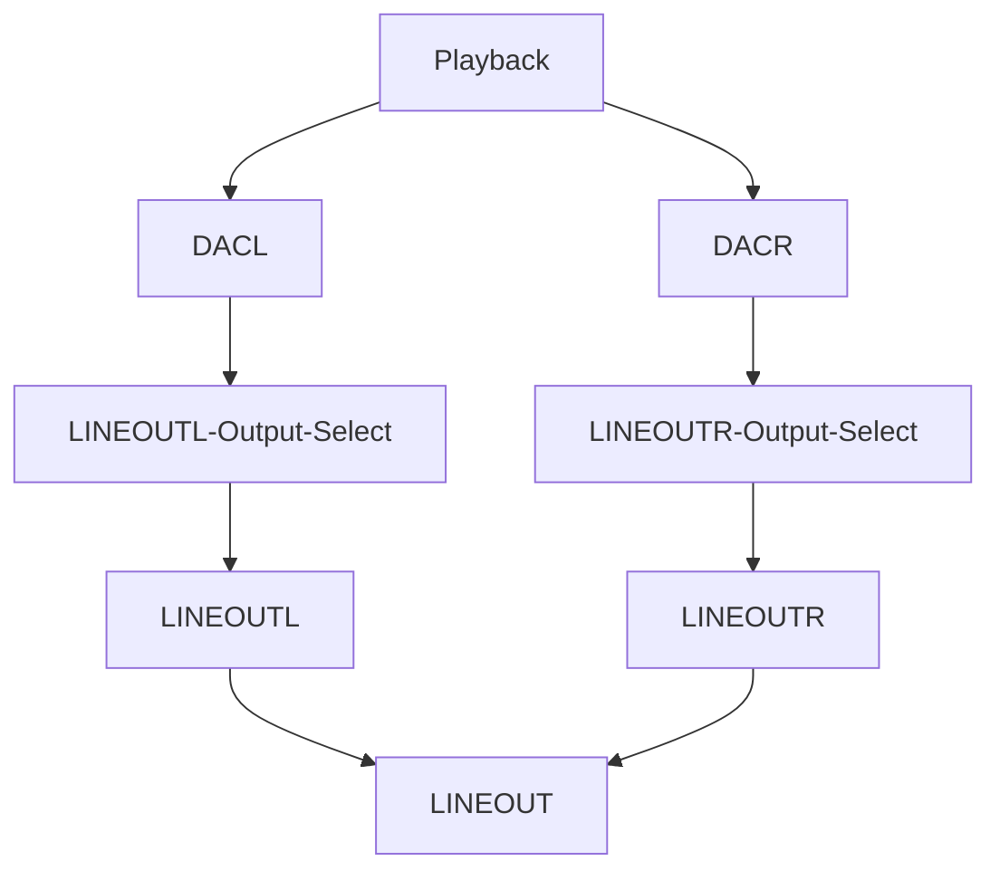

2. 录音流

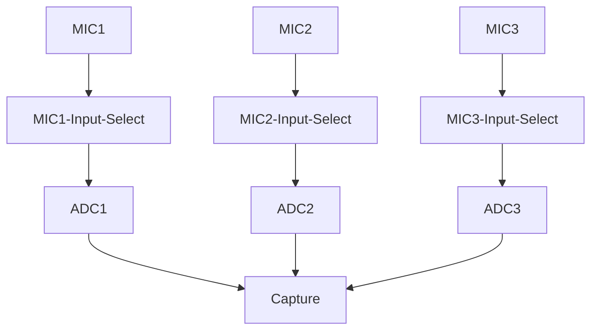

### 驱动配置

驱动配置在 menuconfig 中在下列位置

```
Drivers Options --->
	soc related device drivers --->
		SOUND Devices --->
			[*] Sound card support
				AllWinner CODEC drivers --->
					[*] Allwinner AudioCodec support
						Allwinner AudioCodec Choose --->
						[*] Allwinner AudioCodec DAC Support 
						[*] Allwinner AudioCodec ADC Support
```

其中 `Allwinner AudioCodec DAC Support ` 是 DAC 模块，`Allwinner AudioCodec ADC Support` 是 ADC 模块。

参数配置如下：

```
[audiocodec]
dacl_vol = 129 //dac左声道硬件数字音量
dacr_vol = 129 //dac右声道硬件数字音量
lineout_vol = 5 //lineout硬件数字音量
lineoutl_en = 1 //lineout左声道使能
lineoutr_en = 0 //lineout右声道禁用
adc1_vol = 129 //adc1硬件数字音量
adc2_vol = 129 //adc2硬件数字音量
adc3_vol = 129 //adc3硬件数字音量
mic1_gain = 19 //mic1硬件增益
mic2_gain = 19 //mic2硬件增益
mic3_gain = 0 //mic3硬件增益
mic1_en = 1 //mic1使能
mic2_en = 1 //mic2使能
mic3_en = 1 //mic3使能
mad_bind_en = 0 //mad禁用
pa_pin_msleep = 10 //pa开启延时
pa_pin = port:PB3<1><default><1><1> //pa引脚配置
capture_cma = 30720 //录音最大缓存配置
```

### 声卡控件

声卡控件可以通过 `AudioCodec-DAC` 命令查看。

```c
# AudioCodec-DAC
    Card Name:audiocodecdac.
    numid=0, name='DACL dig volume'
    value=129, min=0, max=255
    numid=1, name='DACR dig volume'
    value=129, min=0, max=255
    numid=2, name='LINEOUTL switch'
    value=on, enum=off on
    numid=3, name='LINEOUTR switch'
    value=on, enum=off on
    # AudioCodec-ADC
    Card Name:audiocodecadc.
    numid=0, name='bind mad function'
    value=unbound, enum=unbound mad_bind
    numid=1, name='lpsd channel sel function'
    value=0th_chan, enum=0th_chan 1st_chan 2nd_chan 3rd_chan 4th_chan 5th_chan 6 th_chan 7th_chan
    numid=2, name='mad standby channel sel function'
    value=Zero_Chan, enum=Zero_Chan Two_Chan Three_Chan Four_Chan
    numid=3, name='mad standby control'
    value=RESUME, enum=RESUME SUSPEND
    numid=4, name='MIC1 volume'
    value=31, min=0, max=31
    numid=5, name='MIC2 volume'
    value=31, min=0, max=31
    numid=6, name='MIC3 volume'
    value=31, min=0, max=31
    numid=7, name='MIC1 switch'
    value=on, enum=off on
    numid=8, name='MIC2 switch'
    value=on, enum=off on
    numid=9, name='MIC3 switch'
    value=on, enum=off on
```

控件名称与功能如下表所示：

| 控件名称        | 功能              | 数值                    |
| --------------- | ----------------- | ----------------------- |
| DACL dig volume | DACL 数字音量调节 | 0->255 (-64->63dB)      |
| DACR dig volume | DACR 数字音量调节 | 0->255 (-64->63dB)      |
| MIC1 volume     | MIC1 增益调节     | 0->31 (0,6,6,6,9->36dB) |
| MIC2 volume     | MIC2 增益调节     | 0->31 (0,6,6,6,9->36dB) |
| MIC3 volume     | MIC3 增益调节     | 0->31 (0,6,6,6,9->36dB) |
| LINEOUTL switch | LINEOUTL 输出开关 | off;on                  |
| LINEOUTR switch | LINEOUTR 输出开关 | off;on                  |
| MIC1 switch     | MIC1 输入开关     | off;on                  |
| MIC2 switch     | MIC2 输入开关     | off;on                  |
| MIC3 switch     | MIC3 输入开关     | off;on                  |

### 使用方法

!> 假设 AudioCodec-DAC 声卡序号为 0，AudioCodec-ADC 声卡序号为 1。

#### 录音

用 MIC1 录音，并将数据保存在 /data/test.wav 文件

```shell
# 打开 MIC1 switch
~# amixer -c 1 set 7 1
Card Name:  audiocodecadc. numid=7,
			name='MIC1 switch'
			value=on, enum=off on

# 执行录音操作
~# arecord /data/test.wav -D hw:audiocodecadc -c 2 -r 16000 -d 5 -p 320 -b 1280

card:        hw:audiocodecadc
period_size: 320
buffer_size: 1280

malloc rest=320000
please wait...writing data(320000 bytes) into /data/test.wav
write finish...

riffType:   RIFF
waveType:   WAVE
channels:   2
rate:       16000
bits:       16
align:      4
data size:  320000
```

#### 播放

播放 /data/test.wav 音频文件

```
# 打开LINEOUTL/R switch
~# amixer -c 0 set 2 1
Card Name:  audiocodecdac. numid=2,
			name='LINEOUTL switch'
			value=on, enum=off on
			
~# amixer -c 0 set 3 1
Card Name:  audiocodecdac.
			numid=3, name='LINEOUTR switch'
			value=on, enum=off on

# 执行播放操作
~# aplay /data/test.wav -D hw:audiocodecdac -p 320 -b 1280

riffType:   RIFF
waveType:   WAVE
channels:   2
rate:       16000
bits:       16
align:      4
data size:  320000
```

## I2S/PCM

数字音频信号传输标准 I2S/PCM

### 驱动特性

- 支持多种采样率格式
  - 播放：8~384kHz
  - 录音：8~384kHz
- 支持多通道播放和录音
  - 播放：1~16
  - 录音：1~16
- 支持16/20/24/32bit 数据精度（硬件支持8/12/16/20/24/28/32bit）
- 支持 5 种TDM 模式
  - I2S standard mode
  - Left-justified mode
  - Right-justified mode
  - DSP-A mode (short frame PCM mode)
  - DSP-B mode (long frame PCM mode)
- 支持loopback 回环模式
- 支持同时playback 和capture (全双工模式)
- 支持硬件重采样
- 支持多声卡同源播放
- 支持多声卡同步录音

### 音频通路

1. 播放流

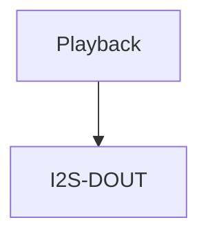

2. 录音流

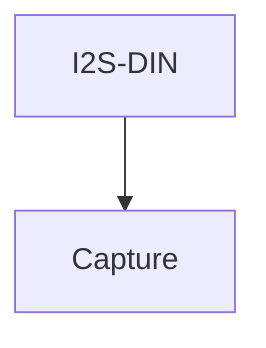

3. 回环流

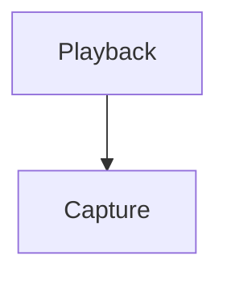

### 引脚模式配置

```shell
[daudio0]
pin_mclk = port:PA23<2><0><1><default>
pin_bclk = port:PA20<2><0><1><default>
pin_lrck = port:PA19<2><0><1><default>
pin_dout0 = port:PA22<2><0><1><default>
pin_din0 = port:PA21<2><0><1><default>
tdm_num = 0
daudio_master = 4
audio_format = 1
signal_inversion = 1
pcm_lrck_period = 64
slot_width_select = 32
msb_lsb_first = 0
frametype = 0
tx_data_mode = 0
rx_data_mode = 0
tdm_config = 1
mclk_div = 2
rx_sync_en = 0
rx_sync_ctl = 0
```

配置项说明：

| 配置项名称        | 配置项说明                                                   |
| ----------------- | ------------------------------------------------------------ |
| pin_mclk          | MCLK 引脚的设置                                              |
| pin_bclk          | BCLK 引脚的设置                                              |
| pin_lrck          | LRCK 引脚的设置                                              |
| pin_dout0         | DOUT0 引脚的设置                                             |
| pin_din0          | DIN0 引脚的设置                                              |
| tdm_num           | I2S 使用数量的设置                                           |
| daudio_master     | 设备主从模式的设置<br />1：BCLK、LRCK 由外部 CODEC 提供；<br />2：BCLK 由 SoC 提供，LRCK 由外部 CODEC 提供；<br />3：BCLK 由外部 CODEC 提供，LRCK 由 SoC 提供；<br />4：BCLK、LRCK 由 SoC 提供 |
| audio_format      | 5 种 TDM 模式的设置，标准模式为 1、左对齐模式为 2、右对齐模式为 3、长帧模式为 4、短帧模式为 5 |
| signal_inversion  | BCLK 和 MCLK 信号的翻转选择，默认都不翻转，为 1，MCLK 翻转为 2，BCLK 为 3，都翻转则为 4 |
| pcm_lrck_period   | LRCK 的宽度，可选项: 16/32/64/128/256                        |
| slot_width_select | slot 的宽度，可选项: 8/16/32                                 |
| msb_lsb_first     | 大小端的设置，0 为大端，1 为小端                             |
| frametype         | 长帧模式和短帧模式的选择，0 为短帧，1 为长帧                 |
| tx_data_mode      | 发送端数据格式的选择，0 为 16 位线性 pcm 数据                |
| rx_data_mode      | 接收端数据格式的选择，0 为 16 位线性 pcm 数据                |
| tdm_config        | 设置 TDM 模式，0 为 DSP 的两个模式，1 为 I2S 的三种模式      |
| mclk_div          | MCLK 分频系数，为 0 时无输出，可选项: 1/2/4/6/8/12/16/24/32/48/64/96/128/176/192 |
| rx_sync_en        | 同步录音功能的使能                                           |
| rx_sync_ctl       | 设置同步录音功能是否透出控件开关                             |

### 驱动配置

驱动配置在 menuconfig 中在下列位置

```
Drivers Options --->
	soc related device drivers --->
		SOUND Devices --->
			[*] Sound card support
				Platform(Audio Interface) drivers --->
					[*] Allwinner Digital Audio Support
						Allwinner Digital Audio Choose --->
							[*] Allwinner Daudio0 Support 
							[*] Allwinner Daudio1 Support 
							[*] Allwinner Daudio2 Support 
							[*] Allwinner Daudio3 Support
```

配置项说明

- Allwinner Daudio0 Support
  - I2S/PCM0 模块

- Allwinner Daudio1 Support
  - I2S/PCM1 模块
- Allwinner Daudio2 Support
  - I2S/PCM2 模块
- Allwinner Daudio3 Support
  - I2S/PCM3 模块

### 声卡控件

控件列表：

```
Card Name:snddaudio0.
	numid=0, name='tx hub mode'
		value=Off, enum=Off On
	numid=1, name='rx sync mode'
		value=Off, enum=Off On
	numid=2, name='loopback debug'
		value=Off, enum=Off On
	numid=3, name='sunxi daudio asrc function'
		value=Off, enum=Off On
```

控件名称与功能如下表所示：

| 控件名称                   | 功能         | 数值   |
| -------------------------- | ------------ | ------ |
| tx hub mode                | 同源播放开关 | Off;On |
| rx sync mode               | 同步采样开关 | Off;On |
| loopback debug             | 内部回录开关 | Off;On |
| sunxi daudio asrc function | 重采样开关   | Off;On |

### 使用方法

!> 假设 snddaudio0 声卡序号为 2

#### 录音

```
~# arecord /data/test.wav -D hw:snddaudio0

card:          hw:snddaudio0
period_size:   1024
buffer_size:   4096
please set capture duration..
please wait...writing data(0 bytes) into /data/test.wav 
write finish...

riffType:   RIFF
waveType:   WAVE
channels:   3
rate:       16000
bits:       16
align:      6
data size:  0
```

#### 播放

```
~# aplay /data/test.wav -D hw:snddaudio0

riffType:   RIFF
waveType:   WAVE
channels:   3
rate:       16000
bits:       16
align:      6
data size:  0
```

#### snddaudio0 声卡内部回环，播录音频格式需保持一致

```
# 1.打开 loopback 开关
~# amixer -c 2 set 2 1

Card Name:snddaudio0.
	numid=2, name='loopback debug'
			value=On, enum=Off On
			
# 2.后台播放音频
~# fork aplay /data/test.wav -D hw:snddaudio0

riffType:   RIFF
waveType:   WAVE
channels:   3
rate:       16000
bits:       16
align:      6
data size:  0

# 3.执行录音操作
~# arecord /data/test.wav -D hw:snddaudio0

card:          hw:snddaudio0
period_size:   1024
buffer_size:   4096
please set capture duration..
please wait...writing data(0 bytes) into /data/test.wav 
write finish...

riffType:   RIFF
waveType:   WAVE
channels:   3
rate:       16000
bits:       16
align:      6
data size:  0
```

## S/PDIF

S/PDIF 数字音频接口

### 驱动特性

- 支持多种采样率格式
  - 播放：22.05~192kHz
  - 录音：22.05~192kHz
- 支持多通道播放和录音
  - 播放：1~2
  - 录音：1~2
- 支持 16/20/24/32bit 数据精度（硬件支持 16/20/24bit）
- 支持 loopback 回环模式
- 支持同时 playback 和 capture (全双工模式)
- 支持 IEC-60958 协议
- 支持 IEC-61937 协议
- 支持多声卡同源播放
- 支持透传播放

### 音频通路

1. 播放通路

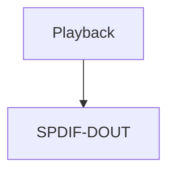

2. 录音通路

``````mermaid
graph TD;
	SPDIF-DIN-->Capture
``````

### 驱动配置

驱动配置在 menuconfig 中在下列位置

```
Drivers Options --->
	soc related device drivers --->
		SOUND Devices --->
			[*] Sound card support
				Platform(Audio Interface) drivers --->
					[*] Allwinner SPDIF Support
```

配置项说明

- Allwinner SPDIF Support
  - SPDIF 模块

### 声卡控件

控件列表：

```
Card Name:sndspdif.
numid=0, name='spdif audio format function'
	value=PCM, enum=PCM DTS
numid=1, name='spdif rx data type'
	value=IEC-60958, enum=IEC-60958 IEC-61937 numid=2, name='spdif audio hub mode'
	value=Disabled, enum=Disabled Enabled
numid=3, name='sunxi spdif loopback debug'
	value=0, min=0, max=1
```

| 控件名称                    | 功能             | 数值                |
| --------------------------- | ---------------- | ------------------- |
| spdif audio format function | 设置音频数据格式 | PCM DTS             |
| spdif rx data type          | 设置传输协议     | IEC-60958 IEC-61937 |
| spdif audio hub mode        | 同源输出开关     | Disabled : Enabled  |
| sunxi spdif loopback debug  | 内部回录开关     | 0：关闭 1：打开     |

### 使用方法

#### 播放

```c
# 播放音频
~# aplay /data/test.wav -D hw:sndspdif

riffType:   RIFF
waveType:   WAVE
channels:   2
rate:       16000
bits:       16
align:      4
data size:  320000
```

## DMIC

双/立体声数字麦克风接口。

### 驱动特性

- 支持多种采样率格式
  - 8~48kHz
- 支持多通道录音
  - channels：1~8
- 支持16/24bit 数据精度
- 支持硬件HPF 算法
- 支持多声卡同步录音

### 音频通路

1. 录音流

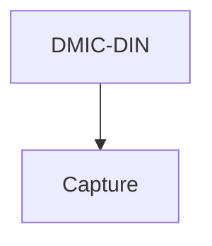

### 驱动配置

驱动配置在 menuconfig 中在下列位置

```c
Drivers Options --->
    soc related device drivers --->
        SOUND Devices --->
            [*] Sound card support
                Platform(Audio Interface) drivers --->
                	[*] Allwinner DMIC Support
```

配置项说明

- Allwinner DMIC Support
  - DMIC 模块

### 使用方法

```
# 录音
~# arecord /data/test.wav -D hw:snddmic -c 2 -r 16000 -d 5 -p 320 -b 1280

card:          hw:snddmic
period_size:   320
buffer_size:   1280
malloc rest=   320000
please set capture duration..
please wait...writing data(0 bytes) into /data/test.wav 
write finish...

riffType:   RIFF
waveType:   WAVE
channels:   2
rate:       16000
bits:       16
align:      4
data size:  320000
```

## MAD

麦克风激活检测(Microphone Activity Detection，MAD)，用于语音唤醒方案

### 驱动特性

- 支持AudioCodec、DMIC 音频传输接口；
- 支持16kHz, 48kHz 采样率，固定16bit；
- 支持一块64KB 的SRAM，可用于保存音频数据；
- 支持基于能量识别的语音检测模块LPSD（只支持单通道，16bit 数据，16kHz 采样率）。

## 音频通路

1. 唤醒状态，正常录音

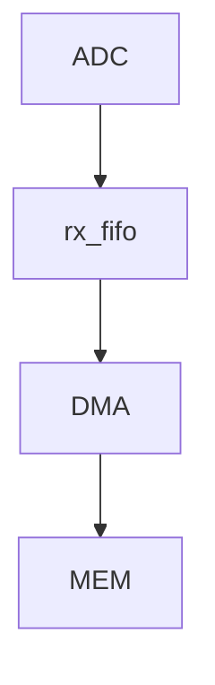

2. 进入休眠，语言能量检测

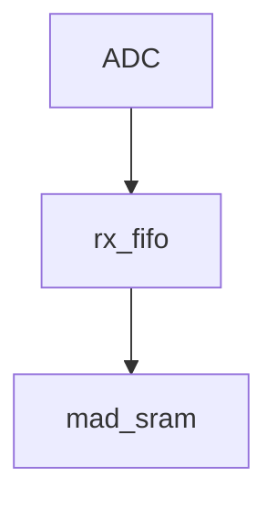

3. 触发唤醒，继续录音


### 驱动配置

驱动配置在 menuconfig 中在下列位置

```
Drivers Options --->
    soc related device drivers --->
        SOUND Devices --->
            [*] Sound card support
                Platform(Audio Interface) drivers --->
                	[*] Allwinner MAD Support
```

!> 需要同时使能录音源模块驱动才可正常工作，如录音源为AudioCodec，则需使能AudioCodec 驱动。

### 声卡控件

?> 以mad 绑定AudioCodec 声卡为例。

控件列表：

```
Card Name:audiocodecadc.
	numid=0, name='bind mad function'
		value=unbound, enum=unbound mad_bind
	numid=1, name='lpsd channel sel function'
		value=0th_chan, enum=0th_chan 1st_chan 2nd_chan 3rd_chan 4th_chan 5th_chan 6th_chan 7th_chan
	numid=2, name='mad standby channel sel function'
		value=Zero_Chan, enum=Zero_Chan Two_Chan Three_Chan Four_Chan
	numid=3, name='mad standby control'
		value=RESUME, enum=RESUME SUSPEND
	numid=4, name='MIC1 volume'
		value=31, min=0, max=31
	numid=5, name='MIC2 volume'
		value=31, min=0, max=31
	numid=6, name='MIC3 volume'
		value=31, min=0, max=31
	numid=7, name='MIC1 switch'
		value=on, enum=off on
	numid=8, name='MIC2 switch'
		value=on, enum=off on
	numid=9, name='MIC3 switch'
		value=on, enum=off on
```

如上，控件0-3 为mad 模块控件，控件4-9 为AudioCodec 模块控件。

| 控件名称                         | 功能                      | 数值                         |
| -------------------------------- | ------------------------- | ---------------------------- |
| bind mad function                | 是否绑定 MAD 功能         | 0: 不绑定; 1: 绑定           |
| lpsd channel sel Function        | 选择作为能量唤醒的通道    | 0: 通道 0; 1: 通道 1;        |
| mad_standby channel sel Function | 设定休眠时 mad 录音通道数 | Zero_Chan: 实际录音通道      |
| mad standby control              | 休眠测试使用              | Two_Chan: 只录制两通道Off;On |

### 使用方法

#### 语音唤醒

安静环境下，开启录音后进入休眠暂停录音，此时外界制造音量较大的声音，mad 模块触发唤醒
cpu，并自动继续录音。

1. 录音前控件设置

假设使用AudioCodec 模块MIC1 单通道作为能量能量唤醒通道。

```
~# amixer -c 0 set "bind mad function" 1
~# amixer -c 0 set "lpsd channel sel function" 0
~# amixer -c 0 set "mad standby channel sel function" 0
~# amixer -c 0 set "MIC2 switch" 0
~# amixer -c 0 set "MIC3 switch" 0
```

2. 开启录音

```
# 录音参数为单通道、16kHz采样率、16bit。
~# fork arecord -D hw:audiocodecadc -c 1 -r 16000 -d 20 -p 320 -b 1280 /data/test.wav
```

3. 进入休眠

```
# 如使用休眠测试命令进入休眠，此时arecord 录音将被暂停
~# rpccli arm standby
```

4. 外界声音唤醒

制造较大音量的外界声音，系统唤醒，并自动恢复arecord 录音，查看录音文件可录到外界唤醒声音。

#### 语音唤醒能量唤醒阈值参数

语音唤醒能量唤醒阈值参数能量唤醒模块lpsd，识别能量主要有两个方向，瞬时能量和累计能量（前者比如是关门声，后者比如是不断说话）能量检测参数配置在 `lichee/rtos-hal/hal/source/sound/platform/sunximad.c` 修改。

| 参数名称   | 功能                 | 可设范围     | 推荐值 |
| ---------- | -------------------- | ------------ | ------ |
| lpsd_th    | 累积语音能量检测阈值 | 0x0 - 0xFFFF | 1200   |
| lpsd_rrun  | 语音能量检测开始时间 | 0x0 - 0xFF   | 145    |
| lpsd_rstop | 语音能量检测结束时间 | 0x0 - 0xFF   | 170    |

- 瞬时能量检测参数，主要是 lpsd_rrun 和 lpsd_rstop。

  - 一般只对 stop 值进行修改;

  - 如果录音数据经常缺少唤醒词的第一个字，则可以尝试降低 stop 值，可以有效提高唤醒词数据的完整性。但同时会提高误唤醒率，环境噪音也会很容易触发能量检测，唤醒系统;

  - 如果想要降低误唤醒率 (环境噪音造成唤醒)，则可以尝试提高 stop 值。同样的，这会导致一些唤醒词录音数据不完整，例如一些音量较低，音调较低的语料;

  - 唤醒词识别率以及误唤醒率无法同时兼得，客户需要根据实际需求、场景，权衡配置参数;

- 累积能量检测参数，主要是 lpsd_th。
  - 建议使用默认值 1200，建议修改范围 50~1200。

## 模块接口说明

### 源文件列表

1. `platform` 层

```
lichee/rtos-hal/hal/source/sound/platform .
├── Kconfig
├── Makefile
├── objects.mk
├── sun8iw19-daudio.c
├── sunxi-daudio.c           # platform 层 –> I2S/PCM，负责 I2S/PCM 模块硬件参数、DMA 相关配置。
├── sunxi-daudio.h           # platform 层 –> I2S/PCM，负责 I2S/PCM 模块硬件参数、DMA 相关配置。
├── sunxi-dmic.c
├── sunxi-dmic.h
├── sunxi-dummy-cpudai.c     # platform 层 –> AudioCodec，负责 AudioCodec 模块 DMA 相关配置。
├── sunxi-mad.c
├── sunxi-mad.h
├── sunxi-pcm.c              # platform 层 –> 公共部分，负责音频流传输，使用 DMA 方式，提供注册 platform 设备的公共函数。
├── sunxi-pcm.h              # platform 层 –> 公共部分，负责音频流传输，使用 DMA 方式，提供注册 platform 设备的公共函数。
├── sunxi-spdif.c            # platform 层 –> SPDIF，负责 SPDIF 模块硬件参数、DMA 相关配置。
├── sunxi-spdif.h            # platform 层 –> SPDIF，负责 SPDIF 模块硬件参数、DMA 相关配置。
├── platforms
    ├── daudio-sun20iw2.h    # platform 层 –> DMIC、SPDIF、DAUDIO 时钟框架代码
    ├── dmic-sun20iw2.h      # platform 层 –> DMIC、SPDIF、DAUDIO 时钟框架代码
    ├── mad-sun20iw2.c       # platform 层 –> DMIC、SPDIF、DAUDIO 时钟框架代码
    ├── mad-sun20iw2.h       # platform 层 –> DMIC、SPDIF、DAUDIO 时钟框架代码
    ├── spdif-sun20iw2.h     # platform 层 –> DMIC、SPDIF、DAUDIO 时钟框架代码
```

2. `codec` 层

```
lichee/rtos-hal/hal/source/sound/codecs .
├── ac101s.c               # codec 层 –> AC101s codec
├── ac101s.h               # codec 层 –> AC101s codec
├── dummy_codec.c          
├── sun20iw2-codec-adc.c   # codec 层 –> AudioCodec，负责 AudioCodec 模块硬件参数配置
├── sun20iw2-codec.c       # codec 层 –> AudioCodec，负责 AudioCodec 模块硬件参数配置
├── sun20iw2-codec-dac.c   # codec 层 –> AudioCodec，负责 AudioCodec 模块硬件参数配置
├── sun20iw2-codec.h       # codec 层 –> AudioCodec，负责 AudioCodec 模块硬件参数配置
├── sunxi-codec.h          # codec 层 –> 公共部分
├── sunxi_rw_func.c
```

3. `machine` 层

```
lichee/rtos/projects/xxx/src .
├── card_default.c         # 负责 platform 层和 codec 层绑定。
```

## 软件框图

### 关键数据结构

#### pcm 数据类结构体

1. `sunxi_dma_params`

定义audio DAI DMA 相关参数。

```c
struct sunxi_dma_params {
	char *name;
	dma_addr_t dma_addr;
	uint32_t src_maxburst;
	uint32_t dst_maxburst;
	uint8_t dma_drq_type_num;
};
```

2. platform 类结构体 

- `DAUDIO`

I2S/PCM 模块总结构体，包含基础平台资源、特定功能私有参数

```c
struct sunxi_daudio_info {
	struct snd_platform *platform;
	struct sunxi_daudio_clk clk;
	struct daudio_pinctrl *pinctrl;
	uint8_t pinctrl_num;
	struct pa_config *pa_cfg;
	uint8_t pa_cfg_num;

	struct sunxi_daudio_param param;
	struct sunxi_dma_params playback_dma_param;
	struct sunxi_dma_params capture_dma_param;

	uint8_t global_enable;
	unsigned int hub_mode;
	bool playback_en;
	bool capture_en;
	int asrc_en;
};
```

- `SPDIF`

```c
/* 用于描述引脚*/
typedef struct {
    gpio_pin_t gpio;
    unsigned int mux;
} spdif_gpio;

/* 用于描述SPDIF 引脚*/
typedef struct {
    spdif_gpio out;
    spdif_gpio in;
} spdif_gpio_t;

/* 包含了DMA 相关参数以及时钟结构体*/
struct sunxi_spdif {
    struct sunxi_dma_params playback_dma_param;
    struct sunxi_dma_params capture_dma_param;
    struct sunxi_spdif_clk clk;
};
```

- `DMIC`

```c
/* 用于描述引脚*/
typedef struct {
    gpio_pin_t gpio;
    int mux;
} dmic_gpio;

/* 用于描述DMIC 引脚*/
typedef struct {
    dmic_gpio clk;
    dmic_gpio din0;
    dmic_gpio din1;
    dmic_gpio din2;
    dmic_gpio din3;
} dmic_gpio_t;

/* 用于描述DMIC 采样率*/
struct dmic_rate {
    unsigned int samplerate;
    unsigned int rate_bit;
};

/* 包含了DMA 相关参数，通道数以及时钟结构体*/
struct sunxi_dmic {
    struct sunxi_dma_params capture_dma_param;
    u32 chanmap;
    struct sunxi_dmic_clk clk;
};
```

### codec 类结构体

#### AudioCodec

AudioCodec 模块总结构体，包含基础平台资源、特定功能私有参数

```c
struct sunxi_codec_info {
	struct snd_codec *codec;

	void *codec_base_addr;
	struct sunxi_codec_clk clk;
	struct sunxi_codec_param param;

#ifdef CONFIG_SND_PLATFORM_SUNXI_MAD
	int capturing;
	struct sunxi_mad_priv mad_priv;
#endif
};
```

## 软件重要接口

!> 仅说明自定义软件接口，alsa 框架内部接口不做说明。

### pcm 相关接口

#### 创建 pcm 设备

函数原型：

```c
int sunxi_pcm_new(struct snd_pcm *pcm)
```

参数:

- pcm: pcm设备信息

返回值:

- 0: 成功
- 其他:失败

#### 释放 pcm 设备

函数原型

```c
void sunxi_pcm_free_dma_buffer(struct snd_pcm *pcm, int stream)
```

参数:

- pcm: pcm设备信息
- stream: pcm 流信息

返回值: 无

#### 开启 pcm 设备

函数原型:

```c
int sunxi_pcm_open(struct snd_pcm_substream *substream)
```

参数:

- substream: pcm 子流信息

返回值:

- 0: 成功
- 其他:失败

#### 设置 pcm 设备参数

函数原型:

```c
int sunxi_pcm_hw_params(struct snd_pcm_substream *substream, struct snd_pcm_hw_params *params)
```

参数:

- substream: pcm 子流信息
- params: pcm 硬件参数

返回值:

- 0: 成功
- 其他:失败

#### 触发 pcm 设备运行

函数原型:

```c
int sunxi_pcm_trigger(struct snd_pcm_substream *substream, int cmd)
```

参数:

- substream: pcm 子流信息
- cmd: 触发命令

返回值:

- 0: 成功
- 其他:失败

#### 获取 pcm 设备帧点

函数原型:

```c
snd_pcm_uframes_t snd_dmaengine_pcm_pointer(struct snd_pcm_substream *substream)
```

参数:

- substream: pcm 子流信息

返回值:

- snd_pcm_uframes_t：当前DMA 缓冲指针

### Platform 层接口

#### AudioCodec接口

##### 初始化 DMA 参数

函数原型:

```c
int sunxi_cpudai_platform_probe(struct snd_platform *platform)
```

参数:

- platform: platform 信息

返回值:

- 0: 成功
- 其他:失败

##### 更新设置 DMA 参数

函数原型:

```c
int sunxi_cpudai_startup(struct snd_pcm_substream *substream, struct snd_dai *dai)
```

参数:

- substream: pcm 子流信息
- dai: cpu dai 信息

返回值:

- 0: 成功
- 其他:失败

#### I2S/PCM接口

##### I2S/PCM 模块休眠（保存寄存器、关闭时钟）

函数原型:

```c
int sunxi_daudio_suspend(struct pm_device *dev, suspend_mode_t mode)
```

参数:

- dev: 设备信息
- mode: 休眠模式

返回值:

- 0: 成功
- 其他:失败

##### I2S/PCM 模块唤醒（开启时钟、初始化模块、恢复寄存器）

函数原型:

```c
int sunxi_daudio_resume(struct pm_device *dev, suspend_mode_t mode)
```

参数:

- dev: 设备信息
- mode: 休眠模式

返回值:

- 0: 成功
- 其他:失败

##### 设置模块BCLK 分频系数

函数原型:

```c
int sunxi_daudio_set_clkdiv(struct snd_dai *dai, int clk_id, int clk_div)
```

参数:

- dai: cpu dai 信息
- clk_id: clk 辅助信息
- clk_div: clk 分频系数

返回值:

- 0: 成功
- 其他:失败

##### 设置模块工作时钟

函数原型:

```c
int sunxi_daudio_set_sysclk(struct snd_dai *dai, int clk_id, unsigned int freq, int dir)
```

参数:

- dai: cpu dai 信息
- clk_id: clk 辅助信息
- freq: 时钟频率
- dir: 时钟输出方向

返回值:

- 0: 成功
- 其他:失败

##### 设置模块I2S 格式

函数原型:

```c
int sunxi_daudio_set_fmt(struct snd_dai *dai, unsigned int fmt)
```

参数:

- dai: cpu dai 信息
- fmt: I2S 格式信息

返回值:

- 0: 成功
- 其他:失败

##### 设置模块开启工作资源(DMA 参数、组件功能等)

函数原型:

```c
int sunxi_daudio_startup(struct snd_pcm_substream *substream, struct snd_dai *dai)
```

参数:

- substream: pcm 子流信息
- dai: cpu dai 信息

返回值:

- 0: 成功
- 其他:失败

##### 设置模块硬件参数

函数原型:

```c
int sunxi_daudio_hw_params(struct snd_pcm_substream *substream, struct snd_pcm_hw_params *params, struct snd_dai *dai)
```

参数:

- substream: pcm 子流信息
- params: 硬件参数
- dai: cpu dai 信息

返回值:

- 0: 成功
- 其他:失败

##### 清除模块fifo

函数原型:

```c
int sunxi_daudio_prepare(struct snd_pcm_substream *substream, struct snd_dai *dai)
```

参数:

- substream: pcm 子流信息
- dai: cpu dai 信息

返回值:

- 0: 成功
- 其他:失败

##### 触发模块工作

函数原型:

```c
int sunxi_daudio_trigger(struct snd_pcm_substream *substream, int cmd, struct snd_dai *dai)
```

参数:

- substream: pcm 子流信息
- cmd: 触发命令
- dai: cpu dai 信息

返回值:

- 0: 成功
- 其他:失败

##### 设置模块关闭工作资源(组件功能等)

函数原型:

```c
void sunxi_daudio_shutdown(struct snd_pcm_substream *substream, struct snd_dai *dai)
```

参数:

- substream: pcm 子流信息
- dai: cpu dai 信息

返回值:

- 0: 成功
- 其他:失败

#### SPDIF

##### 初始化cpu dai (DMA、模块寄存器)

函数原型:

```c
int sunxi_spdif_dai_probe(struct snd_dai *dai)
```

参数:

- dai: cpu dai 信息

返回值:

- 0: 成功
- 其他:失败

##### 模块休眠（保存寄存器、关闭时钟）

函数原型:

```c
int sunxi_spdif_suspend(struct pm_device *dev, suspend_mode_t mode)
```

参数：

- dev: 设备信息
- mode: 休眠模式

返回值:

- 0: 成功
- 其他:失败

##### 模块唤醒（开启时钟、初始化模块、恢复寄存器）

函数原型:

```c
int sunxi_spdif_resume(struct pm_device *dev, suspend_mode_t mode)
```

参数：

- dev: 设备信息
- mode: 休眠模式

返回值:

- 0: 成功
- 其他:失败

##### 设置模块分频系数

函数原型：

```c
int sunxi_spdif_set_clkdiv(struct snd_dai *dai, int clk_id, int clk_div)
```

参数：

- dai: cpu dai 信息
- clk_id: clk 辅助信息
- clk_div: clk 分频系数

返回值:

- 0: 成功
- 其他:失败

##### 设置模块工作时钟

函数原型：

```c
int sunxi_spdif_set_sysclk(struct snd_dai *dai, int clk_id, unsigned int freq, int dir)
```

参数：

- dai: cpu dai 信息
- clk_id: clk 辅助信息
- freq: 时钟频率
- dir: 时钟输出方向

返回值:

- 0: 成功
- 其他:失败

##### 设置模块开启工作资源(DMA 参数、组件功能等)

函数原型：

```c
int sunxi_spdif_startup(struct snd_pcm_substream *substream, struct snd_dai *dai)
```

参数：

- substream: pcm 子流信息
- dai: cpu dai 信息

返回值:

- 0: 成功
- 其他:失败

##### 设置模块硬件参数

函数原型：

```c
int sunxi_spdif_hw_params(struct snd_pcm_substream *substream, struct snd_pcm_hw_params *params, struct snd_dai *dai)
```

参数：

- substream: pcm 子流信息
- params: 硬件参数
- dai: cpu dai 信息

返回值:

- 0: 成功
- 其他:失败

##### 清除模块fifo，清除中断

函数原型：

```c
int sunxi_spdif_prepare(struct snd_pcm_substream *substream, struct snd_dai *dai)
```

参数：

- substream: pcm 子流信息
- dai: cpu dai 信息

返回值:

- 0: 成功
- 其他:失败

##### 触发模块工作

函数原型：

```c
int sunxi_spdif_trigger(struct snd_pcm_substream *substream, int cmd, struct snd_dai *dai)
```

参数：

- substream: pcm 子流信息
- cmd: 触发命令
- dai: cpu dai 信息

返回值:

- 0: 成功
- 其他:失败

#### DMIC

##### 初始化cpu dai (DMA、模块寄存器)

函数原型：

```c
int sunxi_dmic_dai_probe(struct snd_dai *dai)
```

参数：

- dai: cpu dai 信息

返回值:

- 0: 成功
- 其他:失败

##### 模块休眠（保存寄存器、关闭时钟）

函数原型：

```c
int sunxi_dmic_suspend(struct pm_device *dev, suspend_mode_t mode)
```

参数：

- dev: 设备信息
- mode: 休眠模式

返回值:

- 0: 成功
- 其他:失败

##### 模块唤醒（开启时钟、恢复寄存器）

函数原型：

```c
int sunxi_dmic_resume(struct pm_device *dev, suspend_mode_t mode)
```

参数：

- dev: 设备信息
- mode: 休眠模式

返回值:

- 0: 成功
- 其他:失败

##### 设置模块 pll clk

函数原型：

```c
int sunxi_dmic_set_sysclk(struct snd_dai *dai, int clk_id, unsigned int freq, int dir)
```

参数：

- dai: cpu dai 信息
- clk_id: clk 辅助信息
- freq: 时钟频率
- dir: 时钟输出方向

返回值:

- 0: 成功
- 其他:失败

##### 设置模块开启工作资源(DMA 参数、组件功能等)

函数原型：

```c
int sunxi_dmic_startup(struct snd_pcm_substream *substream, struct snd_dai *dai)
```

参数：

- substream: pcm 子流信息
- dai: cpu dai 信息

返回值:

- 0: 成功
- 其他:失败

##### 设置模块硬件参数

函数原型：

```c
int sunxi_dmic_hw_params(struct snd_pcm_substream *substream, struct snd_pcm_hw_params *params, struct snd_dai *dai)
```

参数：

- substream: pcm 子流信息
- params: 硬件参数
- dai: cpu dai 信息

返回值:

- 0: 成功
- 其他:失败

##### 清除模块 fifo，清除中断

函数原型：

```c
int sunxi_dmic_prepare(struct snd_pcm_substream *substream, struct snd_dai *dai)
```

参数：

- substream: pcm 子流信息
- dai: cpu dai 信息

返回值:

- 0: 成功
- 其他:失败

##### 触发模块工作

函数原型：

```c
int sunxi_dmic_trigger(struct snd_pcm_substream *substream, int cmd, struct snd_dai *dai)
```

参数：

- substream: pcm 子流信息
- cmd: 触发命令
- dai: cpu dai 信息

返回值:

- 0: 成功
- 其他:失败

### Codec 层

#### AudioCodec(ADC/DAC)

##### 模块休眠（保存寄存器、关闭时钟）

函数原型：

```c
int sunxi_codec_suspend(struct pm_device *dev, suspend_mode_t mode)
```

参数：

- dev: 设备信息
- mode: 休眠模式

返回值:

- 0: 成功
- 其他:失败

##### 模块唤醒（开启时钟、恢复寄存器）

函数原型：

```c
int sunxi_codec_resume(struct pm_device *dev, suspend_mode_t mode)
```

参数：

- dev: 设备信息
- mode: 休眠模式

返回值:

- 0: 成功
- 其他:失败

##### 设置模块时钟

函数原型：

```c
int sunxi_codec_set_sysclk(struct snd_dai *dai, int clk_id, unsigned int freq, int dir)
```

参数：

- dai: cpu dai 信息
- clk_id: clk 辅助信息
- freq: 时钟频率
- dir: 时钟输出方向

返回值:

- 0: 成功
- 其他:失败

##### 设置模块硬件参数

函数原型：

```c
int sunxi_codec_hw_params(struct snd_pcm_substream *substream, struct snd_pcm_hw_params *params, struct snd_dai *dai)
```

参数：

- substream: pcm 子流信息
- params: 硬件参数
- dai: cpu dai 信息

返回值:

- 0: 成功
- 其他:失败

##### 清除模块fifo，清除中断

函数原型：

```c
int sunxi_codec_prepare(struct snd_pcm_substream *substream, struct snd_dai *dai)
```

参数：

- substream: pcm 子流信息
- dai: cpu dai 信息

返回值:

- 0: 成功
- 其他:失败

##### 触发模块工作

函数原型：

```c
int sunxi_codec_trigger(struct snd_pcm_substream *substream, int cmd, struct snd_dai *dai)
```

参数：

- name: 声卡名称
- codec: codec 设备信息
- platform_type: platform 层设备类型

返回值:

- 0: 成功
- 其他:失败

### 软件调试接口

| 模块   | 接口              | 命令              |
| ------ | ----------------- | ----------------- |
| DMIC   | `cmd_dmic_dump`   | `cmd_dmic_dump`   |
| SPDIF  | `cmd_spdif_dump`  | `cmd_spdif_dump`  |
| DAUDIO | `cmd_daudio_dump` | `cmd_daudio_dump` |

## 模块使用

一个声卡的简单测试，包含两部分，分别为声卡的控件设置及音频测试工具的使用。本章节将从以下 4 个通用小节和 1 个外挂 codec 小节介绍声卡如何使用。

1. menuconfig 配置
2. 声卡设备查看
3. 声卡控件
4. 声卡测试工具使用
5. I2S 外挂 CODEC

### menuconfig 配置

进入menuconfig 界面：

```c
# 进入RTOS 目录执行以下命令
mrtos_menuconfig
```


```c
Drivers Options ‑‑‑>
    soc related device drivers ‑‑‑>
        SOUND Devices ‑‑‑>
            [*] Sound card support
                AW Sound Compenents ‑‑‑>
                    Allwinner alsa library (tiny alsa library) ‑‑‑>
```

还提供 aw‑tiny‑alsa‑lib, 包含了 alsa‑lib 主要的接口，没有任何插件，作用类似于 tinyalsa。aw‑tiny‑alsa‑lib 配置方法：

```
Drivers Options ‑‑‑>
    soc related device drivers ‑‑‑>
        SOUND Devices ‑‑‑>
            [*] Sound card support
                AW Sound Compenents ‑‑‑>
                    Allwinner alsa library (tiny alsa library) ‑‑‑>
```

音频工具 aw‑alsa‑utils 相关配置项：

```
Drivers Options ‑‑‑>
    soc related device drivers ‑‑‑>
        SOUND Devices ‑‑‑>
            [*] Sound card support
                AW Sound Compenents ‑‑‑>
                    [*] alsa library utils select
                    [*] alsa library utils amixer
                    [*] alsa library utils aplay
                    [*] alsa library utils arecord
                    [ ] alsa library utils aloop
```


### 声卡设备查看

可输入以下命令查看系统挂载上的声卡

```c
~# amixer -l
============= Sound Card list =============
card_num card_name
    0 	audiocodecdac
    1 	audiocodecadc
    2 	snddaudio0
    3 	snddmic
    4 	sndspdif
```

?> 可通过在 `card_default.c` 修改 “card_name”  变量，设定声卡名称。

### 声卡加载配置

声卡配置位于代码中, 路径如下：

在每个方案目录下面：
```
projects/方案/src/card_default.c
```
使用 `snd_card_register` 函数进行声卡的注册
```c
int snd_card_register(const char *name, struct snd_codec *codec, int platform_type)
```
- name: 表示声卡的名字，aw‑alsa‑lib中都需要通过该名字找到对应的声卡
- codec: codec结构体，根据实际使用的codec进行配置，如R128的audiocodec,使用sun20iw2_codec;如ac108,使用 ac108_codec
- platform_type: 与linux中ASOC框架类似，也需要指定使用哪种类型的platform,如CPUDAI, DAUDIO等

例如注册 AC108 声卡
```c
snd_card_register("ac108", &ac108_codec, SND_PLATFORM_TYPE_DAUDIO1);
```

### 声卡控件

#### alsa-utils 工具

alsa-utils 主要提供三个工具：

1. aplay: 用于完成与播放相关的操作；
2. arecord: 用于完成与录音相关的操作；
3. amixer: 用于设置相关参数。

##### aplay

输入aplay 或aplay -h 可打印出使用方法

```c
~# aplay

Usage: aplay [OPTION]... [FILE]...

-h, --help help
	--version print current version
-l, --list-devices list all soundcards and digital audio devices
-L, --list-pcms list device names
-D, --device=NAME select PCM by name
-q, --quiet quiet mode
-t, --file-type TYPE file type (voc, wav, raw or au)
-c, --channels=# channels
-f, --format=FORMAT sample format (case insensitive)
-r, --rate=# sample rate
-d, --duration=# interrupt after # seconds
...
```

**查看可以用于播放的声卡**

````c
~# aplay -l
**** List of PLAYBACK Hardware Devices ****
card 0: audiocodec [audiocodec], device 0: soc@03000000:codec_plat-sunxi-snd-codec sunxisnd-codec-0 []
	Subdevices: 1/1
	Subdevice #0: subdevice #0
card 2: snddaudio0 [snddaudio0], device 0: 2032000.daudio0_plat-snd-soc-dummy-dai snd-socdummy-dai-0 []
	Subdevices: 1/1
	Subdevice #0: subdevice #0
````

**用声卡0 设备0 播放test.wav(用 ctrl c 退出)**

```c
~# aplay -D hw:0,0 test.wav
Playing WAVE 'test.wav' : Signed 16 bit Little Endian, Rate 8000 Hz, Mono

^C Aborted by signal Interrupt...
```

##### arecord

输入arecord 或arecord -h 可打印出使用方法

```c
~# arecord

Usage: arecord [OPTION]... [FILE]...

-h, --help help
	--version print current version
-l, --list-devices list all soundcards and digital audio devices
-L, --list-pcms list device names
-D, --device=NAME select PCM by name
-q, --quiet quiet mode
-t, --file-type TYPE file type (voc, wav, raw or au)
-c, --channels=# channels
-f, --format=FORMAT sample format (case insensitive)
-r, --rate=# sample rate
-d, --duration=# interrupt after # seconds
-M, --mmap mmap stream
-N, --nonblock nonblocking mode
-F, --period-time=# distance between interrupts is # microseconds
-B, --buffer-time=# buffer duration is # microseconds
```

**查看可以用于录音的声卡**

```c
~# arecord -l

**** List of CAPTURE Hardware Devices ****
card 0: audiocodec [audiocodec], device 0: soc@03000000:codec_plat-sunxi-snd-codec sunxisnd-codec-0 []
	Subdevices: 1/1
	Subdevice #0: subdevice #0
card 1: snddmic [snddmic], device 0: 2031000.dmic_plat-snd-soc-dummy-dai snd-soc-dummy-dai-0 []
	Subdevices: 1/1
	Subdevice #0: subdevice #0
card 2: snddaudio0 [snddaudio0], device 0: 2032000.daudio0_plat-snd-soc-dummy-dai snd-socdummy-dai-0 []
	Subdevices: 1/1
	Subdevice #0: subdevice #0
...
```

**用声卡1 的设备0 进行采样位数为16 的录音，并把数据保存在test.wav(用ctrl c 退出)**

```c
~# arecord -D hw:1,0 -f S16_LE test.wav

Recording WAVE 'test.wav' : Signed 16 bit Little Endian, Rate 8000 Hz, Mono

^C Aborted by signal Interrupt...
```

##### amixer

输入amixer 或amixer -h 可打印出使用方法

```c
~# amixer -h

Usage: amixer <options> [command]

Available options:
-h,--help this help
-c,--card N select the card
-D,--device N select the device, default 'default'
-d,--debug debug mode
-n,--nocheck do not perform range checking
-v,--version print version of this program
-q,--quiet be quiet
-i,--inactive show also inactive controls
-a,--abstract L select abstraction level (none or basic)
-s,--stdin Read and execute commands from stdin sequentially
-R,--raw-volume Use the raw value (default)
-M,--mapped-volume Use the mapped volume

Available commands:
scontrols show all mixer simple controls
scontents show contents of all mixer simple controls (default command)
sset sID P set contents for one mixer simple control
sget sID get contents for one mixer simple control
controls show all controls for given card
contents show contents of all controls for given card
cset cID P set control contents for one control
cget cID get control contents for one control
```

**查看声卡 1 的控件**

```c
~# amixer -c 1 scontrols

Simple mixer control 'L0 volume',0
Simple mixer control 'L1 volume',0
Simple mixer control 'L2 volume',0
Simple mixer control 'L3 volume',0
Simple mixer control 'R0 volume',0
Simple mixer control 'R1 volume',0
Simple mixer control 'R2 volume',0
Simple mixer control 'R3 volume',0
Simple mixer control 'rx sync mode',0
```

**查看声卡 1 的控件的具体配置**

```c
~# amixer -c 1 scontents
Simple mixer control 'L0 volume',0
    Capabilities: volume volume-joined
    Playback channels: Mono
    Capture channels: Mono
    Limits: 0 - 255
    Mono: 176 [69%]
Simple mixer control 'L1 volume',0
    Capabilities: volume volume-joined
    Playback channels: Mono
    Capture channels: Mono
    Limits: 0 - 255
    Mono: 176 [69%]
Simple mixer control 'L2 volume',0
    Capabilities: volume volume-joined
    Playback channels: Mono
    Capture channels: Mono
    Limits: 0 - 255
    Mono: 176 [69%]
...
```

**设置声卡 1 第一个控件的值**

```c
# 拿到声卡1所有控件
~# amixer -c 1 controls
numid=2,iface=MIXER,name='L0 volume'
numid=4,iface=MIXER,name='L1 volume'
numid=6,iface=MIXER,name='L2 volume'
numid=8,iface=MIXER,name='L3 volume'
numid=3,iface=MIXER,name='R0 volume'
numid=5,iface=MIXER,name='R1 volume'
numid=7,iface=MIXER,name='R2 volume'
numid=9,iface=MIXER,name='R3 volume'
numid=1,iface=MIXER,name='rx sync mode'

# 拿到控件内容
~# amixer cget numid=2,iface=MIXER,name='L0 volume'
numid=2,iface=MIXER,name='rx sync mode'
    ; type=ENUMERATED,access=rw------,values=1,items=2
    ; Item #0 'Off'
    ; Item #1 'On'
    : values=0

# 设置控件值
~# amixer cset numid=2,iface=MIXER,name='L0 volume' 1
numid=2,iface=MIXER,name='rx sync mode'
    ; type=ENUMERATED,access=rw------,values=1,items=2
    ; Item #0 'Off'
    ; Item #1 'On'
    : values=1
```

###  aw‑alsa‑lib 插件配置

aw‑alsa‑lib 与 linux 上 alsa‑lib 一样支持多种插件, 插件的选择、使用, 需要在代码中进行配置, 路径如下:

```c
在每个方案目录下面：
projects/方案/src/alsa_config.c
```

下面根据插件类型进行简单说明

####  hw 插件

```c
static const snd_pcm_hw_config_t snd_pcm_hw_config = {
    .card_name = "audiocodec",
    .device_num = 0,
};
```

- card_name: 声卡名称,需要与card_default.c中注册声卡时指定的名称一致
- device_num: pcm设备序号，目前仅支持一个pcm设备，所以只能为0

#### dmix 插件

```c
static const snd_pcm_dmix_config_t snd_pcm_dmix_config = {
    .type = "dmix",
    .ipc_key = 2222,
    .slave = {
        .pcm = "hw:audiocodec",
        .format = SND_PCM_FORMAT_S16_LE,
        .rate = 48000,
        .channels = 1,
        .period_size = 1024,
        .periods = 4,
    },
};
```

- type: 插件类型dmix
- ipc_key: 需要进行混音的均要指定同一ipc_key
- slave: pcm从设备的信息
  - pcm: pcm设备的名称,必须为hw类型
  - format: 采样格式
  - rate: 采样率
  - channels: 通道数
  - period_size: period_size大小,决定中断触发频率
  - periods: periods大小,决定buffer size大小

####  dsnoop 插件

```c
static const snd_pcm_dsnoop_config_t snd_pcm_dsnoop_ref_config = {
    .type = "dsnoop",
    .ipc_key = 1114,
    .slave = {
        .pcm = "hw:ac107",
        .format = SND_PCM_FORMAT_S16_LE,
        .rate = 16000,
        .channels = 1,
        .period_size = 1024,
        .periods = 4,
    },
};
```

- type: 插件类型 dsnoop
- ipc_key: 需要进行混音的均要指定同一ipc_key
- slave: pcm从设备的信息
  - pcm: pcm设备的名称,必须为hw类型
  - format: 采样格式
  - rate: 采样率
  - channels: 通道数
  - period_size: period_size大小,决定中断触发频率
  - periods: periods大小,决定buffer size大小

#### softvol 插件

```c
static const snd_pcm_softvol_config_t snd_pcm_softvol_config = {
    .type = "softvol",
    .slave = {
        .pcm = "PlaybackPlug",
    },
    .control = {
        .control_name = "Soft Volume Master",
        .card_name = "audiocodec",
    },
    .min_dB = ‑51.0,
    .max_dB = 0.0,
    .resolution = 256,
};
```

- type: 插件类型softvol
- slave: pcm从设备的信息
  - pcm: pcm设备的名称,必须为hw类型
- control: 控件信
  - control_name: 控件名称
  - card_name: 声卡名称，指定控件位于哪个声卡中
- min_dB: 最小衰减
- max_dB: 最大衰减
- resolution: 精度

!> 注意, 在第一次使用 softvol 插件进行播放时才会生成该控件; 如果想要在声卡驱动加载的时候就添加该控件，请修改对应的 codec 文件，例如 `SND_CTL_KCONTROL_USER("Soft Volume Master", 255, 0, 255)`

#### asym 插件

```c
static const snd_pcm_asym_config_t snd_pcm_asym_config = {
    .type = "asym",
    .playback_pcm = "PlaybackSoftVol",
    .capture_pcm = "CaptureDsnoop",
};
```

- type: 插件类型softvol
- playback_pcm: 指定播放设备的名称
- capture_pcm: 指定录音设备的名称

####  route 插件

```c
static const snd_pcm_route_config_t snd_pcm_route_config = {
	.type = "route",
    .slave = {
        .pcm = "PlaybackRate",
        .channels = 1,
    },
    .ttable = {
        {0, 0, 0.5},
        {1, 0, 0.5},
        TTABLE_CONFIG_END
    },
};
```

- type: 插件类型route
- slave: pcm从设备的信息
  - pcm: pcm设备的名称
  - channels: 通道数
- ttable: 各通道配置,上面的配置表示将输入的两声道数据分别作0.5倍衰减，然后合成单声道数据
  - 第一个值表示输入的通道序号
  - 第二个值表示输出的通道序号
  - 第三个值表示衰减值
  - ttable配置最后请务必添加TTABLE_CONFIG_END,表示配置结束

####  rate 插件

```c
static const snd_pcm_rate_config_t snd_pcm_rate_config = {
	.type = "rate",
    .slave = {
        .pcm = "PlaybackDmix",
        .format = SND_PCM_FORMAT_S16_LE,
        .rate = 48000,
    },
	.converter = "speexrate",
};
```

- type: 插件类型rate
- slave: pcm从设备的信息
  - pcm: pcm设备的名称
  - format 采样精度
  - rate 采样率
- converter 指定使用的重采样算法,建议使用speexrate

#### file 插件

```c
static const snd_pcm_file_config_t snd_pcm_file_cap_config = {
	.type = "file",
    .slave = {
    	.pcm = "CaptureDsnoop",
    },
    .format = "raw",
    .mode = "adb",
    .port = 20191,
};
```

- type: 插件类型file
- slave: pcm从设备的信息
  - pcm: pcm设备的名称
- format: 音频格式，目前仅支持raw
- mode: file插件保存数据的模式，目前仅支持adb
- port: 端口号
- server: 服务器端ip，当mode为network时才有效

#### multi 插件

```c
static const snd_pcm_multi_config_t snd_pcm_3mic_1ref_config = {
    .type = "multi",
    .slaves = {
        { "a", "CaptureDsnoop3Mic", 3 },
        { "b", "CaptureDsnoopRef", 1 },
        { NULL, NULL, ‑1 },
    },
    .bindings = {
        { 0, "a", 0 },
        { 1, "a", 1 },
        { 2, "a", 2 },
        { 3, "b", 0 },
        { ‑1, NULL, ‑1 },
    },
};
```

- type: 插件类型multi
- slaves: pcm从设备的信息,上述配置表示同时对a,b两个pcm设备进行录音
  - 第一个参数表示pcm设备的别名,方便后续bingdings域指定不同的pcm设备
  - 第二个参数表示pcm设备的名称
  - 第三个参数表示通道总数
  - 注意请在配置最后添加{ NULL, NULL, ‑1 },表示结束
- bindings: 指定多个声卡的通道数排列,上述配置表示a声卡的3通道分别作为通道0,1,2输出,b声卡的通道0作为通道3输出
  - 第一个参数表示录音输出的通道序号
  - 第二个参数表示指定声卡的通道序号
  - 注意请在配置最后添加{ ‑1, NULL, ‑1 },表示结束

#### plug 插件

```C
static const snd_pcm_plug_config_t snd_pcm_plug_config = {
    .type = "plug",
    .slave = {
        .pcm = "PlaybackDmix",
        .format = SND_PCM_FORMAT_S16_LE,
        .channels = 1,
        .rate = 48000,
    },
    .rate_converter = "speexrate",
    .route_policy = "default",
    .ttable = {
        TTABLE_CONFIG_END
    },
};
```

- type: 插件类型plug
- slave: pcm从设备的信息
  - pcm: pcm设备的名称
  - format: 采样格式
  - channels: 通道数
  - rate: 采样率
- rate_converter: 指定使用的重采样算法名称
- route_policy: 使用route插件时的策略,可选average,copy,duplicate,default即为copy

- ttable: 各通道配置,上面的配置表示将输入的两声道数据分别作0.5倍衰减，然后合成单声道数据

  - 第一个值表示输入的通道序号

  - 第二个值表示输出的通道序号

  - 第三个值表示衰减值

  - ttable配置最后请务必添加TTABLE_CONFIG_END,表示配置结束

### I2S 外挂CODEC

#### 硬件连接

确保外部CODEC 芯片与SoC I2S 接口正确连接，具体确认连接如下。

- LRCK, BCLK: 确认该两线是否连接；
- MCLK: 确认外部CODEC 是否需要MCLK，若需要，则确认MCLK 信号线连接；
- DIN: 确认外部CODEC 是否需要录音功能，若需要，则确认DIN 信号线连接；
- DOUT: 确认外部 CODEC 是否需要播放功能，若需要，则确认 DOUT 信号线连接。

#### 获取外部 CODEC I2S 协议格式

确认外部 CODEC I2S 协议格式如下。

1.	功能需求：只录音、只播放、录音播放；
2.	引脚确认：I2S 序号、data 引脚序号；
3.	主从模式：SoC 作主（由 SoC 提供 BCLK,LRCK）、外挂 CODEC 作主（由外挂 CODEC提供 BCLK,LRCK）；
4.	I2S 模式：标准 I2S、I2S_L、I2S_R、DSP_A、DSP_B；
5.	LRCK 信号是否翻转；
6.	BCLK 信号是否翻转；
7.	MCLK 信号：MCLK 频率；
8.	slot 个数：最高要支持多少 slot（音频通道数）；
9.	slot 宽度：最高要支持多少 slot 宽度（音频采样位深）。

查看 “模块介绍” 说明的 “AHUB” 或 “I2S/PCM” -> “sys_conf 配置” 中的配置项说明，根据 I2S 协议格式进行配置。

## AudioSystem

对于多核异构芯片，包含 RV/M33/DSP 三个核，各自运行这一个 RTOS，他们无法同时访问操作同一个音频硬件接口，因此软件上会实现跨核音频相关的功能，并且会屏蔽底层实现细节，让应用无感知，这套软件我们称之为 AudioSystem。

### AudioSystem 软件框架

任意核上都能运行 AudioSystem, 因此可以提供统一的音频软件接口，而 AudioSystem 里面会根据实际配置对接到具体音频硬件接口，或者跨核音频接口。主要框图如下：


AudioSystem 可实现的功能包括：

- AudioTrack，支持多实例播放
- AudioRecord，支持多实例录音
- audio_plugin, 支持软件音量、重采样、精度转换、通道映射等功能
- audio_hw, 向上给 AudioTrack/AudioRecord 提供通用的数据读写接口，向下可对接本地声卡、跨核音频接口，甚至是 BT a2dp source 等功能。


### 软件配置

```
System components ‑‑‑>
	aw components ‑‑‑>
	AudioSystem Support ‑‑‑>
        [*] AW Audio System Support
        [*] Audio HW Support
        [*] Audio HW Support PCM
        [ ] Audio HW Support Multi PCM
        [ ] Audio HW Support AMP
        [ ] Audio HW Support BT
        [*] Audio HW Support EQ
        [ ] Audio HW Support AW EQ
        [*] Audio HW Support DRC
        [*] Audio Track Support
        [*] Audio Record Support
        [*] Audio System Utils
        [*] Audio Plugin Support
```

### 参数配置

AudioSystem 默认使能录音和播放的参数设置，涉及到的相关配置如下:

```
board/r128s2/pro/configs/sys_config.fex
```

根据板子的型号来选择对应的目录。这里是r128s2的pro板。录音和播放相关的参数如下：

```
[audio_hw_rv] //RV核参数配置
pcm_pb_rate = 48000
pcm_pb_channels = 1
pcm_pb_bits = 16
pcm_pb_period_size = 960
pcm_pb_periods = 4
pcm_pb_card = "hw:audiocodecdac" //播放声卡名称
amp_cap_rate = 16000
amp_cap_channels = 3
amp_cap_bits = 16
amp_cap_period_size = 320
amp_cap_periods = 4
amp_cap_card = "capture" //跨核声卡的名称

[audio_hw_dsp] //dsp核参数配置
pcm_cap_rate = 48000
pcm_cap_channels = 3
pcm_cap_bits = 16
pcm_cap_period_size = 320
pcm_cap_periods = 4
pcm_cap_card = "hw:audiocodecadc" //录音声卡名称
```

!> 请根据实际使用需求配置参数，不要随意设置参数，否则会导致录音或播放失败，因为驱动会限制 periods，period_size 还有buffer_bytes 的最小值和最大值。如果录音出现 overrun，可以尝试增大 periods，不要随意修改 period_size。

### 音频接口

头文件

```
#include <AudioSystem.h>
```

AudioSystem.h 包含了 AudioTrack.h 以及 AudioRecord.h，因此应用上可以只包含 AudioSystem.h 即可

####  AudioTrack 接口

头文件

```
#include <AudioTrack.h>
```

##### 创建 AudioTrack

```c
tAudioTrack *AudioTrackCreate(const char *name)
```

参数：

- name: 指定audio_hw名称

返回值：

- 成功则返回AudioTrack句柄，失败返回NULL。

!> name 参数可支持的值，可以通过 ahw_list 命令查看, 例如 default,amp 也可以在代码中自定义添加需要的名称，详情可以参考 audio_hw/audio_hw.c 中的 add_default_ahw 函数

##### 创建指定音频流类型的 AudioTrack

```c
tAudioTrack *AudioTrackCreateWithStream(const char *name, uint16_t type)
```

参数：

- name: 指定audio_hw名称
- type: 音频流类型，每个类型都有独自的音量调节曲线

返回值：

- 成功则返回AudioTrack句柄，失败返回NULL。

!> 如果使用 AudioTrackCreate 接口，默认使用的音频流类型是 AUDIO_STREAM_SYSTEM 音频流音量曲线在 audio_plugin/softvolume.c 里面定义, 可以参考 softvol_stream_init 函数默认加载了两种类型的曲线。

##### 设置 AudioTrack 相关音频参数

```c
int AudioTrackSetup(tAudioTrack *at, uint32_t rate, uint8_t channels, uint8_t bits)
```

参数：

- at: AudioTrack句柄
- rate: 采样率
- channels: 通道数
- bits: 采样精度

返回值：

- 成功则返回0,否则返回error code

##### 写入 PCM 数据

```c
int AudioTrackWrite(tAudioTrack *at, void *data, uint32_t size)
```

参数：

- at: AudioTrack句柄
- data: 要写入的pcm数据
- size: 数据大小,bytes

返回值：

- 成功则返回写入的字节数否则返回error code

##### 开启 AudioTrack

```c
int AudioTrackStart(tAudioTrack *at)
```

参数：

- at: AudioTrack句柄

返回值：

- 成功则返回0,否则返回error code

!> 放音流程中不一定要执行 AudioTrackStart 函数，因为在调用 AudioTrackWrite 的时候，内部会根据状态自动调用 start 的。

##### 停止 AudioTrack

```c
int AudioTrackStop(tAudioTrack *at)
```

参数：

- at: AudioTrack句柄

返回值：

- 成功则返回0,否则返回error code

##### 获取当前 AudioTrack 仍有多少数据未送入声卡

```c
int AudioTrackDelay(tAudioTrack *at)
```

参数：

- at: AudioTrack句柄

返回值：

- 成功则返回0,否则返回error code

##### 销毁 AudioTrack

```c
int AudioTrackDestroy(tAudioTrack *at)
```

参数：

- at: AudioTrack句柄

返回值：

- 成功则返回0,否则返回error code

####  AudioRecord 接口

头文件

```
#include <AudioRecord.h>
```

##### 创建 AudioRecord

```c
tAudioRecord *AudioRecordCreate(const char *name)
```

参数：

- name: 指定audio_hw名称

返回值：

- 成功则返回AudioRecord句柄，失败返回NULL。

##### 设置 AudioRecord 相关音频参数

```c
int AudioRecordSetup(tAudioRecord *ar, uint32_t rate, uint8_t channels, uint8_t bits)
```

参数：

- ar: AudioRecord句柄
- rate: 采样率
- channels: 通道数
- bits: 采样精度

返回值：

- 成功则返回0,否则返回error code

##### 获取 PCM 数据

```c
int AudioRecordRead(tAudioRecord *ar, void *data, uint32_t size)
```

参数：

- ar: AudioRecord句柄
- data: 读取的pcm数据存放的地址
- size: 数据大小,bytes

返回值：

- 成功则返回写入的字节数,否则返回error code

##### 开启 AudioRecord

```c
int AudioRecordStart(tAudioRecord *ar)
```

参数：

- ar: AudioRecord句柄

返回值：

- 成功则返回0,否则返回error code

!> 放音流程中不一定要执行 AudioRecordStart 函数，因为在调用 AudioRecordRead 的时候，内部会根据状态自动调用 start

##### 停止 AudioRecord

```c
int AudioRecordStop(tAudioRecord *ar)
```

参数：

- ar: AudioRecord句柄

返回值：

- 成功则返回0,否则返回error code

##### 销毁 AudioRecord

```c
int AudioRecordDestroy(tAudioRecord *ar)
```

参数：

- ar: AudioRecord句柄

返回值：

- 成功则返回0,否则返回error code

####  AudioSystem 其他接口

头文件

```c
#include <AudioSystem.h>
```

##### AudioSystem 初始化

```c
int AudioSystemInit(void)
```

参数：

- 无

返回值：

- 成功则返回0,否则返回error code

!> AudioSystemInit 一般在 os 的初始化流程中调用 (例如 main.c 中)

##### 软件音量控制接口

```c
int softvol_control_with_streamtype(int stream_type, uint32_t *vol_index, int16_t mode)
```

参数：

- stream_type: 音频流类型
- vol_index: 据mode得到的音量数值
- mode: 操作模式。0:读取；1：写入；2：读取范围

返回值：

- 成功则返回0,否则返回error code

!> 当 mode 为 2 时，vol_index 的值表示音量范围，低 16bit 表示最小值，高 16bit 表示最大值。

####  AudioSystem 接口示例

```c
#include <stdio.h>
#include <unistd.h>
#include <string.h>
#include <stdlib.h>
#include <unistd.h>
#include <math.h>

#include <sys/types.h>
#include <sys/stat.h>
#include <fcntl.h>

#include <console.h>

#include <AudioSystem.h>

#include "wav_parser.h"
#include <hal_thread.h>

static int g_loop_count = 0;
static int8_t g_play_or_cap = 0;
static int8_t g_record_then_play = 0;
static int8_t g_bits = 0;
static int g_run_time = 0;
static int g_at_task_id = 0;
static int g_ar_task_id = 0;
static int g_rate = 0;
static int g_channels = 0;
static char g_wav_path[128] = "16K_16bit_1ch";
static int g_tmp_arg = 0;
static char g_at_name[12] = "default";
static char g_ar_name[12] = "default";
static int g_ar_forward_port = 0;

#define LOCAL_PRIORITIES	\
	(configMAX_PRIORITIES > 20 ? configMAX_PRIORITIES - 8 : configMAX_PRIORITIES - 3)

struct as_test_data {
	int loop_count;
	int type;		/* 0:wav, 1:data */
	uint32_t rate,channels;
	void *ptr;
	int data_bytes;
	uint8_t bits;
	int8_t sec;
	int8_t record_then_play;
};

#define PI (3.1415926)
static int sine_generate(void *buf, uint32_t len, uint32_t rate, uint32_t channels, uint8_t bits, float amp)
{
	int sine_hz = 1000;
	int sine_point, sine_cycle, sine_point_bytes;
	int i,j;
	int accuracy = INT16_MAX;
	int frame_bytes;

	if (amp > 1.0)
		amp = 1.0;
	else if (amp < 0.01)
		amp = 0.01;

	frame_bytes = channels * bits / 8;
	sine_point = rate / sine_hz;
	sine_point_bytes = frame_bytes * sine_point;
	sine_cycle = len / sine_point_bytes;
	if (bits == 16) {
		int16_t *data = buf;
		accuracy = INT16_MAX;
		for (j = 0; j < sine_point; j++) {
			int16_t value = (int16_t)(amp * accuracy * sin(2 * (double)PI * j / sine_point));
			if (channels == 1) {
				data[j] = value;
			} else if (channels == 2) {
				data[2 * j] = value;
				data[2 * j + 1] = value;
			} else {
				printf("unsupport channels:%d\n", channels);
				while(1);
			}
		}
	} else if (bits == 32) {
		int32_t *data = buf;
		accuracy = INT32_MAX;
		for (j = 0; j < sine_point; j++) {
			int32_t value = (int32_t)(amp * accuracy * sin(2 * (double)PI * j / sine_point));
			if (channels == 1) {
				data[j] = value;
			} else if (channels == 2) {
				data[2 * j] = value;
				data[2 * j + 1] = value;
			} else {
				printf("unsupport channels:%d\n", channels);
				while(1);
			}
		}
	}

	for (i = 1; i < sine_cycle; i++) {
		memcpy(buf + i * sine_point_bytes, buf, sine_point_bytes);
		/*printf("[%s] line:%d buf:%p, dest:%p, ofs:%u\n", __func__, __LINE__,*/
			/*buf, buf + i * sine_point_bytes, i * sine_point_bytes);	*/
	}

	return sine_cycle * sine_point_bytes;
}

static void play_sine(tAudioTrack *at, uint32_t rate, uint8_t channels, uint8_t bits, int sec)
{
	int frame_loop = 480;
	int count, frame_bytes;
	void *buf;
	int len, size = 0;

	frame_bytes = frame_loop * channels * (bits == 16 ? 2 : 4);
	count = rate * sec / frame_loop;

	buf = malloc(frame_bytes);
	/*printf("[%s] line:%d malloc %u bytes\n", __func__, __LINE__, frame_bytes);*/
	if (!buf)
		return;

	len = sine_generate(buf, frame_bytes, rate, channels, bits, 0.8);
	while (count--) {
		size = AudioTrackWrite(at, buf, len);
		if (size != len) {
			printf("at write return %d\n", size);
			break;
		}
	}
	free(buf);
}

static void at_sine_task(void *arg)
{
	tAudioTrack *at;
	int channels = g_channels;
	int rate = g_rate;
	int sec = g_run_time;
	uint8_t bits = g_bits;

#if 1
	at = AudioTrackCreate(g_at_name);
#else
	at = AudioTrackCreateWithStream(g_at_name, AUDIO_STREAM_MUSIC);
#endif
	if (!at) {
		printf("at create failed\n");
		goto err;
	}

	AudioTrackSetup(at, rate, channels, bits);
	play_sine(at, rate, channels, bits, sec);

	AudioTrackStop(at);

	AudioTrackDestroy(at);
err:
	vTaskDelete(NULL);
}

static void at_sine_task_create()
{
	hal_thread_t handle;
	char buf[32];

	snprintf(buf, sizeof(buf), "at_sine%d", g_at_task_id);
	g_at_task_id++;
	handle = hal_thread_create(at_sine_task, NULL, buf, 8192, HAL_THREAD_PRIORITY_APP);
}

static void at_task(void *arg)
{
	tAudioTrack *at;
	struct as_test_data *data = arg;

	at = AudioTrackCreate(g_at_name);
	if (!at) {
		printf("at create failed\n");
		goto err;
	}

	if (data->type == 0)  {
        /* Pass */
	} else if (data->type == 1 && data->ptr != NULL){
		/* play pcm data */
		int value = 0;
		int count = data->loop_count;
		AudioTrackSetup(at, data->rate, data->channels, data->bits);
		while (count--) {
			AudioTrackWrite(at, data->ptr, data->data_bytes);
			value++;
			printf("[%s] line:%d playback count=%d\n", __func__, __LINE__, value);
		}
	}
	AudioTrackStop(at);

	AudioTrackDestroy(at);
err:
	if (data->ptr)
		free(data->ptr);
	free(data);
	vTaskDelete(NULL);
}

static void at_task_create(struct as_test_data *data)
{
	hal_thread_t handle;
	char buf[32];
	struct as_test_data *d;

	d = malloc(sizeof(struct as_test_data));
	if (!data) {
		d->type = 0;
		d->ptr = NULL;
		d->loop_count = g_loop_count;
	} else {
		memcpy(d, data, sizeof(struct as_test_data));
	}
	snprintf(buf, sizeof(buf), "at_task%d", g_at_task_id);
	g_at_task_id++;
	handle = hal_thread_create(at_task, d, buf, 2048, HAL_THREAD_PRIORITY_APP);
}
extern int adb_forward_create_with_rawdata(int port);
extern int adb_forward_send(int port, void *data, unsigned len);
extern int adb_forward_end(int port);
static void ar_task(void *arg)
{
	tAudioRecord *ar;
	struct as_test_data *data = arg;
	uint32_t rate = data->rate;
	uint32_t channels = data->channels;
	uint8_t bits = data->bits;
	int total, read_size, size, read = 0;
	int frame_bytes = bits / 8  * channels;
	int frames_bytes_loop = frame_bytes * rate / 100; /* 10ms */
	void *buf = NULL;

	if (data->sec)
		total = data->sec * rate * frame_bytes;
	else
		total = frames_bytes_loop; /* 10ms buffer */

#ifdef CONFIG_COMPONENTS_USB_GADGET_ADB_FORWARD
	int _port = g_ar_forward_port;
	if (g_ar_forward_port > 0)
		g_ar_forward_port = 0;
	if (adb_forward_create_with_rawdata(_port) < 0)
		_port = -1;
#endif
	ar = AudioRecordCreate(g_ar_name);
	if (!ar) {
		printf("ar create failed\n");
		goto err;
	}

	buf = malloc(total);
	if (!buf) {
		printf("no memory\n");
		goto err;
	}

	AudioRecordSetup(ar, rate, channels, bits);
	AudioRecordStart(ar);

	printf("[%s] line:%d buf:%p, %d\n", __func__, __LINE__, buf, total);
	while (data->loop_count--) {
		if (data->sec)
			total = data->sec * rate * frame_bytes;
		else
			total = frames_bytes_loop;
		read = 0;
		while (total > 0) {
			if (total > frames_bytes_loop)
				size = frames_bytes_loop;
			else
				size = total;
			read_size = AudioRecordRead(ar, buf + read, size);
			if (read_size != frames_bytes_loop) {
				printf("read_size(%d) != frames_bytes_loop(%d)\n", read_size, frames_bytes_loop);
				break;
			}
#ifdef CONFIG_COMPONENTS_USB_GADGET_ADB_FORWARD
			adb_forward_send(_port, buf + read, size);
#endif
			total -= read_size;
			read += read_size;
			/*printf("[%s] line:%d residue:%d read=%u\n", __func__, __LINE__, total, read);*/
		}
		if (read_size < 0)
			break;
	}
	AudioRecordStop(ar);
	AudioRecordDestroy(ar);
	ar = NULL;
#ifdef CONFIG_COMPONENTS_USB_GADGET_ADB_FORWARD
	adb_forward_end(_port);
	/* don't destroy port for repeating record */
	/*adb_forward_destroy(_port);*/
#endif

	vTaskDelay(pdMS_TO_TICKS(500));
	if (data->record_then_play != 0) {
		struct as_test_data d = {
			.loop_count = 1,
			.type = 1,
			.rate = rate,
			.channels = channels,
			.ptr = buf,
			.data_bytes = read,
			.bits = bits,
		};
		at_task_create(&d);
		buf = NULL;
	}

err:
	if (ar)
		AudioRecordDestroy(ar);
	free(data);
	if (buf)
		free(buf);
	vTaskDelete(NULL);
}

static void ar_task_create(struct as_test_data *data)
{
	hal_thread_t handle;
	char buf[32];
	struct as_test_data *d;

	d = malloc(sizeof(struct as_test_data));
	if (!data) {
		d->type = 0;
		d->ptr = NULL;
		d->rate = g_rate;
		d->channels = g_channels;
		d->bits = g_bits;
		d->record_then_play = g_record_then_play;
		d->loop_count = g_loop_count;
		d->sec = g_run_time;
	} else {
		memcpy(d, data, sizeof(struct as_test_data));
	}
	snprintf(buf, sizeof(buf), "ar_task%d", g_ar_task_id);
	g_ar_task_id++;
	handle = hal_thread_create(ar_task, d, buf, 2048, HAL_THREAD_PRIORITY_APP);
}

static void as_test_usage()
{
	printf("Usgae: as_test [option]\n");
	printf("-h,          as_test help\n");
	printf("-s,          stream, 0-playback; 1-capture; 2-playback sine\n");
	printf("-d,          duration, sec\n");
	printf("-r,          rate\n");
	printf("-c,          channels\n");
	printf("-b,          bits\n");
	printf("-t,          capture and then playback\n");
	printf("-n,          AudioTrack name\n");
	printf("-m,          AudioRecord name\n");
	printf("-l,          loop count\n");
	printf("-f,          adb forward port\n");
	printf("\n");
	printf("play sine:\n");
	printf("as_test -s 2 -d 10 -r 48000\n");
	printf("capture:\n");
	printf("as_test -s 1 -d 0 -l 1000 -r 16000 -c 3\n");
	printf("capture and forward:\n");
	printf("as_test -s 1 -d 0 -l 1000 -r 16000 -c 3 -f 20227\n");
	printf("\n");
}

int cmd_as_test(int argc, char *argv[])
{
	int c = 0;
	g_play_or_cap = 0;
	g_loop_count = 1;
	g_run_time = 3;
	g_rate = 16000;
	g_channels = 2;
	g_bits = 16;
	g_record_then_play = 0;

	optind = 0;
	while ((c = getopt(argc, argv, "htl:s:ad:r:c:b:g:n:m:f:")) != -1) {
		switch (c) {
		case 'h':
			as_test_usage();
			return 0;
		case 'l':
			g_loop_count = atoi(optarg);
			break;
		case 's':
			/*
			 * 0: playback
			 * 1: capture
			 * 2: playback sine
			 * */
			g_play_or_cap = atoi(optarg);
			break;
		case 'd':
			g_run_time = atoi(optarg);
			break;
		case 'r':
			g_rate = atoi(optarg);
			break;
		case 'c':
			g_channels = atoi(optarg);
			break;
		case 'b':
			g_bits = atoi(optarg);
			break;
		case 't':
			g_record_then_play = 1;
			break;
		case 'g':
			g_tmp_arg = atoi(optarg);
			break;
		case 'n':
			strncpy(g_at_name, optarg, sizeof(g_at_name));
			break;
		case 'm':
			strncpy(g_ar_name, optarg, sizeof(g_ar_name));
			break;
		case 'f':
			g_ar_forward_port = atoi(optarg);
			break;
		default:
			return -1;
		}
	}

	if (optind < argc) {
		strncpy(g_wav_path, argv[optind], sizeof(g_wav_path) - 1);
	} else {
		strcpy(g_wav_path, "16K_16bit_1ch");
	}

	switch (g_play_or_cap) {
	case 0:
		at_task_create(NULL);
		break;
	case 1:
		ar_task_create(NULL);
		break;
	case 2:
		at_sine_task_create(NULL);
		break;
	default:
		printf("unknown 's' command\n");
		break;
	}
	return  0;
}
FINSH_FUNCTION_EXPORT_CMD(cmd_as_test, as_test, audio system test);


static void as_volume_usage(void)
{
	printf("Usgae: as_volume [option]\n");
	printf("-h,          as_volume help\n");
	printf("-t,          volume type\n");
	printf("             1:system\n");
	printf("             2:music\n");
	printf("-m,          option mode\n");
	printf("             0:get\n");
	printf("             1:set\n");
	printf("             2:get range\n");
	printf("\n");
}

static int cmd_as_volume(int argc, char *argv[])
{
	int type = AUDIO_STREAM_SYSTEM;
	int volume_mode = 0;
	uint32_t volume_value = 0;
	int c = 0, ret = 0;

	optind = 0;
	while ((c = getopt(argc, argv, "ht:m:")) != -1) {
		switch (c) {
		case 't':
			type = atoi(optarg);
			break;
		case 'm':
			volume_mode = atoi(optarg);
			break;
		case 'h':
		default:
			as_volume_usage();
			return -1;
		}
	}

	if (optind < argc) {
		int value = atoi(argv[optind]);
		volume_value = (uint32_t)(value | value << 16);
	}

	ret = softvol_control_with_streamtype(type, &volume_value, volume_mode);
	if (ret != 0) {
		printf("softvol(t:%d, m:%d), control failed:%d\n", type, volume_mode, ret);
		return -1;
	}

	switch (volume_mode) {
	case 0: /* read */
		printf("softvol(%d) read, value=%d,%d\n", type,
				(volume_value & 0xffff),
				((volume_value >> 16) & 0xffff));
		break;
	case 1: /* write */
		printf("softvol(%d) write, value=%d,%d\n", type,
				(volume_value & 0xffff),
				((volume_value >> 16) & 0xffff));
		break;
	case 2: /* read range */
		printf("softvol(%d) read, min=%u, max=%u\n", type,
				(volume_value & 0xffff),
				((volume_value >> 16) & 0xffff));
		break;
	}

	return 0;
}
FINSH_FUNCTION_EXPORT_CMD(cmd_as_volume, as_volume, audio system volume control);
```

### AudioSystem 测试工具

#### ahw_list 命令

用于查看当前 audio_hw 中支持了哪些 audio_hw_elem

```
audio hw list:
instance |name |read |write
0 |default |0x04064128|0x04063ff4
2 |playback |0000000000|0x04063ff4

第一列instance, 每个elem都有一个instasnce值，决定他们是哪种类型的HW_TYPE
第二列name, 每个elem都有唯一的标志名称。
第三列read，表示读函数指针，0表示不支持读。
第四列write,表示写函数指针，0表示不支持写。
```

#### as_test 命令

as_test 可用于测试播放录音功能。

| 选项 | 功能                                                         |
| ---- | ------------------------------------------------------------ |
| ‑s   | 哪种测试；0: playback; 1: capture; 2: 播放 sine              |
| ‑d   | 运行时间 (秒); 注意, 录音会根据该值申请对应大小的内存 buffer，不能设置太大 |
| ‑l   | 循环执行次数；可以结合‑d 参数实现较低内存长时间的测试        |
| ‑r   | 采样率                                                       |
| ‑c   | 通道数                                                       |
| ‑b   | 采样精度                                                     |
| ‑t   | 录音然后播放                                                 |
| ‑n   | 指定创建 AudioTrack 时的 name 参数                           |
| ‑m   | 指定创建 AudioRecord 时的 name 参数                          |
| ‑f   | adb forward 的端口号                                         |

测试举例：

```c
播放5s 48K,2ch的正弦波数据:
as_test ‑s 2 ‑d 5 ‑r 48000 ‑c 2
    
播放5s 48K,2ch,32bit的正弦波数据:
as_test ‑s 2 ‑d 5 ‑r 48000 ‑c 2 ‑b 32
    
播放10s 16K 1ch的正弦波数据：
as_test ‑s 2 ‑d 10 ‑r 16000 ‑c 1
    
播放U盘中指定的文件：
as_test ‑s 0 ‑n playback /usb_msc/test.wav
    
录音1s钟
as_test ‑s 1 ‑m amp ‑d 1 ‑c 3 ‑f 20227
    
3通道录音100s(‑d 0表示由‑l决定时间=10000*10ms=100s)
as_test ‑s 1 ‑m amp ‑d 0 ‑l 10000 ‑c 3 ‑f 20227
    
2通道录音3s然后播放出来
as_test ‑s 1 ‑d 3 ‑c 2 ‑m amp ‑t
    
如果是在dsp使用录音的话，‑m参数要使用default。
```

####  as_volume 命令

可以通过 as_volume 命令获取或者设置不同类型的音量值。

注意需要选中 COMPONENTS_AW_AUDIO_SYSTEM_PLUGIN 之后才有该功能。

```
获取SYSTEM类型的当前音量值
命令：
as_volume ‑t 1 ‑m 0
结果：
softvol(1) read, value=5,5

设置SYSTEM类型的音量值
命令：
as_volume ‑t 1 ‑m 1 8
结果：
softvol(1) read, value=8,8

获取MUSIC类型的音量范围
命令：
as_volume ‑t 2 ‑m 2
结果：
softvol(2) read, min=0, max=10
```
####  as_debug 命令

as_debug 用于开启、关闭 AudioSystem 的调试模式。开启后会有更多 (对应代码中 `_debug `打印) 的调试信息。

开启方式：
```
as_debug 1
```


## AW 音效

FreeRTOS 中使用 AudioSystem 的 audio hw 层来实现 AW EQ 功能。该功能是 AW（AllWinner）提供的软件音效 EQ 音效，需要选择 EQ 库才能使用。

### 编译 AudioSystem 的 AW EQ

下面是编译的配置。要先选择 EQ Module，才会出现 Audio HW Support AW EQ。

```c
System components ‑‑‑>
    aw components ‑‑‑>
        Algorithm Process Module ‑‑‑>
        	[*] EQ Module
        AudioSystem Support ‑‑‑>
            [*] AW Audio System Support
            [*] Audio HW Support
            [*] Audio HW Support PCM
            [ ] Audio HW Support Multi PCM
            ‑*‑ Audio HW Support AMP
            [ ] Audio HW Support BT
            [ ] Audio HW Support EQ
            [*] Audio HW Support AW EQ
            [ ] Audio HW Support DRC
            [*] Audio Track Support
            [*] Audio Record Support
            [*] Audio System Utils
            [*] Audio Plugin Support
```

### 使用软件 AW EQ

1. 确保 data 目录下有 EQ.conf 配置文件，该配置文件保存的是调试 EQ 的参数。

EQ.conf 的路径如下:

```
board/芯片/项目/data/UDISK
```

例如 R128S2的pro板。

```
board/r128s2/pro/data/UDISK
```

2. 在应用核（RV）使用如下命令，即可调用软件 EQ 进行播放。

```
as_test ‑s 0 ‑n playbackEQ /usb_msc/test.wav
```

3. 如果更新了 EQ 参数，需要更新配置文件 EQ.conf 到 data/UDISK 目录下，使用上述命令即可生效。

### 使用 AudioSystem 的硬件 HW EQ 功能

R128 平台支持硬件 DAC 的 20‑band main EQ 和 5‑band post EQ，所以软件 AW EQ 默认不使用。

FreeRTOS 中使用 AudioSystem 的 audio hw 层来实现 HW EQ 功能。

#### 编译 AudioSystem 的 HW EQ

```
System components ‑‑‑>
    aw components ‑‑‑>
        AudioSystem Support ‑‑‑>
            [*] AW Audio System Support
            [*] Audio HW Support
            [*] Audio HW Support PCM
            [ ] Audio HW Support Multi PCM
            ‑*‑ Audio HW Support AMP
            [ ] Audio HW Support BT
            [*] Audio HW Support EQ
            [ ] Audio HW Support AW EQ
            [ ] Audio HW Support DRC
            [*] Audio Track Support
            [*] Audio Record Support
            [*] Audio System Utils
            [*] Audio Plugin Support
```

#### 使用离线 HW EQ

1. 确保 data 目录下有 R128EQ‑5band.conf 或 R128EQ‑20band.conf 配置文件，该配置文件保存的是硬件 EQ 的参数。如果上述配置文件都没有，HW EQ 就不会生效。

R128EQ‑5band.conf或R128EQ‑20band.conf的路径如下:

```
board/r128s2/pro/data/UDISK
```

根据硬件配置来选择路径。这里对应的是R128S2的pro板。

如果没有文件会打印

```
Parse from config file /data/R128EQ‑20band.conf
Failed to open /data/R128EQ‑5band.conf (2)

第一行打印表示已经读取了20band EQ的配置文件，并设置到硬件。
第二行打印表示对应路径没有配置文件，读取失败，不会配置。
```

2. 在应用核（RV）使用如下命令，即可调用 HW EQ 进行播放。

```
as_test ‑s 0 ‑n playback /usb_msc/test.wav
```

如果更新了 HW EQ 参数，需要更新配置文件 R128EQ‑5band.conf 或 R128EQ‑20band.conf 到data/UDISK 目录下。

!> 因为是硬件 EQ 是配置寄存器，所以只有开机后第一次播放音乐会生效，没有必要每次播放都更新硬件寄存器。如果更新了 HW EQ 参数，就要重启后，再次播放音乐生效

## 常用调试方法

### dump 寄存器

通过 reg_read/reg_write 命令可以读写 SoC 上的寄存器，可以通过查看 SoC 的 user manual, 得到具体模块的寄存器地址。

例如：

```c
audiocodec模块寄存器基地址为0x5096000

将0x5096000开始后面4个寄存器打印出来:
reg_read 0x5096000 0x10

将0x5096010的值设置为0x60004000
reg_write 0x5096010 0x80004000
```

### 实时获取录音数据

很多时候需要获取设备实际录音数据，用于确认数据的准确性、声学性能等，而在 RTOS 中存储介质比较有限，并且写入速度慢，并不能用于保存录音数据。这里利用 adb forword 功能，配合 alsa file 插件，可以实现基于 USB 传输的 PC 端实时获取录音数据的功能。

#### PC 端通过脚本，实时获取录音数据

!> PC 上使用脚本录音，需要对应 python2.0 的版本。如果使用更高版本的 python，需要修改代码。最终保存的文件是 pcm 数据。

准备一个 adb_record.py 写入以下脚本

```py
#!/usr/bin/python2
import sys
import socket
import time
import datetime

pc_port=11112
upload_file="data.pcm"
upload_start="‑‑>AW_RTOS_SOCKET_UPLOAD_START"
upload_end="‑‑>AW_RTOS_SOCKET_UPLOAD_END"
data_length=4096

def client_test(port):
	s = socket.socket()
	host = "localhost"
	s.connect((host,port))
	while True:
		data = s.recv(data_length)
		if upload_start in data:
			print 'recv upload start flag...data_len=%d, flag_len=%d' % (len(data), len(upload_start))
			now_time = datetime.datetime.now().strftime("%Y‑%m‑%d‑%H‑%M‑%S")
			upload_file="record‑" + now_time + ".pcm"
			if (len(upload_start) != len(data)):
				with open(upload_file.decode('utf‑8'), 'ab+') as f:
					f.write(data[len(upload_start):])
		elif upload_end in data:
			index = data.find(upload_end)
			print 'recv upload end flag...data_len=%d, str_index=%d' % (len(data), index)
			if index > 0:
				with open(upload_file.decode('utf‑8'), 'ab+') as f:
				f.write(data[:index])
				break
			else:
				if (len(data) == 0):
					print 'data is 0'
					break;
				# print 'recv data, len is ', len(data)
				with open(upload_file.decode('utf‑8'), 'ab+') as f:
					f.write(data)
					print 'finish...'
					s.close()

def main():
	if (len(sys.argv) == 2):
		port = int(sys.argv[1])
	else:
		port = pc_port
		client_test(port)
		
if __name__=='__main__':
	main()
```

借用adb工具配置好forward相关功能，并执行python脚本adb_record.py开始都等待获取录音数据

```
adb shell af ‑p 20191 ‑r
adb forward tcp:11112 tcp:20191
./adb_record.py &
```

#### 小机端使用方法

##### 使用 alsa 插件录音

可以通过串口，或者adb让设备进行录音，下面以adb方式举例：

录音60s:

```
adb shell arecord ‑DCaptureFile ‑d 60
```

一直录音：

```c
adb shell arecord ‑DCaptureFile ‑l
```

如果想终止录音，可以再起一个终端输入命令：

```
adb shell arecord ‑k
```

这里arecord命令指定的pcm设备是CaptureFile, 通过alsa_config.c配置文件发现这是一个file插件，也就是说录音数据会经过file插件处理(通过adb发送数据到PC端)

## 相关操作
### 声卡驱动的加载

声卡配置位于代码中, 路径如下：

在每个方案目录下面：
```
projects/方案/src/card_default.c
```
如果是dsp方案，该文件会在rtos‑hal仓库下：
```
rtos‑hal/hal/source/sound/card_default.c
```
使用snd_card_register函数进行声卡的注册
```c
int snd_card_register(const char *name, struct snd_codec *codec, int platform_type)
```
- name:  表示声卡的名字，aw‑alsa‑lib中都需要通过该名字找到对应的声卡
- codec: codec结构体，根据实际使用的codec进行配置
- platform_type: 与linux中ASOC框架类似，也需要指定使用哪种类型的platform,如CPUDAI, DAUDIO等

举例：

注册R128 audiocodecdac声卡
```c
card_name = "audiocodecdac";
snd_card_register(card_name, audio_codec, SND_PLATFORM_TYPE_CPUDAI_DAC);
```

### 声卡加载配置

`snd_pcm_open` 打开的声卡名字都是由 `alsa_config.c` 中配置的，该文件一般在：

在每个方案目录下面：
```
projects/方案/src/alsa_config.c
```
如果是dsp方案，该文件会在rtos‑hal仓库下：
```
rtos‑hal/hal/source/sound/component/aw‑tiny‑alsa‑lib/alsa_config.c
```
配置举例：
```c
static DEFINE_SND_PCM_HW_CONFIG(audiocodec, 0);
const snd_pcm_config_t snd_pcm_global_configs[] = {
	SND_PCM_CONFIG("hw:audiocodec", "hw", &snd_audiocodec_hw_config),
};
```
表示`snd_pcm_open`可用"hw:audiocodec"名字打开声卡，而底层声卡名字是audiocodec。

### 音量设置
录音或者播放，会出现声音过小或者过大的问题。目前可以调整音量的有两处：

#### 硬件音量调整
可以通过 amixer 去调整控件。
对于 dac 来说，硬件音量分为 DAC Digtal volume 和 LINEOUT volume

```
amixer ‑c audiocodecdac
numid=0, name='DACL dig volume'
value=129, min=0, max=255
numid=1, name='DACR dig volume'
value=129, min=0, max=255
numid=2, name='LINEOUT volume'
value=5, min=0, max=7

amixer ‑c audiocodecdac set 0 150
amixer ‑c audiocodecdac set 1 150

dig volume是硬件的数字音量调节。
amixer ‑c audiocodecdac set 2 5
这个是输出的增益。
```
上述两组硬件音量，需要根据硬件来设置，过大会导致声音出现失真。  
对于 adc 来说，硬件音量有 ADC Digtal volume 和 adc pga gain
```
amixer ‑c audiocodecadc
numid=0, name='ADC1 volume'
value=129, min=0, max=255
numid=1, name='ADC2 volume'
value=129, min=0, max=255
numid=2, name='ADC3 volume'
value=129, min=0, max=255
numid=3, name='MIC1 volume'
value=31, min=0, max=31
numid=4, name='MIC2 volume'
value=31, min=0, max=31
numid=5, name='MIC3 volume'
value=31, min=0, max=31

amixer ‑c audiocodecadc set 0 150
ADC1 volume指的是ADC Digtal volume

amixer ‑c audiocodecadc set 3 19
MIC1 volume指的是硬件pga gain。
```
上述硬件音量，需要根据硬件来设置，过大会导致声音出现失真。

#### 软件音量调整
对于使用 aw‑alsa‑lib 的系统，可以使用 softvol 插件。
该插件可以生成一个用于调整音量的控件 “Soft Volume Master”。

```
amixer ‑c audiocodec
numid=5, name='Soft Volume Master'
value=255, min=0, max=255

amixer ‑c audiocodec set 5 200
```
对于使用 aw‑tiny‑alsa‑lib 的系统，配置 AudioSystem 后，才能可以使用 softvol plugin，默认会
配置软件音量调节的功能。

```
as_volume ‑h
Usgae: as_volume [option]
    ‑h, as_volume help
    ‑t, volume type
        1:system
        2:music
    ‑m, option mode
        0:get
        1:set
        2:get range

as_volume ‑t 1 ‑m 2
softvol(1) read, min=0, max=10

as_volume ‑t 2 ‑m 2
softvol(2) read, min=0, max=10

设置system类型的音频曲线
as_volume ‑t 1 ‑m 1 8
softvol(1) write, value=8,8

读取system类型的音频曲线
as_volume ‑t 1 ‑m 0
softvol(1) read, value=8,8

设置music类型的音频曲线
as_volume ‑t 2 ‑m 1 8
softvol(2) write, value=8,8

读取music类型的音频曲线
as_volume ‑t 2 ‑m 0
softvol(2) read, value=8,8
```

## FAQ

### 常见问题

若下列问题无法解决您所遇到的问题，请到 [全志在线开发者论坛](https://bbs.aw-ol.com/) 发帖询问

#### 录音或播放变速

1. 确认录音和播放采样率和父时钟 PLL_AUDIO 是否属于同一频段。

#### AudioCodec 输入输出无声音

1. 确认通路设置。

   通过 amixer 查看 route 状态，确认是否设置了需要的上下电通路。

2. 对于喇叭，确认功放芯片使能设置。

   查看驱动源码中 gpio_spk 的 GPIO 配置并和硬件原理图比对，确认是否适配了对应的 GPIO。

#### DMIC 录音异常（静音/通道移位）
1. 确认GPIO 是否正常。

   1. 通过DataSheet 核对sys_config.fex 部分的DMIC Pin 设置；
   2. 若sys_config.fex 不支持引脚设置，则到dmic-sun20iw2.h 直接查看g_dmic_gpio 结构
      体的设置

2. 确认CLK 的频率。

   以上正常情况下，示波器查看DMIC CLK 的频率是否满足`clk_rate = sample * over_sample_rate`关系。

3. 排查硬件连接和DMIC 物料问题。

#### 外放无声
使用 aplay 进行播放，发现外放无声。通常需要排查三个方面。
1. 通路是否正确配置
```
amixer ‑c audiocodecdac
numid=3, name='LINEOUTL switch'
value=on, enum=off on

设置lineout通路
amixer ‑c audiocodecdac set 3 1
```
2. 查看 gpio 是否正确配置
```
board/r128s2/pro/configs/sys_config.fex
[audiocodec]
dacl_vol = 129
dacr_vol = 129
lineout_vol = 5
lineoutl_en = 1
lineoutr_en = 0
mic1_gain = 19
mic2_gain = 19
mic3_gain = 0
mic1_en = 1
mic2_en = 1
mic3_en = 1
mad_bind_en = 0
pa_pin_msleep = 10
pa_pin = port:PB3<1><default><1><1>
capture_cma = 30720
```
3. 查看音量是否设置为 0

#### AudioSystem 接口创建实例失败
```
as_test ‑s 2 ‑d 5 ‑n playback ‑r 48000 ‑c 2

[RV‑AudioTrack‑ERR][AudioTrackCreateWithStream](562) mt add at failed
at create failed
```
打开 as_debug
```
as_debug 1
set audio system debug:1
[RV‑AudioSystem‑INF][print_test](47) Audio System test
[RV‑AudioSystem‑DBG][print_test](48) Audio System test
[RV‑AudioSystem‑ERR][print_test](49) Audio System test
```

再次播放
```
as_test ‑s 2 ‑d 5 ‑n playback ‑r 48000 ‑c 2
[RV‑AudioTrack‑DBG][AudioTrackCreateWithStream](540)
[RV‑MixerThread‑DBG][MixerThreadAddAT](445)
[RV‑AudioHW‑DBG][find_alias_name](146) ahw alias name:playback vs playback stream:0
[RV‑AudioHW‑DBG][find_alias_name](146) ahw alias name:amp‑cap vs playback stream:0
[RV‑AudioTrack‑ERR][AudioTrackCreateWithStream](562) mt add at failed
at create failed
```
声卡驱动在 RV 核，不可能会使用跨核接口 “amp‑cap”。使用 ahw_list 查看
```
c906> ahw_list

audio hw list:
instance |name |read |write
‑‑‑‑‑‑‑‑‑‑‑‑‑‑‑‑‑‑‑‑‑‑‑
audio hw alias:
p: default ‑‑> playback
c: default ‑‑> amp‑cap
```
说明 audio_hw 中没有本地的 audio_hw_elem。在开机的时候，并没有初始化 AudioSystem 导致缺少本地 audio_hw_elem。

在启动中加上下面的代码，最好是加在声卡注册后。
`lichee/rtos/projects/r128s2/pro_c906/src/main.c`

```c
#ifdef CONFIG_COMPONENTS_AW_AUDIO_SYSTEM
AudioSystemInit();
#endif
```
#### AudioSystem 接口播放失败
```
c906> as_test ‑s 2 ‑d 5 ‑n playback ‑r 48000 ‑c 2

[RV‑AP‑chmap‑INF][chmap_ap_update_mode](151) ALL ‑> ch0(average)
[AWALSA_ERR][_snd_pcm_hw_open:452]no such card:audiocodec
[AWALSA_ERR][snd_pcm_open:258]pcm "hw:audiocodec": snd_pcm_open_config failed (return: ‑19)
[RV‑AudioHWPCM‑ERR][pcm_ahw_open](221) pcm open failed:‑19
[RV‑AudioTrack‑ERR][__AudioTrackWrite](397) writw error(MT transfer data error?)
[RV‑AudioTrack‑ERR][_AudioTrackWrite](505) write_size=480, in_size=480, written=‑1
at write return ‑1
```
上述 log 可以很明显的看到，声卡的名字不匹配，导致打开声卡失败。查看声卡的名字，以 R128 为例。

```
c906>soundcard ‑l
Sound Card list:
card_num card_name
    0 audiocodecdac
```
改为0 声卡，正常播放
```
c906> as_test ‑s 0 ‑d 5 ‑n playback ‑r 48000 ‑c 2
```

#### AudioSystem 接口录音失败

输入的指令是正确的，但是设置参数却失败。log如下
```
as_test ‑s 1 ‑d 3 ‑c 2 ‑m amp ‑t

[RV‑AudioRecord‑INF][AudioRecordParamSetup](153) create tbuf:0000000008313AA0, 1920
[RV‑AP‑chmap‑INF][chmap_ap_update_mode](153) ch0 ‑> ch0
[SND_ERR][sunxi_codec_hw_params:1036]capture only support 1~3 channel
[RV‑AP‑chmap‑INF][chmap_ap_update_mode](153) ch1 ‑> ch1
[SND_ERR][soc_pcm_hw_params:434]codec_dai set hw params failed
[ar_task] line:549 buf:00000000083EE960, 192000
Unable to install hw prams!
c906>[DSP‑AudioRecord‑ERR][__AudioRecordRead](228) read error(ST transfer data error?)
AudioRecordReadRM failed!!, return ‑1
```
这个问题也比较常见，因为驱动增加了检查，没有设置通路，直接录音就会导致这个错误。跟外放无声类似，出现录音失败或无声的问题，也是按照下面的顺序排查。
1. 录音通路是否正确配置。
2. 录音音量是否设置为 0。

## 其他

### GPIO 功能复用配置

- AudioCodec 模块：
  - 所用引脚功能均固化，无需进行 pin 功能复用配置。
- I2S/PCM，SPDIF，DMIC 模块：
  - 可选择不进行 pin 功能复用配置，该情况仍可生成声卡，但引脚无实际输入输出功能。

!> 驱动会直接从配置文件获取节点的所有引脚，与引脚的名称无关

```
# port:端口+组内序号<功能分配><内部电阻状态><驱动能力><输出电平状态> 
# <> 内为默认值则取 default

pin_xxx = port:PA23<2><0><1><default>
```


# 显示框架

RTOS 提供了一套完整的屏幕驱动，支持 RGB, i8080, SPI, DBI 格式的屏幕。

**（1）RGB 接口**

RGB接口在全志平台又称HV接口（Horizontal同步和Vertical同步）。有些LCD屏支持高级的功能比如 gamma，像素格式的设置等，但是 RGB 协议本身不支持图像数据之外的传输，所以无法通过 RGB 管脚进行对 LCD 屏进行配置，所以拿到一款 RGB 接口屏，要么不需要初始化命令，要么这个屏会提供额外的管脚给 SoC 来进行配置，比如 SPI 和 I2C 等。RGB 屏幕有许多格式，不同的位宽，不同的时钟周期。下表是位宽与时钟周期的区别。

| 位宽    | 时钟周期数 | 颜色数量和格式       | 并行\串行 RGB |
| ------- | ---------- | -------------------- | ------------- |
| 24 bits | 1 cycle    | 16.7M colors, RGB888 | 并行          |
| 18 bits | 1 cycle    | 262K colors, RGB666  | 并行          |
| 16 bits | 1 cycle    | 65K colors, RGB565   | 并行          |
| 6 bits  | 3 cycles   | 262K colors, RGB666  | 串行          |
| 6 bits  | 3 cycles   | 65K colors, RGB565   | 串行          |

串行 RGB 是相对于并行 RGB 来说，而并不是说它只用一根线来发数据，只要通过多个时钟周期才能把一个像素的数据发完，那么这样的 RGB 接口就是串行 RGB。

**（2）I8080 屏幕**

Intel 8080 接口屏(又称 MCU 接口)，很老的协议，一般用在分辨率很小的屏上。

管脚的控制脚有6种：

1. CS 片选信号，决定该芯片是否工作.
2. RS 寄存器选择信号，低表示选择 index 或者 status 寄存器，高表示选择控制寄存器。实际场景中一般接SoC的LCD_DE脚（数据使能脚）
3. WR （低表示写数据) 数据命令区分信号，也就是写时钟信号，一般接 SoC 的 LCD_CLK 脚
4. RD （低表示读数据）数据读信号，也就是读时钟信号，一般接 SoC 的 LCD_HSYNC 脚
5. RESET 复位LCD（ 用固定命令系列 0 1 0来复位)
6. Data 是双向的数据通路

I8080 根据的数据位宽接口有 8/9/16/18，连哪些脚参考，即使位宽一样，连的管脚也不一样，还要考虑的因素是 RGB 格式。

1. RGB565，总共有 65K 这么多种颜色
2. RGB666，总共有 262K 那么多种颜色
3. 9bit 固定为 262K

**（3）SPI 屏幕**

SPI LCD 是使用 SPI 总线传输图像数据的屏幕，只会出现在很低分辨率的屏幕上。一般来说开屏前都需要初始化操作。

## 适配 LCD 屏幕的步骤

1. 确保全志显示框架的内核配置有使能
2. 前期准备以下资料和信息：
   1. 屏手册。主要是描述屏基本信息和电气特性等，向屏厂索要。
   2. Driver IC 手册。主要是描述屏 IC 的详细信息。这里主要是对各个命令进行详解，对我们进行初始化定制有用，向屏厂索要。
   3. 屏时序信息。请向屏厂索要。
   4. 屏初始化代码，请向屏厂索要。一般情况下 DSI 和 I8080 屏等都需要初始化命令对屏进行初始化。
   5. 万用表。调屏避免不了测量相关电压。
3. 通过第2步屏厂提供的资料，定位该屏的类型，然后选择一个已有同样类型的屏驱动作为模板进行屏驱动添加或者直接在上面修改。
4. 修改屏驱动目录下的 `panel.c` 和 `panel.h`。在全局结构体变量 `panel_array` 中新增刚才添加 `strcut __lcd_panel` 的变量指针。`panel.h` 中新增 `strcut __lcd_panel` 的声明。
5. 修改 Makefile。在 lcd 屏驱动目录的上一级的 `Makefile` 文件中的`disp-objs`中新增刚才添加屏驱动.o
6. 修改 `sys_config.fex` 中的 `lcd0` 节点。
7. 编译测试

## LCD 屏幕驱动源码

### LCD 屏幕驱动源码结构

```
.
├── Kconfig
├── Makefile
├── disp
│   ├── Kconfig
│   ├── Makefile
│   ├── de                            # Display Engine 层驱动，包括图层与显示控制
│   │   ├── Makefile
│   │   ├── bsp_display.h
│   │   ├── disp_capture.c
│   │   ├── disp_capture.h
│   │   ├── disp_device.c
│   │   ├── disp_device.h
│   │   ├── disp_display.c
│   │   ├── disp_display.h
│   │   ├── disp_enhance.c
│   │   ├── disp_enhance.h
│   │   ├── disp_features.c
│   │   ├── disp_features.h
│   │   ├── disp_hdmi.c
│   │   ├── disp_hdmi.h
│   │   ├── disp_lcd.c
│   │   ├── disp_lcd.h
│   │   ├── disp_manager.c
│   │   ├── disp_manager.h
│   │   ├── disp_private.c
│   │   ├── disp_private.h
│   │   ├── disp_smart_backlight.c
│   │   ├── disp_smart_backlight.h
│   │   ├── disp_tv.c
│   │   ├── disp_tv.h
│   │   ├── disp_vdevice.c
│   │   ├── disp_vdevice.h
│   │   ├── include.h
│   │   └── lowlevel_v2x               # DISP 底层驱动，硬件寄存器交互
│   │       ├── Makefile
│   │       ├── de_ase.c
│   │       ├── de_ase_type.h
│   │       ├── de_bws.c
│   │       ├── de_bws_type.h
│   │       ├── de_ccsc.c
│   │       ├── de_clock.c
│   │       ├── de_clock.h
│   │       ├── de_csc.h
│   │       ├── de_csc_type.h
│   │       ├── de_dcsc.c
│   │       ├── de_dsi.c
│   │       ├── de_dsi.h
│   │       ├── de_dsi_28.c
│   │       ├── de_dsi_type.h
│   │       ├── de_dsi_type_28.h
│   │       ├── de_eink.c
│   │       ├── de_eink.h
│   │       ├── de_enhance.c
│   │       ├── de_enhance.h
│   │       ├── de_fcc.c
│   │       ├── de_fcc_type.h
│   │       ├── de_fce.c
│   │       ├── de_fce_type.h
│   │       ├── de_feat.c
│   │       ├── de_feat.h
│   │       ├── de_gsu.c
│   │       ├── de_gsu_type.h
│   │       ├── de_hal.c
│   │       ├── de_hal.h
│   │       ├── de_lcd.c
│   │       ├── de_lcd.h
│   │       ├── de_lcd_sun50iw10.c
│   │       ├── de_lcd_type.h
│   │       ├── de_lti.c
│   │       ├── de_lti_type.h
│   │       ├── de_peak.c
│   │       ├── de_peak_type.h
│   │       ├── de_rtmx.c
│   │       ├── de_rtmx.h
│   │       ├── de_rtmx_type.h
│   │       ├── de_scaler.h
│   │       ├── de_scaler_table.c
│   │       ├── de_scaler_table.h
│   │       ├── de_smbl.c
│   │       ├── de_smbl.h
│   │       ├── de_smbl_tab.h
│   │       ├── de_smbl_type.h
│   │       ├── de_vep.h
│   │       ├── de_vep_table.c
│   │       ├── de_vep_table.h
│   │       ├── de_vsu.c
│   │       ├── de_vsu_type.h
│   │       ├── de_wb.c
│   │       ├── de_wb.h
│   │       ├── de_wb_type.h
│   │       ├── disp_al.c
│   │       ├── disp_al.h
│   │       ├── disp_eink_data.c
│   │       ├── disp_eink_data.h
│   │       ├── disp_waveform.c
│   │       ├── disp_waveform.h
│   │       ├── rtmx_eink.c
│   │       └── rtmx_eink.h
│   ├── dev_disp.c                 # DISP 公共端口
│   ├── dev_disp.h
│   ├── disp_debug.c
│   ├── disp_debug.h
│   ├── disp_sys_intf.c
│   ├── disp_sys_intf.h
│   ├── lcd                        # LCD 面板驱动，包括自定义初始化控制，上下电时序控制
│   │   ├── Kconfig
│   │   ├── S6D7AA0X01.c
│   │   ├── S6D7AA0X01.h
│   │   ├── VVX07H005A10.c
│   │   ├── VVX07H005A10.h
│   │   ├── WilliamLcd.c
│   │   ├── WilliamLcd.h
│   │   ├── b080uan01_mipi1200x1920.c
│   │   ├── b080uan01_mipi1200x1920.h
│   │   ├── cl40bc1019_cpu.c
│   │   ├── cl40bc1019_cpu.h
│   │   ├── cpu_gg1p4062utsw.c
│   │   ├── cpu_gg1p4062utsw.h
│   │   ├── default_eink.c
│   │   ├── default_eink.h
│   │   ├── default_panel.c
│   │   ├── default_panel.h
│       └── wtq05027d01.h
├── soc                             # SoC 层特化驱动
│   ├── Kconfig
│   ├── Makefile
│   ├── VVX07H005A10_mipi_config.c
│   ├── disp_board_config.c
│   ├── disp_board_config.h
│   ├── he0801a068_mipi_config.c
│   ├── platform_resource.c
│   ├── platform_resource.h
│   ├── sun20iw2.c
└── tv                               # TV 驱动，R128不使用
    ├── Makefile
    ├── de_tve_sun8iw11.c
    ├── de_tve_sun8iw7.c
    ├── de_tve_v1.c
    ├── de_tvec.h
    ├── drv_tv.c
    ├── drv_tv.h
    ├── gm7121.c
    ├── tv_ac200.c
    ├── tv_ac200.h
    ├── tv_ac200_lowlevel.c
    └── tv_ac200_lowlevel.h
```

### 屏驱动源码位置

#### RGB 面板驱动

对于不需要初始化的 RGB 屏幕（一般是 40PIN，50PIN）使用 `default_panel.c` 

```
lichee/rtos‑hal/hal/source/disp2/disp/lcd/default_panel.c
```

#### LCD 面板特化驱动

部分 LCD 面板需要写 IIC，SPI初始化，或者有特殊的上下电要求，需要编写特化的屏幕驱动

```
lichee/rtos‑hal/hal/source/disp2/disp/lcd/
```

#### 配置文件

其中 “芯片型号” 例如 r128s3，和 “板子名称” 例如 pro，请根据实际替换。

```
board/芯片型号/板子名称/configs/
```

### 屏幕驱动配置

lcd 相关代码包含在 disp 驱动模块中，执行命令进入 menuconfig 配置主界面，并按以下步骤操作：

## 添加新屏

添加一款新屏幕通常需要以下步骤：

- `panel.c` 和 `panel.h`，当用户添加新屏驱动时，是需要修改这两个文件的，需要将屏结构体变量添加到全局结构体变量panel_array中。
- `lcd_source.c` 和 `lcd_source.h`，这两个文件实现的是给屏驱动使用的函数接口，比如电源开关，gpio，dsi 读写接口等，用户不需要修改只需要用。
- 屏驱动。除了上面提到的源文件外，其它的一般一个 c 文件和一个 h 文件就代表一个屏驱动。
- 在屏驱动源码位置的上一级，有用户需要修改的 `Makefile` 文件。

我们可以打开 `lichee/rtos‑hal/hal/source/disp2/disp/lcd/default_panel.c` 作为屏驱动的例子，在该文件的最后：

```c
struct __lcd_panel default_panel = {
    /* panel driver name, must mach the lcd_drv_name in sys_config.fex */
    .name = "default_lcd",
    .func = {
        .cfg_panel_info = LCD_cfg_panel_info,
        .cfg_open_flow = LCD_open_flow,
        .cfg_close_flow = LCD_close_flow,
    },
};
```

- 该全局变量 `default_panel` 的成员 `name` 与 `lcd_driver_name` 必须一致，这个关系到驱动能否找到指定的文件。

- 接 下 来 是 `func` 成 员 的 初 始 化， 这 里 最 主 要 实 现 三 个 回 调 函 数。`LCD_cfg_panel_info`, `LCD_open_flow` 和 `LCD_close_flow`。
- 开关屏流程即屏上下电流程，屏手册或者 driver IC 手册中里面的 Power on Sequence 和 Power off Sequence。用于开关屏的操作流程如下图所示


- 其中，`LCD_open_flow` 和 `LCD_close_flow` 称为开关屏流程函数。方框中的函数，如 `LCD_power_on`，称为开关屏步骤函数。
- 不需要进行初始化操作的 LCD 屏，例如部分 RGB 屏等，`LCD_panel_init` 及 `LCD_panel_exit` 这些函数可以为空。

#### LCD_open_flow

LCD_open_flow 函数只会在系统初始化的时候调用一次，执行每个 LCD_OPEN_FUNC 即是把对应的开屏步骤函数进行注册，先注册先执行，但并没有立刻执行该开屏步骤函数。

函数原型：

```c
static __s32 LCD_open_flow(__u32 sel)
```

函数常用内容为：

```c
static __s32 LCD_open_flow(__u32 sel)
{
    LCD_OPEN_FUNC(sel, LCD_power_on,10);
    LCD_OPEN_FUNC(sel, LCD_panel_init, 50);
    LCD_OPEN_FUNC(sel, sunxi_lcd_tcon_enable, 100);
    LCD_OPEN_FUNC(sel, LCD_bl_open, 0);
    return 0;
}
```

如上，调用四次 LCD_OPEN_FUNC 注册了四个回调函数，对应了四个开屏流程, 先注册先执行。实际上注册多少个函数是用户自己的自由，只要合理即可。

1. LCD_power_on 即打开 LCD 电源，再延迟 10ms；这个步骤一般用于打开 LCD 相关电源和相关管脚比如复位脚。这里一般是使用电源控制函数说明和管脚控制函数说明进行操作。
2. LCD_panel_init 即初始化屏，再延迟 50ms；不需要初始化的屏，可省掉此步骤，这个函数一般用于发送初始化命令给屏进行屏初始化。如果是 I8080 屏用I8080 接口函数说明，如果是其它情况比如 i2c 或者 spi 可以看使用 iic/spi 串行接口初始化，也可以用 GPIO 来进行模拟。
3. sunxi_lcd_tcon_enable 打开 TCON，再延迟 100ms；这一步是固定的，表示开始发送图像信号。
4. LCD_bl_open 打开背光，再延迟 0ms。前面三步搞定之后才开背光，这样不会看到闪烁。这里一般使用的函数请看背光控制函数说明。

#### LCD_OPEN_FUNC

注册开屏步骤函数到开屏流程中，记住这里是注册不是执行！

函数原型：

```c
void LCD_OPEN_FUNC(__u32 sel, LCD_FUNC func, __u32 delay)
```

参数说明：

`func` 是一个函数指针，其类型是：`void (*LCD_FUNC) (__u32 sel)`，用户自己定义的函数必须也要用统一的形式。比如：

```c
void user_defined_func(__u32 sel)
{
	// do something
}
```

`delay` 是执行该步骤后，再延迟的时间，时间单位是毫秒。

LCD_OPEN_FUNC 的第二个参数是前后两个步骤的延时长度，单位 ms，注意这里的数值请按照屏手册规定去填，乱填可能导致屏初始化异常或者开关屏时间过长，影响用户体验。

#### LCD_close_flow

与 `LCD_open_flow` 对应的是 `LCD_close_flow`，它用于注册关屏函数。使用 `LCD_CLOSE_FUNC` 进行函数注册，先注册先执行。这里只是注册回调函数，不是立刻执行。

```c
static s32 LCD_close_flow(u32 sel)
{
    /* close lcd backlight, and delay 0ms */
    LCD_CLOSE_FUNC(sel, LCD_bl_close, 0);
    /* close lcd controller, and delay 0ms */
    LCD_CLOSE_FUNC(sel, sunxi_lcd_tcon_disable, 50);
    /* open lcd power, than delay 200ms */
    LCD_CLOSE_FUNC(sel, LCD_panel_exit, 100);
    /* close lcd power, and delay 500ms */
    LCD_CLOSE_FUNC(sel, LCD_power_off, 0);
    return 0;
}
```

- 先关闭背光，这样整个关屏过程，用户不会看到闪烁的过程；
- 关闭 TCON（即停止发送数据）再延迟 50ms；
- 执行关屏代码，再延迟 200ms；（不需要初始化的屏，可省掉此步骤）
- 最后关闭电源，再延迟 0ms。

#### LCD_cfg_panel_info

配置的 TCON 扩展参数，比如 gamma 功能和颜色映射功能。

函数原型：

```c
static void LCD_cfg_panel_info(__panel_extend_para_t *info)
```

TCON 的扩展参数只能在屏文件中配置，参数的定义：

#####  lcd_frm

Lcd Frame Rate Modulator, FRM 是解决由于 PIN 减少导致的色深问题，有些 LCD 屏的像素格式是 18bit 色深（RGB666）或 16bit 色深（RGB565），建议打开 FRM 功能，通过 dither 的方式弥补色深，使显示达到 24bit 色深（RGB888）的效果。如下图所示，上图是色深为 RGB66 的 LCD 屏显示，下图是打开 dither 后的显示，打开 dither 后色彩渐变的地方过度平滑。

参数设置相应值对应含义为：

```
0：RGB888 ‑‑ RGB888 direct
1：RGB888 ‑‑ RGB666 dither
2：RGB888 ‑‑ RGB565 dither
```


#####  lcd_gamma_en

Lcd Gamma Correction Enable，设置相应值的对应含义为：

```
0：LCD 的 Gamma 校正功能关闭
1：LCD 的 Gamma 校正功能开启
```

设置为 1 时，需要在屏驱动中对 `lcd_gamma_tbl[256]` 进行赋值。

##### lcd_cmap_en

Lcd Color Map Enable， 设置为 1 时，需要对 `lcd_cmap_tbl [2][3][4]` 进行赋值 `Lcd Color Map Table`。

每个像素有 R、G、B 三个单元，每四个像素组成一个选择项，总共有 12 个可选。数组第一维表示奇偶行，第二维表示像素的 RGB，第三维表示第几个像素，数组的内容即表示该位置映射到的内容。

LCD CMAP 是对像素的映射输出功能，只有像素有特殊排布的 LCD 屏才需要配置。

LCD CMAP 定义每行的 4 个像素为一个总单元，每个像素分 R、G、B 3 个小单元，总共有 12 个小单元。通过 lcd_cmap_tbl 定义映射关系，输出的每个小单元可随意映射到 12 个小单元之一。

```c
__u32 lcd_cmap_tbl[2][3][4] = {
    {
        {LCD_CMAP_G0,LCD_CMAP_B1,LCD_CMAP_G2,LCD_CMAP_B3},
        {LCD_CMAP_B0,LCD_CMAP_R1,LCD_CMAP_B2,LCD_CMAP_R3},
        {LCD_CMAP_R0,LCD_CMAP_G1,LCD_CMAP_R2,LCD_CMAP_G3},
    },
    {
        {LCD_CMAP_B3,LCD_CMAP_G2,LCD_CMAP_B1,LCD_CMAP_G0},
        {LCD_CMAP_R3,LCD_CMAP_B2,LCD_CMAP_R1,LCD_CMAP_B0},
        {LCD_CMAP_G3,LCD_CMAP_R2,LCD_CMAP_G1,LCD_CMAP_R0},
    },
};
```

如上，上三行代表奇数行的像素排布，下三行代表偶数行的像素排布；

每四个像素为一个单元，第一列代表每四个像素的第一个像素映射，第二列代表每四个像素的第二个像素映射，以此类推。

如上的定义，像素的输出格式如下图所示。


##### lcd_rb_swap

调换 `TCON` 模块 `RGB` 中的 R 分量和 B 分量。

```
0：不变
1：调换R分量和B分量
```

需要 gamma 校正，或色彩映射，在 `sys_config.fex` 中将相应模块的 `enable` 参数置 1，`lcd_gamma_en`, `lcd_cmap_en`，并且填充 3 个系数表，`lcd_gamma_tbl`, `lcd_cmap_tbl`，注意的是：gamma，模板提供了 18 段拐点值，然后再插值出所有的值（255 个）。可以往相应表格内添加子项以补充细节部分。cmap_tbl 的大小是固定的，不能减小或增加表的大小。最终生成的 gamma 表项是由 rgb 三个 gamma 值组成的，各占 8bit。目前提供的模板中，三个 gamma 值是相同的。

#### 延时函数

函数原型

（毫秒级别）

```c
s32 sunxi_lcd_delay_ms(u32 ms)
```

（微秒级别）

```c
s32 sunxi_lcd_delay_us(u32 us)
```

#### 图像数据使能函数

打开 LCD 控制器，开始刷新 LCD 显示

```c
void sunxi_lcd_tcon_enable(u32 screen_id)
```

关闭 LCD 控制器，停止刷新数据

```c
void sunxi_lcd_tcon_disable(u32 screen_id)
```

#### 背光控制函数

打开背光，操作的是 `sys_config.fex` 中 `lcd_bl` 配置的 `gpio`。

```c
void sunxi_lcd_backlight_enable(u32 screen_id)
```

关闭背光，操作的是 `sys_config.fex` 中 `lcd_bl` 配置的 `gpio`。

```c
void sunxi_lcd_backlight_disable(u32 screen_id)
```

打开PWM背光，打开时 pwm 将往外输出 pwm 波形。对应的是` lcd_pwm_ch` 所对应的那一路 pwm。

```c
s32 sunxi_lcd_pwm_enable(u32 screen_id)
```

关闭PWM背光，打开时 pwm 将往外输出 pwm 波形。对应的是 `lcd_pwm_ch` 所对应的那一路 pwm。

```c
s32 sunxi_lcd_pwm_disable(u32 screen_id)
```

#### 电源控制函数

打开 `Lcd` 电源，操作的是 `sys_config.fex` 中的 `lcd_power/lcd_power1/lcd_power2`。（ `pwr_id`标识电源索引）

```c
void sunxi_lcd_power_enable(u32 screen_id, u32 pwr_id)
```

关闭 `Lcd` 电源，操作的是 `sys_config.fex` 中的 `lcd_power/lcd_power1/lcd_power2`。（ `pwr_id`标识电源索引）

```c
void sunxi_lcd_power_disable(u32 screen_id, u32 pwr_id)
```

1. pwr_id = 0：对应于 sys_config.fex 中的 lcd_power。

2. pwr_id = 1：对应于 sys_config.fex 中的 lcd_power1。
3. pwr_id = 2：对应于 sys_config.fex 中的 lcd_power2。
4. pwr_id = 3：对应于 sys_config.fex 中的 lcd_power3。

#### sunxi_lcd_pin_cfg

配置 lcd 的 io

函数原型

```c
s32 sunxi_lcd_pin_cfg(u32 screen_id, u32 bon)
```

配置 `lcd` 的 `data/clk` 等 `pin`，对应 `sys_config.fex` 中的 `lcdd0‑lcdd23/lcddclk/lcdde/lcdhsync/lcdvsync`。

参数：

- Bon: 1: 为开，0：为配置成 disable 状态。

####  I8080 接口函数说明

显示驱动提供 5 个接口函数可供使用。如下：

##### **sunxi_lcd_cpu_write**

设定 CPU 屏的指定寄存器为指定的值。

函数原型

```c
void sunxi_lcd_cpu_write(__u32 sel, __u32 index, __u32 data)
{
    sunxi_lcd_cpu_write_index(sel, index);
    sunxi_lcd_cpu_wirte_data(sel, data);
}
```

实现了 8080 总线上的两个写操作

- `sunxi_lcd_cpu_write_index` 实现第一个写操作，这时 PIN 脚 RS（A1）为低电平，总线数据上的数据内容为参数 index 的值。
- `sunxi_lcd_cpu_wirte_data` 实现第二个写操作，这时 PIN 脚 RS（A1）为高电平，总线数据上的数据内容为参数 data 的值。

##### **sunxi_lcd_cpu_write_index**

设定 CPU 屏为指定寄存器。

```c
void sunxi_lcd_cpu_write_index(__u32 sel,__u32 index)
```

参数：

- sel：显示屏 id
- index: 要设定的寄存器

##### **sunxi_lcd_cpu_write_data**

设定 CPU 屏寄存器的值为指定的值

```c
void sunxi_lcd_cpu_write_data(__u32 sel, __u32 data)
```

参数：

- sel：显示屏 id
- index: 要设定的寄存器的值

##### tcon0_cpu_rd_24b_data

读操作

```c
s32 tcon0_cpu_rd_24b_data(u32 sel, u32 index, u32 *data, u32 size)
```

参数：

- sel：显示屏 id
- index: 要读取的寄存器
- data：用于存放读取接口的数组指针，用户必须保证其有足够空间存放数据
- size：要读取的字节数

#### 管脚控制函数

##### **sunxi_lcd_gpio_set_value**

LCD_GPIO PIN 脚上输出高电平或低电平

```c
s32 sunxi_lcd_gpio_set_value(u32 screen_id, u32 io_index, u32 value)
```

参数：

- io_index = 0：对应于 sys_config.fex 中的 lcd_gpio_0。
- io_index = 1：对应于 sys_config.fex 中的 lcd_gpio_1。
- io_index = 2：对应于 sys_config.fex 中的 lcd_gpio_2。
- io_index = 3：对应于 sys_config.fex 中的 lcd_gpio_3。
- value = 0：对应 IO 输出低电平。
- value = 1：对应 IO 输出高电平。

只用于该 GPIO 定义为输出的情形。

##### **sunxi_lcd_gpio_set_direction**

设置 LCD_GPIO PIN 脚为输入或输出模式

```c
s32 sunxi_lcd_gpio_set_direction(u32 screen_id, u32 io_index, u32 direction)
```

参数：

- io_index = 0：对应于 sys_config.fex 中的 lcd_gpio_0。
- io_index = 1：对应于 sys_config.fex 中的 lcd_gpio_1。
- io_index = 2：对应于 sys_config.fex 中的 lcd_gpio_2。
- io_index = 3：对应于 sys_config.fex 中的 lcd_gpio_3。
- direction = 0：对应 IO 设置为输入。
- direction = 1：对应 IO 设置为输出。

一部分屏需要进行初始化操作，在开屏步骤函数中，对应于 `LCD_panel_init` 函数，提供了几种方式对屏的初始化。对于 CPU 屏，是通过 8080 总线的方式，使用的是 LCDIO（PD,PH）进行初始化。这种初始化方式，其总线的引脚位置定义与 CPU 屏一致。对于 SPI/IIC 初始化的 LCD，使用独立的IO初始化。

### 使用 SPI 初始化

一般使用 GPIO 模拟的方式初始化 SPI 屏幕，其中 SPI 模拟如下所示

```c
#define spi_scl_1 sunxi_lcd_gpio_set_value(0, 3, 1)  // 配置 lcd_gpio_3 为 SCL
#define spi_scl_0 sunxi_lcd_gpio_set_value(0, 3, 0)
#define spi_sdi_1 sunxi_lcd_gpio_set_value(0, 2, 1)  // 配置 lcd_gpio_2 为 SDI
#define spi_sdi_0 sunxi_lcd_gpio_set_value(0, 2, 0)
#define spi_cs_1 sunxi_lcd_gpio_set_value(0, 1, 1)   // 配置 lcd_gpio_1 为 CS
#define spi_cs_0 sunxi_lcd_gpio_set_value(0, 1, 0)

static void spi_write_cmd(u8 value)
{
	int i;

	spi_cs_0;
	spi_scl_0;

	spi_sdi_0;
	spi_scl_1;
	spi_scl_0;

	for (i = 0; i < 8; i++) {
		if (value & 0x80)
			spi_sdi_1;
		else
			spi_sdi_0;
		value <<= 1;

		spi_scl_1;
		spi_scl_0;
	}
	spi_cs_1;
}

static void spi_write_data(u8 value)
{
	int i;

	spi_cs_0;
	spi_scl_0;

	spi_sdi_1;
	spi_scl_1;
	spi_scl_0;

	for (i = 0; i < 8; i++) {
		if (value & 0x80)
			spi_sdi_1;
		else
			spi_sdi_0;
		value <<= 1;

		spi_scl_1;
		spi_scl_0;
	}
	spi_cs_1;
}
```

然后就可以调用 `spi_write_cmd(u8 value)` 与 `spi_write_data(u8 value)` 函数写入初始化命令。

也可以使用 硬件 SPI 初始化屏幕，代码如下

```c
static int spi_init(void)
{
    int ret = ‑1;
    struct spi_master *master;
    master = spi_busnum_to_master(1);
    if (!master)
    {
        lcd_fb_wrn("fail to get master\n");
        goto OUT
    }
    spi_device = spi_alloc_device(master);
    if (!spi_device)
    {
        lcd_fb_wrn("fail to get spi device\n");
        goto OUT;
    }
    spi_device‑> bits_per_word = 8;
    spi_device‑> max_speed_hz = 50000000; /*50MHz*/
    spi_device‑> mode = SPI_MODE_0;
    ret = spi_setup(spi_device);
    if (ret)
    {
        lcd_fb_wrn("Faile to setup spi\n");
        goto FREE;
    }
    lcd_fb_inf("Init spi1:bits_per_word:%d max_speed_hz:%d mode:%d\n", spi_device‑> bits_per_word,
               spi_device‑> max_speed_hz, spi_device‑> mode);
    ret = 0;
    goto OUT;
FREE:
    spi_master_put(master);
    kfree(spi_device);
    spi_device = NULL;
OUT:
    return ret;
}

static int comm_out(unsigned int sel, unsigned char cmd)
{
    struct spi_transfer t;
    if (!spi_device)
        return ‑1;
    DC(sel, 0);
    memset(&t, 0, sizeof(struct spi_transfer));
    t.tx_buf = &cmd;
    t.len = 1;
    t.bits_per_word = 8;
    t.speed_hz = 24000000;
    return spi_sync_transfer(spi_device, &t, 1);
}
```

首先调用 `spi_init` 函数对 `spi` 硬件进行初始化，`spi_init` 函数可以分为几个步骤，第一获取 `master`；根据实际的硬件连接，选择 `spi`（代码中选择了 `spi1`），如果这一步返回错误说 `spi` 没有配置好。第二步设置 `spi device`，这里包括最大速度，`spi` 传输模式，以及每个字包含的比特数。最后调用 `spi_setup` 完成 `master` 和 `device` 的关联。

`comm_out` 是一个 `spi` 传输的例子，核心就是 `spi_sync_transfer` 函数。

## 并行 RGB 接口

当我们配置并行 RGB 接口时，在配置里面并不需要区分是 24 位，18 位和 16 位，最大位宽是哪种是参考 pin mux 表格，如果 LCD 屏本身支持的位宽比 SoC 支持的位宽少，当然只能选择少的一方。

因为不需要初始化，RGB 接口极少出现问题，重点关注 lcd 的 timing 的合理性，也就是lcd_ht，lcd_hspw，lcd_hbp，lcd_vt，lcd_vspw 和 lcd_vbp 这个属性的合理性。

下面是典型并行 RGB 接口 sys_config.fex 配置示例，其中用空行把配置分成几个部分

```ini
;--------------------------------------------------
;Parallel RGB LCD
;--------------------------------------------------
[lcd0]
; Part 1
lcd_used            = 1
lcd_driver_name     = "default_lcd"

; Part 2
lcd_if              = 0

; Part 3
lcd_x               = 480
lcd_y               = 480
lcd_width           = 150
lcd_height          = 94
lcd_rb_swap         = 0
lcd_dclk_freq       = 21
lcd_hv_clk_phase    = 1

; Part 4
lcd_backlight       = 150
lcd_pwm_used        = 1
lcd_pwm_ch          = 5
lcd_pwm_freq        = 5000
lcd_pwm_pol         = 1

; Part 5
lcd_hbp             = 80
lcd_ht              = 648
lcd_hspw            = 8
lcd_vbp             = 10
lcd_vt              = 522
lcd_vspw            = 2
lcd_lvds_if         = 0
lcd_lvds_colordepth = 1
lcd_lvds_mode       = 0
lcd_frm             = 1
lcd_io_phase        = 0x0000
lcd_gamma_en        = 0
lcd_bright_curve_en = 0
lcd_cmap_en         = 0

deu_mode            = 0
lcdgamma4iep        = 22
smart_color         = 90

; Part 6
;LCD_D2-LCD_D7
lcd_gpio_4               = port:PA00<8><0><3><0>
lcd_gpio_5               = port:PA01<8><0><3><0>
lcd_gpio_6               = port:PA02<8><0><3><0>
lcd_gpio_7               = port:PA03<8><0><3><0>
lcd_gpio_8               = port:PA04<8><0><3><0>
lcd_gpio_9               = port:PA05<8><0><3><0>

;LCD_D10-LCD_D15
lcd_gpio_10              = port:PA11<8><0><3><0>
lcd_gpio_11              = port:PA10<8><0><3><0>
lcd_gpio_12              = port:PA08<8><0><3><0>
lcd_gpio_13              = port:PA07<8><0><3><0>
lcd_gpio_14              = port:PA06<8><0><3><0>
lcd_gpio_15              = port:PA09<8><0><3><0>

;LCD_D18-LCD_D23
lcd_gpio_16              = port:PA12<8><0><3><0>
lcd_gpio_17              = port:PA13<8><0><3><0>
lcd_gpio_18              = port:PA14<8><0><3><0>
lcd_gpio_19              = port:PA15<8><0><3><0>
lcd_gpio_20              = port:PB03<8><0><3><0>
lcd_gpio_21              = port:PB02<8><0><3><0>

;LCD_VSYNC, LCD_HSYNC, LCD_DCLK, LCD_DE
lcd_gpio_0              = port:PA18<8><0><3><0>
lcd_gpio_1              = port:PA19<8><0><3><0>
lcd_gpio_2              = port:PA20<8><0><3><0>
lcd_gpio_3              = port:PA21<8><0><3><0>
```

1. 第一部分，决定该配置是否使用，以及使用哪个屏驱动，lcd_driver_name 决定了用哪个屏驱动来初始化，这里是 default_lcd，是针对不需要初始化设置的 RGB 屏。
2. 第二部分决定下面的配置是一个并行 RGB 的配置。
3. 第三部分决定 SoC 中的 LCD 模块发送时序。请查看屏时序参数说明。
4. 第四部分决定背光（pwm 和 lcd_bl_en）。请看背光相关参数。
5. 第五部分是显示效果部分的配置，如果非 24 位的 RGB，那么一般情况下需要设置lcd_frm。
6. 第六部分就是电源和管脚配置。是用 RGB666 还是 RGB888，需要根据实际 pinmux 表来决定，如果该芯片只有 18 根 rgb 数据则只能 rgb18。请看电源和管脚参数。

## 串行 RGB 接口

串行 RGB 是相对于并行 RGB 来说，而并不是说它只用一根线来发数据，只要通过多个时钟周期才能把一个像素的数据发完，那么这样的 RGB 接口就是串行 RGB。

同样与并行 RGB 接口一样，配置中并不需要也无法体现具体是哪种串行 RGB 接口，你要做的就是把硬件连接对就行。

!> 这里需要注意的是，对于该接口，SoC 总共需要三个周期才能发完一个 pixel，所以我们配置时序的时候，需要满足 `lcd_dclk_freq*3=lcd_ht*lcd_vt60`，或者 `lcd_dclk_freq=lcd_ht/3*lcd_vt*60` 要么 3 倍 `lcd_ht` 要么 3 倍 `lcd_dclk_freq`。

## I8080 接口

Intel 8080 接口屏 (又称 MCU 接口) 很老的协议，一般用在分辨率很小的屏上

管脚的控制脚有 6 种:

| 管脚                | 作用说明                                                     |
| ------------------- | ------------------------------------------------------------ |
| CS 片选信号         | 决定该芯片是否工作。                                         |
| RS 寄存器选择信号   | 低表示选择 index 或者 status 寄存器，高表示选择控制寄存器。实际场景中一般接 SoC 的 LCD_DE 脚（数据使能脚）。 |
| WR 数据命令区分信号 | 即写时钟信号，一般接 SoC 的 LCD_CLK 脚。（低表示写数据)      |
| RD 数据读信号       | 即读时钟信号，一般接 SoC 的 LCD_HSYNC 脚。（低表示读数据）   |
| RESET               | 复位 LCD（用固定命令系列 0 1 0 来复位）                      |
| Data                | 双向数据                                                     |

I8080 根据 Data 的数据位宽接口有 8/9/16/18，连哪些脚参考，即使位宽一样，连的管脚也不一样，还要考虑的因素是 rgb 格式。

1. RGB565，总共有 65K 种颜色
2. RGB666，总共有 262K 种颜色。
3. 9bit 固定为 262K。

## RGB 和 I8080 管脚配置示意图


## sys_config 参数说明

###  LCD 接口参数说明

#### lcd_driver_name

Lcd 屏驱动的名字（字符串），必须与屏驱动的名字对应。

####  lcd_model_name

Lcd 屏模型名字，非必须，可以用于同个屏驱动中进一步区分不同屏。

####  lcd_if

Lcd Interface，设置相应值的对应含义为：

```
0：HV RGB接口
1：CPU/I80接口
```

####  lcd_hv_if

Lcd HV panel Interface， 这个参数只有在 lcd_if=0 时才有效。定义 RGB 同步屏下的几种接口类型，设置相应值的对应含义为：

```
0：Parallel RGB
8：Serial RGB
10：Dummy RGB
11：RGB Dummy
12：Serial YUV (CCIR656)
```

####  lcd_hv_clk_phase

这个参数只有在 lcd_if=0 时才有效。定义 RGB 同步屏的 clock 与 data 之间的相位关系。总共有 4个相位可供调节,设置相应值的对应含义为：

```
0: 0 degree
1: 90 degree
2: 180 degree
3: 270 degree
```

#### lcd_hv_sync_polarity

这个参数只有在 lcd_if=0 时才有效。定义 RGB 同步屏的 hsync 和 vsync 的极性。设置相应值的对应含义为：

```
0：vsync active low，hsync active low
1：vsync active high，hsync active low
2：vsync active low，hsync active high
3：vsync active high，hsync active high
```

####  lcd_hv_srgb_seq

这个参数只有在 lcd_if=0 且 lcd_hv_if=8（Serial RGB）时才有效。定义奇数行 RGB 输出的顺序：

```
0: Odd lines R‑G‑B; Even line R‑G‑B
1: Odd lines B‑R‑G; Even line R‑G‑B
2: Odd lines G‑B‑R; Even line R‑G‑B
4: Odd lines R‑G‑B; Even line B‑R‑G
5: Odd lines B‑R‑G; Even line B‑R‑G
6: Odd lines G‑B‑R; Even line B‑R‑G
8: Odd lines R‑G‑B; Even line B‑R‑G
9: Odd lines B‑R‑G; Even line G‑B‑R
10: Odd lines G‑B‑R; Even line G‑B‑R
```

####  lcd_hv_syuv_seq

这个参数只有在 lcd_if=0 且 lcd_hv_if=12（Serial YUV）时才有效。定义 YUV 输出格式：

```
0：YUYV
1：YVYU
2：UYVY
3：VYU
```

####  lcd_hv_syuv_fdly

这个参数只有在 lcd_if=0 且 lcd_hv_if=12（Serial YUV）时才有效。定义 CCIR656 编码时 F 相对有效行延迟的行数：

```
0：F toggle right after active video line
1：Delay 2 lines (CCIR PAL)
2：Delay 3 lines (CCIR NTSC)
```

####  lcd_cpu_if

这个参数只有在 lcd_if=1 时才有效, 具体时序可参照RGB 和 I8080 管脚配置示意图中 CPU 那几列。设置相应值的对应含义为：

```
0：18bit/1cycle (RGB666)
2: 16bit/3cycle (RGB666)
4：16bit/2cycle (RGB666)
6：16bit/2cycle (RGB666)
8：16bit/1cycle (RGB565)
10：9bit/1cycle (RGB666)
12：8bit/3cycle (RGB666)
14：8bit/2cycle (RGB565)
```

####  lcd_cpu_te

设置相应值的对应含义为，设置为 0 时，刷屏间隔时间为 lcd_ht × lcd_vt；设置为 1 或 2 时，刷屏间隔时间为两个 te 脉冲：

```
0：frame trigged automatically
1：frame trigged by te rising edge
2：frame trigged by te falling edge
```

####  lcd_cpu_mode

设置相应值的对应含义为，设置为 0 时，刷屏间隔时间为 lcd_ht × lcd_vt；设置为 1 或 2 时，刷屏间隔时间为两个 te 脉冲：

```
0：中断自动根据时序，由场消隐信号内部触发
1：中断根据数据Block的counter触发或者由外部te触发。
```

## 屏时序参数说明

下面几个参数对于调屏非常关键，决定了发送端（SoC）发送数据时序。由于涉及到发送端和接收端的调试，除了分辨率和尺寸之外，其它几个数值都不是绝对不变的，两款一样分辨率，同种接口的屏，它们的数值也有可能不一样。

获取途径如下：

1. 询问 LCD 屏厂。
2. 从屏手册或者 Driver IC 手册中查找（向屏厂索要这些文档）
3. 在前面两步都搞不定的情况下，可以根据 vesa 标准来设置，主要是 DMT 和 CVT 标准。

由下面两条公式得知，我们不需要设置 `lcd_hfp` 和 `lcd_vfp` 参数，因为驱动会自动根据其它几个已知参数中算出 `lcd_hfp` 和 `lcd_vfp`。

### LCD 时序参数

#### lcd_x

显示屏的水平像素数量，即屏分辨率中的宽

####  lcd_y

显示屏的垂直行数，即屏分辨率中的高。

####  lcd_ht

指一行总的 dclk 的 cycle 个数。

####  lcd_hbp

指有效行间，行同步信号（hsync）开始，到有效数据开始之间的 dclk 的 cycle 个数，包括同步信号区。包含了 hspw 段，即lcd_hbp=实际的hbp+实际的hspw。

####  lcd_hspw

指行同步信号的宽度。单位为 1 个 dclk 的时间（即是 1 个 data cycle 的时间）。

####  lcd_vt

指一场的总行数。

####  lcd_vbp

指场同步信号（vsync）开始，到有效数据行开始之间的行数，包括场同步信号区。包含了 vspw 段，即 lcd_vbp= 实际的 vbp+ 实际的 vspw。

####  lcd_vspw

指场同步信号的宽度。单位为行。

####  lcd_dclk_freq

传输像素传送频率（单位为 MHz）。

```
fps = (lcd_dclk_freq * 1000 * 1000) / (ht * vt)
```

这个值根据以下公式计算

```
lcd_dclk_freq = lcd_ht * lcd_vt * fps
```

注意：

1. 后面的三个参数都是从屏手册中获得，fps 一般是 60。
2. 如果是串行接口，发完一个像素需要 2 到 3 个周期的，那么可以用以下公式计算：

```
lcd_dclk_freq * cycles = lcd_ht * lcd_vt * fps
lcd_dclk_freq = lcd_ht * cycles * lcd_vt * fps
```

####  lcd_width

此参数描述 lcd 屏幕的物理宽度，单位是 mm，用于计算 dpi。

####  lcd_height

此参数描述 lcd 屏幕的物理高度，单位是 mm，用于计算 dpi。

### 背光相关参数

目前用得比较广泛的就是 pwm 背光调节，原理是利用 pwm 脉冲开关产生的高频率闪烁效应，通过调节占空比，达到欺骗人眼，调节亮暗的目的。

####  lcd_pwm_used

是否使用 pwm，此参数标识用以背光亮度的控制

####  lcd_pwm_ch

此参数标识使用的 Pwm 通道，这里是指使用 SoC 哪个 pwm 通道，通过查看原理图连接可知。

####  lcd_pwm_freq

这个参数配置 PWM 信号的频率，单位为 Hz。

- 频率不宜过低否则很容易就会看到闪烁，频率不宜过快否则背光调节效果差。部分屏手册会标明所允许的 pwm 频率范围，请遵循屏手册固定范围进行设置。
- 在低亮度的时候容易看到闪烁，是正常现象，目前已知用上 pwm 的背光都是如此。

####  lcd_pwm_pol

这个参数配置 PWM 信号的占空比的极性。设置相应值对应含义为：

```
0：active high
1：active low
```

####  lcd_pwm_max_limit

Lcd backlight PWM 最高限制，以亮度值表示。

比如 150，则表示背光最高只能调到 150，0‑255 范围内的亮度值将会被线性映射到 0‑150 范围内。用于控制最高背光亮度，节省功耗

####  lcd_bl_en

背光使能脚，非必须，看原理图是否有，用于使能或者禁止背光电路的电压。

示例：

```
lcd_bl_en = port:PD24<1><2><default><1>
```

含义：PD24 输出高电平时打开 LCD 背光；下拉，默认高电平。

- 第一个尖括号：功能分配。1 为输出。
- 第二个尖括号：内置电阻。使用 0 的话，标示内部电阻高阻态，如果是 1 则是内部电阻上拉，2就代表内部电阻下拉。使用 default 的话代表默认状态，即电阻上拉。其它数据无效。
- 第三个尖括号：驱动能力。default 表驱动能力是等级 1。
- 第四个尖括号：电平。0 为低电平，1 为高电平。

需要在屏驱动调用相应的接口进行开、关的控制。

一般来说，高电平是使能，在这个前提下，建议将内阻电阻设置成下拉，防止硬件原因造成的上拉，导致背光提前亮。默认电平填写高电平，这是 uboot 显示过度到内核显示、平滑无闪烁的需要。

####  lcd_bl_n_percent

背光映射值，n 为 (0‑100)。

此功能是针对亮度非线性的 LCD 屏的，按照配置的亮度曲线方式来调整亮度变化，以使亮度变化更线性。

比如 lcd_bl_50_percent = 60，表明将 50% 的亮度值调整成 60%，即亮度比原来提高 10%。

!> 修改此属性不当可能导致背光调节效果差。

#### lcd_backlight

背光默认值，0‑255。

此属性决定在 uboot 显示 logo 阶段的亮度，进入都内核时则是读取保存的配置来决定亮度。

!> 显示 logo 阶段，一般来说需要比较亮的亮度，业内做法都是如此。

### 显示效果相关参数

####  lcd_frm

Lcd Frame Rate Modulator, FRM 是解决由于 PIN 减少导致的色深问题，有些 LCD 屏的像素格式是 18bit 色深（RGB666）或 16bit 色深（RGB565），建议打开 FRM 功能，通过 dither 的方式弥补色深，使显示达到 24bit 色深（RGB888）的效果。如下图所示，上图是色深为 RGB66 的 LCD 屏显示，下图是打开 dither 后的显示，打开 dither 后色彩渐变的地方过度平滑。

参数设置相应值对应含义为：

```
0：RGB888 ‑‑ RGB888 direct
1：RGB888 ‑‑ RGB666 dither
2：RGB888 ‑‑ RGB565 dither
```


####  lcd_gamma_en

Lcd Gamma Correction Enable，设置相应值的对应含义为：

```
0：LCD 的 Gamma 校正功能关闭
1：LCD 的 Gamma 校正功能开启
```

设置为 1 时，需要在屏驱动中对 `lcd_gamma_tbl[256]` 进行赋值。

#### lcd_cmap_en

Lcd Color Map Enable， 设置为 1 时，需要对 `lcd_cmap_tbl [2][3][4]` 进行赋值 `Lcd Color Map Table`。

每个像素有 R、G、B 三个单元，每四个像素组成一个选择项，总共有 12 个可选。数组第一维表示奇偶行，第二维表示像素的 RGB，第三维表示第几个像素，数组的内容即表示该位置映射到的内容。

LCD CMAP 是对像素的映射输出功能，只有像素有特殊排布的 LCD 屏才需要配置。

LCD CMAP 定义每行的 4 个像素为一个总单元，每个像素分 R、G、B 3 个小单元，总共有 12 个小单元。通过 lcd_cmap_tbl 定义映射关系，输出的每个小单元可随意映射到 12 个小单元之一。

```c
__u32 lcd_cmap_tbl[2][3][4] = {
    {
        {LCD_CMAP_G0,LCD_CMAP_B1,LCD_CMAP_G2,LCD_CMAP_B3},
        {LCD_CMAP_B0,LCD_CMAP_R1,LCD_CMAP_B2,LCD_CMAP_R3},
        {LCD_CMAP_R0,LCD_CMAP_G1,LCD_CMAP_R2,LCD_CMAP_G3},
    },
    {
        {LCD_CMAP_B3,LCD_CMAP_G2,LCD_CMAP_B1,LCD_CMAP_G0},
        {LCD_CMAP_R3,LCD_CMAP_B2,LCD_CMAP_R1,LCD_CMAP_B0},
        {LCD_CMAP_G3,LCD_CMAP_R2,LCD_CMAP_G1,LCD_CMAP_R0},
    },
};
```

如上，上三行代表奇数行的像素排布，下三行代表偶数行的像素排布；

每四个像素为一个单元，第一列代表每四个像素的第一个像素映射，第二列代表每四个像素的第二个像素映射，以此类推。

如上的定义，像素的输出格式如下图所示。


#### lcd_rb_swap

调换 `TCON` 模块 `RGB` 中的 R 分量和 B 分量。

```
0：不变
1：调换R分量和B分量
```

需要 gamma 校正，或色彩映射，在 `sys_config.fex` 中将相应模块的 `enable` 参数置 1，`lcd_gamma_en`, `lcd_cmap_en`，并且填充 3 个系数表，`lcd_gamma_tbl`, `lcd_cmap_tbl`，注意的是：gamma，模板提供了 18 段拐点值，然后再插值出所有的值（255 个）。可以往相应表格内添加子项以补充细节部分。cmap_tbl 的大小是固定的，不能减小或增加表的大小。最终生成的 gamma 表项是由 rgb 三个 gamma 值组成的，各占 8bit。目前提供的模板中，三个 gamma 值是相同的。

### 电源和管脚参数

####  lcd_power

配置好之后，需要在屏驱动调用相应的接口进行开、关的控制。

注意：如果有多个电源需要打开，则定义 lcd_power1，lcd_power2 等。

####  lcd_pin_power

用法 lcd_power一致，区别是用户设置之后，不需要在屏驱动中去操作，而是驱动框架自行在屏驱动之前使能，在屏驱动之后禁止。

注意：如果需要多组，则添加 lcd_pin_power1，lcd_pin_power2 等。除了 lcddx 之外，这里的电源还有可能是 pwm 所对应管脚的电源。

####  lcd_gpio_0

示例：

```
lcd_gpio_0 = port:PD25<0><0><default><0>
```

含义：lcd_gpio_0 引脚为 PD25。

- 第一个尖括号：功能分配。1 为输出。
- 第二个尖括号：内置电阻。使用 0 的话，标示内部电阻高阻态，如果是 1 则是内部电阻上拉，2就代表内部电阻下拉。使用 default 的话代表默认状态，即电阻上拉。其它数据无效。
- 第三个尖括号：驱动能力。default 表驱动能力是等级 1。
- 第四个尖括号：电平。0 为低电平，1 为高电平。

注意：如果有多个 gpio 脚需要控制，则定义 lcd_gpio_0，lcd_gpio_1 等。

1. 配置 LCD 的控制 PIN。可以在屏驱动调用相应的接口进行拉高，拉低的控制，例如 LCD 的 RESET 脚等。
2. 配置 LCD 的数据 PIN。重点关注 PIN 脚的复用功能数值，具体的 IO 对应关系可参考 user manual 手册进行配置

## 调试

系统起来之后可以输入disp相关调试命令，来协助调试。

| 选项 | 参数                            | 解释                                 | 举例                       |
| ---- | ------------------------------- | ------------------------------------ | -------------------------- |
| 空   | 空                              | 打印出当前显示的信息                 | disp                       |
| -c   | Screen_id,color 模式            | 显示 colorbar。共有 8 种模式，0 到 8 | disp ‑c 0 8                |
| -b   | Screen_id, 背光值               | 调整 lcd 背光，背光值范围时 0 到 255 | disp ‑b 0 255              |
| -d   | Screen_id, 文件路径             | 抓 DE 图层回写到文件                 | disp ‑d 0 /sdmmc/xx.bmp    |
| -s   | Screen_id，显示类型，显示分辨率 | 切换显示类型或分辨率                 | disp ‑s 0 1 4 打开LCD 显示 |

### 查看显示信息

输入disp命令，会有 Log 打印信息。以下信息是所有信息中最重要的。

```
disp

screen 0:
derate 297000000 hz, ref_fps:60
mgr0: 1280x800 fmt[rgb] cs[0x204] range[full] eotf[0x4] bits[8bits] err[0] force_sync[0] unblank direct_show[false]
lcd output backlight( 50) fps:60.9 1280x 800

err:0 skip:31 irq:1942 vsync:0 vsync_skip:0
BUF enable ch[1] lyr[0] z[0] prem[N] a[globl 255] fmt[ 8] fb[1280, 800;1280, 800;1280, 800] crop[ 0, 0,1280, 800] frame[
	0, 0,1280, 800] addr[ 0, 0, 0] flags[0x 0] trd[0,0]
```

#### **lcd output**

表示当前显示接口是 LCD 输出。

#### 1280x800

表示当前 LCD 的分辨率，与 sys_config.fex 中 lcd0 的设置一样。

#### ref_fps:60

是根据你在 sys_config.fex 的 lcd0 填的时序算出来的理论值。

#### fps:60.9

后面的数值是实时统计的，正常来说应该是在 60(期望的 fps) 附近，如果差太多则不正常，重新检查屏时序，和在屏驱动的初始化序列是否有被调用到。

#### irq:1942

这是 vsync 中断的次数，每加 1 都代表刷新了一帧，正常来说是一秒 60（期望的 fps）次，重复 cat sys，如果无变化，则异常。

#### BUF

开头的表示图层信息，一行 BUF 表示一个图层，如果一个 BUF 都没有出现，那么将是黑屏，不过和屏驱动本身关系就不大了，应该查看应用层 & 框架层。

#### err:0

这个表示缺数，如果数字很大且一直变化，屏幕会花甚至全黑，全红等。

####  skip:31

这个表示跳帧的数量，如果这个数值很大且一直变化，有可能卡顿，如果数字与 irq 后面的数字一样，说明每一帧都跳，会黑屏（有背光）

### 查看时钟信息

```
hal_ccmu
```

这个命令可以看哪个时钟是否使能，然后频率是多少。与显示相关的是 tcon，pll_video等。

#### 查看接口自带 colorbar

显示是一整条链路，中间任何一个环节出错，最终的表现都是显示异常，图像显示异常几个可能原因：

1. 图像本身异常。
2. 图像经过 DE（Display Engine）后异常。
3. 图像经过接口模块后异常。这是我们关注的点。

有一个简单的方法可以初步判断，接口模块（tcon 和 dsi 等）可以自己输出内置的一些 patten，比如说彩条，灰阶图，棋盘图等。当接口输出这些内置 patten 的时候，如果这时候显示就异常，这说明了：

1. LCD 的驱动或者配置有问题
2. LCD 屏由于外部环境导致显示异常

显示自带 patten 的方式：

```
disp ‑c 0 X
```

上面的操作是显示 colorbar，其中的 X 可以是 0 到 8

## FAQ

### 屏显示异常

总结过往经验，绝大部分屏显异常都是由于上下电时序和 timing 不合理导致。

### 黑屏‑无背光

问题表现：完全黑屏，背光也没有

1. 屏驱动添加失败。驱动没有加载屏驱动，导致背光电源相关函数没有运行到。这个你可以通过相关模块的测试命令定位下。
2. pwm 配置和背光电路的问题，pwm 的信息可以查看 pwm 模块测试命令和背光相关参数，另外就是直接测量下硬件测量下相关管脚和电压，再检查屏是否初始化成功。

### 黑屏‑有背光

黑屏但是有背光，可能有多种原因导致，请依次按以下步骤检查

1. 没送图层。如果应用没有送任何图层那么表现的现象就是黑屏，通过查看显示信息一小节可以确定有没有送图层。如果确定没有图层，可以通过查看接口自带 colorbar，确认屏能否正常显示。
2. SoC 端的显示接口模块没有供电。SoC 端模块没有供电自然无法传输视频信号到屏上。
3. 复位脚没有复位。如果有复位脚，请确保硬件连接正确，确保复位脚的复位操作有放到屏驱动中。
4. sys_config.fex 中 lcd0 有严重错误。第一个是 lcd 的 timing 搞错了，请严格按照屏手册中的提示来写。参考屏时序参数说明。第二个就是，接口类型搞错，比如接的 DSI 屏，配置却写成LVDS 的。
5. 屏的初始化命令不对。包括各个步骤先后顺序，延时等，这个时候请找屏厂确认初始化命令。

### 闪屏

分为几种：

1. 屏的整体在闪：这个最大可能是背光电路的电压不稳定，检查电压
2. 屏部分在闪，而且是概率性：sys_config.fex 中的时序填写不合理。
3. 屏上由一个矩形区域在闪：屏极化导致，需要关机放一边再开机则不会。

### 条形波纹

有些 LCD 屏的像素格式是 18bit 色深（RGB666）或 16bit 色深（RGB565），建议打开 FRM 功能，通过 dither 的方式弥补色深，使显示达到 24bit 色深（RGB888）的效果。

设置 [lcd0] 的 lcd_frm 属性可以改善这种现象。

### 背光太亮或者太暗

重新配置背光参数

### 花屏

花屏的第一个原因是 fps 过高，超过屏的限制：

FPS 异常是一件非常严重的事情，关系到整个操作系统的稳定，如果 fps 过高会造成系统带宽增加，送显流程异常，fps 过高还会造成 LCD 屏花屏不稳定，容易造成 LCD 屏损坏，FPS 过低则造成用户体验过差。

1. 通过查看查看显示信息一节，可以得知现在的实时统计的 fps
2. 如果 fps 离正常值差很多，首先检查 sys_config.fex 中 [lcd0] 节点，所填信息必须满足下面公式：

```
lcd_dclk_freq * num_of_pixel_clk = lcd_ht * lcd_vt * fps / 1e9
```

其中，num_of_pixel_clk 通常为 1，表示发送一个像素所需要的时钟周期为 1 一个，低分辨率的MCU 和串行接口通常需要 2 到 3 个时钟周期才能发送完一个像素。

如果上面填写没有错，通过查看查看时钟信息可以确认下几个主要时钟的频率信息，把这些信息和 sys_config.fex 发给维护者进一步分析。

###  RGB 接口或者 I8080 接口显示抖动有花纹

1. 改大时钟管脚的管脚驱动能力
2. 修改时钟相位，也就是修改 lcd_hv_clk_phase。由于发送端和接收端时钟相位的不同导致接收端解错若干位。

### LCD 屏出现极化和残影

何谓液晶极化现象：实际上就是液晶电介质极化。就是在外界电场作用下，电介质内部沿电场方向产生感应偶极矩，在电解质表明出现极化电荷的现象叫做电介质的极化。

通俗的讲就是在液晶面板施加一定电压后，会聚集大量电荷，当电压消失的时候，这些聚集的电荷也要释放，但由于介电效应，这些聚集的电荷不会立刻释放消失，这些不会马上消失的惰性电荷造成了液晶的 DC 残留从而形成了极化现象。

**几种常见的液晶极化现象**

1. 液晶长期静止某个画面的时候，切换到灰阶画面的时候出现屏闪，屏闪一段时间后消失。这种现象属于残留电荷放电的过程。
2. 液晶长期静止某个画面的时候，出现四周发黑中间发白的现象，业内称为黑白电视框异常。
3. 非法关机的时候，重新上电会出现屏闪，屏闪一定时间后消失。与第一种原因相同。
4. 残影现象：当液晶静止在一个画面比较久的情况下，切换其他画面出现的镜像残留。残影的本质来说是液晶 DC 残留电荷导致，某种意义来说也属于液晶极化现象

针对液晶屏出现极化和残影现象，有如下对策。

1. 调整 vcom 电压大小。

VCOM 是液晶分子偏转的参考电压，要求要稳定，对液晶显示有直接影响，具体的屏不同的话也是不同的。电压的具体值是根据输入的数据以及 Vcom 电压大小来确定的，用来显示各种不同灰阶，也就是实现彩色显示 GAMMA。Gamma 电压是用来控制显示器的灰阶的，一般情况下分为G0~G14，不同的 Gamma 电压与 Vcom 电压之间的压差造成液晶旋转角度不同从而形成亮度的差异，Vcom 电压最好的状况是位于 G0 和 G14 的中间值，这样液晶屏的闪烁状况会最好。调节 vcom 电压的方式，如果屏管脚有 vcom 管脚，直接调整相关电路，如果屏 driver IC 提供寄存器接口，可以通过寄存器接口来调整大小。

2. 严格按照屏规定的上下电时序来对屏进行开关屏。许多极化残影现象并非长时间显示静止显示某个画面导致的，而是由于关机或者关屏时没有严格按照下电时序导致的，比如该关的电没关,或者延时不够。


# RTOS 安全

介绍 R128 下安全方案的功能。安全完整的方案基于标准方案扩展，覆盖硬件安全、硬件加解密引擎、安全启动、安全系统、安全存储等方面。

## 配置文件相关

本文涉及到一些配置文件，在此进行说明。

env*.cfg配置文件路径：

```
board/<chip>/<board>/configs/env*.cfg
```

sys_config.fex路径：

```
board/<chip>/<board>/configs/sys_config.fex
```

image_header.cfg路径：

```
board/<chip>/<board>/configs/image_header.template.cfg
```

sys_partition*.fex路径：

```
board/<chip>/<board>/configs/sys_partition.fex
```

## 功能介绍

R128 FreeRTOS 系统上支持如下安全功能


## 安全硬件

下图是 ARM 为 Cortex‑M33 提供的一种基于 TrustZone 的 SoC 架构参考实现


当 CPU 取指或者访问数据时，经过 SAU 与 IDAU 审查之后，携带安全属性，进入 AHB 总线。

由于 SAU/IDAU 机制只适用于 Cortex‑M33 处理器，那么 AHB 设备使用下列两种方法识别与应答这些携带安全属性的访问

1. 第一种是外设在设计时就可以识别安全属性；
2. 第二种需要借助其他控制器来实现，比如上图中的 PPC。开发人员设置 PPC 为不同的外设设置不同的访问规则。同理 MPC 则是用于设置存储器区域的安全属性。

R128 上有些外设可以识别安全属性，比如 CE、DMA 等。大部分外设需要借助 SPC 来配置其安全属性。其中的 PPC 对应 R128 上的 SPC，MPC 对应 R128 上的 SMC，TZMA

###  Cortex‑M33 TrustZone 简介

Cortex‑M33 TrustZone 与 Cortex‑A 系列的 TrustZone 类似，在设计上，处理器都具有安全与非安全状态，非安全软件只能访问非安全内存。与 Cortex‑A 处理器中的 TrustZone 技术不同，Cortex‑M33 的 Secure 和 Normal 世界是基于内存映射的，转换在异常处理中自动发生。


### 安全扩展功能

除了 ARM TrustZone 安全扩展功能外，R128 在 SoC 设计上还实现了一些安全硬件来保障完整的安全特性。

- SMC

SMC 配置 hspsram 存储区域的安全属性，只有在安全环境才可以使用该模块。

- TZMA

TZMA 用于配置 lspsram、sram、spi flash、dsp sram、csi&vad sram 地址空间的安全属性。

| 模块         | 大小  |
| ------------ | ----- |
| TZMA0        | 128KB |
| TZMA1        | 128KB |
| TZMA2        | 256KB |
| TZMA3        | 256KB |
| DSP_TZMA0    | 256KB |
| EXPSRAM_TZMA | 64KB  |
| LPSRAM_TZMA  | 8MB   |
| FLASH_TZMA   | 192MB |

- SPC

SPC 配置外设的安全属性，只有在安全环境才可以使用该模块

- CE

CE 是 AW SoC 的硬件加解密引擎，支持 AES/SHA/RSA 等算法。

- TRNG

TRNG 是真随机数发生器，随机源是 8 路独立的唤醒振荡器，由模拟器件电源噪声产生频率抖动，用低频时钟重采样，然后进行弹性抽取和熵提取处理，最终输出 128bit 真随机数。

- SID/efuse

efuse：一次性可编程熔丝技术，是一种 OTP（One‑Time Programmable，一次性可编程）存储器。efuse 内部数据只能从 0 变成 1，不能从 1 变成 0，只能写入一次。

Secure ID，控制 efuse 的访问。efuse 的访问只能通过 sid 模块进行。sid 本身非安全，安全非安全均可访问。但通过 sid 访问 efuse 时，安全的 efuse 只有安全世界才可以访问，非安全世界访问的结果为 0。

- Flash Encryption

Flash Encryption 模块向 Flash 写数据时计算 AES 进行加密，从 Flash 读出数据时进行解密。支持在 SBUS 读写数据和 CBUS 读操作时进行 AES 实时加解密。仅 Nor Flash 支持。

- Secure Timer and Watchdog

支持一套安全 Timer 与一套安全 Watchdog

## 硬件加解密引擎

CE：Crypto Engine，是 AW SoC 中一个硬件加解密模块，支持多种对称、非对称、摘要生成算法。包含安全/非安全两套接口。

CE 驱动支持算法如下，但 CE 硬件加密模块支持的加密算法不仅限下列算法。

| 算法                 | 支持 |
| -------------------- | ---- |
| AES‑ECB‑128/192/256  | √    |
| AES‑CBC‑128/192/256  | √    |
| AES‑CTR‑128/192/256  | √    |
| AES‑OFB‑128/192/256  | √    |
| AES‑CFB8‑128/192/256 | √    |
| HASH‑MD5             | √    |
| HASH‑SHA1            | √    |
| HASH‑SHA224          | √    |
| HASH‑SHA256          | √    |
| HASH‑SHA384          | √    |
| HASH‑SHA512          | √    |
| RSA‑512              | √    |
| RSA‑1024             | √    |
| RSA‑2048             | √    |

CE具体接口可以在 [CE | R128 Documents](https://yuzukihd.top/R128Module/#/sdk_module/ce) 找到，TRNG可以在 [TRNG | R128 Documents](https://yuzukihd.top/R128Module/#/sdk_module/trng) 找到，这里不过多赘述。

## 安全启动

### 安全固件构建

安全固件与非安全固件打包过程、封装格式类似，仅在原本非安全打包方式基础上，对每个镜像加入签名信息。

```
source envsetup.sh
lunch_rtos R128_xxx_m33
mrtos clean
mrtos_menuconfig # 开启CONFIG_COMPONENTS_TFM。注：非安全固件需关闭
mrtos
createkeys # 创建签名密钥，无需每次执行
pack ‑s # 打包安全固件
```

pack ‑s 打包完成后，生成安全固件，固件位于 out 目录下，文件名为`rtos_freertos_{BOARD}_uart0_secure_[8|16]Mnor_v[NUM].img`。其中 v[NUM] 表示固件的版本信息，NUM 为版本号，由安全固件版本号（见4.7 节）决定。

在首次进行安全固件打包之前，必须运行一次 createkeys 创建自己的签名密钥，并将创建的秘钥妥善保存。每次执行 createkeys 后都会生成新的密钥，因此不用每次都执行，除非需要更换密钥。

### 安全固件配置

打包生成安全固件前，需确保 TFM 打开，在 M33 核执行 mrtos menuconfig 进入配置主界面，进行如下配置：

```
System components ‑‑‑>
    aw components ‑‑‑>
        TFM Support ‑‑‑>
            [*] TFM support
```

!> 只有安全固件需要开始 TFM，非安全固件需要关闭，且仅有 M33 支持 TFM。

### 启动流程

R128 包含三个处理器，分别为 M33（ARM）、C906（RISC‑V）、HIFI5（DSP），仅 M33 支持安全隔离。

从安全性考虑，Brom 启动时，系统必须处于安全状态，因此，选择 M33 作为启动核。

R128 对于 nor 和 nand 方案采用不同的启动流程。对于 nor 方案，安全启动流程如下图所示。启动过程没有 uboot，由 boot0 直接启动安全和非安全 OS，其中 brom、boot0、S‑OS 位于安全域，M33 N‑OS、DSP OS、RISC‑V OS 位于非安全域。


对于 nand 方案，由于 nand 需要完整的 nand 驱动才能加载位于逻辑分区的数据，而 boot0 目前只有简单驱动，只能读取物理数据，uboot 有完整的驱动，才能读取逻辑数据。因此 nand 方案启动过程是由 boot0 启动 M33 S‑OS，再由 M33 S‑OS 启动 uboot，启动流程如下图所示。


### 校验流程

对于 Nor 方案来说，Brom 加载并校验 sboot，通过后，sboot 加载 M33 S‑OS、M33 N‑OS、RISC‑V OS、DSP OS，并对他们进行校验。所有校验处理都在安全域进行，保障了校验过程的安全性。


对于 nand 方案来说，Brom 加载并校验 Sboot，再由 Sboot 加载和校验 M33 S‑OS，最后 Uboot 对 M33 N‑OS、RISC‑V OS、DSP OS 进行加载和校验


### 签名校验

R128 支持两种签名校验，一种是软件 ECC‑256 算法，一种是硬件 SHA256‑RSA2048 算法，默认使用 SHA256‑RSA2048 算法。具体的签名校验方法配置在board/R128s2/pro/configs/image_header.template.cfg配置文件中，如下所示选择具体的签名校验算法：

```
"magic" : "AWIH",
"hversion" : "0.5",
"pversion" : "0",
"key_type" : "rsa", #rsa/ecc
"image" : {"max_size": "16384K"},
```

配置完签名算法 key_type 后，在创建密钥执行 createkeys 时会自动根据配置文件生成对应的密钥，并在执行打包命令的时候会采用对应的签名校验算法进行固件打包签名。

### 信任链

R128 整个安全启动过程中，以 efuse 中的根公钥 hash 为起点，通过层层校验，保障每一层固件在没有篡改的情况下正常运行。

在实现过程中，每一层可使用不同的签名密钥，充分保障了安全性。

### 烧写 rotpk.bin 与 secure enable bit

烧写 rotpk.bin 与 secure enable bit，主要包括以下几种方式：

1. 使用 PhoenixSuit 烧写安全固件，安全固件烧写完毕时自动烧写 efuse 中的 secure enable bit 位。
2. 通过 efuse 或 TFM 控制台命令将 rotpk.bin 烧写到设备的 efuse 中，具体操作方式见 5.5 节 TFM 使用示例。
3. 在 烧 写 安 全 固 件 完 毕 时， 解 析 安 全 固 件 获 取 rotpk.bin 并 写 入 efuse， 然 后 再将 efuse 中 的 secure enable bit 置 1。（该 方 式 需 要 在 uboot 中 开 启 宏：CONFIG_SUNXI_BURN_ROTPK_ON_SPRITE=y）

4. 对于 Nand 方案支持 Dragon SN 工具烧写 rotpk.bin 到设备的 efuse 中。

!> efuse 的硬件特性决定了 efuse 中每个 bit 仅能烧写一次。此外，efuse 中会划分出很多区域，大部分区域也只能烧写一次。详细请参考芯片 SID 规范。


!> 烧写 secure enable bit 后，会让设备变成安全设备，此操作是不可逆的。后续将只能启动安全固件，启动不了非安全固件。


!> 如果既烧写了 secure enable bit，又烧写了 rotpk.bin，设备就只能启动与 rotpk.bin 对应密钥签名的安全固件；如果只烧写 secure enable bit，没有烧写 rotpk.bin，此设备上烧写的任何安全固件都可以启动。调试时可只烧写 secure enable bit，但是设备出厂前必须要烧写 rotpk.bin。

### 防回退

R128 支持防止固件版本回退，打包过程中会根据配置文件image_header.template.cfg中的pversion 对应的版本信息加入到镜像的 Image Header 中。

在启动过程中，brom 在 sboot 校验之前，会读取 sboot 镜像 Image Header 中的版本信息，将该版本信息与 efuse 中 NV 区域保存的版本信息进行对比：

- 如果 efuse 中的版本信息高，不启动 sboot0，brom 转入 fel 烧写。

- 如果 efuse 的版本小于等于 Image Header 中的版本，继续加载 sboot 并校验。

sboot 启动过程中，如果发现 efuse 的版本小于 Image Header 中的版本，则将此版本信息写入到efuse 中的 NV 区域

!> 安全固件最多支持更新 32 个版本。

### 安全量产方法

支持三种量产方式：

1. 使用 LiveSuit/PhoenixSuit 烧写安全固件，在固件烧写完成时自动烧写 secure bit。启动之后，提供控制台命令方式烧写 rotpk。
2. 离线安全固件量产方式，flash 上同时保存安全与非安全 boot0，第一次启动时，走非安全boot0，在非安全 boot0 中烧写 secure bit，重启；第二次启动时，走安全 boot0，进行正常的安全启动。rotpk 可以在非安全 boot0 中烧写，也可以在控制台中烧写。
3. 对于 Nand 方案支持 Dragon SN 工具烧写 efuse，因此可以在使用 LiveSuit/PhoenixSuit 烧写安全固件时自动烧写 secure bit，启动后再通过 Dragon SN 工具烧写 rotpk

## 安全系统

### 软件系统架构

R128 系统中只有一份安全 OS，即运行在 M33 上的 S‑OS，其他 RISC‑V/DSP 如需访问安全资源，跨核调用到 M33 N‑OS，M33 N‑OS 再调用 S‑OS 的资源。


### TFM

Cortex‑M33 安全 OS 我们采用的 Arm 官方推出的 TF‑M（Trusted Firmware‑M），TF‑M 实现了ARMv8‑M 架构的 SPE（Secure Porcessing Environment），它是一种对标 PSA 认证的平台安全架构参考实现，方便 Chip、RTOS 与 Device 通过 PSA 认证。其软件框架如下图所示。


TF‑M 包含：

- 安全启动。用来来认证 NSPE/SPE 镜像的完整性。
- TF‑M Core。负责控制 SPE 与 NSPE 隔离、通信。
- 安全服务。包括 ITS（Internal Trusted Storage），PS（Protected Storage）等。

#### 源码结构

供非安全环境调用的 TFM API 接口放置在 M33 rtos 下的components/aw/tfm目录下，安全 M33 RTOS 编译前配置上 CONFIG_COMPONENTS_TFM，即可将 NSC 相关 API编入到 M33 RTOS 镜像中。

### TFM 接口

####  非安全端调用传入的非安全端 API 接口指针 pxCallback

函数原型

```c
uint32_t tfm_sunxi_nsc_func(Callback_t pxCallback);
```

参数：

- pxCallback：非安全端 API 接口指针

返回值

-  该函数被调用的次数


!> 调用说明: 该函数用于安全非安全交互测试，在非安全端调用该函数之后，会切换到安全端，该函数在安全端会调用传入的非安全端 API 接口指针。


#### 按照给定的 key_name 将长度为 key_bit_len 的 key_data 烧写到对应的安全 efuse 区域

函数原型

```c
int tfm_sunxi_efuse_write(char key_name, unsigned char key_data, unsigned int key_bit_len);
```

参数：

- key_name：efuse 对应的区域名
- key_data：待烧写到 efuse 中的数据
- key_bit_len：待烧写到 efuse 中数据的长度

返回值

- 0：成功
- 负数：失败

#### 在安全端进行加解密操作

函数原型

```c
int tfm_sunxi_aes_with_hardware(crypto_aes_req_ctx_t *aes_ctx);
```

参数：

- aes_ctx：crypto_aes_req_ctx_t 结构体指针

返回值

- 仅返回 0：无意义

!> 调用说明: 调用之前，请注意对待加解密所需的数据密钥进行对应的 cache 操作

#### 在安全端设置 flashenc 所需的 nonce 值

函数原型

```c
void tfm_sunxi_flashenc_set_nonce(uint8_t *nonce);
```

参数：

- nonce：nonce 值，共 6 Bytes。

返回值

- 无


#### 开启/关闭特定通道的 flashenc

函数原型

```c
void tfm_sunxi_flashenc_enable(uint8_t id)/tfm_sunxi_flashenc_disable(uint8_t id);
```

参数：

- id：通道 index

返回值

- 无


#### 设置 flashenc

函数原型

```c
void tfm_sunxi_flashenc_config(uint8_t id, uint32_t saddr, uint32_t eaddr, uint32_t *key);
```

参数：

- id：通道 index
- saddr：设置的起始地址
- eaddr：设置的结束地址
-  key：加密密钥

返回值

- 无


#### 设置 flashenc 加密密钥

函数原型

```c
void tfm_sunxi_flashenc_set_key(uint8_t id，uint32_t *key);
```

参数：

- id：通道 index
- 加密密钥

返回值

- 无


#### 设置 flashenc 加密地址范围

函数原型

```c
void tfm_sunxi_flashenc_set_region(uint8_t id, uint32_t saddr, uint32_t eaddr);
```

参数：

- id：通道 index
- saddr：设置的起始地址
- eaddr：设置的结束地址

返回值

- 无


#### 设置 efuse 中的 ssk 作为 flashenc 的加密密钥

函数原型

```c
void tfm_sunxi_flashenc_set_ssk_key(uint8_t id);
```

参数：

-  id：通道 index

返回值

- 无


#### 跳转到 tfm 安全空间利用 ssk 作为密钥进行 aes 加密

函数原型

```c
void tfm_sunxi_aes_encrypt_with_hardware_ssk(uint8_t dst_addr, uint8_t src_addr, int len);
```

参数：

- dst_addr: 加密后数据存放地址
- src_addr: 加密数据存放地址
- len：加密数据长度

返回值

- 无


#### dump 出对应地址的值

函数原型

```c
void tfm_sunxi_hexdump(const uint32_t *addr, uint32_t num);
```

参数：

- addr：起始地址
- num：dump 的 word 个数

返回值

- 无

#### 打印出当前 sau 配置信息

函数原型

```c
 void tfm_sunxi_sau_info_printf(void);
```

参数：

- 无

返回值

- 无

#### 读寄存器值

函数原型

```c
 uint32_t tfm_sunxi_readl(uint32_t reg);
```

参数：

-  reg：寄存器地址

返回值

- 寄存器值

#### 写寄存器值

函数原型

```c
void tfm_sunxi_writel(uint32_t reg, uint32_t value);
```

参数：

- reg：待写的寄存器
- value：待写入的值

返回值

- 无

####  读取 efuse 内容

读取 efuse 内容函数原型

```c
int tfm_sunxi_efuse_read(char key_name, unsigned char key_data, size_t key_bit_len);
```

参数：

- key_name：efuse 对应的区域名
- key_data：存放读取 efuse 的数据
- key_bit_len：读取数据的长度

返回值

- 负数：函数运行错误
- 正数：实际读取的 bit 数

###   TFM 开启配置

在 RTOS 环境下，M33 核执行 mrtos menuconfig 进入配置主界面，进行如下配置：

```
System components ‑‑‑>
    aw components ‑‑‑>
        TFM Support ‑‑‑>
            [*] TFM support #TFM驱动
            [*] TFM test demo #TFM测试代码
```

R128 中提供了四个TFM 的 测 试 demo， 包 括 tfm_demo、tfm_crypto_demo、tfm_efuse_write 和 tfm_efuse_read，分别用于测试安全非安全交互、非安全调用安全加密接口和对 efuse 内容进行读写（对 efuse 进行读写需要开启 efuse 驱动 DRIVERS_EFUSE）。

```
c906>rpccli arm tfm_demo
secure call 1 time, non‑secure call 1 time.
secure call 2 time, non‑secure call 2 time.
secure call 3 time, non‑secure call 3 time.
secure call 4 time, non‑secure call 4 time.
secure call 5 time, non‑secure call 5 time.
secure call 6 time, non‑secure call 6 time.
secure call 7 time, non‑secure call 7 time.
secure call 8 time, non‑secure call 8 time.
secure call 9 time, non‑secure call 9 time.
secure call 10 time, non‑secure call 10 time.

c906>rpccli arm tfm_crypto_demo
tfm aes ecb test success!

c906>rpccli arm tfm_efuse_write rotpk E2990EC8B001F2732EE5517739F52F6177E80AAEE220B5DBDA928BC5940FD025
#efuse中写入rotpk
key_hex_string: E2990EC8B001F2732EE5517739F52F6177E80AAEE220B5DBDA928BC5940FD025, buf_len: 64

c906>rpccli arm tfm_efuse_read rotpk #efuse中读取rotpk
efuse [rotpk] data:
0x08133AA0: E2 99 0E C8 B0 01 F2 73 2E E5 51 77 39 F5 2F 61 |.......s..Qw9./a|
0x08133AB0: 77 E8 0A AE E2 20 B5 DB DA 92 8B C5 94 0F D0 25 |w.... .........%|
```

中提供的 TFM 接口和测试 demo 位于 `lichee/rtos/components/aw/tfm` 目录下。


# RTOS 蓝牙

本文档主要介绍 FreeRTOS 平台上 Bluetooth 开发，主要包括蓝牙配置介绍、蓝牙 API 接口介绍以及 demo 的使用。

## 蓝牙框架介绍

蓝牙框架如下图所示，从上往下可以划分为应用、中间件、适配层、驱动层，固件层，R128 芯片内置蓝牙模块，支持 BR/EDR、BLE 双模。在软件实现上，蓝牙 controller 运行在 ARM m33 CPU 上，蓝牙 HOST 运行在 RV C906 CPU 上。其中蓝牙 HOST 包含 bluedroid 和 zephyr 两个协议栈，bluedroid 协议栈提供 BR/EDR 功能支持，例如 A2DP Sink、A2DP Source、AVRCP、HFP HF、SPP 等 Profile，zephyr 协议栈提供 BLE 相关的功能支持，例如 GATT Client、GATT Server、Mesh 等。


### 应用层

用户所开发的蓝牙应用，一般推荐使用中间件 btmanager API 进行应用开发。

### 中间件

中间件指 btmanager 软件，它向上提为应用提供 API，向下对接协议栈，屏蔽了协议栈使用细节，降低蓝牙应用开发门槛。本文档将会重点介绍如何使 btmanager 进行蓝牙应用开发

代码路径：

```
lichee/rtos‑components/aw/wireless/btmanager/src
```

### 协议栈

HOST 使用双栈方式支持 BR/EDR、BLE 蓝牙功能。BR/EDR 使用 Bluedroid 协议栈，BLE 使用 zephyr 协议栈。

bluedroid 协议栈路径：

```
lichee/rtos‑components/thirdparty/bluetooth/bluedroid
```

zephyr 协议栈路径：

```
lichee/rtos‑components/thirdparty/bluetooth/zephyr
```

### 适配层

适配层主要有两个作用：

- 对接不同协议栈
- 对接驱动层

代码路径：

```
lichee/rtos/components/aw/bluetooth/xradio
```

#### 适配层对接不同协议栈

适配层提供 bluedroid 和 zephyr 的 adapter，如下所示：

```
.
├── bluedroid
│   └── bt_bluedroid_adapter.c
├── Makefile
└── zephyr
	└── bt_zephyr_adapter.c
```

提供的接口如下：

```C
int bt_zephyr_adapter_register(void)
int bt_zephyr_adapter_unregister(void)
int bt_bluedroid_adapter_register(void)
int bt_bluedroid_adapter_unregister(void)
```

实现 adapter 主要填充实现 bt_hci_driver 接口，例如 hci 接口初始化、数据发送功能等。

```C
static const struct bt_hci_driver drv = {
	.name = "",
	.bus = BT_HCI_DRIVER_BUS_VIRTUAL,
	.open = virtual_hci_open,
#if defined(CONFIG_BT_DEINIT)
	.close = virtual_hci_close,
#endif
	.send = virtual_hci_h2c,
};
```

其中，在 `hci_open` 的时候，会注册数据接收回调，以 zephyr adater 为例：

```C
static bt_hc_callbacks_t zephyr_hc_callbacks = {
	.data_ind = zephyr_data_ind,
};

static int virtual_hci_open(void)
{
	bt_lib_if = bt_lib_get_interface();
	if (bt_lib_if && bt_lib_if‑>hci_ops && bt_lib_if‑>hci_ops‑>open) {
		bt_zephyr_id = bt_lib_if‑>hci_ops‑>open(BT_FEATURES_BLE, &zephyr_hc_callbacks);
		if (bt_zephyr_id >= 0)
		return 0;
	}
	return ‑1;
}
```

如果 controller 上报数据，就会通过 callback 调用到 zephyr_data_ind，把数据传递给协议栈。

#### 适配层对接驱动层

通过适配层的接口可以直接对 controller 使能：

```C
int bt_ctrl_enable(void)
int bt_ctrl_disable(void)
```

以上接口内部是通过 bt_lib_get_interface 获取到驱动层提供的接口完成 controller 初始化。

```C
if ((bt_lib_interface = bt_lib_get_interface()) && bt_lib_interface‑>init) {
	bt_lib_interface‑>init();
} else {
	BT_CTRL_ERR("BT LIB Interface not exist!\n");
	return ‑1;
}	
```

### 驱动层

驱动层为适配层提供接口，完成蓝牙硬件相关的初始化。

代码路径：
```
lichee/rtos/drivers/drv/bluetooth/xradio
```

目录结构如下：

```
├── driver
│   ├── common
│   ├── controller
│   ├── interface
│   ├── Kconfig
│   └── Makefile
├── hci_distribute
│   └── hci_distribute.c
├── include
│   ├── driver
│   ├── hci_distribute
│   └── lib
├── Kconfig
├── lib
│   └── bt_lib.c
└── Makefile
```

因为 R128 内置蓝牙，所以 HCI 使用 VHCI，而不是 UART 等物理接口。

为适配层提供接口，适配层可以通过 bt_lib_get_interface 获取到控制驱动的 btLibInterface。

```c
static const bt_lib_interface_t btLibInterface = {
    .init = bt_lib_init,
    .deinit = bt_lib_deinit,
    .hci_ops = &btHCLibInterface,
    .hci_ctrl_ops = &btHCLibCtrlInterface,
};
```

其中 bt_lib_init 可以完成 controller 初始化。btHCLibInterface 则是对 HCI 接口操作：

```c
static const bt_hc_interface_t btHCLibInterface = {
    .open = hci_open,
    .write = hci_write,
    .read = hci_read,
    .close = hci_close,
};
```

hci_open、hci_write 等在 VHCI 中实现。

### firmware

蓝牙固件是 libxrbtc.a 文件，路径如下：

```
lichee/rtos/drivers/drv/bluetooth/driver/controller/xradio/sun20iw2
```

M33 系统编译时会把 libxrbtc.a 编译上。

## 蓝牙配置说明

R128 芯片内置蓝牙，硬件无需外接蓝牙模组，蓝牙软件分别运行在两个核上：

- M33 核：蓝牙 Controller 的代码
- C906 核：蓝牙 Host 协议栈与应用代码

因此配置蓝牙功能分两部分说明，一般默认已经配置蓝牙，若功能异常，请参考说明检查配置。

###  M33 核

#### Driver

```
Drivers Options ‑‑‑>
    other drivers ‑‑‑>
        bluetooth drivers ‑‑‑>
        [*] BLUETOOTH xradio driver
        [*] Enable Blutooth Drivers Lib
        	Bluetooth Driver Controller (Xradio BT Controller) ‑‑‑>
        	xradio bt controller ‑‑‑>
        	Bluetooth Driver Interface (Virtual HCI) ‑‑‑>
        [ ] Enable Blutooth Drivers HCI Log Parse
        	Distribution method (Distribute Corresponding) ‑‑‑>
        [ ] corresponding mode debug log
        (2) Blutooth Drivers Lib Log Level
```

#### AMP

```
System components ‑‑‑>
    aw components ‑‑‑>
        AMP Components Support ‑‑‑>
            [*] AMP BT Support
            	[*] AMP Bluetooth Stub Functions
            	[*] AMP Bluetooth Service
```

### C906 核

#### Driver

```
Drivers Options ‑‑‑>
    other drivers ‑‑‑>
        bluetooth drivers ‑‑‑>
            [*] BLUETOOTH xradio driver
            [*] Enable Blutooth Drivers Lib
            	Bluetooth Driver Controller (Xradio BT Controller) ‑‑‑>
            	xradio bt controller ‑‑‑>
            	Bluetooth Driver Interface (Virtual HCI) ‑‑‑>
            [*] Enable Blutooth Drivers HCI Log Parse
            [ ] Enable Blutooth Drivers Log hcidump
            [*] Enable Blutooth Drivers Log btsnoop
            (512) The extra thread stack size of using FileSystem
            	Distribution method (Distribute Corresponding) ‑‑‑>
            [ ] corresponding mode debug log
            (1) Blutooth Drivers Lib Log Level
```

#### AMP

```
System components ‑‑‑>
    aw components ‑‑‑>
        AMP Components Support ‑‑‑>
            [*] AMP BT Support
            	[*] AMP Bluetooth Stub Functions
            	[*] AMP Bluetooth Service
```

#### 协议栈

BLE 使用 Zephyr 协议栈，BR/EDR 使用 Bluedroid 协议栈；

##### Zephyr

```
System components ‑‑‑>
	thirdparty components ‑‑‑>
        [*] bluetooth ‑‑‑>
            [*] Zephyr ‑‑‑>
                [*] Use iterable section instead with XRadio implement
                Max compiled‑in log level for bt (Info) ‑‑‑>
                Bluetooth Stack Selection (HCI‑based) ‑‑‑>
                [ ] RAW HCI access
                [*] Peripheral Role support
                [*] Central Role support
                [ ] Extended Advertising and Scanning support [EXPERIMENTAL]
                (5) Maximum number of simultaneous connections
                [ ] Controller to Host ACL flow control support
                [*] Enable fetching of remote version
                [*] PHY Update
                [*] Data Length Update
                [*] BLE Deinit
                [ ] BLE Global Variable Memory Dynamic Allocation
                [*] Custom Bluetooth assert implementation
                [*] Print out an assert string when using BT_ASSERT
                [ ] Use k_panic() instead of k_oops()
                Bluetooth debug type (No debug log) ‑‑‑>
                Networking ‑‑‑>
                Debugging Options ‑‑‑>
                [*] Logging ‑‑‑>
                [*] Enable settings subsystem with non‑volatile storage ‑‑‑>
                Work Queue Options ‑‑‑>
                [*] Store kernel timeouts in 64 bit precision
                *** Host Stack Configuration ***
                (2) Number of HCI command buffers
                (20) Number of HCI RX buffers
                (88) Maximum supported HCI RX buffer length
                (20) Number of discardable event buffers
                (88) Size of discardable event buffers
                (1024) HCI ECC thread stack size
                (2200) Size of the receiving thread stack
                [*] Load CCC values from settings when peer connects
                [ ] Store CCC value immediately after it has been written
                [*] Enable whitelist support
                (3) Maximum number of pending TX buffers with a callback
                [*] User control of PHY Update Procedure
                [ ] Auto‑initiate PHY Update Procedure
                [*] User control of Data Length Update Procedure
                [ ] Auto‑initiate Data Length Update procedure
                [*] Enable application access to remote information
                [*] Enable remote version information
                [*] Security Manager Protocol support
                [*] Privacy Feature
                (900) Resolvable Private Address timeout
                [*] Data signing support
                [*] Accept or reject pairing initiative
                [ ] Disable legacy pairing
                [ ] Secure Connections Only Mode
                [ ] Force Out Of Band Legacy pairing
                [*] Allow unauthenticated pairing for paired device
                [ ] Forbid usage of insecure legacy pairing methods
                [*] Allow unauthenticated pairing for paired device
                [ ] Use a fixed passkey for pairing
                [ ] Enable Security Manager Debug Mode
                [*] Bondable Mode
                [ ] Always require bonding
                [ ] Store Debug Mode bonds
                [*] Enforce MITM protection
                [*] Overwrite oldest keys with new ones if key storage is full
                [ ] Store aging counter every time a successful paring occurs
                L2CAP Options ‑‑‑>
                ATT and GATT Options ‑‑‑>
                (5) Maximum number of paired devices
                (3) Timeout for pending LE Create Connection command in seconds
                (5000) Peripheral connection parameter update timeout in milliseconds
                (2048) Scan interval used for background scanning in 0.625 ms units
                (18) Scan window used for background scanning in 0.625 ms units
                [*] Allow to set Bluetooth device name on runtime
                (28) Maximum size in bytes for device name
                (Xradio) Bluetooth device name
                (0) Bluetooth device appearance
                (2) Maximum number of local identities
                [ ] Enable Direction Finding support [EXPERIMENTAL]
                ‑*‑ Enable ECDH key generation support
                [*] Emulate ECDH in the Host using TinyCrypt library
                ‑*‑ Enable host side AES‑CCM module
                [ ] Bluetooth Testing
                [ ] User Vendor‑Specific event handling
                (0x05F1) Company Id
                [*] Bluetooth Mesh support ‑‑‑>
```

##### Bluedroid

```
System components ‑‑‑>
    thirdparty components ‑‑‑>
        [*] bluetooth ‑‑‑>
            [*] Bluedroid ‑‑‑>
                [*] Bluedroid enable
                [*] Bluedroid ‑ Dual‑mode
                [*] Bluedroid Host
                Bluedroid‑BT Options ‑‑‑>
                (4096) Bluetooth event (callback to application) task stack size
                The cpu core which Bluedroid run (Core 0 (PRO CPU)) ‑‑‑>
                (4096) Bluetooth Bluedroid Host Stack task stack size
                [ ] Bluedroid memory debug
                [*] Classic Bluetooth
                [*] A2DP
                [*] SPP
                [*] Hands Free/Handset Profile
                	Hands‑free Profile Role configuration (Hands Free Unit) ‑‑‑>
                	audio(SCO) data path (HCI) ‑‑‑>
                [*] Wide Band Speech
                [ ] Classic BT HID Host
                [*] Secure Simple Pairing
                [ ] Bluetooth Low Energy
                [ ] Disable BT debug logs (minimize bin size)
                BT DEBUG LOG LEVEL ‑‑‑>
                (4) BT/BLE MAX ACL CONNECTIONS(1~7)
                [ ] BT/BLE will first malloc the memory from the PSRAM
                [*] Use dynamic memory allocation in BT/BLE stack
                [*] BLE queue congestion check
                (30) Timeout of BLE connection establishment
                (248) Maximum size in bytes for bredr device name
            XRADIO_COMMON ‑‑‑>
                [*] HCI LAYER RX support
                [*] hcilog enable
                [*] A2dp source process feature support
                (1) hcidmp buffer
                [*] bluedroid use settings
                (8) bluedroid max store value
                (1536) bluedroid max file size
                (2048) bluedroid file defaule length
                (bt_cfg_key) bluedroid store key name
                (2) bluedroid log defaule level
```

#### btmanager

btmanager 配置如下

```
System components ‑‑‑>
    aw components ‑‑‑>
        wireless ‑‑‑>
        [*] btmanager ‑‑‑>
            [*] btmg core
            [ ] Enable AudioTrack send audio data
            [*] btmg cmd
```

其中 “Enable AudioTrack send audio data” 默认不打开，如果需要使用 AudioTrack 接管 A2DP Source 蓝牙音乐播放需要选上。

选上之后，通过 btcli demo 将无法测试 A2DP Source 蓝牙，请参考 as_test demo 使用。

#### Tools

常用的蓝牙工具有 btetf 和 btsnoop

##### btetf 

```
System components ‑‑‑>
    aw components ‑‑‑>
        aw bluetooth ‑‑‑>
            [*] etf
```

##### btsnoop

用于抓 hci log，默认打开

```
Drivers Options ‑‑‑>
    other drivers ‑‑‑>
        bluetooth drivers ‑‑‑>
        	[*] Enable Blutooth Drivers Log btsnoop
```

## BR/EDR 开发介绍

### 基础 API

| API 接口                       | 说明                                                         |
| ------------------------------ | ------------------------------------------------------------ |
| btmg_core_init                 | btmanager 内部资源初始化接口，进行内存资源申请               |
| btmg_core_deinit               | btmanager 内部资源发始化接口                                 |
| btmg_set_profile               | 设置蓝牙 profile 功能，在 btmg_adapter_enable() 之前设置有效，在用户未反初始化退出的情况下该设置一直生效 |
| btmg_set_loglevel              | 设置 btmanager 内部打印等级，默认打印等级是BTMG_LOG_LEVEL_WARNG |
| btmg_get_loglevel              | 获取 btmanager 内部当前使用的打印等级                        |
| btmg_set_ex_debug              | 设置拓展调试标志位，用于打开特殊打印输出                     |
| btmg_get_ex_debug              | 获取当前设置拓展调试标志位的值                               |
| btmg_get_error_info            | 获取错误信息                                                 |
| btmg_adapter_enable            | 开关蓝牙的作用，会进行 firmware 和蓝牙协议栈等初始化/反初始化 |
| btmg_adapter_get_state         | 获取蓝牙开关状态                                             |
| btmg_adapter_get_address       | 获取本地蓝牙设备地址                                         |
| btmg_adapter_set_name          | 设置本地蓝牙设备名称                                         |
| btmg_adapter_get_name          | 获取本地蓝牙设备名称                                         |
| btmg_adapter_set_scanmode      | 设置本地 BT 设备扫描模式（PSCAN,ISCAN），决定设备是否可连接，可发现 |
| btmg_adapter_set_io_capability | 设置本地蓝牙设备的输入、输出能力                             |
| btmg_adapter_start_scan        | 开始扫描周围的蓝牙设备                                       |
| btmg_adapter_stop_scan         | 停止 BT 扫描                                                 |
| btmg_adapter_is_scanning       | 获得当前 BT 扫描状态                                         |
| btmg_adapter_pair_device       | 发起蓝牙配对                                                 |
| btmg_adapter_unpair_device     | 取消蓝牙配对                                                 |
| btmg_get_paired_device_num     | 获取已配对设备数量                                           |
| btmg_get_paired_devices        | 获取所有已配对设备信息                                       |
| btmg_set_page_timeout          | N/A                                                          |
| btmg_device_is_connected       | 判断对端设备是否跟本地设备存在连接关系                       |
| btmg_device_get_name           | 获取指定蓝牙设备的名称                                       |
| btmg_device_remove             | N/A                                                          |
| btmg_device_pincode_reply      | 回复 pincode                                                 |
| btmg_device_passkey_reply      | 回复 passkey                                                 |
| btmg_device_passkey_confirm    | 确认 passkey                                                 |
| btmg_device_pairing_confirm    | 确认配对                                                     |

### A2DP Sink 开发 API

A2DP Sink 设备一般作为音箱类产品，会被手机等 A2DP Source 设备连接并推送音频流播放音乐

| API 接口                  | 说明                                          |
| ------------------------- | --------------------------------------------- |
| btmg_a2dp_sink_connect    | 连接指定 A2DP Source 设备，可用于回连功能开发 |
| btmg_a2dp_sink_disconnect | 主动断开与指定设备的连接                      |

####  A2DP Sink API 调用流程

关于 A2DP Sink 功能的实现，已编写了使用示例，执行 `btcli init ‑p a2dp‑sink` 即可运行，供用户使用参考，代码如下：

```c
#include "cmd_util.h"
#include <stdio.h>
#include <stdlib.h>
#include <getopt.h>

#include "btmg_dev_list.h"
#include "bt_manager.h"

btmg_callback_t btmg_cbs;
dev_list_t *discovered_devices = NULL;

#ifdef CONFIG_BT_A2DP_ENABLE
extern void btcli_a2dp_source_connection_state_cb(const char *bd_addr,
                                                  btmg_a2dp_source_connection_state_t state);
extern void btcli_a2dp_source_audio_state_cb(const char *bd_addr,
                                             btmg_a2dp_source_audio_state_t state);
extern void btcli_a2dp_sink_connection_state_cb(const char *bd_addr,
                                                btmg_a2dp_sink_connection_state_t state);
extern void btcli_a2dp_sink_audio_state_cb(const char *bd_addr, btmg_a2dp_sink_audio_state_t state);
extern void btcli_avrcp_ct_play_state_cb(const char *bd_addr, btmg_avrcp_play_state_t state);
extern void btcli_avrcp_ct_track_changed_cb(const char *bd_addr, btmg_track_info_t *track_info);
extern void btcli_avrcp_ct_play_position_cb(const char *bd_addr, int song_len, int song_pos);
extern void btcli_avrcp_audio_volume_cb(const char *bd_addr, unsigned int volume);
extern void btcli_avrcp_tg_play_state_cb(const char *bd_addr, btmg_avrcp_play_state_t state);
#endif
#ifdef CONFIG_BT_SPP_ENABLED
extern void btcli_sppc_conn_status_cb(const char *bd_addr, btmg_spp_connection_state_t status);
extern void btcli_sppc_recvdata_cb(const char *bd_addr, char *data, int data_len);
extern void btcli_spps_conn_status_cb(const char *bd_addr, btmg_spp_connection_state_t status);
extern void btcli_spps_recvdata_cb(const char *bd_addr, char *data, int data_len);
#endif
#ifdef CONFIG_BT_HFP_CLIENT_ENABLE
extern void btcli_hfp_hf_event_cb(btmg_hfp_hf_event_t event, void *data);
extern void btcli_hfp_hf_connection_state_cb(const char *bd_addr,
                                             btmg_hfp_hf_connection_state_t state);
#endif
#ifdef CONFIG_BT_HFP_AG_ENABLE
extern void btcli_hfp_ag_event_cb(btmg_hfp_ag_event_t event, void *data);
extern void btcli_hfp_ag_connection_state_cb(const char *bd_addr,
                                             btmg_hfp_ag_connection_state_t state);
extern void btcli_hfp_ag_audio_incoming_cb(const uint8_t *buf, uint32_t sz);
extern uint32_t btcli_hfp_ag_audio_outgoing_cb(uint8_t *p_buf, uint32_t sz);
#endif
extern void btcli_ble_scan_cb(le_scan_cb_para_t *data);
extern void btcli_ble_connection_cb(le_connection_para_t *data);
extern void btcli_gattc_dis_att_cb(gattc_dis_cb_para_t *data);
extern void btcli_gattc_notify_indicate_cb(gattc_notify_indicate_cb_para_t *data);
extern void btcli_gatts_get_db_cb(gatts_get_db_t *data);
extern void btcli_gatts_char_read_req_cb(gatts_char_read_req_t *data);
extern void btcli_gatts_char_write_req_cb(gatts_char_write_req_t *data);
extern void btcli_gatts_ccc_cfg_cb(gatts_ccc_cfg_t *data);
extern void btcli_gattc_read_cb(gattc_read_cb_para_t *data);
extern void btcli_gattc_write_cb(gattc_write_cb_para_t *data);

#define AUTH_IDLE            0
#define AUTH_PIN_CODE        1
#define AUTH_ENTER_PASSKEY   2
#define AUTH_PASSKEY_CONFIRM 3
#define AUTH_PAIRING_CONFIRM 4

typedef struct {
    char addr[18];
    uint32_t passkey;
    uint8_t flag; //0:none 1:pin code 2:enter passkey 3:passkey_confirm 4: pairing confirm
} pair_req_t;

static btmg_gatt_db_t *db;
static int ble_gatt_register_service(void)
{
    if (db != NULL) {
        CMD_ERR("gatt already registered\n");
        return 0;
    }

    btmg_uuid_t uuid;
    btmg_gatt_properties_t prop;
    btmg_gatt_permission_t perm = BTMG_GATT_PERM_READ | BTMG_GATT_PERM_WRITE;

    /* service1 start, uuid=0xABCD */
    db = btmg_gatt_attr_create(12); //CHAR+2 other+1
    uuid.type = BTMG_UUID_16;
    uuid.value.u16 = 0xABCD;
    btmg_gatt_attr_primary_service(db, uuid); // +1

    uuid.value.u16 = 0xfff2;
    prop = BTMG_GATT_CHRC_READ | BTMG_GATT_CHRC_WRITE;
    btmg_gatt_attr_characteristic(db, uuid, prop, perm); // +2

    uuid.value.u16 = 0xfff3;
    prop = BTMG_GATT_CHRC_READ | BTMG_GATT_CHRC_WRITE | BTMG_GATT_CHRC_NOTIFY | BTMG_GATT_CHRC_INDICATE;
    btmg_gatt_attr_characteristic(db, uuid, prop, perm); // +2
    btmg_gatt_attr_ccc(db, perm);                        // +1
    /* service1 end*/
    /* service2 start, uuid=0x7788 */
    uuid.type = BTMG_UUID_16;
    uuid.value.u16 = 0x7788;
    btmg_gatt_attr_primary_service(db, uuid); // +1

    uuid.value.u16 = 0x1122;
    prop = BTMG_GATT_CHRC_READ;
    btmg_gatt_attr_characteristic(db, uuid, prop, perm); // +2

    uuid.value.u16 = 0x3344;
    prop = BTMG_GATT_CHRC_READ | BTMG_GATT_CHRC_WRITE | BTMG_GATT_CHRC_NOTIFY;
    btmg_gatt_attr_characteristic(db, uuid, prop, perm); // +2
    btmg_gatt_attr_ccc(db, perm);                        // +1
    /* service2 end*/

    btmg_gatt_register_service(db);

    return CMD_STATUS_OK;
}

static int ble_gatt_unregister_service(void)
{
    if (db == NULL) {
        CMD_ERR("gatt already unregistered\n");
        return 0;
    }

    btmg_gatt_unregister_service(db);

    return CMD_STATUS_OK;
}

static int ble_set_adv_data(void)
{
    int index = 0;
    uint16_t uuid = 0x1234;
    char ble_name[] = "aw-btcli-ble";

    btmg_adv_scan_rsp_data_t adv_data;

    adv_data.data[index] = 0x02; /* flag len */
    adv_data.data[index + 1] = 0x01; /* type for flag */
    adv_data.data[index + 2] = 0x1A; //0x05

    index += adv_data.data[index] + 1;

    adv_data.data[index] = strlen(ble_name) + 1; /* name len */
    adv_data.data[index + 1] = 0x09; /* type for local name */
    int name_len;
    name_len = strlen(ble_name);
    strcpy(&(adv_data.data[index + 2]), ble_name);
    index += adv_data.data[index] + 1;

    adv_data.data[index] = 0x03; /* uuid len */
    adv_data.data[index + 1] = 0x03; /* type for complete list of 16-bit uuid */
    adv_data.data[index + 2] = (char)(uuid & 0xFF);
    adv_data.data[index + 3] = (char)((uuid >> 8) & 0xFF);
    index += adv_data.data[index] + 1;

    adv_data.data_len = index;

    return btmg_le_set_adv_scan_rsp_data(&adv_data, NULL);
}

static int ble_advertise_on(void)
{
    btmg_le_adv_param_t adv_param;

    adv_param.interval_min = 0x0020;
    adv_param.interval_max = 0x01E0;
    adv_param.adv_type = BTMG_LE_ADV_IND;

    btmg_le_set_adv_param(&adv_param);
    ble_set_adv_data();
    return btmg_le_enable_adv(true);
}

static pair_req_t pair_req = { { 0 }, 0, 0 };

void btcli_scan_status_cb(btmg_scan_state_t status)
{
    if (status == BTMG_SCAN_STARTED) {
        CMD_DBG("start scanning\n");
    } else if (status == BTMG_SCAN_STOPPED) {
        CMD_DBG("stop scanning\n");
    }
}

void btcli_scan_dev_add_cb(btmg_device_t *device)
{
    dev_node_t *dev_node = NULL;

    CMD_DBG("name:[%s]\t\taddress:[%s]\t\tclass:[%d]\t\trssi:[%d]\n", device->name, device->address,
            device->cod, device->rssi);

    dev_node = btmg_dev_list_find_device(discovered_devices, device->address);
    if (dev_node != NULL) {
        return;
    }

    btmg_dev_list_add_device(discovered_devices, device->name, device->address, 0);
}

void btcli_adapter_name_cb(char *name)
{
    CMD_DBG("btcli get adapter name:%s\n", name);
}

void btcli_device_name_cb(char *name)
{
    CMD_DBG("btcli get remote device name:%s\n", name);
}

void btcli_bonded_device_cb(btmg_bond_state_t state, const char *bd_addr)
{
    dev_node_t *dev_discovered_node = NULL;

    CMD_DBG("bonded device state:%d, addr:%s\n", state, bd_addr);

    dev_discovered_node = btmg_dev_list_find_device(discovered_devices, bd_addr);
    if (state == BTMG_BOND_STATE_BONDED) {
        if (dev_discovered_node != NULL) {
            btmg_dev_list_remove_device(discovered_devices, bd_addr);
        }
        CMD_DBG("Pairing state for %s is BONDED \n", bd_addr);
    } else if (state == BTMG_BOND_STATE_BOND_FAILED) {
        CMD_DBG("Pairing state for %s is BOND_FAILED \n", bd_addr);
    }
}

void btcli_device_pindcoe_request_cb(const char *addr)
{
    CMD_DBG("dev:%s,pindcoe request, Please enter pincode\n", addr);
    memcpy(pair_req.addr, addr, sizeof(pair_req.addr));
    pair_req.flag = AUTH_PIN_CODE;
}

void btcli_device_passkey_request_cb(const char *addr)
{
    CMD_DBG("dev:%s,passkey_request, Please enter passkey!\n", addr);
    memcpy(pair_req.addr, addr, sizeof(pair_req.addr));
    pair_req.flag = AUTH_ENTER_PASSKEY;
}

void btcli_device_passkey_confirm_cb(const char *addr, uint32_t passkey)
{
    CMD_DBG("please confirm the passkey(%d) sent by the %s device!\n", passkey, addr);
    memcpy(pair_req.addr, addr, sizeof(pair_req.addr));
    pair_req.passkey = passkey;
    pair_req.flag = AUTH_PASSKEY_CONFIRM;
}

void btcli_device_pairing_confirm_cb(const char *addr, uint32_t passkey)
{
    CMD_DBG("dev:%s,pairing_confirm,please compare the passkey numeric value: %d\n", addr, passkey);
    memcpy(pair_req.addr, addr, sizeof(pair_req.addr));
    pair_req.passkey = passkey;
    pair_req.flag = AUTH_PAIRING_CONFIRM;
}

void btcli_adapter_status_cb(btmg_adapter_state_t status)
{
    char bt_addr[18] = { 0 };
    char bt_name_buf[64] = { 0 };
    char bt_name[64] = { 0 };

    if (status == BTMG_ADAPTER_OFF) {
        CMD_DBG("BT is off\n");
    } else if (status == BTMG_ADAPTER_ON) {
        CMD_DBG("BT is on\n");
        btmg_adapter_get_address(bt_addr);
        if (bt_addr[0] != '\0') {
            snprintf(bt_name_buf, 12, "aw-btcli-%s-", (char *)(bt_addr + 12));
            sprintf(bt_name, "%s-%s", bt_name_buf, (char *)(bt_addr + 15));
            btmg_adapter_set_name(bt_name);
        } else {
            btmg_adapter_set_name("aw-btcli");
        }
        btmg_adapter_set_io_capability(BTMG_IO_CAP_NOINPUTNOOUTPUT);
        btmg_adapter_set_scanmode(BTMG_SCAN_MODE_CONNECTABLE_DISCOVERABLE);
    } else if (status == BTMG_ADAPTER_TURNING_ON) {
        CMD_DBG("BT is turnning on\n");
    } else if (status == BTMG_ADAPTER_TURNING_OFF) {
        CMD_DBG("BT is turnning off\n");
    }
}

/* btcli pincode <0000~9999> */
enum cmd_status btcli_pincode(char *cmd)
{
    if (pair_req.flag != AUTH_PIN_CODE) {
        CMD_ERR("No need to enter pin code now\n");
        return CMD_STATUS_FAIL;
    }

    int argc;
    char *argv[1];

    argc = cmd_parse_argv(cmd, argv, 1);
    if (argc < 1) {
        CMD_ERR("invalid param number %d\n", argv[0]);
        return CMD_STATUS_INVALID_ARG;
    }

    btmg_device_pincode_reply(argv[0]);
    pair_req.flag = AUTH_IDLE;

    return CMD_STATUS_OK;
}

#if (BT_SSP_INCLUDED == TRUE)
/* btcli passkey <000000~999999> */
enum cmd_status btcli_passkey(char *cmd)
{
    if (pair_req.flag != AUTH_ENTER_PASSKEY) {
        CMD_ERR("No need to enter passkey now\n");
        return CMD_STATUS_FAIL;
    }

    uint32_t passkey = 0;
    int argc;
    char *argv[1];

    argc = cmd_parse_argv(cmd, argv, 1);
    if (argc < 1) {
        CMD_ERR("invalid param number %d\n", argc);
        return CMD_STATUS_INVALID_ARG;
    }
    passkey = atoi(argv[0]);
    if (passkey > 999999) {
        CMD_ERR("Passkey should be between 0-999999");
        return CMD_STATUS_INVALID_ARG;
    }

    btmg_device_passkey_reply(passkey);
    pair_req.flag = AUTH_IDLE;

    return CMD_STATUS_OK;
}

/* btcli passkey_confirm */
enum cmd_status btcli_passkey_confirm(char *cmd)
{
    if (pair_req.flag != AUTH_PASSKEY_CONFIRM) {
        CMD_ERR("No need to enter this command now\n");
        return CMD_STATUS_FAIL;
    }

    btmg_device_passkey_confirm(pair_req.passkey);
    pair_req.flag = AUTH_IDLE;

    return CMD_STATUS_OK;
}

/* btcli pairing_confirm */
enum cmd_status btcli_pairing_confirm(char *cmd)
{
    if (pair_req.flag != AUTH_PAIRING_CONFIRM) {
        CMD_ERR("No need to need to enter this command now\n");
        return CMD_STATUS_FAIL;
    }

    btmg_device_pairing_confirm();
    pair_req.flag = AUTH_IDLE;

    return CMD_STATUS_OK;
}
#endif

/* btcli scan_list */
enum cmd_status btcli_scan_list(char *cmd)
{
    dev_node_t *dev_node = NULL;

    if (discovered_devices == NULL) {
        CMD_WRN("scan list is empty\n");
        return CMD_STATUS_OK;
    }

    dev_node = discovered_devices->head;
    while (dev_node != NULL) {
        CMD_DBG("addr: %s, name: %s\n", dev_node->dev_addr, dev_node->dev_name);
        dev_node = dev_node->next;
    }

    return CMD_STATUS_OK;
}

/* btcli paired_list */
enum cmd_status btcli_paired_list(char *cmd)
{
    int device_num = -1;
    btmg_err ret;

    btmg_get_paired_device_num(&device_num);
    if (device_num <= 0) {
        CMD_DBG("no device is bonded!\n");
        return CMD_STATUS_OK;
    }

    btmg_paired_device_t paired_list[device_num];

    if ((ret = btmg_get_paired_devices(device_num, paired_list)) != BT_OK) {
        CMD_ERR("return failed: %d\n", ret);
        return CMD_STATUS_FAIL;
    }

    CMD_DBG("get paired device_list:\n");
    for (int i = 0; i < device_num; i++) {
        CMD_DBG("device[%s]\n", paired_list[i].address);
    }

    return CMD_STATUS_OK;
}

/* btcli scan_mode <0~2> */
enum cmd_status btcli_set_scanmode(char *cmd)
{
    int argc;
    char *argv[1];
    int mode;

    argc = cmd_parse_argv(cmd, argv, 1);
    if (argc != 1) {
        CMD_ERR("invalid param number %d\n", argc);
        return CMD_STATUS_INVALID_ARG;
    }
    mode = cmd_atoi(argv[0]);

    btmg_adapter_set_scanmode(mode);

    return CMD_STATUS_OK;
}

/* btcli scan <on/off> */
enum cmd_status btcli_scan(char *cmd)
{
    int argc;
    char *argv[1];

    argc = cmd_parse_argv(cmd, argv, cmd_nitems(argv));
    if (argc != 1) {
        CMD_ERR("invalid param number %d\n", argc);
        return CMD_STATUS_INVALID_ARG;
    }

    if (!strcmp(argv[0], "on")) {
        if (discovered_devices != NULL) {
            btmg_dev_list_free(discovered_devices);
            discovered_devices = NULL;
        }
        discovered_devices = btmg_dev_list_new();
        if (discovered_devices == NULL)
            return CMD_STATUS_FAIL;
        btmg_adapter_start_scan();
    } else if (!strcmp(argv[0], "off")) {
        btmg_adapter_stop_scan();
    }

    return CMD_STATUS_OK;
}

/* btcli io_cap <0~4> */
enum cmd_status btcli_set_io_cap(char *cmd)
{
    int argc;
    char *argv[1];
    int io_cap;

    argc = cmd_parse_argv(cmd, argv, 1);
    if (argc != 1) {
        CMD_ERR("invalid param number %d\n", argc);
        return CMD_STATUS_INVALID_ARG;
    }
    io_cap = cmd_atoi(argv[0]);

    btmg_adapter_set_io_capability(io_cap);

    return CMD_STATUS_OK;
}

/* btcli get_dev_name */
enum cmd_status btcli_get_device_name(char *cmd)
{
    int argc;
    char *argv[1];

    argc = cmd_parse_argv(cmd, argv, 1);
    if (argc != 1) {
        CMD_ERR("invalid param number %d\n", argc);
        return CMD_STATUS_INVALID_ARG;
    }

    btmg_device_get_name(argv[0]);

    return CMD_STATUS_OK;
}

/* btcli get_name */
enum cmd_status btcli_get_adapter_name(char *cmd)
{
    btmg_adapter_get_name();

    return CMD_STATUS_OK;
}

/* btcli set_name <name> */
enum cmd_status btcli_set_adapter_name(char *cmd)
{
    int argc;
    char *argv[1];

    argc = cmd_parse_argv(cmd, argv, 1);
    if (argc != 1) {
        CMD_ERR("invalid param number %d\n", argc);
        return CMD_STATUS_INVALID_ARG;
    }

    btmg_adapter_set_name(argv[0]);

    return CMD_STATUS_OK;
}

/* btcli get_mac */
enum cmd_status btcli_get_adapter_mac(char *cmd)
{
    char mac[18] = { 0 };

    btmg_adapter_get_address(mac);
    CMD_DBG("adapter mac is:%s", mac);

    return CMD_STATUS_OK;
}

static bool btcli_init_state = false;
static int profile = 0;

/* btcli init or btcli init -p a2dp-source -d 4 */
enum cmd_status btcli_init(char *cmd)
{
    int i = 0;
    int argc;
    char *argv[10];

    btmg_log_level_t debug;

    argc = cmd_parse_argv(cmd, argv, cmd_nitems(argv));

    for (i = 0; i < argc; i++) {
        if (strcmp(argv[i], "-h") == 0) {
            CMD_DBG("Usage:\n"
                   "  [OPTION]...\n"
                   "\nOptions:\n"
                   "  -h, --help\t\tprint this help and exit\n"
                   "  -d, --debug\t open debug :-d [0~5]\n"
                   "  -p, --profile=NAME\tenable bluetooth profile\n"
                   "  [supported profile name]:\n"
                   "  - a2dp-source\tAdvanced Audio Source\n"
                   "  - a2dp-sink\tAdvanced Audio Sink\n"
                   "  - hfp-hf\tHands-Free\n"
                   "  - spp-server\tSerial Port Profile-Server role\n"
                   "  - spp-client\tSerial Port Profile-Client role\n"
                   "  - gatt-server\tble gatt server\n"
                   "  - gatt-client\tble gatt client\n");
            return CMD_STATUS_OK;
        }

        if (strcmp(argv[i], "-p") == 0) {
            if (i + 1 < argc) {
                int c;
                struct {
                    const char *name;
                    int value;
                } map[] = {
                    { "a2dp-sink",      BTMG_A2DP_SINK },
                    { "a2dp-source",    BTMG_A2DP_SOURCE },
                    { "hfp-hf",         BTMG_HFP_HF},
                    { "hfp-ag",         BTMG_HFP_AG},
                    { "spp-server",     BTMG_SPP_SERVER },
                    { "spp-client",     BTMG_SPP_CLIENT },
                    { "gatt-server",    BTMG_GATT_SERVER },
                    { "gatt-client",    BTMG_GATT_CLIENT},
                };

                for (c = 0; c < ARRAY_SIZE(map); c++) {
                    if (strcasecmp(argv[i+1], map[c].name) == 0) {
                        profile |= map[c].value;
                        break;
                    }
                }
                if (c == ARRAY_SIZE(map)) {
                    CMD_ERR("Invalid BT profile name: %s\n", argv[i+1]);
                }
            }else {
                CMD_ERR("invalid parameter, please specify a profile\n");
                break;
            }
        }

        if (strcmp(argv[i], "-d") == 0) {
            if (i + 1 < argc) {
                debug = (btmg_log_level_t)atoi(argv[i+1]);
                CMD_DBG("debug loglevel :%d\n", (int)debug);
                btmg_set_loglevel(debug);
            } else {
                CMD_ERR("invalid parameter, please specify a level\n");
                break;
            }
        }
    }
    if (btcli_init_state) {
        CMD_WRN("BT is already INIT!\n");
        return CMD_STATUS_OK;
    }

    if (profile == 0) {
        CMD_DBG("use default profile\n");
        profile |= BTMG_A2DP_SINK;
    }

    btmg_cbs.btmg_adapter_cb.state_cb = btcli_adapter_status_cb;
    btmg_cbs.btmg_adapter_cb.scan_status_cb = btcli_scan_status_cb;
    btmg_cbs.btmg_device_cb.device_add_cb = btcli_scan_dev_add_cb;
    btmg_cbs.btmg_adapter_cb.bonded_device_cb = btcli_bonded_device_cb;
    btmg_cbs.btmg_adapter_cb.get_name_cb = btcli_adapter_name_cb;
    btmg_cbs.btmg_device_cb.pindcoe_request_cb = btcli_device_pindcoe_request_cb;
    btmg_cbs.btmg_device_cb.passkey_request_cb = btcli_device_passkey_request_cb;
    btmg_cbs.btmg_device_cb.passkey_confirm_cb = btcli_device_passkey_confirm_cb;
    btmg_cbs.btmg_device_cb.pairing_confirm_cb = btcli_device_pairing_confirm_cb;
#ifdef CONFIG_BT_A2DP_ENABLE
    if (profile & BTMG_A2DP_SINK) {
        btmg_cbs.btmg_a2dp_sink_cb.conn_state_cb = btcli_a2dp_sink_connection_state_cb;
        btmg_cbs.btmg_a2dp_sink_cb.audio_state_cb = btcli_a2dp_sink_audio_state_cb;
    }
    if (profile & BTMG_A2DP_SOURCE) {
        btmg_cbs.btmg_a2dp_source_cb.conn_state_cb = btcli_a2dp_source_connection_state_cb;
        btmg_cbs.btmg_a2dp_source_cb.audio_state_cb = btcli_a2dp_source_audio_state_cb;
    }
    btmg_cbs.btmg_avrcp_cb.avrcp_ct_play_state_cb = btcli_avrcp_ct_play_state_cb;
    btmg_cbs.btmg_avrcp_cb.avrcp_ct_play_position_cb = btcli_avrcp_ct_play_position_cb;
    btmg_cbs.btmg_avrcp_cb.avrcp_ct_track_changed_cb = btcli_avrcp_ct_track_changed_cb;
    btmg_cbs.btmg_avrcp_cb.avrcp_tg_play_state_cb = btcli_avrcp_tg_play_state_cb;
    btmg_cbs.btmg_avrcp_cb.avrcp_audio_volume_cb = btcli_avrcp_audio_volume_cb;
#endif
#ifdef CONFIG_BT_SPP_ENABLED
    if (profile & BTMG_SPP_CLIENT) {
        btmg_cbs.btmg_sppc_cb.conn_state_cb = btcli_sppc_conn_status_cb;
        btmg_cbs.btmg_sppc_cb.recvdata_cb = btcli_sppc_recvdata_cb;
    }
    if (profile & BTMG_SPP_SERVER) {
        btmg_cbs.btmg_spps_cb.conn_state_cb = btcli_spps_conn_status_cb;
        btmg_cbs.btmg_spps_cb.recvdata_cb = btcli_spps_recvdata_cb;
    }
#endif
#ifdef CONFIG_BT_HFP_CLIENT_ENABLE
    if (profile & BTMG_HFP_HF) {
        btmg_cbs.btmg_hfp_hf_cb.conn_state_cb = btcli_hfp_hf_connection_state_cb;
        btmg_cbs.btmg_hfp_hf_cb.event_cb = btcli_hfp_hf_event_cb;
    }
#endif
#ifdef CONFIG_BT_HFP_AG_ENABLE
    if (profile & BTMG_HFP_AG) {
        btmg_cbs.btmg_hfp_ag_cb.conn_state_cb = btcli_hfp_ag_connection_state_cb;
        btmg_cbs.btmg_hfp_ag_cb.event_cb = btcli_hfp_ag_event_cb;
        btmg_cbs.btmg_hfp_ag_cb.audio_incoming_cb = btcli_hfp_ag_audio_incoming_cb;
        btmg_cbs.btmg_hfp_ag_cb.audio_outgoing_cb = btcli_hfp_ag_audio_outgoing_cb;
    }
#endif
    if (profile & BTMG_GATT_SERVER) {
        btmg_cbs.btmg_gatts_cb.conn_cb = btcli_ble_connection_cb;
        btmg_cbs.btmg_gatts_cb.get_db_cb = btcli_gatts_get_db_cb;
        btmg_cbs.btmg_gatts_cb.char_read_req_cb = btcli_gatts_char_read_req_cb;
        btmg_cbs.btmg_gatts_cb.char_write_req_cb = btcli_gatts_char_write_req_cb;
        btmg_cbs.btmg_gatts_cb.ccc_cfg_cb = btcli_gatts_ccc_cfg_cb;
    }
    if (profile & BTMG_GATT_CLIENT) {
        btmg_cbs.btmg_gattc_cb.le_scan_cb = btcli_ble_scan_cb;
        btmg_cbs.btmg_gattc_cb.conn_cb = btcli_ble_connection_cb;
        btmg_cbs.btmg_gattc_cb.dis_att_cb = btcli_gattc_dis_att_cb;
        btmg_cbs.btmg_gattc_cb.read_cb = btcli_gattc_read_cb;
        btmg_cbs.btmg_gattc_cb.write_cb = btcli_gattc_write_cb;
        btmg_cbs.btmg_gattc_cb.notify_indicate_cb = btcli_gattc_notify_indicate_cb;
    }

    btmg_core_init();
    btmg_register_callback(&btmg_cbs);
    btmg_set_profile(profile);
    btmg_adapter_enable(true);
    btcli_init_state = true;

    if (profile & BTMG_GATT_SERVER) {
        ble_gatt_register_service();
        ble_advertise_on();
    }

    return CMD_STATUS_OK;
}

enum cmd_status btcli_deinit(char *cmd)
{
    if (profile & BTMG_GATT_SERVER) {
        ble_gatt_unregister_service();
        btmg_le_enable_adv(false);
        btmg_gatt_attr_destory(db);
        db  = NULL;
    }
    btmg_adapter_enable(false);
    btmg_core_deinit();
    btmg_unregister_callback();
    btcli_init_state = false;

    if (discovered_devices != NULL) {
        btmg_dev_list_free(discovered_devices);
        discovered_devices = NULL;
    }

    return CMD_STATUS_OK;
}

tatic enum cmd_status btcli_sink_help(char *cmd);

void btcli_a2dp_sink_connection_state_cb(const char *bd_addr,
                                         btmg_a2dp_sink_connection_state_t state)
{
    if (state == BTMG_A2DP_SINK_DISCONNECTED) {
        CMD_DBG("A2DP sink disconnected with device: %s\n", bd_addr);
        btmg_adapter_set_scanmode(BTMG_SCAN_MODE_CONNECTABLE_DISCOVERABLE);
    } else if (state == BTMG_A2DP_SINK_CONNECTING) {
        CMD_DBG("A2DP sink connecting with device: %s\n", bd_addr);
    } else if (state == BTMG_A2DP_SINK_CONNECTED) {
        CMD_DBG("A2DP sink connected with device: %s\n", bd_addr);
    } else if (state == BTMG_A2DP_SINK_DISCONNECTING) {
        CMD_DBG("A2DP sink disconnecting with device: %s\n", bd_addr);
    }
}

void btcli_a2dp_sink_audio_state_cb(const char *bd_addr, btmg_a2dp_sink_audio_state_t state)
{
    if (state == BTMG_A2DP_SINK_AUDIO_SUSPENDED) {
        CMD_DBG("A2DP sink audio suspended with device: %s\n", bd_addr);
    } else if (state == BTMG_A2DP_SINK_AUDIO_STOPPED) {
        CMD_DBG("A2DP sink audio stopped with device: %s\n", bd_addr);
    } else if (state == BTMG_A2DP_SINK_AUDIO_STARTED) {
        CMD_DBG("A2DP sink audio started with device: %s\n", bd_addr);
    }
}

/* btcli a2dp_snk connect <device mac> */
enum cmd_status btcli_sink_connect(char *cmd)
{
    int argc;
    char *argv[1];

    argc = cmd_parse_argv(cmd, argv, 1);
    if (argc < 1) {
        CMD_ERR("invalid param number %d\n", argc);
        return CMD_STATUS_INVALID_ARG;
    }

    btmg_a2dp_sink_connect(argv[0]);

    return CMD_STATUS_OK;
}

/* btcli a2dp_snk disconnect <device mac> */
enum cmd_status btcli_sink_disconnect(char *cmd)
{
    int argc;
    char *argv[1];

    argc = cmd_parse_argv(cmd, argv, 1);
    if (argc < 1) {
        CMD_ERR("invalid param number %d\n", argc);
        return CMD_STATUS_INVALID_ARG;
    }

    btmg_a2dp_sink_disconnect(argv[0]);

    return CMD_STATUS_OK;
}

static const struct cmd_data a2dp_sink_cmds[] = {
    { "connect",    btcli_sink_connect,    CMD_DESC("<device mac>")},
    { "disconnect", btcli_sink_disconnect, CMD_DESC("<device mac>")},
    { "help",       btcli_sink_help,       CMD_DESC(CMD_HELP_DESC) },
};

/* btcli a2dp_snk help */
static enum cmd_status btcli_sink_help(char *cmd)
{
	return cmd_help_exec(a2dp_sink_cmds, cmd_nitems(a2dp_sink_cmds), 10);
}

enum cmd_status btcli_a2dp_sink(char *cmd)
{
    return cmd_exec(cmd, a2dp_sink_cmds, cmd_nitems(a2dp_sink_cmds));
}
```

##### 初始化

1. 总回调结构体是 btmg_callback_t，先设置 a2dp sink 相关回调函数；
2. 调用 btmg_core_init 初始化 btmanager;
3. 调用 btmg_register_callback 注册步骤 1 设置好的回调函数；
4. 调用 btmg_set_profile(BTMG_A2DP_SINK) 使能蓝牙 Profile；
5. 调用 btmg_adapter_enable(true) 使能蓝牙
6. 蓝牙使能成功后触发 state_cb，参考 btcli_adapter_status_cb；
7. 在 state_cb 中调用 btmg_adapter_set_name，设置蓝牙名称；
8. 在 state_cb 中调用 btmg_adapter_set_io_capability，设置 io_capability 能力；
9. 在 state_cb 中调用 btmg_adapter_set_scanmode，设置发现模式；

##### 音乐播放控制

1. 蓝牙初始化完成后，手机可以搜索和连接，连接成功的回调是 conn_state_cb，参考btcli_a2dp_sink_connection_state_cb；
2. 播放状态，歌曲进度，歌曲信息通过 btmg_avrcp_cb 的 avrcp_play_state_cb/avrcp_play_position_cb/avrcp_track_changed_cb 回调获得；
3. 获取/设置音量，API 调用参考 btcli_get_absolute_volume/btcli_set_absolute_volume;
4. 主动断开连接调用 btmg_a2dp_sink_disconnect 实现；
5. bt_manager 默认没有集成蓝牙回连的功能，用户可以基于 btmg_a2dp_sink_connect 接口进行功能实现；
6. 音频数据的处理默认在 bt_manager 内部处理播放，用户如果需要直接获取音频数据做音效等处理，打开 CONFIG_A2DP_SINK_AUDIO_CB 宏后，应用可以通过 stream_cb 拿到数据；

### AVRCP 开发

AVRCP 分为 AVRCP CT 和 AVRCP TG 两个角色，一个设备可以同时拥有该两种角色。

以蓝牙音箱为例:

- 手机连接音箱播放音乐，音箱端可以通过 AVRCP 控制手机上下曲控制等，此时手机作为被控制方，是 AVRCP TG，音箱是控制方，是 AVRCP CT；
- 手机和音箱都支持绝对音量，手机端可以通过 AVRCP 设置音箱音量，并通过 RegisterNotification 注册音量变化的通知事件，音箱音量变化后，手机会收到音箱的 RegisterNotification response 通知。这种情况手机作为 AVRCP CT，音箱作为 AVRCP TG；

####  AVRCP CT API

| API 接口                          | 说明                         |
| --------------------------------- | ---------------------------- |
| btmg_avrc_ct_send_passthrough_cmd | 发送命令控制 AVRCP TG        |
| btmg_avrc_set_absolute_volume     | 发送命令设置 AVRCP TG 的音量 |
| btmg_avrc_get_absolute_volume     | 发送命令获取音量             |

#### AVRCP TG API

| API 接口                      | 说明                                                         |
| ----------------------------- | ------------------------------------------------------------ |
| btmg_avrc_set_absolute_volume | 此接口同样适用 AVRCP TG，内部设置好本地音量变化后，也会通知 AVRCP CT |
| btmg_avrc_get_absolute_volume | 发送命令获取音量                                             |

AVRCP TG 目前只有 1 个 API，其重点是回调函数，有如下 callback 使用：

```c
typedef struct {
    bt_avrcp_ct_play_state_cb avrcp_ct_play_state_cb; //ct播放状态
    bt_avrcp_ct_track_changed_cb avrcp_ct_track_changed_cb; //歌曲信息&歌词信息
    bt_avrcp_ct_play_position_cb avrcp_ct_play_position_cb; //播放进度条信息
    bt_avrcp_tg_play_state_cb avrcp_tg_play_state_cb; //tg播放状态
    bt_avrcp_audio_volume_cb avrcp_audio_volume_cb; //音量大小
} btmg_avrcp_callback_t;
```

### A2DP Source 开发

A2DP Source 设备一般支持音乐播放功能，例如扫读笔、学习机等产品。此类产品有连接蓝牙耳机/蓝牙音箱等 A2DP Sink 设备需求。

#### A2DP Source API

| API 接口                         | 说明                                                         |
| -------------------------------- | ------------------------------------------------------------ |
| btmg_a2dp_source_connect         | 连接指定 A2DP Sink 设备                                      |
| btmg_a2dp_source_disconnect      | 断开与指定设备的连接                                         |
| btmg_a2dp_source_set_audio_param | 设置需要播放的音频流的参数：通道数与采样率，以便 btmanager 对音频进行处理 |
| btmg_a2dp_source_send_data       | 应用层发送音频流数据给 btmanager                             |
| btmg_a2dp_source_play_start      | 开始处理音频数据，建议在btmg_a2dp_source_send_data 之前运行  |
| btmg_a2dp_source_play_stop       | 停止处理音频数据，参数为 true 时表示立即停止，丢弃缓存中的数据，反之保留 |
| btmg_a2dp_source_is_ready        | 判断是否已经初始化就绪                                       |

#### A2DP source API 调用流程

```c
#include "cmd_util.h"
#include <stdio.h>
#include <stdlib.h>
#include <getopt.h>

#include "btmg_dev_list.h"
#include "bt_manager.h"

btmg_callback_t btmg_cbs;
dev_list_t *discovered_devices = NULL;

#ifdef CONFIG_BT_A2DP_ENABLE
extern void btcli_a2dp_source_connection_state_cb(const char *bd_addr,
                                                  btmg_a2dp_source_connection_state_t state);
extern void btcli_a2dp_source_audio_state_cb(const char *bd_addr,
                                             btmg_a2dp_source_audio_state_t state);
extern void btcli_a2dp_sink_connection_state_cb(const char *bd_addr,
                                                btmg_a2dp_sink_connection_state_t state);
extern void btcli_a2dp_sink_audio_state_cb(const char *bd_addr, btmg_a2dp_sink_audio_state_t state);
extern void btcli_avrcp_ct_play_state_cb(const char *bd_addr, btmg_avrcp_play_state_t state);
extern void btcli_avrcp_ct_track_changed_cb(const char *bd_addr, btmg_track_info_t *track_info);
extern void btcli_avrcp_ct_play_position_cb(const char *bd_addr, int song_len, int song_pos);
extern void btcli_avrcp_audio_volume_cb(const char *bd_addr, unsigned int volume);
extern void btcli_avrcp_tg_play_state_cb(const char *bd_addr, btmg_avrcp_play_state_t state);
#endif
#ifdef CONFIG_BT_SPP_ENABLED
extern void btcli_sppc_conn_status_cb(const char *bd_addr, btmg_spp_connection_state_t status);
extern void btcli_sppc_recvdata_cb(const char *bd_addr, char *data, int data_len);
extern void btcli_spps_conn_status_cb(const char *bd_addr, btmg_spp_connection_state_t status);
extern void btcli_spps_recvdata_cb(const char *bd_addr, char *data, int data_len);
#endif
#ifdef CONFIG_BT_HFP_CLIENT_ENABLE
extern void btcli_hfp_hf_event_cb(btmg_hfp_hf_event_t event, void *data);
extern void btcli_hfp_hf_connection_state_cb(const char *bd_addr,
                                             btmg_hfp_hf_connection_state_t state);
#endif
#ifdef CONFIG_BT_HFP_AG_ENABLE
extern void btcli_hfp_ag_event_cb(btmg_hfp_ag_event_t event, void *data);
extern void btcli_hfp_ag_connection_state_cb(const char *bd_addr,
                                             btmg_hfp_ag_connection_state_t state);
extern void btcli_hfp_ag_audio_incoming_cb(const uint8_t *buf, uint32_t sz);
extern uint32_t btcli_hfp_ag_audio_outgoing_cb(uint8_t *p_buf, uint32_t sz);
#endif
extern void btcli_ble_scan_cb(le_scan_cb_para_t *data);
extern void btcli_ble_connection_cb(le_connection_para_t *data);
extern void btcli_gattc_dis_att_cb(gattc_dis_cb_para_t *data);
extern void btcli_gattc_notify_indicate_cb(gattc_notify_indicate_cb_para_t *data);
extern void btcli_gatts_get_db_cb(gatts_get_db_t *data);
extern void btcli_gatts_char_read_req_cb(gatts_char_read_req_t *data);
extern void btcli_gatts_char_write_req_cb(gatts_char_write_req_t *data);
extern void btcli_gatts_ccc_cfg_cb(gatts_ccc_cfg_t *data);
extern void btcli_gattc_read_cb(gattc_read_cb_para_t *data);
extern void btcli_gattc_write_cb(gattc_write_cb_para_t *data);

#define AUTH_IDLE            0
#define AUTH_PIN_CODE        1
#define AUTH_ENTER_PASSKEY   2
#define AUTH_PASSKEY_CONFIRM 3
#define AUTH_PAIRING_CONFIRM 4

typedef struct {
    char addr[18];
    uint32_t passkey;
    uint8_t flag; //0:none 1:pin code 2:enter passkey 3:passkey_confirm 4: pairing confirm
} pair_req_t;

static btmg_gatt_db_t *db;
static int ble_gatt_register_service(void)
{
    if (db != NULL) {
        CMD_ERR("gatt already registered\n");
        return 0;
    }

    btmg_uuid_t uuid;
    btmg_gatt_properties_t prop;
    btmg_gatt_permission_t perm = BTMG_GATT_PERM_READ | BTMG_GATT_PERM_WRITE;

    /* service1 start, uuid=0xABCD */
    db = btmg_gatt_attr_create(12); //CHAR+2 other+1
    uuid.type = BTMG_UUID_16;
    uuid.value.u16 = 0xABCD;
    btmg_gatt_attr_primary_service(db, uuid); // +1

    uuid.value.u16 = 0xfff2;
    prop = BTMG_GATT_CHRC_READ | BTMG_GATT_CHRC_WRITE;
    btmg_gatt_attr_characteristic(db, uuid, prop, perm); // +2

    uuid.value.u16 = 0xfff3;
    prop = BTMG_GATT_CHRC_READ | BTMG_GATT_CHRC_WRITE | BTMG_GATT_CHRC_NOTIFY | BTMG_GATT_CHRC_INDICATE;
    btmg_gatt_attr_characteristic(db, uuid, prop, perm); // +2
    btmg_gatt_attr_ccc(db, perm);                        // +1
    /* service1 end*/
    /* service2 start, uuid=0x7788 */
    uuid.type = BTMG_UUID_16;
    uuid.value.u16 = 0x7788;
    btmg_gatt_attr_primary_service(db, uuid); // +1

    uuid.value.u16 = 0x1122;
    prop = BTMG_GATT_CHRC_READ;
    btmg_gatt_attr_characteristic(db, uuid, prop, perm); // +2

    uuid.value.u16 = 0x3344;
    prop = BTMG_GATT_CHRC_READ | BTMG_GATT_CHRC_WRITE | BTMG_GATT_CHRC_NOTIFY;
    btmg_gatt_attr_characteristic(db, uuid, prop, perm); // +2
    btmg_gatt_attr_ccc(db, perm);                        // +1
    /* service2 end*/

    btmg_gatt_register_service(db);

    return CMD_STATUS_OK;
}

static int ble_gatt_unregister_service(void)
{
    if (db == NULL) {
        CMD_ERR("gatt already unregistered\n");
        return 0;
    }

    btmg_gatt_unregister_service(db);

    return CMD_STATUS_OK;
}

static int ble_set_adv_data(void)
{
    int index = 0;
    uint16_t uuid = 0x1234;
    char ble_name[] = "aw-btcli-ble";

    btmg_adv_scan_rsp_data_t adv_data;

    adv_data.data[index] = 0x02; /* flag len */
    adv_data.data[index + 1] = 0x01; /* type for flag */
    adv_data.data[index + 2] = 0x1A; //0x05

    index += adv_data.data[index] + 1;

    adv_data.data[index] = strlen(ble_name) + 1; /* name len */
    adv_data.data[index + 1] = 0x09; /* type for local name */
    int name_len;
    name_len = strlen(ble_name);
    strcpy(&(adv_data.data[index + 2]), ble_name);
    index += adv_data.data[index] + 1;

    adv_data.data[index] = 0x03; /* uuid len */
    adv_data.data[index + 1] = 0x03; /* type for complete list of 16-bit uuid */
    adv_data.data[index + 2] = (char)(uuid & 0xFF);
    adv_data.data[index + 3] = (char)((uuid >> 8) & 0xFF);
    index += adv_data.data[index] + 1;

    adv_data.data_len = index;

    return btmg_le_set_adv_scan_rsp_data(&adv_data, NULL);
}

static int ble_advertise_on(void)
{
    btmg_le_adv_param_t adv_param;

    adv_param.interval_min = 0x0020;
    adv_param.interval_max = 0x01E0;
    adv_param.adv_type = BTMG_LE_ADV_IND;

    btmg_le_set_adv_param(&adv_param);
    ble_set_adv_data();
    return btmg_le_enable_adv(true);
}

static pair_req_t pair_req = { { 0 }, 0, 0 };

void btcli_scan_status_cb(btmg_scan_state_t status)
{
    if (status == BTMG_SCAN_STARTED) {
        CMD_DBG("start scanning\n");
    } else if (status == BTMG_SCAN_STOPPED) {
        CMD_DBG("stop scanning\n");
    }
}

void btcli_scan_dev_add_cb(btmg_device_t *device)
{
    dev_node_t *dev_node = NULL;

    CMD_DBG("name:[%s]\t\taddress:[%s]\t\tclass:[%d]\t\trssi:[%d]\n", device->name, device->address,
            device->cod, device->rssi);

    dev_node = btmg_dev_list_find_device(discovered_devices, device->address);
    if (dev_node != NULL) {
        return;
    }

    btmg_dev_list_add_device(discovered_devices, device->name, device->address, 0);
}

void btcli_adapter_name_cb(char *name)
{
    CMD_DBG("btcli get adapter name:%s\n", name);
}

void btcli_device_name_cb(char *name)
{
    CMD_DBG("btcli get remote device name:%s\n", name);
}

void btcli_bonded_device_cb(btmg_bond_state_t state, const char *bd_addr)
{
    dev_node_t *dev_discovered_node = NULL;

    CMD_DBG("bonded device state:%d, addr:%s\n", state, bd_addr);

    dev_discovered_node = btmg_dev_list_find_device(discovered_devices, bd_addr);
    if (state == BTMG_BOND_STATE_BONDED) {
        if (dev_discovered_node != NULL) {
            btmg_dev_list_remove_device(discovered_devices, bd_addr);
        }
        CMD_DBG("Pairing state for %s is BONDED \n", bd_addr);
    } else if (state == BTMG_BOND_STATE_BOND_FAILED) {
        CMD_DBG("Pairing state for %s is BOND_FAILED \n", bd_addr);
    }
}

void btcli_device_pindcoe_request_cb(const char *addr)
{
    CMD_DBG("dev:%s,pindcoe request, Please enter pincode\n", addr);
    memcpy(pair_req.addr, addr, sizeof(pair_req.addr));
    pair_req.flag = AUTH_PIN_CODE;
}

void btcli_device_passkey_request_cb(const char *addr)
{
    CMD_DBG("dev:%s,passkey_request, Please enter passkey!\n", addr);
    memcpy(pair_req.addr, addr, sizeof(pair_req.addr));
    pair_req.flag = AUTH_ENTER_PASSKEY;
}

void btcli_device_passkey_confirm_cb(const char *addr, uint32_t passkey)
{
    CMD_DBG("please confirm the passkey(%d) sent by the %s device!\n", passkey, addr);
    memcpy(pair_req.addr, addr, sizeof(pair_req.addr));
    pair_req.passkey = passkey;
    pair_req.flag = AUTH_PASSKEY_CONFIRM;
}

void btcli_device_pairing_confirm_cb(const char *addr, uint32_t passkey)
{
    CMD_DBG("dev:%s,pairing_confirm,please compare the passkey numeric value: %d\n", addr, passkey);
    memcpy(pair_req.addr, addr, sizeof(pair_req.addr));
    pair_req.passkey = passkey;
    pair_req.flag = AUTH_PAIRING_CONFIRM;
}

void btcli_adapter_status_cb(btmg_adapter_state_t status)
{
    char bt_addr[18] = { 0 };
    char bt_name_buf[64] = { 0 };
    char bt_name[64] = { 0 };

    if (status == BTMG_ADAPTER_OFF) {
        CMD_DBG("BT is off\n");
    } else if (status == BTMG_ADAPTER_ON) {
        CMD_DBG("BT is on\n");
        btmg_adapter_get_address(bt_addr);
        if (bt_addr[0] != '\0') {
            snprintf(bt_name_buf, 12, "aw-btcli-%s-", (char *)(bt_addr + 12));
            sprintf(bt_name, "%s-%s", bt_name_buf, (char *)(bt_addr + 15));
            btmg_adapter_set_name(bt_name);
        } else {
            btmg_adapter_set_name("aw-btcli");
        }
        btmg_adapter_set_io_capability(BTMG_IO_CAP_NOINPUTNOOUTPUT);
        btmg_adapter_set_scanmode(BTMG_SCAN_MODE_CONNECTABLE_DISCOVERABLE);
    } else if (status == BTMG_ADAPTER_TURNING_ON) {
        CMD_DBG("BT is turnning on\n");
    } else if (status == BTMG_ADAPTER_TURNING_OFF) {
        CMD_DBG("BT is turnning off\n");
    }
}

/* btcli pincode <0000~9999> */
enum cmd_status btcli_pincode(char *cmd)
{
    if (pair_req.flag != AUTH_PIN_CODE) {
        CMD_ERR("No need to enter pin code now\n");
        return CMD_STATUS_FAIL;
    }

    int argc;
    char *argv[1];

    argc = cmd_parse_argv(cmd, argv, 1);
    if (argc < 1) {
        CMD_ERR("invalid param number %d\n", argv[0]);
        return CMD_STATUS_INVALID_ARG;
    }

    btmg_device_pincode_reply(argv[0]);
    pair_req.flag = AUTH_IDLE;

    return CMD_STATUS_OK;
}

#if (BT_SSP_INCLUDED == TRUE)
/* btcli passkey <000000~999999> */
enum cmd_status btcli_passkey(char *cmd)
{
    if (pair_req.flag != AUTH_ENTER_PASSKEY) {
        CMD_ERR("No need to enter passkey now\n");
        return CMD_STATUS_FAIL;
    }

    uint32_t passkey = 0;
    int argc;
    char *argv[1];

    argc = cmd_parse_argv(cmd, argv, 1);
    if (argc < 1) {
        CMD_ERR("invalid param number %d\n", argc);
        return CMD_STATUS_INVALID_ARG;
    }
    passkey = atoi(argv[0]);
    if (passkey > 999999) {
        CMD_ERR("Passkey should be between 0-999999");
        return CMD_STATUS_INVALID_ARG;
    }

    btmg_device_passkey_reply(passkey);
    pair_req.flag = AUTH_IDLE;

    return CMD_STATUS_OK;
}

/* btcli passkey_confirm */
enum cmd_status btcli_passkey_confirm(char *cmd)
{
    if (pair_req.flag != AUTH_PASSKEY_CONFIRM) {
        CMD_ERR("No need to enter this command now\n");
        return CMD_STATUS_FAIL;
    }

    btmg_device_passkey_confirm(pair_req.passkey);
    pair_req.flag = AUTH_IDLE;

    return CMD_STATUS_OK;
}

/* btcli pairing_confirm */
enum cmd_status btcli_pairing_confirm(char *cmd)
{
    if (pair_req.flag != AUTH_PAIRING_CONFIRM) {
        CMD_ERR("No need to need to enter this command now\n");
        return CMD_STATUS_FAIL;
    }

    btmg_device_pairing_confirm();
    pair_req.flag = AUTH_IDLE;

    return CMD_STATUS_OK;
}
#endif

/* btcli scan_list */
enum cmd_status btcli_scan_list(char *cmd)
{
    dev_node_t *dev_node = NULL;

    if (discovered_devices == NULL) {
        CMD_WRN("scan list is empty\n");
        return CMD_STATUS_OK;
    }

    dev_node = discovered_devices->head;
    while (dev_node != NULL) {
        CMD_DBG("addr: %s, name: %s\n", dev_node->dev_addr, dev_node->dev_name);
        dev_node = dev_node->next;
    }

    return CMD_STATUS_OK;
}

/* btcli paired_list */
enum cmd_status btcli_paired_list(char *cmd)
{
    int device_num = -1;
    btmg_err ret;

    btmg_get_paired_device_num(&device_num);
    if (device_num <= 0) {
        CMD_DBG("no device is bonded!\n");
        return CMD_STATUS_OK;
    }

    btmg_paired_device_t paired_list[device_num];

    if ((ret = btmg_get_paired_devices(device_num, paired_list)) != BT_OK) {
        CMD_ERR("return failed: %d\n", ret);
        return CMD_STATUS_FAIL;
    }

    CMD_DBG("get paired device_list:\n");
    for (int i = 0; i < device_num; i++) {
        CMD_DBG("device[%s]\n", paired_list[i].address);
    }

    return CMD_STATUS_OK;
}

/* btcli scan_mode <0~2> */
enum cmd_status btcli_set_scanmode(char *cmd)
{
    int argc;
    char *argv[1];
    int mode;

    argc = cmd_parse_argv(cmd, argv, 1);
    if (argc != 1) {
        CMD_ERR("invalid param number %d\n", argc);
        return CMD_STATUS_INVALID_ARG;
    }
    mode = cmd_atoi(argv[0]);

    btmg_adapter_set_scanmode(mode);

    return CMD_STATUS_OK;
}

/* btcli scan <on/off> */
enum cmd_status btcli_scan(char *cmd)
{
    int argc;
    char *argv[1];

    argc = cmd_parse_argv(cmd, argv, cmd_nitems(argv));
    if (argc != 1) {
        CMD_ERR("invalid param number %d\n", argc);
        return CMD_STATUS_INVALID_ARG;
    }

    if (!strcmp(argv[0], "on")) {
        if (discovered_devices != NULL) {
            btmg_dev_list_free(discovered_devices);
            discovered_devices = NULL;
        }
        discovered_devices = btmg_dev_list_new();
        if (discovered_devices == NULL)
            return CMD_STATUS_FAIL;
        btmg_adapter_start_scan();
    } else if (!strcmp(argv[0], "off")) {
        btmg_adapter_stop_scan();
    }

    return CMD_STATUS_OK;
}

/* btcli io_cap <0~4> */
enum cmd_status btcli_set_io_cap(char *cmd)
{
    int argc;
    char *argv[1];
    int io_cap;

    argc = cmd_parse_argv(cmd, argv, 1);
    if (argc != 1) {
        CMD_ERR("invalid param number %d\n", argc);
        return CMD_STATUS_INVALID_ARG;
    }
    io_cap = cmd_atoi(argv[0]);

    btmg_adapter_set_io_capability(io_cap);

    return CMD_STATUS_OK;
}

/* btcli get_dev_name */
enum cmd_status btcli_get_device_name(char *cmd)
{
    int argc;
    char *argv[1];

    argc = cmd_parse_argv(cmd, argv, 1);
    if (argc != 1) {
        CMD_ERR("invalid param number %d\n", argc);
        return CMD_STATUS_INVALID_ARG;
    }

    btmg_device_get_name(argv[0]);

    return CMD_STATUS_OK;
}

/* btcli get_name */
enum cmd_status btcli_get_adapter_name(char *cmd)
{
    btmg_adapter_get_name();

    return CMD_STATUS_OK;
}

/* btcli set_name <name> */
enum cmd_status btcli_set_adapter_name(char *cmd)
{
    int argc;
    char *argv[1];

    argc = cmd_parse_argv(cmd, argv, 1);
    if (argc != 1) {
        CMD_ERR("invalid param number %d\n", argc);
        return CMD_STATUS_INVALID_ARG;
    }

    btmg_adapter_set_name(argv[0]);

    return CMD_STATUS_OK;
}

/* btcli get_mac */
enum cmd_status btcli_get_adapter_mac(char *cmd)
{
    char mac[18] = { 0 };

    btmg_adapter_get_address(mac);
    CMD_DBG("adapter mac is:%s", mac);

    return CMD_STATUS_OK;
}

static bool btcli_init_state = false;
static int profile = 0;

/* btcli init or btcli init -p a2dp-source -d 4 */
enum cmd_status btcli_init(char *cmd)
{
    int i = 0;
    int argc;
    char *argv[10];

    btmg_log_level_t debug;

    argc = cmd_parse_argv(cmd, argv, cmd_nitems(argv));

    for (i = 0; i < argc; i++) {
        if (strcmp(argv[i], "-h") == 0) {
            CMD_DBG("Usage:\n"
                   "  [OPTION]...\n"
                   "\nOptions:\n"
                   "  -h, --help\t\tprint this help and exit\n"
                   "  -d, --debug\t open debug :-d [0~5]\n"
                   "  -p, --profile=NAME\tenable bluetooth profile\n"
                   "  [supported profile name]:\n"
                   "  - a2dp-source\tAdvanced Audio Source\n"
                   "  - a2dp-sink\tAdvanced Audio Sink\n"
                   "  - hfp-hf\tHands-Free\n"
                   "  - spp-server\tSerial Port Profile-Server role\n"
                   "  - spp-client\tSerial Port Profile-Client role\n"
                   "  - gatt-server\tble gatt server\n"
                   "  - gatt-client\tble gatt client\n");
            return CMD_STATUS_OK;
        }

        if (strcmp(argv[i], "-p") == 0) {
            if (i + 1 < argc) {
                int c;
                struct {
                    const char *name;
                    int value;
                } map[] = {
                    { "a2dp-sink",      BTMG_A2DP_SINK },
                    { "a2dp-source",    BTMG_A2DP_SOURCE },
                    { "hfp-hf",         BTMG_HFP_HF},
                    { "hfp-ag",         BTMG_HFP_AG},
                    { "spp-server",     BTMG_SPP_SERVER },
                    { "spp-client",     BTMG_SPP_CLIENT },
                    { "gatt-server",    BTMG_GATT_SERVER },
                    { "gatt-client",    BTMG_GATT_CLIENT},
                };

                for (c = 0; c < ARRAY_SIZE(map); c++) {
                    if (strcasecmp(argv[i+1], map[c].name) == 0) {
                        profile |= map[c].value;
                        break;
                    }
                }
                if (c == ARRAY_SIZE(map)) {
                    CMD_ERR("Invalid BT profile name: %s\n", argv[i+1]);
                }
            }else {
                CMD_ERR("invalid parameter, please specify a profile\n");
                break;
            }
        }

        if (strcmp(argv[i], "-d") == 0) {
            if (i + 1 < argc) {
                debug = (btmg_log_level_t)atoi(argv[i+1]);
                CMD_DBG("debug loglevel :%d\n", (int)debug);
                btmg_set_loglevel(debug);
            } else {
                CMD_ERR("invalid parameter, please specify a level\n");
                break;
            }
        }
    }
    if (btcli_init_state) {
        CMD_WRN("BT is already INIT!\n");
        return CMD_STATUS_OK;
    }

    if (profile == 0) {
        CMD_DBG("use default profile\n");
        profile |= BTMG_A2DP_SINK;
    }

    btmg_cbs.btmg_adapter_cb.state_cb = btcli_adapter_status_cb;
    btmg_cbs.btmg_adapter_cb.scan_status_cb = btcli_scan_status_cb;
    btmg_cbs.btmg_device_cb.device_add_cb = btcli_scan_dev_add_cb;
    btmg_cbs.btmg_adapter_cb.bonded_device_cb = btcli_bonded_device_cb;
    btmg_cbs.btmg_adapter_cb.get_name_cb = btcli_adapter_name_cb;
    btmg_cbs.btmg_device_cb.pindcoe_request_cb = btcli_device_pindcoe_request_cb;
    btmg_cbs.btmg_device_cb.passkey_request_cb = btcli_device_passkey_request_cb;
    btmg_cbs.btmg_device_cb.passkey_confirm_cb = btcli_device_passkey_confirm_cb;
    btmg_cbs.btmg_device_cb.pairing_confirm_cb = btcli_device_pairing_confirm_cb;
#ifdef CONFIG_BT_A2DP_ENABLE
    if (profile & BTMG_A2DP_SINK) {
        btmg_cbs.btmg_a2dp_sink_cb.conn_state_cb = btcli_a2dp_sink_connection_state_cb;
        btmg_cbs.btmg_a2dp_sink_cb.audio_state_cb = btcli_a2dp_sink_audio_state_cb;
    }
    if (profile & BTMG_A2DP_SOURCE) {
        btmg_cbs.btmg_a2dp_source_cb.conn_state_cb = btcli_a2dp_source_connection_state_cb;
        btmg_cbs.btmg_a2dp_source_cb.audio_state_cb = btcli_a2dp_source_audio_state_cb;
    }
    btmg_cbs.btmg_avrcp_cb.avrcp_ct_play_state_cb = btcli_avrcp_ct_play_state_cb;
    btmg_cbs.btmg_avrcp_cb.avrcp_ct_play_position_cb = btcli_avrcp_ct_play_position_cb;
    btmg_cbs.btmg_avrcp_cb.avrcp_ct_track_changed_cb = btcli_avrcp_ct_track_changed_cb;
    btmg_cbs.btmg_avrcp_cb.avrcp_tg_play_state_cb = btcli_avrcp_tg_play_state_cb;
    btmg_cbs.btmg_avrcp_cb.avrcp_audio_volume_cb = btcli_avrcp_audio_volume_cb;
#endif
#ifdef CONFIG_BT_SPP_ENABLED
    if (profile & BTMG_SPP_CLIENT) {
        btmg_cbs.btmg_sppc_cb.conn_state_cb = btcli_sppc_conn_status_cb;
        btmg_cbs.btmg_sppc_cb.recvdata_cb = btcli_sppc_recvdata_cb;
    }
    if (profile & BTMG_SPP_SERVER) {
        btmg_cbs.btmg_spps_cb.conn_state_cb = btcli_spps_conn_status_cb;
        btmg_cbs.btmg_spps_cb.recvdata_cb = btcli_spps_recvdata_cb;
    }
#endif
#ifdef CONFIG_BT_HFP_CLIENT_ENABLE
    if (profile & BTMG_HFP_HF) {
        btmg_cbs.btmg_hfp_hf_cb.conn_state_cb = btcli_hfp_hf_connection_state_cb;
        btmg_cbs.btmg_hfp_hf_cb.event_cb = btcli_hfp_hf_event_cb;
    }
#endif
#ifdef CONFIG_BT_HFP_AG_ENABLE
    if (profile & BTMG_HFP_AG) {
        btmg_cbs.btmg_hfp_ag_cb.conn_state_cb = btcli_hfp_ag_connection_state_cb;
        btmg_cbs.btmg_hfp_ag_cb.event_cb = btcli_hfp_ag_event_cb;
        btmg_cbs.btmg_hfp_ag_cb.audio_incoming_cb = btcli_hfp_ag_audio_incoming_cb;
        btmg_cbs.btmg_hfp_ag_cb.audio_outgoing_cb = btcli_hfp_ag_audio_outgoing_cb;
    }
#endif
    if (profile & BTMG_GATT_SERVER) {
        btmg_cbs.btmg_gatts_cb.conn_cb = btcli_ble_connection_cb;
        btmg_cbs.btmg_gatts_cb.get_db_cb = btcli_gatts_get_db_cb;
        btmg_cbs.btmg_gatts_cb.char_read_req_cb = btcli_gatts_char_read_req_cb;
        btmg_cbs.btmg_gatts_cb.char_write_req_cb = btcli_gatts_char_write_req_cb;
        btmg_cbs.btmg_gatts_cb.ccc_cfg_cb = btcli_gatts_ccc_cfg_cb;
    }
    if (profile & BTMG_GATT_CLIENT) {
        btmg_cbs.btmg_gattc_cb.le_scan_cb = btcli_ble_scan_cb;
        btmg_cbs.btmg_gattc_cb.conn_cb = btcli_ble_connection_cb;
        btmg_cbs.btmg_gattc_cb.dis_att_cb = btcli_gattc_dis_att_cb;
        btmg_cbs.btmg_gattc_cb.read_cb = btcli_gattc_read_cb;
        btmg_cbs.btmg_gattc_cb.write_cb = btcli_gattc_write_cb;
        btmg_cbs.btmg_gattc_cb.notify_indicate_cb = btcli_gattc_notify_indicate_cb;
    }

    btmg_core_init();
    btmg_register_callback(&btmg_cbs);
    btmg_set_profile(profile);
    btmg_adapter_enable(true);
    btcli_init_state = true;

    if (profile & BTMG_GATT_SERVER) {
        ble_gatt_register_service();
        ble_advertise_on();
    }

    return CMD_STATUS_OK;
}

enum cmd_status btcli_deinit(char *cmd)
{
    if (profile & BTMG_GATT_SERVER) {
        ble_gatt_unregister_service();
        btmg_le_enable_adv(false);
        btmg_gatt_attr_destory(db);
        db  = NULL;
    }
    btmg_adapter_enable(false);
    btmg_core_deinit();
    btmg_unregister_callback();
    btcli_init_state = false;

    if (discovered_devices != NULL) {
        btmg_dev_list_free(discovered_devices);
        discovered_devices = NULL;
    }

    return CMD_STATUS_OK;
}

static enum cmd_status btcli_source_help(char *cmd);

#define A2DP_SRC_BUFF_SIZE (512)

XR_OS_Thread_t a2dp_play_thread;
int music_fd = -1;

typedef enum {
    STOP = 0,
    PLAY,
    PAUSE,
    FORWARD,
    BACKWARD,
} play_state_t;

typedef struct {
    char music_path[128];
    int number;
} wav_musiclist_t;

typedef struct {
    char type;
    char parameter[128];
} a2dp_src_thread_args_t;

typedef struct {
    unsigned int riff_type;
    unsigned int riff_size;
    unsigned int wave_type;
    unsigned int format_type;
    unsigned int format_size;
    unsigned short compression_code;
    unsigned short num_channels;
    unsigned int sample_rate;
    unsigned int bytes_per_second;
    unsigned short block_align;
    unsigned short bits_per_sample;
    unsigned int data_type;
    unsigned int data_size;
} wav_header_t;

static bool a2dp_src_loop = false;
static bool is_folder_play = false;
wav_musiclist_t *musiclist = NULL;
static int musiclist_number = 1;
static a2dp_src_thread_args_t *thread_args = NULL;
play_state_t play_state;
bool dev_connnect, music_canwrite, is_pause = true;

static play_state_t get_play_state(void)
{
    return play_state;
}

static void set_play_state(play_state_t state)
{
    play_state = state;
}

void btcli_avrcp_tg_play_state_cb(const char *bd_addr, btmg_avrcp_play_state_t state)
{
    if (state == BTMG_AVRCP_PLAYSTATE_STOPPED) {
        CMD_DBG("Receive event[STOP] from devices device: %s\n", bd_addr);
        set_play_state(STOP);
    } else if (state == BTMG_AVRCP_PLAYSTATE_PLAYING) {
        CMD_DBG("Receive event[PLAY] from devices device: %s\n", bd_addr);
        set_play_state(PLAY);
    } else if (state == BTMG_AVRCP_PLAYSTATE_PAUSED) {
        CMD_DBG("Receive event[PAUSE] from devices device: %s\n", bd_addr);
        set_play_state(PAUSE);
    } else if (state == BTMG_AVRCP_PLAYSTATE_FORWARD) {
        CMD_DBG("Receive event[FORWARD] from devices device: %s\n", bd_addr);
        if (!is_folder_play) {
            CMD_WRN("need specify the folder with -p to start\n");
            return;
        }
        set_play_state(FORWARD);
    } else if (state == BTMG_AVRCP_PLAYSTATE_BACKWARD) {
        CMD_DBG("Receive event[BACKWARD] from devices device: %s\n", bd_addr);
        if (!is_folder_play) {
            CMD_WRN("need specify the folder with -p to start\n");
            return;
        }
        set_play_state(BACKWARD);
    }
}

static int open_file(char *file_path)
{
    return open(file_path, O_RDONLY);
}

static void close_file(int fd)
{
    close(fd);
}

static int traverse_musiclist(char *foldpath)
{
    char file_format[8] = { 0 };
    DIR *record_dir = NULL;
    struct dirent *de = NULL;
    FILE *file = NULL;
    int file_count = 0;

    record_dir = opendir(foldpath);
    if (record_dir == NULL) {
        CMD_ERR("Path OPEN error \n");
        return -1;
    }

    if (musiclist != NULL) {
        free(musiclist);
    }

    musiclist_number = 1;
    musiclist = (wav_musiclist_t *)malloc(1 * sizeof(wav_musiclist_t));

    while ((de = readdir(record_dir)) != 0) {
        if (strcmp(de->d_name, ".") == 0 || strcmp(de->d_name, "..") == 0) {
            continue;
        } else if (de->d_type == 1) { /* file */
            int filelen = strlen(de->d_name);
            memset(file_format, '\0', sizeof(file_format));
            strncpy(file_format, de->d_name + filelen - 3, 3); /* 记录文件格式 */
            if (!strcmp("wav", file_format)) {
                wav_musiclist_t *ml = &musiclist[musiclist_number - 1];
                if (foldpath[strlen(foldpath) - 1] != '/')
                    sprintf(ml->music_path, "%s/%s", foldpath, de->d_name);
                else
                    sprintf(ml->music_path, "%s%s", foldpath, de->d_name);

                ml->number = musiclist_number;
                musiclist_number++;
                CMD_DBG("find path:%s\n", ml->music_path);

                wav_musiclist_t *new_musiclist;
                new_musiclist = (wav_musiclist_t *)realloc(
                        musiclist, musiclist_number * sizeof(wav_musiclist_t));
                if (new_musiclist == NULL) {
                    CMD_ERR("realloc fail\n");
                    free(musiclist);
                    musiclist = NULL;
                    return -1;
                } else {
                    musiclist = new_musiclist;
                }
            }
        }
    }

    closedir(record_dir);
    return 0;
}

static void btcli_a2dp_src_thread(void *arg)
{
    int ret = -1;
    int send_len = -1;
    int path_length = 0;
    wav_header_t wav_header;
    static int wav_number = 0;
    char buffer[A2DP_SRC_BUFF_SIZE] = { 0 };
    char muisc_path[128] = { 0 };
    unsigned int c = 0, written = 0, count = 0, len = 0;
    a2dp_src_thread_args_t *thread_arg = (a2dp_src_thread_args_t *)arg;
    char type = thread_arg->type;

    if (type == 'f') {
        strcpy(muisc_path, thread_arg->parameter);
    } else if (type == 'p' | type == 'P') {
        ret = traverse_musiclist(thread_arg->parameter);
        if (ret == -1) {
            CMD_ERR("traverse musiclist fail \n");
            goto failed;
        }
        strcpy(muisc_path, (const char *)&musiclist[wav_number].music_path);
    }

start:
    c = 0, written = 0, count = 0, len = 0;
    path_length = strlen(muisc_path);
    if (path_length < 5) { //File path meets at least length 5
        CMD_ERR("Please enter the correct file path \n");
        goto failed;
    }

    if (strcmp(".wav", &muisc_path[path_length - 4])) {
        CMD_ERR("Please enter the correct audio format - 'wav'\n");
        goto failed;
    }

    if (music_fd > 0) {
        CMD_DBG("close music fd\n");
        close_file(music_fd);
    }

    music_fd = open_file(muisc_path);
    if (music_fd < 0) {
        CMD_ERR("Cannot open input file\n");
    }

    ret = read(music_fd, &wav_header, sizeof(wav_header_t));
    if (ret != sizeof(wav_header_t)) {
        CMD_ERR("read wav file header failed\n");
        close_file(music_fd);
        goto failed;
    }

    CMD_DBG("btcli_a2dp_src_thread start !\n");
    memset(buffer, 0, sizeof(buffer));
    btmg_a2dp_source_set_audio_param(wav_header.num_channels, wav_header.sample_rate);
    count = wav_header.data_size;
    CMD_DBG("start a2dp src loop, data size:%d, ch:%d, sample:%d ,path: %s \n",
            wav_header.data_size, wav_header.num_channels, wav_header.sample_rate, muisc_path);

    a2dp_src_loop = true;
    set_play_state(PLAY);

    while (a2dp_src_loop) {
        switch (get_play_state()) {
        case PLAY:
            if (is_pause) {
                btmg_a2dp_source_play_start();
                is_pause = false;
            }
            if (!music_canwrite) {
                /* Wait for the callback to complete before the
                other party's audio channel is actually opened */
                usleep(5);
                break;
            }
            if (send_len != 0) {
                c = count - written;
                if (c > A2DP_SRC_BUFF_SIZE) {
                    c = A2DP_SRC_BUFF_SIZE;
                }
                len = read(music_fd, buffer, c);
                if (len == 0) {
                    lseek(music_fd, 0, SEEK_SET);
                    written = 0;
                    CMD_DBG("audio file read complete\n");
                    continue;
                }
                if (len < 0) {
                    CMD_DBG("read file error,ret:%d,c=%d\n", len, c);
                    break;
                }
            } else {
                usleep(5);
            }
            if (len > 0) {
                if (get_play_state() != PLAY) {
                    usleep(5);
                    break;
                }
                send_len = btmg_a2dp_source_send_data(buffer, len);
                written += send_len;
            }
            break;
        case PAUSE:
            if (!is_pause) {
                btmg_a2dp_source_play_stop(false);
                music_canwrite = false, is_pause = true;
            }
            usleep(10 * 1000);
            break;
        case FORWARD:
            wav_number++;
            if (wav_number >= musiclist_number - 1) {
                wav_number = 0;
            }
            memset(muisc_path, 0, sizeof(muisc_path));
            strcpy(muisc_path, (const char *)&musiclist[wav_number].music_path);
            close_file(music_fd);
            music_fd = 0;
            a2dp_src_loop = false;
            goto start;
            break;
        case BACKWARD:
            wav_number--;
            if (wav_number < 0) {
                wav_number = musiclist_number - 1 - 1;
            }
            memset(muisc_path, 0, sizeof(muisc_path));
            strcpy(muisc_path, (const char *)&musiclist[wav_number].music_path);
            close_file(music_fd);
            music_fd = 0;
            a2dp_src_loop = false;
            goto start;
            break;
        case STOP:
            CMD_DBG("A2DP SRC Thread STOP\n");
            a2dp_src_loop = false;
            break;
        default:
            break;
        }
    }

    close_file(music_fd);
    music_fd = 0;
failed:
    CMD_DBG("Delete a2dp_play_thread\n");
    music_canwrite = false, is_pause = true;
    btmg_a2dp_source_play_stop(true);
    if (musiclist != NULL) {
        free(musiclist);
        musiclist = NULL;
    }
    if (thread_args != NULL) {
        free(thread_args);
        thread_args = NULL;
    }
    XR_OS_ThreadDelete(&a2dp_play_thread);
    return;
}

void btcli_a2dp_source_audio_state_cb(const char *bd_addr, btmg_a2dp_source_audio_state_t state)
{
    if (state == BTMG_A2DP_SOURCE_AUDIO_STARTED) {
        music_canwrite = true;
        set_play_state(PLAY);
        CMD_DBG("start btcli_a2dp_src_thread from devices device: %s\n", bd_addr);
    } else if (state == BTMG_A2DP_SOURCE_AUDIO_STOPPED) {
        music_canwrite = false;
        set_play_state(PAUSE); //need PAUSE not STOP
        CMD_DBG("stop btcli_a2dp_src_thread from devices device: %s\n", bd_addr);
    } else if (state == BTMG_A2DP_SOURCE_AUDIO_SUSPENDED) {
        /*SUSPENDED protocol stack not used???*/
        music_canwrite = false;
        set_play_state(PAUSE);
        CMD_DBG("a2dp source audio suspend from devices device: %s\n", bd_addr);
    }
}

void btcli_a2dp_source_connection_state_cb(const char *bd_addr,
                                           btmg_a2dp_source_connection_state_t state)
{
    if (state == BTMG_A2DP_SOURCE_DISCONNECTED) {
        /* It should be noted that there will be no disconnecting callback
        when the other party disconnects abnormally, so it is necessary to
        ensure that the thread can be released */
        set_play_state(STOP);
        dev_connnect = false;
        CMD_DBG("A2DP source disconnected with device: %s\n", bd_addr);
    } else if (state == BTMG_A2DP_SOURCE_CONNECTING) {
        CMD_DBG("A2DP source connecting with device: %s\n", bd_addr);
    } else if (state == BTMG_A2DP_SOURCE_CONNECTED) {
        dev_connnect = true;
        CMD_DBG("A2DP source connected with device: %s\n", bd_addr);
    } else if (state == BTMG_A2DP_SOURCE_DISCONNECTING) {
        //The disconnecting stage should exit the playback thread
        set_play_state(STOP);
        CMD_DBG("A2DP source disconnecting with device: %s\n", bd_addr);
    }
}

/* btcli a2dp_src connect <device mac> */
enum cmd_status btcli_source_connect(char *cmd)
{
    int argc;
    char *argv[1];

    argc = cmd_parse_argv(cmd, argv, 1);
    if (argc < 1) {
        CMD_ERR("invalid param number %d\n", argc);
        return CMD_STATUS_INVALID_ARG;
    }

    btmg_a2dp_source_connect(argv[0]);

    return CMD_STATUS_OK;
}

/* btcli a2dp_src disconnect <device mac> */
enum cmd_status btcli_source_disconnect(char *cmd)
{
    int argc;
    char *argv[1];

    argc = cmd_parse_argv(cmd, argv, 1);
    if (argc < 1) {
        CMD_ERR("invalid param number %d\n", argc);
        return CMD_STATUS_INVALID_ARG;
    }

    btmg_a2dp_source_disconnect(argv[0]);

    return CMD_STATUS_OK;
}

/* btcli a2dp_src start -f xxx.wav or btcli a2dp_src start -p /data */
enum cmd_status btcli_source_start(char *cmd)
{
    int ret = -1, i = 0, argc = 0, len = 0;
    char *argv[2];

    if (!dev_connnect) {
        CMD_ERR("Please complete the device connection first\n");
        return CMD_STATUS_FAIL;
    }

    if (get_play_state() != STOP | a2dp_src_loop == true) {
        CMD_WRN("a2dp_src_play_t thread already started\n");
        return CMD_STATUS_FAIL;
    }

    is_folder_play = false;

    argc = cmd_parse_argv(cmd, argv, 2);

    if (a2dp_src_loop == false) {
        if (thread_args)
            free(thread_args);
        thread_args = (a2dp_src_thread_args_t *)malloc(sizeof(a2dp_src_thread_args_t));
        if (strcmp("-f", argv[0]) == 0 || strcmp("-F", argv[0]) == 0) {
            thread_args->type = 'f';
            memset(thread_args->parameter, 0, sizeof(thread_args->parameter));
            strcpy(thread_args->parameter, argv[1]);
        } else if (strcmp("-p", argv[0]) == 0 || strcmp("-P", argv[0]) == 0) {
            thread_args->type = 'p';
            is_folder_play = true;
            memset(thread_args->parameter, 0, sizeof(thread_args->parameter));
            strcpy(thread_args->parameter, argv[1]);
        } else {
            CMD_ERR("please enter the parameters correctly \n");
            free(thread_args);
            thread_args = NULL;
            return CMD_STATUS_FAIL;
        }
    }

    XR_OS_ThreadCreate(&a2dp_play_thread, "a2dp_src_play_t", btcli_a2dp_src_thread,
                        thread_args, 2, 1024 * 6);

    return CMD_STATUS_OK;
}

/* btcli a2dp_src stop */
enum cmd_status btcli_source_stop(char *cmd)
{
    set_play_state(STOP);

    return CMD_STATUS_OK;
}

enum cmd_status btcli_source_control(char *cmd)
{
    int argc;
    char *argv[1];

    argc = cmd_parse_argv(cmd, argv, 1);
    if (argc < 1) {
        CMD_ERR("invalid param number %d\n", argc);
        return CMD_STATUS_INVALID_ARG;
    }

    if (!dev_connnect) {
        CMD_ERR("Please complete the device connection first\n");
        return CMD_STATUS_FAIL;
    }

    if (get_play_state() == STOP) {
        CMD_ERR("Please run first a2dp_src:  btcli a2dp_src start xxxx\n");
        return CMD_STATUS_FAIL;
    }

    if (strcmp("play", argv[0]) == 0) {
        set_play_state(PLAY);
    } else if (strcmp("pause", argv[0]) == 0) {
        set_play_state(PAUSE);
    } else if (strcmp("forward", argv[0]) == 0) {
        if (!is_folder_play) {
            CMD_ERR("need specify the folder with -p to start\n");
            CMD_STATUS_FAIL;
        }
        set_play_state(FORWARD);
    } else if (strcmp("backward", argv[0]) == 0) {
        if (!is_folder_play) {
            CMD_ERR("need specify the folder with -p to start\n");
            CMD_STATUS_FAIL;
        }
        set_play_state(BACKWARD);
    } else {
        CMD_ERR("This operation is not supported\n");
    }

    return CMD_STATUS_OK;
}

/* btcli a2dp_src vol */
enum cmd_status btcli_source_vol(char *cmd)
{
    int argc;
    char *argv[1];

    argc = cmd_parse_argv(cmd, argv, 1);
    if (argc < 1) {
        CMD_ERR("invalid param number %d\n", argc);
        return CMD_STATUS_INVALID_ARG;
    }
    int val = cmd_atoi(argv[0]);
    printf("val is %d", val);
    if (val < 0 || val > 99) {
        CMD_ERR("return failed\n");
        return CMD_STATUS_FAIL;
    }

    return CMD_STATUS_OK;
}

/*
    $btcli a2dp_src connect <mac>
    $btcli a2dp_src disconnect <mac>
    $btcli a2dp_src start
    $btcli a2dp_src stop
    $btcli a2dp_src control
    $btcli a2dp_src vol <val>
*/
static const struct cmd_data a2dp_source_cmds[] = {
    { "connect",    btcli_source_connect,    CMD_DESC("<device mac>")},
    { "disconnect", btcli_source_disconnect, CMD_DESC("<device mac>")},
    { "start",      btcli_source_start,      CMD_DESC("<-p [folder path] or -f [file path]>")},
    { "control",    btcli_source_control,    CMD_DESC("<cmd>(pause play forward backward)")},
    { "stop",       btcli_source_stop,       CMD_DESC("No parameters")},
    { "vol",        btcli_source_vol,        CMD_DESC("<val>(val:0~100)")},
    { "help",       btcli_source_help,       CMD_DESC(CMD_HELP_DESC)},
};

/* btcli a2dp_src help */
static enum cmd_status btcli_source_help(char *cmd)
{
    return cmd_help_exec(a2dp_source_cmds, cmd_nitems(a2dp_source_cmds), 10);
}

enum cmd_status btcli_a2dp_source(char *cmd)
{
    return cmd_exec(cmd, a2dp_source_cmds, cmd_nitems(a2dp_source_cmds));
}
```

##### 初始化

1. 总回调结构体是 btmg_callback_t，先设置 a2dp source 相关回调函数；
2. 调用 btmg_core_init 初始化 btmanager;
3. 调用 btmg_register_callback 注册步骤 1 设置好的回调函数；
4. 调用 btmg_set_profile(BTMG_A2DP_SOURCE) 使能蓝牙 Profile；
5. 调用 btmg_adapter_enable(true) 使能蓝牙；
6. 蓝牙使能成功后触发 state_cb，参考 btcli_adapter_status_cb；
7. 在 state_cb 中调用 btmg_adapter_set_name，设置蓝牙名称；
8. 在 state_cb 中调用 btmg_adapter_set_io_capability，设置 io_capability 能力；
9. 在 state_cb 中调用 btmg_adapter_set_scanmode，设置发现模式；

##### 扫描连接

蓝牙初始化完成后，可以扫描和连接周围设备。

1. 调用 btmg_adapter_start_scan 扫描周围设备，可参考 btcli_scan。发起扫描后，扫到的设备会通过 btmg_device_cb.device_add_cb 回调，此时应用可以把设备管理起来，建立应用的扫描列表，可参考 btcli_scan_dev_add_cb，扫描列表可以参考 btcli_scan_list，请根据自身需求管理设备列表；
2. 调 用 btmg_a2dp_source_connect 指 定 设 备 （mac 地 址） 发 起 连 接， 连 接 状 态 通 过btmg_a2dp_source_cb.conn_state_cb 上报，根据连接或断开做应用逻辑开发，可参考btcli_a2dp_source_connection_state_cb；

##### 音频播放

设备连接后，可以往 A2DP Sink 设备推流。音频播放根据数据处理的方式不同分为两种：

1. btmanager 通路

btmanager 包含抖动 fifo、音频重采样的功能，直接使用 A2DP Source API 开发即可。

2. Audio System 通路

Audio System 对接 btmanager，把 A2DP Source 蓝牙设备抽象为一个声卡，细节可以参考 Audio 的开发指南文档。btmanager 也需要做相应的配置，btmanager 通路和 Audio System 通路只能二选一；

###### bt_manager 通路

请参考 btcli_a2dp_source.c 的实现，目前只支持接收 PCM 数据，因此应用推送的音频流务必是PCM 数据，发送流程如下：

1. 通过 btmg_a2dp_source_play_start 函数通知协议栈准备开始处理数据；
2. 通过 btmg_a2dp_source_set_audio_param 把将要播放音频流的通道数和采样率传递给btmanager。除第一次外，以后在音频参数变化时调用即可。例如当前播放的是 44100HZ，单声道的音频 A，播放完音频 A 之后，需要如果要播放44100HZ，单声道的音频 B，可以不用进行重新设置。但如果要播放的是 48000HZ，单声道的音频 C，务必调用，否则播放不正常；
3. 通过 btmg_a2dp_source_send_data 把 pcm 传递给 bt_manager，建议每次发送 512 字节，bt_manager 内部对数据处理（缓存与重采样），再把数据传给协议栈，协议栈把数据编码成 SBC 格式给到蓝牙控制器，蓝牙控制器最终通过无线射频传给对端蓝牙设备。反复调用send_data 接口直到数据发完完毕；
4. 设置/获取蓝牙音乐播放音量可以通过 btmg_avrc_set_absolute_volume/btmg_avrc_get_absolute_volume 接口;
5. 如果不再发送数据，务必调用 btmg_a2dp_source_play_stop 告知协议栈停止数据处理;

###### Audio System 通路

1. 默认不走此通路，RV 核需要做以下配置

```
System components ‑‑‑>
	aw components ‑‑‑>
		wireless ‑‑‑>
			[*] btmanager ‑‑‑>
 			   [*] Enable AudioTrack send audio data
 			   
		AudioSystem Support‑‑‑>
			AW Audio System Support ‑‑‑>
				Audio HW Support ‑‑‑>
```

##### 反初始化

反初始化是指关闭蓝牙，可以参考 btcli_deinit，主要是以下函数：

```c
btmg_adapter_enable(false);
btmg_core_deinit();
btmg_unregister_callback(void);
```

还需要关注释放应用额外申请的内存资源等。

### HFP HF 开发

####  HFP HF API

| API 接口                                  | 说明                                                     |
| ----------------------------------------- | -------------------------------------------------------- |
| btmg_hfp_hf_connect                       | 连接指定设备                                             |
| btmg_hfp_hf_disconnect                    | 断开与指定设备的连接                                     |
| btmg_hfp_hf_start_voice_recognition       | 开启语音识别                                             |
| btmg_hfp_hf_stop_voice_recognition        | 关闭语音识别                                             |
| btmg_hfp_hf_spk_vol_update                | 更新扩音器音量                                           |
| btmg_hfp_hf_mic_vol_update                | 更新麦克风音量                                           |
| btmg_hfp_hf_dial                          | 指定号码拨打电话                                         |
| btmg_hfp_hf_dial_memory                   | 快速拨号，手机必须有设置快速拨号的号码                   |
| btmg_hfp_hf_send_chld_cmd                 | 多方通话控制                                             |
| btmg_hfp_hf_send_btrh_cmd                 | 发送响应和保持动作的命令                                 |
| btmg_hfp_hf_answer_call                   | 接听来电                                                 |
| btmg_hfp_hf_reject_call                   | 拒绝来电                                                 |
| btmg_hfp_hf_query_calls                   | 查询当前通话列表                                         |
| btmg_hfp_hf_query_operator                | 查询当前选择的网络运营商名称                             |
| btmg_hfp_hf_query_number                  | 查阅本机号码                                             |
| btmg_hfp_hf_send_dtmf                     | 在通话过程中传输 DTMF 码，即在通话过程中使用键盘输入内容 |
| btmg_hfp_hf_request_last_voice_tag_number | 向 AG 请求与最后录制的语音标签相对应的电话号码           |
| btmg_hfp_hf_send_nrec                     | 关闭回声消除和降噪                                       |

#### HFP HF API 调用流程

```c
#include <AudioSystem.h>

static enum cmd_status btcli_hfp_help(char *cmd);

static const char *s_hfp_event_str[] = { "BTMG_HFP_HF_BVRA_EVT",
                                         "BTMG_HFP_HF_CIND_CALL_EVT",
                                         "BTMG_HFP_HF_CIND_CALL_SETUP_EVT",
                                         "BTMG_HFP_HF_CIND_CALL_HELD_EVT",
                                         "BTMG_HFP_HF_CIND_SERVICE_AVAILABILITY_EVT",
                                         "BTMG_HFP_HF_CIND_SIGNAL_STRENGTH_EVT",
                                         "BTMG_HFP_HF_CIND_ROAMING_STATUS_EVT",
                                         "BTMG_HFP_HF_CIND_BATTERY_LEVEL_EVT",
                                         "BTMG_HFP_HF_COPS_CURRENT_OPERATOR_EVT",
                                         "BTMG_HFP_HF_BTRH_EVT",
                                         "BTMG_HFP_HF_CLIP_EVT",
                                         "BTMG_HFP_HF_CCWA_EVT",
                                         "BTMG_HFP_HF_CLCC_EVT",
                                         "BTMG_HFP_HF_VOLUME_CONTROL_EVT",
                                         "BTMG_HFP_HF_CNUM_EVT",
                                         "BTMG_HFP_HF_BSIR_EVT",
                                         "BTMG_HFP_HF_BINP_EVT",
                                         "BTMG_HFP_HF_RING_IND_EVT" };

static const char *_hfp_event_to_string(btmg_hfp_hf_event_t event)
{
    return s_hfp_event_str[event - 2];
}

#ifdef XRADIO_HFP_ADJUST_VOLUME
#define XRADIO_AMIXER_HFP_MAX 63
static uint8_t bluedroid_amixer(uint8_t volume)
{
    int ret = 0;
    int type = AUDIO_STREAM_SYSTEM;
    uint32_t volume_value = 0;
    uint8_t max_volume = 0;

    ret = softvol_control_with_streamtype(type, &volume_value, 2);
    if (ret != 0) {
        CMD_ERR("get softvol range failed:%d\n", ret);
        return -1;
    }
    max_volume = (volume_value >> 16) & 0xffff;
    volume_value = (value * max_volume / 100) & 0xffff;
    ret = softvol_control_with_streamtype(type, &volume_value, 1);
    if (ret != 0) {
        CMD_ERR("set softvol failed:%d\n", ret);
        return -1;
    }

    return ret;
}
#endif

void btcli_hfp_hf_connection_state_cb(const char *bd_addr, btmg_hfp_hf_connection_state_t state)
{
    if (state == BTMG_HFP_HF_DISCONNECTED) {
        CMD_DBG("hfp hf disconnected with device: %s\n", bd_addr);
    } else if (state == BTMG_HFP_HF_CONNECTING) {
        CMD_DBG("hfp hf connecting with device: %s\n", bd_addr);
    } else if (state == BTMG_HFP_HF_CONNECTED) {
        CMD_DBG("hfp hf connected with device: %s\n", bd_addr);
    } else if (state == BTMG_HFP_HF_SLC_CONNECTED) {
        CMD_DBG("hfp hf slc_connected with device: %s\n", bd_addr);
    } else if (state == BTMG_HFP_HF_DISCONNECTING) {
        CMD_DBG("hfp hf disconnecting with device: %s\n", bd_addr);
    }
}

void btcli_hfp_hf_event_cb(btmg_hfp_hf_event_t event, void *data)
{
    CMD_DBG("event:%s \n", _hfp_event_to_string(event));
}

/* btcli hfp voice_rec <0/1> */
static enum cmd_status btcli_hfp_voice_recognition(char *cmd)
{
    btmg_err ret;
    int start = 0;

    /* get param */
    int cnt = cmd_sscanf(cmd, "%d ", &start);
    if (cnt != 1) {
        CMD_ERR("invalid param number %d\n", cnt);
        return CMD_STATUS_INVALID_ARG;
    }

    if (start == 1) {
        if ((ret = btmg_hfp_hf_start_voice_recognition()) != BT_OK) {
            CMD_ERR("return failed: %d\n", ret);
            return CMD_STATUS_FAIL;
        }
    } else if (start == 0) {
        if ((ret = btmg_hfp_hf_stop_voice_recognition() != BT_OK)) {
            CMD_ERR("return failed: %d\n", ret);
            return CMD_STATUS_FAIL;
        }
    } else {
        CMD_ERR("invalid param %d\n", start);
        return CMD_STATUS_INVALID_ARG;
    }

    return CMD_STATUS_OK;
}

/* btcli hfp vol_update <spk/mic> <vol> */
static enum cmd_status btcli_hfp_vol_update(char *cmd)
{
    btmg_err ret;
    char devc[10] = { 0 };
    int vol;

    /* get param */
    int cnt = cmd_sscanf(cmd, "%s %d", devc, &vol);
    if (cnt != 2) {
        CMD_ERR("invalid param number %d\n", cnt);
        return CMD_STATUS_INVALID_ARG;
    }

    if (!cmd_strcmp(devc, "spk")) {
        if ((ret = btmg_hfp_hf_spk_vol_update(vol)) != BT_OK) {
            CMD_ERR("return failed: %d\n", ret);
            return CMD_STATUS_FAIL;
        }
#ifdef XRADIO_HFP_ADJUST_VOLUME
        int ret = -1;
        CMD_DBG("adjusting the volume by ourselves\n");
        vol = XRADIO_AMIXER_HFP_MAX - (uint32_t)vol * 4;
        CMD_DBG("volume is %d\n", vol);
        ret = bluedroid_amixer(vol);
        if (ret != XR_OK) {
            CMD_ERR("Set vol by ourself failed \n");
        }
#endif
    } else if (!cmd_strcmp(devc, "mic")) {
        if ((ret = btmg_hfp_hf_mic_vol_update(vol)) != BT_OK) {
            CMD_ERR("return failed: %d\n", ret);
            return CMD_STATUS_FAIL;
        }
    } else {
        CMD_ERR("invalid param %s\n", devc);
        return CMD_STATUS_INVALID_ARG;
    }

    return CMD_STATUS_OK;
}

/* btcli hfp dial 10086 */
static enum cmd_status btcli_hfp_dial(char *cmd)
{
    btmg_err ret;
    char number[30] = { 0 };

    /* get param */
    int cnt = cmd_sscanf(cmd, "%s", number);
    if (cnt != 1) {
        CMD_ERR("invalid param number %d\n", cnt);
        return CMD_STATUS_INVALID_ARG;
    }

    if ((ret = btmg_hfp_hf_dial(number)) != BT_OK) {
        CMD_ERR("return failed: %d\n", ret);
        return CMD_STATUS_FAIL;
    }

    return CMD_STATUS_OK;
}

/* btcli hfp dial_mem 2 */
static enum cmd_status btcli_hfp_dial_mem(char *cmd)
{
    btmg_err ret;
    int loc;

    /* get param */
    int cnt = cmd_sscanf(cmd, "%d", &loc);
    if (cnt != 1) {
        CMD_ERR("invalid param number %d\n", cnt);
        return CMD_STATUS_INVALID_ARG;
    }

    if ((ret = btmg_hfp_hf_dial_memory(loc)) != BT_OK) {
        CMD_ERR("return failed: %d\n", ret);
        return CMD_STATUS_FAIL;
    }

    return CMD_STATUS_OK;
}

/* btcli hfp chld 0 0 */
static enum cmd_status btcli_hfp_chld(char *cmd)
{
    btmg_err ret;
    int chld;
    int idx = 0;

    /* get param */
    int cnt = cmd_sscanf(cmd, "%d %d", &chld, &idx);
    if (cnt != 2 && (chld == BTMG_HF_CHLD_TYPE_REL_X || chld == BTMG_HF_CHLD_TYPE_PRIV_X)) {
        CMD_ERR("invalid param number %d\n", cnt);
        return CMD_STATUS_INVALID_ARG;
    }

    if ((ret = btmg_hfp_hf_send_chld_cmd((btmg_hf_chld_type_t)chld, idx)) != BT_OK) {
        CMD_ERR("return failed: %d\n", ret);
        return CMD_STATUS_FAIL;
    }

    return CMD_STATUS_OK;
}

/* btcli hfp btrh <hold/accept/reject> */
static enum cmd_status btcli_hfp_btrh(char *cmd)
{
    btmg_err ret;
    char btrhcmd[10] = { 0 };
    btmg_hf_btrh_cmd_t btrh;

    /* get param */
    int cnt = cmd_sscanf(cmd, "%s", btrhcmd);
    if (cnt != 1) {
        CMD_ERR("invalid param number %d\n", cnt);
        return CMD_STATUS_INVALID_ARG;
    }

    if (!cmd_strcmp(btrhcmd, "hold"))
        btrh = BTMG_HF_BTRH_CMD_HOLD;
    else if (!cmd_strcmp(btrhcmd, "accept"))
        btrh = BTMG_HF_BTRH_CMD_ACCEPT;
    else if (!cmd_strcmp(btrhcmd, "reject"))
        btrh = BTMG_HF_BTRH_CMD_REJECT;
    else {
        CMD_ERR("invalid param %s\n", btrhcmd);
        return CMD_STATUS_INVALID_ARG;
    }

    if ((ret = btmg_hfp_hf_send_btrh_cmd(btrh)) != BT_OK) {
        CMD_ERR("return failed: %d\n", ret);
        return CMD_STATUS_FAIL;
    }
    return CMD_STATUS_OK;
}

/* btcli hfp answer */
static enum cmd_status btcli_hfp_answer(char *cmd)
{
    btmg_err ret;

    if ((ret = btmg_hfp_hf_answer_call() != BT_OK)) {
        CMD_ERR("return failed: %d\n", ret);
        return CMD_STATUS_FAIL;
    }
    return CMD_STATUS_OK;
}

/* btcli hfp reject */
static enum cmd_status btcli_hfp_reject(char *cmd)
{
    btmg_err ret;

    if ((ret = btmg_hfp_hf_reject_call()) != BT_OK) {
        CMD_ERR("return failed: %d\n", ret);
        return CMD_STATUS_FAIL;
    }
    return CMD_STATUS_OK;
}

/* btcli hfp query <call/name> */
static enum cmd_status btcli_hfp_query(char *cmd)
{
    btmg_err ret;
    char query[10] = { 0 };

    /* get param */
    int cnt = cmd_sscanf(cmd, "%s", query);
    if (cnt != 1) {
        CMD_ERR("invalid param number %d\n", cnt);
        return CMD_STATUS_INVALID_ARG;
    }

    if (!cmd_strcmp(query, "call")) {
        if ((ret = btmg_hfp_hf_query_calls()) != BT_OK) {
            CMD_ERR("return failed: %d\n", ret);
            return CMD_STATUS_FAIL;
        }
    } else if (!cmd_strcmp(query, "name")) {
        if ((ret = btmg_hfp_hf_query_operator()) != BT_OK) {
            CMD_ERR("return failed: %d\n", ret);
            return CMD_STATUS_FAIL;
        }
    } else {
        CMD_ERR("invalid param %s\n", query);
        return CMD_STATUS_INVALID_ARG;
    }

    return CMD_STATUS_OK;
}

/* btcli hfp number */
static enum cmd_status btcli_hfp_phone_number(char *cmd)
{
    btmg_err ret;

    if ((ret = btmg_hfp_hf_query_number()) != BT_OK) {
        CMD_ERR("return failed: %d\n", ret);
        return CMD_STATUS_FAIL;
    }
    return CMD_STATUS_OK;
}

/* btcli hfp dtmf <0-9/#/ * > */
static enum cmd_status btcli_hfp_dtmf(char *cmd)
{
    btmg_err ret;
    char c = '\0';

    /* get param */
    int cnt = cmd_sscanf(cmd, "%c", &c);
    if (cnt != 1) {
        CMD_ERR("invalid param number %d\n", cnt);
        return CMD_STATUS_INVALID_ARG;
    }

    if ((ret = btmg_hfp_hf_send_dtmf(c)) != BT_OK) {
        CMD_ERR("return failed: %d\n", ret);
        return CMD_STATUS_FAIL;
    }
    return CMD_STATUS_OK;
}

/* btcli hfp last_vnum */
static enum cmd_status btcli_hfp_last_vnum(char *cmd)
{
    btmg_err ret;

    if ((ret = btmg_hfp_hf_request_last_voice_tag_number()) != BT_OK) {
        CMD_ERR("return failed: %d\n", ret);
        return CMD_STATUS_FAIL;
    }
    return CMD_STATUS_OK;
}

/* btcli hfp nrec_close */
static enum cmd_status btcli_hfp_nrec_close(char *cmd)
{
    btmg_err ret;

    if ((ret = btmg_hfp_hf_send_nrec()) != BT_OK) {
        CMD_ERR("return failed: %d\n", ret);
        return CMD_STATUS_FAIL;
    }
    return CMD_STATUS_OK;
}

static const struct cmd_data hfp_cmds[] = {
    { "voice_rec",  btcli_hfp_voice_recognition,  CMD_DESC("<state：1/0>") },
    { "vol_update", btcli_hfp_vol_update,         CMD_DESC("<spk/mic> <vol>")},
    { "dial",       btcli_hfp_dial,               CMD_DESC("<phone_num>")},
    { "dial_mem",   btcli_hfp_dial_mem,           CMD_DESC("<local>")},
    { "chld",       btcli_hfp_chld,               CMD_DESC("<type：0~6> <index>")},
    { "btrh",       btcli_hfp_btrh,               CMD_DESC("<hold/accept/reject>")},
    { "answer",     btcli_hfp_answer,             CMD_DESC("No parameters")},
    { "reject",     btcli_hfp_reject,             CMD_DESC("No parameters")},
    { "query",      btcli_hfp_query,              CMD_DESC("<call/name>")},
    { "number",     btcli_hfp_phone_number,        CMD_DESC("No parameters")},
    { "dtmf",       btcli_hfp_dtmf,               CMD_DESC("<code：0-9，#，*，A-D>")},
    { "last_vnum",  btcli_hfp_last_vnum,          CMD_DESC("No parameters")},
    { "nrec_close", btcli_hfp_nrec_close,         CMD_DESC("No parameters")},
    { "help",       btcli_hfp_help,               CMD_DESC(CMD_HELP_DESC) },
};

static enum cmd_status btcli_hfp_help(char *cmd)
{
	return cmd_help_exec(hfp_cmds, cmd_nitems(hfp_cmds), 10);
}

enum cmd_status btcli_hfp(char *cmd)
{
    return cmd_exec(cmd, hfp_cmds, cmd_nitems(hfp_cmds));
}
```

##### 初始化

1.  总回调结构体是 btmg_callback_t，先设置 hfp hf 的回调函数；
2. 调用 btmg_core_init 初始化 bt_manager;
3. 调用 btmg_register_callback 注册步骤 1 设置好的回调函数；
4. 调用 btmg_set_profile(BTMG_HFP_HF) 使能蓝牙 Profile；如果与 A2DP Sink 一起使用，调用 btmg_set_profile(BTMG_HFP_HF | BTMG_A2DP_SINK )；
5. 调用 btmg_adapter_enable(true) 使能蓝牙；
6. 蓝牙使能成功后触发 state_cb，参考 btcli_adapter_status_cb；
7. 在 state_cb 中调用 btmg_adapter_set_name，设置蓝牙名称；
8. 在 state_cb 中调用 btmg_adapter_set_io_capability，设置 io_capability 能力；
9. 在 state_cb 中调用 btmg_adapter_set_scanmode，设置发现模式；

##### 设备连接

1. 初始化完成后，手机可以搜索与连接，连接的回调函数 btmg_hfp_hf_cb.conn_state_cb。在连接过程中，会存在 AT 命令的交互，因此会收到相关 AT 的事件，在btmg_hfp_hf_cb.event_cb 回调上来，在示例中只是把相关事件打印出来。
2. 如果需要主动连接与断开，使用 btmg_hfp_hf_connect 或 btmg_hfp_hf_disconnect 接口。

##### 通话与控制

1. 手机收到来电，并且手机端主动接听电话后，设备会接管手机的通话功能，通话的声音会在设备扬声器播放，通话的录音也会使用设备的麦克风。当前播放和录音的处理放在 bt_manager内部处理，后续计划透出相关的数据 cb；
2. 如果需要在设备上接听电话，挂断电话等控制，一般需要通过发送 AT 命令，相关的命令已经通过 API 的方式集成，用户可以参考 btcli_hfp.c 相关命令的实现。

##### 反初始化

反初始化参考 btcli_deinit，主要是以下函数：

```c
btmg_adapter_enable(false);
btmg_core_deinit();
btmg_unregister_callback(void);
```

### SPP Client 开发

SPP Profile 一般用于数据透传，常见应用是连接蓝牙打印机发送打印数据。

#### SPP Client API

| API 接口             | 说明                 |
| -------------------- | -------------------- |
| btmg_sppc_connect    | 连接 SPP Server 设备 |
| btmg_sppc_disconnect | 断开与对端设备连接   |
| btmg_sppc_write      | 发送数据给对端设备   |

#### SPP Client API 调用流程

HFP HF 功能的使用示例：

```c
#include <stdint.h>
#include <string.h>
#include <stdbool.h>
#include <stdio.h>

#include "cmd_util.h"
#include "bt_manager.h"

static enum cmd_status btcli_sppc_help(char *cmd);

void btcli_sppc_conn_status_cb(const char *bd_addr, btmg_spp_connection_state_t state)
{
    if (state == BTMG_SPP_DISCONNECTED) {
        CMD_DBG("spp client disconnected with device: %s\n", bd_addr);
    } else if (state == BTMG_SPP_CONNECTING) {
        CMD_DBG("spp client connecting with device: %s\n", bd_addr);
    } else if (state == BTMG_SPP_CONNECTED) {
        CMD_DBG("spp client connected with device: %s\n", bd_addr);
    } else if (state == BTMG_SPP_DISCONNECTING) {
        CMD_DBG("spp client disconnecting with device: %s\n", bd_addr);
    } else if (state == BTMG_SPP_CONNECT_FAILED) {
        CMD_DBG("spp client connect with device: %s failed!\n", bd_addr);
    } else if (state == BTMG_SPP_DISCONNEC_FAILED) {
        CMD_DBG("spp client disconnect with device: %s failed!\n", bd_addr);
    }
}

void btcli_sppc_recvdata_cb(const char *bd_addr, char *data, int data_len)
{
    char recv_data[data_len + 1];

    memcpy(recv_data, data, data_len);
    recv_data[data_len] = '\0';

    CMD_DBG("sppc recv from dev:[%s],[len=%d][data:%s]\n", bd_addr, data_len,
            recv_data);
}

/* btcli sppc connect <device mac> */
static enum cmd_status btcli_sppc_connect(char *cmd)
{
    int argc;
    char *argv[1];

    argc = cmd_parse_argv(cmd, argv, 1);
    if (argc != 1) {
        CMD_ERR("invalid param number %d\n", argc);
        return CMD_STATUS_INVALID_ARG;
    }

    btmg_sppc_connect(argv[0]);

    return CMD_STATUS_OK;
}

/* btcli sppc disconnect <device mac> */
static enum cmd_status btcli_sppc_disconnect(char *cmd)
{
    int argc;
    char *argv[1];

    argc = cmd_parse_argv(cmd, argv, 1);
    if (argc != 1) {
        CMD_ERR("invalid param number %d\n", argc);
        return CMD_STATUS_INVALID_ARG;
    }

    btmg_sppc_disconnect(argv[0]);

    return CMD_STATUS_OK;
}

/* btcli sppc write <data> */
static enum cmd_status btcli_sppc_write(char *cmd)
{
    int argc;
    char *argv[1];

    argc = cmd_parse_argv(cmd, argv, 1);
    if (argc != 1) {
        CMD_ERR("invalid param number %d\n", argc);
        return CMD_STATUS_INVALID_ARG;
    }

    btmg_sppc_write(argv[0], strlen(argv[0]));

    return CMD_STATUS_OK;
}

static const struct cmd_data sppc_cmds[] = {
    { "connect",    btcli_sppc_connect,     CMD_DESC("<device mac>")},
    { "disconnect", btcli_sppc_disconnect,  CMD_DESC("<device mac>")},
    { "write",      btcli_sppc_write,       CMD_DESC("<data>")},
    { "help",       btcli_sppc_help,      CMD_DESC(CMD_HELP_DESC)},
};

/* btcli sppc help */
static enum cmd_status btcli_sppc_help(char *cmd)
{
	return cmd_help_exec(sppc_cmds, cmd_nitems(sppc_cmds), 10);
}

enum cmd_status btcli_sppc(char *cmd)
{
    return cmd_exec(cmd, sppc_cmds, cmd_nitems(sppc_cmds));
}
```

##### 初始化

1. 总回调结构体是 btmg_callback_t，先设置 spp client 的回调函数；
2. 调用 btmg_core_init 初始化 bt_manager;
3. 调用 btmg_register_callback 注册步骤 1 设置好的回调函数；
4. 调用 btmg_set_profile(BTMG_SPP_CLIENT) 使能蓝牙 Profile；
5. 调用 btmg_adapter_enable(true) 使能蓝牙；
6. 蓝牙使能成功后触发 state_cb，参考 btcli_adapter_status_cb；
7. 在 state_cb 中调用 btmg_adapter_set_name，设置蓝牙名称；
8. 在 state_cb 中调用 btmg_adapter_set_io_capability，设置 io_capability 能力；
9. 在 state_cb 中调用 btmg_adapter_set_scanmode，设置发现模式；

##### 扫描连接

初始化完成后可以发起扫描连接

1. 扫描接口使用 btmg_adapter_start_scan；
2. 扫描到目标设备后，先使用btmg_adapter_stop_scan停止扫描，再使用btmg_sppc_connect发起连接；连接状态通过回调函数 btmg_sppc_cb.conn_state_cb 上报。
3. 如果需要主动断开连接使用 btmg_sppc_disconnect；

##### 数据收发

1. 通过 btmg_sppc_write 发送数据；
2. 如果对端回复数据，会通过 btmg_sppc_cb.recvdata_cb 回调。

### SPP Server 开发

#### SPP Server API

| API 接口             | 说明                                |
| -------------------- | :---------------------------------- |
| btmg_spps_start      | 指定 Server Channel 启动 SPP server |
| btmg_spps_stop       | 停止 SPP server                     |
| btmg_spps_write      | 发送数据给对端设备                  |
| btmg_spps_disconnect | 断开设备连接                        |

#### SPP Server API 调用流程

HFP HF 功能的使用示例

```c
#include <stdint.h>
#include <string.h>
#include <stdbool.h>
#include <stdio.h>

#include "cmd_util.h"
#include "bt_manager.h"

static enum cmd_status btcli_spps_help(char *cmd);

void btcli_spps_conn_status_cb(const char *bd_addr, btmg_spp_connection_state_t state)
{
    if (state == BTMG_SPP_DISCONNECTED) {
        CMD_DBG("spp server disconnected with device: %s\n", bd_addr);
    } else if (state == BTMG_SPP_CONNECTING) {
        CMD_DBG("spp server connecting with device: %s\n", bd_addr);
    } else if (state == BTMG_SPP_CONNECTED) {
        CMD_DBG("spp server connected with device: %s\n", bd_addr);
    } else if (state == BTMG_SPP_DISCONNECTING) {
        CMD_DBG("spp server disconnecting with device: %s\n", bd_addr);
    } else if (state == BTMG_SPP_CONNECT_FAILED) {
        CMD_DBG("spp server connect with device: %s failed!\n", bd_addr);
    } else if (state == BTMG_SPP_DISCONNEC_FAILED) {
        CMD_DBG("spp server disconnect with device: %s failed!\n", bd_addr);
    }
}

void btcli_spps_recvdata_cb(const char *bd_addr, char *data, int data_len)
{
    char recv_data[data_len + 1];

    memcpy(recv_data, data, data_len);
    recv_data[data_len] = '\0';
    CMD_DBG("spps recv from dev:[%s][len=%d][data:%s]\n", bd_addr, data_len,
            recv_data);
}

/* btcli spps start <scn> */
static enum cmd_status btcli_spps_start(char *cmd)
{
    int argc;
    int scn = 0;
    char *argv[1];
    argc = cmd_parse_argv(cmd, argv, 1);

    if (argc != 1) {
        CMD_ERR("invalid param number %d\n", argc);
        return CMD_STATUS_INVALID_ARG;
    }

    scn = cmd_atoi(argv[0]);

    if (btmg_spps_start(scn) != BT_OK) {
        CMD_ERR("spps start fail\n");
    }

    return CMD_STATUS_OK;
}

/* btcli spps stop */
static enum cmd_status btcli_spps_stop(char *cmd)
{
    int argc;
    char *argv[1];
    argc = cmd_parse_argv(cmd, argv, 1);

    if (argc > 1) {
        CMD_ERR("invalid param number %d\n", argc);
        return CMD_STATUS_INVALID_ARG;
    }

    btmg_spps_stop();

    return CMD_STATUS_OK;
}

/* btcli spps disconnect <device mac> */
static enum cmd_status btcli_spps_disconnect(char *cmd)
{
    int argc;
    char *argv[1];
    argc = cmd_parse_argv(cmd, argv, 1);

    if (argc != 1) {
        CMD_ERR("invalid param number %d\n", argc);
        return CMD_STATUS_INVALID_ARG;
    }

    btmg_spps_disconnect(argv[0]);

    return CMD_STATUS_OK;
}

/* btcli spps write <data>*/
static enum cmd_status btcli_spps_write(char *cmd)
{
    int argc;
    char *argv[1];
    argc = cmd_parse_argv(cmd, argv, 1);

    if (argc != 1) {
        CMD_ERR("invalid param number %d\n", argc);
        return CMD_STATUS_INVALID_ARG;
    }

    btmg_spps_write(argv[0], strlen(argv[0]));

    return CMD_STATUS_OK;
}

static const struct cmd_data spps_cmds[] = {
    { "start",      btcli_spps_start,      CMD_DESC("<scn>")},
    { "stop",       btcli_spps_stop,       CMD_DESC("No parameters")},
    { "disconnect", btcli_spps_disconnect, CMD_DESC("<device mac>")},
    { "write",      btcli_spps_write,      CMD_DESC("<data>")},
    { "help",       btcli_spps_help,       CMD_DESC(CMD_HELP_DESC)},
};

/* btcli spps help */
static enum cmd_status btcli_spps_help(char *cmd)
{
	return cmd_help_exec(spps_cmds, cmd_nitems(spps_cmds), 10);
}

enum cmd_status btcli_spps(char *cmd)
{
    return cmd_exec(cmd, spps_cmds, cmd_nitems(spps_cmds));
}
```

##### 初始化

1. 总回调结构体是 btmg_callback_t，设置 spp server 的回调函数；
2. 调用 btmg_core_init 初始化 bt_manager;
3. 调用 btmg_register_callback 注册步骤 1 设置好的回调函数；
4. 调用 btmg_set_profile(BTMG_SPP_SERVER) 使能蓝牙 Profile；
5. 调用 btmg_adapter_enable(true) 使能蓝牙；
6. 蓝牙使能成功后触发 state_cb，参考 btcli_adapter_status_cb；
7. 在 state_cb 中调用 btmg_adapter_set_name，设置蓝牙名称；
8. 在 state_cb 中调用 btmg_adapter_set_io_capability，设置 io_capability 能力；
9. 在 state_cb 中调用 btmg_adapter_set_scanmode，设置发现模式；
10. 在 state_cb 中调用 btmg_spps_start 指定 Channel 把 SPP Server 真正启动起来。

##### 连接

完成以上初始化后，手机等 SPP Client 设备可以搜索并发起连接。连接状态可以通过btmg_spps_cb.conn_state_cb 获取。

如需主动断开，请使用 btmg_spps_disconnect 接口。

##### 数据收发

设备连接成功后，可进行数据发送和接收：

1. 通过 btmg_spps_write 发送数据；
2. 通过 btmg_spps_cb.recvdata_cb 回调接收对方数据；

##### 反初始化

反初始化参考 btcli_deinit，主要是以下函数：

```
btmg_adapter_enable(false);
btmg_core_deinit();
btmg_unregister_callback(void);
```

需要注意对于 SPP Server，需要先调用 btmg_spps_stop 再进行反初始化，否则下一次启动 SPP Server 会有异常和内存泄漏。

## BLE 开发介绍

BLE 根据交互行为划分为 Central 与 Peripheral 两个角色，可以理解为客户端‑服务端结构。

- Central （中心设备）：作为客户端，一般需要配合 BLE 扫描，主动连上 Perpheral 设备，进行数据交互。从蓝牙 Profile 的角度称为 GATT Client。例如：手机一般会作为 Central 设备使用。
- Peripheral（外围设备）：作为服务端，一般需要向外广播数据包，让 Central 可以扫描到。它包含一个或者多个 Service，从蓝牙 Profile 的角度称为 GATT Server。例如: 设备使用 BLE 配网作为 Peripheral 设备。

### BLE 基础功能

GATT Server 和 GATT Client 的开发基于 BLE 的基础 API，比如扫描、连接、广播等功能。设备建立起连接后才能通过 GATT 数据交互。本文档为了方便开发者了解在开发 GATT Server 或者 GATTClient 过程中可能会使用到哪些 BLE 基础 API，会将 BLE 基础 API 的说明附加在具体的功能 API 说明中。

###  GATT Server 

#### GATT Server API

列出开发 GATT Server 功能所需的 API，包含 BLE 基础接口

| API 接口                       | 说明                                                         |
| ------------------------------ | ------------------------------------------------------------ |
| btmg_gatt_attr_create          | 创建 GATT Database                                           |
| btmg_gatt_attr_destory         | 销毁 GATT Database                                           |
| btmg_gatt_attr_primary_service | 往 Database 中添加 service                                   |
| btmg_gatt_attr_characteristic  | 往 Database 中添加 characteristic                            |
| btmg_gatt_attr_ccc             | 往 Database 中添加 ccc                                       |
| btmg_gatt_register_service     | 把构建好的 service 注册到协议栈                              |
| btmg_gatt_unregister_service   | 注销已注册的 service                                         |
| btmg_gatt_get_db               | 遍历本地的 Database                                          |
| btmg_gatts_notify              | 发送 notify                                                  |
| btmg_gatts_indicate            | 发送 indicate                                                |
| btmg_le_set_name               | 设置本地 ble 名字                                            |
| btmg_le_get_name               | 获取本地 ble 名字                                            |
| btmg_le_enable_adv             | 打开或者关闭广播；打开广播之前先设置广播的参数和内容         |
| btmg_le_set_adv_param          | 设置广播参数，如广播的间隔，广播的类型等                     |
| btmg_le_set_adv_scan_rsp_data  | 设置广播数据内容：例如 UUID、BLE 设备名称等；设置扫描响应数据 |
| btmg_le_whitelist_add          | 添加白名单，注意白名单保存在 controller 中；通过白名单，可以只允许特定的蓝牙设备（白名单中列出的）扫描（Scan）、连接（connect） |
| btmg_le_white_list_remove      | 将指定设备从 controller 中的白名单中清除                     |
| btmg_le_whitelist_clear        | 将 controller 中的白名单清空                                 |
| btmg_le_get_connected_num      | 获取已连接设备数量                                           |
| btmg_le_get_connected_list     | 获取已连接设备列表                                           |

#### GATT Server API 调用流程

GATT Server 功能的使用示例

```c
#include "cmd_util.h"
#include "ctype.h"
#include <bt_manager.h>

static enum cmd_status btcli_ble_help(char *cmd);

#define REASON_TO_STR(def)                                                                         \
    case BTMG_BLE_##def:                                                                           \
        return #def

static inline char *btcli_le_disconect_reason_to_str(gattc_disconnect_reason_t reason)
{
    switch (reason) {
        REASON_TO_STR(STATUS_CODE_SUCCESS);
        REASON_TO_STR(AUTHENTICATION_FAILURE);
        REASON_TO_STR(CONNECTION_TIMEOUT);
        REASON_TO_STR(REMOTE_USER_TERMINATED);
        REASON_TO_STR(LOCAL_HOST_TERMINATED);
        REASON_TO_STR(LMP_RESPONSE_TIMEOUT);
        REASON_TO_STR(FAILED_TO_BE_ESTABLISHED);
        REASON_TO_STR(UNKNOWN_OTHER_ERROR);
    default:
        return "UNKNOWN_OTHER_ERROR";
    }
}

static int btcli_addr_from_str(const char *str, btmg_addr_t *addr)
{
    int i, j;
    uint8_t tmp;

    if (strlen(str) != 17U) {
        return -1;
    }
    for (i = 5, j = 1; *str != '\0'; str++, j++) {
        if (!(j % 3) && (*str != ':')) {
            return -1;
        } else if (*str == ':') {
            i--;
            continue;
        }
        addr->val[6 - i] = addr->val[6 - i] << 4;
        if (char2hex(*str, &tmp) < 0) {
            return -1;
        }
        addr->val[6 - i] |= tmp;
    }
    return 0;
}

static int btcli_le_addr_from_str(const char *str, const char *type, btmg_le_addr_t *addr)
{
    int err;

    err = btcli_addr_from_str(str, &addr->addr);
    if (err < 0) {
        return err;
    }

    if (!strcmp(type, "public") || !strcmp(type, "(public)")) {
        addr->type = BTMG_LE_PUBLIC_ADDRESS;
    } else if (!strcmp(type, "random") || !strcmp(type, "(random)")) {
        addr->type = BTMG_LE_RANDOM_ADDRESS;
    } else if (!strcmp(type, "public-id") || !strcmp(type, "(public-id)")) {
        addr->type = BTMG_LE_PUBLIC_ADDRESS_ID;
    } else if (!strcmp(type, "random-id") || !strcmp(type, "(random-id)")) {
        addr->type = BTMG_LE_RANDOM_ADDRESS_ID;
    } else {
        return -1;
    }

    return 0;
}

static int btcli_le_addr_to_str(btmg_le_addr_t addr, char *str, int len)
{
    char type[10];

    switch (addr.type) {
    case BTMG_LE_RANDOM_ADDRESS:
        strcpy(type, "random");
        break;
    case BTMG_LE_PUBLIC_ADDRESS:
        strcpy(type, "public");
        break;
    case BTMG_LE_RANDOM_ADDRESS_ID:
        strcpy(type, "random-id");
        break;
    case BTMG_LE_PUBLIC_ADDRESS_ID:
        strcpy(type, "public-id");
        break;
    default:
        snprintk(type, sizeof(type), "0x%02x", addr.type);
        break;
    }

    return snprintk(str, len, "%02X:%02X:%02X:%02X:%02X:%02X (%s)", addr.addr.val[0],
                    addr.addr.val[1], addr.addr.val[2], addr.addr.val[3], addr.addr.val[4],
                    addr.addr.val[5], type);
}

void btcli_ble_scan_cb(le_scan_cb_para_t *data)
{
    char addr[30];

    btcli_le_addr_to_str(data->addr, addr, sizeof(addr));
    CMD_DBG("[DEVICE]: %s, AD evt type %u, RSSI %i %s\n", addr, data->adv_type, data->rssi, data->name);
}

void btcli_ble_connection_cb(le_connection_para_t *data)
{
    char addr[30];
    btcli_le_addr_to_str(data->addr, addr, 30);

    if (data->role == 0) {
        if (data->status == LE_CONNECTED) {
           CMD_DBG("gattc connect success,id=[%d] %s\n", data->conn_id, addr);
        } else if (data->status == LE_CONNECT_FAIL){
           CMD_DBG("gattc connect failed,id=[%d] %s\n", data->conn_id, addr);
        } else if (data->status == LE_DISCONNECTED) {
           CMD_DBG("gattc disconnected, reason= %s, id=[%d] %s\n",
                    btcli_le_disconect_reason_to_str(data->reason), data->conn_id, addr);
        }
    } else {
        if (data->status == LE_CONNECTED) {
           CMD_DBG("gatts connected,id=[%d] %s\n", data->conn_id, addr);
        } else if (data->status == LE_CONNECT_FAIL){
           CMD_DBG("gatts connect failed,id=[%d] %s\n", data->conn_id, addr);
        } else if (data->status == LE_DISCONNECTED) {
           CMD_DBG("gatts disconnected, reason[0x%02x]= %s, id=[%d] %s\n",
                    data->reason ,btcli_le_disconect_reason_to_str(data->reason), data->conn_id, addr);
        }
    }
}

enum cmd_status btcli_ble_scan(char *cmd)
{
    int argc;
    char *argv[5];
    int err;
    int i = 0;

    argc = cmd_parse_argv(cmd, argv, 5);
    if (argc < 1) {
        CMD_ERR("invalid param number %d\n", argc);
        return CMD_STATUS_INVALID_ARG;
    }

    btmg_le_scan_param_t scan_param = { 0 };
    {
        scan_param.scan_type = LE_SCAN_TYPE_ACTIVE;
        scan_param.scan_interval = 0x0320;
        scan_param.scan_window = 0x0190;
        scan_param.filter_duplicate = LE_SCAN_DUPLICATE_DISABLE;
        scan_param.filter_policy = LE_SCAN_FILTER_POLICY_ALLOW_ALL;
        scan_param.timeout = 0;
    }

    while (i < argc) {
        if (!cmd_strcmp(argv[i], "on")) {
            CMD_DBG("Use default scan parameters\n");
        } else if (!cmd_strcmp(argv[i], "off")) {
            err = btmg_le_scan_stop();
            if (err) {
                CMD_ERR("LE scan stop failed\n");
                return err;
            } else {
                CMD_DBG("LE scan stopped successfully\n");
            }
            return CMD_STATUS_OK;
        } else if (!cmd_strcmp(argv[i], "passive")) {
            scan_param.scan_type = LE_SCAN_TYPE_PASSIVE;
        } else if (!cmd_strcmp(argv[i], "dups")) {
            scan_param.filter_duplicate = LE_SCAN_DUPLICATE_DISABLE;
        } else if (!cmd_strcmp(argv[i], "nodups")) {
            scan_param.filter_duplicate = LE_SCAN_DUPLICATE_ENABLE;
        } else if (!cmd_strcmp(argv[i], "wl")) {
            scan_param.filter_policy = LE_SCAN_FILTER_POLICY_ONLY_WLIST;
        } else if (!cmd_strcmp(argv[i], "active")) {
            scan_param.scan_type = LE_SCAN_TYPE_ACTIVE;
        } else if (!cmd_strcmp(argv[i], "timeout")) {
            scan_param.timeout = strtoul(argv[i], NULL, 16);
        } else if (!cmd_strncmp(argv[i], "int=0x", 4)) {
            uint32_t num;
            int cnt = cmd_sscanf(argv[i] + 4, "%x", &num);
            if (cnt != 1) {
                CMD_ERR("invalid param %s\n", argv[i] + 4);
                return CMD_STATUS_INVALID_ARG;
            }
            scan_param.scan_interval = num;
            CMD_DBG("scan interval 0x%x\n", scan_param.scan_interval);
        } else if (!cmd_strncmp(argv[i], "win=0x", 4)) {
            uint32_t num;
            int cnt = cmd_sscanf(argv[i] + 4, "%x", &num);
            if (cnt != 1) {
                CMD_ERR("invalid param %s\n", argv[i] + 4);
                return CMD_STATUS_INVALID_ARG;
            }
            scan_param.scan_window = num;
            CMD_DBG("scan window 0x%x\n", scan_param.scan_window);
        } else {
            CMD_ERR("invalid param %s\n", argv[i]);
            return CMD_STATUS_INVALID_ARG;
        }
        i++;
    }
    err = btmg_le_scan_start(&scan_param);
    if (err) {
        CMD_ERR("LE scan start failed\n");
        return err;
    } else {
        CMD_DBG("LE scan started!\n");
    }

    return CMD_STATUS_OK;
}

enum cmd_status btcli_ble_adv(char *cmd)
{
    int argc;
    char *argv[5];
    int i = 0;
    int err;
    int start_adv = 0;
    btmg_adv_scan_rsp_data_t btmg_adv_data = { 0 };
    btmg_adv_scan_rsp_data_t btmg_scan_data = { 0 };

    argc = cmd_parse_argv(cmd, argv, 5);
    if (argc < 1) {
        CMD_ERR("invalid param number %d\n", argc);
        return CMD_STATUS_INVALID_ARG;
    }

    while (i < argc) {
        if (!cmd_strcmp(argv[i], "on")) {
            start_adv = 1;
        } else if (!cmd_strcmp(argv[i], "off")) {
            err = btmg_le_enable_adv(0);
            if (err) {
                CMD_ERR("Disable Advertising failed,(err %d)\n");
                return err;
            } else {
                CMD_DBG("Advertising stopped\n");
            }
            return 0;
        } else if (!cmd_strncmp(argv[i], "adv=", 4)) {
            btmg_adv_data.data_len = hex2bin(argv[i] + 4, strlen(argv[i]) - 4, btmg_adv_data.data,
                                             sizeof(btmg_adv_data.data));
            if (btmg_adv_data.data_len == 0) {
                CMD_ERR("No data set\n");
                return CMD_STATUS_INVALID_ARG;
            }
        } else if (!cmd_strncmp(argv[i], "scan=", 5)) {
            btmg_scan_data.data_len = hex2bin(argv[i] + 5, strlen(argv[i]) - 5, btmg_scan_data.data,
                                              sizeof(btmg_scan_data.data));
            if (btmg_scan_data.data_len == 0) {
                CMD_ERR("No data set\n");
                return CMD_STATUS_INVALID_ARG;
            }
        }
        i++;
    }
    btmg_le_set_adv_scan_rsp_data(&btmg_adv_data, &btmg_scan_data);
    if (start_adv = 1) {
        btmg_le_set_adv_param(NULL);
        err = btmg_le_enable_adv(true);
        CMD_DBG("Advertising started\n");
    }

    return CMD_STATUS_OK;
}

enum cmd_status btcli_ble_name(char *cmd)
{
    int argc;
    char *argv[1];
    int err;

    argc = cmd_parse_argv(cmd, argv, 1);

    if (argc < 1) {
        CMD_DBG("Bluetooth Local ble Name: %s\n", btmg_le_get_name());
        return CMD_STATUS_OK;
    }

    err = btmg_le_set_name(argv[0]);
    if (err) {
        CMD_DBG("Unable to set ble name %s (err %d)\n", argv[0], err);
        return CMD_STATUS_FAIL;
    }
    return CMD_STATUS_OK;
}

enum cmd_status btcli_ble_connect(char *cmd)
{
    int argc;
    char *argv[5];
    int err;
    bt_addr_le_t addr;

    argc = cmd_parse_argv(cmd, argv, 5);
    if (argc < 1) {
        CMD_ERR("invalid param number %d\n", argc);
        return CMD_STATUS_INVALID_ARG;
    }

    err = bt_addr_le_from_str(argv[0], argv[1], &addr);
    if (err) {
        CMD_ERR("Invalid peer address (err %d)\n", err);
        return CMD_STATUS_INVALID_ARG;
    }

    btmg_le_addr_t peer;
    peer.type = BTMG_LE_RANDOM_ADDRESS;

    btmg_le_conn_param_t conn_param;
    conn_param.min_conn_interval = 0x0010;
    conn_param.max_conn_interval = 0x0020;
    conn_param.slave_latency = 0x0000;
    conn_param.conn_sup_timeout = 0x0050;
    memcpy(peer.addr.val, addr.a.val, 6);

    if (addr.type == BT_ADDR_LE_PUBLIC) {
        peer.type = BTMG_LE_PUBLIC_ADDRESS;
    } else if (addr.type == BT_ADDR_LE_RANDOM) {
        peer.type = BTMG_LE_RANDOM_ADDRESS;
    } else {
        return CMD_STATUS_INVALID_ARG;
    }

    int i = 2;
    while (i < argc) {
        if (!cmd_strncmp(argv[i], "lat=", 4)) {
            uint32_t num;
            int cnt = cmd_sscanf(argv[i] + 4, "%x", &num);
            if (cnt != 1) {
                CMD_ERR("invalid param %s\n", argv[i] + 4);
                return CMD_STATUS_INVALID_ARG;
            }
            conn_param.slave_latency = (uint16_t)(num);
            CMD_DBG("conn latency 0x%x\n", conn_param.slave_latency);
        } else if (!cmd_strncmp(argv[i], "to=", 3)) {
            uint32_t num;
            int cnt = cmd_sscanf(argv[i] + 3, "%x", &num);
            if (cnt != 1) {
                CMD_ERR("invalid param %s\n", argv[i] + 4);
                return CMD_STATUS_INVALID_ARG;
            }
            conn_param.conn_sup_timeout = (uint16_t)(num);
            CMD_DBG("conn timeout 0x%x\n", conn_param.conn_sup_timeout);
        } else if (!cmd_strncmp(argv[i], "min=", 4)) {
            uint32_t num;
            int cnt = cmd_sscanf(argv[i] + 4, "%x", &num);
            if (cnt != 1) {
                CMD_ERR("invalid param %s\n", argv[i] + 4);
                return CMD_STATUS_INVALID_ARG;
            }
            conn_param.min_conn_interval = (uint16_t)(num);
            CMD_DBG("conn interval_min 0x%x\n", conn_param.min_conn_interval);
        } else if (!cmd_strncmp(argv[i], "max=", 4)) {
            uint32_t num;
            int cnt = cmd_sscanf(argv[i] + 4, "%x", &num);
            if (cnt != 1) {
                CMD_ERR("invalid param %s\n", argv[i] + 4);
                return CMD_STATUS_INVALID_ARG;
            }
            conn_param.max_conn_interval = (uint16_t)(num);
            CMD_DBG("conn interval_max 0x%x\n", conn_param.max_conn_interval);
        } else {
            CMD_ERR("invalid param %s\n", argv[i]);
            return CMD_STATUS_INVALID_ARG;
        }
        i++;
    }
    err = btmg_le_connect(&peer, &conn_param);
    if (err) {
        CMD_ERR("ble connect failed\n");
        return -1;
    }

    return CMD_STATUS_OK;
}

enum cmd_status btcli_ble_disconnect(char *cmd)
{
    int argc;
    char *argv[3];
    int err;
    uint8_t default_conn_id = 0;

    argc = cmd_parse_argv(cmd, argv, 3);

    if (default_conn_id >= 0 && argc < 3) {
        err = btmg_le_disconnect(default_conn_id, 0);
    } else {
        // bt_addr_le_t addr;
        // if (argc < 3) {
        //     shell_help(shell);
        //     return SHELL_CMD_HELP_PRINTED;
        // }
        // err = bt_addr_le_from_str(argv[1], argv[2], &addr);
        // if (err) {
        //     shell_error(shell, "Invalid peer address (err %d)", err);
        //     return err;
        // }
        // err = btmg_le_disconnect(0, 0);
    }
    return CMD_STATUS_OK;
}

enum cmd_status btcli_ble_connections(char *cmd)
{

    char addr[30];
    int dev_num = 0;

    btmg_le_get_connected_num(&dev_num);
    gattc_connected_list_para_t param[dev_num];
    btmg_le_get_connected_list(param);

    for (int i = 0; i < dev_num; i++) {
        btcli_le_addr_to_str(param[i].addr, addr, 30);
        CMD_DBG("DEVICE[%s],conn_id[%d]\n", addr, param[i].conn_id);
    }
    return CMD_STATUS_OK;
}

#if defined(CONFIG_BT_WHITELIST)
enum cmd_status btcli_ble_wl_add(char *cmd)
{
    int argc;
    char *argv[2];
    int err;
    btmg_le_addr_t addr;

    argc = cmd_parse_argv(cmd, argv, 2);
    if (argc < 1) {
        CMD_ERR("invalid param number %d\n", argc);
        return CMD_STATUS_INVALID_ARG;
    }

    err = btcli_le_addr_from_str(argv[0], argv[1], &addr);
    if (err) {
        CMD_ERR("Invalid peer address (err %d)\n", err);
        return CMD_STATUS_INVALID_ARG;
    }

    err = btmg_le_whitelist_add(&addr);
    if (err) {
        CMD_ERR("Add to whitelist failed (err %d)\n", err);
        return CMD_STATUS_INVALID_ARG;
    }

    return CMD_STATUS_OK;
}

enum cmd_status btcli_ble_wl_rem(char *cmd)
{
    int argc;
    char *argv[2];
    int err;
    btmg_le_addr_t addr;

    argc = cmd_parse_argv(cmd, argv, 2);
    if (argc < 1) {
        CMD_ERR("invalid param number %d\n", argc);
        return CMD_STATUS_INVALID_ARG;
    }

    err = btcli_le_addr_from_str(argv[0], argv[1], &addr);
    if (err) {
        CMD_ERR("Invalid peer address (err %d)\n", err);
        return CMD_STATUS_INVALID_ARG;
    }

    err = btmg_le_white_list_remove(&addr);
    if (err) {
        CMD_ERR("Remove from whitelist failed (err %d)\n", err);
        return CMD_STATUS_INVALID_ARG;
    }

    return CMD_STATUS_OK;
}

enum cmd_status btcli_ble_wl_clear(char *cmd)
{
    int err;

    err = btmg_le_whitelist_clear();
    if (err) {
        CMD_ERR("Clearing whitelist failed (err %d)\n", err);
        return CMD_STATUS_FAIL;
    }

    return CMD_STATUS_OK;
}

enum cmd_status blecli_ble_wl_connect(char *cmd)
{
    int argc;
    char *argv[1];
    int err;
    btmg_le_conn_param_t conn_param;

    argc = cmd_parse_argv(cmd, argv, 1);
    if (argc < 1) {
        CMD_ERR("invalid param number %d\n", argc);
        return CMD_STATUS_INVALID_ARG;
    }

    conn_param.min_conn_interval = 0x0018;
    conn_param.max_conn_interval = 0x0028;
    conn_param.slave_latency = 0;
    conn_param.conn_sup_timeout = 400;

    if (!strcmp(argv[0], "on")) {
        err = btmg_le_connect_auto_start(&conn_param);
        if (err) {
            CMD_ERR("Auto connect failed (err %d)\n", err);
            return CMD_STATUS_OK;
        }
    } else if (!strcmp(argv[0], "off")) {
        err = btmg_le_connect_auto_stop();
        if (err) {
            CMD_ERR("Auto connect stop failed (err %d)\n", err);
            return CMD_STATUS_OK;
        }
    }

    return CMD_STATUS_OK;
}
#else //!defined(CONFIG_BT_WHITELIST)
enum cmd_status btcli_ble_auto_conn(char *cmd)
{
    int argc;
    char *argv[3];
    int err;
    btmg_le_addr_t addr;
    btmg_le_conn_param_t conn_param;

    argc = cmd_parse_argv(cmd, argv, 3);
    if (argc < 1) {
        CMD_ERR("invalid param number %d\n", argc);
        return CMD_STATUS_INVALID_ARG;
    }

    conn_param.min_conn_interval = 0x0018;
    conn_param.max_conn_interval = 0x0028;
    conn_param.slave_latency = 0;
    conn_param.conn_sup_timeout = 400;

    err = btmg_addr_le_from_str(argv[0], argv[1], &addr);
    if (err) {
        CMD_ERR("Invalid peer address (err %d)\n", err);
        return CMD_STATUS_INVALID_ARG;
    }

    if (argc < 4) {
        return btmg_le_set_auto_connect(&addr, &conn_param);
    } else if (!strcmp(argv[2], "on")) {
        return btmg_le_set_auto_connect(&addr, &conn_param);
    } else if (!strcmp(argv[2], "off")) {
        return btmg_le_set_auto_connect(&addr, NULL);
    }
}
#endif

#if defined(CONFIG_BT_SMP) || defined(CONFIG_BT_BREDR)
enum cmd_status btcli_ble_get_sec(char *cmd)
{
    int argc;
    char *argv[1];
    int conn_id = 0;

    argc = cmd_parse_argv(cmd, argv, 1);
    if (argc < 1) {
        CMD_ERR("invalid param number %d\n", argc);
        return CMD_STATUS_INVALID_ARG;
    }

    conn_id = strtoul(argv[0], NULL, 16);

    int sec = btmg_le_get_security(conn_id);
    CMD_ERR("conn_id=%d, security=%d\n", conn_id, sec);

    return CMD_STATUS_OK;
}

enum cmd_status btcli_ble_set_sec(char *cmd)
{
    int argc;
    char *argv[2];
    int sec, ret, conn_id = 0;

    argc = cmd_parse_argv(cmd, argv, 2);
    if (argc < 1) {
        CMD_ERR("invalid param number %d\n", argc);
        return CMD_STATUS_INVALID_ARG;
    }

    sec = strtoul(argv[0], NULL, 16);
    if (argc == 2) {
        conn_id = strtoul(argv[1], NULL, 16);
    }
    ret = btmg_le_set_security(conn_id, sec);
    if (ret) {
        CMD_ERR("conn_id=%d, security=%d failed\n", conn_id, sec);
        return CMD_STATUS_OK;
    }
    CMD_ERR("conn_id=%d, security=%d success\n", conn_id, sec);

    return CMD_STATUS_OK;
}
#endif

static const struct cmd_data ble_cmds[] = {
    { "scan",           btcli_ble_scan,          CMD_DESC("<on/off/passive> [int=0x0100] [win=0x0100] [silent]")},
    { "adv",            btcli_ble_adv,           CMD_DESC("<on/off> [adv=020106] [scan=]")},
    { "name",           btcli_ble_name,          CMD_DESC("[name]")},
    { "connect",        btcli_ble_connect,       CMD_DESC("<address: XX:XX:XX:XX:XX:XX> <type: (public|random)> [min=] [max=] [to=]")},
    { "disconnect",     btcli_ble_disconnect,    CMD_DESC("[none]")},
    { "connections",    btcli_ble_connections,   CMD_DESC("[none]")},
#if defined(CONFIG_BT_WHITELIST)
    { "wl_add",         btcli_ble_wl_add,        CMD_DESC("<address: XX:XX:XX:XX:XX:XX> <type: (public|random)>")},
    { "wl_rem",         btcli_ble_wl_rem,        CMD_DESC("<address: XX:XX:XX:XX:XX:XX> <type: (public|random)>")},
    { "wl_clear",       btcli_ble_wl_clear,      CMD_DESC("[none]")},
    { "wl_connect",     btcli_ble_connect,       CMD_DESC("<on, off>")},
#else
    { "auto_conn",      btcli_ble_auto_conn,     CMD_DESC("<address: XX:XX:XX:XX:XX:XX> <type: (public|random)> [value:on,off]")},
#endif
#if defined(CONFIG_BT_SMP) || defined(CONFIG_BT_BREDR)
    { "get_sec",        btcli_ble_get_sec,       CMD_DESC("[conn_id]")},
    { "set_sec",        btcli_ble_set_sec,       CMD_DESC("<security level: >=1 > [conn_id]")},
#endif
    { "help",           btcli_ble_help,          CMD_DESC(CMD_HELP_DESC)},
};

/* btcli ble help */
static enum cmd_status btcli_ble_help(char *cmd)
{
	return cmd_help_exec(ble_cmds, cmd_nitems(ble_cmds), 10);
}

enum cmd_status btcli_ble(char *cmd)
{
    return cmd_exec(cmd, ble_cmds, cmd_nitems(ble_cmds));
}

#include "cmd_util.h"
#include "ctype.h"
#include <bt_manager.h>

static enum cmd_status btcli_gatt_help(char *cmd);

static void btcli_print_chrc_props(uint8_t properties)
{
    printf("Properties: ");
    if (properties & BT_GATT_CHRC_BROADCAST) {
        printf("[bcast] ");
    }
    if (properties & BT_GATT_CHRC_READ) {
        printf("[read] ");
    }
    if (properties & BT_GATT_CHRC_WRITE) {
        printf("[write] ");
    }
    if (properties & BT_GATT_CHRC_WRITE_WITHOUT_RESP) {
        printf("[write without rsp] ");
    }
    if (properties & BT_GATT_CHRC_NOTIFY) {
        printf("[notify] ");
    }
    if (properties & BT_GATT_CHRC_INDICATE) {
        printf("[indicate] ");
    }
    if (properties & BT_GATT_CHRC_AUTH) {
        printf("[auth] ");
    }
    if (properties & BT_GATT_CHRC_EXT_PROP) {
        printf("[ext prop] ");
    }
    printf("\n");
}

static void btcli_uuid_to_str(btmg_uuid_t *uuid, char *str, size_t len)
{
    uint32_t tmp1, tmp5;
    uint16_t tmp0, tmp2, tmp3, tmp4;

    switch (uuid->type) {
    case BTMG_UUID_16:
        snprintk(str, len, "%04x", uuid->value.u16);
        break;
    case BTMG_UUID_32:
        snprintk(str, len, "%08x", uuid->value.u32);
        break;
    case BTMG_UUID_128:
        memcpy(&tmp0, &uuid->value.u128[0], sizeof(tmp0));
        memcpy(&tmp1, &uuid->value.u128[2], sizeof(tmp1));
        memcpy(&tmp2, &uuid->value.u128[6], sizeof(tmp2));
        memcpy(&tmp3, &uuid->value.u128[8], sizeof(tmp3));
        memcpy(&tmp4, &uuid->value.u128[10], sizeof(tmp4));
        memcpy(&tmp5, &uuid->value.u128[12], sizeof(tmp5));

        snprintk(str, len, "%08x-%04x-%04x-%04x-%08x%04x", tmp5, tmp4, tmp3, tmp2, tmp1, tmp0);
        break;
    default:
        memset(str, 0, len);
        return;
    }
}

void btcli_gattc_dis_att_cb(gattc_dis_cb_para_t *data)
{
    char uuid_str1[37];
    char uuid_str2[37];

    switch (data->type) {
    case BTMG_DIS_PRIMARY_SERVER:
    case BTMG_DIS_SECONDARY_SERVER:
    case BTMG_DIS_INCLUDE_SERVER:
        btcli_uuid_to_str(&(data->uuid), uuid_str1, sizeof(uuid_str1));
        btcli_uuid_to_str(&(data->server_uuid), uuid_str2, sizeof(uuid_str2));
        printf("start_handle [0x%04x]------------end_handle [0x%04x]\n",
                                    data->start_handle, data->end_handle);
        printf("-------|--------------------------------------------\n");
        printf("0x%04x | Service declaration[%s] | %s\n", data->start_handle, uuid_str1,
            data->type == BTMG_DIS_PRIMARY_SERVER ? "PRIMARY_SERVER" : "SECONDARY_SERVER");
        printf("0x%04x | Service uuid[%s]        | %s\n", data->start_handle+1, uuid_str2,
                !strcmp(uuid_str2, "1800") ?"Generic Access" :
                (!strcmp(uuid_str2, "1801")? "Generic Attribute": "Unknow Service"));
        printf("----------------------------------------------------\n");
        break;
    case BTMG_DIS_CHARACTERISTIC:
        btcli_uuid_to_str(&(data->uuid), uuid_str1, sizeof(uuid_str1));
        btcli_uuid_to_str(&(data->char_uuid), uuid_str2, sizeof(uuid_str2));
        printf("-------|--------------------------------------------\n");
        printf("0x%04x | Characteristic declaration[%s]\n", data->char_handle, uuid_str1);
        printf("0x%04x | Characteristic [%s]\n", data->value_handle, uuid_str2);
        if (data->properties & BT_GATT_CHRC_NOTIFY | data->properties & BT_GATT_CHRC_INDICATE) {
            printf("0x%04x | CCCD[2902]\n", data->value_handle+1);
        }
        btcli_print_chrc_props(data->properties);
        break;
    case BTMG_DIS_ATTRIBUTE:
        btcli_uuid_to_str(&(data->uuid), uuid_str1, sizeof(uuid_str1));
        printf("-------|--------------------------------------------\n");
        printf("0x%04x | Attribute uuid [%s]\n", data->attr_handle, uuid_str1);
        break;
    default:
        break;
    }
}

void btcli_gattc_notify_indicate_cb(gattc_notify_indicate_cb_para_t *data)
{
    char recv_data[data->length + 1];
    memcpy(recv_data, data->value, data->length);
    recv_data[data->length] = '\0';

    CMD_DBG("subscribe recv [handle=0x%04X][len=%d][data:%s]\n", data->value_handle,
              data->length, recv_data);
}

void btcli_gattc_read_cb(gattc_read_cb_para_t *data)
{
    int i;

    if (!data->success) {
        CMD_DBG("gattc read failed:(0x%02x),handle[0x%04x]\n", data->att_ecode, data->handle);
        return;
    }

    printf("\ngattc read handle[0x%04x],", data->handle);

    if (data->length == 0) {
        CMD_DBG(": 0 bytes\n");
        return;
    }

    printf(" [len=%d],value: ", data->length);

    for (i = 0; i < data->length; i++)
        printf("%02x ", data->value[i]);

    printf("\n");
}

void btcli_gattc_write_cb(gattc_write_cb_para_t *data)
{
    if (data->success) {
        CMD_DBG("gattc write OK,handle[0x%04x]\n", data->handle);
    } else {
        CMD_DBG("gattc write failed:(0x%02x), handle[0x%04x]\n", data->att_ecode, data->handle);
    }
}

void btcli_gatts_get_db_cb(gatts_get_db_t *data)
{
    char str[37];
    char str2[37];

    btcli_uuid_to_str(&(data->uuid), str, sizeof(str));
    btcli_uuid_to_str(&(data->uuid_value), str2, sizeof(str2));
    printf("[handle=0x%04X],[uuid=%s][uuid2=%s][perm=%d]\n", data->attr_handle, str, str2,
              data->perm);
}

void btcli_gatts_char_read_req_cb(gatts_char_read_req_t *data)
{
    char readdata[] = "read request received";

    memcpy(data->out_data, readdata, sizeof(readdata));
    data->out_len = sizeof(readdata);
    CMD_DBG("receive char read: [conn_id=%d][handle=0x%04X],[data:%s]\n", data->conn_id, data->attr_handle, readdata);
}

void btcli_gatts_char_write_req_cb(gatts_char_write_req_t *data)
{
    char recv_data[data->value_len + 1];
    memcpy(recv_data, data->value, data->value_len);
    recv_data[data->value_len] = '\0';

    CMD_DBG("receive char write: [conn_id=%d][handle=0x%04X][len=%d][value=%s]\n", data->conn_id,
              data->attr_handle, data->value_len,  recv_data);
}

void btcli_gatts_ccc_cfg_cb(gatts_ccc_cfg_t *data)
{
    if (data->value == 0) {
        CMD_DBG("Notifications and indications disabled, characteristics handle:%#x\n", data->attr_handle);
    } else if (data->value == 1) {
        CMD_DBG("Notifications enabled, characteristics handle:%#x\n", data->attr_handle);
    } else if (data->value == 2) {
        CMD_DBG("Indications enabled, characteristics handle:%#x\n", data->attr_handle);
    }
}

enum cmd_status btcli_gattc_discover(char *cmd)
{
    int argc;
    char *argv[2];
    uint8_t conn_id = 0;
    btmg_uuid_t *uuid = NULL;
    int dis_tpye = 0;
    uint16_t start_handle = 0x0001;
    uint16_t end_handle = 0xFFFF;

    argc = cmd_parse_argv(cmd, argv, 2);
    if (argc < 1) {
        CMD_ERR("invalid param number %d\n", argc);
        return CMD_STATUS_INVALID_ARG;
    }

    if (!cmd_strcmp(argv[0], "service")) {
            dis_tpye = 1;
    } else if (!cmd_strcmp(argv[0], "char")) {
            dis_tpye = 2;
    } else if (!cmd_strcmp(argv[0], "desc")) {
            dis_tpye = 3;
    }

    if (argc == 2) {
        conn_id = strtoul(argv[1], NULL, 16);
    }

    if (dis_tpye == 0) {
        btmg_gattc_discover_all_services(conn_id, uuid, start_handle, end_handle);
    } else if (dis_tpye == 1) {
        btmg_gattc_discover_primary_services(conn_id, uuid, start_handle, end_handle);
    } else if (dis_tpye == 2) {
        btmg_gattc_discover_characteristic(conn_id);
    } else if (dis_tpye == 3) {
        btmg_gattc_discover_descriptor(conn_id);
    }

    return CMD_STATUS_OK;
}

enum cmd_status btcli_gattc_write(char *cmd)
{
    int argc;
    char *argv[4];
    int err;
    uint16_t handle, conn_id = 0;
    size_t len = 0;
    uint8_t gatt_write_buf[512] = { 0 };

    argc = cmd_parse_argv(cmd, argv, 4);
    if (argc < 1) {
        CMD_ERR("invalid param number %d\n", argc);
        return CMD_STATUS_INVALID_ARG;
    }

    handle = strtoul(argv[0], NULL, 16);

    if (argc > 2 && !cmd_strcmp(argv[2], "string")) {
        len = MIN(strlen(argv[1]), sizeof(gatt_write_buf));
        strncpy((char *)gatt_write_buf, argv[1], len);
    } else {
        len = hex2bin(argv[1], strlen(argv[1]), gatt_write_buf, sizeof(gatt_write_buf));
        if (len == 0) {
            CMD_ERR("No data set \n");
           return CMD_STATUS_INVALID_ARG;
        }
    }

    if (argc == 4) {
        conn_id = strtoul(argv[3], NULL, 16);
    }

    err = btmg_gattc_write(conn_id, handle, gatt_write_buf, len);

    if (err) {
        CMD_ERR("Write failed (err %d)\n", err);
    }

    return CMD_STATUS_OK;
}

enum cmd_status btcli_gattc_read(char *cmd)
{
    int argc;
    char *argv[2];
    int err;
    uint16_t handle, conn_id = 0;

    argc = cmd_parse_argv(cmd, argv, 2);
    if (argc < 1) {
        CMD_ERR("invalid param number %d\n", argc);
        return CMD_STATUS_INVALID_ARG;
    }

    handle = strtoul(argv[0], NULL, 16);

    if (argc == 2) {
        conn_id = strtoul(argv[1], NULL, 16);
    }

    err = btmg_gattc_read(conn_id, handle);

    if (err) {
        CMD_ERR("Read failed (err %d)\n", err);
    }

    return CMD_STATUS_OK;
}

enum cmd_status btcli_gattc_subscribe(char *cmd)
{
    int argc;
    char *argv[2];
    int err;
    uint16_t handle, conn_id = 0;
    bool is_indicate = false;

    argc = cmd_parse_argv(cmd, argv, 2);
    if (argc < 1) {
        CMD_ERR("invalid param number %d\n", argc);
        return CMD_STATUS_INVALID_ARG;
    }

    handle = strtoul(argv[0], NULL, 16);
    if (argc > 1) {
        conn_id = strtoul(argv[1], NULL, 16);
    }

    btmg_gattc_subscribe(conn_id, handle);

    return CMD_STATUS_OK;
}

enum cmd_status btcli_gattc_unsubscribe(char *cmd)
{
    int argc;
    char *argv[2];
    int err;
    uint16_t handle, conn_id = 0;

    argc = cmd_parse_argv(cmd, argv, 2);
    if (argc < 1) {
        CMD_ERR("invalid param number %d\n", argc);
        return CMD_STATUS_INVALID_ARG;
    }

    handle = strtoul(argv[0], NULL, 16);
    if (argc > 1) {
        conn_id = strtoul(argv[1], NULL, 16);
    }

    err = btmg_gattc_unsubscribe(conn_id, handle);

    return CMD_STATUS_OK;
}

enum cmd_status btcli_gatts_show_db(char *cmd)
{
    btmg_gatt_get_db();

    return CMD_STATUS_OK;
}

enum cmd_status btcli_gatts_notify(char *cmd)
{
    int argc;
    char *argv[4];
    int err;
    uint16_t handle, offset, conn_id = 0;
    size_t len = 0;
    uint8_t gatt_write_buf[1024] = { 0 };

    argc = cmd_parse_argv(cmd, argv, 4);
    if (argc < 1) {
        CMD_ERR("invalid param number %d\n", argc);
        return CMD_STATUS_INVALID_ARG;
    }

    handle = strtoul(argv[0], NULL, 16);

    if (argc >= 4 && !cmd_strcmp(argv[2], "string")) {
        len = MIN(strlen(argv[1]), sizeof(gatt_write_buf));
        strncpy((char *)gatt_write_buf, argv[1], len);
        if (argc == 4) {
            conn_id = strtoul(argv[3], NULL, 16);
        }
    } else {
        len = hex2bin(argv[1], strlen(argv[1]), gatt_write_buf, sizeof(gatt_write_buf));
        if (len == 0) {
            CMD_ERR("No data set\n");
            return CMD_STATUS_INVALID_ARG;
        }
        if (argc == 3) {
            conn_id = strtoul(argv[2], NULL, 16);
        }
    }
    btmg_gatts_notify(conn_id, handle, gatt_write_buf, len);

    return CMD_STATUS_OK;
}

enum cmd_status btcli_gatts_indicate(char *cmd)
{
    int argc;
    char *argv[4];
    int err;
    uint16_t handle, offset, conn_id = 0;
    size_t len = 0;
    uint8_t gatt_write_buf[1024] = { 0 };

    argc = cmd_parse_argv(cmd, argv, 4);
    if (argc < 1) {
        CMD_ERR("invalid param number %d\n", argc);
        return CMD_STATUS_INVALID_ARG;
    }

    handle = strtoul(argv[0], NULL, 16);

    if (argc >= 4 && !cmd_strcmp(argv[2], "string")) {
        len = MIN(strlen(argv[1]), sizeof(gatt_write_buf));
        strncpy((char *)gatt_write_buf, argv[1], len);
        conn_id = strtoul(argv[3], NULL, 16);
    } else {
        len = hex2bin(argv[1], strlen(argv[1]), gatt_write_buf, sizeof(gatt_write_buf));
        if (len == 0) {
            CMD_ERR("No data set\n");
            return CMD_STATUS_INVALID_ARG;
        }
        if (argc == 3) {
            conn_id = strtoul(argv[2], NULL, 16);
        }
    }

    btmg_gatts_notify(conn_id, handle, gatt_write_buf, len);

    return CMD_STATUS_OK;
}

enum cmd_status btcli_gatt_exchange_mtu(char *cmd)
{
    int argc;
    char *argv[1];
    int conn_id = 0;

    argc = cmd_parse_argv(cmd, argv, 1);
    if (argc == 1) {
        conn_id = atoi(argv[0]);
    }

    btmg_le_gatt_mtu_exchange(conn_id);
    CMD_DBG("conn %d mtu_exchange \n", conn_id);

    return CMD_STATUS_OK;
}

enum cmd_status btcli_gatt_get_mtu(char *cmd)
{
    int argc;
    char *argv[1];
    int mtu = 0;
    int conn_id = 0;

    argc = cmd_parse_argv(cmd, argv, 1);

    if (argc == 1) {
        conn_id = atoi(argv[0]);
    }

    mtu = btmg_le_conn_get_mtu(conn_id);
    CMD_DBG("Get conn:%d,MTU=%d\n", conn_id, mtu);

    return CMD_STATUS_OK;
}

static const struct cmd_data gatt_cmds[] = {
    { "discover",       btcli_gattc_discover,     CMD_DESC("[type: service, char, desc] [conn_id]")},
    { "write",          btcli_gattc_write,        CMD_DESC("<handle> <data> [string] [conn_id]")},
    { "read",           btcli_gattc_read,         CMD_DESC("<handle> [conn_id]")},
    { "subscribe",      btcli_gattc_subscribe,    CMD_DESC("<char_handle> [conn_id]")},
    { "unsubscribe",    btcli_gattc_unsubscribe,  CMD_DESC("<char_handle> [conn_id]")},
    { "show",           btcli_gatts_show_db,      CMD_DESC("[none]")},
    { "notify",         btcli_gatts_notify,       CMD_DESC("<handle> <data> [string] [conn_id]")},
    { "indicate",       btcli_gatts_indicate,     CMD_DESC("<handle> <data> [string] [conn_id]")},
    { "exchange_mtu",   btcli_gatt_exchange_mtu,  CMD_DESC("[conn_id]")},
    { "get_mtu",        btcli_gatt_get_mtu,       CMD_DESC("[conn_id]")},
    { "help",           btcli_gatt_help,          CMD_DESC(CMD_HELP_DESC)},
};

/* btcli gatt help */
static enum cmd_status btcli_gatt_help(char *cmd)
{
	return cmd_help_exec(gatt_cmds, cmd_nitems(gatt_cmds), 10);
}

enum cmd_status btcli_gatt(char *cmd)
{
    return cmd_exec(cmd, gatt_cmds, cmd_nitems(gatt_cmds));
}
```

##### 初始化

1. 总回调结构体是 btmg_callback_t，先设 gatt server 的回调函数；
2. 调用 btmg_core_init 初始化 btmanager;
3. 调用 btmg_register_callback 注册步骤 1 设置好的回调函数；
4. 调用 btmg_set_profile(BTMG_GATT_SERVER) 使能蓝牙 Profile；
5. 调用 btmg_adapter_enable(true) 使能蓝牙；
6. 蓝牙使能成功后触发 state_cb，可以获取蓝牙的开关状态；

##### 注册 service

正常打开蓝牙后，紧接着注册 service，可以参考 ble_gatt_register_service 的写法，大致步骤如下：

1. 通过 btmg_gatt_attr_create(int num_attr) 创建本地数据库，参数指支持的 attribute 最大数量；

2. 调用 btmg_gatt_attr_primary_service 创建一个 service；
3. 接着调用 btmg_gatt_attr_characteristic 添加 characteristic 到步骤 2 的 service 中；
4. 如 果 characteristic 需 要 添 加 Client Characteristic Configuration Descriptor， 就 在btmg_gatt_attr_characteristic 后面调用 btmg_gatt_attr_ccc；

5. 如果需要增加新的 service，调用需要再次 btmg_gatt_attr_primary_service，即btmg_gatt_attr_primary_service 函数是不同 service 的交界；

6. 在设置完所有需要添加的服务后，最后通过 btmg_gatt_register_service 注册到协议栈中；例如以下的写法，包含两个 service：

```c
db = btmg_gatt_attr_primary_service //service1 start
btmg_gatt_attr_characteristic
btmg_gatt_attr_ccc
btmg_gatt_attr_characteristic //service1 end
btmg_gatt_attr_primary_service //service2 start
btmg_gatt_attr_characteristic //service2 end
btmg_gatt_register_service(db)
```

##### 广播

打开广播可以参考 btcli.c 的 ble_advertise_on：

1. 调用 btmg_le_set_adv_param 配置广播参数，扫描参数请根据实际情况设置；
2. 调用 btmg_le_set_adv_scan_rsp_data 设置广播数据或扫描相应数据；
3. 调用 btmg_le_enable_adv(true) 开启广播；
4. 如需关闭广播调用 btmg_le_enable_adv(false);

##### 连接

GATT Server 设备在开启 BLE 广播后，可以被 GATT Client 设备扫描连接。连接状态通过 btmg_gatts_cb.conn_cb 上报。

可以参考 btcli_ble_connection_cb。

##### 数据交互

1. 收到对端设备的读请求，会触发 btmg_gatts_cb.char_read_req_cb 回调；
2. 收到对端设备的写请求，会触发 btmg_gatts_cb.char_write_req_cb 回调；
3. 收到对端设备对 ccc 的配置，会触发 btmg_gatts_cb.ccc_cfg_cb 回调；（1）对方配置使能 Indication 后，可以调用 btmg_gatts_indicate 发送指示；（2）对方配置使能 Notification 后，可以调用 btmg_gatts_notify 发送通知；

##### 反初始化

反初始化时，需要把已经注册的 service 注销、关闭广播、销毁前面创建的 Database：

```c
btmg_gatt_unregister_service
btmg_le_enable_adv(false);
btmg_gatt_attr_destory;
btmg_adapter_enable(false);
btmg_core_deinit();
btmg_unregister_callback(void);
```

### GATT Client

####  GATT Client API

列出开发 GATT Client 功能所需的 API，包含 BLE 基础接口

| API 接口                               | 说明                                                         |
| -------------------------------------- | ------------------------------------------------------------ |
| btmg_gattc_discover_all_services       | 从指定 handle 范围中发现所有 service 或指定UUID 服务；发现的结果通过btmg_gattc_cb.dis_att_cb 返回 |
| btmg_gattc_discover_primary_services   | 从指定 handle 范围中发现所有 primary service或指定 UUID 服务；发现的结果通过btmg_gattc_cb.dis_att_cb 返回 |
| btmg_gattc_discover_characteristic     | 发现所有 characteristic；发现的结果通过btmg_gattc_cb.dis_att_cb 返回 |
| btmg_gattc_discover_descriptor         | 发现所有 descriptor；发现的结果通过btmg_gattc_cb.dis_att_cb 返回 |
| btmg_gattc_read                        | 读取 GATT Server 的 Characteristic Value；读取结果通过 btmg_gattc_cb.read_cb 获取 |
| btmg_gattc_read_long                   | 如果 GATT Server 的 Characteristic Value 长度太长，可以通过此方法读取；读取结果通过btmg_gattc_cb.read_cb 获取 |
| btmg_gattc_write                       | 写数据到 GATT Server 的 Characteristic Value，Server 需要 response，response 通过btmg_gattc_cb.write_cb 上报 |
| btmg_gattc_write_long                  | 如果写入的数据太长，可以通过此函数，Server 也需要 response，response 通过 btmg_gattc_cb.write_cb 上报 |
| btmg_gattc_write_without_response      | 写数据到 GATT Server 的 Characteristic Value，Server 不需要 response |
| btmg_gattc_write_long_without_response | 如果写入的数据太长，可以通过此函数，Server 不需要 response   |
| btmg_gattc_subscribe                   | 注册 notify 或 indicate，协议栈底层已经包含写 CCC 的操作，注册完成后，Server 端才可以对 Client 通知或者指示 |
| btmg_gattc_unsubscribe                 | 注销 notify 或 indicate                                      |
| btmg_le_scan_start                     | 开始 BLE 扫描，扫描结果通过btmg_gattc_cb.le_scan_cb 上报     |
| btmg_le_scan_stop                      | 停止 BLE 扫描                                                |
| btmg_le_set_chan_map                   | 设置 channel map                                             |
| btmg_le_get_connected_num              | 获取已连接设备数量                                           |
| btmg_le_get_connected_list             | 获取已连接设备列表                                           |
| btmg_le_conn_param_update              | 更新 BLE 连接参数                                            |
| btmg_le_connect                        | 指定设备发起 BLE 连接                                        |
| btmg_le_disconnect                     | 断开 BLE 设备连接                                            |
| btmg_le_unpair                         | 取消 BLE 配对                                                |
| btmg_le_connect_auto_start             | 自动连接白名单中的对端 BLE 设备                              |
| btmg_le_connect_auto_stop              | 停止自动连接                                                 |
| btmg_le_set_auto_connect               | 自动连接到指定的对端 BLE 设备，启用此功能后，每次 BLE 设备断开与对端设备的连接时，若收到对端 BLE 设备的广播包，则将重新建立连接。在主动扫描期间需要禁止此功能 |
| btmg_le_get_security                   | 获取当前连接链路的安全等级                                   |
| btmg_le_set_security                   | 设置连接链路的安全等级                                       |
| btmg_le_smp_passkey_entry              | 输入 passkey 对配对绑定进行回复                              |
| btmg_le_smp_cancel                     | 取消正在进行的配对绑定流程                                   |
| btmg_le_smp_passkey_confirm            | 如果确认了 passkey 与用户匹配，则使用此函数进行回复          |
| btmg_le_smp_pairing_confirm            | 如果用户对配对绑定进行确认，则用此函数进行回复               |
| btmg_le_gatt_mtu_exchange              | 交换 MTU                                                     |
| btmg_le_conn_get_mtu                   | 获取当前连接协商后使用的 MTU 大小                            |

#### GATT Client API 调用流程

GATT Client 功能的使用示例

##### 初始化

1. 总回调结构体是 btmg_callback_t，先设 gatt client 的回调函数；
2. 调用 btmg_core_init 初始化 bt_manager;
3. 调用 btmg_register_callback 注册步骤 1 设置好的回调函数；
4. 调用 btmg_set_profile(BTMG_GATT_CLIENT) 使能蓝牙 Profile；
5. 调用 btmg_adapter_enable(true) 使能蓝牙；
6. 蓝牙使能成功后触发 state_cb，可以获取蓝牙的开关状态；
7. 可以根据需求使用 btmg_le_conn_param_update 更新连接参数；

##### 扫描连接

正常打开蓝牙后，可以扫描连接

1. 调用 btmg_le_scan_start 开始扫描；
2. 扫描到设备后，调用 btmg_le_scan_stop 停止扫描；
3. 获取到对方 mac 地址后，调用 btmg_le_connect 发起连接；
4. 支持连接多个设备，可以通过 btmg_le_get_connected_num和 btmg_le_get_connected_list 获取设备列表；

##### 数据通信

1. 可以使用 btmg_gattc_discover_primary_services 或者 btmg_gattc_discover_characteristic等接口获取 Server 端有哪些可以读写的 Characteristic Value；

2. 通过 btmg_gattc_read 或者 btmg_gattc_read_long 接口指定 Characteristic Value handle 读取 Characteristic Value；

3. 通过 btmg_gattc_write 或者 btmg_gattc_write_long 接口指定 Characteristic Value handle 写入 Characteristic Value；

4. 通过 btmg_gattc_subscribe 注册 notify 或 indicate，当收到 Server 的 notify 或 indicate，会通过 btmg_gattc_cb.notify_indicate_cb 上报；

## btcli 使用指南

### 命令简介

目前 RTOS 平台上 btmanager 的测试 demo 称为 btcli，支持 a2dp 、hfp、spp、gatt 等功能的测试验证。通过 btcli 或 btcli help 可以查看命令列表：

```c
c906>btcli
[*] init : Initialize bt adater
[*] deinit : DeInitialize bt adater
[*] scan_mode : <0~2>:0‑NONE,1‑page scan,2‑inquiry scan&page scan
[*] scan : <on/off>: device discovery
[*] scan_list : list available devices
[*] io_cap : <0~3>:0‑displayonly,1‑displayyesno,2‑keyboardonly,3‑noinputnooutput
[*] get_dev_name : get remote device name
[*] get_name : get bt adapter name
[*] set_name : <name>:set bt adapter name
[*] get_mac : get bt adapter address
[*] pincode : <0000~9999>:enter pincode
[*] passkey : <000000~999999>:enter passkey
[*] passkey_confirm : confirm passkey
[*] pairing_confirm : confirm pairing
[*] paired_list : list paired devices
[*] unpair_dev : unpair bond devices
[*] a2dp_src : support paly songs and other functions,use a2dp_src help view
[*] a2dp_snk : support receive audio, use a2dp_snk help view
[*] avrc : support audio playback control and other functions, use avrc help view
[*] hfp : support answering, hanging up, rejecting, voice dialing and other functions, use hfp help view
[*] spps : support data transmission, use spps help view
[*] sppc : support data transmission, use sppc help view
[*] ble : support ble, use ble help view
[*] gatt : support gatt, use gatt help view
[*] help : print this message and quit
For detail please use xxx help
```

a2dp_src、a2dp_snk、avrc、hfp、spps、sppc、ble、gatt还有二级命令，可以通过以下命令查看：

```
btcli a2dp_src help
btcli a2dp_snk help
btcli avrc help
btcli hfp help
btcli spps help
btcli sppc help
btcli ble help
btcli gatt help
```

例如：btcli a2dp_src help

```
c906>btcli a2dp_src help
$ a2dp_src help
[*] connect : <device mac>
[*] disconnect : <device mac>
[*] start : <‑p [folder path] or ‑f [file path]>
[*] control : <cmd>(pause play forward backward)
[*] stop : No parameters
[*] vol : <val>(val:0~100)
[*] help : print this message and quit
```


# RTOS 异构多核通信

## 异构多核通信介绍

R128 所带有的 M33 主核心与 C906, HIFI5 DSP 核心是完全不同的核心，为了最大限度的发挥他们的性能，协同完成某一任务，所以在不同的核心上面运行的系统也各不相同。这些不同架构的核心以及他们上面所运行的软件组合在一起，就成了 AMP 系统 （Asymmetric Multiprocessing System, 异构多处理系统）。

为了多核心协同工作，对于需要异构多核通信框架需要满足以下功能：

1. 隔离核间差异，把一部分服务部署在一个核上，另一部分服务部署在另外的核上，应用层代码只需通过标准接口来申请服务，其对底层服务具体在哪个核上实现无感知。
2. 同一个核，既可作为远程服务端，也可以作为客户端。

针对异构多核系统的特性，在进行远程服务调用时，需要解决以下几个问题：

1. 缓存一致性问题。缓存一致性是在异构多核系统中十分重要的问题，跨核调用者和服务提供者必须知道其使用的 buffer 是否会经过其他核的修改，是否会被其他核读取数据。若被其他核修改，那当前核使用时，需要先无效 buffer 对应的 dcache；若会被其他核读取，则当前核写完数据后，需要将 buffer 对应的 dcache 刷回下一级内存。如此一来，一旦远程服务的参数或返回值比较复杂，那么使用者和服务提供者就需要花大量的精力来理清每个 buffer 的使用关系，极大地增加了他们的负担。并且，为了避免对其他数据造成影响，冲刷 dcache 时也还需要保证其数据独占一个 cacheline，否则会将其他数据误刷。这也会增加处理缓存一致性问题的难度。
2. CPU 位宽不一致问题。在 R128 项目中，HIFI5 的 CPU 位宽为 32bit，C906 的 CPU 位宽为64bit，M33 的 CPU 位宽为 32bit。对于三种不同的核，软件上指针变量、long 类型变量的数据大小并不一致，那么就会导致同一个结构体在不同位宽的核上，其内存布局并不一致，三个核若直接读取则会发生错误。
3. 复杂场景处理问题。在多个核之间，需要考虑到远程服务端的并发处理能力、核间的嵌套调用关系、服务端函数的休眠、如何降低内存使用开销等。这些场景都是需要进行优化处理的，服务端的并发处理能力会影响到跨核远程服务的高效性；核间的嵌套调用以及服务函数的休眠，影响到远程调用服务的稳定性。


为了解决这些问题，提供了 Sunxi-AMP 框架提供异构通讯的接口。同时也提供了 rpdata 实现更加底层的异构通讯

## Sunxi‑AMP 简介

### Sunxi‑AMP 工作流程图


### 线程池

`amp_threadpool.c` 文件中实现了一个简易线程池，在系统启动时创建指定线程数量的线程池，以提升远程消息的处理效率。若处理远程消息较多，无法及时处理，则由动态增加线程池中线程的数量；若消息较少，则动态删除线程池中的线程。初始化时创建的线程数量由 `amp_threadpool.h` 中的 `AMP_THD_POOL_MIN_NUM` 宏来决定，其也表示线程池中至少存在的最小数量的处理线程。`AMP_THD_POOL_MAX_NUM` 表示线程池中能同时存在的处理线程的最大数量。动态新增处理线程的条件是消息接受队列中存在两个或以上的未处理消息并且当前线程池中存活线程数量小于 `AMP_THD_POOL_MAX_NUM`。动态删除处理线程的条件是 (正在处理消息的线程的数量 * 2) 小于系统中存活线程数量并且当前线程池中存活线程数量大于 `AMP_THD_POOL_MAX_NUM`。

### 远程调用实现方式

Sunxi‑AMP 目前支持 1 种远程跨核调用实现方式：

- 参数指针传递：将远程跨核调用服务参数的指针或者数据值进行直接传递。如果参数是指针类型，则直接传递该指针；如果参数是数值，则直接传递该数值。参数指针传递比较适合参数结构体简单、核间数据传递量大的场景。其缺点是处理缓存一致性比较麻烦。

直接通过指针来传递参数及返回值，数据传递过程中可以免于拷贝，消耗内存较少，性能较高。

以 `setConfig(struct config *data)` 函数为例，在发起 `setConfig` 远程调用时，会创建一个`sunxi_amp_msg_args` 结构体，会将 `setConfig` 的参数依次设置到 `sunxi_amp_msg_args` 的 `args` 数组中，然后将 `sunxi_amp_msg` 的 `data` 字段设置为 `sunxi_amp_msg_args` 结构体地址。通过 `msgbox` 将`sunxi_amp_msg` 发送给另外的一个核后，另外一个核重新组装 `sunxi_map_msg`，即可拿到参数数据。


### Sunxi‑AMP 数据结构

#### 消息结构

`sunxi_amp_msg` 结构体表示通过 `msgbox` 传输的消息内容，Sunxi‑AMP 远程跨核调用框架基于`sunxi_amp_msg` 消息来完成各种功能。一个完整的 `sunxi_amp_msg`，包含以下字段，总共 12字节。

```c
typedef struct _sunxi_amp_msg_t
{
    uint32_t rpcid: 16; // 远程调用 ID 值，高 8 位表示 service id，低 8 位表示 function id
    uint32_t prio: 5;   // 发送端任务优先级
    uint32_t type: 5;   // 消息类型
    uint32_t src: 3;    // 源地址，即表示从哪个核发出的消息
    uint32_t dst: 3;    // 目的地址，即表示该消息发送到哪个核上
    uint32_t data;      // 消息数据
    uint32_t flags;     // 消息标识，当前设置为线程句柄，用于在远程调用堵塞等待时唤醒该线程
} sunxi_amp_msg;
```

其中远程调用的 ID 分为两个部分，高 8 位表示远程服务组 ID，低 8 位表示某个远程服务组中的 `function ID`，也就是最多支持 256 个远程服务组，每个远程服务组最多支持 256 个远程调用。下面以 FSYS 文件系统服务为例，介绍 `rpcid` 的组成及其计算方法。

```c
#define RPCCALL_FSYS(y) (RPCNO(RPCNO_FSYS, RPCHandler_FSYS_t, y) | (RPCSERVICE_FSYS_DIR << 29) | SELF_DIRECTION << 26)
```

- `RPCCALL_FSYS(y)` 宏会自动计算 `rpcid` 以及 `src`, `dst` 三个字段的值。
- `RPCSERVICE_FSYS_DIR` 表示 `FSYS` 服务所在的核，它用来设置 `dst` 字段。
- `SELF_DIRECTION` 表示当前所在的核，用于设置 src 字段。
- `RPCNO(RPCNO_FSYS`, `RPCHandler_FSYS_t, y)` 用于计算 `rpcid`。其中，`RPCNO_FSYS` 计算出 `service ID`，放置于高 8 位，`RPCNO` 计算出 `function ID`，放置于低 8 位。

#### 消息类型

```c
MSG_SERIAL_FUNC_CALL   // 序列化远程服务调用
MSG_SERIAL_FUNC_RET    // 序列化远程服务返回值
MSG_SERIAL_FREE_BUFFER // 序列化远程服务释放内存
MSG_DIRECT_FUNC_CALL   // 参数指针传递远程服务调用
MSG_DIRECT_FUNC_RET    // 参数指针传递远程服务返回值
```

#### 指针传递远程调用时的参数结构体

`sunxi_amp_msg_args` 用来表示使用指针传递远程调用时的参数信息，`sunxi_amp_msg_args` 结构体的地址会被设置到 `sunxi_amp_msg` 的 `data` 字段进行传递。

```c
typedef struct _sunxi_amp_msg_args_t
{
    uint32_t args_num: 8;
    uint32_t reserved;
    uint32_t args[SUNXI_AMP_MAX_ARGS_NUM];
} sunxi_amp_msg_args;
```

#### 远程调用服务的服务函数表

`sunxi_amp_func_table` 用来表示远程调用服务的服务函数表。`args_num` 表示该服务的参数个数，`return_type` 表示该服务的返回值类型，`func` 表示服务函数指针。

```c
typedef struct _sunxi_amp_func_table
{
    uint32_t args_num: 8;
    uint32_t return_type: 8;
    sunxi_amp_service_func func;
} sunxi_amp_func_table;
```

## Sunxi-AMP 源码结构

```c
├── amp_core.c            # Sunxi‑AMP 核心处理代码，包含消息解析等
├── amp_msgbox.c          # Sunxi‑AMP msgbox 对接封装
├── amp_service.c         # 远程服务数组
├── amp_stub.c            # 触发远程服务的钩子函数
├── amp_test.c            # Sunxi‑AMP 单核测试文件
├── amp_threadpool.c      # Sunxi‑AMP 线程池
├── amp_threadpool.h      # 线程池头文件
├── Kconfig               # 配置文件
├── Makefile
├── msgbuffer.c           # 对接 erpc 实现的源码，已废弃
├── msgbuffer.h
├── service               # 已支持的远程调用服务
│   ├── audio             # 音频远程调用服务
│   ├── bt                # 蓝牙远程调用服务
│   ├── demo              # erpc 测试用例
│   ├── flashc            # flashc驱动远程调用服务
│   ├── fsys              # 文件系统远程调用服务
│   ├── misc              # 杂项远程调用服务，主要用于操作命令传递之类的场景
│   ├── net               # wifi 网络远程调用服务
│   ├── pm                # 休眠唤醒远程调用服务
│   ├── rpcconsole        # 控制台远程调用服务
│   ├── rpdata            # 远程数据获取调用服务，用于屏蔽复杂操作，使开发者仅关心数据获取及发送
│   └── tfm               # 安全系统远程调用服务
├── sunxi_amp.h
├── sunxi_amp_msg.h
├── sunxi_amp_status.h
├── sunxi_amp_table.h
└── tests                 # 多核通信压力测试
	└── test_stress.c
```

### 模块配置

M33 与 C906

```
System components ‑‑‑>
    aw components ‑‑‑>
        AMP Components Support ‑‑‑>
            [*] Tina RTOS AMP                    # 使能 Sunxi‑AMP 组件
            [*] AMP Funcall Thread               # 使能通过任务处理函数调用
            [*] AMP Funcall ThreadPool           # 使能线程池
            [*] AMP Change Service Task Priority # 使能优先级传递
```

## Sunxi-AMP 接口说明

头文件

```c
#include <sunxi_amp.h>
```

### 远程调用服务函数结构体

```c
typedef struct
{
    sunxi_amp_func_table *RPCHandler_FSYS;
    sunxi_amp_func_table *RPCHandler_NET;
    sunxi_amp_func_table *RPCHandler_BT;
    sunxi_amp_func_table *RPCHandler_DEMO;
    sunxi_amp_func_table *RPCHandler_ARM_CONSOLE;
    sunxi_amp_func_table *RPCHandler_DSP_CONSOLE;
    sunxi_amp_func_table *RPCHandler_RV_CONSOLE;
    sunxi_amp_func_table *RPCHandler_PMOFM33;
    sunxi_amp_func_table *RPCHandler_PMOFRV;
    sunxi_amp_func_table *RPCHandler_PMOFDSP;
    sunxi_amp_func_table *RPCHandler_FLASHC;
    sunxi_amp_func_table *RPCHandler_M33_MISC;
    sunxi_amp_func_table *RPCHandler_RV_MISC;
    sunxi_amp_func_table *RPCHandler_DSP_MISC;
    sunxi_amp_func_table *RPCHandler_AUDIO;
    sunxi_amp_func_table *RPCHandler_RPDATA;
    sunxi_amp_func_table *RPCHandler_TFM;
} RPCHandler_RPCT_t;
```

### AMP 信息结构体

```c
typedef struct _sunxi_amp_info_t
{
    QueueHandle_t send_queue; /*send to remote processor */
    QueueHandle_t recv_queue; /*receive from remote processor */
    TaskHandle_t  sendTask;   /*send to remote processor */
    TaskHandle_t  recvTask;   /*receive from remote processor */
    struct msg_endpoint sedp_arm;
    struct msg_endpoint sedp_rv;
    struct msg_endpoint sedp_dsp;
    sunxi_amp_wait wait;
    QueueHandle_t amp_msg_heap_mutex;
} sunxi_amp_info;
```

### AMP 消息结构体

```c
typedef struct _sunxi_amp_msg_t
{
    uint32_t rpcid: 16;
    uint32_t prio: 5;
    uint32_t type: 5;
    uint32_t src: 3;
    uint32_t dst: 3;
    uint32_t data;
    uint32_t flags;
} __attribute__((packed)) sunxi_amp_msg;
```

### AMP操作结构体

```c
typedef struct _sunxi_amp_msg_ops
{
    sunxi_amp_msg_func send_to_queue;
    sunxi_amp_msg_func send_to_dev;
    sunxi_amp_msg_func receive_from_dev;
    sunxi_amp_dev_init init;
} sunxi_amp_msg_ops;
```

### AMP 消息类型枚举

```c
enum MSG_TYPE
{
    MSG_SERIAL_FUNC_CALL = 0,
    MSG_SERIAL_FUNC_RET,
    MSG_SERIAL_FREE_BUFFER,
    MSG_DIRECT_FUNC_CALL,
    MSG_DIRECT_FUNC_RET,
    MSG_TYPE_NUM,
};
```

### AMP 消息返回值枚举

```c
enum FUNC_RETURN_TYPE
{
    RET_NULL = 0,
    RET_POINTER,
    RET_NUMBER_32,
    RET_NUMBER_64,
};
```

### AMP 消息发送方向枚举

```c
enum RPC_MSG_DIRECTION
{
    RPC_MSG_DIR_UNKNOWN = 0,
    RPC_MSG_DIR_CM33 = 1,
    RPC_MSG_DIR_RV,
    RPC_MSG_DIR_DSP,
};
```

### AMP 消息参数

```c
typedef struct _sunxi_amp_msg_args_t
{
    uint32_t args_num: 8;
    uint32_t reserved;
    uint32_t args[SUNXI_AMP_MAX_ARGS_NUM];
} __attribute__((packed)) sunxi_amp_msg_args;
```

### AMP 函数表结构体

```c
typedef struct _sunxi_amp_func_table
{
    uint32_t args_num: 8;
    uint32_t return_type: 8;
    sunxi_amp_service_func func;
} sunxi_amp_func_table;
```

### 获取 AMP 系统信息

函数原型

```c
sunxi_amp_info *get_amp_info(void);
```

参数：

- 无

返回值：

- sunxi_amp_info 结构体

### AMP发送消息

函数原型

```c
int hal_amp_msg_send(sunxi_amp_msg *msg);
```

参数：

- msg：消息结构体

返回值：

- 0：成功
- -1：失败

### 获取 AMP 操作

函数原型

```c
sunxi_amp_msg_ops *get_msg_ops(void);
```

参数：

- 无

返回值：

- sunxi_amp_msg_ops：操作结构体

### AMP接收消息

函数原型

```c
int hal_amp_msg_recv(sunxi_amp_msg *msg);
```

参数：

- msg：消息结构体

返回值：

- 0：成功
- -1：失败

### 发起远程函数调用

函数原型

```c
unsigned long func_stub(uint32_t id, int haveRet, int stub_args_num, void *stub_args[]);
```

参数：

- id : 远程服务函数的 ID 值
- haveRet ：是否存在返回值，在实际使用中，为了保证函数调用的顺序，该值需为 1
- stub_args_num : 远程服务函数的参数个数
- stub_args : 远程服务函数的参数

返回值：

- 远程服务函数的返回值

### 申请 cacheline 对齐的内存

函数原型

```c
void *amp_align_malloc(int size);
```

参数：

- size : 需要申请的内存大小

返回值：

- 申请的内存地址

### 释放 cacheline 对齐的内存

函数原型

```c
void amp_align_free(void *ptr);
```

参数：

- ptr：需要释放的内存地址

返回值：

- 无

### 申请 AMP 内存

函数原型

```c
void *amp_malloc(int size);
```

参数：

- size : 需要申请的内存大小

返回值：

- 申请的内存地址

### 释放 AMP 内存

函数原型

```c
void amp_free(void *ptr);
```

参数：

- ptr：需要释放的内存地址

返回值：

- 无

## Sunxi-AMP 使用范例

### 添加指针传递调用服务

添加指针传递远程调用服务的流程如下：

1. 可参考 `lichee/rtos‑components/aw/amp/service/fsys/` 远程文件系统服务。在 `lichee/rtos-components/aw/amp/service/` 下创建对应服务的文件夹 `fsys` 以及对应的 `service` 和 `stub` 端源文件，远程文件系统服务中为 `fsys_ser.c` 和 `fsys_stub.c`。可参考 `Makefile` 和 `Kconfig` 添加编译、配置新的远程调用服务

2. 在 `fsys_ser.c` 中创建 `sunxi_amp_func_table` 数组 `fsys_table`

3. 在 `amp_service.c` 中将 `fsys_table` 添加到 `func_table` 数组中

4. 在 `sunxi_amp_table.h` 中添加文件系统远程服务组的结构体 `RPCHandler_FSYS_t`，需要注意的是，`RPCHandler_FSYS_t` 结构体的成员变量需要与 `sunxi_amp`

5. 在 `sunxi_amp.h` 的 `RPCHandler_RPCT_t` 结构体定义中添加 `RPCHandler_FSYS` 指针

6. 在 `sunxi_amp.h` 中定义以下宏

```c
#define RPCNO_FSYS RPCCALL_RPCNO(RPCHandler_FSYS)
#define RPCSERVICE_FSYS_DIR (RPC_MSG_DIR_RV) // 此处需要根据实际部署远程文件系统服务的核而修改
#define RPCCALL_FSYS(y) (RPCNO(RPCNO_FSYS, RPCHandler_FSYS_t, y) | (RPCSERVICE_FSYS_DIR << 28) |
SELF_DIRECTION << 24)
```

**fsys_ser.c**

```c
#include <stdlib.h>
#include <stdio.h>
#include <string.h>
#include <statfs.h>
#include <dirent.h>
#include <unistd.h>
#include <fcntl.h>

#include "sunxi_amp.h"
#include <hal_cache.h>

extern int truncate (const char *__file, __off_t __length);
extern int fstatfs (int __fildes, struct statfs *__buf);

static int _open(const char *name, int nameSize, int flag)
{
    int ret;
    hal_dcache_invalidate((unsigned long)name, nameSize);
    ret = open(name, flag);
    hal_dcache_invalidate((unsigned long)name, nameSize);
    return ret;
}

static int _close(int fd)
{
    return close(fd);
}

static ssize_t _read(int fd, void *buffer, size_t size)
{
    ssize_t ret = -1;
    ret = read(fd, buffer, size);
    hal_dcache_clean((unsigned long)buffer, size);
    return ret;
}

static ssize_t _write(int fd, void *buffer, size_t size)
{
    ssize_t ret = -1;
    hal_dcache_invalidate((unsigned long)buffer, size);
    ret = write(fd, buffer, size);
    hal_dcache_clean((unsigned long)buffer, size);
    return ret;
}

static off_t _lseek(int fd, off_t offset, int whence)
{
    return lseek(fd, offset, whence);
}

static int _stat(const char *path, int pathSize, struct stat *st)
{
    int ret = -1;
    hal_dcache_invalidate((unsigned long)st, sizeof(*st));
    hal_dcache_invalidate((unsigned long)path, pathSize);
    ret = stat(path, st);
    hal_dcache_clean((unsigned long)st, sizeof(*st));
    return ret;
}

static int _fstat(int fd, struct stat *st)
{
    int ret = -1;
    hal_dcache_invalidate((unsigned long)st, sizeof(*st));
    ret = fstat(fd, st);
    hal_dcache_clean((unsigned long)st, sizeof(*st));
    return ret;
}

static int _unlink(const char *path, int pathSize)
{
    int ret = -1;
    hal_dcache_invalidate((unsigned long)path, pathSize);
    ret = unlink(path);
    hal_dcache_invalidate((unsigned long)path, pathSize);
    return ret;
}

static int _rename(const char *old, int oldSize, const char *new, int newSize)
{
    int ret = -1;
    hal_dcache_invalidate((unsigned long)new, newSize);
    hal_dcache_invalidate((unsigned long)old, oldSize);
    ret = rename(old, new);
    hal_dcache_invalidate((unsigned long)old, oldSize);
    hal_dcache_invalidate((unsigned long)new, newSize);
    return ret;
}

static DIR *_opendir(const char *path, int pathSize)
{
    DIR *ret = NULL;
    hal_dcache_invalidate((unsigned long)path, pathSize);
    ret = opendir(path);
    if (ret)
        hal_dcache_clean((unsigned long)ret, sizeof(*ret));
    hal_dcache_invalidate((unsigned long)path, pathSize);
    return ret;
}

static struct dirent *_readdir(DIR *pdir)
{
    struct dirent *ret = NULL;
    ret = readdir(pdir);
    if (ret)
        hal_dcache_clean((unsigned long)ret, sizeof(*ret));
    return ret;
}

static int _closedir(DIR *pdir)
{
    return closedir(pdir);
}

static int _mkdir(const char *name, int nameSize, mode_t mode)
{
    int ret;
    hal_dcache_invalidate((unsigned long)name, nameSize);
    ret = mkdir(name, mode);
    hal_dcache_invalidate((unsigned long)name, nameSize);
    return ret;
}

static int _rmdir(const char *name, int nameSize)
{
    int ret;
    hal_dcache_invalidate((unsigned long)name, nameSize);
    ret = rmdir(name);
    hal_dcache_invalidate((unsigned long)name, nameSize);
    return ret;
}

static int _access(const char *name, int nameSize, int amode)
{
    int ret;
    hal_dcache_invalidate((unsigned long)name, nameSize);
    ret = access(name, amode);
    hal_dcache_invalidate((unsigned long)name, nameSize);
    return ret;
}

static int _truncate(const char *name, int nameSize, off_t length)
{
    int ret;
    hal_dcache_invalidate((unsigned long)name, nameSize);
    ret = truncate(name, length);
    hal_dcache_invalidate((unsigned long)name, nameSize);
    return ret;
}

static int _statfs(const char *name, int nameSize, struct statfs *buf)
{
    int ret = -1;
    hal_dcache_invalidate((unsigned long)name, nameSize);
    ret = statfs(name, buf);
    hal_dcache_clean((unsigned long)buf, sizeof(*buf));
    return ret;
}

static int _fstatfs(int fd, struct statfs *buf)
{
    int ret = -1;
    ret = fstatfs(fd, buf);
    hal_dcache_clean((unsigned long)buf, sizeof(*buf));
    return ret;
}

static int _fsync(int fd)
{
    return fsync(fd);
}

sunxi_amp_func_table fsys_table[] =
{
    {.func = (void *)&_open, .args_num = 3, .return_type = RET_POINTER},
    {.func = (void *)&_close, .args_num = 1, .return_type = RET_POINTER},
    {.func = (void *)&_read, .args_num = 3, .return_type = RET_POINTER},
    {.func = (void *)&_write, .args_num = 3, .return_type = RET_POINTER},
    {.func = (void *)&_lseek, .args_num = 3, .return_type = RET_POINTER},
    {.func = (void *)&_fstat, .args_num = 2, .return_type = RET_POINTER},
    {.func = (void *)&_stat, .args_num = 3, .return_type = RET_POINTER},
    {.func = (void *)&_unlink, .args_num = 2, .return_type = RET_POINTER},
    {.func = (void *)&_rename, .args_num = 4, .return_type = RET_POINTER},
    {.func = (void *)&_opendir, .args_num = 2, .return_type = RET_POINTER},
    {.func = (void *)&_readdir, .args_num = 1, .return_type = RET_POINTER},
    {.func = (void *)&_closedir, .args_num = 1, .return_type = RET_POINTER},
    {.func = (void *)&_mkdir, .args_num = 3, .return_type = RET_POINTER},
    {.func = (void *)&_rmdir, .args_num = 2, .return_type = RET_POINTER},
    {.func = (void *)&_access, .args_num = 3, .return_type = RET_POINTER},
    {.func = (void *)&_truncate, .args_num = 3, .return_type = RET_POINTER},
    {.func = (void *)&_statfs, .args_num = 3, .return_type = RET_POINTER},
    {.func = (void *)&_fstatfs, .args_num = 2, .return_type = RET_POINTER},
    {.func = (void *)&_fsync, .args_num = 1, .return_type = RET_POINTER},
};
```

**fsys_stub.c**

```c
#include <stdlib.h>
#include <stdio.h>
#include <string.h>
#include <reent.h>

#include "sunxi_amp.h"

#include <hal_cache.h>

#ifndef _MAYBE_STATIC
#include <statfs.h>
#include <dirent.h>

#else
struct dirent
{
    int d_ino;          /*!< file number */
    uint8_t d_type;     /*!< not defined in POSIX, but present in BSD and Linux */
#define DT_UNKNOWN  0
#define DT_REG      1
#define DT_DIR      2
    char d_name[256];   /*!< zero-terminated file name */
};

typedef __uint64_t __fsblkcnt_t;

struct statfs
{
    uint32_t f_type;
    uint32_t f_bsize;
    __fsblkcnt_t f_blocks;
    __fsblkcnt_t f_bfree;
    __fsblkcnt_t f_bavail;
    __fsfilcnt_t f_files;
    __fsfilcnt_t f_ffree;
};

typedef struct
{
    uint16_t dd_vfs_idx; /*!< VFS index, not to be used by applications */
    uint16_t dd_rsv;     /*!< field reserved for future extension */
    /* remaining fields are defined by VFS implementation */
} DIR;
#endif


MAYBE_STATIC int open(const char *name, int flag, ...)
{
    void *args[3] = {0};
    int ret = -1;
    int nameSize = strlen(name) + 1;
    char *align_name = amp_align_malloc(nameSize);
    if (!align_name)
    {
        return -1;
    }
    memset(align_name, 0, nameSize);
    memcpy(align_name, name, nameSize);
    args[0] = align_name;
    args[1] = (void *)(unsigned long)nameSize;
    args[2] = (void *)(unsigned long)flag;
    hal_dcache_clean((unsigned long)align_name, nameSize);
    ret = func_stub(RPCCALL_FSYS(open), 1, ARRAY_SIZE(args), args);
    amp_align_free(align_name);
    return ret;
}

MAYBE_STATIC int close(int fd)
{
    void *args[1] = {0};
    args[0] = (void *)(unsigned long)fd;
    return func_stub(RPCCALL_FSYS(close), 1, ARRAY_SIZE(args), args);
}

MAYBE_STATIC ssize_t read(int fd, void *buffer, size_t size)
{
    void *args[3] = {0};
    ssize_t ret = -1;
    args[0] = (void *)(unsigned long)fd;
    args[1] = buffer;
    args[2] = (void *)(unsigned long)size;
    if (fd < 3)
    {
        return _read_r(_REENT, fd, buffer, size);
    }
    hal_dcache_invalidate((unsigned long)buffer, size);
    ret = func_stub(RPCCALL_FSYS(read), 1, ARRAY_SIZE(args), args);
    hal_dcache_invalidate((unsigned long)buffer, size);
    return ret;
}

MAYBE_STATIC ssize_t write(int fd, void *buffer, size_t size)
{
    void *args[3] = {0};
    args[0] = (void *)(unsigned long)fd;
    args[1] = buffer;
    args[2] = (void *)(unsigned long)size;
    if (fd < 3)
    {
        return _write_r(_REENT, fd, buffer, size);
    }
    hal_dcache_clean((unsigned long)buffer, size);
    return func_stub(RPCCALL_FSYS(write), 1, ARRAY_SIZE(args), args);
}

MAYBE_STATIC off_t lseek(int fd, off_t offset, int whence)
{
    void *args[3] = {0};
    args[0] = (void *)(unsigned long)fd;
    args[1] = (void *)(unsigned long)offset;
    args[2] = (void *)(unsigned long)whence;
    return func_stub(RPCCALL_FSYS(lseek), 1, ARRAY_SIZE(args), args);
}

#ifndef _MAYBE_STATIC
MAYBE_STATIC int fstat(int fd, struct stat *st)
{
    void *args[2] = {0};
    int ret = -1;
    struct stat *st_align = amp_align_malloc(sizeof(*st));
    if (!st_align)
    {
        return -1;
    }
    memset(st_align, 0, sizeof(*st));
    args[0] = (void *)(unsigned long)fd;
    args[1] = st_align;
    hal_dcache_clean((unsigned long)st_align, sizeof(struct stat));
    ret = func_stub(RPCCALL_FSYS(fstat), 1, ARRAY_SIZE(args), args);
    hal_dcache_invalidate((unsigned long)st_align, sizeof(struct stat));
    memcpy(st, st_align, sizeof(struct stat));
    amp_align_free(st_align);
    return ret;
}

MAYBE_STATIC int stat(const char *path, struct stat *st)
{
    void *args[3] = {0};
    int ret = -1;
    int pathSize = strlen(path) + 1;
    char *align_path = amp_align_malloc(pathSize);
    if (!align_path)
    {
        return -1;
    }
    memset(align_path, 0, pathSize);
    memcpy(align_path, path, pathSize);
    struct stat *st_align = amp_align_malloc(sizeof(*st));
    if (!st_align)
    {
        amp_align_free(align_path);
        return -1;
    }
    memset(st_align, 0, sizeof(*st));

    args[0] = align_path;
    args[1] = (void *)(unsigned long)pathSize;
    args[2] = st_align;

    hal_dcache_clean((unsigned long)align_path, pathSize);
    hal_dcache_clean((unsigned long)st_align, sizeof(struct stat));

    ret = func_stub(RPCCALL_FSYS(stat), 1, ARRAY_SIZE(args), args);

    hal_dcache_invalidate((unsigned long)st_align, sizeof(struct stat));
    memcpy(st, st_align, sizeof(struct stat));
    amp_align_free(st_align);
    amp_align_free(align_path);
    return ret;
}
#endif

MAYBE_STATIC int unlink(const char *path)
{
    void *args[2] = {0};
    int ret = -1;
    int pathSize = strlen(path) + 1;
    char *align_path = amp_align_malloc(pathSize);
    if (!align_path)
    {
        return -1;
    }
    memset(align_path, 0, pathSize);
    memcpy(align_path, path, pathSize);
    args[0] = align_path;
    args[1] = (void *)(unsigned long)pathSize;
    hal_dcache_clean((unsigned long)align_path, pathSize);
    ret = func_stub(RPCCALL_FSYS(unlink), 1, ARRAY_SIZE(args), args);
    amp_align_free(align_path);
    return ret;
}

#ifndef _MAYBE_STATIC
MAYBE_STATIC int rename(const char *old, const char *new)
{
    void *args[4] = {0};
    int ret = -1;
    int oldSize = strlen(old) + 1;
    int newSize = strlen(new) + 1;
    char *align_old = amp_align_malloc(oldSize);
    if (!align_old)
    {
        return -1;
    }
    char *align_new = amp_align_malloc(newSize);
    if (!align_new)
    {
        amp_align_free(align_old);
        return -1;
    }
    memset(align_new, 0, newSize);
    memcpy(align_new, new, newSize);
    memset(align_old, 0, oldSize);
    memcpy(align_old, old, oldSize);

    args[0] = align_old;
    args[1] = (void *)(unsigned long)oldSize;
    args[2] = align_new;
    args[3] = (void *)(unsigned long)newSize;
    hal_dcache_clean((unsigned long)align_old, oldSize);
    hal_dcache_clean((unsigned long)align_new, newSize);
    ret = func_stub(RPCCALL_FSYS(rename), 1, ARRAY_SIZE(args), args);
    amp_align_free(align_old);
    amp_align_free(align_new);
    return ret;
}
#endif

MAYBE_STATIC DIR *opendir(const char *path)
{
    DIR *ret = NULL;
    void *args[2] = {0};
    int pathSize = strlen(path) + 1;
    char *align_path = amp_align_malloc(pathSize);
    if (!align_path)
    {
        return NULL;
    }
    memset(align_path, 0, pathSize);
    memcpy(align_path, path, pathSize);
    args[0] = align_path;
    args[1] = (void *)(unsigned long)pathSize;
    hal_dcache_clean((unsigned long)align_path, pathSize);
    ret = (void *)func_stub(RPCCALL_FSYS(opendir), 1, ARRAY_SIZE(args), args);
    if (ret)
    {
        hal_dcache_invalidate((unsigned long)ret, sizeof(*ret));
    }
    amp_align_free(align_path);
    return ret;
}

MAYBE_STATIC struct dirent *readdir(DIR *pdir)
{
    struct dirent *ent = NULL;
    void *args[1] = {0};
    args[0] = pdir;
    hal_dcache_clean((unsigned long)pdir, sizeof(*pdir));
    ent = (void *)func_stub(RPCCALL_FSYS(readdir), 1, ARRAY_SIZE(args), args);
    if (ent)
    {
        hal_dcache_invalidate((unsigned long)ent, sizeof(*ent));
    }
    return ent;
}

MAYBE_STATIC int closedir(DIR *pdir)
{
    void *args[1] = {0};
    args[0] = pdir;
    hal_dcache_clean((unsigned long)pdir, sizeof(*pdir));
    return func_stub(RPCCALL_FSYS(closedir), 1, ARRAY_SIZE(args), args);
}

#ifndef _MAYBE_STATIC
MAYBE_STATIC int mkdir(const char *name, mode_t mode)
{
    void *args[3] = {0};
    int ret = -1;
    int nameSize = strlen(name) + 1;
    char *align_name = amp_align_malloc(nameSize);
    if (!align_name)
    {
        return -1;
    }
    memset(align_name, 0, nameSize);
    memcpy(align_name, name, nameSize);
    args[0] = align_name;
    args[1] = (void *)(unsigned long)nameSize;
    args[2] = (void *)(unsigned long)mode;
    hal_dcache_clean((unsigned long)align_name, nameSize);
    ret = func_stub(RPCCALL_FSYS(mkdir), 1, ARRAY_SIZE(args), args);
    amp_align_free(align_name);
    return ret;
}
#endif

MAYBE_STATIC int rmdir(const char *name)
{
    void *args[2] = {0};
    int ret = -1;
    int nameSize = strlen(name) + 1;
    char *align_name = amp_align_malloc(nameSize);
    if (!align_name)
    {
        return -1;
    }
    memset(align_name, 0, nameSize);
    memcpy(align_name, name, nameSize);
    args[0] = align_name;
    args[1] = (void *)(unsigned long)nameSize;
    hal_dcache_clean((unsigned long)align_name, nameSize);
    ret = func_stub(RPCCALL_FSYS(rmdir), 1, ARRAY_SIZE(args), args);
    amp_align_free(align_name);
    return ret;
}

MAYBE_STATIC int access(const char *name, int amode)
{
    void *args[3] = {0};
    int ret = -1;
    int nameSize = strlen(name) + 1;
    char *align_name = amp_align_malloc(nameSize);
    if (!align_name)
    {
        return -1;
    }
    memset(align_name, 0, nameSize);
    memcpy(align_name, name, nameSize);
    args[0] = align_name;
    args[1] = (void *)(unsigned long)nameSize;
    args[2] = (void *)(unsigned long)amode;
    hal_dcache_clean((unsigned long)align_name, nameSize);
    ret = func_stub(RPCCALL_FSYS(access), 1, ARRAY_SIZE(args), args);
    amp_align_free(align_name);
    return ret;
}

MAYBE_STATIC int truncate(const char *name, off_t length)
{
    void *args[3] = {0};
    int ret = -1;
    int nameSize = strlen(name) + 1;
    char *align_name = amp_align_malloc(nameSize);
    if (!align_name)
    {
        return -1;
    }
    memset(align_name, 0, nameSize);
    memcpy(align_name, name, nameSize);
    args[0] = align_name;
    args[1] = (void *)(unsigned long)nameSize;
    args[2] = (void *)(unsigned long)length;
    hal_dcache_clean((unsigned long)align_name, nameSize);
    ret = func_stub(RPCCALL_FSYS(truncate), 1, ARRAY_SIZE(args), args);
    amp_align_free(align_name);
    return ret;
}

MAYBE_STATIC int statfs(const char *path, struct statfs *buf)
{
    void *args[3] = {0};
    int ret = -1;
    int pathSize = strlen(path) + 1;
    char *align_path = amp_align_malloc(pathSize);
    if (!align_path)
    {
        return -1;
    }
    char *align_statfs = amp_align_malloc(sizeof(struct statfs));
    if (!align_statfs)
    {
        amp_align_free(align_statfs);
        return -1;
    }
    memset(align_path, 0, pathSize);
    memcpy(align_path, path, pathSize);
    memset(align_statfs, 0, sizeof(struct statfs));

    args[0] = align_path;
    args[1] = (void *)(unsigned long)pathSize;
    args[2] = align_statfs;

    hal_dcache_clean((unsigned long)align_path, pathSize);
    hal_dcache_clean((unsigned long)align_statfs, sizeof(struct statfs));
    ret = func_stub(RPCCALL_FSYS(statfs), 1, ARRAY_SIZE(args), args);

    hal_dcache_invalidate((unsigned long)align_statfs, sizeof(struct statfs));
    memcpy(buf, align_statfs, sizeof(struct statfs));

    amp_align_free(align_path);
    amp_align_free(align_statfs);
    return ret;
}

MAYBE_STATIC int fstatfs(int fd, struct statfs *buf)
{
    void *args[2] = {0};
    int ret = -1;
    char *align_statfs = amp_align_malloc(sizeof(struct statfs));
    if (!align_statfs)
    {
        return -1;
    }
    args[0] = (void *)(unsigned long)fd;
    args[1] = align_statfs;

    hal_dcache_clean((unsigned long)align_statfs, sizeof(struct statfs));
    ret = func_stub(RPCCALL_FSYS(fstatfs), 1, ARRAY_SIZE(args), args);

    hal_dcache_invalidate((unsigned long)align_statfs, sizeof(struct statfs));
    memcpy(buf, align_statfs, sizeof(struct statfs));

    amp_align_free(align_statfs);
    return ret;
}

MAYBE_STATIC int fsync(int fd)
{
    void *args[1] = {0};
    args[0] = (void *)(unsigned long)fd;

    return func_stub(RPCCALL_FSYS(fsync), 1, ARRAY_SIZE(args), args);
}
```

### RPCLI 跨核终端实现

**rpcconsole_stub.c**

```c
#include <stdio.h>
#include <stdint.h>
#include <string.h>
#include <stdlib.h>
#include <console.h>

#include <sunxi_amp.h>
#include <hal_cache.h>

#define SEND_TO_32BIT (1)
#define SEND_TO_64BIT (2)

struct rpcconsole_arg_t
{
    uint32_t argc;
    uint32_t flag;
    uint64_t argv_64[SUNXI_AMP_SH_MAX_CMD_ARGS];
    uint32_t argv_32[SUNXI_AMP_SH_MAX_CMD_ARGS];
    union
    {
        char *argv_cmd;
        uint64_t argv_cmd_data;
    };
};

static int cmd_rpcconsole(int argc, char **argv)
{
    int ret = -1;
    int i;

    if (argc <= 2)
    {
        printf("Usage: rpccli [arm|dsp|rv] commandname [arg0 ...] \n");
        return -1;
    }
    if (argc > SUNXI_AMP_SH_MAX_CMD_ARGS)
    {
        printf("maximum number of arg:%d\n", SUNXI_AMP_SH_MAX_CMD_ARGS);
        return -1;
    }

    struct rpcconsole_arg_t *rpc_arg = amp_align_malloc(sizeof(struct rpcconsole_arg_t));
    if (rpc_arg == NULL)
    {
        printf("Alloc memory failed!\n");
        return -1;
    }
    memset(rpc_arg, 0, sizeof(struct rpcconsole_arg_t));

    char *rpc_args_cmd = amp_align_malloc(SH_MAX_CMD_LEN);
    if (rpc_args_cmd == NULL)
    {
        printf("Alloc memory failed!\n");
        amp_align_free(rpc_arg);
        return -1;
    }
    memset(rpc_args_cmd, 0, SH_MAX_CMD_LEN);

    rpc_arg->argv_cmd = rpc_args_cmd;
    rpc_arg->argc = argc - 2;

    for (i = 2; i < argc; i++)
    {
        rpc_arg->argv_32[i - 2] = (uint32_t)(unsigned long)rpc_args_cmd;
        rpc_arg->argv_64[i - 2] = (uint32_t)(unsigned long)rpc_args_cmd;
        memcpy(rpc_args_cmd, argv[i], strlen(argv[i]));
        rpc_args_cmd += ALIGN_UP((strlen(argv[i]) + 1), 4);
    }

    void *args[1] = {0};
    args[0] = rpc_arg;

    if (!strcmp("arm", argv[1]))
    {
        rpc_arg->flag = SEND_TO_32BIT;
        hal_dcache_clean((unsigned long)rpc_arg, sizeof(*rpc_arg));
        hal_dcache_clean((unsigned long)rpc_arg->argv_cmd, SH_MAX_CMD_LEN);

        ret = func_stub(RPCCALL_ARM_CONSOLE(exe_cmd), 1, 1, (void *)&args);
    }
    else if (!strcmp("dsp", argv[1]))
    {
        rpc_arg->flag = SEND_TO_32BIT;
        hal_dcache_clean((unsigned long)rpc_arg, sizeof(*rpc_arg));
        hal_dcache_clean((unsigned long)rpc_arg->argv_cmd, SH_MAX_CMD_LEN);

        ret = func_stub(RPCCALL_DSP_CONSOLE(exe_cmd), 1, 1, (void *)&args);
    }
    else if (!strcmp("rv", argv[1]))
    {
        rpc_arg->flag = SEND_TO_64BIT;
        hal_dcache_clean((unsigned long)rpc_arg, sizeof(*rpc_arg));
        hal_dcache_clean((unsigned long)rpc_arg->argv_cmd, SH_MAX_CMD_LEN);

        ret = func_stub(RPCCALL_RV_CONSOLE(exe_cmd), 1, 1, (void *)&args);
    }

    amp_align_free(rpc_arg->argv_cmd);
    amp_align_free(rpc_arg);

    return ret;
}
FINSH_FUNCTION_EXPORT_CMD(cmd_rpcconsole, rpccli, exe);
```

**rpcconsole_ser.c**

```c
#include <stdio.h>
#include <stdint.h>
#include <string.h>
#include <stdlib.h>
#include <console.h>
#include <barrier.h>

#include <sunxi_amp.h>
#include <hal_cache.h>

#define SEND_TO_32BIT (1)
#define SEND_TO_64BIT (2)

struct rpcconsole_arg_t
{
    uint32_t argc;
    uint32_t flag;
    uint64_t argv_64[SUNXI_AMP_SH_MAX_CMD_ARGS];
    uint32_t argv_32[SUNXI_AMP_SH_MAX_CMD_ARGS];
    union
    {
        char *argv_cmd;
        uint64_t argv_cmd_data;
    };
};

static int _execute_cmd(struct rpcconsole_arg_t *rpc_arg)
{
    char *command_name;
    struct finsh_syscall *call;
    int ret = -1;

    hal_dcache_invalidate((unsigned long)rpc_arg, (unsigned long)sizeof(*rpc_arg));
#ifndef CONFIG_ARCH_DSP
    dsb();
    isb();
#endif
    hal_dcache_invalidate((unsigned long)rpc_arg->argv_cmd, SH_MAX_CMD_LEN);

    if (rpc_arg->flag == SEND_TO_32BIT) {
        command_name = (char *)(unsigned long)(rpc_arg->argv_32[0]);
    } else {
        command_name = (char *)(unsigned long)(rpc_arg->argv_64[0]);
    }

    call = finsh_syscall_lookup(command_name);
    if (call == NULL || call->func == NULL)
    {
        printf("The command(%s) no exist !\n", command_name);
        return -1;
    }

    if (rpc_arg->flag == SEND_TO_32BIT) {
        ret = call->func(rpc_arg->argc, (char **)(unsigned long)rpc_arg->argv_32);
    } else {
        ret = call->func(rpc_arg->argc, (char **)(unsigned long)rpc_arg->argv_64);
    }
    hal_dcache_invalidate((unsigned long)rpc_arg, (unsigned long)sizeof(*rpc_arg));
    hal_dcache_invalidate((unsigned long)rpc_arg->argv_cmd, SH_MAX_CMD_LEN);
    return ret;
}

sunxi_amp_func_table console_table[] =
{
    {.func = (void *)&_execute_cmd, .args_num = 1, .return_type = RET_POINTER},
};
```

## Sunxi‑AMP 注意事项

1. 注意多核通信时的数据 `Buffer` 的起始地址和长度，起始地址要求按照系统中最大的 `CacheLine（64B）`对齐，长度要求数据 `Buffer` 独占 `CacheLine`，不允许和其他数据共享 `CacheLine`。
2. 如果在远程调用过程中，需要将内存数据传递给另外的 CPU 处理器，在执行远程函数调用前需要调用 `hal_dcache_clean` 将调用核的 `CPU Dcache` 数据刷回内存介质，可以参考 `lichee/rtos‑components/aw/amp/service/flashc/flashc_stub.c` 中的 `nor_write` 函数；如果需要从另外的处理器获取数据，在执行远程函数调用后，需要执行 `hal_dcache_invalidate` 将本地 `CPU Dcache`无效掉，以避免获取旧的历史数据，可以参考`lichee/rtos‑components/aw/amp/service/flashc/flashc_stub.c` 中的 `nor_read` 函数。

3. 注意 `Cache` 的 `Dirty` 位。桩子函数 (`stub` 端) 需要先将传给服务函数 (`service` 端) 的 `buffer` 所对应的 `cacheline` 无效，重点在于清除 `dirty` 位，否则在 `cachelien` 颠簸换出的过程中，可能会导致运行桩子函数所在核将 `buffer` 对应的脏 `cacheline` 换出并回写，覆盖另外一个核刚写的数据。服务函数 (`service` 端) 需要将不再使用的 `buffer` 对应的 `cacheline` 无效掉或者刷回内存，重点在于清除 `dirty` 位，以预防在 `cahcline` 颠簸换出的过程中将 `buffer` 对应的脏 `cacheline` 中的数据回写，此时极有可能篡改另外一个核的数据。

   举例分析：在 `lichee/rtos‑components/aw/amp/service/flashc/flashc_stub.c` 中的 `nor_read` 函数中，核在调用 `func_stub(RPCCALL_FLASHC(nor_read), 1, ARRAY_SIZE(args), args); `之前，需要先调用 `hal_dcache_clean_invalidate((unsigned long)buffer, size); `接口清除 `buffer` 对应`cacheline` 的 `dirty` 位，否则在程序运行中，可能会导致 M33 核的服务函数刚将数据刷回内存，C906 核又因为 `cacheline` 的换出把 `buffer` 的数据给修改了。同理，在 `lichee/rtos‑components/aw/amp/service/flashc/flashc_ser.c` 的 `_nor_write` 函数中，M33 核在调用完 `nor_write` 之后，需要再一次调用 `hal_dcache_invalidate((unsigned long)buf, size);`，因为 `nor_write` 中可能存在修改 `buffer` 数据的可能性，这样的话 `buffer` 对应的 `cacheline` 在 M33核上就是脏的，在 M33 核运行的过程中，极有可能会将脏数据写入内存。而此时，`buffer` 在C906 上可能已被申请释放挪为他用，M33 核将脏数据写回内存就直接篡改了 C906 上运行的正常数据。

4. 当前支持的最大参数个数为 8 个。

5. 64bit 数据在传输过程中一律被截断为 32bit 数据。

6. 不可在中断函数中使用远程调用。

7. 在 `sunxi_amp.h` 中添加 `#define AMP_DEBUG`，则会在关键节点中使能组件的调试信息输出，用于分析远程函数调用错误等问题。

8. 在多个核之间传递同一个结构体时，该结构内部尽量不要使用指针类型，主要的原因在于因三个核位宽不一致，对指针类型的长度理解存在差异，那么就会导致结构体内的数据布局存在差异。当两个不同位宽的 CPU 通过同一个结构体指针指向的地址取值时，就会导致取值错误。如以下例子：

```c
struct test_t {
    char *ptr;
    int offset;
};

struct test_t a;
ptr = &a;                // ptr 为指向 struct test_t 结构体的指针，假设其地址为 0x4000000;

int offset = ptr‑>offset // 在 32bit 系统会去访问 0x4000004;
int offset = ptr‑>offset // 在 64bit 系统会去访问 0x4000008;
```

## RPDATA 核间通讯

为了不同核之间的通信交互，基于硬件 msgbox 功能，软件上提供了 AMP 通信机制，而在该机制上我们提供了 rpdata 接口，让用户可以较容易实现核间通信。

###  rpdata 接口介绍

#### 创建 rpdata

```c
rpdata_t *rpdata_create(int dir, const char *type, const char *name, size_t buf_len)
```

参数：

- dir: 指定远端核。 1:M33; 2:RV; 3:DSP
- type: 类型，传输数据类型，字符串可自定义,类型和名称一起构成唯一标识
- name: 名称，传输数据名称，字符串可自定义,类型和名称一起构成唯一标识
- buf_len: buffer大小，该buffer用于临时保存跨核传输数据

返回值：

- 成功则返回rpdata句柄，失败返回NULL。

!> type 和 name 用于标识唯一的传输通道, 可自行设定，长度不超过 16 个字节即可。可以通过 rpd ‑l 命令查看当前已经申请的 rpdata 以及对应的状态。rpdata_create 函数不会阻塞。在创建的时候，可以直接调用。

#### 连接 rpdata

```c
rpdata_t *rpdata_connect(int dir, const char *type, const char *name)
```

参数：

- dir: 指定远端核。 1:M33; 2:RV; 3:DSP
- type: 类型，传输数据类型，字符串可自定义,类型和名称一起构成唯一标识
- name: 名称，传输数据名称，字符串可自定义,类型和名称一起构成唯一标识

返回值：

- 成功则返回rpdata句柄，失败返回NULL。

!> rpdata_create 和 rpdata_connect 作用是类似的，但是前者会创建用于传输数据的 buffer，后者不会。因此两核之间通信，必须分别使用这两个接口，而不能共同使用 rpdata_create 或者 rpdata_connect。rpdata_connect 函数会阻塞。如果远核没有调用 rpdata_create，那么就会一直阻塞线程。注意使用 rpdata_connect，如果
需要等待远端线程，请确认该线程是否可以阻塞，不行的话，需要使用线程单独等待。

#### 得到 buffer 的值

```c
void *rpdata_buffer_addr(rpdata_t *rpd)
```

参数：

- rpd: rpdata句柄

返回值：

- buff的值

!> 该 buffer 地址可用于保存要传输交互的数据

#### 判断 rpdata 是否为连接状态

```c
int rpdata_is_connect(rpdata_t *rpd)
```

参数：

- rpd: rpdata句柄

返回值：

- 返回0表示为连接状态，非0表示非连接状态

#### 等待 rpdata 变成连接状态

```c
int rpdata_wait_connect(rpdata_t *rpd)
```

参数：

- rpd: rpdata句柄

返回值：

- 成功则返回0，失败返回非0。

!> 需要判断等待 rpdata 为连接状态后，才可以开始数据传输。

#### 跨核数据处理

用于发送数据到远端核，并且远端核把处理后数据填充到 buffer

```c
int rpdata_process(rpdata_t *rpd, unsigned int offset, unsigned int data_len)
```

参数：

- rpd: rpdata句柄

- offset: 相对于buffer的偏移

- data_len: 数据量,字节

返回值：

- 成功则返回0，失败返回非0。

!> 处理后的结果会存于 buffer 中，即 rpdata_buffer_addr 得到的地址。

#### 跨核数据发送

仅用于发送数据到远端核

```c
int rpdata_send(rpdata_t *rpd, unsigned int offset, unsigned int data_len)
```

参数：

- rpd: rpdata句柄

- offset: 相对于buffer的偏移

- data_len: 数据量,字节

返回值：

- 成功则返回0，失败返回非0。

!> rpdata_send 只是把 buffer 中数据发送到远端核，而 rpdata_process 会得到处理后数据

#### 接受跨核传输的数据

```c
int rpdata_recv(rpdata_t *rpd, unsigned int *offset, unsigned int *data_len, int timeout_ms)
```

参数：

- rpd: rpdata句柄

- offset: 得到相对于buffer的偏移

- data_len: 得到数据量,字节

- timeout_ms: 等待超时时间

返回值：

- 成功则返回0，失败返回非0。

!> 使用该接口，需要增加 ringbuffer 模式，否则有可能会出现数据覆盖的现象。

#### 设置数据接受回调

```c
int rpdata_set_recv_cb(rpdata_t *rpd, struct rpdata_cbs *cbs)
```

参数：

- rpd: rpdata句柄
- cbs: 回到函数集，当前仅支持recv_cb，即接受回调

返回值：

- 成功则返回0，失败返回非0。

#### 数据接受回调函数

```c
int (recv_cb_t)(rpdata_t rpd, void *data, int data_len)
```

!> 注意在该回调用把数据处理好，或者拷贝出来，否则有可能会被下次数据传输覆盖

#### 销毁 rpdata

```c
int rpdata_destroy(rpdata_t *rpd)
```

参数：

- rpd: rpdata句柄

返回值：

- 成功则返回0，失败返回非0。

!> 只有两核都调用 rpdata_destroy 才会真正的销毁，但对调用顺序不做要求。

### rpdata 使用流程

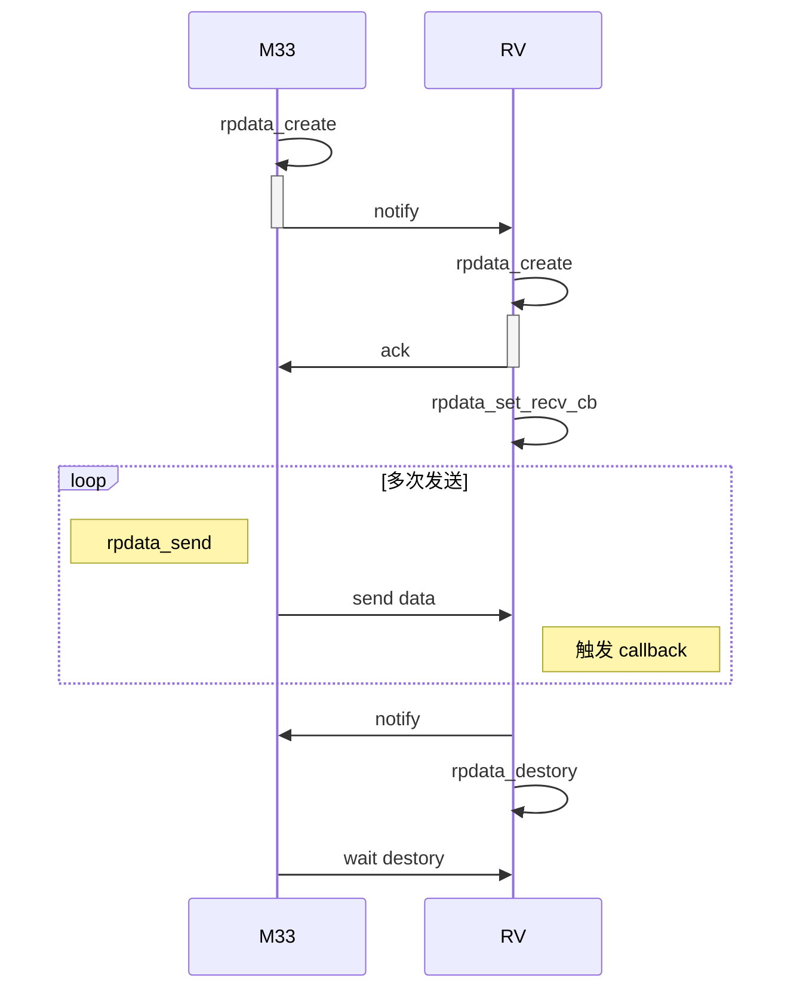

1. rpdata_create 和 rpdate_connect 的调用顺序不做要求，谁先执行都可以；但是 rpdata_data 是会创建用于数据交互的 buffer
2. 接受数据端可以选择使用 rpdata_set_recv_cb 设置回调来处理数据，或者调用 rpdata_recv 阻塞等待接受互数据。
3. 两个核的 rpdata_destroy 调用顺序也是不做要求的。

### rpdata 示例

```c
#include <stdio.h>
#include <string.h>
#include <stdlib.h>
#include <unistd.h>

#include <FreeRTOS.h>
#include <task.h>
#include <queue.h>

#include <rpdata.h>
#include <console.h>

#include <hal_time.h>
#include <hal_mem.h>
#include <hal_thread.h>
#include <md5.h>

//#define RECV_CALLBACK_TEST

/* print md5 check result */
static int g_rpd_verbose = 0;

#define configAPPLICATION_RPDATA_DEMO_PRIORITY	\
	(configMAX_PRIORITIES > 20 ? configMAX_PRIORITIES - 8 : configMAX_PRIORITIES - 3)

static void rpdata_demo_usage(void)
{
	printf("Usgae: rpdata_demo [option]\n");
	printf("-h,          rpdata help\n");
	printf("-m,          mode, 0-send; 1-recv; 2-recv+send\n");
	printf("-t,          type, type name\n");
	printf("-n,          name, id name\n");
	printf("             (type + name) specify unique data xfer\n");
	printf("-c,          string, send string\n");
	printf("-i,          single test, do send or recv test once\n");
	printf("-d,          dir, remote processor, 1-cm33;2-c906;3-dsp\n");
	printf("-s,          src dir, valid in mode 2\n");
	printf("\n");
	printf("RV -> DSP\n");
	printf("rpdata_demo -m 0 -d 3 -t RVtoDSP -n RVsendDSPrecv\n");
	printf("rpccli dsp rpdata_demo -m 1 -d 2 -t RVtoDSP -n RVsendDSPrecv\n");
	printf("\n");
	printf("RV -> M33\n");
	printf("rpdata_demo -m 0 -d 1 -t RVtoM33 -n RVsendM33recv\n");
	printf("rpccli arm rpdata_demo -m 1 -d 2 -t RVtoM33 -n RVsendM33recv\n");
	printf("\n");
	printf("RV <- M33\n");
	printf("rpdata_demo -m 1 -d 1 -t M33toRV -n RVrecvM33send\n");
	printf("rpccli arm rpdata_demo -m 0 -d 2 -t M33toRV -n RVrecvM33send\n");
	printf("\n");
	printf("RV -> DSP -> M33\n");
	printf("rpccli dsp rpdata_demo -d 2 -t RVtoDSP -n DSPrecvRVsend -s 1 -t DSPtoM33 -n M33recvDSPsend\n");
	printf("rpccli arm rpdata_demo -m 1 -d 3 -t DSPtoM33 -n M33recvDSPsend\n");
	printf("rpdata_demo -m 0 -d 3 -t RVtoDSP -n DSPrecvRVsend\n");
	printf("\n");
	printf("RV -> DSP -> M33 -> DSP -> RV\n");
	printf("rpccli dsp rpdata_demo -d 2 -t RD -n rs -s 1 -t DM -n ds\n");
	printf("rpccli arm rpdata_demo -d 3 -t DM -n ds -s 3 -t MD -n ms\n");
	printf("rpccli dsp rpdata_demo -d 1 -t MD -n ms -s 2 -t DR -n ds\n");
	printf("rpdata_demo -m 1 -d 3 -t DR -n ds\n");
	printf("rpdata_demo -m 0 -d 3 -t RD -n rs\n");
	printf("\n");
	printf("RV->M33->RV process(M33 do aec process: input mic+ref, and output aec data to RV)\n");
	printf("rpccli arm rpdata_demo -p -m 1 -d 2 -t ALGO -n AEC\n");
	printf("rpdata_demo -p -m 0 -d 1 -t ALGO -n AEC\n");
	printf("\n");
}

struct rpdata_arg_test {
	char type[32];
	char name[32];
	int dir;
	char stype[32];
	char sname[32];
	int sdir;
};

static int do_rpdata_send_test(struct rpdata_arg_test *targ, void *data, uint32_t len)
{
	rpdata_t *rpd;
	void *buffer;
	int ret = -1;

	printf("Cteate %s:%s.\n", targ->type, targ->name);
	rpd = rpdata_create(targ->dir, targ->type, targ->name, len);
	if (!rpd) {
		printf("[%s] line:%d \n", __func__, __LINE__);
		return -1;
	}
#ifndef RECV_CALLBACK_TEST
	rpdata_set_recv_ringbuffer(rpd, 2 * rpdata_buffer_len(rpd));
#endif

	buffer = rpdata_buffer_addr(rpd);
	if (!buffer) {
		printf("[%s] line:%d \n", __func__, __LINE__);
		goto exit;
	}

	memcpy(buffer, data, len);
	rpdata_wait_connect(rpd);
	ret = rpdata_send(rpd, 0, len);
	if (ret != 0) {
		printf("[%s] line:%d \n", __func__, __LINE__);
		goto exit;
	}

exit:
	if (rpd)
		rpdata_destroy(rpd);
	return ret;
}

static int do_rpdata_recv_test(struct rpdata_arg_test *targ, void *data, uint32_t len)
{
	rpdata_t *rpd;
	char *rx_buf;
	int ret = -1;

	rx_buf = hal_malloc(len + 1);
	if (rx_buf == NULL) {
		printf("[%s] line:%d alloc rx buffer fialed.\n", __func__, __LINE__);
		return -1;
	}

	printf("connect to %s:%s.\n", targ->type, targ->name);
	rpd = rpdata_connect(targ->dir, targ->type, targ->name);
	if (!rpd) {
		printf("[%s] line:%d \n", __func__, __LINE__);
		return -1;
	}
#ifndef RECV_CALLBACK_TEST
	rpdata_set_recv_ringbuffer(rpd, 2 * rpdata_buffer_len(rpd));
#endif

	while (1) {
		ret = rpdata_recv(rpd, rx_buf, len, 10000);
		if (ret <= 0) {
			printf("rpdata recv timeout \n");
			goto exit;
		}
		rx_buf[ret] = 0;
		printf("%s, len:%d\n", rx_buf, ret);
		if (!memcmp("quit", rx_buf, 4))
			break;
	}

exit:
	if (rx_buf)
		hal_free(rx_buf);
	if (rpd)
		rpdata_destroy(rpd);
	return ret;
}

static void data_fill(void *buffer, uint32_t len)
{
	int i;
	int data_len = len - 16;

	memset(buffer, 0, len);
	for (i = 0; i < len;) {
		*(int *)(buffer + i) = rand();
		i += sizeof(int);
	}
	md5(buffer, data_len,  buffer + data_len);
}

static int data_check(void *buffer, uint32_t len)
{
	unsigned char res[16];
	int data_len = len - 16;

	md5(buffer, data_len, res);
	if (!memcmp(buffer + data_len, res, 16))
		return 0;
	return -1;
}

static void rpdata_auto_send(void *arg)
{
	struct rpdata_arg_test targ;
	rpdata_t *rpd;
	void *buffer;
	int ret = -1;
	uint32_t len = 512;


	memcpy(&targ, arg, sizeof(struct rpdata_arg_test));
	printf("dir:%d, type:%s, name:%s\n",
		targ.dir, targ.type, targ.name);

	rpd = rpdata_create(targ.dir, targ.type, targ.name, 512);
	if (!rpd) {
		printf("[%s] line:%d \n", __func__, __LINE__);
		goto exit;
	}
#ifndef RECV_CALLBACK_TEST
	rpdata_set_recv_ringbuffer(rpd, 2 * rpdata_buffer_len(rpd));
#endif

	buffer = rpdata_buffer_addr(rpd);
	if (!buffer) {
		printf("[%s] line:%d \n", __func__, __LINE__);
		goto exit;
	}

	rpdata_wait_connect(rpd);
	while (1) {
		data_fill(buffer, len);
		ret = rpdata_send(rpd, 0, len);
		if (ret != 0) {
			printf("[%s] line:%d \n", __func__, __LINE__);
			goto exit;
		}
		hal_msleep(10);
	}

exit:
	if (rpd)
		rpdata_destroy(rpd);
	printf("rpdata auto send test finish\n");
	vTaskDelete(NULL);
}

static int rpd_demo_recv_cb(rpdata_t *rpd, void *data, uint32_t data_len)
{
	static int count = 0;
	if (data_check(data, data_len) < 0) {
		printf("check md5 failed\n");
	}
	if (!g_rpd_verbose)
		return 0;
	if (count++ % g_rpd_verbose == 0)
		printf("check md5 ok(print interval %d)\n", g_rpd_verbose);
	return 0;
}

struct rpdata_cbs rpd_demo_cbs = {
	.recv_cb = rpd_demo_recv_cb,
};

static int rpd_demo_process_cb(rpdata_t *rpd, void *buffer, uint32_t data_len)
{
	void *mic_data, *ref_data, *aec_data;
	uint32_t mic_offset = 128;
	uint32_t ref_offset = 128 + 640;
	uint32_t aec_offset = 128 + 640 + 320;
	uint32_t total_len = 1408;

	/* aec process
	 * input:
	 * params:
	 * simulator: 128bytes
	 * mic data: 2ch+16K+16bit, 10ms, 160*4=640
	 * ref data: 1ch+16K+16bit, 10ms, 160*2=320
	 * outout:
	 * aec data: 1ch+16K+16bit, 10ms, 160*2=320
	 *
	 * total= 128 + 640 + 320 + 320 = 1408
	 * 1408 is cacheline lenght
	 */

	mic_data = buffer + mic_offset;
	ref_data = buffer + ref_offset;
	aec_data = buffer + aec_offset;

	if (data_len != total_len) {
		printf("expected len:%d but:%d\n", total_len, data_len);
		return -1;
	}
	if (data_check(mic_data, ref_data - mic_data) < 0) {
		printf("check mic data md5 failed\n");
	}
	if (data_check(ref_data, aec_data - ref_data) < 0) {
		printf("check ref data md5 failed\n");
	}
	data_fill(aec_data, total_len - aec_offset);
	return 0;
}

struct rpdata_cbs rpd_demo_process_cbs = {
	.recv_cb = rpd_demo_process_cb,
};

static int rpd_demo_recv_and_send_cb(rpdata_t *rpd, void *data, uint32_t data_len)
{
	rpdata_t *rpd_send = NULL;
	void *buffer;
	int ret;

	if (data_check(data, data_len) < 0) {
		printf("[%s] line:%d check md5 failed\n", __func__, __LINE__);
	}
	rpd_send = rpdata_get_private_data(rpd);
	if (!rpd_send)
		return -1;

	buffer = rpdata_buffer_addr(rpd_send);
	memcpy(buffer, data, data_len);
	ret = rpdata_send(rpd_send, 0, data_len);
	if (ret != 0) {
		printf("rpdata_send failed\n");
		return ret;
	}

	return 0;
}

struct rpdata_cbs rpd_demo_rs_cbs = {
	.recv_cb = rpd_demo_recv_and_send_cb,
};

static void rpdata_auto_recv(void *arg)
{
	struct rpdata_arg_test targ;
	rpdata_t *rpd;
	void *rx_buf = NULL;
	int len, ret;

	memcpy(&targ, arg, sizeof(struct rpdata_arg_test));
	printf("dir:%d, type:%s, name:%s\n",
		targ.dir, targ.type, targ.name);

	rpd = rpdata_connect(targ.dir, targ.type, targ.name);
	if (!rpd) {
		printf("[%s] line:%d \n", __func__, __LINE__);
		goto exit;
	}
#ifndef RECV_CALLBACK_TEST
	rpdata_set_recv_ringbuffer(rpd, 2 * rpdata_buffer_len(rpd));
#endif

	len = rpdata_buffer_len(rpd);
	if (len <= 0) {
		printf("[%s] line:%d \n", __func__, __LINE__);
		goto exit;
	}

	rx_buf = hal_malloc(len);
	if (!rx_buf) {
		printf("[%s] line:%d \n", __func__, __LINE__);
		goto exit;
	}

#ifdef RECV_CALLBACK_TEST
	rpdata_set_recv_cb(rpd, &rpd_demo_cbs);
	while (1) {
		hal_msleep(10);
	}
#else
	while (1) {
		ret = rpdata_recv(rpd, rx_buf, len, 10000);
		if (ret <= 0) {
			printf("rpdata recv timeout \n");
			goto exit;
		}
		if (data_check(rx_buf, ret) < 0) {
			printf("check md5 failed\n");
		}
	}
#endif
exit:
	if (rx_buf)
		hal_free(rx_buf);
	if (rpd)
		rpdata_destroy(rpd);
	printf("rpdata auto recv test finish\n");
	vTaskDelete(NULL);
}

static void rpdata_auto_recv_and_send(void *arg)
{
	struct rpdata_arg_test targ;
	rpdata_t *rpd_recv = NULL, *rpd_send = NULL;
	void *buf_recv = NULL, *buf_send = NULL;
	uint32_t len = 512;
	int ret;

	memcpy(&targ, arg, sizeof(struct rpdata_arg_test));
	printf("recv dir:%d, type:%s, name:%s\n",
		targ.dir, targ.type, targ.name);
	printf("send dir:%d, type:%s, name:%s\n",
		targ.sdir, targ.stype, targ.sname);

	rpd_send = rpdata_create(targ.sdir, targ.stype, targ.sname, len);
	if (!rpd_send) {
		printf("[%s] line:%d \n", __func__, __LINE__);
		goto exit;
	}

	buf_send = rpdata_buffer_addr(rpd_send);
	if (!buf_send) {
		printf("[%s] line:%d \n", __func__, __LINE__);
		goto exit;
	}

	rpd_recv = rpdata_connect(targ.dir, targ.type, targ.name);
	if (!rpd_recv) {
		printf("[%s] line:%d \n", __func__, __LINE__);
		goto exit;
	}
#ifndef RECV_CALLBACK_TEST
	rpdata_set_recv_ringbuffer(rpd_recv, 2 * rpdata_buffer_len(rpd_recv));
	rpdata_set_recv_ringbuffer(rpd_send, 2 * rpdata_buffer_len(rpd_send));
#endif

	buf_recv = hal_malloc(len);
	if (!buf_recv) {
		printf("[%s] line:%d \n", __func__, __LINE__);
		goto exit;
	}

	rpdata_wait_connect(rpd_send);
#ifdef RECV_CALLBACK_TEST
	rpdata_set_private_data(rpd_recv, rpd_send);
	rpdata_set_recv_cb(rpd_recv, &rpd_demo_rs_cbs);
	while (1) {
		hal_msleep(10);
	}
#else
	while (1) {
		ret = rpdata_recv(rpd_recv, buf_recv, len, 10000);
		if (ret <= 0) {
			printf("rpdata recv timeout \n");
			goto exit;
		}
		if (data_check(buf_recv, ret) < 0) {
			printf("check md5 failed\n");
		}
		memcpy(buf_send, buf_recv, ret);
		ret = rpdata_send(rpd_send, 0, ret);
		if (ret != 0) {
			printf("rpdata send failed\n");
			goto exit;
		}
	}
#endif
exit:
	if (buf_recv)
		hal_free(buf_recv);
	if (rpd_send)
		rpdata_destroy(rpd_send);
	if (rpd_recv)
		rpdata_destroy(rpd_recv);
	printf("rpdata auto recv_and_send test finish\n");
	vTaskDelete(NULL);
}

static void rpdata_process_send(void *arg)
{
	struct rpdata_arg_test targ;
	rpdata_t *rpd;
	void *buffer;
	int ret = -1;
	uint32_t len;
	void *params, *mic_data, *ref_data, *aec_data;
	uint32_t params_offset = 0;
	uint32_t mic_offset = 128;
	uint32_t ref_offset = 128 + 640;
	uint32_t aec_offset = 128 + 640 + 320;

	/* aec process
	 * input:
	 * params:
	 * simulator: 128bytes
	 * mic data: 2ch+16K+16bit, 10ms, 160*4=640
	 * ref data: 1ch+16K+16bit, 10ms, 160*2=320
	 * outout:
	 * aec data: 1ch+16K+16bit, 10ms, 160*2=320
	 *
	 * total= 128 + 640 + 320 + 320 = 1408
	 * 1408 is cacheline lenght
	 * */
	len = 1408;

	memcpy(&targ, arg, sizeof(struct rpdata_arg_test));
	printf("dir:%d, type:%s, name:%s\n",
		targ.dir, targ.type, targ.name);

	rpd = rpdata_connect(targ.dir, targ.type, targ.name);
	if (!rpd) {
		printf("[%s] line:%d \n", __func__, __LINE__);
		goto exit;
	}
#ifndef RECV_CALLBACK_TEST
	rpdata_set_recv_ringbuffer(rpd, 2 * rpdata_buffer_len(rpd));
#endif

	buffer = rpdata_buffer_addr(rpd);
	if (!buffer) {
		printf("[%s] line:%d \n", __func__, __LINE__);
		goto exit;
	}
	params = buffer + params_offset;
	mic_data = buffer + mic_offset;
	ref_data = buffer + ref_offset;
	aec_data = buffer + aec_offset;

	rpdata_wait_connect(rpd);

	data_fill(params, mic_offset - params_offset);
	data_fill(mic_data, ref_offset - mic_offset);
	data_fill(ref_data, aec_offset - ref_offset);
	memset(aec_data, 0, len - aec_offset);

	ret = rpdata_process(rpd, 0, len);
	if (ret != 0) {
		printf("[%s] line:%d \n", __func__, __LINE__);
		goto exit;
	}

	if (data_check(aec_data, len - aec_offset) < 0) {
		printf("aec data check failed\n");
	} else {
		printf("aec data check ok\n");
	}

exit:
	if (rpd)
		rpdata_destroy(rpd);
	vTaskDelete(NULL);
}

static void rpdata_process_recv(void *arg)
{
	struct rpdata_arg_test targ;
	rpdata_t *rpd;
	uint32_t len;
	void *rx_buf = NULL;
	int ret;

	/* aec process
	 * input:
	 * params:
	 * simulator: 128bytes
	 * mic data: 2ch+16K+16bit, 10ms, 160*4=640
	 * ref data: 1ch+16K+16bit, 10ms, 160*2=320
	 * outout:
	 * aec data: 1ch+16K+16bit, 10ms, 160*2=320
	 *
	 * total= 128 + 640 + 320 + 320 = 1408
	 * 1408 is cacheline lenght
	 * */
	len = 1408;

	memcpy(&targ, arg, sizeof(struct rpdata_arg_test));
	printf("dir:%d, type:%s, name:%s\n",
		targ.dir, targ.type, targ.name);

	rpd = rpdata_create(targ.dir, targ.type, targ.name, len);
	if (!rpd) {
		printf("[%s] line:%d \n", __func__, __LINE__);
		goto exit;
	}
#ifndef RECV_CALLBACK_TEST
	rpdata_set_recv_ringbuffer(rpd, 2 * rpdata_buffer_len(rpd));
#endif

#ifndef RECV_CALLBACK_TEST
	rx_buf = hal_malloc(rpdata_buffer_len(rpd));
	if (!rx_buf) {
		printf("[%s] line:%d \n", __func__, __LINE__);
		goto exit;
	}

	ret = rpdata_recv(rpd, rx_buf, len, 30*1000);
	if (ret <= 0) {
		printf("[%s] : Timeout!\n", __func__);
		goto exit;
	}
	rpd_demo_process_cb(rpd, rx_buf, ret);

#else
	rpdata_set_recv_cb(rpd , &rpd_demo_process_cbs);
	hal_sleep(30);
#endif
exit:
	if (rx_buf)
		hal_free(rx_buf);
	if (rpd)
		rpdata_destroy(rpd);
	printf("rpdata recv process finish\n");
	vTaskDelete(NULL);
}

static int do_rpdata_process_test(struct rpdata_arg_test *targ, int mode)
{
	hal_thread_t handle;

	if (mode == 0)
		handle = hal_thread_create(rpdata_process_send, targ,
				"rpd_send_process", 512, HAL_THREAD_PRIORITY_APP);
	else if (mode == 1)
		handle = hal_thread_create(rpdata_process_recv, targ,
				"rpd_recv_process", 512, HAL_THREAD_PRIORITY_APP);
	return 0;
}

static int do_rpdata_auto_test(struct rpdata_arg_test *targ, int mode)
{
	hal_thread_t handle;

	if (mode == 0)
		handle = hal_thread_create(rpdata_auto_send, targ, "rpd_send_test",
				512, HAL_THREAD_PRIORITY_APP);
	else if (mode == 1)
		handle = hal_thread_create(rpdata_auto_recv, targ, "rpd_recv_test",
				512, HAL_THREAD_PRIORITY_APP);
	else if (mode == 2)
		handle = hal_thread_create(rpdata_auto_recv_and_send, targ, "rpd_rs_test",
				512, HAL_THREAD_PRIORITY_APP);
	return 0;
}

static int check_dir(int dir)
{
	switch (dir) {
	case RPDATA_DIR_CM33:
	case RPDATA_DIR_RV:
	case RPDATA_DIR_DSP:
		return 0;
	default:
		return -1;
	}
}

static int cmd_rpdata_demo(int argc, char *argv[])
{
	int c, mode = 2;
	int single_test = 0, process_test = 0;
	int get_sdir_arg = 0;
	/* string/data must be cache_line align */
	char string[128] = "rpdata test string";
	static struct rpdata_arg_test targ = {
		.type = "RVtoDSP",
		.name = "DSPrecvRVsend",
		.dir  = RPDATA_DIR_DSP,
		.stype = "DSPtoM33",
		.sname = "M33recvDSPsend",
		.sdir  = RPDATA_DIR_CM33,
	};

	optind = 0;
	while ((c = getopt(argc, argv, "hm:t:n:c:s:d:iv:p")) != -1) {
		switch (c) {
		case 'm':
			mode = atoi(optarg);
			break;
		case 't':
			if (!get_sdir_arg)
				strncpy(targ.type, optarg, sizeof(targ.type));
			else
				strncpy(targ.stype, optarg, sizeof(targ.stype));
			break;
		case 'n':
			if (!get_sdir_arg)
				strncpy(targ.name, optarg, sizeof(targ.name));
			else
				strncpy(targ.sname, optarg, sizeof(targ.sname));
			break;
		case 'c':
			strncpy(string, optarg, sizeof(string));
			break;
		case 's':
			targ.sdir = atoi(optarg);
			get_sdir_arg = 1;
			break;
		case 'd':
			targ.dir = atoi(optarg);
			get_sdir_arg = 0;
			break;
		case 'i':
			single_test = 1;
			break;
		case 'v':
			g_rpd_verbose = atoi(optarg);
			return 0;
		case 'p':
			process_test = 1;
			break;
		case 'h':
		default:
			goto usage;
		}
	}

	if (mode != 0 && mode != 1 && mode != 2)
		goto usage;

	if (check_dir(targ.dir) < 0 || check_dir(targ.sdir) < 0)
		goto usage;

	if (process_test) {
		do_rpdata_process_test(&targ, mode);
		return 0;
	}

	if (!single_test) {
		do_rpdata_auto_test(&targ, mode);
		return 0;
	}

	if (mode == 0)
		do_rpdata_send_test(&targ, string, sizeof(string));
	else if (mode == 1)
		do_rpdata_recv_test(&targ, string, sizeof(string));

	return 0;
usage:
	rpdata_demo_usage();
	return -1;
}
FINSH_FUNCTION_EXPORT_CMD(cmd_rpdata_demo, rpdata_demo, rpdata test demo);
```

测试例子：

- rv/dsp之间的收发

rv接受，dsp发送

```
rpdata_demo ‑m 1 ‑d 3 ‑t DSPtoRV ‑n RVrecvDSPsend
rpccli dsp rpdata_demo ‑m 0 ‑d 2 ‑t DSPtoRV ‑n RVrecvDSPsend
```

rv发送，dsp接受

```
rpdata_demo ‑m 0 ‑d 3 ‑t RVtoDSP ‑n RVsendDSPrecv
rpccli dsp rpdata_demo ‑m 1 ‑d 2 ‑t RVtoDSP ‑n RVsendDSPrecv
```

- rv/m33之间收发

rv接受，m33发送

```
rpdata_demo ‑m 1 ‑d 1 ‑t M33toRV ‑n RVrecvM33send
rpccli arm rpdata_demo ‑m 0 ‑d 2 ‑t M33toRV ‑n RVrecvM33send
```

 rv发送，m33接受

```
rpdata_demo ‑m 0 ‑d 1 ‑t RVtoM33 ‑n RVsendM33recv
rpccli arm rpdata_demo ‑m 1 ‑d 2 ‑t RVtoM33 ‑n RVsendM33recv
```

- m33/dsp之间收发

m33接受，dsp发送

```
rpccli arm rpdata_demo ‑m 1 ‑d 3 ‑t DSPtoM33 ‑n M33recvDSPsend
rpccli dsp rpdata_demo ‑m 0 ‑d 1 ‑t DSPtoM33 ‑n M33recvDSPsend
```

 dsp接受，m33发送

```
rpccli dsp rpdata_demo ‑m 1 ‑d 1 ‑t M33toDSP ‑n DSPrecvM33send
rpccli arm rpdata_demo ‑m 0 ‑d 3 ‑t M33toDSP ‑n DSPrecvM33send
```

另外，提供了 rpd 命令用于查看 rpdata 的运行情况：

```
c906>rpd ‑l
‑‑‑‑‑‑‑‑‑‑‑‑‑‑‑‑‑‑‑‑‑‑‑‑‑‑‑‑‑‑‑‑‑‑‑‑‑‑‑‑
RPdata RV <‑‑> CM33
id type+name state
‑‑‑‑‑‑‑‑‑‑‑‑‑‑‑‑‑‑‑‑‑‑‑‑‑‑‑‑‑‑‑‑‑‑‑‑‑‑‑‑
RPdata RV <‑‑> DSP
id type+name state
0x01 DSPtoRV
0x01 └─── RVrecvDSPsend CNXN


c906>rpccli dsp rpd ‑l
‑‑‑‑‑‑‑‑‑‑‑‑‑‑‑‑‑‑‑‑‑‑‑‑‑‑‑‑‑‑‑‑‑‑‑‑‑‑‑‑
RPdata DSP <‑‑> CM33
id type+name state
‑‑‑‑‑‑‑‑‑‑‑‑‑‑‑‑‑‑‑‑‑‑‑‑‑‑‑‑‑‑‑‑‑‑‑‑‑‑‑‑
RPdata DSP <‑‑> RV
id type+name state
0x01 DSPtoRV
0x01 └─── RVrecvDSPsend CNXN
```


# Crypto Engine

## 模块介绍

CE 模块主要支持对称算法、非对称算法、摘要算法进行数据的加密和解密功能。

CE 模块主要支持的算法如下：

- AES 算法 ECB/CBC/CTR/CTS/OFB/CFB/CBC-MAC/XTS 等模式.
- HASH 算法 MD5/SHA1/SHA224/SHA256/SHA384/SHA512/HMAC-SHA1/HMAC-SHA256.
- 非对称算法 RSA512/1024/2048/3072/4096.

## 模块配置

其menuconfig 的配置如下：

```shell
Kernel Setup --->
    Drivers Setup --->
        SoC HAL Drivers --->
            CE devices --->
                [*] enable ce driver
                [*] enbale ce hal APIs Test command
```

## 源码结构

CE 驱动位于 `source/drivers/hal/source/ce/` 目录下。

```c
hal/
├── source
│ ├── ce
│ │ ├── ce_common.c    # CE公用操作接口函数文件
│ │ ├── ce_common.h    # CE操作接口函数头文件
│ │ ├── hal_ce.c       # CE底层驱动文件
│ │ ├── hal_ce.h       # CE底层驱动头文件
│ │ ├── Makefile
│ │ └── platform.h     # 平台配置头文件
| ├── platform
│ └── ce_sun20iw2.h    # 具体的平台配置头文件
├── include/hal
  └── sunxi_hal_ce.h   # CE公用操作接口函数头文件
```

## 模块接口说明

头文件

```c
#include <sunxi_hal_ce.h>
```

### CE 初始化接口

CE 模块初始化，主要申请中断、clk 初始化等

函数原型：

```c
int sunxi_ce_init(void)
```

参数：

- 无

返回值：

- 0：成功
- 负数：失败

### CE 去初始化接口

CE 模块去初始化，主要注销中断等

函数原型：

```c
int sunxi_ce_uninit(void)
```

参数：

- 无

返回值：

- 0：成功
- 负数：失败

### AES 算法加解密接口

主要实现对 AES 算法进行加解密

函数原型：

```c
int do_aes_crypto(crypto_aes_req_ctx_t *req_ctx)
```

参数：

- req_ctx: 为 AES 算法上下文的结构体

返回值：

- 0：成功
- 负数：失败

```c
typedef struct {
    uint8_t *src_buffer;
    uint32_t src_length;
    uint8_t *dst_buffer;
    uint32_t dst_length;
    uint8_t *iv;
    uint8_t *iv_next;
    uint8_t *key;
    uint32_t key_length;
    __aligned(CACHELINE_LEN) uint8_t padding[AES_BLOCK_SIZE];
    uint32_t padding_len;
    uint32_t dir; 			/*0--加密，1--解密*/
    uint32_t mode; 			/*AES算法的模式*/
    uint32_t bitwidth;
} crypto_aes_req_ctx_t;
```

### HASH 算法运算接口

主要实现对HASH 算法进行运算

函数原型：

```c
int do_hash_crypto(crypto_hash_req_ctx_t *req_ctx)
```

参数：

- req_ctx: 为HASH 算法上下文的结构体

返回值：

- 0：成功
- 负数：失败

```c
typedef struct {
    uint8_t *src_buffer;
    uint32_t src_length;
    uint8_t *dst_buffer;
    uint32_t dst_length;
    __aligned(CACHELINE_LEN) uint8_t md[SHA_MAX_DIGEST_SIZE];
    uint32_t md_size;
    __aligned(CACHELINE_LEN) uint8_t padding[SHA512_BLOCK_SIZE * 2];
    uint32_t padding_len;
    uint32_t type; 			/*hash算法的模式*/
    uint32_t dir;
    uint32_t padding_mode; 	/*hash算法的填充模式*/
} crypto_hash_req_ctx_t;
```

### RSA 算法运算接口

主要实现对RSA 算法进行加解密

函数原型：

```c
int do_rsa_crypto(crypto_rsa_req_ctx_t *req_ctx)
```

参数：

- req_ctx: 为 RSA算法上下文的结构体

返回值：

- 0：成功
- 负数：失败

```c
typedef struct {
    uint8_t *key_n;    /*公钥模数*/
    uint32_t n_len;
    uint8_t *key_e;    /*公钥指数*/
    uint32_t e_len;
    uint8_t *key_d;    /*私钥*/
    uint32_t d_len;
    uint8_t *src_buffer;
    uint32_t src_length;
    uint8_t *dst_buffer;
    uint32_t dst_length;
    uint32_t dir;      /*0--加密，1--解密*/
    uint32_t type;     /*RSA算法的模式*/
    uint32_t bitwidth; /*RSA算法位宽*/
} crypto_rsa_req_ctx_t;
```

### RNG 算法运算接口

主要实现随机数的生成

函数原型：

```c
int do_rng_gen(crypto_rsa_req_ctx_t *req_ctx)
```

参数：

- req_ctx: 为 RNG 算法上下文的结构体

返回值：

- 0：成功
- 负数：失败

```c
typedef struct {
    uint8_t *rng_buf;
    uint32_t rng_len;
    uint32_t mode;
    uint8_t *key;
    uint32_t key_len;
} crypto_rng_req_ctx_t;
```

## 模块使用范例

由于测试用例较大，所以将其拆分进入一个头文件内，可以从这里下载：[test_ce.h](sdk_module/assets/demo/ce/test_ce.h ':ignore')

```c
#include <stdio.h>
#include <string.h>
#include <unistd.h>

#include <hal_cmd.h>
#include <hal_mem.h>
#include <sunxi_hal_ce.h>
#include "test_ce.h"

#define AES_MODE_ECB (0)
#define AES_MODE_CBC (1)
#define AES_MODE_CTR (2)
#define AES_MODE_CTS (3)
#define AES_MODE_OFB (4)
#define AES_MODE_CFB (5)

#define AES_DIR_ENCRYPT (0)
#define AES_DIR_DECRYPT (1)

#define HASH_METHOD_MD5 (16)
#define HASH_METHOD_SHA1 (17)
#define HASH_METHOD_SHA224 (18)
#define HASH_METHOD_SHA256 (19)
#define HASH_METHOD_SHA384 (20)
#define HASH_METHOD_SHA512 (21)

void ce_dump(char *str, unsigned char *data, int len, int align) {
  int i = 0;
  if (str) printf("\n%s: ", str);
  for (i = 0; i < len; i++) {
    if ((i % align) == 0) {
      printf("\n");
      printf("0x08%x: ", data + i * align);
    }
    printf("%02x ", *(data++));
  }
  printf("\n");
}

int aes_test(void) {
  int ret = -1;
  int i = 0;
  int j = 0;
  int m = 0;
  uint8_t *enc_buffer = 0;
  uint32_t enc_len = 0;
  uint32_t blk_num = 0;
  __aligned(CACHELINE_LEN) uint8_t iv_next[AES_BLOCK_SIZE] = {0};
  uint8_t *(*aes_enc[])[5] = {aes_ecb, aes_cbc, aes_ctr,
                              aes_cbc, aes_ofb, aes_cfb8};
  crypto_aes_req_ctx_t *aes_ctx = NULL;

  aes_ctx = (crypto_aes_req_ctx_t *)hal_malloc_align(
      sizeof(crypto_aes_req_ctx_t), max(CE_ALIGN_SIZE, CACHELINE_LEN));
  if (aes_ctx == NULL) {
    printf(" malloc data buffer fail\n");
    return -1;
  }
  memset(aes_ctx, 0x0, sizeof(crypto_aes_req_ctx_t));

  aes_ctx->dst_buffer =
      (u8 *)hal_malloc_align(512, max(CE_ALIGN_SIZE, CACHELINE_LEN));
  if (aes_ctx->dst_buffer == NULL) {
    printf(" malloc dest buffer fail\n");
    ret = -1;
    goto out;
  }

  for (m = AES_MODE_ECB; m < AES_MODE_CFB + 1; m++) {
    for (i = 0; i < sizeof(aes_key_len) / sizeof(aes_key_len[0]); i++) {
      for (j = 0; j < sizeof(aes_src) / sizeof(aes_src[0]); j++) {
        /* aes encrypt */
        aes_ctx->src_buffer = aes_src[j];
        aes_ctx->src_length = aes_src_len[j];
        aes_ctx->key = aes_key[i];
        aes_ctx->key_length = aes_key_len[i];
        if (m == AES_MODE_ECB)
          aes_ctx->iv = NULL;
        else
          aes_ctx->iv = aes_iv;
        if (m == AES_MODE_CTR) {
          memset(iv_next, 0, AES_BLOCK_SIZE);
          aes_ctx->iv_next = iv_next;
        } else
          aes_ctx->iv_next = NULL;
        if (m == AES_MODE_CFB)
          aes_ctx->bitwidth = 8;
        else
          aes_ctx->bitwidth = 0;
        aes_ctx->mode = m;
        aes_ctx->dir = AES_DIR_ENCRYPT;
        aes_ctx->dst_length = CE_ROUND_UP(aes_ctx->src_length, AES_BLOCK_SIZE);

        printf(
            "###############AES, mode: %d, ksize %d, src len %d, "
            "begin###############\n",
            m, aes_key_len[i], aes_src_len[j]);

        ret = do_aes_crypto(aes_ctx);
        if (ret < 0) {
          printf("aes encrypt fail %d\n", ret);
          goto out;
        }

        // for ecb/cbc/cts, enc data len should be 16 bytes aligned
        if (m == AES_MODE_ECB || m == AES_MODE_CBC || m == AES_MODE_CTS)
          enc_len = aes_ctx->dst_length;
        else
          enc_len = aes_src_len[j];

        // openssl enc do not support cts, so create enc data manually.
        if (m == AES_MODE_CTS) {
          enc_buffer = (uint8_t *)hal_malloc_align(
              enc_len, max(CE_ALIGN_SIZE, CACHELINE_LEN));
          if (enc_buffer == NULL) {
            printf("malloc ctr buffer fail\n");
            ret = -1;
            goto out;
          }

          blk_num = enc_len / AES_BLOCK_SIZE;
          if (blk_num > 1) {
            if (blk_num > 2)
              memcpy(enc_buffer, aes_enc[m - AES_MODE_ECB][i][j],
                     (blk_num - 2) * AES_BLOCK_SIZE);
            memcpy(enc_buffer + (blk_num - 2) * AES_BLOCK_SIZE,
                   aes_enc[m - AES_MODE_ECB][i][j] +
                       (blk_num - 1) * AES_BLOCK_SIZE,
                   AES_BLOCK_SIZE);
            memcpy(enc_buffer + (blk_num - 1) * AES_BLOCK_SIZE,
                   aes_enc[m - AES_MODE_ECB][i][j] +
                       (blk_num - 2) * AES_BLOCK_SIZE,
                   AES_BLOCK_SIZE);
          } else {
            memcpy(enc_buffer, aes_enc[m - AES_MODE_ECB][i][j], enc_len);
          }
        } else
          enc_buffer = aes_enc[m - AES_MODE_ECB][i][j];

        if (memcmp(aes_ctx->dst_buffer, enc_buffer, enc_len) != 0) {
          ce_dump("want data: ", enc_buffer, enc_len, 16);
          ce_dump("calc data: ", aes_ctx->dst_buffer, enc_len, 16);
          printf(
              "###############AES ENC, mode: %d, ksize %d, src len %d, "
              "fail###############\n",
              m, aes_key_len[i], aes_src_len[j]);
          ret = -1;
          goto out;
        }

        /* aes decrypt */
        memset(aes_ctx->dst_buffer, 0x0, aes_ctx->dst_length);
        aes_ctx->dir = AES_DIR_DECRYPT;
        aes_ctx->src_buffer = enc_buffer;
        aes_ctx->src_length = enc_len;

        ret = do_aes_crypto(aes_ctx);
        if (ret < 0) {
          printf("aes decrypt fail %d\n", ret);
          goto out;
        }

        if (memcmp(aes_ctx->dst_buffer, aes_src[j], aes_src_len[j]) != 0) {
          ce_dump("want data: ", aes_src[j], aes_src_len[j], 16);
          ce_dump("calc data: ", aes_ctx->dst_buffer, aes_src_len[j], 16);
          printf(
              "###############AES DEC, mode: %d, ksize %d, src len %d, "
              "fail###############\n",
              m, aes_key_len[i], aes_src_len[j]);
          ret = -1;
          goto out;
        }

        if (m == AES_MODE_CTS) {
          if (enc_buffer) hal_free_align(enc_buffer);
        }

        printf(
            "###############AES, mode: %d, ksize %d, src len %d, "
            "pass###############\n\n\n",
            m, aes_key_len[i], aes_src_len[j]);
      }
    }
  }

out:
  if (aes_ctx->dst_buffer != NULL) {
    hal_free_align(aes_ctx->dst_buffer);
  }
  if (m == AES_MODE_CTS) {
    if (enc_buffer) hal_free_align(enc_buffer);
  }

  hal_free_align(aes_ctx);

  return ret;
}

int hash_test(void) {
  int i = 0;
  int j = 0;
  uint8_t *dst_data = NULL;
  // uint32_t data_size = 512; SHA_MAX_DIGEST_SIZE
  uint32_t data_size = SHA_MAX_DIGEST_SIZE;
  uint32_t hash_length = 0;
  int ret = -1;
  uint8_t *(*hash_digest[]) = {hash_md5,    hash_sha1,   hash_sha224,
                               hash_sha256, hash_sha384, hash_sha512};
  crypto_hash_req_ctx_t *hash_ctx = NULL;

  hash_ctx = (crypto_hash_req_ctx_t *)hal_malloc_align(
      sizeof(crypto_hash_req_ctx_t), max(CE_ALIGN_SIZE, CACHELINE_LEN));
  if (hash_ctx == NULL) {
    printf(" malloc hash_ctx fail\n");
    ret = -1;
    goto out;
  }

  /*malloc dst buf*/
  dst_data =
      (u8 *)hal_malloc_align(data_size, max(CE_ALIGN_SIZE, CACHELINE_LEN));
  if (dst_data == NULL) {
    printf(" malloc dst buffer fail\n");
    ret = -1;
    goto out;
  }

  for (i = HASH_METHOD_MD5; i < HASH_METHOD_SHA512 + 1; i++) {
    for (j = 0; j < sizeof(hash_src_len) / sizeof(hash_src_len[0]); j++) {
      memset(hash_ctx, 0x0, sizeof(crypto_hash_req_ctx_t));
      hash_ctx->src_buffer = hash_src[j];
      hash_ctx->src_length = hash_src_len[j];
      memset(dst_data, 0x0, data_size);
      hash_ctx->dst_buffer = dst_data;
      hash_ctx->type = i;
      hash_ctx->md_size = 0;
      switch (i) {
        case HASH_METHOD_MD5:
          hash_ctx->dst_length = MD5_DIGEST_SIZE;
          hash_length = MD5_DIGEST_SIZE;
          break;
        case HASH_METHOD_SHA1:
          hash_ctx->dst_length = SHA1_DIGEST_SIZE;
          hash_length = SHA1_DIGEST_SIZE;
          break;
        case HASH_METHOD_SHA224:
          hash_ctx->dst_length = SHA256_DIGEST_SIZE;
          hash_length = SHA224_DIGEST_SIZE;
          break;
        case HASH_METHOD_SHA256:
          hash_ctx->dst_length = SHA256_DIGEST_SIZE;
          hash_length = SHA256_DIGEST_SIZE;
          break;
        case HASH_METHOD_SHA384:
          hash_ctx->dst_length = SHA512_DIGEST_SIZE;
          hash_length = SHA384_DIGEST_SIZE;
          break;
        case HASH_METHOD_SHA512:
          hash_ctx->dst_length = SHA512_DIGEST_SIZE;
          hash_length = SHA512_DIGEST_SIZE;
          break;
        default:
          break;
      }

      printf("############hash type: %d, src len: %d, begin#############\n", i,
             hash_src_len[j]);

      ret = do_hash_crypto(hash_ctx);
      if (ret < 0) {
        printf("do_hash_crypto fail\n");
        goto out;
      }

      if (memcmp(hash_ctx->dst_buffer, hash_digest[i - HASH_METHOD_MD5][j],
                 hash_length) == 0) {
        printf(
            "############hash type: %d, src len: %d, pass#############\n\n\n",
            i, hash_src_len[j]);
      } else {
        ce_dump("want digest: ", hash_digest[i - HASH_METHOD_MD5][j],
                hash_length, 16);
        ce_dump("calc digest: ", hash_ctx->dst_buffer, hash_length, 16);
        printf(
            "############hash type: %d, src len: %d, fail#############\n\n\n",
            i, hash_src_len[j]);
        ret = -1;
        goto out;
      }
    }
  }

out:
  if (hash_ctx != NULL) {
    hal_free_align(hash_ctx);
  }

  if (dst_data != NULL) {
    hal_free_align(dst_data);
  }

  return ret;
}

#ifndef CONFIG_ARCH_SUN20IW2
int rng_test(void) {
  int ret = 0;
  int i = 0;
  uint8_t *rng_buf = NULL;
  uint32_t rng_size[] = {16, 31, 32, 8100};
  __aligned(CACHELINE_LEN) uint8_t key[24] = {
      0xa1, 0xb7, 0x78, 0xf7, 0xbf, 0x2c, 0xfa, 0xad, 0x6a, 0x46, 0x79, 0xc2,
      0xd2, 0x9c, 0x45, 0x1f, 0x3f, 0xcb, 0xef, 0xa5, 0x4e, 0x0e, 0xc3, 0x51};
  uint32_t key_len = 24;
  crypto_rng_req_ctx_t *rng_ctx = NULL;

  rng_ctx = (crypto_rng_req_ctx_t *)hal_malloc_align(
      sizeof(crypto_rng_req_ctx_t), max(CE_ALIGN_SIZE, CACHELINE_LEN));
  if (rng_ctx == NULL) {
    printf(" malloc rng ctx fail\n");
    ret = -1;
    goto out;
  }

  /*malloc trng buf*/
  rng_buf = (u8 *)hal_malloc_align(8192, max(CE_ALIGN_SIZE, CACHELINE_LEN));
  if (rng_buf == NULL) {
    printf("malloc rng buffer fail\n");
    ret = -1;
    goto out;
  }

#ifndef CE_FPGA_TEST
  /* FPGA do not support TRNG, so enable CE_FPGA_TEST when do CE FPGA
   * verification */
  /*TRNG test*/
  for (i = 0; i < sizeof(rng_size) / sizeof(uint32_t); i++) {
    printf("############TRNG, len: %d, begin#############\n", rng_size[i]);
    memset(rng_buf, 0, 8192);
    rng_ctx->rng_buf = rng_buf;
    rng_ctx->rng_len = rng_size[i];
    rng_ctx->mode = 0x30; /*CE_METHOD_TRNG*/
    rng_ctx->key = NULL;
    rng_ctx->key_len = 0;
    ret = do_rng_gen(rng_ctx);
    if (ret < 0) {
      printf("############TRNG, len: %d, fail#############\n\n\n", rng_size[i]);
      goto out;
    }
#if 0
		if (rng_size[i] < 100)
			ce_dump("trng:", rng_buf, rng_size[i], 16);
#endif
    printf("############TRNG, len: %d, pass#############\n\n\n", rng_size[i]);
  }
#endif

  /*PRNG test*/
  for (i = 0; i < sizeof(rng_size) / sizeof(uint32_t); i++) {
    printf("############PRNG, len: %d, begin#############\n", rng_size[i]);
    memset(rng_buf, 0, 8192);
    rng_ctx->rng_buf = rng_buf;
    rng_ctx->rng_len = rng_size[i];
    rng_ctx->mode = 0x31; /*CE_METHOD_PRNG*/
    rng_ctx->key = key;
    rng_ctx->key_len = key_len;
    ret = do_rng_gen(rng_ctx);
    if (ret < 0) {
      printf("############PRNG, len: %d, fail#############\n\n\n", rng_size[i]);
      goto out;
    }
#if 0
		if (rng_size[i] < 100)
			ce_dump("prng:", rng_buf, rng_size[i], 16);
#endif
    printf("############PRNG, len: %d, pass#############\n\n\n", rng_size[i]);
  }

out:
  if (rng_ctx) hal_free_align(rng_ctx);

  if (rng_buf) hal_free_align(rng_buf);

  return ret;
}
#else
int rng_test(void) {
  printf("sun20iw2 crypto engine do not support rng, please use hal_trng.\n");

  return 0;
}
#endif

int rsa_test(void) {
  int ret = 0;
  int i = 0;
  __aligned(CACHELINE_LEN) uint8_t dst_buffer[256] = {0};
  crypto_rsa_req_ctx_t *rsa_ctx = NULL;

  rsa_ctx = (crypto_rsa_req_ctx_t *)hal_malloc_align(
      sizeof(crypto_rsa_req_ctx_t), max(CE_ALIGN_SIZE, CACHELINE_LEN));
  if (rsa_ctx == NULL) {
    printf(" malloc rsa ctx fail\n");
    return -1;
  }

  /*rsa enc and dec*/
  for (i = 0; i < sizeof(rsa_bitwidth) / sizeof(rsa_bitwidth[0]); i++) {
    /* enc with public key*/
    printf("############RSA ENC/DEC, len: %d, begin#############\n",
           rsa_bitwidth[i]);
    memset(dst_buffer, 0, 256);
    memset(rsa_ctx, 0, sizeof(crypto_rsa_req_ctx_t));

    rsa_ctx->key_n = rsa_keyn[i];
    rsa_ctx->n_len = rsa_bitwidth[i] / 8;
    rsa_ctx->key_e = rsa_keye[i];
    rsa_ctx->e_len = rsa_bitwidth[i] / 8;
    rsa_ctx->key_d = 0;
    rsa_ctx->d_len = 0;

    rsa_ctx->src_buffer = rsa_src[i];
    rsa_ctx->src_length = rsa_bitwidth[i] / 8;
    rsa_ctx->dst_buffer = dst_buffer;
    rsa_ctx->dst_length = rsa_bitwidth[i] / 8;

    rsa_ctx->dir = 0;
    rsa_ctx->type = 0x20; /*CE_METHOD_RSA*/
    rsa_ctx->bitwidth = rsa_bitwidth[i];

    ret = do_rsa_crypto(rsa_ctx);
    if (ret < 0) {
      printf("do rsa crypto failed: %d\n", ret);
      goto out;
    }

    ret = memcmp(rsa_ctx->dst_buffer, rsa_enc[i], rsa_bitwidth[i] / 8);
    if (ret) {
      printf("rsa encrypt failed\n");
      ce_dump("want data: ", rsa_enc[i], rsa_bitwidth[i] / 8, 16);
      ce_dump("calc data: ", rsa_ctx->dst_buffer, rsa_ctx->dst_length, 16);
      printf("############RSA ENC, len: %d, fail#############\n\n\n",
             rsa_bitwidth[i]);
      goto out;
    }

    /* dec with private key */
    memset(dst_buffer, 0, 256);
    memset(rsa_ctx, 0, sizeof(crypto_rsa_req_ctx_t));

    rsa_ctx->key_n = rsa_keyn[i];
    rsa_ctx->n_len = rsa_bitwidth[i] / 8;
    rsa_ctx->key_e = 0;
    rsa_ctx->e_len = 0;
    rsa_ctx->key_d = rsa_keyd[i];
    rsa_ctx->d_len = rsa_bitwidth[i] / 8;

    rsa_ctx->src_buffer = rsa_enc[i];
    rsa_ctx->src_length = rsa_bitwidth[i] / 8;
    rsa_ctx->dst_buffer = dst_buffer;
    rsa_ctx->dst_length = rsa_bitwidth[i] / 8;

    rsa_ctx->dir = 0;
    rsa_ctx->type = 0x20; /*CE_METHOD_RSA*/
    rsa_ctx->bitwidth = rsa_bitwidth[i];

    ret = do_rsa_crypto(rsa_ctx);
    if (ret < 0) {
      printf("do rsa crypto failed: %d\n", ret);
      goto out;
    }

    ret = memcmp(rsa_ctx->dst_buffer, rsa_src[i], rsa_bitwidth[i] / 8);
    if (ret) {
      printf("rsa decrypt failed\n");
      ce_dump("want data: ", rsa_src[i], rsa_bitwidth[i] / 8, 16);
      ce_dump("calc data: ", rsa_ctx->dst_buffer, rsa_ctx->dst_length, 16);
      printf("############RSA DEC, len: %d, fail#############\n\n\n",
             rsa_bitwidth[i]);
      goto out;
    }

    printf("############RSA ENC/DEC, len: %d, pass#############\n\n\n",
           rsa_bitwidth[i]);
  }

  /* rsa sign/verify sha256 value */
  for (i = 0; i < sizeof(rsa_bitwidth) / sizeof(rsa_bitwidth[0]); i++) {
    /* sign with private key */
    printf("############RSA SIGN/VERIFY SHA256, len: %d, begin#############\n",
           rsa_bitwidth[i]);
    memset(dst_buffer, 0, 256);
    memset(rsa_ctx, 0, sizeof(crypto_rsa_req_ctx_t));

    rsa_ctx->key_n = rsa_keyn[i];
    rsa_ctx->n_len = rsa_bitwidth[i] / 8;
    rsa_ctx->key_e = 0;
    rsa_ctx->e_len = 0;
    rsa_ctx->key_d = rsa_keyd[i];
    rsa_ctx->d_len = rsa_bitwidth[i] / 8;

    rsa_ctx->src_buffer = rsa_sha256_raw[i];
    rsa_ctx->src_length = rsa_bitwidth[i] / 8;
    rsa_ctx->dst_buffer = dst_buffer;
    rsa_ctx->dst_length = rsa_bitwidth[i] / 8;

    rsa_ctx->dir = 0;
    rsa_ctx->type = 0x20; /*CE_METHOD_RSA*/
    rsa_ctx->bitwidth = rsa_bitwidth[i];

    ret = do_rsa_crypto(rsa_ctx);
    if (ret < 0) {
      printf("do rsa crypto failed: %d\n", ret);
      goto out;
    }

    ret = memcmp(rsa_ctx->dst_buffer, rsa_sha256_sign[i], rsa_bitwidth[i] / 8);
    if (ret) {
      printf("rsa encrypt failed\n");
      ce_dump("want data: ", rsa_sha256_sign[i], rsa_bitwidth[i] / 8, 16);
      ce_dump("calc data: ", rsa_ctx->dst_buffer, rsa_ctx->dst_length, 16);
      printf("############RSA SIGN SHA256, len: %d, fail#############\n\n\n",
             rsa_bitwidth[i]);
      // goto out;
    }

    /* verify with public key */
    memset(dst_buffer, 0, 256);
    memset(rsa_ctx, 0, sizeof(crypto_rsa_req_ctx_t));

    rsa_ctx->key_n = rsa_keyn[i];
    rsa_ctx->n_len = rsa_bitwidth[i] / 8;
    rsa_ctx->key_e = rsa_keye[i];
    rsa_ctx->e_len = rsa_bitwidth[i] / 8;
    rsa_ctx->key_d = 0;
    rsa_ctx->d_len = 0;

    rsa_ctx->src_buffer = rsa_sha256_sign[i];
    rsa_ctx->src_length = rsa_bitwidth[i] / 8;
    rsa_ctx->dst_buffer = dst_buffer;
    rsa_ctx->dst_length = 256 / 8;

    rsa_ctx->dir = 0;
    rsa_ctx->type = 0x20; /*CE_METHOD_RSA*/
    rsa_ctx->bitwidth = rsa_bitwidth[i];

    ret = do_rsa_crypto(rsa_ctx);
    if (ret < 0) {
      printf("do rsa crypto failed: %d\n", ret);
      goto out;
    }

    ret = memcmp(rsa_ctx->dst_buffer, rsa_sha256[i], 256 / 8);
    if (ret) {
      printf("rsa decrypt failed\n");
      ce_dump("want data: ", rsa_sha256[i], 256 / 8, 16);
      ce_dump("calc data: ", rsa_ctx->dst_buffer, rsa_ctx->dst_length, 16);
      printf("############RSA VERIFY SHA256, len: %d, fail#############\n\n\n",
             rsa_bitwidth[i]);
      goto out;
    }

    printf("############RSA SIGN/VERIFY SHA256, len: %d, pass#############\n\n\n",rsa_bitwidth[i]);
  }

  /* rsa sign/verify */
  for (i = 0; i < sizeof(rsa_bitwidth) / sizeof(rsa_bitwidth[0]); i++) {
    /* sign with private key */
    printf("############RSA SIGN/VERIFY, len: %d, begin#############\n",
           rsa_bitwidth[i]);
    memset(dst_buffer, 0, 256);
    memset(rsa_ctx, 0, sizeof(crypto_rsa_req_ctx_t));

    rsa_ctx->key_n = rsa_keyn[i];
    rsa_ctx->n_len = rsa_bitwidth[i] / 8;
    rsa_ctx->key_e = 0;
    rsa_ctx->e_len = 0;
    rsa_ctx->key_d = rsa_keyd[i];
    rsa_ctx->d_len = rsa_bitwidth[i] / 8;

    rsa_ctx->src_buffer = rsa_sign_raw[i];
    rsa_ctx->src_length = rsa_bitwidth[i] / 8;
    rsa_ctx->dst_buffer = dst_buffer;
    rsa_ctx->dst_length = rsa_bitwidth[i] / 8;

    rsa_ctx->dir = 0;
    rsa_ctx->type = 0x20; /*CE_METHOD_RSA*/
    rsa_ctx->bitwidth = rsa_bitwidth[i];

    ret = do_rsa_crypto(rsa_ctx);
    if (ret < 0) {
      printf("do rsa crypto failed: %d\n", ret);
      goto out;
    }

    ret = memcmp(rsa_ctx->dst_buffer, rsa_signature[i], rsa_bitwidth[i] / 8);
    if (ret) {
      printf("rsa encrypt failed\n");
      ce_dump("want data: ", rsa_signature[i], rsa_bitwidth[i] / 8, 16);
      ce_dump("calc data: ", rsa_ctx->dst_buffer, rsa_ctx->dst_length, 16);
      printf("############RSA SIGN, len: %d, fail#############\n\n\n",
             rsa_bitwidth[i]);
      // goto out;
    }

    /* verify with public key */
    memset(dst_buffer, 0, 256);
    memset(rsa_ctx, 0, sizeof(crypto_rsa_req_ctx_t));

    rsa_ctx->key_n = rsa_keyn[i];
    rsa_ctx->n_len = rsa_bitwidth[i] / 8;
    rsa_ctx->key_e = rsa_keye[i];
    rsa_ctx->e_len = rsa_bitwidth[i] / 8;
    rsa_ctx->key_d = 0;
    rsa_ctx->d_len = 0;

    rsa_ctx->src_buffer = rsa_signature[i];
    rsa_ctx->src_length = rsa_bitwidth[i] / 8;
    rsa_ctx->dst_buffer = dst_buffer;
    rsa_ctx->dst_length = 256 / 8;

    rsa_ctx->dir = 0;
    rsa_ctx->type = 0x20; /*CE_METHOD_RSA*/
    rsa_ctx->bitwidth = rsa_bitwidth[i];

    ret = do_rsa_crypto(rsa_ctx);
    if (ret < 0) {
      printf("do rsa crypto failed: %d\n", ret);
      goto out;
    }

    ret = memcmp(rsa_ctx->dst_buffer, rsa_sha256[i], 256 / 8);
    if (ret) {
      printf("rsa decrypt failed\n");
      ce_dump("want data: ", rsa_sha256[i], 256 / 8, 16);
      ce_dump("calc data: ", rsa_ctx->dst_buffer, rsa_ctx->dst_length, 16);
      printf("############RSA VERIFY, len: %d, fail#############\n\n\n",
             rsa_bitwidth[i]);
      goto out;
    }

    printf("############RSA SIGN/VERIFY, len: %d, pass#############\n\n\n",
           rsa_bitwidth[i]);
  }

out:
  if (rsa_ctx) hal_free_align(rsa_ctx);

  return ret;
}

#ifndef configAPPLICATION_NORMAL_PRIORITY
#define configAPPLICATION_NORMAL_PRIORITY (15)
#endif
static void aes_task(void *pvParameters) {
  int ret = 0;

  ret = aes_test();
  if (ret) {
    printf("ERROR: aes test failed\n");
  }

  vTaskDelete(NULL);
}
static void hash_task(void *pvParameters) {
  int ret = 0;

  ret = hash_test();
  if (ret) {
    printf("ERROR: hash test failed\n");
  }

  vTaskDelete(NULL);
}
static void rsa_task(void *pvParameters) {
  int ret = 0;

  ret = rsa_test();
  if (ret) {
    printf("ERROR: rsa test failed\n");
  }

  vTaskDelete(NULL);
}
static void rng_task(void *pvParameters) {
  int ret = 0;

  ret = rng_test();
  if (ret) {
    printf("ERROR: rng test failed\n");
  }

  vTaskDelete(NULL);
}

int cmd_test_ce(int argc, const char *argv[]) {
  int ret = 0;

  if (argc != 2) {
    printf("Parameter number Error!\n");
    printf("Usage: hal_ce <aes|hash|rsa|rng>\n");
    return -1;
  }

  sunxi_ce_init();

  if (strcmp(argv[1], "aes") == 0) {
    ret = aes_test();
  } else if (strcmp(argv[1], "hash") == 0) {
    ret = hash_test();
  } else if (strcmp(argv[1], "rsa") == 0) {
    ret = rsa_test();
  } else if (strcmp(argv[1], "rng") == 0) {
    ret = rng_test();
  } else if (strcmp(argv[1], "all") == 0) {
    TaskHandle_t task0, task1, task2, task3;
    portBASE_TYPE ret0, ret1, ret2, ret3;

    printf("******************************************************\n");
    printf("* NOTE: please enable CE_NO_IRQ when doing this test *\n");
    printf("******************************************************\n");

    ret0 = xTaskCreate(aes_task, (signed portCHAR *)"aes test", 4096, NULL,
                       configAPPLICATION_NORMAL_PRIORITY, &task0);
    if (ret0 != pdPASS) {
      printf("create aes task failed\n");
      return -1;
    }
    ret1 = xTaskCreate(hash_task, (signed portCHAR *)"hash test", 4096, NULL,
                       configAPPLICATION_NORMAL_PRIORITY, &task1);
    if (ret1 != pdPASS) {
      printf("create hash task failed\n");
      return -1;
    }
    ret2 = xTaskCreate(rsa_task, (signed portCHAR *)"rsa test", 4096, NULL,
                       configAPPLICATION_NORMAL_PRIORITY, &task2);
    if (ret2 != pdPASS) {
      printf("create rsa task failed\n");
      return -1;
    }
    ret3 = xTaskCreate(rng_task, (signed portCHAR *)"rng test", 4096, NULL,
                       configAPPLICATION_NORMAL_PRIORITY, &task3);
    if (ret3 != pdPASS) {
      printf("create rng task failed\n");
      return -1;
    }

  } else {
    printf("Parameter Error!\n");
    printf("Usage: hal_ce <aes|hash|rsa|rng|all>\n");
    ret = -1;
  }

  if (strcmp(argv[1], "all")) {
    sunxi_ce_uninit();
  }

  return ret;
}

FINSH_FUNCTION_EXPORT_CMD(cmd_test_ce, hal_ce, tina rtos ce test demo)
```


# CMOS sensor interface

介绍sunxi 平台RTOS 上CSI_JPEG 驱动hal 的一般使用方法及调试接口，为开发与调试提供参考。

## 模块介绍

### SENSOR -> CSI 通路

CSI （CMOS sensor interface）接口时序上可支持独立 SYNC 和嵌入 SYNC(CCIR656)。支持接收 YUV422 或 YUV420 数据。


VSYNC 和HSYNC 的有效电平可以是正极性，也可以是负极性。在配置时，需要保证摄像头和 CSI 内部配置保持一致。

最常见的 YUV422 格式输入后，内部只能处理成 YUV420 格式，并输出到 memory 存以 NV12布局形式。


### CSI -> JPEG 通路

#### 编码格式

JPEG 模块只支持 YUV420 格式的编码，因此 CSI 捕获的数据输出给 JPEG 模块编码的图像格式必须是 YUV420。若 CSI 输入 JPEG 模块是 JPEG 码流，JPEG 模块也能正常将其输出。

#### 编码模式

JPEG 模块支持 online 及 offline 模式编码。

- online 模式即在线模式，CSI 每接收到 16 行数据就自动进行 JPEG 编码，当前帧图像接收完，编码也随即完成。该模式 CSI 不会将接收的原始图像数据保存起来，只输出 JPEG 编码后的数据。编码数据输出的方式又有：整帧模式和分块模式。
- offline 模式即离线模式，CSI 接收到的数据会先存到内存中，待一帧完整数据全部存储完成后，由软件启动 JPEG 编码。所以此时 JPEG 不是实时处理，可以对任何已经保存好的 YUV420 图像数据进行编码。

##### online 模式

Online 模式的通路框图如下图所示：


Sensor(摄像头) 输出 YUV422 格式数据到 CSI，CSI 接收到 YUV422 后处理成 YUV420 格式，每接收到 16 行数据后，硬件会自动启动 JPEG encoder 进行一次编码操作，编码输出的码流通过总线直接写到设定好的内存中，故可认为 Online 模式下图像的接收和编码是同时进行的。在一帧数据接收完并编码结束后，JPEG encoder 会产生 ve finish(编码完成) 中断。因此，对图像分辨率的要求是行列数为 16 的整数倍，支持的最小分辨率为 32*32。

Online 分块模式与整帧模式的区别在于，分块模式可以在 JPEG 编码输出数据量达到设定值 (例如 2KB/4KB) 后产生中断，并且可以在一帧编码过程中循环使用编码输出空间，例如只分配 8KB的编码输出空间，而一帧图像编码数据有 20KB，则在第一次写满 8KB 后，JPEG 将会从这 8KB的首地址开始存储，循环使用，故需要软件配合将之前的数据读走，否则之前的数据会被覆盖。

##### offline 模式

Offline 模式的通路框图如下图所示：


Offline 模式下，CSI 会将 YUV420 的原始图像数据存储到 YUV memory 中，存放格式为NV12。一帧图像全部存完后，产生写回中断 (wb finish)，然后由软件启动 JPEG 开始编码， JPEG 编码器会读取 YUV memory 中的原始数据送给 Encoder 进行编码，编码后的数据写到JPEG memory 中。

## 模块配置

其menuconfig 的配置如下（以选择GC0308 摄像头为例）：

```c
Drivers Options --->
    soc related device drivers --->
        CSI Devices --->
            [*] enable csi driver
            [*] enable csi camera driver
            [*] csi camera choice --->
                --- csi camera choice
                [*] csi camera GC0308
            [*] enable jpeg encoder
            [*] enable csi demo test command  // csi_jpeg模块测试用例
```

## 源码结构

驱动位于 `rtos-hal/hal/source/drivers/hal/source/csi`

```c
csi/
├── csi_camera/         ;csi driver
│   ├── csi.c
│   ├── csi.h
│   ├── csi_reg/
│   │   ├── csi_reg.c
│   │   └── csi_reg.h
│   └── sensor/         ;cmos sensor driver
│   ├── drv_gc0308.c
│   ├── sensor_helper.c
│   └── sensor_helper.h
├── hal_csi_jpeg.c      ;csi_jpeg模块驱动实现主体
├── jpeg/               ;jpeg driver
│   ├── hal_jpeg.c
│   ├── hal_jpeg.h
│   ├── jpegenc.c
│   ├── jpegenc.h
│   ├── jpeglib.c
│   ├── jpeglib.h
│   ├── jpeg_marker.h
│   └── jpeg_reg/
│   ├── jpeg_reg.c
│   └── jpeg_reg.h
└── utility
    ├── cj_board_cfg.h
    ├── cj_platform_cfg.h
    └── sensor/
        ├── camera_sensor.h
        └── drv_gc0308.h
```

## 模块接口说明

### 数据结构

#### `csi_jpeg_fmt`

作用：用于描述csi_jpeg 模块的属性参数

成员：

- line_mode：JPEG 的工作模式。
- output_mode：CSI_JPEG 的输出图像格式。
- cb：CSI/JPEG 的硬件中断的回调函数。可以用做实现JPEG 分块模式的数据提取功能。

```c
struct csi_jpeg_fmt {
    unsigned int width;
    unsigned int height;
    enum line_mode_t line_mode;
    enum pix_output_fmt_mode_t output_mode;
    CapStatusCb cb;
    unsigned char fps; //reserve
}；
    
// 成员line_mode结构体
enum line_mode_t {
    OFFLINE_MODE = 0,
    ONLINE_MODE,
};

// 成员output_mode结构体
enum pix_output_fmt_mode_t {
    PIX_FMT_OUT_NV12 = 0x1,
    PIX_FMT_OUT_JPEG = 0x2,
    PIX_FMT_OUT_MAX = 0x3,
};
```

#### `csi_ipeg_mem`

作用：用于描述 CSI/JPEG 模块所申请 buffer 相关的属性信息

成员：

- buf : 所申请的 buffer。
- mpart_info : JPEG 分块模式的块属性信息。

```c
struct csi_ipeg_mem {
    unsigned char index;
	struct csi_ipeg_buf buf;
    jpeg_mpartbuffinfo mpart_info;
    struct list_head list;
};

// 成员buf结构体
struct csi_ipeg_buf {
    unsigned int size;
    void *addr;
};

// 成员mpart_info结构体
typedef struct {
    uint8_t buff_index;   /* Indicate which buffer the currently encoded part jpeg is stored in */
    uint32_t buff_offset; /* Indicate the offset of the current part of jpeg in the buffer */
    uint8_t tail;         /* Indicates whether it is the last part of a jpeg image */
    uint32_t size;        /* Indicate the size of the current part of jpeg encoding */
} jpeg_mpartbuffinfo;
```

### 模块加载初始化

csi_jpeg 模块的加载函数，主要是CSI/JPEG 模块的初始化、申请中断和clk 初始化等

函数原型：

```c
HAL_Status hal_csi_jpeg_probe(void)
```

参数：

- 无

返回值：

- 0：成功
- 负数：失败

### 模块去初始化

csi_jpeg 模块的移除函数，主要是CSI/JPEG 模块的反初始化、注销中断和clk 反初始化等。

```c
HAL_Status hal_csi_jpeg_remove(void)
```

参数：

- 无

返回值：

- 0：成功
- 负数：失败

### 配置参数

设置csi_jpeg 模块的属性参数。

函数原型：

```c
void hal_csi_jpeg_set_fmt(struct csi_jpeg_fmt *intput_fmt)
```

参数：

- intput_fmt：指向csi_jpeg_fmt 结构体类型的配置参数。

返回值：

- 无

### 申请图像buffer

CSI/JPEG 模块获取存放图像数据的buffer。多个缓存可以用于建立FIFO，来提高视频采集的效率。

函数原型：

```c
int hal_csi_jpeg_reqbuf(unsigned int count)
```

参数：

- count: buffer 数目

返回值：

- 0：成功
- 负数：失败

### 释放图像buffer

CSI/JPEG 模块释放存放图像数据的buffer。

函数原型：

```c
int hal_csi_jpeg_freebuf(void)
```

参数：

- 无

返回值：

- 0：成功
- 负数：失败

### 配置流开关

csi_jpeg 模块的开流/关流函数，主要是CSI/JPEG 模块的配置和控制CSI 采集功能等。

函数原型：

```c
void hal_csi_jpeg_s_stream(unsigned int on)
```

参数：

- on：“非0” 值代表开启，“0” 值代表关闭

返回值：

- 无

### CSI buffer 出列

将CSI driver 已经填充好数据的 buffer 出列，供应用使用。

函数原型：

```c
unsigned int hal_csi_dqbuf(struct csi_ipeg_mem *csi_mem, unsigned int timeout_msec)
```

参数：

- csi_mem：CSI buffer，指向csi_ipeg_mem 结构体类型的配置参数。
- timeout_msec：单位ms。

返回值：

- 正数代表成功，返回csi_mem
- 负数代表失败

### CSI buffer 入队

将 User 空间已经处理过的buffer，重新入队，移交给CSI driver，等待填充数据。

函数原型：

```c
void hal_csi_qbuf(void)
```

参数：

- 无

返回值：

- 无

### JPEG buffer 出列

将 JPEG driver 已经填充好数据的 buffer 出列，供应用使用。

函数原型：

```c
unsigned int hal_jpeg_dqbuf(struct csi_ipeg_mem *jpeg_mem, unsigned int timeout_msec)
```

参数：

- jpeg_mem：JPEG  buffer，指向csi_ipeg_mem 结构体类型的配置参数。
- timeout_msec：单位ms。

返回值：

- 正数代表成功，返回csi_mem
- 负数代表失败

### JPEG buffer 入队

将User 空间已经处理过的buffer，重新入队，移交给JPEG driver，等待填充数据。

函数原型：

```c
void hal_jpeg_qbuf(void)
```

参数：

- 无

返回值：

- 无

## 模块使用范例

### online 模式

```c
#include <stdio.h>
#include <string.h>
#include <unistd.h>
#include "FreeRTOS/_os_semaphore.h"
#include "FreeRTOS/_os_time.h"
#include "sunxi_hal_twi.h"
#include <fcntl.h>
#include <hal_cmd.h>
#include <hal_log.h>
#include <hal_thread.h>
#include "hal_csi_jpeg.h"
#include "jpegenc.h"
#include "cj_platform_cfg.h"

/* Macro JPEG_MPART_ENABLE defined in jpegenc.h */
#if JPEG_MPART_ENABLE
#define JPEG_MPART_SIZE			(50*1024)
#endif

static int read_whole_jpg(struct csi_ipeg_mem *jpeg_mem, int order)
{
	FILE* fd;
	long long res;
	void *addr;
	int size;
	char name[128];

	hal_log_info("%s line: %d addr = 0x%08x size = %d\n", __func__, __LINE__,
				jpeg_mem->buf.addr, jpeg_mem->buf.size);

	sprintf(name, "/data/test_%d.jpg", order);
	fd = fopen(name, "ab");
	if (fd < 0) {
		hal_log_info("open /data/test.jpg error %d\n", fd);
		return -1;
	}
	addr = jpeg_mem->buf.addr - JPEG_HEADER_LEN;
	size = jpeg_mem->buf.size + JPEG_HEADER_LEN;

	res = fwrite(addr, size, 1, fd);
	if (res < 0) {
		hal_log_info("write fail(%d), line%d..\n", res, __LINE__);
		fclose(fd);
		return -1;
	}
	hal_log_info("write JPEG image ok\n");

	fclose(fd);

	return 0;
}

static int read_part_jpg(void *addr, int size, int order)
{
	FILE* fd;
	long long res;
	char name[128];

	hal_log_info("%s line: %d addr = 0x%08x size = %d\n", __func__, __LINE__, addr, size);

	sprintf(name, "/data/test_%d.jpg", order);
	fd = fopen(name, "ab");
	if (fd < 0) {
		hal_log_info("open /data/test.jpg error %d\n", fd);
		return -1;
	}

	res = fwrite(addr, size, 1, fd);
	if (res < 0) {
		hal_log_info("write fail(%d), line%d..\n", res, __LINE__);
		fclose(fd);
		return -1;
	}
	hal_log_info("write JPEG image ok\n");

	fclose(fd);

	return 0;
}

#if JPEG_MPART_ENABLE
static uint8_t* gmpartaddr[3];
static uint32_t gmpartsize[3];
static void jpeg_mpart_cb(struct csi_ipeg_mem *jpeg_mem)
{
	static uint32_t offset = 0;
	static int index = 0;
	hal_dcache_clean_invalidate((unsigned long)jpeg_mem->buf.addr +
			jpeg_mem->mpart_info.buff_offset, jpeg_mem->mpart_info.size); /* necessary operation */
	memcpy(gmpartaddr[index] + offset, jpeg_mem->buf.addr + jpeg_mem->mpart_info.buff_offset,
			jpeg_mem->mpart_info.size);
	offset += jpeg_mem->mpart_info.size;
	if (jpeg_mem->mpart_info.tail) { /*  encode one jpeg finish */
		gmpartsize[index] = offset;
		offset = 0;
		index++;
		if (index > 3)
			index = 0;
	}
}
#endif

static void main_test()
{
	struct csi_jpeg_fmt fmt;
	unsigned int count, i;
	struct csi_ipeg_mem *csi_mem;
	struct csi_ipeg_mem *jpeg_mem[3];
	unsigned int test_count;
	unsigned int timeout_msec;
	unsigned int j = 0;

	fmt.width = 640;
	fmt.height = 480;
	fmt.line_mode = ONLINE_MODE;
	fmt.output_mode = PIX_FMT_OUT_MAX;
#if JPEG_MPART_ENABLE
	fmt.cb = &jpeg_mpart_cb;
#endif
	hal_csi_jpeg_set_fmt(&fmt);

	count = 3;

	if (hal_csi_jpeg_reqbuf(count) != 0) {
		return;
	}

	test_count = 3;

	hal_csi_jpeg_s_stream(1);

	hal_log_info("csi stream on!");

	timeout_msec = 2000;

#if JPEG_MPART_ENABLE
	for (i = 0; i < count; i++) {
		gmpartaddr[i] = malloc(JPEG_MPART_SIZE);
		hal_log_info("jpeg pic addr = %x\n", gmpartaddr[i]);
		memset(gmpartaddr[i], 0 , JPEG_MPART_SIZE);
	}
#endif

	while (test_count-- > 0) {
		jpeg_mem[j] = hal_jpeg_dqbuf(jpeg_mem[j], timeout_msec);
		hal_jpeg_qbuf();
		j++;
		if (j > count)
			j = 0;
	}
	hal_disable_irq(CSI_JPEG_IRQn);

#if JPEG_MPART_ENABLE
	for (i = 0; i < count; i++) {
		read_part_jpg(jpeg_mem[i]->buf.addr - JPEG_HEADER_LEN, JPEG_HEADER_LEN, i);
		read_part_jpg(gmpartaddr[i], gmpartsize[i], i);
		free(gmpartaddr[i]);
	}
#else
	for (i = 0; i < count; i++)
		read_whole_jpg(jpeg_mem[i], i);
#endif

	hal_csi_jpeg_s_stream(0);
	hal_csi_jpeg_freebuf();
	hal_log_info("csi stream off!!\n");

}

int cmd_csi_jpeg_online_test(int argc, const char **argv)
{
	hal_log_info("csi jpeg demo started\n");
	hal_csi_jpeg_probe();

	main_test();

	hal_csi_jpeg_remove();
	hal_log_info("csi jpeg demo over\n");

	return 0;
}

FINSH_FUNCTION_EXPORT_CMD(cmd_csi_jpeg_online_test, hal_csi_jpeg_online, csi jpeg online encode test)
```

### offline 模式

```c
#include <stdio.h>
#include <string.h>
#include <unistd.h>
#include "FreeRTOS/_os_semaphore.h"
#include "FreeRTOS/_os_time.h"
#include "sunxi_hal_twi.h"
#include <fcntl.h>
#include <hal_cmd.h>
#include <hal_log.h>
#include <hal_thread.h>
#include "hal_csi_jpeg.h"
#include "jpegenc.h"

static int out_fmt = 0;
#define CSI_JPEG_IRQn	109  // rv
//#define CSI_JPEG_IRQn	93  // arm

static int read_frame(struct csi_ipeg_mem *csi_mem)
{
	FILE* fd;
	long long res;

	hal_disable_irq(CSI_JPEG_IRQn);  // when write bin, close irq, r/w too slow
	hal_log_info("%s line: %d addr = 0x%08x size = %d\n", __func__, __LINE__,
				csi_mem->buf.addr, csi_mem->buf.size);

	fd = fopen("/data/nv12.bin", "ab");
	if (fd < 0) {
		hal_log_info("open /data/nv12.bin error %d\n", fd);
		return -1;
	}

	res = fwrite(csi_mem->buf.addr, csi_mem->buf.size, 1, fd);
	if (res < 0) {
		hal_log_info("write fail(%d), line%d..\n", res, __LINE__);
		fclose(fd);
		return -1;
	}
	hal_log_info("write YUV image ok\n");

	fclose(fd);

	hal_enable_irq(CSI_JPEG_IRQn);	// after write bin, open irq, r/w too slow
	return 0;
}

static int read_jpg(struct csi_ipeg_mem *jpeg_mem)
{
	FILE* fd;
	long long res;
	void *addr;
	unsigned int size;
	char name[128];

	hal_disable_irq(CSI_JPEG_IRQn);  // cfm when write bin, close irq
	hal_log_info("%s line: %d addr = 0x%08x size = %d\n", __func__, __LINE__,
				jpeg_mem->buf.addr, jpeg_mem->buf.size);

	fd = fopen("/data/test.jpg", "ab");
	if (fd < 0) {
		hal_log_info("open /data/test_online.jpg error %d\n", fd);
		return -1;
	}

	addr = jpeg_mem->buf.addr - JPEG_HEADER_LEN;
	size = jpeg_mem->buf.size + JPEG_HEADER_LEN;

	res = fwrite(addr, size, 1, fd);
	if (res < 0) {
		hal_log_info("write fail(%d), line%d..\n", res, __LINE__);
		fclose(fd);
		return -1;
	}
	hal_log_info("write JPEG image ok\n");

	fclose(fd);
	hal_enable_irq(CSI_JPEG_IRQn);	// cfm after write bin, open irq

	return 0;
}

static void main_test()
{
	struct csi_jpeg_fmt fmt;
	unsigned int count;
	struct csi_ipeg_mem *csi_mem;
	struct csi_ipeg_mem *jpeg_mem;
	unsigned int test_count;
	unsigned int timeout_msec;

	fmt.width = 640;
	fmt.height = 480;
	fmt.line_mode = OFFLINE_MODE;
	fmt.output_mode = PIX_FMT_OUT_MAX;
	hal_csi_jpeg_set_fmt(&fmt);

	count = 3;

	if (hal_csi_jpeg_reqbuf(count) != 0) {
		return ;
	}

	hal_csi_jpeg_s_stream(1);
	hal_log_info("csi stream on!");

	test_count = 200;
	timeout_msec = 2000;  // recommend 2s, 10s for pm test

	if (!out_fmt) {
		while (test_count-- > 0) {
			hal_log_info("test count = %d\n", test_count);
			csi_mem = hal_csi_dqbuf(csi_mem, timeout_msec);
			if (test_count == 1)
				read_frame(csi_mem);
			hal_csi_qbuf();
		}
	} else {
		while (test_count-- > 0) {
			hal_log_info("test count = %d\n", test_count);
			jpeg_mem = hal_jpeg_dqbuf(jpeg_mem, timeout_msec);
			if (test_count == 1)
				read_jpg(jpeg_mem);
			hal_jpeg_qbuf();
		}
	}

	hal_csi_jpeg_s_stream(0);
	hal_csi_jpeg_freebuf();
	hal_log_info("csi stream off!!\n");

}

struct rt_thread *thread;

static void csi_thread(void *data)
{
	hal_log_info("csi jpeg demo started\n");
	hal_csi_jpeg_probe();

	main_test();

	hal_csi_jpeg_remove();
	hal_log_info("csi jpeg demo over\n");

	kthread_stop(thread);

	return 0;
}

int cmd_csi_jpeg_offline_test(int argc, const char **argv)
{
	int ret;
	if (argc < 2)
	{
		hal_log_info("Usage: hal_csi_jpeg_offline num. num: 0 is nv12, 1 is jpeg\n");
	} else {
		out_fmt = strtol(argv[1], NULL, 0);
	}

	thread = kthread_create((void *)csi_thread, NULL, "csi_thread", 409600, HAL_THREAD_PRIORITY_SYS);
	kthread_start(thread);

	return 0;
}

FINSH_FUNCTION_EXPORT_CMD(cmd_csi_jpeg_offline_test, hal_csi_jpeg_offline, csi jpeg offline encode test)
```


# CCU

介绍 RTOS 中CCU 驱动的接口及使用方法，为 CCU 的使用者提供参考。

## 模块介绍

CCU 驱动主要实现设备驱动的底层细节，并为上层提供一套标准的API 接口以供使用。

## 模块配置

其menuconfig 的配置如下：

```shell
Kernel Setup --->
    Drivers Setup --->
        SoC HAL Drivers --->
            CCMU devices --->
                [*] enable ccmu-ng driver
                [*] enbale ccmu-ng hal APIs Test command
```

## 源码结构

```c
.
│  common_ccmu.h
│  hal_clk.c
│  hal_reset.c
│  Kconfig
│  Makefile
│  platform_ccmu.h
│  platform_rst.h
│
├─sunxi
│  │  clk.c
│  │  clk.h
│  │  clk_factors.c
│  │  clk_factors.h
│  │  clk_periph.c
│  │  clk_periph.h
│  │  Makefile
│  │  platform_clk.h
│  │
│  └─sun8iw21p1             # sun8iw21p1平台实现(老平台，目前使用ng驱动)
│          clk_sun8iw21.c
│          clk_sun8iw21.h
│          Makefile
│
└─sunxi-ng                  # sunxi-ng 驱动实现
        ccu-sun20iw2-aon.c
        ccu-sun20iw2-aon.h
        ccu-sun20iw2-r.c
        ccu-sun20iw2-r.h
        ccu-sun20iw2.c
        ccu-sun20iw2.h
        ccu.c
        ccu.h
        ccu_common.c
        ccu_common.h
        ccu_div.c
        ccu_div.h
        ccu_frac.c
        ccu_frac.h
        ccu_gate.c
        ccu_gate.h
        ccu_mp.c
        ccu_mp.h
        ccu_mult.c
        ccu_mult.h
        ccu_mux.c
        ccu_mux.h
        ccu_nk.c
        ccu_nk.h
        ccu_nkm.c
        ccu_nkm.h
        ccu_nkmp.c
        ccu_nkmp.h
        ccu_nm.c
        ccu_nm.h
        ccu_phase.c
        ccu_phase.h
        ccu_reset.c
        ccu_reset.h
        ccu_sdm.c
        ccu_sdm.h
        clk-divider.c
        clk-fixed-factor.c
        clk-fixed-rate.c
        clk-fixed-rate.h
        clk.c
        clk.h
        Makefile
        rst-sun20iw2-aon.h
        rst-sun20iw2-r.h
        rst-sun20iw2.h
        type.h

```

## 模块接口说明

头文件

```c
#include <hal_clk.h>
#include <hal_reset.h>
#include <ccmu/common_ccmu.h>
```

### 返回值定义枚举

```c
typedef enum
{

    HAL_CLK_STATUS_DISABLED = -1,
    HAL_CLK_STATUS_ENABLED = 0,
    HAL_CLK_STATUS_ERROR_CLK_FACTOR_REFUSED = -11,
    HAL_CLK_STATUS_ERROR_CLK_NEED_DISABLED  = -10,
    HAL_CLK_STATUS_ERROR_CLK_PARENT_DISABLED  = -9,
    HAL_CLK_STATUS_ERROR_CLK_ENABLED_FAILED  = -8,
    HAL_CLK_STATUS_ERROR_CLK_ROUND_FAILED = -7,
    HAL_CLK_STATUS_ERROR_CLK_SET_RATE_REFUSED = -6,
    HAL_CLK_STATUS_ERROR_CLK_NOT_FOUND  = -5,
    HAL_CLK_STATUS_ERROT_CLK_UNDEFINED  = -4,
    HAL_CLK_STATUS_UNINITIALIZED = -3,        /**< Uninitialized clock driver. */
    HAL_CLK_STATUS_INVALID_PARAMETER = -2,    /**< Invalid parameter. */
    HAL_CLK_STATUS_ERROR = -1,                /**< Unknown error. */
    HAL_CLK_STATUS_OK = 0,                    /**< Successful. */
} hal_clk_status_t;
```

### 时钟类型定义枚举

```c
typedef enum
{
    HAL_SUNXI_FIXED_CCU = 0,
    HAL_SUNXI_RTC_CCU,
    HAL_SUNXI_CCU,
    HAL_SUNXI_AON_CCU,
    HAL_SUNXI_R_CCU,
    HAL_SUNXI_DSP,
    HAL_SUNXI_CCU_NUMBER,
} hal_clk_type_t;
```

### 初始化CCU驱动

函数原型

```c
void hal_clock_init(void);
```

参数：

- 无

返回值：

- 无


### 判断指定时钟是否已经打开

函数原型

```c
hal_clk_status_t hal_clock_is_enabled(hal_clk_t clk);
```

参数：

- clk：clk id

返回值：

- HAL_CLK_STATUS_ENABLED：打开
- HAL_CLK_STATUS_DISABLED：关闭


### 获得指定的时钟句柄

函数原型

```c
hal_clk_t hal_clock_get(hal_clk_type_t type, hal_clk_id_t id);
```

参数：

- type：时钟类型
- id：时钟id

返回值：

- 时钟句柄 hal_clk_t


### 释放指定时钟句柄

函数原型

```c
hal_clk_status_t hal_clock_put(hal_clk_t clk);
```

参数：

- clk：要操作的时钟句柄

返回值：

- 0：成功
- 负数：失败


### 打开指定时钟

函数原型

```c
hal_clk_status_t hal_clock_enable(hal_clk_t clk);
```

参数：

- clk：时钟id

返回值：

- 0：成功
- 负数：失败


### 关闭指定时钟

函数原型

```c
hal_clk_status_t hal_clock_disable(hal_clk_t clk);
```

参数：

- clk：时钟id

返回值：

- 0：成功
- 负数：失败


### 重新计算指定时钟的频率

函数原型

```c
u32 hal_clk_recalc_rate(hal_clk_t clk);
```

参数：

- clk：时钟id

返回值：

- 0：成功
- 负数：失败


### 设置一个跟指定频率最接近的时钟频

函数原型

```c
u32 hal_clk_round_rate(hal_clk_t clk, u32 rate);
```

参数：

- clk：时钟id
- rate：频率

返回值：

- 0：成功
- 负数：失败


### 获取指定时钟频率

!> 可能非实时

函数原型

```c
u32 hal_clk_get_rate(hal_clk_t clk);
```

参数：

- clk：时钟id

返回值：

- 0：成功
- 负数：失败


### 设置指定时钟的频

函数原型

```c
hal_clk_status_t hal_clk_set_rate(hal_clk_t clk,  u32 rate);
```

参数：

- clk：时钟id
- rate：频率

返回值：

- 0：成功
- 负数：失败


### 设置指定时钟的父时钟

函数原型

```c
hal_clk_status_t hal_clk_set_parent(hal_clk_t clk, hal_clk_t parent);
```

参数：

- clk：时钟id
- parent：父时钟id

返回值：

- 0：成功
- 负数：失败


### 获取指定时钟的父时钟

函数原型

```c
hal_clk_t hal_clk_get_parent(hal_clk_t clk);
```

参数：

- clk：时钟id

返回值：

- 0：成功
- 负数：失败

## 模块使用范例

```c
#include <stdlib.h>
#include <hal_log.h>
#include <hal_cmd.h>
#include <hal_clk.h>
#include <hal_reset.h>
#include <ccmu/common_ccmu.h>
#include "../../source/ccmu/sunxi-ng/ccu-sun20iw2-aon.h"

#ifndef CLK_RTC_NUMBER
#define CLK_RTC_NUMBER 0
#endif

int clk_number[] = {
	CLK_SRC_NUMBER,
	CLK_RTC_NUMBER,
	CLK_NUMBER,
	CLK_AON_NUMBER,
	CLK_R_NUMBER,
	0
};

int reset_number[] = {
	RST_BUS_NUMBER,
	RST_R_BUS_NUMBER,
	0,
};

char *strict_clks[] = {
	"pll-ddr0",
	"riscv",
	"pll-cpux",
	"pll-periph0-parent",
	"riscv-axi",
	"apb1",
	"fanout-27m",
	"fix-losc",
	"rc-16m",
	"ext-32k",
	"rc-hf",
	"pclk-spc-1",
	"pclk-spc-2",
	"pclk-spc",
	NULL,
};

char *clk_type_name[] = {
	"HAL_SUNXI_FIXED_CCU",
	"HAL_SUNXI_RTC_CCU",
	"HAL_SUNXI_CCU",
	"HAL_SUNXI_AON_CCU",
	"HAL_SUNXI_R_CCU",
};

int is_strict_clk(hal_clk_t clk)
{
	int i;
	for (i = 0; strict_clks[i] != NULL; i++)
	{
		if (!strcmp(clk->name, strict_clks[i]))
			return 1;
	}

	return 0;
}

int is_dcxo_clk(hal_clk_t clk)
{
	if (!strncmp(clk->name, "dcxo", 4))
		return 1;
	return 0;
}

int cmd_test_ng_ccmu(int argc, char **argv)
{
	int i, j;

	hal_clk_type_t clk_type;
	hal_clk_id_t   clk_id;
	hal_clk_t clk, p_clk;
	u32  old_rate;

	hal_reset_type_t reset_type;
	hal_reset_id_t  reset_id;
	hal_clk_status_t clk_status;
	struct reset_control *reset;
	int reset_status;
	u32 new_rate;
    
	printf("clock\t\t\t\t\t type\t\t\t\t\t parent\t\t\t\t\t rate\n");
	for (i = HAL_SUNXI_FIXED_CCU; i < HAL_SUNXI_CCU_NUMBER; i++)
	{
		clk_type = i;
		for (j = 0; j < clk_number[i]; j++)
		{
			clk_id = j;
			clk = hal_clock_get(clk_type, clk_id);
			if (!clk) {
				printf("fail to get clk\n");
				continue;
			}

			p_clk = hal_clk_get_parent(clk);

			old_rate = hal_clk_get_rate(clk);
			if (p_clk)
				printf("%-20s\t\t\t %-20s\t\t\t %-15s\t\t\t %d\n", clk->name, clk_type_name[i], p_clk->name, old_rate);
			else
				printf("%-20s\t\t\t %-20s\t\t\t NULL\t\t\t\t\t %d\n", clk->name, clk_type_name[i], old_rate);

		}
	}
	for (i = HAL_SUNXI_RESET; i < HAL_SUNXI_RESET_NUMBER; i++)
	{
		reset_type = i;
		for (j = 0; j < reset_number[i]; j++)
		{
			reset_id = j;

			printf("reset: get reset control, type:%d, id: %d\n", reset_type, reset_id);
			reset = hal_reset_control_get(reset_type, reset_id);

			printf("reset: control deassert\n");
			hal_reset_control_deassert(reset);

			reset_status = hal_reset_control_status(reset);
			printf("reset status: %s", reset_status ? "assert" : "deassert");

			printf("reset: put reset control, type:%d, id: %d\n", reset_type, reset_id);
			hal_reset_control_put(reset);
		}
	}
	return 0;
}

FINSH_FUNCTION_EXPORT_CMD(cmd_test_ng_ccmu, hal_ccmu, sunxi - ng ccmu hal APIs tests)
```


# DMA Controller

本文介绍RTOS 中DMA 驱动的接口及使用方法，为DMA 的使用者提供参考。

DMA 主要实现设备与设备、设备与 memory、memory 与 memory 之间的数据搬运与传输；BSP DMA 驱动主要实现设备驱动的底层细节，并为上层提供一套标准的 API 接口以供使用。

## 文档约定

| 数据       | 说明        |
| ---------- | ----------- |
| DRQSRC_XXX | 源 DRQ 号   |
| DRQDST_XXX | 目的 DRQ 号 |

## 模块配置

```c
Drivers Options —>
	soc related device drivers —>
    	DMA Devices —>
    		[*] enable dma driver
    		[*] 	enable dma hal API test command
```

## 源码结构

```c
hal/source/dma/       ---- 驱动源码
├── hal_dma.c
├── Kconfig
├── Makefile
├── platform
│   └── dma-sun20iw3.h
├── platform-dma.h

include/hal/          ---- 驱动APIs声明头文件
└── hal_dma.h
```

## 驱动框架


## 模块接口说明

头文件：

```c
#include <hal_dma.h>
#include <sunxi_hal_common.h>
```

### 申请 DMA 通道

函数原型：

```c
hal_dma_chan_status_t hal_dma_chan_request(struct sunxi_dma_chan **dma_chan)
```

参数：

- dma_chan: 存放 DMA 通道的指针变量

返回值：

- HAL_DMA_CHAN_STATUS_BUSY: 申请失败
- HAL_DMA_CHAN_STATUS_FREE: 申请成功

### 释放 DMA 通道

函数原型：

```c
hal_dma_status_t hal_dma_chan_free(struct sunxi_dma_chan *chan)
```

参数：

-  chan: 要释放的 DMA 通道结构体指针变量

返回值：

- HAL_DMA_STATUS_ERROR: 失败
- HAL_DMA_STATUS_OK: 成功

### 释放 DMA 通道描述符

函数原型：

```c
hal_dma_status_t hal_dma_chan_desc_free(struct sunxi_dma_chan *chan)
```

参数：

- chan: 要释放的 DMA 通道结构体指针变量

返回值：

- HAL_DMA_STATUS_ERROR: 失败
- HAL_DMA_STATUS_OK: 成功

### 初始化环形 DMA 传输

函数原型：

```c
hal_dma_status_t hal_dma_prep_cyclic(struct sunxi_dma_chan *chan, uint32_t buf_addr, uint32_t buf_len, uint32_t period_len, enum dma_transfer_direction dir)
```

参数：

- chan:DMA 通道结构体指针变量
- buf_addr: 数据缓冲区
- buf_len: 数据缓冲区长度
- period_len: 单次 DMA 搬运长度
- dir:DMA 传输方向

返回值：

- HAL_DMA_STATUS_INVALID_PARAMETER: 参数非法
- HAL_DMA_STATUS_ERROR: 失败
- HAL_DMA_STATUS_OK: 成功

### 初始化 memory to memory DMA 传输

函数原型：

```c
hal_dma_status_t hal_dma_prep_memcpy(struct sunxi_dma_chan *chan, uint32_t dest, uint32_t src, uint32_t len)
```

参数：

- chan:DMA 通道结构体指针变量
- dest: 目的地址
- src: 源地址
- len: 传输长度

返回值：

- HAL_DMA_STATUS_INVALID_PARAMETER: 参数非法
- HAL_DMA_STATUS_ERROR: 失败
- HAL_DMA_STATUS_OK: 成功

### 初始化通用 DMA 传输

函数原型：

```c
hal_dma_status_t hal_dma_prep_device(struct sunxi_dma_chan *chan, uint32_t dest, uint32_t src, uint32_t len, enum dma_transfer_direction dir)
```

参数：

-  chan:DMA 通道结构体指针变量
- dest: 目的地址
- src: 源地址
- len: 传输长度
- dir:DMA 传输方向

返回值：

- HAL_DMA_STATUS_INVALID_PARAMETER: 参数非法
- HAL_DMA_STATUS_ERROR: 失败
- HAL_DMA_STATUS_OK: 成功

### 注册 DMA 回调函数

函数原型：

```c
hal_dma_status_t hal_dma_callback_install(struct sunxi_dma_chan *chan, dma_callback callback, void *callback_param)
```

参数：

- chan:DMA 通道结构体指针变量
- callback: 回调函数 handler
- callback_param: 回调函数传参

返回值：

- HAL_DMA_STATUS_INVALID_PARAMETER: 参数非法
- HAL_DMA_STATUS_OK: 成功

### 配置 DMA 描述符传输信息

函数原型：

```c
hal_dma_status_t hal_dma_slave_config(struct sunxi_dma_chan *chan, struct dma_slave_config *config)
```

参数：

- chan:DMA 通道结构体指针变量
- config:DMA 描述符结构体指针变量

返回值：

- HAL_DMA_STATUS_INVALID_PARAMETER: 参数非法
- HAL_DMA_STATUS_OK: 成功

### 获取 DMA 发送状态

函数原型：

```c
enum dma_status hal_dma_tx_status(struct sunxi_dma_chan *chan, uint32_t *left_size)
```

参数：

- chan:DMA 通道结构体指针变
- left_size: 存放剩余长度的指针变量

返回值：

- DMA_INVALID_PARAMETER: 参数非法
- DMA_IN_PROGRESS: 正在进行
- DMA_COMPLETE: 传输完成

### 启动 DMA 传输

函数原型：

```c
hal_dma_status_t hal_dma_start(struct sunxi_dma_chan *chan)
```

参数：

- chan:DMA 通道结构体指针变量

返回值：

- HAL_DMA_STATUS_INVALID_PARAMETER: 参数非法
- HAL_DMA_STATUS_ERROR: 失败
- HAL_DMA_STATUS_OK: 成功

### 停止 DMA 传输

函数原型：

```c
hal_dma_status_t hal_dma_stop(struct sunxi_dma_chan *chan)
```

参数：

-  chan:DMA 通道结构体指针变量

返回值：

- HAL_DMA_STATUS_INVALID_PARAMETER: 参数非法
- HAL_DMA_STATUS_ERROR: 失败
- HAL_DMA_STATUS_OK: 成功

### 初始化 DMA 控制器驱动

函数原型：

```c
void hal_dma_init(void)
```

参数：

- 无

返回值：

- 无

### 申请一致性内存

函数原型：

```c
void *dma_alloc_coherent(size_t size)
```

参数：

- size: 申请内存的大小

返回值：

- ptr: 内存缓冲区指针

### 释放一致性内存

函数原型：

```c
void dma_free_coherent(void *addr)
```

参数：

- addr: 内存缓冲区指针

返回值：

- 无

## 调试节点

- `menuconfig` 选择测试文件`CONFIG_HAL_TEST_DMA`

- s系统启动后执行`hal_dma`即可，若结果为 “PASS”, 则表明当前 DMA 基本功能是否正常

## 模块使用范例

```c
#include <stdio.h>
#include <stdlib.h>
#include <string.h>

#include <hal_log.h>
#include <hal_cmd.h>
#include <hal_mem.h>
#include <hal_cache.h>
#include <hal_dma.h>

#include <sunxi_hal_common.h>

#define DMA_TEST_LEN	1024
static void dma_test_cb(void *param)
{
	hal_log_info("DMA finished, callback to do something...\n");
}

int cmd_test_dma(int argc, char **argv)
{
	int ret, i;
	struct sunxi_dma_chan *hdma = NULL;
	char *buf1 = NULL,*buf2 = NULL;
	struct dma_slave_config config = {0};
	uint32_t size = 0;

	hal_log_info("run in dma test");

	buf2 = dma_alloc_coherent(DMA_TEST_LEN);
	buf1 = dma_alloc_coherent(DMA_TEST_LEN);

	if (buf1 == NULL) {
		hal_log_err("malloc buf1 error!");
		goto end;
	}

	if (buf2 == NULL) {
		hal_log_err("malloc buf2 error!");
		goto end;
	}

	memset(buf1, 0, DMA_TEST_LEN);
	memset(buf2, 0, DMA_TEST_LEN);

	for (i = 0;i < DMA_TEST_LEN; i++)
		buf1[i] = i & 0xff;

	hal_dcache_clean_invalidate((unsigned long)buf1, DMA_TEST_LEN);
	hal_dcache_clean_invalidate((unsigned long)buf2, DMA_TEST_LEN);

	/* request dma chan */
	ret = hal_dma_chan_request(&hdma);
	if (ret == HAL_DMA_CHAN_STATUS_BUSY) {
		hal_log_err("dma channel busy!");
		goto end;
	}

	/* register dma callback */
	ret = hal_dma_callback_install(hdma, dma_test_cb, hdma);
	if (ret != HAL_DMA_STATUS_OK) {
		hal_log_err("register dma callback failed!");
		goto end;
	}

	config.direction = DMA_MEM_TO_MEM;
	config.dst_addr_width = DMA_SLAVE_BUSWIDTH_8_BYTES;
	config.src_addr_width = DMA_SLAVE_BUSWIDTH_8_BYTES;
	config.dst_maxburst = DMA_SLAVE_BURST_16;
	config.src_maxburst = DMA_SLAVE_BURST_16;
	config.slave_id = sunxi_slave_id(DRQDST_SDRAM, DRQSRC_SDRAM);

	ret = hal_dma_slave_config(hdma, &config);

	if (ret != HAL_DMA_STATUS_OK) {
		hal_log_err("dma config error, ret:%d", ret);
		goto end;
	}

	ret = hal_dma_prep_memcpy(hdma, (unsigned long)buf2, (unsigned long)buf1, DMA_TEST_LEN);
	if (ret != HAL_DMA_STATUS_OK) {
		hal_log_err("dma prep error, ret:%d", ret);
		goto end;
	}

	ret = hal_dma_start(hdma);
	if (ret != HAL_DMA_STATUS_OK) {
		hal_log_err("dma start error, ret:%d", ret);
		goto end;
	}

	while (hal_dma_tx_status(hdma, &size)!= 0);

	ret = hal_dma_stop(hdma);
	if (ret != HAL_DMA_STATUS_OK) {
		hal_log_err("dma stop error, ret:%d", ret);
		goto end;
	}

	ret = hal_dma_chan_free(hdma);
	if (ret != HAL_DMA_STATUS_OK) {
		hal_log_err("dma free error, ret:%d", ret);
		goto end;
	}

	hal_dcache_invalidate((unsigned long)buf2, DMA_TEST_LEN);

	hal_log_info("src buf:\n");
	for (i = 0;i < DMA_TEST_LEN; i++) {
		if (i % 16 == 0)
			printf("\n");
		printf("%02x ", buf1[i]);
	}
	printf("\n\n\n");
	hal_log_info("dst buf:\n");
	for (i = 0;i < DMA_TEST_LEN; i++) {
		if (i % 16 == 0)
			printf("\n");
		printf("%02x ", buf2[i]);
	}
	printf("\n\n\n");

	if (memcmp(buf1, buf2, DMA_TEST_LEN) != 0)
		printf("dma test fail\n");
	else
		printf("dma test pass\n");

end:
	dma_free_coherent(buf1);
	dma_free_coherent(buf2);

	return 0;
}

FINSH_FUNCTION_EXPORT_CMD(cmd_test_dma, hal_dma, dma hal APIs tests)
```

## 常见问题

1. 使用时出现数据搬运后数据为 0 的情况

   确保传输内存使用 `dma_alloc_coherent` 申请


# Flash Controller

Flash Controller 为 R128 内置的一个 Nor Flash 读写控制器，用于控制命令的收发、数据读写和执行 XIP，兼容 Standard SPI/Dual SPI/Quad SPI。R128 既可以通过 SPI 控制器与Nor Flash 芯片通讯，也可以通过 Flash 控制器与之通讯。在 Flash Controller 前一级加入了 Flash Encryption 模块。Flash Encryption 模块在向Flash 写数据时进行 AES 加密，从 Flash 中读数据时进行解密。Flash Controller 与 Flash Encryption 组合称为 FlashC_Enc。

## 模块介绍

FlashC_Enc 的主要特性如下：

- 支持不同时钟频率，最大支持 96MHz
- 支持 SPI 1/2/4 线收发，支持 SPI Model 0/1/2/3
- 可灵活配置 4 段虚拟地址区间，支持 DMA 读写、Nor Flash XIP 操作
- 最大 2ˆ32Bytes 容量的 Nor Flash，常见有 64Mb，128Mb，256Mb
- 可对 Flash 进行加密，最大可配置 6 段独立的加密区间
- 支持在读写数据时进行实时 AES 加解密

## 模块配置

```
Drivers Options --->
    soc related device drivers --->
        FlashControler Devices --->
            [*] enable flashc driver           # FlashC 驱动，选中表示使用 FlashC 与 Flash 通讯
            [*] enable flashc test command     # FlashC 测试用例，测试 FlashC 相关功能
            [*] enable flashc xip              # 支持 XIP
            [*] enable flashc enc              # FlashEnc 驱动，需要加密功能时选中
            [*] enable flash enc hal APIs test command # FlashEnc 测试用例，测试 FlashEnc 相关功能
```

## 源码结构

FlashC_Enc 模块源码结构如下所示：

```
rtos-hal/
|--hal/source/flash_mcu/hal_flashctrl_rom.c   // FlashC相关驱动
|--hal/source/flash_mcu/hal_flashctrl.h       // FlashC相关驱动头文件
|--hal/source/flash_mcu/hal_flash_rom.c       // Flash 初始化、读写相关API
|--hal/source/flash_mcu/hal_flash.h           // Flash 初始化、读写相关API头文件
|--hal/source/flash_mcu/flashchip/            // Flash 芯片相关驱动
|--hal/source/flashc/hal_flashc_enc.c         // FlashEnc相关API
|--include/hal/hal_flashc_enc.h               // 头文件
```

## 模块接口说明

###  Flash_Init 接口

先初始化 FlashC 控制器模块，然后初始化 NOR Flash

```c
HAL_Status HAL_Flash_Init(uint32_t flash, FlashBoardCfg *cfg)
```

参数：

- flash：Flash 设备号，即 g_flash_cfg 结构体数组索引
- cfg：Flash 设备的板级配置信息，即 g_flash_cfg 结构体数组

返回值：

- HAL_OK：代表成功
- HAL_ERROR：错误
- HAL_BUSY：设备忙
- HAL_TIMEOUT：超时
-  HAL_INVALID：无效参数

### Flash_Deinit 接口

反初始化

```c
HAL_Status HAL_Flash_Deinit(uint32_t flash, FlashBoardCfg *cfg)
```

参数：

- flash：Flash 设备号，即 g_flash_cfg 结构体数组索引
- cfg：Flash 设备的板级配置信息，即 g_flash_cfg 结构体数组

返回值：

- HAL_OK：代表成功

###  Flash_Open 接口

打开一个 Flash 设备，拿互斥锁，如果已经打开则无法再打开。

```c
HAL_Status HAL_Flash_Open(uint32_t flash, uint32_t timeout_ms)
```

参数：

- flash：Flash 设备号，即 g_flash_cfg 结构体数组索引
- timeout_ms：等待打开 Flash 的时间，单位 ms

返回值：

- HAL_OK：代表成功

###  Flash_Close 接口

关闭一个 Flash 设备，释放互斥锁

```c
HAL_Status HAL_Flash_Close(uint32_t flash)
```

参数：

- flash：Flash 设备号，即 g_flash_cfg 结构体数组索引

返回值：

- HAL_OK：代表成功

### Flash_Read 接口

从 Flash 中读取指定长度的数据

```c
HAL_Status HAL_Flash_Read(uint32_t flash, uint32_t addr, uint8_t *data, uint32_t size)
```

参数：

- flash：Flash 设备号，即 g_flash_cfg 结构体数组索引
- addr：读取的起始地址
- data：读到的数据存放地址
- size：读数据长度

返回值：

-  HAL_OK：代表成功

###  Flash_Write 接口

写一段数据到 Flash 中指定的地址，写之前需要确保该区间已经被擦除过

```c
HAL_Status HAL_Flash_Write(uint32_t flash, uint32_t addr, const uint8_t *data, uint32_t size)
```

参数：

- flash：Flash 设备号，即 g_flash_cfg 结构体数组索引
-  addr：要写入的起始地址
- data：要写的数据存放地址
- size：写数据长度

返回值：

- HAL_OK：代表成功

### Flash_Overwrite 接口

写一段数据到 Flash 中指定的地址，写之前不需要关心该区间是否已经被擦除过（只在4K 擦除模式有效）

```c
HAL_Status HAL_Flash_Overwrite(uint32_t flash, uint32_t addr, const uint8_t *data, uint32_t size)
```

参数：

- flash：Flash 设备号，即 g_flash_cfg 结构体数组索引
- addr：要写入的起始地址
- data：要写的数据存放地址
- size：写数据长度

返回值：

- HAL_OK：代表成功

###  Flash_erase 接口

擦除 Flash 中指定地址和大小的区间，擦除地址需要与擦除大小对齐。

```c
HAL_Status HAL_Flash_Erase(uint32_t flash, FlashEraseMode blk_size, uint32_t addr, uint32_t blk_cnt)
```

参数：

- flash：Flash 设备号，即 g_flash_cfg 结构体数组索引
- blk_size：擦除大小，如 4k/32k/64k/chip
- addr：擦除的起始地址
- blk_cnt：需要擦除的扇区块数

返回值：

- HAL_OK：代表成功

### Flash_Ioctl 接口

擦除 Flash 中指定地址和大小的区间，擦除地址需要与擦除大小对齐。

```c
HAL_Status HAL_Flash_Ioctl(uint32_t flash, FlashControlCmd attr, uint32_t arg)
```

参数：

- flash：Flash 设备号，即 g_flash_cfg 结构体数组索引
- attr：功能操作行为类型
- arg：实际功能的参数

返回值：

- HAL_OK：代表成功

###  Flash_MemoryOf 接口

计算输入地址所处的可擦除 Block 首地址

```c
HAL_Status HAL_Flash_MemoryOf(uint32_t flash, FlashEraseMode size, uint32_t addr, uint32_t *start)
```

参数：

- flash：Flash 设备号，即 g_flash_cfg 结构体数组索引
- addr：要擦除的起始地址
- start：返回的 Block 首地址

返回值：

- HAL_OK：代表成功

### Flash_Check 接口

检查被写区域是否需要先擦除

```c
int HAL_Flash_Check(uint32_t flash, uint32_t addr, uint8_t *data, uint32_t size)
```

参数：

- flash：Flash 设备号，即 g_flash_cfg 结构体数组索引
- addr：要写入的起始地址
- data：要写的数据存放地址
- size：写数据长度

返回值：

- -1：检查失败
- 0：数据相同，不需要擦写
- 1：可直接写，不需要擦除
- 2：需要先擦除再写

###  Flash_Enc 初始化接口

初始化 Flash_Enc 模块

```c
int hal_flashc_enc_init(uint32_t max_addr)
```

参数：

- max_addr：对应 Flash 的最大容量
- addr：要擦除的起始地址
- start：返回的 Block 首地址

返回值：

- 0：代表成功
- -1：失败

###  Flash_Enc 申请加密通道接口

申请一个加密通道，Flash_Enc 支持最多 6 段加密区间的设置，一个通道代表一个区间，对某个 Flash 区间设置加密前需先申请一个通道。

```c
int hal_flashc_enc_alloc_ch(void)
```

参数：

- 无

返回值：

- 0~5：申请到的加密通道号
- -1：失败

### Flash_Enc 设置加密接口

对一个 Flash 区间进行加密设置。

```c
int hal_set_flashc_enc(const Flashc_Enc_Set *enc_set)
```

参数：

- enc_set：加密配置，如起始地址、密钥等

返回值：

- 0：代表成功
- -1：失败

### Flash_Enc 使能加密接口

使能一个加密区间。

```c
int hal_flashc_enc_enable(const Flashc_Enc_Set *enc_set)
```

参数：

- enc_set：加密配置，如起始地址、密钥等

返回值：

-  0：代表成功
- -1：失败

###  Flash_Enc 失能加密接口

失能一个加密区间。

```c
int hal_flashc_enc_disable(const Flashc_Enc_Set *enc_set)
```

参数：

- enc_set：加密配置，如起始地址、密钥等

返回值：

- 0：代表成功
- -1：失败

## 模块使用范例

###  SPI Flash 擦写读示例

FlashC 模块的初始化、Flash 参数配置等在 `flashc_nor_init()` 中通过调用 `HAL_Flash_Init()` 完成，这里简单展示对 SPI Nor Flash 的擦写读操作：

```c
static int flash_api_test(void)
{
    u8 read_buf[128], write_buf[128], i;
    uint32_t addr = 0, size = sizeof(write_buf);
    int ret;
    HAL_Status status = HAL_ERROR;
    
    for(i = 0; i < size ;i++)                  // 准备测试数据
    	write_buf[i] = i;
    
    status = HAL_Flash_Open(0, 5000);          // 开启设备
    if (status != HAL_OK) {
    	printf("open %u fail\n", 0);
    	return status;
    }
    status = HAL_Flash_Erase(0 , FLASH_ERASE_4KB, addr, 1);  // 擦除，对齐4K
    if (status != HAL_OK) {
    	printf("erase %u fail\n", 0);
    	return status;
    } 
    status = HAL_Flash_Write(0 , addr, write_buf, size);     // 写入数据
    if (status != HAL_OK) {
    	printf("erase %u fail\n", 0);
    	return status;
    }
    memset(read_buf, 0, size);
    status = HAL_Flash_Read(0 , addr, read_buf, size);       // 读取数据
    
    if (status != HAL_OK) {
    	printf("erase %u fail\n", 0);
    	return status;
    }
    
    HAL_Flash_Close(0);                         // 关闭设备
    if (status != HAL_OK) {
    	printf("close %u fail\n", 0);
    	return status;
    }
    
    ret = memcmp(write_buf, read_buf, size);    // 对比数据
    if (ret != 0) {
    	printf("\tresult: err\n");
    } else {
    	printf("\tresult: ok\n");
    }
    return ret;
}
```

### 对 Flash 进行加密

```c
int user_enc_api_test(void)
{
    Flashc_Enc_Set enc_set;
    Flashc_Enc_Config *enc_cfg = get_flashc_enc_cfg();
    enc_set.ch = hal_flashc_enc_alloc_ch();
    
    if (enc_set.ch < 0) {
    	ENC_ERR("err: alloc channel failed.\n");
    	return -1;
    }
    
    enc_set.start_addr = 0x800000;    // Flash加密区间物理起始地址
    enc_set.end_addr = 0x900000;      // Flash加密区间物理结束地址
    enc_set.key_0 = 0x12345678;       // 密钥
    enc_set.key_1 = 0x12345678;       // 密钥
    enc_set.key_2 = 0x12345678;       // 密钥
    enc_set.key_3 = 0x12345678;       // 密钥
    enc_set.enable = 1;
    hal_set_flashc_enc(&enc_set);
}
```

请注意：

- 在开启XIP功能时，若对Flash的物理区间0x800000-0x900000开启加密时，需要对 XIP 访问的对应虚拟地址区间也进行相应的加密设置。虚拟地址区间的加密，是调用 `hal_flashc_enc_alloc_ch`v时自动分配和设置的，不需要用户另外申请和设置。

## XIP 配置和使用

为了执行存放在 Nor Flash 中的代码，我们需要配置开启 XIP 功能支持。

1. 执行 `menuconfig` 选中 XIP

```c
Drivers Options --->
    soc related device drivers --->
        FlashControler Devices --->
            [*] enable flashc xip
```

2. 编辑 `sys_partition_xip.fex` 增加 xip 分区：

```ini
[partition]
    name = rtos-xip
    size = 1600
    downloadfile = "rtos_xip_arm.fex"
    user_type = 0x8000
```

3. 编辑 ` image_header_xip.cfg` 增加

```json
{"id": "0xa5e05a01", "bin": "rtos_xip_arm.fex", "attr": "0x02"},
```

4. 编辑 `freerrtos.lds.S`，将代码放在 xip 段：

```c
#if (defined(CONFIG_XIP))
    .xip :
    {
        . = ALIGN(16);
        __xip_start__ = .;
        ...
        *(.xip_text* .xip_rodata*)
        . = ALIGN(16);
        __xip_end__ = .;
    } > FLASH
#endif /* CONFIG_XIP */
```

!> 不可将中断中访问的资源放在 XIP 中，包括中断处理函数中调用到的函数、字符串常量等，否则在 Flash 擦写期间，XIP 不能访问，此时若发生中断，将造成系统卡死。此外，在 XIP 未初始化时，也不能访问 Flash 中的代码。

5. XIP 代码检查确认。当执行以上步骤时，可查看 map 文件来确认是否达到预期效果：

```shell
.xip 	0x0000000010000000 		0x69840
		0x0000000010000000 		. = ALIGN (0x10)
		0x0000000010000000 		__xip_start__ = .
*build/r128_evb1_m33/components/aw/iobox/rm.o(.text .text.* .rodata .rodata.*)
...
```

## 添加新的 Flash 芯片支持

新的 Flash 芯片分为两类：一类是该芯片的命令与 `flash_default.c` 实现的接口一致，为 Default Flash Chip 类型，只需要简单配置即可支持该 Flash 芯片，参见 “Default Flash Chip“ 支持。另一类是该芯片的命令与 `flash_default.c` 实现的接口不一致或不完全一致，该芯片为非 Default Flash Chip 类型，则需要进行对应接口的重写，参见 “非 Default Flash Chip“ 支持。已支持的 Flash 芯片可以通过 `rtos-hal/hal/source/flash_mcu/flashchip/flash_chip_cfg.c`进行确认。

###  Default Flash Chip 支持

通过扩展 `simpleFlashChipCfg` 数组实现，在数组里增加 `FlashChipCfg` 结构体类型的元素，并根据 Flash 芯片的 Data Sheet 获取相关参数，配置好该结构体。（`simpleFlashChipCfg` 数组在 `rtos-hal/hal/source/flash_mcu/flashchip/flash_chip_cfg.c` 定义）

FlashChip 部分成员如下：

| 参数                |                                                              |
| ------------------- | ------------------------------------------------------------ |
| mJedec              | Flash 的 jedec ID，24bit                                     |
| mSize               | 芯片的存储容量，如32Mbit                                     |
| mEraseSizeSupport   | 芯片支持哪些擦除命令，如 4K、32K、64K、全片擦除              |
| mPageProgramSupport | 芯片支持哪些烧写命令，如 FLASH_PAGEPROGRAM、FLASH_QUAD_PAGEPROGRAM |
| mReadStausSupport   | 芯片支持读哪些状态寄存器，如 FLASH_STATUS1 、FLASH_STATUS2、FLASH_STATUS3 |
| mWriteStatusSupport | 芯片支持写哪些状态寄存器，如 FLASH_STATUS1 、FLASH_STATUS2、FLASH_STATUS3 |
| mReadSupport        | 芯片支持哪些读命令，如 FLASH_READ_NORMAL_MODE 、FLASH_READ_FAST_MODE、FLASH_READ_DUAL_O_MODE、FLASH_READ_DUAL_IO_MODE、FLASH_READ_QUAD_O_MODE 、FLASH_READ_QUAD_IO_MODE |
| mMaxFreq            | 除了 READ 命令以外，其他命令允许的最高频率                   |
| mMaxReadFreq        | READ 命令的最高频率                                          |
| mSuspendSupport     | 表示是否支持擦/写暂停，1 表示支持，0 表示不支持              |
| mSuspend_Latency    | 发送暂停命令后需要等待的最小延时                             |
| mResume_Latency     | 发送恢复命令后需要等待的最小延时                             |

下面以 winbond 的 W25Q128BV 为例：

```c
{
    .mJedec = 0x1840ef,
    .mSize = 16*1024*1024,
    .mEraseSizeSupport = FLASH_ERASE_64KB | FLASH_ERASE_32KB |
    					 FLASH_ERASE_4KB | FLASH_ERASE_CHIP,
    .mPageProgramSupport = FLASH_PAGEPROGRAM,
    .mReadStausSupport = FLASH_STATUS1 | FLASH_STATUS2 | FLASH_STATUS3,
    .mWriteStatusSupport = FLASH_STATUS1 | FLASH_STATUS2 |FLASH_STATUS3,
    .mReadSupport = FLASH_READ_NORMAL_MODE | FLASH_READ_FAST_MODE |
    				FLASH_READ_DUAL_O_MODE| FLASH_READ_DUAL_IO_MODE |
    				FLASH_READ_QUAD_O_MODE | FLASH_READ_QUAD_IO_MODE,
    .mContinuousReadSupport = FLASH_CONTINUOUS_READ_SUPPORT,
    .mBurstWrapReadSupport = FLASH_BURST_WRAP_16B,
    .mMaxFreq = 100 * 1000 * 1000,
    .mMaxReadFreq = 100 * 1000 * 1000,
    .mSuspendSupport = 0,
    .mSuspend_Latency = 0,
    .mResume_Latency = 0,
}
```

###  非 Default Flash Chip 支持

这里以 P25Q16H 为例，通过 data sheet 我们了解到这款芯片的绝大部命令实现与我们的 `flash_default.c` 接口实现一致，但是 `status` 寄存器的写命令与 `flash_default.c` 接口有差别，需要重新实现 `writeStatus` 接口。首先创建一个`flash_P25QXXH.c` 文件，通过 `Flash chip jedec` 值确定使用的芯片型号，然后具体配置特定的参数（如 Flash 的大小、支持的读写操作等），就可以实现代码复用。

```c
FlashChipCtor P25Q16H_FlashChip = {
    .mJedecId = P25Q16H_JEDEC,
    .enumerate = P25QXXH_FlashCtor,
    .init = P25QXXH_FlashInit,
    .destory = P25QXXH_FlashDeinit,
};
```

P25QXXH 芯片 `FlashChipCfg` 配置：

```c
static const FlashChipCfg _P25QXXH_FlashChipCfg = {
	.mJedec = P25Q40H_JEDEC,
	.mSize = 16 * 8 * 4096,
    .mEraseSizeSupport = FLASH_ERASE_64KB | FLASH_ERASE_32KB | FLASH_ERASE_4KB |
						 FLASH_ERASE_CHIP,
	.mPageProgramSupport = FLASH_PAGEPROGRAM | FLASH_QUAD_PAGEPROGRAM,
	...
};
```

创建 P25QXXH 系列芯片实例：

```c
static struct FlashChip *P25QXXH_FlashCtor(struct FlashChip *chip, uint32_t arg)
{
    uint32_t jedec = arg;
    uint32_t size;
    PCHECK(chip);
    if (jedec == P25Q64H_JEDEC) {
    	size = 8 * 1024 * 1024;
    } else if (jedec == P25Q32H_JEDEC) {
    	size = 4 * 1024 * 1024;
    } else if (jedec == P25Q16H_JEDEC) {
    	size = 2 * 1024 * 1024;
    } else if (jedec == P25Q80H_JEDEC) {
    	size = 1 * 1024 * 1024;
    } else if (jedec == P25Q40H_JEDEC) {
    	size = 512 * 1024;
    } else {
    	return NULL;
    }
    memcpy(&chip->cfg, &_P25QXXH_FlashChipCfg, sizeof(FlashChipCfg));
    chip->cfg.mJedec = jedec;
    chip->cfg.mSize = size;
    ...
    return chip;
}
```

写状态寄存器函数重写：

```c
static int P25QXXH_WriteStatus(struct FlashChip *chip, FlashStatus reg, uint8_t *status)
{
    int ret;
    uint8_t status_buf[2];
    InstructionField instruction[2];
    PCHECK(chip);
    
    if (!(reg & chip->cfg.mWriteStatusSupport)) {
    	FLASH_NOTSUPPORT();
    	return HAL_INVALID;
    }
    memset(&instruction, 0, sizeof(instruction));
    if (reg == FLASH_STATUS1) {
        if ((chip->cfg.mJedec & 0xFF0000) < 0x160000) {
            FCI_CMD(0).data = FLASH_INSTRUCTION_RDSR2;
            FCI_CMD(0).line = 1;
            FCI_DATA(1).pdata = (uint8_t *)&status_buf[1];
            FCI_DATA(1).len = 1;
            FCI_DATA(1).line = 1;
            chip->driverRead(chip, &FCI_CMD(0), NULL, NULL, &FCI_DATA(1));
        }
        ....
    chip->writeDisable(chip);
    return ret;
}
```

添加 `writestatus` 函数的挂载以及其他函数复用 `flash_default.c` 的接口：

```c
static int P25QXXH_FlashInit(struct FlashChip *chip)
{
    PCHECK(chip);
    chip->writeEnable = defaultWriteEnable;
    chip->writeDisable = defaultWriteDisable;
    chip->readStatus = defaultReadStatus;
    chip->erase = defaultErase;
    chip->jedecID = defaultGetJedecID;
    chip->pageProgram = defaultPageProgram;
    chip->read = defaultRead;
    chip->driverWrite = defaultDriverWrite;
    chip->driverRead = defaultDriverRead;
    chip->xipDriverCfg = defaultXipDriverCfg;
    chip->setFreq = defaultSetFreq;
    chip->switchReadMode = defaultSwitchReadMode;
    chip->enableXIP = defaultEnableXIP;
    chip->disableXIP = defaultDisableXIP;
    chip->isBusy = defaultIsBusy;
    chip->control = defaultControl;
    chip->minEraseSize = defaultGetMinEraseSize;
    ...
    return 0;
}
```

最后在 `flash_chip.c` 的 `flashChipList` 里补充 `P25Q16H_FlashChip` 就完成了扩展。

```c
FlashChipCtor *flashChipList[] = {
    #ifdef FLASH_DEFAULTCHIP
    	&DefaultFlashChip, /*default chip must be at the first*/
    #endif
    	...
    #ifdef FLASH_P25Q16H
    	&P25Q16H_FlashChip,
    #endif
};
```


# GPADC 高精度模数转换

## 模块介绍

GPADC 是 12bit 采集精度的模数转换模块，支持 4 路通道，模拟输入范围 0-1.8v，最高采样率 1MHZ，并且支持数据比较，自校验功能，同时工作于可配置的四种工作模式：

- Single mode：在指定的通道完成一次转换并将数据放在响应数据寄存器中；
- Single-cycle mode：在指定的通道完成一个周期转换并将数据放在响应数据寄存器中；
- Continuous mode：在指定的通道持续转换并将数据放在响应数据寄存器中；
- Burst mode：边采样边转换并将数据放入 32 字节的 FIFO，支持中断控制。

一般来说 GPADC 接口用于 KEY 模块按键的读取，一般包括 VOL+、VOL-、HOME、MENU、ENTER 等等，GPADC0 用于 KEY 的电路如上图。AVCC-AP 为 1.8V 的供电，不同的按键按下，GPADC 口的电压不同，CPU 通过对这个电压的采样来确定具体是那一个按键按下。如下图，VOL+、VOL-、MENU、ENTER、HOME对应的电压分别为 0.21V、0.41V、0.59V、0.75V、0.88V。


## 模块配置

其 menuconfig 的配置如下：

```
Kernel Setup --->
    Drivers Setup --->
        SoC HAL Drivers --->
            GPADC devices --->
                [*] enable gpadc driver
                [*] enbale gpadc hal APIs Test command
```

## 源码结构

GPADC 模块源码结构如下所示：

```c
rtos-hal/
|--hal/source/gpadc/hal_gpadc.c    // hal层接口代码
|--include/hal/sunxi_hal_gpadc.h   // 头文件
```

## 模块接口说明

头文件：

```c
#include <sunxi_hal_gpadc.h>
```

###  GPADC 初始化接口

GPADC 模块初始化，主要初始化时钟，中断以及采样率配置等

```c
int hal_gpadc_init(void)
```

参数：

- 无

返回值：

- 0 代表成功
- 负数代表失败


### GPADC 通道配置接口

 选择并配置 GPADC 某个通道

```c
hal_gpadc_status_t hal_gpadc_channel_init(hal_gpadc_channel_t channal)
```

参数：

- channel：通道号

返回值：

- 0 代表成功
- 负数代表失败


### GPADC 通道取消配置接口

 取消 GPADC 某个通道配置

```c
hal_gpadc_status_t hal_gpadc_channel_exit(hal_gpadc_channel_t channal)
```

参数：

- channel：通道号

返回值：

- 0 代表成功
- 负数代表失败


### GPADC 去初始化接口

 GPADC 模块去初始化

```c
hal_gpadc_status_t hal_gpadc_deinit(void)
```

参数：

- 无

返回值：

- 0 代表成功
- 负数代表失败


### GPADC 注册回调接口

 向应用层提供注册回调接口的功能

```c
hal_gpadc_status_t hal_gpadc_register_callback(hal_gpadc_channel_t channal, gpadc_callback_t user_callback)
```

参数：

- channel：通道号
- user_callback：应用层回调接口

返回值：

- 0 代表成功
- 负数代表失败

## 模块使用范例

### 读取电压

```c
#include <stdio.h>
#include <stdlib.h>
#include <stdint.h>
#include <string.h>
#include <unistd.h>

#include <hal_log.h>
#include <hal_cmd.h>
#include <sunxi_hal_gpadc.h>

int channel = -1;

int cmd_test_gpadc(int argc, char **argv)
{
    int ret = -1;
    uint32_t vol_data;

    printf("Run gpadc test\n");

    if (argc < 2)
    {
	    hal_log_err("usage: hal_gpadc channel\n");
	    return -1;
    }

    ret = hal_gpadc_init();
    if (ret) {
        hal_log_err("gpadc init failed!\n");
        return -1;
    }

    channel = strtol(argv[1], NULL, 0);

    if (channel < 0 || channel > CHANNEL_NUM)
    {
        hal_log_err("channel %d is wrong, must between 0 and %d\n", CHANNEL_NUM);
        return -1;
    }

    hal_gpadc_channel_init(channel);
    vol_data = gpadc_read_channel_data(channel);
    printf("channel %d vol data is %u\n", channel, vol_data);
    hal_gpadc_channel_exit(channel);
    hal_gpadc_deinit();

    return 0;
}

FINSH_FUNCTION_EXPORT_CMD(cmd_test_gpadc, hal_gpadc, gpadc hal APIs tests)
```

### 回调方式读取电压

```c
#include <stdio.h>
#include <stdlib.h>
#include <stdint.h>
#include <string.h>
#include <unistd.h>

#include <hal_log.h>
#include <hal_cmd.h>
#include <sunxi_hal_gpadc.h>

int channel = -1;

int sunxigpadc_irq_callback(uint32_t dada_type, uint32_t data)
{
    int vol_data;
    data = ((VOL_RANGE / 4096) * data);
    vol_data = data / 1000;
    printf("channel %d vol data: %d\n", channel, vol_data);
    hal_gpadc_channel_exit(channel);
    hal_gpadc_deinit();
    return 0;
}

int cmd_test_gpadc_callback(int argc, char **argv)
{
    int ret = -1;
    uint32_t vol_data;

    printf("Run gpadc test\n");

    if (argc < 2)
    {
	    hal_log_err("usage: hal_gpadc channel\n");
	    return -1;
    }

    ret = hal_gpadc_init();
    if (ret) {
        hal_log_err("gpadc init failed!\n");
        return -1;
    }

    channel = strtol(argv[1], NULL, 0);

    if (channel < 0 || channel > CHANNEL_NUM)
    {
        hal_log_err("channel %d is wrong, must between 0 and %d\n", CHANNEL_NUM);
        return -1;
    }

    hal_gpadc_channel_init(channel);
    hal_gpadc_register_callback(channel, sunxigpadc_irq_callback);

    return 0;
}

FINSH_FUNCTION_EXPORT_CMD(cmd_test_gpadc_callback, hal_gpadc callback, gpadc hal APIs tests callback)
```


# GPIO

## 模块介绍

整个 GPIO 控制器由数字部分（GPIO 和外设接口）以及 IO 模拟部分（输出缓冲，双下拉，引脚Pad）组成。其中数字部分的输出可以通过 MUX 开关选择，模拟部分可以用来配置上下拉，驱动能力以及引脚输出电压等等。具体的规格如下：

- 可以在软件上配置各个引脚的状态
- 每个引脚都可以触发中断
- 可以配置 上拉/下拉/无上下拉 三种状态
- 每个引脚都可以配置 4 种驱动能力
- 可以配置边缘中断触发
- 最高 99 个中断

## 模块配置

其 menuconfig 的配置如下：

```
Kernel Setup --->
    Drivers Setup --->
        SoC HAL Drivers --->
            GPIO devices --->
                [*] enable GPIO driver
                [*] enbale GPIO hal APIs Test command
```

## 源码结构

GPIO 模块源码结构如下所示：

```
rtos-hal/source/gpio/
│-- gpio.h                 # 模块内部公共头文件
│-- hal_gpio.c             # 公共操作接口
├─  sun20iw2               # sun20iw2 平台的实现
    │---- gpio-sun20iw2.c  # GPIO具体实现
    │---- platform-gpio.h  # 实现头文件
    
include/hal/               # 驱动APIs声明头文件
└── hal_gpio.h
```

- `platform-gpio.h` 主要包含 GPIO 控制器基地址、GPIO 中断号、pin 的声明等信息
- `gpio-sun20iw2.c` 主要包含每个平台的 GPIO 描述符配置

## 模块接口说明

### 数据结构

由于 GPIO 需要配置每个引脚的引脚复用功能，中断类型，驱动能力，上下拉，输出/输入数据，输入/输出方向等等，所以对 GPIO 的这些配置都封装在一个 enum 枚举结构里面，方便使用。下面是一些配置的定义。想要了解更多的可以到 hal_gpio.h 查看

#### 引脚定义 gpio_pin_t

该枚举定义了可用的每个引脚定义，在配置引脚的时候将相关参数传入则可，具体定义如下：

```c
typedef enum
{
    GPIO_PC0 = GPIOC(0),
    GPIO_PC1 = GPIOC(1),
    GPIO_PC2 = GPIOC(2),
    GPIO_PC3 = GPIOC(3),
    ...
    GPIO_PL0 = GPIOL(0),
    GPIO_PL1 = GPIOL(1),
    GPIO_PL2 = GPIOL(2),
    GPIO_PL3 = GPIOL(3),
    GPIO_PL4 = GPIOL(4),
    GPIO_PL5 = GPIOL(5),
} gpio_pin_t;
```

#### 引脚驱动能力 gpio_driving_level_t

该枚举定义了引脚的驱动能力的值，具体定义如下：

```c
typedef enum
{
    GPIO_DRIVING_LEVEL0 = 0, /**< Defines GPIO driving current as level0. */
    GPIO_DRIVING_LEVEL1 = 1, /**< Defines GPIO driving current as level1. */
    GPIO_DRIVING_LEVEL2 = 2, /**< Defines GPIO driving current as level2. */
    GPIO_DRIVING_LEVEL3 = 3  /**< Defines GPIO driving current as level3. */
} gpio_driving_level_t;
```

#### 引脚上下拉 gpio_pull_status_t

该枚举定义了引脚的上下拉的值，具体定义如下：

```c
typedef enum
{
    GPIO_PULL_DOWN_DISABLED = 0, /**< Defines GPIO pull up and pull down disable.*/
    GPIO_PULL_UP = 1,            /**< Defines GPIO is pull up state. */
    GPIO_PULL_DOWN = 2,          /**< Defines GPIO is pull down state. */
} gpio_pull_status_t;
```

#### 引脚数据 gpio_data_t

该枚举定义引脚的输入输出数据，具体定义如下：

```c
typedef enum
{
    GPIO_DATA_LOW = 0, /**< GPIO data low. */
    GPIO_DATA_HIGH = 1 /**< GPIO data high. */
} gpio_data_t;
```

#### 引脚电压能力 gpio_power_mode_t

该枚举定义了引脚的电压模式，可以配置成 1.8V 和 3.3V，具体定义如下

```c
typedef enum
{
    POWER_MODE_330 = 0,
    POWER_MODE_180 = 1
} gpio_power_mode_t;
```

#### 中断模式 gpio_interrupt_mode_t

该枚举定义了引脚的中断模式，具体定义如下：

```c
typedef enum
{
    IRQ_TYPE_NONE = 0x00000000,
    IRQ_TYPE_EDGE_RISING = 0x00000001,
    IRQ_TYPE_EDGE_FALLING = 0x00000002,
    IRQ_TYPE_EDGE_BOTH = (IRQ_TYPE_EDGE_FALLING | IRQ_TYPE_EDGE_RISING),
    IRQ_TYPE_LEVEL_HIGH = 0x00000004,
    IRQ_TYPE_LEVEL_LOW = 0x00000008,
} gpio_interrupt_mode_t;
```

### GPIO 驱动初始化

函数原型：

```c
int hal_gpio_init(void);
```

参数：

- 无

返回值

- true：合法
- false：非法

### 判断 GPIO 的合法性

函数原型：

```c
bool hal_gpio_check_valid(gpio_pin_t pin);
```

参数：

- pin：id

返回值

- true：合法
- false：非法

### 获取指定 GPIO 的电平状态

函数原型：

```c
int hal_gpio_get_data(gpio_pin_t pin, gpio_data_t *data);
```

参数：

- pin：pin id
- data：存放数据的指针变量

返回值

- -1：失败
- 0：成功

### 设置指定 GPIO 的电平状态

函数原型：

```c
int hal_gpio_set_data(gpio_pin_t pin, gpio_data_t data);
```

参数：

- pin：pin id
- 需设置的电平高低

返回值

- -1：失败
- 0：成功

### 设置指定 GPIO 的 IO 模式

函数原型：

```c
int hal_gpio_set_direction(gpio_pin_t pin, gpio_direction_t direction);
```

参数：

- pin：pin id
- direction：需设置的 IO 模式

返回值

- -1：失败
- 0：成功

### 获取指定 GPIO 的 IO 模式

函数原型：

```c
int hal_gpio_get_direction(gpio_pin_t pin, gpio_direction_t *direction);
```

参数：

- pin：pin id
- direction：存放IO的指针变量

返回值

- -1：失败
- 0：成功

### 设置指定 GPIO 的上下拉状态

函数原型：

```c
int hal_gpio_set_pull(gpio_pin_t pin, gpio_pull_status_t pull);
```

参数：

- pin：pin id
- pull：需设置的上下拉状态

返回值

- -1：失败
- 0：成功

### 获取指定 GPIO 的上下拉状态

函数原型：

```c
int hal_gpio_get_pull(gpio_pin_t pin, gpio_pull_status_t *pull);
```

参数：

- pin：pin id
- pull：存放上下拉状态的指针变量

返回值

- -1：失败
- 0：成功

### 设置指定 GPIO 的驱动能力

函数原型：

```c
int hal_gpio_set_driving_level(gpio_pin_t pin, gpio_driving_level_t level);
```

参数：

- pin：pin id
- level：需设置的驱动能力

返回值

- -1：失败
- 0：成功

### 获取指定 GPIO 的驱动能力

函数原型：

```c
int hal_gpio_get_driving_level(gpio_pin_t pin, gpio_driving_level_t *level);
```

参数：

- pin：pin id
- level：存放驱动能力的指针变量

返回值

- -1：失败
- 0：成功

### 设置指定 GPIO 的复用功能

函数原型：

```c
int hal_gpio_pinmux_set_function(gpio_pin_t pin, gpio_muxsel_t function_index);
```

参数：

- pin：pin id
- function_index：需设置的复用功能

返回值

- -1：失败
- 0：成功

### 获取指定 GPIO 的复用功能

函数原型：

```c
int hal_gpio_pinmux_get_function(gpio_pin_t pin, gpio_muxsel_t *function_index);
```

参数：

- pin：pin id
- function_index：需设置的复用功能的指针变量

返回值

- -1：失败
- 0：成功

### 设置指定 GPIO 组的电压模式

函数原型：

```c
int hal_gpio_sel_vol_mode(gpio_pin_t pins, gpio_power_mode_t pm_sel);
```

参数：

- pin：pin id
- pm_sel：需设置的电压模式

返回值

- -1：失败
- 0：成功

### 设置指定 GPIO 组的中断采样频率

函数原型：

```c
int hal_gpio_set_debounce(gpio_pin_t pin, unsigned value);
```

参数：

- pin：pin id
- value：需设置的值（bit0-clock select; bit6:4-clock pre-scale）

返回值

- -1：失败
- 0：成功

### 获取指定 GPIO 的 IRQ 中断号

函数原型：

```c
int hal_gpio_to_irq(gpio_pin_t pin, uint32_t *irq);
```

参数：

- pin：pin id
- irq：存放中断号的指针变量

返回值

- -1：失败
- 0：成功

### GPIO 中断申请

函数原型：

```c
int hal_gpio_irq_request(uint32_t irq, hal_irq_handler_t hdle, unsigned long flags, void *data);
```

参数：

- irq：中断号
- hdle：中断处理函数
- flag：中断触发模式
- data：数据指针

返回值

- -1：失败
- 0：成功

### GPIO 中断释放

函数原型：

```c
int hal_gpio_irq_free(uint32_t irq);
```

参数：

- irq：中断号

返回值

- -1：失败
- 0：成功

### 使能 GPIO 中断

函数原型：

```c
int hal_gpio_irq_enable(uint32_t irq);
```

参数：

- irq：中断号

返回值

- -1：失败
- 0：成功

### 关闭 GPIO 中断

函数原型：

```c
int hal_gpio_irq_disable(uint32_t irq);
```

参数：

- irq：中断号

返回值

- -1：失败
- 0：成功

## 模块使用范例

```c
#include <stdint.h>

#include <hal_log.h>
#include <hal_cmd.h>
#include <hal_interrupt.h>
#include <hal_gpio.h>

#include <hal_gpio.h>

#define GPIO_TEST		GPIO_PA1          // 待测试的 GPIO
#define GPIO_PORT_MAX (8)

static int pins_number[GPIO_PORT_MAX] = {
    22, /* PA pins num */
    12, /* PC pins num */
    23, /* PD pins num */
    18, /* PE pins num */
    7,  /* PF pins num */
    8,  /* PG pins num */
    16, /* PH pins num */
    5,  /* PI pins num */
};

static void cmd_usage(void)
{
	printf("Usage:\n"
		"\t hal_gpio_cmd <cmd> <gpio> <arg>\n");
}

enum {
	GPIO_CMD_SET_VOL = 0,
};

static hal_irqreturn_t gpio_irq_test(void *data)
{
    hal_log_info("fake gpio interrupt handler");

    return 0;
}

int cmd_test_gpio(int argc, char **argv)
{
    uint32_t irq;
    int ret = 0;
    gpio_pull_status_t pull_state;
    gpio_direction_t gpio_direction;
    gpio_data_t gpio_data;
    gpio_muxsel_t function_index;

    hal_gpio_get_pull(GPIO_TEST, &pull_state);
    hal_gpio_get_direction(GPIO_TEST, &gpio_direction);
    hal_gpio_get_data(GPIO_TEST, &gpio_data);
    hal_gpio_pinmux_get_function(GPIO_TEST,&function_index);

    hal_log_info("Original: pin: %d pull state: %d, dir: %d, data: 0x%0x, function_index: %d",
                 GPIO_TEST, pull_state, gpio_direction, gpio_data, function_index);

    hal_log_info("Setting: pin: %d pull state: %d, dir: %d, data: 0x%x, function_index: %d",
                 GPIO_TEST, GPIO_PULL_UP, GPIO_DIRECTION_OUTPUT, GPIO_DATA_HIGH, GPIO_MUXSEL_OUT);

    hal_gpio_set_pull(GPIO_TEST, GPIO_PULL_UP);
    hal_gpio_set_direction(GPIO_TEST, GPIO_DIRECTION_OUTPUT);
    hal_gpio_set_data(GPIO_TEST, GPIO_DATA_HIGH);
    hal_gpio_pinmux_set_function(GPIO_TEST,GPIO_MUXSEL_OUT);

    hal_gpio_get_pull(GPIO_TEST, &pull_state);
    hal_gpio_get_direction(GPIO_TEST, &gpio_direction);
    hal_gpio_get_data(GPIO_TEST, &gpio_data);
    hal_gpio_pinmux_get_function(GPIO_TEST,&function_index);

    hal_log_info("Results: pin: %d pull state: %d, dir: %d, data: 0x%0x, function_index: %d",
                 GPIO_TEST, pull_state, gpio_direction, gpio_data, function_index);

    if (pull_state == GPIO_PULL_UP
            && gpio_direction == GPIO_DIRECTION_OUTPUT
            && gpio_data == GPIO_DATA_HIGH
	    && function_index == GPIO_MUXSEL_OUT)
    {
        hal_log_info("Test hal_gpio_set_pull API success!");
        hal_log_info("Test hal_gpio_set_direction API success!");
        hal_log_info("Test hal_gpio_set_data API success!");
        hal_log_info("Test hal_gpio_pinmux_set_function API success!");
        hal_log_info("Test hal_gpio_get_pull API success!");
        hal_log_info("Test hal_gpio_get_direction API success!");
        hal_log_info("Test hal_gpio_get_data API success!");
        hal_log_info("Test hal_gpio_pinmux_get_function API success!");
    } else {
        hal_log_err("Test API fail");
        goto failed;
    }

    ret = hal_gpio_to_irq(GPIO_TEST, &irq);
    if (ret < 0)
    {
        hal_log_err("gpio to irq error, irq num:%d error num: %d", irq, ret);
        goto failed;
    } else {
        hal_log_info("Test hal_gpio_to_irq API success!");
    }

    ret = hal_gpio_irq_request(irq, gpio_irq_test, IRQ_TYPE_EDGE_RISING, NULL);
    if (ret < 0)
    {
        hal_log_err("request irq error, irq num:%d error num: %d", irq, ret);
        goto failed;
    } else {
        hal_log_info("Test hal_gpio_irq_request API success!");
    }

    ret = hal_gpio_irq_enable(irq);
    if (ret < 0)
    {
        hal_log_err("request irq error, error num: %d", ret);
        goto failed;
    } else {
        hal_log_info("Test hal_gpio_irq_enable API success!");
    }

    ret = hal_gpio_irq_disable(irq);
    if (ret < 0)
    {
        hal_log_err("disable irq error, irq num:%d, error num: %d", irq, ret);
        goto failed;
    } else {
        hal_log_info("Test hal_gpio_irq_disable API success!");
    }

    ret = hal_gpio_irq_free(irq);
    if (ret < 0)
    {
        hal_log_err("free irq error, error num: %d", ret);
        goto failed;
    } else {
        hal_log_info("Test hal_gpio_irq_free API success!");
    }

    hal_log_info("Test gpio hal APIs success!");

    return 0;

failed:
    hal_log_err("Test gpio hal APIs failed!");
    return -1;
}

int cmd_test_gpio_all(int argc, char **argv)
{
    int i = 0;
    int j =0;
    int cnt = 0;
    int ret = 0;
    uint32_t irq;
    gpio_pin_t pin;
    gpio_pull_status_t pull_state;
    gpio_direction_t gpio_direction;
    gpio_data_t gpio_data;

    hal_log_info("The program will test all gpio hal APIs ...\n");

    for(i = 0; i < GPIO_PORT_MAX; i++)
    {
        for(j = 0; j < pins_number[i]; j++)
        {
            switch(i)
            {
            case 0: pin = GPIOA(j); break;
            case 1: pin = GPIOC(j); break;
            case 2: pin = GPIOD(j); break;
            case 3: pin = GPIOE(j); break;
            case 4: pin = GPIOF(j); break;
            case 5: pin = GPIOG(j); break;
            case 6: pin = GPIOH(j); break;
            case 7: pin = GPIOI(j); break;
            default: break;
            }
            hal_log_info("Setting: pull state: %d, dir: %d, data: 0x%x, pin: %d",
                            GPIO_PULL_DOWN, GPIO_DIRECTION_INPUT, GPIO_DATA_LOW, pin);

            hal_gpio_set_pull(pin, GPIO_PULL_DOWN);
            hal_gpio_set_direction(pin, GPIO_DIRECTION_INPUT);
            hal_gpio_set_data(pin, GPIO_DATA_LOW);

            hal_gpio_get_pull(pin, &pull_state);
            hal_gpio_get_direction(pin, &gpio_direction);
            hal_gpio_get_data(pin, &gpio_data);

            hal_log_info("Results: pull state: %d, dir: %d, data: 0x%0x",
                            pull_state, gpio_direction, gpio_data);

            if(pull_state != GPIO_PULL_DOWN
                   || gpio_direction != GPIO_DIRECTION_INPUT
                   || gpio_data != GPIO_DATA_LOW)
                    goto failed;

            ret = hal_gpio_to_irq(pin, &irq);
            if(ret < 0)
                    goto failed;

            ret = hal_gpio_irq_request(irq, gpio_irq_test, IRQ_TYPE_EDGE_FALLING, NULL);
            if(ret < 0)
                    goto failed;

            ret = hal_gpio_irq_enable(irq);
            if(ret < 0)
                    goto failed;

            ret = hal_gpio_irq_disable(irq);
            if(ret < 0)
                    goto failed;

            ret = hal_gpio_irq_free(irq);
            if(ret < 0)
                    goto failed;

            cnt++;
            hal_log_info("Test-%d: gpio pin %d hal success!\n", cnt, pin);
        }
    }

    hal_log_info("Test all gpio hal APIs success, cnt: %d!", cnt);
    return 0;

failed:
    hal_log_err("Test all gpio hal APIs failed!");
    return -1;
}

int cmd_test_gpio_cmd(int argc, char **argv)
{
    int cmd, gpio, arg;

    if (argc != 4)
        cmd_usage();

    cmd = strtol(argv[1], NULL, 0);
    gpio = strtol(argv[2], NULL, 0);
    arg = strtol(argv[3], NULL, 0);

    switch (cmd) {
        case GPIO_CMD_SET_VOL:
            hal_gpio_sel_vol_mode(gpio, arg);
            break;
        default:
            break;
    }

    return 0;
}

FINSH_FUNCTION_EXPORT_ALIAS(cmd_test_gpio, hal_gpio, gpio hal APIs tests);
FINSH_FUNCTION_EXPORT_ALIAS(cmd_test_gpio_cmd, hal_gpio_cmd, gpio hal APIs tests with cmd);
FINSH_FUNCTION_EXPORT_ALIAS(cmd_test_gpio_all, hal_gpio_all, gpio hal all APIs tests);
```


# G2D

G2D 驱动主要实现图像旋转/数据格式/颜色空间转换, 以及图层合成功能(包括包括alpha、colorkey、rotate、mirror、rop、maskblt) 等图形加速功能。

## 模块功能

### 矩形填充（fill color rectgngle）

填充矩形区域功能可以实现对某块区域进行预订的颜色值填充，如下图就填充了 0xFF0080FF的 ARGB 值，该功能还可以通过设定数据区域大小实现画点和直线，同时也可以通过设定 flag 实现一种填充颜色和目标做 alpha 运算。


### 旋转和镜像 (rotate and mirror)

旋转镜像主要是实现如下 Horizontal、Vertical、Rotate180°、Mirror45°、Rotate90°、Mirror135°、Rotate270° 共 7 种操作。


### alpha blending

不同的图层之间可以做 alpha blending。Alpha 分为 pixel alpha、plane alpha、multi alpha 三种：

- pixel alpha 意为每个像素自带有一个专属 alpha 值；
- plane alpha 则是一个图层中所有像素共用一个 globe alpha 值；
- multi alpha 则每个像素在代入 alpha 运算时的值为 globe alpha*pixel alpha，可以通过 G2D 驱动接口的 flag 去控制


###  colorkey

不同 image 之间可以做 colorkey 效果：

- 左图中 destination 的优先级高于 source，destination 中 match 部分（橙色五角星部分），则被选择透过，显示为 source 与 destination 做 alpha blending 后的效果图。

* 右图中 source 的优先级高于 destination，则 source 中 match 部分（深红色五角星部分），则被选择透过，直接显示 destination 与 source 做 alpha blending 后的效果图。


### 缩放 (Stretchblt)

Stretchblt 主要是把 source 按照 destination 的 size 进行缩放，并最终与 destination 做alpha blending、colorkey 等运算或直接旋转镜像后拷贝到目标


### 二元光栅操作 (rop2)

我们在画线和填充区域的时候将画笔和目标像素组合得到新的目标像素。

### 三元光栅操作 (maskblt rop3)

对于图像有同样光栅操作用于生成各种特殊效果, 我们要处理的有三种像素: 源图像像素, 目标图像像素, 画刷像素 (模板图像像素)。如下图所示, 从左上到右下分别是 src ptn mask dst。


# HW Spinlock

## 模块介绍

hwspinlock 提供一种硬件同步机制，lock 操作可以防止多处理器同时处理共享数据。保证数据的一致性。

## 源码结构

```
├── hal_hwspinlock.c
├── hwspinlock.h
├── Kconfig
├── Makefile
├── platform
│   ├── hwspinlock-sun20iw2.h 
└── platform-hwspinlock.h
```

## 模块配置

配置路径如下:

```
There is no help available for this option. Symbol: DRIVERS_HWSPINLOCK [=y]
Type : boolean
Prompt: enable hwspinlock driver
Location:
	-> Drivers options
		-> Supported drivers
			-> HW SPINLOCK Devices
```

## 模块接口说明

头文件：

```c
#include <hal_hwspinlock.h>
```

### 获取锁

函数原型

```
int hal_hwspinlock_get(int num)
```

参数：

- `num`：`0~31`，hwspinlock 锁的序号

返回值：

- `HWSPINLOCK_OK`：上锁完成
- `HWSPINLOCK_EXCEED_MAX`：锁已达最大值，获取失败
- `HWSPINLOCK_ERR`：上锁失败

### 解锁

函数原型

```
int hal_hwspinlock_put(int num)
```

参数：

- `num`：`0~31`，hwspinlock 锁的序号

返回值：

- `HWSPINLOCK_OK`：上锁完成
- `HWSPINLOCK_EXCEED_MAX`：锁已达最大值，获取失败

### 检查锁是否在使用中

函数原型

```
int hal_hwspinlock_check_taken(int num)
```

参数：

- `num`：`0~31`，hwspinlock 锁的序号

返回值

- 1：使用中
- 0：未被使用

## 模块使用范例

```c
#include <stdio.h>
#include <stdlib.h>
#include <stdint.h>
#include <string.h>
#include <unistd.h>
#include <hal_log.h>
#include <hal_cmd.h>
#include <hal_hwspinlock.h>

static int cmd_test_hwspinlock_get(int argc, char **argv)
{
	hal_hwspinlock_get(0);
	return 0;
}

static int cmd_test_hwspinlock_put(int argc, char **argv)
{
    hal_hwspinlock_put(0);
    return 0;
}

FINSH_FUNCTION_EXPORT_CMD(cmd_test_hwspinlock_get, hal_hwspinlock_get, test_hwspinlock)
FINSH_FUNCTION_EXPORT_CMD(cmd_test_hwspinlock_put, hal_hwspinlock_put, test_hwspinlock)
```

在 FreeRTOS 控制台输入 `hal_hwspinlock_get` 命令会上锁，输入 `hal_hwspinlock_put` 命令会解锁。


# IR 红外发送接收

红外是一种电磁波，可以实现数据的无线传输，由发送和接收两个部分组成。发送端对红外信号进行脉冲编码，接收端完成对红外信号的脉冲解码。红外遥控协议有多种，如 NEC、SIRC、 RC-5 等，这些协议都比较简单，基本都是以脉冲宽度或脉冲间隔来编码。当遥控器按下按键时，遥控器逻辑单元会产生一个完整的脉冲波形，包含遥控指令的信息，即红外传输的基带信号。这个波形被送到遥控器的调制单元，经调制单元调制成高频红外电磁波信号，由发光二极管发射出去，如下图所示。


红外电磁波信号一般使用一体化接收头接收，同时完成信号的解调和放大，其输出信号就是红外的基带脉冲信号。解调后的信号可直接送入信号处理单元，由处理单元对脉冲波形进行解码，典型红外接收电路如下图所示。


相对应的，IR RX 模块属于INPUT 输入设备，支持红外遥控器的按键遥控。具体规格如下所示：


整个系统框架流程如上图所示：当用户按下遥控器的时候，会触发一个中断。IR 驱动会进入中断，然后解析遥控器发送的键值，然后对该电压值进行解码，然后将该事件上报给INPUT 子系统。INPUT 子系统找到相应的事件处理程序之后，会将该按键事件上报给用户空间，等待用户程序对该按键信息的读取与处理。

## IR TX 发送 （CIR_TX）

### 模块内部调制原理

内部调制原理如下图所示。其中 IMS（Internal Modulation Select），为选择使用内部调制或不调制。软件需设置使用IMS。


### 载波频率设置

载波频率计算公式为：

```
Fc = Fclk / [(RFMC + 1) * (DRMC + 2)] (公式1)
```

其中

- Fc为载波频率；
- Fclk为Sunxi IR-TX时钟源，目前配置为12MHz；
- RFMC为载波分频系数，由MCR寄存器（0x04）bit[7:0]设定；
- DRMC为载波占空比设置，由GLR寄存器（0x00）bit[6:5]设定，可配置1/2、1/3或1/4。

通常，载波占空比DRMC 和载波频率 Fc 由应用层设定，因此设置载波占空比即转换为设置GLR bit[6:5]，设置载波频率即转换成设置MCR bit[7:0]，由公式1 变换得计算RFMC 的公式为：

```
RFMC = Fclk / [Fc *(DRMC + 2)] - 1 (公式2)
```

### 数据发送流程

CIR-TX 驱动数据发送流程如下图所示：


### 设置载波占空比

由于硬件只支持1/4、1/3 和1/2 三挡占空比设置，因此Sunxi IR-TX 驱动设置载波占空比的流
程比较简单：上层传递一个0~100 的数值，如果该数值小于30，则设定占空比为1/4；如果该
数值大于30 且小于40，则设定占空比为1/3；如果该数值大于40，则设定占空比为1/2。最后
更新硬件配置。

### 设置载波频率

IR-TX 驱动设置载波频率流程如下图所示：


### 模块配置介绍

IR_TX 在 `menuconfig ` 中配置如下


### 模块源码结构

CIR_TX 模块源码结构如下所示：

```
rtos-hal/
|--hal/source/cir_tx/hal_cir_tx     // hal层接口代码
|--include/hal/sunxi_hal_cir_tx.h   // 头文件
```

### 模块接口说明

头文件

```
#include <sunxi_hal_cir_tx.h>
```

#### IRTX 初始化

IRTX 模块初始化，主要完成clk 初始化

函数原型：

```c
cir_tx_status_t hal_cir_tx_init(struct sunxi_cir_tx_t *cir_tx);
```

参数：

- `cir_tx` ：操作结构体

返回值：

- `0`：成功初始化
- 负数：初始化失败

#### IRTX 设置载波占空比

配置 IRTX 模块占空比

函数原型：

```c
void hal_cir_tx_set_duty_cycle(int duty_cycle);
```

参数：

- `duty_cycle`：占空比大小

返回值：

- 无

#### IRTX 设置载波频率

设置载波频率

函数原型：

```c
void hal_cir_tx_set_carrier(int carrier_freq);
```

参数：

- `carrier_freq`：载波频率大小

返回值：

- 无

#### IRTX 使能发送

发送IRTX 数据

函数原型：

```c
void hal_cir_tx_xmit(unsigned int *txbuf, unsigned int count);
```

参数：

- `txbuf`： 代表数据 `buf`
- `count`： 代表数据长度

返回值：

- 无

### 模块使用范例

```c
#include <stdint.h>
#include <stdio.h>
#include <stdlib.h>
#include <string.h>
#include <unistd.h>

#include <hal_cmd.h>

#include "sunxi_hal_cir_tx.h"

#define NS_TO_US(nsec) ((nsec) / 1000)

#define NEC_NBITS 32
#define NEC_UNIT 562500 /* ns. Logic data bit pulse length */
#define NEC_HEADER_PULSE \
  (16 * NEC_UNIT) /* 9ms. 16 * Logic data bit pulse length*/
#define NEC_HEADER_SPACE (8 * NEC_UNIT) /* 4.5ms */
#define NEC_BIT_PULSE (1 * NEC_UNIT)
#define NEC_BIT_0_SPACE (1 * NEC_UNIT)
#define NEC_BIT_1_SPACE (3 * NEC_UNIT)
#define NEC_TRAILER_PULSE (1 * NEC_UNIT)
#define NEC_TRAILER_SPACE (10 * NEC_UNIT) /* even longer */

#define GPIO_IR_RAW_BUF_SIZE 128
#define DEFAULT_DUTY_CYCLE 33
#define DEFAULT_CARRIER_FREQ 38000

#define LIRC_MODE2_PULSE 0x01000000
#define LIRC_MODE2_SPACE 0x00000000

#define LIRC_VALUE_MASK 0x00FFFFFF
#define LIRC_MODE2_MASK 0xFF000000

#define LIRC_PULSE(val) (((val)&LIRC_VALUE_MASK) | LIRC_MODE2_PULSE)
#define LIRC_SPACE(val) (((val)&LIRC_VALUE_MASK) | LIRC_MODE2_SPACE)

uint32_t tx_raw_buf[GPIO_IR_RAW_BUF_SIZE];

static int nec_modulation_byte(uint32_t *buf, uint8_t code) {
  int i = 0;
  uint8_t mask = 0x01;

  while (mask) {
    if (code & mask) {
      /* bit 1 */
      *(buf + i) = LIRC_PULSE(NS_TO_US(NEC_BIT_PULSE));
      *(buf + i + 1) = LIRC_SPACE(NS_TO_US(NEC_BIT_1_SPACE));
    } else {
      /* bit 0 */
      *(buf + i) = LIRC_PULSE(NS_TO_US(NEC_BIT_PULSE));
      *(buf + i + 1) = LIRC_SPACE(NS_TO_US(NEC_BIT_0_SPACE));
    }
    mask <<= 1;
    i += 2;
  }
  return i;
}

static int ir_lirc_transmit_ir(uint32_t *raw_buf, size_t n) {
  int ret, count;

  count = n / sizeof(unsigned int);
  if (count > 1024 || count % 2 == 0) {
    return -1;
  }
}

static int nec_ir_encode(uint32_t *raw_buf, uint32_t key_code) {
  uint8_t address, reverse_address, command, reverse_command;
  uint32_t *head_p, *data_p, *stop_p;

  address = (key_code >> 24) & 0xff;
  reverse_address = (key_code >> 16) & 0xff;
  command = (key_code >> 8) & 0xff;
  reverse_command = (key_code >> 0) & 0xff;

  /* head bit */
  head_p = raw_buf;
  *(head_p) = LIRC_PULSE(NS_TO_US(NEC_HEADER_PULSE));
  *(head_p + 1) = LIRC_PULSE(NS_TO_US(NEC_HEADER_SPACE));

  /* data bit */
  data_p = raw_buf + 2;
  nec_modulation_byte(data_p, address);

  data_p += 16;
  nec_modulation_byte(data_p, reverse_address);

  data_p += 16;
  nec_modulation_byte(data_p, command);

  data_p += 16;
  nec_modulation_byte(data_p, reverse_command);

  /* stop bit */
  stop_p = data_p + 16;
  *(stop_p) = LIRC_PULSE(NS_TO_US(NEC_TRAILER_PULSE));
  *(stop_p + 1) = LIRC_PULSE(NS_TO_US(NEC_TRAILER_SPACE));

  return ((NEC_NBITS + 2) * 2 - 1);
}

int cmd_test_cir_tx(int argc, char **argv) {
  int key_code = 0x04fb13ec;
  int i, size;
  int count = 67;
  struct sunxi_cir_tx_t *cir_tx;

  hal_cir_tx_init(cir_tx);

  hal_cir_tx_set_duty_cycle(DEFAULT_DUTY_CYCLE);
  hal_cir_tx_set_carrier(DEFAULT_CARRIER_FREQ);

  size = nec_ir_encode(tx_raw_buf, key_code);
  for (i = 0; i < size; i++) {
    printf("%d ", *(tx_raw_buf + i) & 0x00FFFFFF);
    if ((i + 1) % 8 == 0) {
      printf("\n");
    }
  }
  printf("\n");

  for (i = 0; i < size; i++) tx_raw_buf[i] = (tx_raw_buf[i] & 0x00FFFFFF);

  hal_cir_tx_xmit(tx_raw_buf, count);
  printf("end test!\n");

  return 0;
}
```


## IR RX 接收（CIR）

### 模块配置介绍

IR 在 `menuconfig ` 中配置如下


### 模块源码结构

CIR 模块源码结构如下所示：

```
rtos-hal/
|--hal/source/cir/hal_cir.c     // hal层接口代码
|--include/hal/sunxi_hal_cir.h  // 头文件
```

### 模块返回值定义

| 返回值 | 枚举           | 定义                    |
| ------ | -------------- | ----------------------- |
| -4     | `CIR_PIN_ERR`  | 配置的 CIR 引脚错误     |
| -3     | `CIR_CLK_ERR`  | 配置的 CIR 模块时钟错误 |
| -2     | `CIR_IRQ_ERR`  | 中断配置错误            |
| -1     | `CIR_PORT_ERR` | 配置 CIR 端口错误       |
| 0      | `CIR_OK`       | 成功                    |

```c
typedef enum {
   CIR_PIN_ERR = -4,
   CIR_CLK_ERR = -3,
   CIR_IRQ_ERR = -2,
   CIR_PORT_ERR = -1,
   CIR_OK = 0,
} cir_status_t;
```

### 模块接口说明

头文件

```c
#include <sunxi_hal_cir.h>
```

#### IR 初始化接口

IR 模块初始化，主要初始化采样率、通道选择及注册中断等

函数原型：

```c
cir_status_t sunxi_cir_init(cir_port_t port);
```

参数：

- `port` ：CIR 通道

返回值：

- `0`：成功初始化
- 负数：初始化失败

#### IR 注册回调接口

向应用层提供注册回调接口的功能

函数原型：

```c
void sunxi_cir_callback_register(cir_port_t port, cir_callback_t callback);
```

参数：

- `port` ：CIR 通道
- `callback`：应用层回调接口

返回值：

- 无

#### IR 去初始化接口

函数原型：

```c
void sunxi_cir_deinit(cir_port_t port);
```

参数：

- `port` ：CIR 通道

返回值：

- 无

### 模块使用范例

```c
#include <stdint.h>
#include <stdio.h>
#include <stdlib.h>
#include <string.h>
#include <unistd.h>

#include <hal_cmd.h>
#include <hal_log.h>

#include "sunxi_hal_cir.h"

static cir_callback_t cir_irq_callback(uint32_t data_type, uint32_t data) {
  printf("reg_val:0x%u\n", data);
  return 0;
}

int cmd_test_cir(int argc, char **argv) {
  cir_port_t port;
  int ret = -1;
  int timeout_sec = 15;
  TickType_t start_ticks, current_ticks;

  printf("Run ir test\n");

  if (argc < 2) {
    hal_log_err("usage: hal_ir channel\n");
    return -1;
  }

  port = strtol(argv[1], NULL, 0);
  ret = sunxi_cir_init(port);
  if (ret) {
    hal_log_err("cir init failed!\n");
    return -1;
  }

  sunxi_cir_callback_register(port, cir_irq_callback);
  start_ticks = xTaskGetTickCount();
  printf("start_ticks: %u\n", start_ticks);

  while (1) {
    current_ticks = xTaskGetTickCount();
    if ((current_ticks - start_ticks) * portTICK_PERIOD_MS >=
        timeout_sec * 1000) {
      printf("current_ticks: %u\n", current_ticks);
      break;
    }
  }
  sunxi_cir_deinit(port);
  return 0;
}
```


# PMU

PMU - 电源管理单元，负责系统各模块供电及电池充放电管理。

## 模块配置

regulator 相关配置项：

```
Drivers Options --->
    soc related device drivers --->
        REGULATOR Devices --->
            [*] enable regulator driver
            [*] regulator test
```

power 相关配置项：

```
Drivers Options --->
    soc related device drivers --->
        POWER Devices --->
            [*] enable power driver
                [*] use axp2585
                [*] regulator test
```

## 源码结构介绍

```
lichee/rtos-hal/hal/source/power/
├── axp2585.c
├── axp2585.h
├── axp.c
├── axp_twi.c
├── ffs.h
├── Kconfig
├── Makefile
├── sun20iw2p1
│ └── core.c
└── type.h

lichee/rtos-hal/hal/source/regulator/
├── Kconfig
├── Makefile
└── sun20iw2p1
  └── core.c
```

## 模块接口说明

头文件：

```c
#include <sunxi_hal_power.h>
#include <sunxi_hal_regulator.h>
```

### regulator 相关结构体

```c
struct regulator_ops{
	int (*enable) (struct regulator_dev *);
	int (*disable) (struct regulator_dev *);
	int (*set_voltage) (struct regulator_dev *, int target_uV);
	int (*get_voltage) (struct regulator_dev *, int *vol_uV);
	int (*set_en) (struct regulator_dev *, unsigned int flags);
	int (*set_voltage_ext) (struct regulator_dev *, int target_uV, unsigned int status);
	int (*get_voltage_ext) (struct regulator_dev *, int *vol_uV,  unsigned int status);
};

struct regulator_dev{
	unsigned int flag;
	struct regulator_ops *ops;
	void *private;
};
```

### power 相关结构体

```c
struct power_dev{
	unsigned int flag;
	struct bat_power_ops *bat_ops;
	struct usb_power_ops *usb_ops;
	struct power_supply  *config;
	hal_sem_t irq_schd;
};
```

### regulator 获取电路接口

函数原型

```c
int hal_regulator_get(unsigned int request_flag, struct regulator_dev *rdev)
```

参数：

- rdev: 指定regulator的结构体
- request_flag: 指定regulator的电路参数

返回值：

- 成功：0
- 失败：‑1


### regulator 电路使能接口

函数原型

```c
int hal_regulator_set_able(struct regulator_dev *rdev, unsigned int flags)
```

参数：

- rdev: 指定regulator的结构体
- flags: 电路开关状态

返回值：

- 成功：0
- 失败：‑1


### regulator 获取电压接口

函数原型

```c
int hal_regulator_get_voltage_ext(struct regulator_dev *rdev, int *vol_uV, unsigned int status)
```

参数：

- rdev: 指定regulator的结构体
- vol_uV: 获取的电压信息
- status: 运行/休眠时的电压

返回值：

- 成功：0
- 失败：‑1


### regulator 调节电压接口

函数原型

```c
int hal_regulator_set_voltage_ext(struct regulator_dev *rdev, int target_uV, unsigned int status)
```

参数：

- rdev: 指定regulator的结构体
- target_uV: 指定调压信息
- status: 运行/休眠时的电压

返回值：

- 成功：0
- 失败：‑1


### power 初始化

函数原型

```c
int hal_power_init(void);
```

参数：

- 无

返回值：

- 成功：0
- 失败：‑1


### 获取当前 power 驱动

函数原型

```c
int hal_power_get(struct power_dev *rdev);
```

参数：

- rdev：初始化前的 power_dev 结构体

返回值：

- 0


### 获取电池电量信息

函数原型

```c
int hal_power_get_bat_cap(struct power_dev *rdev);
```

参数：

- rdev：初始化后power_dev 结构体

返回值：

- 电池电量，[0‑100]
- 失败：‑1


### 获取库仑计信息

函数原型

```c
int hal_power_get_coulumb_counter(struct power_dev *rdev);
```

参数：

- rdev：初始化后power_dev 结构体

返回值：

- 成功：返回电流大小，单位mA
- 失败：‑1


### 查看电池当前状态

函数原型

```c
int hal_power_get_bat_present(struct power_dev *rdev);
```

参数：

- rdev：初始化后power_dev 结构体

返回值：

- 成功：电池有效返回1，否则返回0
- 失败：‑1


### 查看电池是否连接

函数原型

```c
int hal_power_get_bat_online(struct power_dev *rdev);
```

参数：

- rdev：初始化后power_dev 结构体

返回值：

- 成功：电池存在返回1，否则返回0
- 失败：‑1


### 获取电池充电状态

函数原型

```c
int hal_power_get_bat_status(struct power_dev *rdev);
```

参数：

- rdev：初始化后power_dev 结构体

返回值：

- 成功：返回电池的多种状态，[0] 未知状态；[1] 充电状态；[3] 连接单不充电；[4] 充满电。
- 失败：‑1


### 获取电池当前的健康状态

函数原型

```c
int hal_power_get_bat_health(struct power_dev *rdev);
```

参数：

- rdev：初始化后power_dev 结构体

返回值：

- 成功：返回1，电池健康
- 失败：‑1


### 获取电池电压

函数原型

```c
int hal_power_get_vbat(struct power_dev *rdev);
```

参数：

- rdev：初始化后power_dev 结构体

返回值：

- 成功：返回当前电压，单位mV
- 失败：‑1


### 获取充电电流

函数原型

```c
int hal_power_get_ibat(struct power_dev *rdev);
```

参数：

- rdev：初始化后power_dev 结构体

返回值：

- 成功：返回当前充电电流，单位mA
- 失败：‑1


### 获取放电电流

函数原型

```c
int hal_power_get_disibat(struct power_dev *rdev);
```

参数：

- rdev：初始化后power_dev 结构体

返回值：

- 成功：返回当前放电电流，单位mA
- 失败：‑1


### 获取 AXP IC 温度

函数原型

```c
int hal_power_get_temp(struct power_dev *rdev);
```

参数：

- rdev：初始化后power_dev 结构体

返回值：

- 成功：当前AXP IC 温度，单位为温度数值*10
- 失败：‑1


### 获取电池温度

函数原型

```c
int hal_power_get_temp_ambient(struct power_dev *rdev)
```

参数：

- 成功：当前电池温度，单位为温度数值*10

返回值：

- 失败：‑1


### 设置充电电流

函数原型

```c
int hal_power_set_chg_cur(struct power_dev *rdev, int cur)
```

参数：

- rdev：初始化后power_dev 结构体
- cur：充电电流大小，单位mA

返回值：

- 成功：0
- 失败：‑1


### 设置充电截止电压

函数原型

```c
int hal_power_set_chg_vol(struct power_dev *rdev, int vol)
```

参数：

- rdev：初始化后power_dev 结构体
- vol：充电截止电压，单位mV

返回值：

- 成功：0
- 失败：‑1


### 设置电池开关

函数原型

```c
int hal_power_set_batfet(struct power_dev *rdev, int onoff)
```

参数：

- rdev：初始化后power_dev 结构体
- onoff：电池开关，0 关闭电池与电路连接，1 打开连接

返回值：

- 成功：0
- 失败：‑1


### 获取当前USB 状态

函数原型

```c
int hal_power_get_usb_status(struct power_dev *rdev)
```

参数：

- rdev：初始化后power_dev 结构体

返回值：

- 成功：[1]USB 连接，有VBUS；[0] 无USB 连接，无VBUS
- 失败：‑1


### 获取USB 口输入限流值

函数原型

```c
int hal_power_get_usb_ihold(struct power_dev *rdev)
```

参数：

- rdev：初始化后power_dev 结构体

返回值：

- 成功：USB 口限流的电流值，单位mA
- 失败：‑1


### 获取USB 口输入限压值

函数原型

```c
int hal_power_get_usb_vhold(struct power_dev *rdev)
```

参数：

- rdev：初始化后power_dev 结构体

返回值：

- 成功：USB 口限压电流值，单位mV
- 失败：‑1


### 设置USB 口输入限流值

函数原型

```c
int hal_power_set_usb_ihold(struct power_dev *rdev, int cur)
```

参数：

- rdev：初始化后power_dev 结构体
- cur：USB 口限流的电流值，单位mA，范围[0‑3100]

返回值：

- 成功：0
- 失败：‑1


### 设置USB 口输入限压值

函数原型

```c
int hal_power_set_usb_vhold(struct power_dev *rdev, int vol)
```

参数：

- rdev：初始化后power_dev 结构体
- vol：USB 口输入限压值，单位mV，范围[3880mV~5080mV]

返回值：

- 成功：0
- 失败：‑1


## 模块使用范例

### regulator 模块使用范例

```c
#include <stdio.h>
#include <stdint.h>
#include <stdlib.h>
#include <string.h>
#include <stddef.h>

#include <unistd.h>

#include <sunxi_hal_regulator.h>
#include <sunxi_hal_common.h>
#include <hal_cmd.h>
#include <hal_log.h>

#define SOC_PRCM_BASE     		  (0x40050000)
#define SOC_PRCM_DCDC_CTRL0       (SOC_PRCM_BASE+0x0004)
#define SOC_PRCM_DCDC_CTRL1       (SOC_PRCM_BASE+0x0008)
#define SOC_PRCM_DCDC_LDO_MODE    (SOC_PRCM_BASE+0x000c)
#define SOC_PRCM_RTC_LDO_CTRL     (SOC_PRCM_BASE+0x0020)
#define SOC_PRCM_EXT_LDO_CTRL     (SOC_PRCM_BASE+0x0024)
#define SOC_PRCM_TOP_LDO_CTRL     (SOC_PRCM_BASE+0x0028)
#define SOC_PRCM_AON_LDO_CTRL     (SOC_PRCM_BASE+0x0040)
#define SOC_PRCM_APP_LDO_CTRL     (SOC_PRCM_BASE+0x0044)
#define SOC_PRCM_DSP_LDO_CTRL     (SOC_PRCM_BASE+0x004c)

//test : rpccli arm hal_regulator_set_current_able

static int hal_regulator_regs_check(void)
{
	printf("[regulator] %x:%x\n", SOC_PRCM_DCDC_CTRL0, readl(SOC_PRCM_DCDC_CTRL0));
	printf("[regulator] %x:%x\n", SOC_PRCM_DCDC_CTRL1, readl(SOC_PRCM_DCDC_CTRL1));
	printf("[regulator] %x:%x\n", SOC_PRCM_DCDC_LDO_MODE, readl(SOC_PRCM_DCDC_LDO_MODE));
	printf("[regulator] %x:%x\n", SOC_PRCM_RTC_LDO_CTRL, readl(SOC_PRCM_RTC_LDO_CTRL));
	printf("[regulator] %x:%x\n", SOC_PRCM_EXT_LDO_CTRL, readl(SOC_PRCM_EXT_LDO_CTRL));
	printf("[regulator] %x:%x\n", SOC_PRCM_TOP_LDO_CTRL, readl(SOC_PRCM_TOP_LDO_CTRL));
	printf("[regulator] %x:%x\n", SOC_PRCM_AON_LDO_CTRL, readl(SOC_PRCM_AON_LDO_CTRL));
	printf("[regulator] %x:%x\n", SOC_PRCM_APP_LDO_CTRL, readl(SOC_PRCM_APP_LDO_CTRL));
	printf("[regulator] %x:%x\n", SOC_PRCM_DSP_LDO_CTRL, readl(SOC_PRCM_DSP_LDO_CTRL));
	return 0;
}

static int cmd_set_able(int argc, const char **argv)
{
	int ret;
	int id = SOC_ID_MAX;
	unsigned int flag = 0;
	struct regulator_dev regulator;
	if (argv[1])
		id = (int)*argv[1] - 48;
	if (argv[2])
		flag = (int)*argv[2] - 48;
	printf("[regulator] set regulator_en[%d]:%x, flage:%d\n", id, REGULATOR_GET(SOC_REGULATOR, id), flag);
	hal_regulator_get(REGULATOR_GET(SOC_REGULATOR, id), &regulator);
	printf("[regulator] set_able regulator_en\n");
	hal_regulator_set_able(&regulator, flag);
	printf("[regulator] set_regulator[%d]able_status:%d\n", id, flag);
	hal_regulator_regs_check();
	return 0;
}
FINSH_FUNCTION_EXPORT_CMD(cmd_set_able, hal_regulator_set_current_able, regulator hal APIs tests)

static int cmd_get_voltage_ext(int argc, const char **argv)
{
	int ret;
	int id = SOC_ID_MAX;
	unsigned int flag = 0;
	struct regulator_dev regulator;
	if (argv[1])
		id = (int)*argv[1] - 48;
	if (argv[2])
		flag = (int)*argv[2] - 48;
	printf("[regulator] get regulator:%x\n", REGULATOR_GET(SOC_REGULATOR, id));
	hal_regulator_get(REGULATOR_GET(SOC_REGULATOR, id), &regulator);
	printf("[regulator] cat check_dedc_status\n");
	hal_regulator_get_voltage_ext(&regulator, &ret, flag);
	printf("[regulator] get_regulator[%d]status[%d]voltage:%d\n", id, flag, ret);
	hal_regulator_regs_check();
	return 0;
}
FINSH_FUNCTION_EXPORT_CMD(cmd_get_voltage_ext, hal_regulator_get_voltage, regulator hal APIs tests)

static int cmd_set_voltage_ext(int argc, const char **argv)
{
	int ret[4] = {0};
	int ret1;
	int id = SOC_ID_MAX;
	unsigned int flag = 0;
	struct regulator_dev regulator;
	if (argv[1])
		id = (int)*argv[1] - 48;
	if (argv[2])
		flag = (int)*argv[2] - 48;
	if (argv[3])
		ret[0] = ((int)*argv[3] - 48) * 1000;
	if (argv[4])
		ret[1] = ((int)*argv[4] - 48) * 100;
	if (argv[5])
		ret[2] = ((int)*argv[5] - 48) * 10;
	if (argv[6])
		ret[3] = ((int)*argv[6] - 48) * 1;
	ret1 = (ret[0] + ret[1] + ret[2] + ret[3]) * 1000;
	printf("[regulator] set regulator:%x\n", REGULATOR_GET(SOC_REGULATOR, id));
	hal_regulator_get(REGULATOR_GET(SOC_REGULATOR, id), &regulator);
	printf("[regulator] set_regulator[%d]status[%d]voltage:%d\n", id, flag, ret1);
	hal_regulator_set_voltage_ext(&regulator, ret1, flag);
	printf("[regulator] finishe-set_regulator[%d]status[%d]voltage:%d\n", id, flag, ret1);
	hal_regulator_regs_check();
	return 0;
}

FINSH_FUNCTION_EXPORT_CMD(cmd_set_voltage_ext, hal_regulator_set_voltage, regulator hal APIs tests)
```

### power 模块使用范例

```c
#include <stdio.h>
#include <stdint.h>
#include <stdlib.h>
#include <string.h>

#include <sunxi_hal_power.h>
#include <hal_cmd.h>
#include <hal_log.h>

static int cmd_test_power_get_bat(int argc, const char **argv)
{
	int ret;
	struct power_dev rdev;
	printf("[power] get power\n");
	hal_power_get(&rdev);

	printf("[power] get bat cap\n");
	ret = hal_power_get_bat_cap(&rdev);
	printf("[power] bat cap:%d\n", ret);

	printf("[power] get_coulumb_counter\n");
	ret = hal_power_get_coulumb_counter(&rdev);
	printf("[power] coulumb_counter:%d\n", ret);

	printf("[power] get bat_present\n");
	pr_err("pmu_bat_unused:%d\n", rdev.config->pmu_bat_unused);
	pr_err("pmu_version:%d\n", rdev.config->pmu_version);
	ret = hal_power_get_bat_present(&rdev);
	printf("[power] bat_present:%d\n", ret);

	printf("[power] get online\n");
	ret = hal_power_get_bat_online(&rdev);
	printf("[power] bat online:%d\n", ret);

	printf("[power] get status\n");
	ret = hal_power_get_bat_status(&rdev);
	printf("[power] bat status:%d\n", ret);

	printf("[power] get bat health\n");
	ret = hal_power_get_bat_health(&rdev);
	printf("[power] bat health:%d\n", ret);

	printf("[power] get vbat\n");
	ret = hal_power_get_vbat(&rdev);
	printf("[power] bat vbat:%d\n", ret);

	printf("[power] get ibat\n");
	ret = hal_power_get_ibat(&rdev);
	printf("[power] bat ibat:%d\n", ret);

	printf("[power] get disibat\n");
	ret = hal_power_get_disibat(&rdev);
	printf("[power] bat disibat:%d\n", ret);

	printf("[power] get temp\n");
	ret = hal_power_get_temp(&rdev);
	printf("[power] bat temp:%d\n", ret);

	printf("[power] bat get test finish\n");
	return 0;
}
FINSH_FUNCTION_EXPORT_CMD(cmd_test_power_get_bat, test_power_get_bat, power hal APIs tests)

static int cmd_test_power_set_bat(int argc, const char **argv)
{
	int ret;
	struct power_dev rdev;
    int cur = strtol(argv[1], NULL, 0);
    int vol = strtol(argv[2], NULL, 0);

	printf("[power] set bat power:cur:%d vol:%d\n", cur, vol);
	hal_power_get(&rdev);

	printf("[power] set bat cur:%d\n", cur);
	ret = hal_power_set_chg_cur(&rdev, cur);
	printf("[power] chg_cur:%d\n", ret);

	printf("[power] set bat vol:%d\n", vol);
	ret = hal_power_set_chg_vol(&rdev, vol);
	printf("[power] _chg_vol:%d\n", ret);

	printf("[power] bat set test finish\n");
	return 0;
}
FINSH_FUNCTION_EXPORT_CMD(cmd_test_power_set_bat, test_power_set_bat, power hal APIs tests)

static int cmd_test_power_get_usb(int argc, const char **argv)
{
	int ret;
	struct power_dev rdev;
	printf("[power] get power\n");
	hal_power_get(&rdev);

	printf("[power] get usb_status\n");
	ret = hal_power_get_usb_status(&rdev);
	printf("[power] usb_status:%d\n", ret);

	printf("[power] usb_ihold\n");
	ret = hal_power_get_usb_ihold(&rdev);
	printf("[power] usb_ihold:%d\n", ret);

	printf("[power] get usb_vhold\n");
	ret = hal_power_get_usb_vhold(&rdev);
	printf("[power] usb_vhold:%d\n", ret);

	printf("[power] get cc_status\n");
	ret = hal_power_get_cc_status(&rdev);
	printf("[power] cc_status:%d\n", ret);

	printf("[power] usb get test finish\n");
	return 0;
}
FINSH_FUNCTION_EXPORT_CMD(cmd_test_power_get_usb, test_power_get_usb, power hal APIs tests)

static int cmd_test_power_set_usb(int argc, const char **argv)
{
	int ret;
	struct power_dev rdev;
    int cur = strtol(argv[1], NULL, 0);
    int vol = strtol(argv[2], NULL, 0);

	printf("[power] set usb power:cur:%d vol:%d\n", cur, vol);
	hal_power_get(&rdev);

	printf("[power] set usb_ihold:%d\n", cur);
	ret = hal_power_set_usb_ihold(&rdev, cur);
	printf("[power] usb_ihold:%d\n", ret);

	printf("[power] set usb_vhold:%d\n", vol);
	ret = hal_power_set_usb_vhold(&rdev, vol);
	printf("[power] usb_vhold:%d\n", ret);

	printf("[power] usb set test finish\n");
	return 0;
}
FINSH_FUNCTION_EXPORT_CMD(cmd_test_power_set_usb, test_power_set_usb, power hal APIs tests)
```


# Light Emitting Diode Controller

LEDC（Light Emitting Diode Controller），发光二极管控制器。支持驱动目前市场上已有成熟的智能外控 LED，例如 WS2812 系列，每个 LED 的三基色均可实现 256 级亮度显示，因此整个 LED 可完成 256ˆ3（即 16777216）种颜色的全真色彩显示。模块支持最大1024颗外控 LED级联。

## 模块介绍

LEDC 硬件方框图如上图所示，CPU 通过 APB 总线操作 LEDC 寄存器来控制 LEDC；当 CPU配置好 LEDC 的相关寄存器之后，通过 CPU 或 DMA 将 R、G、B 数据从 DRAM 搬到 LEDCFIFO 中，启动 LEDC 之后就可以通过 PIN 脚向外部的 LED 发送数据了。


LED 典型电路如图所示，其中 DI 表示控制数据输入脚，DO 表示控制数据输出脚。DI 端接收从控制器传过来的数据，每个 LED 内部的数据锁存器会存储 24bit 数据，剩余的数据经过内部整形处理电路整形放大后通过 DO 端口开始转发输出给下一个级联的 LED。因此，每经过一个LED，数据减少 24bit。


注意，如果在单次直接设置第 n 个 LED 的亮度和色彩的时候，前面 n-1 个 LED 的亮度数据会在第 n 个 LED 的数据前发送，不过这些数据将会是原来 n-1 个 LED 的亮度数据。

## 模块配置

配置路径如下:

```
Kernel Setup --->
    Drivers Setup --->
        SoC HAL Drivers --->
            LEDC devices --->
                [*] enable ledc driver
```

## 源码结构

LEDC 模块源码结构如下所示：

```
rtos-hal/
|--hal/source/ledc/hal_ledc.c   // hal层接口代码
|--include/hal/sunxi_hal_ledc.h // 头文件
```

## 模块接口说明

头文件：

```c
#include <sunxi_hal_ledc.h>
```

### LEDC 初始化接口

LEDC 模块初始化，主要初始化时钟，GPIO 以及 DMAC 通道等

函数原型：

```c
int hal_gpadc_init(void)
```

参数：

- 无

返回值：

- 1：成功
- 其他：失败

###  LEDC 数据传输接口

发送 RGB 数据

函数原型：

```c
int hal_ledc_trans_data(struct ledc_config *ledc)
```

参数：

- ledc: 配置参数信息，包括待发送数据、数据长度、发送方式（CPU/DMA）及各时间参数设置

返回值：

- 1：成功
- 其他：失败

### LEDC 清除中断接口

清除 LEDC 中断

函数原型：

```c
void hal_ledc_clear_all_irq(void)
```

参数：

- 无

返回值：

- 无

###  LEDC 获取中断状态接口

获取 LEDC 中断状态

函数原型：

```c
unsigned int hal_ledc_get_irq_status(void)
```

参数：

- 无

返回值：

- LEDC 中断状态寄存器值

### LEDC DMA 回调接口

获取 DMA 状态信息

函数原型：

```c
void hal_ledc_dma_callback(void *para)
```

参数：

- DMAC 状态信息指针

返回值：

- 无

###  LEDC 复位接口

复位 LEDC

函数原型：

```c
void hal_ledc_reset(void)
```

参数：

- 无

返回值：

- 无

###  LEDC 去初始化接口

LEDC 模块去初始化

函数原型：

```c
void hal_ledc_deinit(void)
```

参数：

- 无

返回值：

- 无

###  LEDC 初始化接口

LEDC 模块初始化

函数原型：

```c
int sunxi_led_init(void);
```

参数：

- 无

返回值：

- 1：成功
- 其他：失败

###  LEDC 设置单个 LED 颜色亮度

LEDC 设置 LED 的亮度

函数原型：

```c
int sunxi_set_led_brightness(int led_num, unsigned int brightness);
```

参数：

- led_num：led 数量
- brightness：待配置的亮度

返回值：

- 1：成功
- 其他：失败

###  LEDC 设置全部 LED 颜色亮度

LEDC 设置 LED 的亮度

函数原型：

```c
int sunxi_set_all_led(int led_num, unsigned int brightness);
```

参数：

- led_num：led 数量
- brightness：待配置的亮度

返回值：

- 1：成功
- 其他：失败


## 模块使用范例

```c
#include <stdlib.h>
#include <string.h>
#include <stdint.h>
#include <stdio.h>
#include <hal_timer.h>
#include <hal_cmd.h>

#include "sunxi_hal_ledc.h"

#define DEFAULT_BRIGHTNESS	127

void show_default_rgb(void)
{
	printf("======show default RGB======\n");
	sunxi_set_led_brightness(1, DEFAULT_BRIGHTNESS << 8);
	sunxi_set_led_brightness(1, DEFAULT_BRIGHTNESS << 16);
	sunxi_set_led_brightness(1, DEFAULT_BRIGHTNESS << 0);
	sunxi_set_led_brightness(1, 0);
}

int ledc_test_single(int argc, char **argv)
{
	int brightness = 0;
	int led_num;
	int err;

	printf("========SINGLE LEDC TEST========\n");

	err = hal_ledc_init();
	if (err) {
		printf("ledc init error\n");
		return -1;
	}

	if(argc < 3)
	{
		show_default_rgb();
		printf("uasge : hal_ledc [led_num] [RGB] [rgb_brightness], eg: hal_ledc 1 R 100\n");
		return -1;
	}

	led_num = atoi(argv[1]);
	if (led_num < 1 || led_num > 1024)
	{
		printf("The led_num you entered should be between 1 and 1024\n");
	}

	brightness = atoi(argv[3]);

	switch(argv[2][0])
	{
		case 'R' : brightness <<= 8; break;
		case 'G' : brightness <<= 16; break;
		case 'B' : brightness <<= 0; break;
		default  : printf("parameters err\n");
			   return -1;
	}

	err = sunxi_set_led_brightness(led_num, brightness);
	if (err) {
		printf("set all led error\n");
		return -1;
	}

	printf("led is %d\n", led_num);
	printf("brightness is %d\n", brightness);

	return 0;
}

FINSH_FUNCTION_EXPORT_CMD(ledc_test_single, hal_ledc, drv single ledc test_code);

int ledc_test_all(int argc, char **argv)
{
	int brightness = 0;
	int led_num;
	int err;

	printf("========ALL LEDC TEST========\n");

	err = hal_ledc_init();
	if (err) {
		printf("ledc init error\n");
		return -1;
	}

	if(argc < 3)
	{
		printf("uasge : hal_ledc_all [led_num] [RGB] [rgb_brightness], eg: hal_ledc_all 34 R 100\n");
		return -1;
	}

	led_num = atoi(argv[1]);
	if (led_num < 1 || led_num > 1024)
	{
		printf("The led_num you entered should be between 1 and 1024\n");
	}

	brightness = atoi(argv[3]);

	switch(argv[2][0])
	{
		case 'R' : brightness <<= 8; break;
		case 'G' : brightness <<= 16; break;
		case 'B' : brightness <<= 0; break;
		default  : printf("parameters err\n");
			   return -1;
	}

	err = sunxi_set_all_led(led_num, brightness);
	if (err) {
		printf("set all led error\n");
		return -1;
	}

	return 0;
}

FINSH_FUNCTION_EXPORT_CMD(ledc_test_all, hal_ledc_all, drv all ledc test_code);
```


# UART

Universal Asynchronous Receiver/Transmitter，通用异步收发传输器

- Compatible with industry-standard 16450/16550 UARTs
- 64-Byte Transmit and receive data FIFOs
- Supports DMA controller interface
- Supports Software/ Hardware Flow Control
- Supports IrDA 1.0 SIR
- Supports RS-485 mode

## 模块配置

其menuconfig 的配置如下：

```shell
Kernel Setup --->
    Drivers Setup --->
        SoC HAL Drivers --->
            UART devices --->
                [*] enable uart driver
                [*] enbale uart hal APIs Test command
```

## 源码结构

```c
.
│  hal_uart.c         # 驱动源码
│  platform-uart.h    # 平台选择头文件
│  uart.h             # 驱动私有头文件
└─platform
        uart-sun20iw2p1.h # 平台特化定义
```

## 模块接口说明

头文件

```c
#include <hal_uart.h>
```

### 返回值枚举

```c
typedef enum
{
    HAL_UART_STATUS_ERROR_PARAMETER = -4,      /**< Invalid user input parameter. */
    HAL_UART_STATUS_ERROR_BUSY = -3,           /**< UART port is currently in use. */
    HAL_UART_STATUS_ERROR_UNINITIALIZED = -2,  /**< UART port has not been initialized. */
    HAL_UART_STATUS_ERROR = -1,                /**< UART driver detected a common error. */
    HAL_UART_STATUS_OK = 0                     /**< UART function executed successfully. */
} hal_uart_status_t;
```

### 波特率枚举

```c
typedef enum
{
    UART_BAUDRATE_300 = 0,
    UART_BAUDRATE_600,
    UART_BAUDRATE_1200,
    UART_BAUDRATE_2400,
    UART_BAUDRATE_4800,
    UART_BAUDRATE_9600,
    UART_BAUDRATE_19200,
    UART_BAUDRATE_38400,
    UART_BAUDRATE_57600,
    UART_BAUDRATE_115200,
    UART_BAUDRATE_230400,
    UART_BAUDRATE_576000,
    UART_BAUDRATE_921600,
    UART_BAUDRATE_1000000,
    UART_BAUDRATE_1500000,
    UART_BAUDRATE_3000000,
    UART_BAUDRATE_4000000,
    UART_BAUDRATE_MAX,
} uart_baudrate_t;
```

### UART 字长枚举

```c
typedef enum
{
    UART_WORD_LENGTH_5 = 0,
    UART_WORD_LENGTH_6,
    UART_WORD_LENGTH_7,
    UART_WORD_LENGTH_8,
} uart_word_length_t;
```

### UART 停止位枚举

```c
typedef enum
{
    UART_STOP_BIT_1 = 0,
    UART_STOP_BIT_2,
} uart_stop_bit_t;
```

### UART 奇偶枚举

```c
typedef enum
{
    UART_PARITY_NONE = 0,
    UART_PARITY_ODD,
    UART_PARITY_EVEN
} uart_parity_t;
```

### UART 配置结构体

```c
typedef struct
{
    uart_baudrate_t baudrate;
    uart_word_length_t word_length;
    uart_stop_bit_t stop_bit;
    uart_parity_t parity;
} _uart_config_t;
```

### 获取UART驱动的版本号

函数原型：

```c
sunxi_hal_version_t hal_uart_get_version(int32_t dev)
```

参数：

- dev：UART端口号

返回：

- UART 驱动版本号

### 初始化UART驱动

函数原型：

```c
int32_t hal_uart_init(int32_t uart_port);
```

参数：

- uart_port：UART 端口号

返回：

- 0：成功
- 负数：失败


### 初始化异构AMP UART控制台

函数原型：

```c
int32_t hal_uart_init_for_amp_cli(int32_t uart_port);
```

参数：

- uart_port：UART 端口号

返回：

- 0：成功
- 负数：失败


### 卸载UART驱动

函数原型：

```c
int32_t hal_uart_deinit(int32_t uart_port);
```

参数：

- uart_port：UART 端口号

返回：

- 0：成功
- 负数：失败


### 发送数据

函数原型：

```c
int32_t hal_uart_send(int32_t dev, const uint8_t *data, uint32_t num);
```

参数：

- dev：UART 端口号
- data：准备发送的数据buffer
- num：buffer 大小

返回：

- 成功发送的字节数


### 发送一个字符

函数原型：

```c
int32_t hal_uart_put_char(int32_t dev, char c);
```

参数：

- dev：UART 端口号
- c：待发送的字符

返回：

- 1：成功


### 接收数据

函数原型：

```c
int32_t hal_uart_receive(int32_t dev, uint8_t *data, uint32_t num);
```

参数：

- dev：UART 端口号
- data：接收数据缓冲区
- num：接收数据的大小

返回：

- size：接收到的数据大小


### 非阻塞接收数据

函数原型：

```c
int32_t hal_uart_receive_no_block(int32_t dev, uint8_t *data, uint32_t num, int32_t timeout);
```

参数：

- dev：UART 端口号
- data：接收数据缓冲区
- num：接收数据的大小
- timeout：超时时间

返回：

- size：接收到的数据大小


### 接收一个字符

函数原型：

```c
uint8_t hal_uart_get_char(int32_t dev);
```

参数：

- dev：UART 端口号

返回：

- 收到的字符值


### 设置 UART 工作参数

函数原型：

```c
int32_t hal_uart_control(int32_t uart_port, int cmd, void *args);
```

参数：

- uart_port：UART 端口号
- cmd：保留
- args:  指向 _uart_config_t 类型的结构体

返回：

- 0：成功
- 负数：失败


### 轮询接收

函数原型：

```c
int32_t hal_uart_receive_polling(int32_t dev, uint8_t *data, uint32_t num);
```

参数：

- dev：UART 端口号
- data：接收数据缓冲区
- num：接收数据的大小

返回：

- size：接收到的数据大小


### 查看轮询接收状态

函数原型：

```c
int32_t hal_uart_check_poll_state(int32_t dev_id, short key);
```

参数：

- dev_id：UART 端口号
- key：标志位，取值 POLLIN，POLLOUT，POLLERR

返回：

- UART 当前的接收状态


### 执行唤醒处理函数

函数原型：

```c
int32_t hal_uart_poll_wakeup(int32_t dev_id, short key);
```

参数：

- dev_id：UART 端口号
- key：标志位，取值 POLLIN，POLLOUT，POLLERR

返回：

- 回调函数执行返回值


### 注册唤醒处理函数

函数原型：

```c
int32_t hal_uart_register_poll_wakeup(poll_wakeup_func poll_wakeup);
```

参数：

- poll_wakeup：回调函数

返回：

- 0


### 设置硬件流控

函数原型：

```c
void hal_uart_set_hardware_flowcontrol(uart_port_t uart_port);
```

参数：

- uart_port：UART 端口号

返回：

- 无


### 禁用硬件流控

函数原型：

```c
void hal_uart_disable_flowcontrol(uart_port_t uart_port);
```

参数：

- uart_port：UART 端口号

返回：

- 无


### 设置 UART 回环

函数原型：

```c
void hal_uart_set_loopback(uart_port_t uart_port, bool enable);
```

参数：

- uart_port：UART 端口号
- enable：是否开启

返回：

- 无


### 使能 RX 中断

函数原型：

```c
int32_t hal_uart_enable_rx(int32_t uart_port);
```

参数：

- uart_port：UART 端口号

返回：

- 0


### 失能 RX 中断

函数原型：

```c
int32_t hal_uart_disable_rx(int32_t uart_port);
```

参数：

- uart_port：UART 端口号

返回：

- 0

## 模块使用范例

```c
#include <stdio.h>
#include <stdlib.h>
#include <stdint.h>
#include <string.h>

#include <hal_log.h>
#include <hal_cmd.h>
#include <hal_timer.h>
#include <hal_uart.h>

static void cmd_usage(void)
{
	printf("Usage:\n"
		"\t hal_uart <port> <baudrate>\n");
}

int cmd_test_uart(int argc, char **argv)
{
	uint8_t tbuf[6] = {"hello"};
	uint8_t rbuf[10] = {0};
	uart_port_t port;
	uint32_t baudrate;
	_uart_config_t uart_config;
	int i;

	hal_log_info("Testing UART in loopback mode");

	if (argc != 3) {
		cmd_usage();
		return -1;
	}

	port = strtol(argv[1], NULL, 0);
	baudrate = strtol(argv[2], NULL, 0);

	if(CONFIG_CLI_UART_PORT == port){
		hal_log_info("uart0 can't test, please use other port!");
		return -1;
	}
	memset(rbuf, 0, 10 * sizeof(uint8_t));

	switch (baudrate) {
	case 4800:
		uart_config.baudrate = UART_BAUDRATE_4800;
		break;

	case 9600:
		uart_config.baudrate = UART_BAUDRATE_9600;
		break;

	case 115200:
		uart_config.baudrate = UART_BAUDRATE_115200;
		break;

	case 1500000:
		uart_config.baudrate = UART_BAUDRATE_1500000;
		break;

	case 4000000:
		uart_config.baudrate = UART_BAUDRATE_4000000;
		break;
	default:
		hal_log_info("Using default baudrate: 115200");
		uart_config.baudrate = UART_BAUDRATE_115200;
		break;
	}

	uart_config.word_length = UART_WORD_LENGTH_8;
	uart_config.stop_bit = UART_STOP_BIT_1;
	uart_config.parity = UART_PARITY_NONE;

	hal_uart_init(port);
	hal_uart_control(port, 0, &uart_config);
	hal_uart_disable_flowcontrol(port);
	hal_uart_set_loopback(port, 1);

	/* send */
	hal_uart_send(port, tbuf, 5);

	/* loopback receive */
	hal_uart_receive_no_block(port, rbuf, 5, MS_TO_OSTICK(1000));

	printf("Sending:");
	for (i = 0; i < 5; i++)
		printf("%c", tbuf[i]);
	printf("\n");

	printf("Receiving:");
	for (i = 0; i < 5; i++)
		printf("%c", rbuf[i]);
	printf("\n");

	/* verify data */
	for (i = 0; i < 5; i++) {
		if (tbuf[i] != rbuf[i])
			break;
	}
	if (i == 5) {
		hal_log_info("Test hal_uart_init API success!");
		hal_log_info("Test hal_uart_control API success!");
		hal_log_info("Test hal_uart_disable_flowcontrol API success!");
		hal_log_info("Test hal_uart_set_loopback API success!");
		hal_log_info("Test hal_uart_send API success!");
		hal_log_info("Test hal_uart_receive API success!");
		hal_log_info("Test hal_uart_deinit API success!");
		hal_log_info("Test uart hal APIs success!");
	} else {
		hal_log_info("Test uart hal APIs failed!");
	}

	hal_msleep(1000);
	hal_uart_deinit(port);

	return 0;
}

FINSH_FUNCTION_EXPORT_CMD(cmd_test_uart, hal_uart, uart hal APIs tests)

#define BUFFSIZE 4096

static void cmd_stress_usage(void)
{
	printf("Usage:\n"
		"\t hal_uart <port> <baudrate> <flowctrl> <loopback> <len>\n");
}

int cmd_test_uart_stress(int argc, char **argv)
{
	uint8_t *tbuf = malloc(BUFFSIZE);
	uint8_t *rbuf = malloc(BUFFSIZE);
	uart_port_t port;
	uint32_t baudrate;
	_uart_config_t uart_config;
	int i;
	int flowctrl, loopback, testlen;

	hal_log_info("Testing UART in loopback mode with stress");

	if (argc != 6) {
		cmd_stress_usage();
		free(tbuf);
		free(rbuf);
		return -1;
	}

	port = strtol(argv[1], NULL, 0);
	baudrate = strtol(argv[2], NULL, 0);
	flowctrl = strtol(argv[3], NULL, 0);
	loopback = strtol(argv[4], NULL, 0);
	testlen = strtol(argv[5], NULL, 0);

	for (i = 0; i < BUFFSIZE; i++) {
		tbuf[i] = ('a' + i) & 0xff;
	}
	memset(rbuf, 0, BUFFSIZE * sizeof(uint8_t));

	switch (baudrate) {
	case 4800:
		uart_config.baudrate = UART_BAUDRATE_4800;
		break;

	case 9600:
		uart_config.baudrate = UART_BAUDRATE_9600;
		break;

	case 115200:
		uart_config.baudrate = UART_BAUDRATE_115200;
		break;

	case 1500000:
		uart_config.baudrate = UART_BAUDRATE_1500000;
		break;

	default:
		hal_log_info("Using default baudrate: 115200");
		uart_config.baudrate = UART_BAUDRATE_115200;
		break;
	}

	uart_config.word_length = UART_WORD_LENGTH_8;
	uart_config.stop_bit = UART_STOP_BIT_1;
	uart_config.parity = UART_PARITY_NONE;

	hal_uart_init(port);
	hal_uart_control(port, 0, &uart_config);
	printf("flow:%d, loopback:%d len:%d\n", flowctrl, loopback, testlen);
	if (flowctrl)
		hal_uart_set_hardware_flowcontrol(port);
	else
		hal_uart_disable_flowcontrol(port);

	if (loopback)
		hal_uart_set_loopback(port, 1);
	else
		hal_uart_set_loopback(port, 0);

	/* send */
	printf("send\n");
	hal_uart_send(port, tbuf, testlen);
	printf("send done\n");

	printf("recv\n");
	/* loopback receive */
	hal_uart_receive(port, rbuf, testlen);
	printf("recv done\n");

#if 0
	printf("Sending:");
	for (i = 0; i < testlen; i++) {
		if (i % 16 == 0)
			printf("\n");
		printf("0x%x ", tbuf[i]);
	}
	printf("\n");

	printf("Receiving:");
	for (i = 0; i < testlen; i++) {
		if (i % 16 == 0)
			printf("\n");
		printf("0x%x ", rbuf[i]);
	}
	printf("\n");
#endif

	/* verify data */
	for (i = 0; i < testlen; i++) {
		if (tbuf[i] != rbuf[i]) {
			printf("check %d fail, 0x%x != 0x%x\n", i, tbuf[i], rbuf[i]);
			break;
		}
	}
	if (i == testlen) {
		hal_log_info("Test hal_uart_init API success!");
		hal_log_info("Test hal_uart_control API success!");
		hal_log_info("Test hal_uart_disable_flowcontrol API success!");
		hal_log_info("Test hal_uart_set_loopback API success!");
		hal_log_info("Test hal_uart_send API success!");
		hal_log_info("Test hal_uart_receive API success!");
		hal_log_info("Test hal_uart_deinit API success!");
		hal_log_info("Test uart hal APIs success!");
	} else {
		hal_log_info("Test uart hal APIs failed!");
	}

	hal_msleep(1000);
	hal_uart_deinit(port);
	free(tbuf);
	free(rbuf);

	return 0;
}

FINSH_FUNCTION_EXPORT_CMD(cmd_test_uart_stress, hal_uart_stress, uart hal APIs tests)
```


# 低功耗通用异步收发传输器 LPUART

## 模块介绍

LPUART 驱动主要实现设备驱动的底层细节，并为上层提供一套标准的 API 接口以供使用。

## 模块配置

配置路径如下:

```
Kernel Setup --->
    Drivers Setup --->
        SoC HAL Drivers --->
            LPUART Devices --->
                [*] enable lpuart driver
```

## 源码结构

LPUART 模块源码结构如下所示：

```c
hal/source/lpuart/             ---- 驱动源码
├── hal_lpuart.c
├── Kconfig
├── Makefile
├── platform
│   ├── lpuart-sun20iw2p1.h    ---- 平台地址，引脚复用等配置
│   └── ...
├── platform-lpuart.h
└── lpuart.h
include/hal/                   ---- 驱动APIs声明头文件
└── hal_lpuart.h
```

## 模块接口说明

需要包含头文件

```c
#include <hal_lpuart.h>
```

### 初始化 LPUART 驱动

函数原型：

```c
int32_t hal_lpuart_init(int32_t lpuart_port)
```

参数：

- lpuart_port：LPUART 端口号

返回值：

- SUNXI_HAL_OK: 成功
- HAL_LPUART_STATUS_ERROR: 失败

### 卸载 LPUART 驱动

函数原型：

```c
int32_t hal_lpuart_deinit(int32_t lpuart_port)
```

参数：

- lpuart_port：LPUART 端口号

返回值：

- SUNXI_HAL_OK: 成功

### 设置波特率及参数

函数原型：

```c
int32_t hal_lpuart_control(lpuart_port_t lpuart_port, int cmd, void *args)
```

参数：

- lpuart_port_t：LPUART 端口号
- cmd：预留，暂未使用
- args：指向 _lpuart_config_t 类型变量的数组

返回值：

- SUNXI_HAL_OK: 成功
- HAL_LPUART_STATUS_ERROR: 失败

### 接收处理

函数原型：

```c
int32_t hal_lpuart_receive(int32_t dev, uint8_t *data, uint32_t num)
```

参数：

- dev：LPUART 端口号
- data: 接收数据缓冲区
- num: 接收数据长度

返回值：

- size: 成功接收的字节数

### 接收对比处理

函数原型：

```c
int32_t hal_lpuart_rx_cmp(lpuart_port_t lpuart_port, uint8_t cmp_len, uint8_t *cmp_data);
```

参数：

- lpuart_port：LPUART 端口号
- cmp_len：比较数据的长度
- cmp_data：比较的数据

返回值：

- SUNXI_HAL_OK: 成功
- HAL_LPUART_STATUS_ERROR: 失败

### 启用接收对比处理回调

函数原型：

```c
int32_t hal_lpuart_enable_rx_cmp(lpuart_port_t lpuart_port, lpuart_callback_t cb, void *arg);
```

参数：

- lpuart_port：LPUART 端口号
- cb：处理回调函数
- arg：回调函数的参数

返回值：

- SUNXI_HAL_OK: 成功
- HAL_LPUART_STATUS_ERROR: 失败

### 禁用接收对比处理回调

函数原型：

```c
int32_t hal_lpuart_disable_rx_cmp(lpuart_port_t lpuart_port);
```

参数：

- lpuart_port：LPUART 端口号

返回值：

- SUNXI_HAL_OK: 成功
- HAL_LPUART_STATUS_ERROR: 失败

### 配置PM绕过模式

函数原型：

```c
int32_t HAL_LPUART_SetBypassPmMode(lpuart_port_t lpuart_port, uint8_t mode);
```

参数：

- lpuart_port：LPUART 端口号
- mode：配置模式

返回值：

- SUNXI_HAL_OK: 成功
- HAL_LPUART_STATUS_ERROR: 失败

## 模块使用范例

```c
#include <stdio.h>
#include <stdlib.h>
#include <stdint.h>
#include <string.h>
#include <hal_log.h>
#include <hal_cmd.h>
#include <hal_timer.h>
#include <hal_lpuart.h>
#include <hal_uart.h>

/* find a free uart_port or pc com as source */
#define UART_TEST UART_1
#define TEST_LEN 5

static void cmd_usage(void)
{
	printf("Usage:\n"
		"\t hal_lpuart <port> <baudrate>\n");
}

void test_recv_data(lpuart_port_t port)
{
	printf("enter recv data test\n");
	hal_lpuart_enable_rx_data(port, NULL, NULL);
	/* use uart as source */
	hal_uart_init(UART_TEST);
	hal_uart_send(UART_TEST, "a", 1);
	/* use pc com as source */
	printf("enter\n");
	hal_sleep(5);
	hal_lpuart_disable_rx_data(port);
}

static void compare_callback(void *arg)
{
	printf("data compare success!\n");
}

void test_cmp_data(lpuart_port_t port)
{
	printf("enter cmp data test\n");
	char cmp[TEST_LEN + 1] = "abcde";

	if (hal_lpuart_init(port)) {
		printf("lpuart %d not inited\n", port);
		return;
	}

	hal_lpuart_rx_cmp(port, TEST_LEN, cmp);
	hal_lpuart_enable_rx_cmp(port, compare_callback, NULL);
	/* use uart as source, stop bit of uart should be 2 */
	hal_uart_init(UART_TEST);
	hal_uart_send(UART_TEST, cmp, TEST_LEN);
	/* use pc com as source */
	printf("enter abcde\n");
	hal_sleep(5);
	hal_lpuart_disable_rx_cmp(port);
}

void lpuart_reset_multiplex()
{
	lpuart_multiplex(LPUART_0, UART_0);
	lpuart_multiplex(LPUART_1, UART_1);
}

int cmd_test_lpuart(int argc, char **argv)
{
	if (argc != 3) {
		cmd_usage();
		return -1;
	}

	lpuart_port_t port;
	uint32_t baudrate;

	port = strtol(argv[1], NULL, 0);
	baudrate = strtol(argv[2], NULL, 0);

	if (hal_lpuart_init(port) != SUNXI_HAL_OK) {
		printf("Fail to init lpuart\n");
		return -1;
	}

	if (port == 0) {
		lpuart_multiplex(LPUART_0, UART_TEST);
	} else if (port == 1) {
		lpuart_multiplex(LPUART_1, UART_TEST);
	}
	test_recv_data(port);
	test_cmp_data(port);

	lpuart_reset_multiplex();

	return 0;
}

FINSH_FUNCTION_EXPORT_CMD(cmd_test_lpuart, hal_lpuart, lpuart hal APIs tests)
```


# TWI (I2C)

## 模块介绍


TWI 控制器的框图如上所示，该控制器支持的标准通信速率为 100Kbps，最高通信速率可以达到 400Kbps。其中 CPUX 域的 TWI 控制器时钟源来自于 APB2，CPUS 域的 S‑TWI 时钟源来自于APBS。

TWI 传输数据的方式包括包传输和 DMA 运输。

## 模块配置

模块配置在 `menuconfig` 位于如下位置

```c
Kernel Setup --->
    Drivers Setup --->
        SoC HAL Drivers --->
            TWI devices --->
                [*] enable twi driver
```

TWI 模块寄存器的基本配置位于 `common_twi.h` 文件里面，包括每个 TWI 的寄存器地址和中断号，部分配置如下：

```c
/* TWI Register Offset */
#define TWI_ADDR_REG        (0x00)  /*  31:8bit reserved,7-1bit for slave addr,0 bit for GCE */
#define TWI_XADDR_REG       (0x04)  /*  31:8bit reserved,7-0bit for second addr in 10bit addr */
#define TWI_DATA_REG        (0x08)  /*  31:8bit reserved, 7-0bit send or receive data byte */
#define TWI_CTL_REG         (0x0C)  /*  INT_EN,BUS_EN,M_STA,INT_FLAG,A_ACK */
#define TWI_STAT_REG        (0x10)  /*  28 interrupt types + 0xF8 normal type = 29  */
#define TWI_CLK_REG         (0x14)  /*  31:7bit reserved,6-3bit,CLK_M,2-0bit CLK_N */
#define TWI_SRST_REG        (0x18)  /*  31:1bit reserved;0bit,write 1 to clear 0. */
#define TWI_EFR_REG         (0x1C)  /*  31:2bit reserved,1:0 bit data byte follow read command */
#define TWI_LCR_REG         (0x20)  /*  31:6bits reserved  5:0bit for sda&scl control*/
#define TWI_DVFS_REG        (0x24)  /*  31:3bits reserved  2:0bit for dvfs control. only A10 support. */
#define TWI_DRIVER_CTRL     (0x200)
...
```

TWI 模块对于不同平台的区分位于 `platform\twi_sun20iw3.h` 中。包括基地址以及平台相关参数

```c
/** the irq of each TWI **/
#ifdef CONFIG_ARCH_SUN20IW3
#define SUNXI_GIC_START 16
#else
#define SUNXI_GIC_START 0
#endif

/** the base address of TWI*/
#define SUNXI_TWI0_PBASE 0x02502000
#define SUNXI_IRQ_TWI0 (41 - SUNXI_GIC_START)
#define TWI0_SCK GPIOA(16)
#define TWI0_SDA GPIOA(17)
#define TWI0_PIN_MUXSEL 4

#define SUNXI_TWI1_PBASE 0x02502400
#define SUNXI_IRQ_TWI1 (42 - SUNXI_GIC_START)
#define TWI1_SCK GPIOA(6)
#define TWI1_SDA GPIOA(7)
#define TWI1_PIN_MUXSEL 4
...
```

## 源码结构

```c
rtos‑hal/
|‑‑hal/source/twi/hal_twi.c    /* hal层接口代码 */
|‑‑include/hal/sunxi_hal_twi.h    /* 头文件 */
```

## 模块接口说明

头文件：

```
#include <sunxi_hal_twi.h>
```

### TWI 端口号 twi_port_t

该数据结构主要用来表明 TWI 的编号，用户可以用来调用 TWI 的控制器。具体定义如下：

```
typedef enum
{
    TWI_MASTER_0,           /**< TWI master 0. */
    TWI_MASTER_1,           /**< TWI master 1. */
    TWI_MASTER_2,           /**< TWI master 0. */
    TWI_MASTER_3,           /**< TWI master 1. */
    TWI_MASTER_4,           /**< TWI master 4. */
    TWI_MASTER_5,           /**< TWI master 5. */
    S_TWI_MASTER_0,           /**< S_TWI master 0. */
    S_TWI_MASTER_1,           /**< S_TWI master 1. */
    S_TWI_MASTER_2,           /**< S_TWI master 2. */
    TWI_MASTER_MAX              /**< max TWI master number, \<invalid\> */
} twi_port_t;
```

### TWI 消息结构体 twi_msg_t

该数据结构是 TWI 通信时的消息结构，定义每个通信数据的格式：

```c
typedef struct twi_msg
{
    uint16_t addr;          /* slave address */
    uint16_t flags;
/* read data, from slave to master
 * TWI_M_RD is guaranteed to be 0x0001!
 */
#define TWI_M_RD        0x0001  
#define TWI_M_TEN       0x0010  /* this is a ten bit chip address */
    uint16_t len;           /* msg length */
    uint8_t *buf;       /* pointer to msg data */
} twi_msg_t;
```

###  TWI 控制结构体 hal_twi_transfer_cmd_t

该数据接口储存了一些用户在调用 twi_control 的时候可以用到的一些参数，具体如下：

```c
typedef enum
{
    I2C_SLAVE = 0,  /* 设置从机地址 */
    I2C_SLAVE_FORCE = 1, /* 强制设置从机地址 */
    I2C_TENBIT = 2,  /* 支持10位地址 */
    I2C_RDWR = 3 /* 读写支持 */
} hal_twi_transfer_cmd_t;
```

### TWI 频率结构体 twi_frequency_t

```c
typedef enum
{
    TWI_FREQUENCY_100K = 100000,          /**<  100kbps. */
    TWI_FREQUENCY_200K = 200000,          /**<  200kbps. */
    TWI_FREQUENCY_400K = 400000,          /**<  400kbps. */
} twi_frequency_t;
```

### TWi 返回值结构体

```
typedef enum
{
    TWI_STATUS_ERROR = -4,                        /**<  An error occurred and the transaction has failed. */
    TWI_STATUS_ERROR_BUSY = -3,                   /**<  The TWI bus is busy, an error occurred. */
    TWI_STATUS_INVALID_PORT_NUMBER = -2,          /**<  A wrong port number is given. */
    TWI_STATUS_INVALID_PARAMETER = -1,            /**<  A wrong parameter is given. */
    TWI_STATUS_OK = 0                             /**<  No error occurred during the function call. */
} twi_status_t;
```

### TWI 初始化接口

TWI 模块初始化，主要初始化时钟，中断以及引脚配置等

函数原型：

```c
twi_status_t hal_twi_init(twi_port_t port)
```

参数：

- port：TWI 端口号

返回值：

-  0 代表成功
- 负数代表失败


### TWI 控制接口

更改 TWI 的一些配置，包括从设备地址以及读写数据等

函数原型：

```c
twi_status_t hal_twi_control(twi_port_t port, hal_twi_transfer_cmd_t cmd, void *args)
```

参数：

- port：端口号
- cmd：控制参数
- args：传入的配置数据

返回值：

-  0 代表成功
- 负数代表失败


### TWI 数据发送接口

函数原型：

```c
twi_status_t hal_twi_write(twi_port_t port, unsigned long pos, const void *buf, uint32_t size)
```

参数：

- port：通道号
- pos：偏移量（目前支持 1 个字节大小）
- buf：待发送数据
- size：发送数据大小，不包括偏移量

返回值：

-  0 代表成功
- 负数代表失败


###  TWI 数据接收接口

函数原型：

```c
twi_status_t hal_twi_read(twi_port_t port, unsigned long pos, void *buf, uint32_t size)
```

参数：

- port：通道号
- pos：偏移量（目前支持 1 个字节大小）
- buf：接收的数据
- size：接收数据大小，不包括偏移量

返回值：

-  0 代表成功
- 负数代表失败


### TWI 去初始化接口

函数原型：

```c
twi_status_t hal_twi_deinit(twi_port_t port)
```

参数：

- port：TWI 端口号

返回值：

-  0 代表成功
- 负数代表失败


## 模块使用范例

```c
#include <stdio.h>
#include <stdlib.h>
#include <stdint.h>
#include <string.h>
#include <unistd.h>

#include <hal_log.h>
#include <hal_cmd.h>
#include <sunxi_hal_twi.h>

#define TEST_READ 0
#define TEST_WRITE 1

static int cmd_test_twi(int argc, const char **argv)
{
    twi_msg_t msg;
    twi_port_t port;
    uint16_t addr;
    char reg_addr, reg_val = 0, rw = TEST_READ;
    int c;

    if (argc < 5)
	{
        hal_log_info("Usage:");
        hal_log_info("\ttwi [port] [slave_addr] [reg] -r");
        hal_log_info("\t                              -w [val]");
        return -1;
    }

	hal_log_info("Run twi test");

    port = strtol(argv[1], NULL, 0);
    addr = strtol(argv[2], NULL, 0);
    reg_addr = strtol(argv[3], NULL, 0);
    if (argv[5])
    {
        reg_val = strtol(argv[5], NULL, 0);
    }

    while ((c = getopt(argc, (char *const *)argv, "rw")) != -1)
	{
        switch (c)
        {
            case 'r':
				hal_log_info("twi read test");
                rw = TEST_READ;
                break;
            case 'w':
				hal_log_info("twi write test");
                rw = TEST_WRITE;
                reg_val = strtol(argv[5], NULL, 0);
                break;
	default:
				hal_log_err("invalid param!");
        }
    }

    hal_twi_init(port);
    hal_twi_control(port, I2C_SLAVE, &addr);

    if (rw == TEST_READ)
    {
        hal_twi_read(port, reg_addr, &reg_val, 1);
        hal_log_info("reg_val: 0x%x", reg_val);
    }
    else if (rw == TEST_WRITE)
    {
        /*
         * hal_twi_write bug workaround
         */
        uint8_t buf[2];

        buf[0] = reg_addr;
        buf[1] = reg_val;
        msg.flags = 0;
        msg.addr =  addr;
        msg.len = 2;
        msg.buf = buf;

        hal_twi_control(port, I2C_RDWR, &msg);
    }

	hal_log_info("Twi test finish");

	//hal_twi_uninit(port);

	hal_log_info("Twi test1 finish");
    return 0;
}

FINSH_FUNCTION_EXPORT_CMD(cmd_test_twi, hal_twi, twi hal APIs tests)

```


# TRNG 真随机数发生器

TRNG是真随机数发生器，随机源是8 路独立的环形振荡器，由模拟器件电源噪声产生频率抖动，用低频始终重采样，然后进行弹性抽取和熵提取处理，最终输出128bit真随机数。

## 模块配置

其 menuconfig 的配置如下：

```
Kernel Setup --->
    Drivers Setup --->
        SoC HAL Drivers --->
            TRNG devices --->
                [*] enable trng driver
                [*] enbale trng hal APIs Test command
```

## 源码结构

```
drv_trng.c
drv_trng.h
hal_trng.c
```

## 模块接口说明

头文件

```c
#include <sunxi_hal_trng.h>
```

### 返回值枚举

```c
typedef enum
{
    HAL_TRNG_STATUS_OK      = 0,	/* success */
    HAL_TRNG_STATUS_ERROR   = -1,	/* general error */
    HAL_TRNG_STATUS_BUSY    = -2,	/* device or resource busy */
    HAL_TRNG_STATUS_TIMEOUT = -3,	/* wait timeout */
    HAL_TRNG_STATUS_INVALID = -4	/* invalid argument */
} HAL_TRNG_Status;
```

### 获取随机数

函数原型

```c
HAL_TRNG_Status HAL_TRNG_Extract(uint8_t type, uint32_t random[4]);
```

参数：

- type：随机数生成熵提取模式（0：crc，1：xor）
- random：存放生成的随机数

返回值：

- 0：成功
- 负数：失败

## 模块使用范例

```c
#include <stdio.h>
#include <string.h>
#include <hal_log.h>
#include <hal_cmd.h>
#include <sunxi_hal_trng.h>

static int cmd_test_trng(int argc, const char **argv)
{
	int ret = 0;
	uint32_t random[4] = {0};

	if (argc != 2) {
		printf("Parameter number Error!\n");
		printf("Usage: hal_trng <crc|xor>\n");
		return -1;
	}

	if (strcmp(argv[1], "crc") == 0)
		ret = HAL_TRNG_Extract(0, random);
	else if (strcmp(argv[1], "xor") == 0)
		ret = HAL_TRNG_Extract(1, random);
	else {
		printf("Parameter Error!\n");
		printf("Usage: hal_trng <crc|xor>\n");
		ret = -1;
		return ret;
	}

	if (ret) {
		printf("trng extract failed: %d\n", ret);
		return ret;
	}

	printf("trng result: 0x%08x 0x%08x 0x%08x 0x%08x\n", random[0], random[1], random[2], random[3]);

	return ret;
}

FINSH_FUNCTION_EXPORT_CMD(cmd_test_trng, hal_trng, trng hal APIs tests)
```


# Mbus

MSI（Memory System Interconnet）是SoC系统中统筹所有模块访问dram的总线互联器。MSI支持AXI、MBUS、MBUS和MSB接口，各种接口的数量单独可配，为各个模块提供高效的存储交互。MSI具有以下特点

- 优先级控制
- 带宽监控
- 数据加扰
- 安全控制功能

其中的Mbus模块提供给用户使用的包括总线使能和获取带宽接口。

## 模块配置

配置路径如下:

```
Kernel Setup --->
    Drivers Setup --->
        SoC HAL Drivers --->
            MBUS Devices --->
                [*] enable mbus driver
```

## 源码结构

```c
rtos-hal/
|-- hal/source/mbus/hal_mbus.c   // hal层接口代码
|-- include/hal/sunxi_hal_mbus.h // 头文件
```

## 模块接口介绍

### Mbus 获取带宽枚举

```c
/* MBUS PMU ids */
enum mbus_pmu {
	MBUS_PMU_CPU    = 0,    /* CPU bandwidth */
	MBUS_PMU_GPU,           /* GPU bandwidth */
	MBUS_PMU_VE,            /* VE */
	MBUS_PMU_DISP,          /* DISPLAY */
	MBUS_PMU_OTH,           /* other masters */
	MBUS_PMU_TOTAL,         /* total masters */
	MBUS_PMU_RV_SYS,        /* RV_SYS */
	MBUS_PMU_CE,            /* CE */
	MBUS_PMU_DE,            /* DE */
	MBUS_PMU_G2D,           /* G2D */
	MBUS_PMU_TVD,           /* TVD */
	MBUS_PMU_CSI,           /* CSI */
	MBUS_PMU_DSP_SYS,       /* DSP_SYS */
	MBUS_PMU_DI,            /* DI */
	MBUS_PMU_IOMMU,         /* IOMMU */
	MBUS_PMU_DMA0,          /* DMA0 */
	MBUS_PMU_DMA1,          /* DMA1 */
	MBUS_PMU_MAHB,          /* MAHB */
};
```

### 返回值枚举

```c
typedef enum{
	HAL_MBUS_STATUS_ERROR_PARAMETER = -3,
	HAL_MBUS_STATUS_ERROR_CHANNEL = -2,
	HAL_MBUS_STATUS_ERROR = -1,
	HAL_MBUS_STATUS_OK = 0
}hal_mbus_status_t;
```

### Mbus 总线使能接口

使能Mbus总线

函数原型：

```c
hal_mbus_status_t hal_mbus_pmu_enable(void);
```

参数：

- 无

返回值：

- 参考hal_mbus_status_t枚举

### 获取带宽接口

获取不同模块在总线上的带宽

函数原型：

```c
hal_mbus_status_t hal_mbus_pmu_get_value(enum mbus_pmu type, unsigned int *value);
```

参数：

- type：模块类型
- value，保存获取的带宽数据

返回值：

- 参考hal_mbus_status_t枚举

## 模块使用范例

```c
#include <stdio.h>
#include <stdlib.h>
#include <string.h>
#include <stdint.h>

#include <hal_cmd.h>
#include <sunxi_hal_mbus.h>

int cmd_mbus(int argc, char **argv)
{
	int cnt = 1;
	int ms_delay = 0;
	int windows_us;
	uint32_t cpu_value = 0, gpu_value = 0, ve_value = 0, disp_value = 0;
	uint32_t total_value = 0, di_value = 0, oth_value = 0, csi_value = 0;
	uint32_t tvd_value = 0, g2d_value = 0, iommu_value = 0, rv_value = 0;
	uint32_t dsp_value = 0, dma0_value = 0, dma1_value = 0, de_value = 0;
	uint32_t ce_value = 0, mahb_value = 0,rv_sys_value = 0;

	printf("============MBUS TEST===============\n");
	hal_mbus_pmu_enable();

	if (argc >= 2)
		cnt = atoi(argv[1]);

	if (argc >= 3)
		ms_delay = atoi(argv[2]);

	printf("the bus bandwidth occupancy status is :\n");
	while (cnt--) {
		hal_mbus_pmu_get_value(MBUS_PMU_CPU, &cpu_value);
		hal_mbus_pmu_get_value(MBUS_PMU_GPU, &gpu_value);
		hal_mbus_pmu_get_value(MBUS_PMU_RV_SYS, &rv_sys_value);
		hal_mbus_pmu_get_value(MBUS_PMU_VE, &ve_value);
		hal_mbus_pmu_get_value(MBUS_PMU_DISP, &disp_value);
		hal_mbus_pmu_get_value(MBUS_PMU_OTH, &oth_value);
		hal_mbus_pmu_get_value(MBUS_PMU_CE, &ce_value);
		hal_mbus_pmu_get_value(MBUS_PMU_DI, &di_value);
		hal_mbus_pmu_get_value(MBUS_PMU_DE, &de_value);
		hal_mbus_pmu_get_value(MBUS_PMU_CSI, &csi_value);
		hal_mbus_pmu_get_value(MBUS_PMU_TVD, &tvd_value);
		hal_mbus_pmu_get_value(MBUS_PMU_G2D, &g2d_value);
		hal_mbus_pmu_get_value(MBUS_PMU_IOMMU, &iommu_value);
		hal_mbus_pmu_get_value(MBUS_PMU_RV_SYS, &rv_value);
		hal_mbus_pmu_get_value(MBUS_PMU_DSP_SYS, &dsp_value);
		hal_mbus_pmu_get_value(MBUS_PMU_DMA0, &dma0_value);
		hal_mbus_pmu_get_value(MBUS_PMU_DMA1, &dma1_value);
		hal_mbus_pmu_get_value(MBUS_PMU_MAHB, &mahb_value);
		hal_mbus_pmu_get_value(MBUS_PMU_TOTAL, &total_value); //mbus calculate bw every window time, total is the max one
		hal_mbus_pmu_get_window(&windows_us);
		printf("window(us) maxbw(k) cpu      gpu      ve       disp     di       csi      tvd      g2d      iommu    rv       dsp      dma0     dma1     cd       de       mahb		others	rv_sys\n");
		printf("%-10d %-8d %-8d %-8d %-8d %-8d %-8d %-8d %-8d %-8d %-8d %-8d %-8d %-8d %-8d %-8d %-8d %-8d %-8d %-8d\n",\
				windows_us , total_value, cpu_value, gpu_value, ve_value, disp_value,\
				di_value, csi_value, tvd_value, g2d_value, iommu_value,\
				rv_value, dsp_value, dma0_value, dma1_value, ce_value,\
				de_value, mahb_value, oth_value,rv_sys_value);

		if (cnt && ms_delay)
			mdelay(ms_delay);
	}

	return 0;
}

FINSH_FUNCTION_EXPORT_CMD(cmd_mbus, mbus_test, Mbus hal APIs tests);

int cmd_mbus_enable(int argc, char **argv)
{
	hal_mbus_pmu_enable();

	return 0;
}

FINSH_FUNCTION_EXPORT_CMD(cmd_mbus_enable, mbus_enable, Mbus hal enable APIs tests);

int cmd_mbus_value(int argc, char **argv)
{

	int cnt = 1;
	int ms_delay = 0;
	int windows_us;
	uint32_t cpu_value = 0, gpu_value = 0, ve_value = 0, disp_value = 0;
	uint32_t total_value = 0, di_value = 0, oth_value = 0, csi_value = 0;
	uint32_t tvd_value = 0, g2d_value = 0, iommu_value = 0, rv_value = 0;
	uint32_t dsp_value = 0, dma0_value = 0, dma1_value = 0, de_value = 0;
	uint32_t ce_value = 0, mahb_value = 0,rv_sys_value = 0;

	if (argc >= 2)
		cnt = atoi(argv[1]);

	if (argc >= 3)
		ms_delay = atoi(argv[2]);

	printf("the bus bandwidth occupancy status is :\n");
	while (cnt--) {
		hal_mbus_pmu_get_value(MBUS_PMU_CPU, &cpu_value);
		hal_mbus_pmu_get_value(MBUS_PMU_GPU, &gpu_value);
		hal_mbus_pmu_get_value(MBUS_PMU_VE, &ve_value);
		hal_mbus_pmu_get_value(MBUS_PMU_DISP, &disp_value);
		hal_mbus_pmu_get_value(MBUS_PMU_OTH, &oth_value);
		hal_mbus_pmu_get_value(MBUS_PMU_CE, &ce_value);
		hal_mbus_pmu_get_value(MBUS_PMU_DI, &di_value);
		hal_mbus_pmu_get_value(MBUS_PMU_DE, &de_value);
		hal_mbus_pmu_get_value(MBUS_PMU_CSI, &csi_value);
		hal_mbus_pmu_get_value(MBUS_PMU_TVD, &tvd_value);
		hal_mbus_pmu_get_value(MBUS_PMU_G2D, &g2d_value);
		hal_mbus_pmu_get_value(MBUS_PMU_IOMMU, &iommu_value);
		hal_mbus_pmu_get_value(MBUS_PMU_RV_SYS, &rv_value);
		hal_mbus_pmu_get_value(MBUS_PMU_DSP_SYS, &dsp_value);
		hal_mbus_pmu_get_value(MBUS_PMU_DMA0, &dma0_value);
		hal_mbus_pmu_get_value(MBUS_PMU_DMA1, &dma1_value);
		hal_mbus_pmu_get_value(MBUS_PMU_MAHB, &mahb_value);
		hal_mbus_pmu_get_value(MBUS_PMU_TOTAL, &total_value); //mbus calculate bw every window time, total is the max one
		hal_mbus_pmu_get_window(&windows_us);
		printf("window(us) maxbw(k) cpu      gpu      ve       disp     di       csi      tvd      g2d      iommu    rv       dsp      dma0     dma1     cd       de       mahb		others \n");
		printf("%-10d %-8d %-8d %-8d %-8d %-8d %-8d %-8d %-8d %-8d %-8d   0x%08x  %-8d %-8d %-8d %-8d %-8d %-8d %-8d \n",\
				windows_us , total_value, cpu_value, gpu_value, ve_value, disp_value,\
				di_value, csi_value, tvd_value, g2d_value, iommu_value,\
				rv_value, dsp_value, dma0_value, dma1_value, ce_value,\
				de_value, mahb_value, oth_value);

		if (cnt && ms_delay)
			mdelay(ms_delay);
	}

	return 0;
}

FINSH_FUNCTION_EXPORT_CMD(cmd_mbus_value, mbus_test_value, Mbus hal value APIs tests);
```


# MMC


# MSGBOX

msgbox 用来实现多 CPU 之间通讯，在一些 IC 内部可能同时存在多种核心用来实现多种不同功能，这些不同核心运行不同架构、不同系统，需要通过 MSGBOX 用来实现这些不同系统间通讯。

## 模块介绍

- msgbox 为一个双端 fifo 结构，cpu0 从一端写，cpu1 从一端读。
- rpmsg 为 linux 用来实现通讯的一种框架
- msgbox 为片上处理器之间提供了中断通讯机制

对于 R128 平台，CPU Remote ID如下

| CPU            | Remote ID |
| -------------- | --------- |
| ARM Cortex M33 | 0         |
| RISC-V C906    | 1         |
| HIFI5 DSP      | 2         |

## 模块配置

配置路径如下:

```
Kernel Setup --->
    Drivers Setup --->
        SoC HAL Drivers --->
            msgbox devices --->
                [*] enable msgbox driver
```

## 源码结构

```c
msgbox/
    ├── msgbox_amp            // msgbox AMP 实现
    │   ├── Makefile
    │   └── msgbox_amp.c        
    ├── platform              // 平台寄存器定义
    │   ├── msgbox-sun20iw2.h
    └── platform-msgbox.h     // 公共头文件
```

## 模块接口说明

头文件

```c
#include <hal_msgbox.h>
```

### 初始化接口 

函数原型：

```c
int32_t hal_msgbox_init(void);
```

参数：

- 无

返回值：

- 0：成功
- 负数：失败

### 通道申请接口

函数原型：

```c
uint32_t hal_msgbox_alloc_channel(struct msg_endpoint *edp, int32_t remote, int32_t read, int32_t write);
```

参数：

- edp：msgbox的端点
- remote：远端核心id
- read：读通道
- write：写通道

返回值：

- 0：成功
- 负数：失败

### 数据发送接口

函数原型：

```c
uint32_t hal_msgbox_channel_send(struct msg_endpoint *edp, uint8_t *bf, uint32_t len);
```

参数：

- edp：msgbox的端点
- bf：数据buffer
- len：buffer长度

返回值：

- 0：成功
- 负数：失败

### 通道释放接口

函数原型：

```c
void hal_msgbox_free_channel(struct msg_endpoint *edp);
```

参数：

- edp：msgbox的端点

返回值：

- 0：成功
- 负数：失败

### MSGBOX 申请流程

1. 使用hal_msgbox_alloc_channel接口申请 msgbox 通道
2. 填充msg_endpoint接收回调，这个会在 msgbox 的中断函数里调用
3. 通过hal_msgbox_channel_send进行数据发送
4. 接收通过中断的方式进行接收，会调用msg_endpoint的回调，无需主动调用

### MSGBOX 接收流程

1. 在接收函数里会首先遍历所有的msg_endpoint，判断当前终端是否有中断发送
2. irq_msgbox_channel_handler里会读取当前msg_endpoint的寄存器，来判断是否有中断，如果有，则读取数据
3. 退出中断

### MSGBOX 发送流程

1. 调用hal_msgbox_channel_send接口进行数据发送
2. msgbox_channel_send_data会判断是远端处理器是哪个，并且计算 local->remote 的系数 N 是多少，这个系数回存放在 to_coef_n 的表格里
3. 计算完成后往远端的 msgbox 的 fifo 中写数据
4. 发送完成

## 模块使用范例

```c
#include <FreeRTOS.h>
#include <queue.h>
#include <stdio.h>
#include <stdlib.h>
#include <stdint.h>
#include <unistd.h>
#include <string.h>
#include <awlog.h>
#include <hal_msgbox.h>

#include <console.h>

#define RECEIVE_QUEUE_LENGTH 16
#define RECEIVE_QUEUE_WAIT_MS 100

struct msgbox_demo {
	int remote_id;
	int read_ch;
	int write_ch;
	QueueHandle_t recv_queue;
};

static void print_help_msg(void)
{
	printf("\n");
	printf("USAGE:\n");
	printf("  hal_msgbox <REQUIRED_ARGUMENTS> [OPTIONS]\n");
	printf("\n");
	printf("REQUIRED_ARGUMENTS:\n");
	printf("  -E REMOTE_ID: specify remote id\n");
	printf("  -R READ_CH  : specify read channel\n");
	printf("  -W WRITE_CH : specify write channel\n");
	printf("OPTIONS:\n");
	printf("  -s MESSAGE  : send MESSAGE\n");
	printf("  -r          : receive messages\n");
	printf("  -t TIMEOUT  : exit in TIMEOUT seconds when receive\n");
	printf("e.g. (communicate with remote 0, use read channel 3 and write channel 3):\n");
	printf("  hal_msgbox -E 0 -R 3 -W 3 -s \"hello\" : send string \"hello\"\n");
	printf("  hal_msgbox -E 0 -R 3 -W 3 -r           : receive messages (default in 10 seconds)\n");
	printf("  hal_msgbox -E 0 -R 3 -W 3 -r -t 20     : receive messages in 20 seconds\n");
	printf("\n");
}

static int recv_callback(unsigned long data, void *private_data)
{
	BaseType_t taskwoken = pdFALSE;
	printf("Receive callback (data: 0x%lx)\n", data);
	struct msgbox_demo *demo = private_data;
	BaseType_t ret = xQueueSendFromISR(demo->recv_queue, &data, &taskwoken);
	if (ret == errQUEUE_FULL) {
		printf("recv_queue is full\n");
		return -1;
	}
	if (ret == pdPASS) {
		portYIELD_FROM_ISR(taskwoken);
	}
	return 0;
}

static int cmd_hal_msgbox(int argc, char *argv[])
{
	int ret = 0;
	int c;

	struct msgbox_demo demo= {
		.remote_id = -1,
		.read_ch = -1,
		.write_ch = -1,
		.recv_queue = NULL,
	};
	struct msg_endpoint ept;

	TickType_t start_ticks, current_ticks;
	int do_send = 0;
	const char *data_send= NULL;
	int do_recv = 0;
	int timeout_sec = 10;
	uint32_t data_recv;

	if (argc <= 1) {
		print_help_msg();
		ret = -1;
		goto out;
	}

	while ((c = getopt(argc, argv, "hs:rt:E:W:R:")) != -1) {
		switch (c) {
		case 'h' :
			print_help_msg();
			ret = 0;
			goto out;
		case 'E':
			demo.remote_id = atoi(optarg);
			break;
		case 'R':
			demo.read_ch = atoi(optarg);
			break;
		case 'W':
			demo.write_ch = atoi(optarg);
			break;
		case 's':
			do_send = 1;
			data_send = optarg;
			break;
		case 'r':
			do_recv = 1;
			break;
		case 't':
			timeout_sec = atoi(optarg);
			break;
		default:
			print_help_msg();
			ret = -1;
			goto out;
		}
	}

	if (demo.remote_id < 0 || demo.read_ch < 0 || demo.write_ch < 0) {
		printf("Error. Please specify remote id, read channel and write channel\n");
		print_help_msg();
		ret = -1;
		goto out;
	}

	printf("remote id: %d, write channel: %d, read channel: %d\n",
			demo.remote_id, demo.write_ch, demo.read_ch);

	if (do_recv) {
		demo.recv_queue = xQueueCreate(RECEIVE_QUEUE_LENGTH, sizeof(uint32_t));
		if (!demo.recv_queue) {
			printf("Failed to create receive queue\n");
			ret = -1;
			goto out;
		}
		ept.rec = (void *)recv_callback;
		ept.private = &demo;
	}

	ret = hal_msgbox_alloc_channel(&ept, demo.remote_id, demo.read_ch, demo.write_ch);
	if (ret != 0) {
		printf("Failed to allocate msgbox channel\n");
		goto delete_recv_queue;
	}

	if (do_send) {
		ret = hal_msgbox_channel_send(&ept, (unsigned char *)data_send, strlen(data_send));
		if (ret != 0) {
			printf("Failed to send message\n");
			goto free_channel;
		}
	}

	if (do_recv) {
		printf("hal_msgbox will exit in %d seconds\n", timeout_sec);
		start_ticks = xTaskGetTickCount();
		printf("start_ticks: %u\n", start_ticks);

		while (1) {
			if (pdTRUE == xQueueReceive(demo.recv_queue, &data_recv,
						RECEIVE_QUEUE_WAIT_MS / portTICK_PERIOD_MS)) {
				printf("Received from queue: 0x%x\n", data_recv);
			}
			current_ticks = xTaskGetTickCount();
			if ((current_ticks - start_ticks) * portTICK_PERIOD_MS
					>= timeout_sec * 1000) {
				printf("current_ticks: %u\n", current_ticks);
				break;
			}
		}
	}

	printf("hal_msgbox exited\n");
	ret = 0;

free_channel:
	hal_msgbox_free_channel(&ept);
delete_recv_queue:
	if (do_recv) {
		vQueueDelete(demo.recv_queue);
	}
out:
	return ret;
}

FINSH_FUNCTION_EXPORT_CMD(cmd_hal_msgbox, hal_msgbox, hal msgbox);
```


# PWM

## 模块介绍

脉冲宽度调制（PWM）是一种对模拟信号电平进行数字编码的方法。通过高分辨率计数器的使用，方波的占空比被调制用来对一个具体模拟信号的电平进行编码。PWM 具有以下特点：

- 支持脉冲（脉冲个数可配）、周期和互补对输出；
- 支持捕捉输入；
- 带可编程死区发生器，死区时间可控；
- 0-24M/100M 输出频率范围、0%-100% 占空比可调、最小分辨率 1/65536；
- 支持 PWM 输出和捕捉输入产生中断；
- 支持 PWM 组模式，同组内各个通道起始相位可配置。

## 模块配置

配置路径如下:

```
Kernel Setup --->
    Drivers Setup --->
        SoC HAL Drivers --->
            pwm devices --->
                [*] enable pwm driver
```

## 源码结构

```c
rtos-hal/
|--hal/source/pwm/hal_pwm.c    // hal层接口代码
|--include/hal/sunxi_hal_pwm.h // 头文件
```

## 模块接口说明

头文件

```c
#include <sunxi_hal_pwm.h>
```

### 返回值枚举

```c
typedef enum {
	HAL_PWM_STATUS_ERROR_PARAMETER = -3,
	HAL_PWM_STATUS_ERROR_CHANNEL = -2,
	HAL_PWM_STATUS_ERROR = -1,
	HAL_PWM_STATUS_OK = 0
} hal_pwm_status_t;
```

###  PWM 初始化接口

PWM 模块初始化，主要完成 clk 初始化

函数原型：

```c
pwm_status_t hal_pwm_init(void)
```

参数：

- 

返回值：

- 0：成功
- 负数：失败


### PWM 通道配置接口

配置 PWM 模块某个通道，包括周期、占空比和极性

函数原型：

```c
pwm_status_t hal_pwm_control(int channel, struct pwm_config *config_pwm)
```

参数：

- channel 代表通道号
- config_pwm 代表该通道的配置参数

返回值：

- 0：成功
- 负数：失败


### PWM 通道使能接口

使能 PWM 模块某个通道

函数原型：

```c
void hal_pwm_enable_controller(uint32_t channel_in)
```

参数：

- channel_in 代表通道号

返回值：

- 无


### PWM 去初始化接口

PWM 模块去初始化，主要关闭 clk

函数原型：

```c
pwm_status_t hal_pwm_deinit(void)
```

参数：

- 无

返回值：

- 0：成功
- 负数：失败

## 模块使用范例

```c
#include <stdio.h>
#include <stdlib.h>
#include <stdint.h>
#include <string.h>
#include <unistd.h>

#include <hal_log.h>
#include <hal_cmd.h>
#include <sunxi_hal_pwm.h>

#if defined(CONFIG_ARCH_DSP)
#include <delay.h>
#define sleep(sec) msleep(sec * 1000)
#endif

#ifndef printfFromISR
#define printfFromISR printf
#endif

static int cmd_test_pwm(int argc, char **argv)
{

    struct pwm_config *config;
    uint8_t port;
    //uint8_t ns;
    int period, duty;

    if (argc < 4)
    {
        hal_log_info("Usage: pwm port | duty | period\n");
        return -1;
    }

    hal_log_info("Run pwm hal layer test case\n");

    port = strtol(argv[1], NULL, 0);
    hal_log_info("port = %d", port);
    duty = strtoul(argv[2], NULL, 0);
    period = strtoul(argv[3], NULL, 0);

    config = (struct pwm_config *)malloc(sizeof(struct pwm_config));

    config->duty_ns   = duty;
    config->period_ns = period;
    config->polarity  = PWM_POLARITY_NORMAL;
    hal_log_info("duty_ns = %d \n", config->duty_ns);
    hal_log_info("period_ns = %d \n", config->period_ns);
    hal_log_info("polarity = %d \n", config->polarity);

    hal_pwm_init();

    hal_pwm_control(port, config);

    hal_log_info("control pwm test finish\n");

    return 0;
}

FINSH_FUNCTION_EXPORT_CMD(cmd_test_pwm, hal_pwm, pwm hal APIs tests)

static int cmd_release_pwm_channel(int argc, char **argv)
{

    struct pwm_config *config;
    uint8_t port;
    uint8_t ns;
    ulong period, duty;

    if (argc < 2)
    {
        hal_log_info("Usage: pwm port\n");
        return -1;
    }

    hal_log_info("Run close pwm channel test case\n");

    port = strtol(argv[1], NULL, 0);
    hal_log_info("port = %d", port);

    hal_pwm_release(port);

    hal_log_info("release pwm channel finish\n");

    return 0;
}

FINSH_FUNCTION_EXPORT_CMD(cmd_release_pwm_channel, hal_pwm_close, release pwm channel hal APIs tests)

static void pwm_cap_callback(void* param)
{
	hal_pwm_cap_info *info = (hal_pwm_cap_info *)param;

	printfFromISR("pwm%d capture callback, cnt is %d, period is %d, duty is %d\n", info->channel, info->cnt, info->period, info->duty);
}

hal_pwm_status_t pwm_capture_init(uint32_t channel)
{

	hal_pwm_cap_enable(channel, pwm_cap_callback);

	return HAL_PWM_STATUS_OK;
}

hal_pwm_status_t pwm_capture_deinit(uint32_t channel)
{
	hal_pwm_cap_disable(channel);

	return HAL_PWM_STATUS_OK;
}

void cmd_pwm_capture_help(void)
{
	printf("pwm capture test, stop capture after 10s\n");
	printf("usage: pwm_capture_test<channel>\n");
	printf("\t<channel>: 0 ~ 15\n");
	printf("eg: pwm_capture_test 0, pwm0 capture function\n");
}

int cmd_pwm_capture(int argc, char *argv[])
{
	int count = 0;

	if (argc != 2 || atoi(argv[1]) > 15) {
		cmd_pwm_capture_help();
		return -1;
	}

	/* capture setting */
	pwm_capture_init(atoi(argv[1]));

	for(count = 0; count < 10; count++) {
		sleep(1);
	}

	/* disable */
	pwm_capture_deinit(atoi(argv[1]));

	printf("[%s]: pwm stop capture ssd\n", __func__);

	return 0;
}

FINSH_FUNCTION_EXPORT_CMD(cmd_pwm_capture, pwm_capture_test, pwm capture test)
```


# RTC

## 模块介绍

实时时钟 RTC 用于实现时钟计数和定时唤醒功能，能够实时显示日，时，分，秒功能。该模块电源独立，可以在系统掉电后工作，RTC 具有以下特点。

- 内部具有一个 16bit 的日计数器，5bit 的小时计数器，6bit 的分计数器，6bit 的秒计数器
- 可外接 32768Hz 低频晶振作为计数时钟
- 可随时软件配置初始值
- 具有定时闹钟功能，可产生中断及唤醒外围设备
- 14 个用户寄存器可存放掉电信息
- 多个特殊寄存器记录 BROM 相关信息
- RTC 模块记录的时间范围为 1900-2097 年。

## 模块配置

配置路径如下:

```c
Kernel Setup --->
    Drivers Setup --->
        SoC HAL Drivers --->
            rtc devices --->
                [*] enable rtc driver
```

## 源码结构

```c
rtos-hal/
|-- hal/source/rtc/hal_rtc.c                // hal层接口代码
|-- hal/source/rtc/platform/rtc_sun20iw2.h  // 平台配置
|-- include/hal/sunxi_hal_rtc.h             // 头文件
```

RTC 模块寄存器的基本配置位于文件rtc_sun20iw2.h 里面，包括每个 RTC 的寄存器地址和中断号，部分配置如下：

```c
// 寄存器基址
#define SUNXI_RTC_BASE 0x07000000
#define SUNXI_RTC_DATA_BASE (SUNXI_RTC_BASE+0x100)
// 中断
#define SUNXI_GIC_START 32
#define SUXNI_IRQ_RTC (SUNXI_GIC_START + 105)
```

## 模块接口说明

### RTC 时间结构体

该结构体用来保存 RTC 模块的时间，具体如下所示：

```c
struct rtc_time
{
    int tm_sec;  // 秒
    int tm_min;  // 分
    int tm_hour; // 时
    int tm_mday; // 天
    int tm_mon;  // 月
    int tm_year; // 年
    int tm_wday;
    int tm_yday;
    int tm_isdst;
};
```

### RTC 闹钟结构体

该结构体用来保存 RTC 模块的闹钟时间，具体如下所示：

```c
struct rtc_wkalrm
{
    unsigned char enabled; /* 0 = alarm disabled, 1 = alarm enabled */
    unsigned char pending; /* 0 = alarm not pending, 1 = alarm pending */
    struct rtc_time time;  /* time the alarm is set to */
};
```

###  RTC 初始化接口

RTC 模块初始化，主要初始化一些工作模式，中断等等

函数原型：

```c
int hal_rtc_init(void);
```

参数：

- 无

返回值：

- 0：成功
- 负数：失败

### 获取时间接口

获取时间值，保存在 rtc_tm 结构体里面

函数原型：

```c
int hal_rtc_gettime(struct rtc_time *rtc_tm);
```

参数：

- rtc_tm，保存时间的结构体参数

返回值：

- 0：成功
- 负数：失败

### 设置时间接口

设置时间值

函数原型：

```c
int hal_rtc_settime(struct rtc_time *rtc_tm);
```

参数：

- rtc_tm，设置时间的结构体参数

返回值：

- 0：成功
- 负数：失败

### 获取闹钟接口

获取闹钟数据

函数原型：

```c
int hal_rtc_getalarm(struct rtc_wkalrm *wkalrm);
```

参数：

- wkalrm，保存闹钟数据的结构体

返回值：

- 0：成功
- 负数：失败

### 设置闹钟接口

设置闹钟数据

函数原型：

```c
int hal_rtc_setalarm(struct rtc_wkalrm *wkalrm)
```

参数：

- wkalrm，保存闹钟数据的结构体

返回值：

- 0：成功
- 负数：失败

### 使能闹钟中断接口

使能闹钟中断

函数原型：

```c
int hal_rtc_alarm_irq_enable(unsigned int enabled);
```

参数：

- enabled：1使能，0失能

返回值：

- 0：成功
- 负数：失败

### 注册闹钟回调接口

注册闹钟回调接口

函数原型：

```c
int hal_rtc_register_callback(rtc_callback_t user_callback);
```

参数：

- user_callback：int callback(void) 的函数指针

返回值：

- 0：成功
- 负数：失败

## 模块使用范例

```c
#include <stdio.h>
#include <hal_log.h>
#include <hal_cmd.h>
#include <sunxi_hal_rtc.h>

static int callback(void)
{
    printf("alarm interrupt\n");
    return 0;
}

static int cmd_test_rtc(int argc, const char **argv)
{
    unsigned int enable = 1;
    struct rtc_time rtc_tm;
    struct rtc_wkalrm wkalrm;

    hal_rtc_init();

    hal_rtc_register_callback(callback);

    if (hal_rtc_gettime(&rtc_tm))
    {
        printf("sunxi rtc gettime error\n");
    }

    wkalrm.enabled = 1;
    wkalrm.time = rtc_tm;
    if(rtc_tm.tm_min > 0)
	    rtc_tm.tm_min -= 1;
    else
	    wkalrm.time.tm_min += 1;

    printf("alarm time %04d-%02d-%02d %02d:%02d:%02d\n",
           wkalrm.time.tm_year + 1900, wkalrm.time.tm_mon + 1, wkalrm.time.tm_mday,
           wkalrm.time.tm_hour, wkalrm.time.tm_min, wkalrm.time.tm_sec);

    if (hal_rtc_settime(&rtc_tm))
    {
        printf("sunxi rtc settime error\n");
    }

    if (hal_rtc_setalarm(&wkalrm))
    {
        printf("sunxi rtc setalarm error\n");
    }

    if (hal_rtc_getalarm(&wkalrm))
    {
        printf("sunxi rtc getalarm error\n");
    }

    if (hal_rtc_gettime(&rtc_tm))
    {
        printf("sunxi rtc gettime error\n");
    }

    //if do hal_rtc_alarm_irq_enable and hal_rtc_uninit, alarm will not work
    hal_rtc_alarm_irq_enable(enable);

    /* if the alarm time is less than code run,run here will close rtc, so the interrupt will not response*/
    //hal_rtc_deinit();
    return 0;
}

FINSH_FUNCTION_EXPORT_CMD(cmd_test_rtc, hal_rtc, rtc hal APIs tests)
```


# SID

## 模块介绍

SID 模块主要用于烧写 SoC 的 efuse。efuse 包括 ChipID、HASH 码等相关信息。该模块特点如下：

- efuse 一根熔丝只能被编程一次，并且具有一次可编程存储器的特点。
- 包含 SID_SRAM，SID_SRAM 在每次芯片上电时会备份 efuse 信息。
- SID 模块寄存器是非安全的；efuse 有安全非安全区分。
- 提供芯片唯一ID ChipID，出厂前会烧录好
- （secure enable bit ）作为 efuse 中安全开启开关，使能后，芯片会变成安全芯片

## 模块配置

```
Kernel Setup --->
    Drivers Setup --->
        SoC HAL Drivers --->
            SID devices --->
                [*] enable efuse driver
```

## 源码结构

SID 驱动位于 `hal/source/efuse/` 目录下。

```c
hal
├── source
│   ├── efuse
│ │ ├── efuse.c # SID底层驱动文件
│ │ ├── efuse.h # SID底层驱动头文件
│ │ ├── hal_efuse.c # SID公用操作接口函数文件
│ │ ├── Kconfig
│ │ ├── Makefile
│ │ ├── platform
│ │ │   ├── efuse_sun20iw2.h # 具体的平台配置头文件
│ │ └── platform_efuse.h # 平台配置头文件
└── include
    └── hal
        └── sunxi_hal_efuse.h # SID公用操作接口函数头文件
```

## 模块接口说明

头文件

```c
#include <sunxi_hal_efuse.h>
```

### efuse 写接口

将指定名字的数据写入 efuse

```c
int hal_efuse_write(char key_name, unsigned char key_data, size_t key_bit_len)
```

参数：

- key_name: efuse 区域名字
- key_data: 待写入数据
- key_bit_len: 待写入数据 bit 数

返回值：

- 0：成功
- 负数：失败


### efuse 读接口

读 efuse 中指定名字区域的数据

```c
int hal_efuse_read(char key_name, unsigned char key_data, size_t key_bit_len)
```

参数：

- key_name: efuse 区域名字
- key_data: 待读取数据
- key_bit_len: 待读取数据 bit 数

返回值：

- 0：成功
- 负数：失败


###  efuse 读扩展接口

读 efuse 中指定名字区域的数据

```c
int hal_efuse_read_ext(uint32_t start_bit, uint32_t bit_num, uint8_t *data)
```

参数：

- start_bit: efuse 区域名字
- bit_num: 待读取数据
- data: 存放待读取数据

返回值：

- 0：成功
- 负数：失败


### 开启 secure enable bit 接口

开启 secure enable bit

```c
int hal_efuse_set_security_mode(void)
```

参数：

- 无

返回值：

- 0：成功
- 负数：失败

!> 开启 **efuse** 中 **secure enable bit** 之后，芯片会变成安全芯片，此过程不可逆，开启时请额外注意。

### 读取 secure enable bit 状态接口

读取 secure enable bit 状态

```c
int hal_efuse_get_security_mode(void)
```

参数：

- 无

返回值：

- 0：没有烧写
- 1：烧写了


### 读取 chipid 接口

读取 efuse 中 chipid

```c
int hal_efuse_get_chipid(unsigned char *buffer)
```

参数：

- buffer: 用于存放 chipid 数据的指针

返回值：

- 0：成功
- 负数：失败


### 读取 thermal 校准值接口

读取 thermal sensor 校准值

```c
int hal_efuse_get_thermal_cdata(unsigned char *buffer)
```

参数：

- buffer: 存放读取的数据的指针

返回值：

- 0：成功
- 负数：失败


### 读取芯片版本接口

读取芯片版本信息

```c
int hal_efuse_get_chip_ver(void)
```

参数：

- 无

返回值：

-  正数：芯片版本号
- 负数：失败


### 读取 efuse sram 接口

读取 efuse sram 中数据

```c
int hal_get_module_param_from_sid(uint32_t *dst, uint32_t offset, uint32_t len)
```

参数：

- dst: 存放读取的数据
- offset: 读取的偏移
- len: 读取长度（字节）

返回值：

- 0：成功
- 负数：失败

## 模块使用范例

```c
#include <stdio.h>
#include <stdlib.h>
#include <string.h>

#include <hal_cmd.h>
#include <sunxi_hal_efuse.h>

#undef  HEXDUMP_LINE_CHR_CNT
#define HEXDUMP_LINE_CHR_CNT 16

static int sunxi_hexdump(const unsigned char *buf, int bytes)
{
    unsigned char line[HEXDUMP_LINE_CHR_CNT] = {0};
    int addr;

    for (addr = 0; addr < bytes; addr += HEXDUMP_LINE_CHR_CNT)
    {
        int len = ((bytes-addr)<HEXDUMP_LINE_CHR_CNT ? (bytes-addr) : HEXDUMP_LINE_CHR_CNT);
	int i;

        memcpy(line, buf + addr, len);
        memset(line + len, 0, HEXDUMP_LINE_CHR_CNT - len);

        /* print addr */
        printf("0x%.8X: ", addr);
        /* print hex */
        for (i = 0; i < HEXDUMP_LINE_CHR_CNT; i++)
        {
            if (i < len)
            {
                printf("%.2X ", line[i]);
            }
            else { printf("   "); }
        }
        /* print char */
        printf("|");
        for (i = 0; i < HEXDUMP_LINE_CHR_CNT; i++)
        {
            if (i < len)
            {
                if (line[i] >= 0x20 && line[i] <= 0x7E)
                {
                    printf("%c", line[i]);
                }
                else
                {
                    printf(".");
                }
            }
            else
            {
                printf(" ");
            }
        }
        printf("|\n");
    }
    return 0;
}

int cmd_test_efuse(int argc, char **argv)
{
	char buffer[32] = {0};

	hal_efuse_get_chipid(buffer);
	sunxi_hexdump(buffer, sizeof(buffer));

	printf("===================================\n");
	printf("Test Finished.\n");

	return 0;
}

FINSH_FUNCTION_EXPORT_CMD(cmd_test_efuse, hal_efuse, efuse hal APIs tests)
```


# Smart Card 

## 模块介绍

智能卡读取器（SCR）是一种通信控制器，可在系统和智能卡之间传输数据。控制器可以执行完整的智能卡会话，包括停用卡激活卡，冷/热重置，重置应答（ATR）响应接收，数据传输等。

## 模块配置

```
Kernel Setup --->
    Drivers Setup --->
        SoC HAL Drivers --->
            smartcard devices --->
                [*] enable smartcard driver
```

## 源码结构

```c
rtos-hal/
|--hal/source/smartcard/scr_hal.c // hal层接口代码
```

## 模块接口说明

头文件

```c
#include <sunxi_hal_scr.h>
```

### SCR 命令枚举

```c
enum scr_cmd {
	SCR_IOCGSTATUS = 0,
	SCR_IOCRESET,
	SCR_IOCGATR,
	SCR_IOCGPARA,
	SCR_IOCSPARA,
	SCR_IOCGATRPARA,
	SCR_IOCGPPSPARA,
	SCR_IOCWRDATA,
};
```

### SCR ATA 数据结构体

```c
struct scr_atr {
	unsigned char atr_len;
	unsigned char atr_data[MAX_ATR_LEN];
};
```

###  SMARTCARD 初始化接口

SMARTCARD 模块初始化，主要初始化采样率、通道选择及注册中断等

```c
hal_scr_status_t hal_scr_init(void);
```

参数：

- 无

返回值

- 0：成功
- 负数：失败

### SMARTCARD 测试接口

SMARTCARD 模块功能测试

```c
hal_scr_test(enum scr_cmd cmd, void *arg)
```

参数：

- cmd：命令
- arg：参数

返回值

- 0：成功
- 负数：失败


##

```c
#include <stdio.h>
#include <stdlib.h>
#include <interrupt.h>
#include <irqs.h>
#include <string.h>
#include <console.h>
#include <param.h>
#include <hal_osal.h>
#include <hal_timer.h>
#include <hal_atomic.h>
#include "hal_clk.h"
#include <hal_gpio.h>
#include <hal_reset.h>

#include <sunxi_hal_scr.h>

#include "scr_test.h"

#define SCR_TEST_INFO  printf
#define SCR_TEST_DBG   printf
#define get_wvalue	readl
#define APB2CLK	24000000

const unsigned int SCR_REG_DEFAULT[] = {12             //reg Count
	                           ,0x00000000 ,0x000 ,0x01ff0f07   //reg 0: (default, addr, mask)
	                           ,0x00000000 ,0x004 ,0x00ff1e1f
	                           ,0x00000000 ,0x008 ,0x00ff1e1f
	                           ,0x00000101 ,0x00c ,0x00000707
	                           ,0x00000000 ,0x010 ,0x1f1f1f1f //0x1f001f1f //
	                           ,0x00000000 ,0x014 ,0x000000ff
	                           ,0x00000000 ,0x018 ,0xffffffff
	                           ,0x00000000 ,0x01c ,0x00ffffff
	                           ,0x00000000 ,0x020 ,0xffff00ff
	                           ,0x00000000 ,0x030 ,0x000000ff
	                           ,0x00000000 ,0x03c ,0xffffffff
	                           ,0x000003ff ,0x040 ,0xffffffff
	                           };

const unsigned int SCR_REG_RW[]    =   {12               //reg Count
	                           ,0x01  //Byte|Hword|Word
	                           ,0x00000000 ,0x000 ,0x01ff0007   //reg 0: (default, addr, mask)
	                           ,0x00000000 ,0x004 ,0x00ff1e1f
	                           ,0x00000000 ,0x008 ,0x00000000
	                           ,0x00000101 ,0x00c ,0x00000000
	                           ,0x00000000 ,0x010 ,0x1f1f0000 //0x1f000000 //
	                           ,0x00000000 ,0x014 ,0x000000ff
	                           ,0x00000000 ,0x018 ,0xffffffff
	                           ,0x00000000 ,0x01c ,0x00ffffff
	                           ,0x00000000 ,0x020 ,0xffff00ff
	                           ,0x00000000 ,0x030 ,0x000000fd
	                           ,0x00000000 ,0x03c ,0x00000000
	                           ,0x000003ff ,0x040 ,0xffffffff
	                           };

uint8_t ic_card_atr[SMART_CARD_NUM][30] = {
    { 7, 0x3b, 0x93, 0x11, 0x00, 0x00, 0x40, 0x41 }, //莱西有线
    { 18, 0x3b, 0x7d, 0x94, 0x00, 0x00, 0x57, 0x44, 0x53, 0x67, 0x96, 0x86,
        0x93, 0x03, 0x9d, 0xf7, 0x10, 0x00, 0x9d }, //神州大众卡1
    { 15, 0x3b, 0xb9, 0x94, 0x00, 0x40, 0x14, 0x47, 0x47, 0x33, 0x53, 0x30,
        0x35, 0x41, 0x53, 0x30 }, //神州大众卡2
    { 17, 0x3b, 0x9d, 0x95, 0x00, 0x13, 0x61, 0x40, 0x36, 0x13, 0x85, 0xe9,
        0x44, 0x34, 0x8f, 0x78, 0x8f, 0x4a }, //数字电视卡1
    { 17, 0x3b, 0x9d, 0x95, 0x00, 0x13, 0x61, 0x40, 0x36, 0x13, 0x85, 0xe9,
        0x44, 0x34, 0xf3, 0x78, 0x8f, 0x4a }, //数字电视卡2
    {
        22, 0x3b, 0x9f, 0x95, 0x80, 0x1f, 0xc3, 0x80,
        0x31, 0xe0, 0x73, 0xfe, 0x21, 0x13, 0x57, 0x86,
        0x81, 0x02, 0x86, 0x98, 0x44, 0x18, 0xa8 }, //电信4G卡
    { 20, 0x3b, 0xfb, 0x94, 0x00, 0x00, 0x80, 0x1f, 0x83, 0x80, 0x65,
        0x92, 0x10, 0x26, 0x86, 0x53, 0x83, 0x00, 0x90, 0x00, 0xf4 }, //联通卡
    { 16, 0x3b, 0x7b, 0x94, 0x00, 0x00, 0x97, 0x88, 0x84, 0x86, 0x60, 0xa0,
        0x04, 0x01, 0x00, 0x04, 0x00 }, //移动卡
    { 20, 0x3b, 0x7f, 0x12, 0x00, 0x00, 0x44, 0x56, 0x4e, 0x20, 0x54,
        0x45, 0x53, 0x54, 0x20, 0x43, 0x41, 0x52, 0x44, 0x76, 0x31 } // digital
    // TV卡
};

uint8_t ic_card_send_cmd[SMART_CARD_NUM][30] = {
    { 5, 0xe5, 0x04, 0x00, 0x00, 0x04 }, //莱西有线
    { 0 },
    { 0 },
    { 0 },
    { 0 },
    { 0 },
    { 0 },
    { 7, 0xA0, 0xA4, 0x00, 0x00, 0x02, 0x3F, 0x00 }, //移动卡
    { 0 }
};

uint8_t ic_card_rev_data[SMART_CARD_NUM][30] = {
    { 7, 0x04, 0x4d, 0x33, 0x4f, 0x4b, 0x90, 0x00 }, //莱西有线
    { 0 },
    { 0 },
    { 0 },
    { 0 },
    { 0 },
    { 0 },
    { 3, 0xa4, 0x9f, 0x1b }, //移动卡
    { 0 }
};

scr_struct scr;
scr_fsm_record scr_fsm;
scatr_struct scatr;
upps_struct pps;

extern scr_test_stage stage;
static int state_dly = 0x0;

#define SCR_SIM_DBG(x) pattern_mod_goto(0x2, x)

void scr_ccu_clk_gate_on(u32 sel)
{
    int ret;
    ret = readl(0x4003c004);
    hal_write_reg32(0x4003c004, 0x4000000 | ret);
}

void scr_ccu_clk_gate_off(u32 sel)
{
    int ret;
    ret = readl(0x4003c004);
    hal_write_reg32(0x4003c004, 0xfbffffff & ret);
}

void scr_module_rst_on(u32 sel)
{
    int ret;
    ret = readl(0x4003c00c);
    hal_write_reg32(0x4003c00c, 0x4000000 | ret);
}

void scr_module_rst_off(u32 sel)
{
    int ret;
    ret = readl(0x4003c00c);
    hal_write_reg32(0x4003c00c, 0xfbffffff & ret);
}

void scr_module_rst(u32 sel)
{
    scr_module_rst_off(sel);
    udelay(300);
    scr_module_rst_on(sel);
    udelay(300);
}

void scr_pio_setup(void)
{
    int ret;
    ret = hal_gpio_pinmux_set_function(GPIOA(14), 5);
    if (ret) {
        printf("scr pin set function failed\n");
        return -1;
    }
}

/* Configure the CCMU Clock & De-assert Reset & Gating & GPIO configure */
void scr_system_setup(u32 sel)
{
    scr_module_rst_off(sel);
    scr_ccu_clk_gate_off(sel);
    udelay(300);
    scr_ccu_clk_gate_on(sel); /*enable APB clock*/
    scr_module_rst_on(sel);
    scr_pio_setup(); /*IO configure*/
}

uint32_t
scr_reg_test(void) // registers default values cheak and read write check
{
    uint32_t temp;

    scr_module_rst(SCR_NO);
    SCR_TEST_INFO("SCR Register Test Pass!!\n");
    return 1;
}

static hal_irqreturn_t scr0_irq_handler(void* dev)
{
    scr_handler_irq(&scr);

    return 0;
}

void reg_scr0_irq_handler(void)
{
    hal_request_irq(scr.irq_no, scr0_irq_handler, "scr0", &scr);
    hal_enable_irq(scr.irq_no);
}

void scr_params_init(void)
{
    scr.reg_base = 0x40045400;

    scr.irq_no = 69; //中断号
    scr.csr_config = CSR_CONFIG_DETPOL | CSR_CONFIG_T | CSR_CONFIG_ATRSTFLUSH | CSR_CONFIG_TSRXEN | CSR_CONFIG_CLKSTPPOL | CSR_CONFIG_PECRXE | CSR_CONFIG_MSBF | CSR_CONFIG_DPOL;

    scr.inten_bm = 0xffffffff; // Enbale all the interrupts
    scr.txfifo_thh = SCR_FIFO_DEPTH / 2; // set the txfifo trigger level as half full
    scr.rxfifo_thh = SCR_FIFO_DEPTH / 2; // set the rxfifo trigger level as half full
    scr.tx_repeat = 0x3; // iso7816中规定对于存在争议的字符，最多只能重发3次
    scr.rx_repeat = 0x3; // iso7816中规定对于存在争议的字符，最多只能重发3次

    scr.scclk_div = (APB2CLK / (2 * SCR_CLK_FRQ)) - 1; // PCLK/12, <175, && SCCLK >= 1M && =<4M
    scr.baud_div = (scr.scclk_div + 1) * 372 - 1; // ETU = 372*SCCLK

    scr.act_time = 1; // 1*256 clock cycle
    scr.rst_time = 1; // 1*256 clock cycle
    scr.atr_time = (35000 >> 8); // 400~40000   冷复位和热复位时,在RST拉高后,IO要作出ATR的时间限制
    scr.guard_time = 2; //=2*ETUs	/* GT = 12etu + R * N/f   ---   Default extra
        // guard time is 0 */
    scr.chlimit_time = 9600; // 1024*(10+scr.guard_time); //1K Characters
    scr.debounce_time = 0xfffff; // insert detect debounce time
}

volatile u32 card_name = 0;
volatile u32 scr_ret = 0;
uint32_t scr_test_process(pscr_struct pscr)
{
    uint8_t atr_temp[30];
    uint8_t rsp_temp[30];
    u32 i = 0;
    u32 j = 0;
    uint8_t atr_cmp = 0;

    switch (stage) {
    case sts_wait_connect:
        if (scr.detected) /*if detect card, ACT the card*/
        {
            state_dly++;
            if (state_dly >= 50) {
                msleep(10);
                scr_start_activation(&scr); /* Activation */
                stage = sts_wait_act;
                state_dly = 0;
            }
        } else {
            state_dly = 0;
        }
        break;
    case sts_wait_act:
        if (scr.activated) {
            stage = sts_wait_atr;
        }
        break;
    case sts_wait_atr:
        if (scr.atr_resp != SCR_ATR_RESP_INVALID) {
            if (scr.atr_resp == SCR_ATR_RESP_OK) /*ATR response is 有效的*/
            {
                uint32_t i = 0;
                SCR_TEST_DBG("ATR = ");
                for (i = 0; i < scr.rxbuf.wptr; i++) {
                    SCR_TEST_DBG("0x%02x ", *((uint8_t*)(scr.rxbuf.buffer + i)));
                    atr_temp[i] = *((uint8_t*)(scr.rxbuf.buffer + i));
                }
                SCR_TEST_DBG(" \n");
                scr.rxbuf.rptr = scr.rxbuf.wptr;
                smartcard_atr_decode(&scatr, (uint8_t*)scr.rxbuf.buffer, &pps, 1);

                scr_buffer_flush(&scr.rxbuf); // clean rxbuffer
                stage = sts_start_pps;

                for (i = 0; i < SMART_CARD_NUM; i++) {
                    u32 atr_length = ic_card_atr[i][0];
                    for (j = 0; j < atr_length; j++) {
                        if (atr_temp[j] != ic_card_atr[i][j + 1]) {
                            break;
                        }
                    }
                    if (j == atr_length) {
                        card_name = i;
                        atr_cmp = 1;
                        break;
                    } else {
                        atr_cmp = 0;
                    }
                }

                if (atr_cmp) {
                    printf("crad_name = %d\n", card_name);
                    printf("ATR Function PASS!!\n");
                } else {
                    printf("ATR Function FAIL!!\n");
                }
            } else {
                stage = sts_start_deact;
            }
        }
        break;
    case sts_start_pps: /* Protocol and parameters selection */
        pscr->chto_flag = 0;
        scr_buffer_flush(&scr.rxbuf);

        scr_write_fifo(&scr, pps.ppss);
        printf("ppss:%x  \n", pps.ppss);
        scr_write_fifo(&scr, pps.pps0);
        printf("pps0:%x  \n", pps.pps0);
        if (pps.pps0 & (0x1 << 4)) {
            scr_write_fifo(&scr, pps.pps1);
            printf("pps1:%x  \n", pps.pps1);
        }
        if (pps.pps0 & (0x1 << 5)) {
            scr_write_fifo(&scr, pps.pps2);
            printf("pps2:%x  \n", pps.pps2);
        }
        if (pps.pps0 & (0x1 << 6)) {
            scr_write_fifo(&scr, pps.pps3);
            printf("pps3:%x  \n", pps.pps3);
        }
        scr_write_fifo(&scr, pps.pck);
        printf("pck:%x  \n", pps.pck);

        stage = sts_wait_pps_resp;
        break;
    case sts_wait_pps_resp: // pps交换成功的最普通的情况就是:卡设备的pps请求和ic卡的pps应答的内容完全一样
        if (pscr->chto_flag) // Wait Data Timeout/*time is too long, time is
        // out*/
        {
            if (scr_buffer_is_empty(&scr.rxbuf)) // RX Buffer, No Response
            {
                SCR_TEST_INFO("No PPS Response!!\n");
                stage = sts_warm_reset;
            } else {
                uint8_t data = scr_dump_buffer(&scr.rxbuf); // read ppss
                printf("ppss:%x  \n", data);
                if (data != pps.ppss) // check ppss
                {
                    SCR_TEST_INFO("PPS Resp Start Error: 0x%x !!\n", data);
                    break;
                }
                if (scr_buffer_is_empty(&scr.rxbuf)) // no pps0
                {
                    SCR_TEST_INFO("PPS Resp Too Short 1\n");
                    break;
                }
                data = scr_dump_buffer(&scr.rxbuf); // read pps0
                printf("pps0:%x  \n", data);
                if (data != pps.pps0) // check pps0
                {
                    SCR_TEST_INFO("PPS Resp PPS0 Error: 0x%x vs 0x%x !!\n", pps.pps0,
                        data);
                    break;
                }
                if (pps.pps0 & (0x1 << 4)) //根据pps0的值,有pps1
                {
                    if (scr_buffer_is_empty(&scr.rxbuf)) //收不到pps1
                    {
                        SCR_TEST_INFO("PPS Resp Too Short 2\n");
                        break;
                    }
                    data = scr_dump_buffer(&scr.rxbuf); //读取pps1
                    printf("pps1:%x  \n", data);
                    if (data != pps.pps1) //检测pps1
                    {
                        SCR_TEST_INFO("PPS Resp PPS1 Error: 0x%x vs 0x%x !!\n", pps.pps1,
                            data);
                        break;
                    }
                }
                if (pps.pps0 & (0x1 << 5)) //根据pps0的值,有pps2
                {
                    if (scr_buffer_is_empty(&scr.rxbuf)) //收不到pps2
                    {
                        SCR_TEST_INFO("PPS Resp Too Short 3\n");
                        break;
                    }
                    data = scr_dump_buffer(&scr.rxbuf); //读取pps2
                    printf("pps2:%x  \n", data);
                    if (data != pps.pps2) //检测pps2
                    {
                        SCR_TEST_INFO("PPS Resp PPS2 Error: 0x%x vs 0x%x !!\n", pps.pps2,
                            data);
                        break;
                    }
                }
                if (pps.pps0 & (0x1 << 6)) //根据pps0的值,有pps3
                {
                    if (scr_buffer_is_empty(&scr.rxbuf)) //收不到pps3
                    {
                        SCR_TEST_INFO("PPS Resp Too Short 4\n");
                        break;
                    }
                    data = scr_dump_buffer(&scr.rxbuf); //读取pps3
                    printf("pps3:%x  \n", data);
                    if (data != pps.pps3) //检测pps3
                    {
                        SCR_TEST_INFO("PPS Resp PPS3 Error: 0x%x vs 0x%x !!\n", pps.pps3,
                            data);
                        break;
                    }
                }
                if (scr_buffer_is_empty(&scr.rxbuf)) //收不到pck
                {
                    SCR_TEST_INFO("PPS Resp Too Short 5\n");
                    break;
                }
                data = scr_dump_buffer(&scr.rxbuf); //读取pck
                printf("pck:%x  \n", data);
                if (data != pps.pck) //检测pck
                {
                    SCR_TEST_INFO("PPS Resp PCK Error: 0x%x vs 0x%x !!\n", pps.pck, data);
                    break;
                }

                scr_buffer_flush(&scr.rxbuf);
                stage = sts_send_cmd;

                SCR_TEST_INFO(
                    "PPS Response OK!!\n"); //如果上述if中都没有break出来,则表示pps交换成功

                scr.baud_div = (scr.scclk_div + 1) * (scatr.F) / (scatr.D) - 1;
                scr_set_baud_divisor(&scr, pscr->baud_div);
            }
        }
        break;

    case sts_warm_reset:
        scr.atr_resp = SCR_ATR_RESP_INVALID;
        scr_start_warmreset(&scr);
        stage = sts_wait_atr_again;
        break;

    case sts_wait_atr_again:
        if (scr.atr_resp != SCR_ATR_RESP_INVALID) {
            if (scr.atr_resp == SCR_ATR_RESP_OK) /*ATR response is 有效的*/
            {
                uint32_t i = 0;
                SCR_TEST_DBG("ATR : ");
                for (i = 0; i < scr.rxbuf.wptr; i++) {
                    SCR_TEST_DBG("0x%02x ", *((uint8_t*)(scr.rxbuf.buffer + i)));
                    atr_temp[i] = *((uint8_t*)(scr.rxbuf.buffer + i));
                }
                SCR_TEST_DBG(" \n");
                scr.rxbuf.rptr = scr.rxbuf.wptr;
                smartcard_atr_decode(&scatr, (uint8_t*)scr.rxbuf.buffer, &pps, 1);

                for (i = 0; i < SMART_CARD_NUM; i++) {
                    u32 atr_length = ic_card_atr[i][0];
                    for (j = 0; j < atr_length; j++) {
                        if (atr_temp[j] != ic_card_atr[i][j + 1]) {
                            break;
                        }
                    }
                    if (j == atr_length) {
                        card_name = i;
                        atr_cmp = 1;
                        break;
                    } else {
                        atr_cmp = 0;
                    }
                }

                if (atr_cmp) {
                    printf("crad_name = %d\n", card_name);
                    printf("ATR Function PASS!!\n");
                } else {
                    printf("ATR Function FAIL!!\n");
                }

                scr.baud_div = (scr.scclk_div + 1) * (scatr.F) / (scatr.D) - 1;
                scr_set_baud_divisor(&scr, pscr->baud_div);

                scr_buffer_flush(&scr.rxbuf); // clean rxbuffer
                stage = sts_send_cmd;
            } else {
                stage = sts_start_deact;
            }
        }
        break;

    case sts_send_cmd: //这里应该可以加入我们想要的沟通命令
    {
        uint8_t cmp_rlt = 0;
        if (ic_card_send_cmd[card_name][0]) {
            for (i = 0; i < ic_card_send_cmd[card_name][0]; i++) {
                uint8_t send = ic_card_send_cmd[card_name][i + 1];
                scr_write_fifo(&scr, send);
            }
            msleep(1000);
            scr_rx_fifo_read(rsp_temp);

            for (i = 0; i < ic_card_rev_data[card_name][0]; i++) {
                if (rsp_temp[i] != ic_card_rev_data[card_name][i + 1]) {
                    cmp_rlt = 1;
                }
            }
            if (cmp_rlt) {
                printf("Communication Command Error: ");
                for (i = 0; i < ic_card_rev_data[card_name][0]; i++)
                    printf("0x%02x  ", rsp_temp[i]);
                printf("\n");
                scr_ret++;
            } else {
                printf("Communication Command Respone PASS!!\n");
            }
        } else {
            printf("No communication command, No command test!!\n");
            stage = sts_idle;
        }
        msleep(1000);
    } break;
    case sts_start_deact:
        stage = sts_wait_deact;
        scr_start_deactivation(&scr); /* Deactivation */
        msleep(10);
        break;
    case sts_wait_deact:
        if (!scr.activated) {
            stage = sts_wait_disconnect;
            scr_module_rst(SCR_NO);
            scr_params_init();
            smartcard_params_init(&scatr); /*set smart card protocol, v,i,frequency*/
            scr_init(&scr);
        }
        break;
    case sts_wait_disconnect:
        if (!scr.detected)
            stage = sts_wait_connect;

        break;

    case sts_idle:
        msleep(50);
        if (sts_idle == stage)
            stage = sts_idle;
        break;
    default:
        stage = sts_idle;
        break;
    }

    return 0;
}

void scr_data_transfer_test(void)
{
    scr_params_init();
    scr_init(&scr);
    reg_scr0_irq_handler();
    scr_global_interrupt_enable(&scr);
    while (1)
        scr_test_process(&scr);
}

/* s32 scr_test(void) */
int scr_test1(int argc, char** argv)
{
    scr_params_init();
    /*register default check and read write check*/
    scr_system_setup(SCR_NO);

    if (scr_reg_test() != 1)
        return -1;

    /*SCR Control and smart card data transfer test*/
    scr_system_setup(SCR_NO);

    scr_data_transfer_test();

    return 0;
}
FINSH_FUNCTION_EXPORT_CMD(scr_test1, hal_smartcard, smartcard);
```


# SPI

## 模块介绍

SPI 是一种全双工同步串行接口，可以工作在 Master 模式和 Slave 模式，SPI 主要有以下特点：

- 全双工同步串行接口
- Master/Slave 模式可配置
- 支持最大 96MHz 时钟频率
- 支持 SPI Mode0/1/2/3
- 片选和时钟的极性和相位可配置
- 5 个时钟源
- 支持中断或 DMA 传输
- 支持多片选
- 支持 Standard Single/Dual/Quad SPI，FIFO 深度 64B
- 其中 SPI1 支持 DBI 接口，同时兼容多种视频数据格式

## 模块配置

```
Kernel Setup --->
    Drivers Setup --->
        SoC HAL Drivers --->
            spi devices --->
                [*] enable spi driver
```

## 源码结构

```c
rtos-hal/
|--include/hal/sunxi_hal_spi.h       // hal层数据结构和API接口相关头文件
|--hal/source/spi/platform_spi.h     // hal层平台相关头文件
|--hal/source/spi/platform/spi_xxx.h // hal层平台信息相关头文件
|--hal/source/spi/common_spi.h       // hal层控制器寄存器相关头文件
|--hal/source/spi/hal_spi.c          // hal层接口驱动代码
```

## 模块接口说明

```c
#include <sunxi_hal_spi.h>
```

### SPI Master 端口枚举

```c
typedef enum
{
    HAL_SPI_MASTER_0 = 0, /**< spi master port 0 */
    HAL_SPI_MASTER_1 = 1, /**< spi master port 1 */
    HAL_SPI_MASTER_2 = 2, /**< spi master port 2 */
    HAL_SPI_MASTER_3 = 3, /**< spi master port 3 */
    HAL_SPI_MASTER_MAX = SPI_MAX_NUM,   /**< spi master max port number\<invalid\> */
} hal_spi_master_port_t;
```

### SPI Master 配置信息

```c
typedef struct {
  uint8_t *tx_buf;        /*< Data buffer to send, */
  uint32_t tx_len;        /*< The total number of bytes to send. */
  uint32_t tx_single_len; /*< The number of bytes to send in single mode. */
  uint8_t *rx_buf;        /*< Received data buffer, */
  uint32_t rx_len;        /*< The valid number of bytes received. */
  uint8_t tx_nbits : 3;   /*< Data buffer to send in nbits mode */
  uint8_t rx_nbits : 3;   /*< Data buffer to received in nbits mode */
  uint8_t dummy_byte;     /*< Flash send dummy byte, default 0*/
#define SPI_NBITS_SINGLE 0x01 /* 1bit transfer */
#define SPI_NBITS_DUAL 0x02   /* 2bit transfer */
#define SPI_NBITS_QUAD 0x04   /* 4bit transfer */
  uint8_t bits_per_word;      /*< transfer bit_per_word */
} hal_spi_master_transfer_t;
```

### SPI 模式类型枚举

```c
typedef enum spi_mode_type {
  SGLE_HALF_DUPLEX_RX,      /* single mode, half duplex read */
  SGLE_HALF_DUPLEX_TX,      /* single mode, half duplex write */
  SINGLE_FULL_DUPLEX_RX_TX, /* single mode, full duplex read and write */
  DUAL_HALF_DUPLEX_RX,      /* dual mode, half duplex read */
  DUAL_HALF_DUPLEX_TX,      /* dual mode, half duplex write */
  QUAD_HALF_DUPLEX_RX,      /* quad mode, half duplex read */
  QUAD_HALF_DUPLEX_TX,      /* quad mode, half duplex write */
  FULL_DUPLEX_TX_RX,        /* full duplex read and write */
  MODE_TYPE_NULL,
} spi_mode_type_t;
```


### SPI 模块初始化

SPI 模块初始化，主要申请中断、pinctrl 初始化、clk 初始化等

```c
spi_master_status_t hal_spi_init(hal_spi_master_port_t port)
```

参数：

- port:SPI 端口号

返回值：

- 0：正常
- 负数：失败

### SPI 模块去初始化

SPI 模块去初始化

```c
spi_master_status_t hal_spi_deinit(hal_spi_master_port_t port)
```

参数：

- port:SPI 端口号

返回值：

- 0：正常
- 负数：失败

### 配置 SPI 模块

配置 SPI 模块，包括 SPI 总线最大传输速率、片选模式等

```c
spi_master_status_t hal_spi_hw_config(hal_spi_master_port_t port, hal_spi_master_config_t *spi_config)
```

参数：

- port:SPI 端口号
- spi_config: 配置信息

返回值：

- 0：正常
- 负数：失败

### 发送数据

发送数据，调 hal_spi_xfer 接口

```c
spi_master_status_t hal_spi_write(hal_spi_master_port_t port, const void *buf, uint32_t size)
```

参数：

- port:SPI 端口号
- buf: 发送数据
- size: 发送数据大小

返回值：

- 0：正常
- 负数：失败

### 接收数据

接收数据，调 hal_spi_xfer 接口

```c
spi_master_status_t hal_spi_read(hal_spi_master_port_t port, void *buf, uint32_t size)
```

参数：

- port:SPI 端口号
- buf: 接收数据
- size: 接收数据大小

返回值：

- 0：正常
- 负数：失败

### 发送或接收数据

发送或接收数据

```c
spi_master_status_t hal_spi_xfer(hal_spi_master_port_t port, hal_spi_master_transfer_t *transfer)
```

参数：

- port:SPI 端口号
- transfer: 传输配置信息

返回值：

- 0：正常
- 负数：失败

## 模块使用范例

```c
#include <stdint.h>
#include <stdio.h>
#include <stdlib.h>
#include <string.h>
#include <sys/time.h>
#include <unistd.h>

#include <hal_cmd.h>
#include <hal_log.h>
#include <hal_mem.h>
#include <hal_timer.h>
#include <sunxi_hal_spi.h>

#define TEST_READ 0
#define TEST_WRITE 1

static int cmd_test_spi(int argc, const char** argv)
{
    hal_spi_master_port_t port;
    hal_spi_master_config_t cfg;
    char tbuf[10] = { 0x11, 0x12, 0x13, 0x14, 0x15, 0x16, 0x17, 0x18, 0x19, 0x20 };
    char rbuf[10];
    char rw = 1;
    int c;

    if (argc < 3) {
        printf("Usage:\n");
        printf("\thal_spi <port> <-r|-w>\n");
        return -1;
    }

    printf("Run spi test\n");

    port = strtol(argv[1], NULL, 0);
    while ((c = getopt(argc, (char* const*)argv, "r:w")) != -1) {
        switch (c) {
        case 'r':
            rw = TEST_READ;
            break;
        case 'w':
            rw = TEST_WRITE;
            break;
        }
    }

    cfg.clock_frequency = 5000000;
    cfg.slave_port = HAL_SPI_MASTER_SLAVE_0;
    cfg.cpha = HAL_SPI_MASTER_CLOCK_PHASE0;
    cfg.cpol = HAL_SPI_MASTER_CLOCK_POLARITY0;
    cfg.sip = 0;
    cfg.flash = 0;
    hal_spi_init(port, &cfg);
    if (rw == TEST_READ) {
        hal_spi_read(port, rbuf, 10);
        printf("rbuf: %s\n", rbuf);
    } else if (rw == TEST_WRITE) {
        hal_spi_write(port, tbuf, 10);
    }

    printf("Spi test finish\n");

    hal_spi_deinit(port);

    return 0;
}

FINSH_FUNCTION_EXPORT_CMD(cmd_test_spi, hal_spi, spi hal APIs tests)

static int cmd_test_spi_quad(int argc, const char** argv)
{
    hal_spi_master_port_t port;
    hal_spi_master_config_t cfg;
    char tbuf[10] = { 0x11, 0x12, 0x13, 0x14, 0x15, 0x16, 0x17, 0x18, 0x19, 0x20 };
    char rbuf[10];

    if (argc < 2) {
        printf("Usage:\n");
        printf("\thal_spi_quad <port> \n");
        return -1;
    }

    printf("Run spi quad test\n");

    port = strtol(argv[1], NULL, 0);

    cfg.clock_frequency = 5000000;
    cfg.slave_port = HAL_SPI_MASTER_SLAVE_0;
    cfg.cpha = HAL_SPI_MASTER_CLOCK_PHASE0;
    cfg.cpol = HAL_SPI_MASTER_CLOCK_POLARITY0;
    cfg.sip = 0;
    cfg.flash = 0;
    hal_spi_init(port, &cfg);
    hal_spi_master_transfer_t tr;
    tr.tx_buf = (uint8_t*)tbuf;
    tr.tx_len = 10;
    tr.rx_buf = (uint8_t*)rbuf;
    tr.rx_len = 0;
    tr.tx_nbits = SPI_NBITS_QUAD;
    tr.tx_single_len = 10;
    tr.dummy_byte = 0;
    hal_spi_xfer(port, &tr);

    printf("Spi test finish\n");

    hal_spi_deinit(port);

    return 0;
}

FINSH_FUNCTION_EXPORT_CMD(cmd_test_spi_quad, hal_spi_quad, spi hal APIs tests)

static int cmd_test_spi_loop(int argc, const char** argv)
{
    hal_spi_master_port_t port;
    hal_spi_master_config_t cfg;
    hal_spi_master_transfer_t tr;
    char* tbuf = NULL;
    char* rbuf = NULL;
    int size = 0;
    int i, j, loop;
    struct timeval start, end;
    int sucess = 0, failed = 0;
    unsigned long time = 0;
    double tr_speed = 0.0f;

    if (argc < 2) {
        printf("Usage:\n");
        printf("\t%s init <port> <freq>\n", argv[0]);
        printf("\t%s deinit <port>\n", argv[0]);
        printf("\t%s loop_test <port> <size> <loop_times>\n", argv[0]);
        return -1;
    }

    printf("Run spi loop test\n");

    port = strtol(argv[2], NULL, 0);

    if (!strcmp(argv[1], "init")) {
        cfg.clock_frequency = strtol(argv[3], NULL, 0);
        cfg.slave_port = HAL_SPI_MASTER_SLAVE_0;
        cfg.cpha = HAL_SPI_MASTER_CLOCK_PHASE0;
        cfg.cpol = HAL_SPI_MASTER_CLOCK_POLARITY0;
        cfg.sip = 0;
        cfg.flash = 0;
        hal_spi_init(port, &cfg);
    } else if (!strcmp(argv[1], "deinit")) {
        hal_spi_deinit(port);
    } else if (!strcmp(argv[1], "loop_test")) {
        size = strtol(argv[3], NULL, 0);
        loop = strtol(argv[4], NULL, 0);
        tbuf = hal_malloc(size);
        rbuf = hal_malloc(size);
        if (!(tbuf && rbuf)) {
            printf("Request buffer size %d failed\n", size);
            return 0;
        }

        /* Init buffer data */
        for (i = 0; i < size; i++) {
            tbuf[i] = i & 0xFF;
        }

        tr.tx_buf = (uint8_t*)tbuf;
        tr.tx_len = size;
        tr.tx_nbits = SPI_NBITS_SINGLE;
        tr.tx_single_len = size;
        tr.rx_buf = (uint8_t*)rbuf;
        tr.rx_len = size;
        tr.rx_nbits = SPI_NBITS_SINGLE;

        for (i = 0; i < loop; i++) {
            printf("loop test round %d\n", i);

            if (tr.tx_len <= 32) {
                printf("tbuf: ");
                for (j = 0; j < tr.tx_len; j++) {
                    printf("%02X ", tr.tx_buf[j]);
                }
                printf("\n");
            }

            memset(tr.rx_buf, 0, tr.rx_len);
            gettimeofday(&start, NULL);
            hal_spi_xfer(port, &tr);
            gettimeofday(&end, NULL);

            if (tr.rx_len <= 32) {
                printf("rbuf: ");
                for (j = 0; j < tr.rx_len; j++) {
                    printf("%02X ", tr.rx_buf[j]);
                }
                printf("\n");
            }

            if (!memcmp(tr.tx_buf, tr.rx_buf, size)) {
                sucess++;
                time += (1000000 * (end.tv_sec - start.tv_sec) + end.tv_usec - start.tv_usec);
                printf("compare with tbuf rbuf %d : pass\n", size);
            } else {
                failed++;
                printf("compare with tbuf rbuf %d : failed\n", size);
            }

            hal_msleep(5);
        }

        hal_free((void*)tbuf);
        hal_free((void*)rbuf);

        printf("compare buffer total %d : sucess %d, failed %d\n", loop, sucess, failed);
        tr_speed = ((double)(size * sucess) / 1024.0f / 1024.0f) / ((double)time / 1000.0f / 1000.0f);
        printf("Transfer %d take %ld us (%lf MB/s)\n", size * sucess, time, tr_speed);
    }

    printf("Spi test finish\n");

    return 0;
}

FINSH_FUNCTION_EXPORT_CMD(cmd_test_spi_loop, hal_spi_loop, spi hal APIs tests)
```

测试命令：

- hal_spi_loop 测试 SPI Single 模式，可以配置端口，频率，数据量等参数
- hal_spi_loop init <port> <freq>
- hal_spi_loop deinit <port>
- hal_spi_loop loop_test <port> <size> <loop_times>

## 调试方法

SPI 驱动中预留了 3 个调试宏开关，可以根据需求相应开启

- SPI_INFO_LEVEL：开启后驱动会将一些调试信息打印到串口终端上
- SPI_DATA_LEVEL：开启后驱动会将 RX/TX buffer 中的数据打印到串口终端上方便观察
- SPI_DUMPREG_LEVEL：开启后驱动会在 RX/TX 时分别 dump 一次 SPI 的寄存器信息并打印到串口终端上方便观察

## 修改 SPI 时钟

申请 SPI 初始化时，配置 `hal_spi_master_config_t` 结构体里 `clock_frequency` 参数，如果没有配置 `clock_frequency`，那么默认使用宏 `SPI_MOD_CLK` 配置，具体定义在：`spi/common_spi.h`


# USB

USB 驱动主要实现设备驱动的底层细节，并为上层提供一套标准的 API 接口以供使用。USB模块主要特性如下：

- Complies with USB 2.0 Specification 
- Supports High-Speed (HS, 480-Mbps), Full-Speed (FS, 12-Mbps), and Low-Speed (LS, 1.5-Mbps) in Host mode 
- Supports High-Speed (HS, 480 Mbps), Full-Speed (FS, 12 Mbps) in Device mode 
- Supports the UTMI+ Level 3 interface. The 8-bit bidirectional data buses are used 
- Supports bi-directional endpoint0 for Control transfer 
- Supports up to 8 User-Configurable Endpoints for Bulk, Isochronous and Interrupt bi-directional transfers (Endpoint1, Endpoint2, Endpoint3, Endpoint4) 
- Supports up to (4KB+64Bytes) FIFO for EPs (Including EP0) 
- Supports High-Bandwidth Isochronous & Interrupt transfers 
- Automated splitting/combining of packets for Bulk transfers 
- Supports point-to-point and point-to-multipoint transfer in both Host and Peripheral mode 
- Includes automatic ping capabilities 
- Soft connect/disconnect function 
- Performs all transaction scheduling in hardware 
- Power Optimization and Power Management capabilities 
- Includes interface to an external Normal DMA controller for every Eps 

## 模块配置

!> R128 仅有一个 USB，HAL 驱动支持两个及以上 USB 外设，故部分配置为空。

```
Kernel Setup --->
    Drivers Setup --->
        SoC HAL Drivers --->
            USB devices --->
                [*] enable USB driver
                [*] USB HOST  --->
                	[*]   Support usb host ehci0 # USB0 配置
                	[*]   Support usb host ohci0
                	[ ]   Support usb host ehci1 # USB1 配置
                	[ ]   Support usb host ohci1 
                	[*]     Mass Storage support
                	[*]       USB CD support
                	[ ]     Carplay host support
                	[ ]     UVC support
                	[ ]     HID support
                [*] USB DEVICE  --->
                	[ ]   enable dma for udc driver
                	[*]   Support usb gadget driver
                		usb gadget driver (adb gadget driver)  --->
                			(X) adb gadget driver
                			( ) mtp gadget driver
                			( ) uac gadget driver
                			( ) ncm gadget driver
                			( ) msc gadget driver
                [*] USB MANAGER
```

## 源码结构

```
.
├── Kconfig
├── Makefile
├── common               # 公共操作
│   ├── Makefile
│   ├── list_head_ext.c
│   ├── list_head_ext.h
│   ├── usb_init.c
│   ├── usb_init.h
│   ├── usb_phy.c
│   └── usb_phy.h
├── core                 # USB 核心驱动
│   ├── Makefile
│   ├── urb.c
│   ├── urb.h
│   ├── usb_core_base.c
│   ├── usb_core_base.h
│   ├── usb_core_config.c
│   ├── usb_core_config.h
│   ├── usb_core_init.c
│   ├── usb_core_init.h
│   ├── usb_core_interface.c
│   ├── usb_core_interface.h
│   ├── usb_driver_init.c
│   ├── usb_driver_init.h
│   ├── usb_gen_hcd.c
│   ├── usb_gen_hcd.h
│   ├── usb_gen_hcd_rh.c
│   ├── usb_gen_hcd_rh.h
│   ├── usb_gen_hub.c
│   ├── usb_gen_hub.h
│   ├── usb_gen_hub_base.c
│   ├── usb_gen_hub_base.h
│   ├── usb_msg.c
│   ├── usb_msg.h
│   ├── usb_msg_base.c
│   ├── usb_msg_base.h
│   ├── usb_virt_bus.c
│   └── usb_virt_bus.h
├── gadget             # gadget 相关实现
│   ├── Makefile
│   ├── function
│   │   ├── adb.c
│   │   ├── msc
│   │   │   ├── msc.c
│   │   │   ├── scsi.c
│   │   │   ├── scsi.h
│   │   │   ├── usb_slave_msc.c
│   │   │   └── usb_slave_msc.h
│   │   ├── mtp.c
│   │   └── uac.c
│   ├── gadget.c
│   ├── gadget.h
│   └── gadget_hal.c
├── hid                # hid 相关实现
│   ├── Class   
│   │   ├── Hid.c
│   │   ├── HidProtocol.c
│   │   ├── HidProtocol.h
│   │   ├── HidTransport.c
│   │   ├── HidTransport.h
│   │   └── Makefile
│   ├── Client        
│   │   ├── KeyBoard
│   │   │   ├── KeyBoard.c
│   │   │   ├── KeyBoard.h
│   │   │   └── Makefile
│   │   ├── Makefile
│   │   ├── Mouse
│   │   │   ├── Makefile
│   │   │   ├── UsbMouse.c
│   │   │   ├── UsbMouse.h
│   │   │   ├── UsbMouse_DriftControl.c
│   │   │   └── UsbMouse_DriftControl.h
│   │   └── misc_lib.c
│   ├── Include
│   │   ├── Hid.h
│   │   ├── HidFunDrv.h
│   │   ├── HidSpec.h
│   │   ├── Hid_i.h
│   │   └── misc_lib.h
│   └── Makefile
├── host               # Host 驱动
│   ├── Makefile
│   ├── ehci-hcd.c
│   ├── ehci-hub.c
│   ├── ehci-mem.c
│   ├── ehci-q.c
│   ├── ehci-sched.c
│   ├── ehci-sunxi.c
│   ├── ehci-timer.c
│   ├── ehci.h
│   ├── hci_hal.c
│   ├── ohci-hcd.c
│   ├── ohci-hub.c
│   ├── ohci-mem.c
│   ├── ohci-q.c
│   ├── ohci-sunxi.c
│   ├── ohci.h
│   ├── sunxi-hci.c
│   └── sunxi-hci.h
├── include
│   ├── audio.h
│   ├── bitops.h
│   ├── ch11.h
│   ├── ch9.h
│   ├── ehci_def.h
│   ├── endian.h
│   ├── error.h
│   ├── hcd.h
│   ├── mod_devicetable.h
│   ├── mod_usbhost.h
│   ├── storage.h
│   ├── usb.h
│   ├── usb_list.h
│   ├── usb_melis.h
│   ├── usb_os_platform.h
│   └── usb_rtos.h
├── manager           # usb 管理类
│   ├── Makefile
│   ├── sunxi_usb_board.h
│   ├── usb_hw_scan.c
│   ├── usb_hw_scan.h
│   ├── usb_manager.c
│   ├── usb_manager_common.h
│   ├── usb_msg_center.c
│   └── usb_msg_center.h
├── platform          # 芯片平台寄存器定义
│   ├── sun20iw2
│   │   ├── Makefile
│   │   ├── usb_sun20iw2.c
│   │   └── usb_sun20iw2.h
.   .   .
.   .   .
.   .   .
├── storage           # 存储器相关实现
│   ├── Class
│   │   ├── Makefile
│   │   ├── mscProtocol.c
│   │   ├── mscProtocol.h
│   │   ├── mscTransport.c
│   │   ├── mscTransport.h
│   │   ├── mscTransport_i.c
│   │   ├── msc_common.h
│   │   └── usb_msc.c
│   ├── Disk
│   │   ├── BlkDev.c
│   │   ├── BlkDev.h
│   │   ├── CD.c
│   │   ├── CD.h
│   │   ├── Disk.c
│   │   ├── LunMgr.c
│   │   ├── LunMgr_i.h
│   │   ├── Makefile
│   │   └── Scsi2.c
│   ├── Kconfig
│   ├── Makefile
│   ├── Misc
│   │   ├── Makefile
│   │   ├── usbh_buff_manager.c
│   │   ├── usbh_disk_info.c
│   │   └── usbh_disk_remove_time.c
│   └── include
│       ├── LunMgr.h
│       ├── Scsi2.h
│       ├── usb_msc.h
│       ├── usb_msc_i.h
│       ├── usbh_buff_manager.h
│       ├── usbh_disk_info.h
│       └── usbh_disk_remove_time.h
├── udc               # UDC 实现
│   ├── Makefile
│   ├── udc.c
│   ├── udc.h
│   ├── udc_hal.c
│   ├── udc_platform.h
│   ├── usb_dma.c
│   └── usb_dma.h
└── uvc                # UVC 实现
    ├── Class
    │   ├── Makefile
    │   ├── uvc.c
    │   ├── uvc_driver.c
    │   ├── uvc_driver.h
    │   ├── uvc_v4l2.c
    │   ├── uvc_video.c
    │   └── uvc_video.h
    ├── Include
    │   ├── UVC.h
    │   ├── assessibility.h
    │   ├── uvcvideo.h
    │   ├── video.h
    │   └── videodev2.h
    ├── Makefile
    ├── Misc
    │   ├── Makefile
    │   └── assessibility.c
    ├── Webcam
    │   ├── Makefile
    │   ├── usbWebcam.c
    │   ├── usbWebcam.h
    │   ├── usbWebcam_proc.c
    │   └── usbWebcam_proc.h
    └── drv_webcam
        ├── Makefile
        ├── dev_cfg
        │   ├── webcam_dev.c
        │   └── webcam_dev_i.h
        ├── drv_webcam.c
        ├── drv_webcam.h
        ├── drv_webcam_i.h
        ├── fb.h
        └── webcam_core
            ├── dev_webcam.c
            ├── dev_webcam_i.h
            ├── webcam_linklist_manager.c
            └── webcam_linklist_manager.h
```

## 模块接口说明

头文件

```c
#include <sunxi_hal_usb.h>
#include <usb_os_platform.h>
```

### UDC 回调事件结构体

```c
typedef enum {
	UDC_EVENT_RX_STANDARD_REQUEST = 1,
	UDC_EVENT_RX_CLASS_REQUEST = 2,
	UDC_EVENT_RX_DATA = 3,
	UDC_EVENT_TX_COMPLETE = 4,
} udc_callback_event_t;
```

 ### UDC 错误返回枚举

```c
typedef enum {
	UDC_ERRNO_SUCCESS = 0,
	UDC_ERRNO_CMD_NOT_SUPPORTED = -1,
	UDC_ERRNO_CMD_INVALID = -2,
	UDC_ERRNO_BUF_NULL = -3,
	UDC_ERRNO_BUF_FULL = -4,
	UDC_ERRNO_EP_INVALID = -5,
	UDC_ERRNO_RX_NOT_READY = -6,
	UDC_ERRNO_TX_BUSY = -7,
} udc_errno_t;
```

### USB 驱动初始化

函数原型

```c
void sunxi_usb_init(void);
```

参数：

- 无

返回值：

- 无


### USB HOST 初始化

函数原型

```c
int hal_usb_core_init(void);
```

参数：

- 无

返回值：

- 0：成功
- 负数：失败


### USB HOST 去初始化

函数原型

```c
int hal_usb_core_exit(void);
```

参数：

- 无

返回值：

- 0：成功
- 负数：失败


### USB HOST 加载所有主机驱动（除了0）

函数原型

```c
int hal_usb_hci_init(void);
```

参数：

- 无

返回值：

- 0：成功
- 负数：失败


### USB HOST 去加载所有主机驱动（除了0）

函数原型

```c
int hal_usb_hci_deinit(void);
```

参数：

- 无

返回值：

- 0：成功
- 负数：失败


### USB HOST 加载指定主机驱动

函数原型

```c
int hal_usb_hcd_init(int hci_num);
```

参数：

- hci_num：指定主机驱动

返回值：

- 0：成功
- 负数：失败


### USB HOST 去加载指定主机驱动

函数原型

```c
int hal_usb_hcd_deinit(int hci_num);
```

参数：

- hci_num：指定主机驱动

返回值：

- 0：成功
- 负数：失败


### USB HOST PHY 区域显示

函数原型

```c
void hal_hci_phy_range_show(int hci_num);
```

参数：

- hci_num：指定主机驱动

返回值：

- 无


### USB HOST PHY 配置区域

函数原型

```c
void hal_hci_phy_range_set(int hci_num, int val);
```

参数：

- hci_num：指定主机驱动
- val：配置的值

返回值：

- 无


### USB HOST 显示驱动能力

函数原型

```c
void hal_hci_driverlevel_show(int hci_num);
```

参数：

- hci_num：指定主机驱动

返回值：

- 无


### USB HOST 配置驱动能力

函数原型

```c
void hal_hci_driverlevel_adjust(int hci_num, int driverlevel);
```

参数：

- hci_num：指定主机驱动
- driverlevel：配置的驱动能力

返回值：

- 无


### USB HOST 眼图测试

函数原型

```c
void hal_hci_ed_test(int hci_num, const char *buf, unsigned int count);
```

参数：

- hci_num：指定主机驱动
- buf：传输的数据
- count：数据长度

返回值：

- 无


### USB UDC 初始化

函数原型

```c
int32_t hal_udc_init(void);
```

参数：

- 无

返回值：

- 0：成功
- 负数：失败


### USB UDC 去初始化

函数原型

```c
int32_t hal_udc_deinit(void);
```

参数：

- 无

返回值：

- 0：成功
- 负数：失败


### USB UDC EP 读操作

函数原型

```c
int32_t hal_udc_ep_read(uint8_t ep_addr, void *buf, uint32_t len);
```

参数：

- ep_addr：ep地址
- buf：读取的数据指针
- len：读取长度

返回值：

- 0：成功
- 负数：失败


### USB UDC EP 写操作

函数原型

```c
int32_t hal_udc_ep_write(uint8_t ep_addr, void *buf , uint32_t len);
```

参数：

- ep_addr：ep地址
- buf：读取的数据指针
- len：读取长度

返回值：

- 0：成功
- 负数：失败


### USB UDC 初始化设备描述符

函数原型

```c
void hal_udc_device_desc_init(void *device_desc);
```

参数：

- device_desc：设备描述符数据

返回值：

- 无


### USB UDC 配置描述符初始化

函数原型

```c
void hal_udc_config_desc_init(void *config_desc, uint32_t len);
```

参数：

- config_desc：配置描述符指针
- len：长度

返回值：

- 无


### USB UDC 字符串描述符初始化

函数原型

```c
void hal_udc_string_desc_init(const void *string_desc);
```

参数：

- string_desc：配置字符串描述符的指针

返回值：

- 无


### USB UDC 注册回调函数

函数原型

```c
void hal_udc_register_callback(udc_callback_t user_callback);
```

参数：

- user_callback：回调函数

返回值：

- 无


### USB UDC 禁用 EP

函数原型

```c
void hal_udc_ep_disable(uint8_t ep_addr);
```

参数：

- ep_addr：地址

返回值：

- 无


### USB UDC 启用 EP

函数原型

```c
void hal_udc_ep_enable(uint8_t ep_addr, uint16_t maxpacket, uint32_t ts_type);
```

参数：

- ep_addr：地址
- maxpacket：最大包大小
- ts_type：模式

返回值：

- 无


### USB UDC 设置 EP 发送/接收 buffer

函数原型

```c
void hal_udc_ep_set_buf(uint8_t ep_addr, void *buf, uint32_t len);
```

参数：

- ep_addr：地址
- buf：buf的指针
- len：buf的长度

返回值：

- 无


### USB UDC 显示驱动能力

函数原型

```c
void hal_udc_driverlevel_show(void);
```

参数：

- 无

返回值：

- 无


### USB UDC 调整驱动能力

函数原型

```c
void hal_udc_driverlevel_adjust(int driverlevel);
```

参数：

- driverlevel：驱动能力

返回值：

- 无


### USB UDC 显示范围

函数原型

```c
void hal_udc_phy_range_show(int usbc_num);
```

参数：

- usbc_num：usb控制器号

返回值：

- 无


### USB UDC 配置范围

函数原型

```c
void hal_udc_phy_range_set(int usbc_num, int val);
```

参数：

- usbc_num：usb控制器号
- val：值

返回值：

- 无


### USB UDC 眼图测试

函数原型

```c
void hal_udc_ed_test(const char *buf, size_t count);
```

参数：

- buf：测试使用的buf
- count：数量

返回值：

- 无

### USB Manager 初始化

函数原型

```c
int hal_usb_manager_init(void);
```

参数：

- 无

返回值：

- 0：成功
- 负数：失败

### USB Manager 去初始化

函数原型

```c
int hal_usb_manager_deinit(void);
```

参数：

- 无

返回值：

- 0：成功
- 负数：失败

### USB Gadget 初始化

函数原型

```c
int hal_gadget_init(void);
```

参数：

- 无

返回值：

- 0：成功
- 负数：失败

### USB Gadget 去初始化

函数原型

```c
void hal_gadget_exit(void);
```

参数：

- 无

返回值：

- 无

### USB Gadget 启用功能

函数原型

```c
int usb_gadget_function_enable(const char *name);
```

参数：

- name：功能名

返回值：

- 0：成功
- 负数：失败

### USB Gadget 禁用功能

函数原型

```c
int usb_gadget_function_disable(const char *name);
```

参数：

- name：功能名

返回值：

- 0：成功
- 负数：失败

### USB Gadget 读取

函数原型

```c
int usb_gadget_function_read(int ep_idx, char *buf, int size);
```

参数：

- ep_idx：端点号
- buf：buf指针
- size：buf的大小

返回值：

- 0：成功
- 负数：失败

### USB Gadget 限时读取

函数原型

```c
int usb_gadget_function_read_timeout(int ep_idx, char *buf, int size, int ms);
```

参数：

- ep_idx：端点号
- buf：buf指针
- size：buf的大小
- ms：超时时间

返回值：

- 0：成功
- 负数：失败

### USB Gadget 写数据

函数原型

```c
int usb_gadget_function_write(int ep_idx, char *buf, int size);
```

参数：

- ep_idx：端点号
- buf：buf指针
- size：buf的大小

返回值：

- 0：成功
- 负数：失败

### USB Gadget 写字符串

函数原型

```c
int usb_gadget_function_string_set(char *name, char *str, unsigned int idx);
```

参数：

- name：名称
- str：字符串指针
- idx：端点号

返回值：

- 0：成功
- 负数：失败

## 模块使用范例

### 测试用例公共头文件

`usb_test.h`

```c
#ifndef USB_TEST_H
#define USB_TEST_H

#include <sunxi_hal_usb.h>
#include <usb_os_platform.h>

#ifdef __cplusplus
extern "C" {
#endif

int usb_test_cmd_hci(int argc, const char **argv);
int usb_test_cmd_udc(int argc, const char **argv);
int usb_test_cmd_phy_range(int argc, const char **argv);
int usb_test_cmd_ed_test(int argc, const char **argv);
int usb_test_cmd_debug(int argc, const char **argv);
int usb_test_cmd_uvc(int argc, const char **argv);


int usb_test_is_otg(int port);
int usb_test_get_port(const char *buf, int *port);
void usb_test_show_help(void);

unsigned char usb_core_is_enabled(void);
unsigned char sunxi_ehci_status_get(void);

#ifdef __cplusplus
}
#endif

#endif // USB_TEST_H
```

### HCI 测试实现实现

```c
#include "usb_test.h"

int usb_test_cmd_hci(int argc, const char **argv)
{
	int c;
	int hci_num = 0;
	unsigned int port = 0;

	if (argc == 4) {
		// insmod/rmmod indicate host driver
		if (usb_test_get_port(argv[3], &port))
			return 0;
	} else if (argc == 3) {
		// insmod/rmmod all host driver
		port = 0xffff;
	} else
		return -1;

	while ((c = getopt(argc, (char *const *)argv, "ir")) != -1) {
		switch (c) {
		case 'i':
#ifdef CONFIG_HAL_TEST_UDC
			/*otg mode rmmod device driver before insmod hci*/
			if (usb_test_is_otg(port)) {
				printf("[usb0] rmmod device driver!\n");
				hal_gadget_exit();
			}
#endif
			if (!usb_core_is_enabled())
				hal_usb_core_init();

			if (port == 0xffff)
				for (hci_num = 0; hci_num < USB_MAX_CONTROLLER_COUNT; hci_num++)
					hal_usb_hcd_init(hci_num);
			else
				hal_usb_hcd_init(port);
			break;
		case 'r':
			if (port == 0xffff)
				for (hci_num = 0; hci_num < USB_MAX_CONTROLLER_COUNT; hci_num++)
					hal_usb_hcd_deinit(hci_num);
			else
				hal_usb_hcd_deinit(port);

			if (usb_core_is_enabled() && !sunxi_ehci_status_get())
				hal_usb_core_exit();
			break;
		default:
			printf("ERR: insmod/rmmod error!\n");
			usb_test_show_help();
			break;
		}
	}

	return 0;
}

int usb_test_cmd_debug(int argc, const char **argv)
{
	int enable = 0;

	if (argc != 3)
		return -1;

	enable = atoi(argv[2]);
	if (enable == 1 || enable == 0) {
		hal_usb_hcd_debug_set(enable);
		printf("USB debug %s!\n", hal_usb_hcd_debug_get() ? "open" : "close");
		return 0;
	}
	
	return -1;
}
```

### MSG 测试用例实现

```c
#include <inttypes.h>

#include "usb.h"
#include "ch9.h"
#include "storage.h"
#include "usb_os_platform.h"


struct usb_msg_dev {
	uint8_t max_lun;
	uint8_t cbw[32];
};

static struct usb_device_descriptor demo_device_desc = {
	.bLength = USB_DT_DEVICE_SIZE,
	.bDescriptorType = USB_DT_DEVICE,
	.bcdUSB = 0x0200,
	.bDeviceClass = 0,
	.bDeviceSubClass = 0,
	.bDeviceProtocol = 0,
	.bMaxPacketSize0 = 64,
	.idVendor = 0x18d1,
	.idProduct = 0x0001,
	.bcdDevice = 0x0001,
	.iManufacturer = 0x01,
	.iProduct = 0x02,
	.iSerialNumber = 0x03,
	.bNumConfigurations = 1
};

static struct usb_config_descriptor demo_config_desc = {
	.bLength = USB_DT_CONFIG_SIZE,
	.bDescriptorType = USB_DT_CONFIG,
	.wTotalLength = 32, /* FIXME */
	.bNumInterfaces = 1,
	.bConfigurationValue = 1,
	.iConfiguration = 0,
	.bmAttributes = 0x80,
	.bMaxPower = 0x64 /* 200mA */
};

static struct usb_interface_descriptor demo_intf_desc = {
	.bLength = USB_DT_INTERFACE_SIZE,
	.bDescriptorType = USB_DT_INTERFACE,
	.bInterfaceNumber = 0x0,
	.bAlternateSetting = 0x0,
	.bNumEndpoints = 2,
	.bInterfaceClass = 0x08, /* Mass Storage class */
	.bInterfaceSubClass = 0x06, /* SCSI Transparent Subclass */
	.bInterfaceProtocol = 0x50, /* Bulk-Only Protocol */
	.iInterface = 0
};

static struct usb_endpoint_descriptor demo_ep_bulk_out = {
	.bLength = USB_DT_ENDPOINT_SIZE,
	.bDescriptorType = USB_DT_ENDPOINT,
	.bEndpointAddress = 0x1 | USB_DIR_OUT,
	.bmAttributes = USB_ENDPOINT_XFER_BULK,
	.wMaxPacketSize = 0x0200, /* 512 Bytes */
	.bInterval = 0
};

static struct usb_endpoint_descriptor demo_ep_bulk_in = {
	.bLength = USB_DT_ENDPOINT_SIZE,
	.bDescriptorType = USB_DT_ENDPOINT,
	.bEndpointAddress = 0x1 | USB_DIR_IN,
	.bmAttributes = USB_ENDPOINT_XFER_BULK,
	.wMaxPacketSize = 0x0200, /* 512 Bytes */
	.bInterval = 0
};

/*
 * String descriptors
 */
static const uint16_t g_str_lang_id[] = {
	0x0304, 0x0409
};

static const uint16_t g_str_manufacturer[] = {
	0x030e, 'G', 'o', 'o', 'g', 'l', 'e'
};

static const uint16_t g_str_product[] = {
	0x0308, 'M', 's', 'g'
};

static const uint16_t g_str_serialnumber[] = {
	0x0314, '2', '0', '0', '8', '0', '4', '1', '1'
};

struct usb_msg_dev g_msg_dev = {
	.max_lun = 0,
};

static void *g_config_desc = NULL;

void usb_msg_desc_init(void)
{
	uint32_t config_desc_len;
	void *buf;

	config_desc_len = demo_config_desc.bLength + demo_intf_desc.bLength
			+ demo_ep_bulk_out.bLength + demo_ep_bulk_in.bLength;

	g_config_desc = malloc(config_desc_len);

	/* compose configuation, interface and endpoint descriptors */
	buf = g_config_desc;
	memcpy(buf, &demo_config_desc, demo_config_desc.bLength);
	buf += demo_config_desc.bLength;
	memcpy(buf, &demo_intf_desc, demo_intf_desc.bLength);
	buf += demo_intf_desc.bLength;
	memcpy(buf, &demo_ep_bulk_out, demo_ep_bulk_out.bLength);
	buf += demo_ep_bulk_out.bLength;
	memcpy(buf, &demo_ep_bulk_in, demo_ep_bulk_in.bLength);

	hal_udc_device_desc_init(&demo_device_desc);
	hal_udc_config_desc_init(g_config_desc, config_desc_len);
	/* FIXME: string descriptors must be initialized in the following order now */
	hal_udc_string_desc_init(g_str_lang_id);
	hal_udc_string_desc_init(g_str_manufacturer);
	hal_udc_string_desc_init(g_str_product);
	hal_udc_string_desc_init(g_str_serialnumber);
}

static void usb_msg_ep_init(void)
{
	hal_log_info("usb demo ep init...\n");

	/* init bulk-in ep */
	hal_udc_ep_enable(demo_ep_bulk_in.bEndpointAddress,
			demo_ep_bulk_in.wMaxPacketSize,
			demo_ep_bulk_in.bmAttributes & USB_ENDPOINT_XFERTYPE_MASK);

	/* initialise bulk-out ep buf in order to get the first CBW */
	hal_udc_ep_set_buf(demo_ep_bulk_out.bEndpointAddress,
			g_msg_dev.cbw,
			sizeof(g_msg_dev.cbw));

	/* init bulk-out ep */
	hal_udc_ep_enable(demo_ep_bulk_out.bEndpointAddress,
			demo_ep_bulk_out.wMaxPacketSize,
			demo_ep_bulk_out.bmAttributes & USB_ENDPOINT_XFERTYPE_MASK);
}

static udc_errno_t usb_msg_class_request_handler(struct usb_ctrlrequest *crq)
{
	udc_errno_t ret = UDC_ERRNO_SUCCESS;

	switch(crq->bRequest) {
	case US_BULK_RESET_REQUEST:
		/* TODO */
		break;
	case US_BULK_GET_MAX_LUN:
		hal_log_info("get MAX_LUN\r\n");

		if (crq->bRequestType !=
				(USB_DIR_IN | USB_TYPE_CLASS | USB_RECIP_INTERFACE)) {
			ret = UDC_ERRNO_CMD_INVALID;
			break;
		}
		/* FIXME: a fake response for demo */
		hal_udc_ep_write(0, &g_msg_dev.max_lun, sizeof(g_msg_dev.max_lun));
		break;
	default:
		ret = UDC_ERRNO_CMD_INVALID;
		break;
	}

	return ret;
}

static udc_errno_t usb_msg_standard_request_handler(struct usb_ctrlrequest *crq)
{
	udc_errno_t ret = UDC_ERRNO_SUCCESS;

	switch (crq->bRequest) {
	case USB_REQ_SET_CONFIGURATION:
		/* FIXME: usb msg driver should be independent of demo code */
		usb_msg_ep_init();
		break;
	default:
		ret = UDC_ERRNO_CMD_INVALID;
		break;
	}

	return ret;
}

static udc_errno_t usb_msg_scsi_cmd_handler(struct bulk_cb_wrap *cbw)
{
	udc_errno_t ret = UDC_ERRNO_SUCCESS;
	uint8_t opcode = cbw->CDB[0];
	uint8_t fake_rsp[36] = {0x00, 0x80, 0x02, 0x02, 0x1F, 0x00, 0x00,
			0x00, 0x54, 0x69, 0x6e, 0x61, 0x20, 0x20, 0x20,
			0x20, 0x20, 0x20, 0x20, 0x20, 0x20, 0x20, 0x20,
			0x20, 0x20, 0x20, 0x20, 0x20, 0x20, 0x20, 0x20,
			0x20, 0x20, 0x20, 0x20, 0x20};

	hal_log_info("scsi cmd opcode: 0x%x\n", opcode);

	switch (opcode) {
	case 0x12: /* INQUIRY */
		/* FIXME: a fake response for demo */
		hal_udc_ep_write(demo_ep_bulk_in.bEndpointAddress, fake_rsp, sizeof(fake_rsp));
		break;
	default:
		ret = UDC_ERRNO_CMD_INVALID;
		break;
	}

	return ret;
}

udc_errno_t usb_msg_callback(uint8_t ep_addr, udc_callback_event_t event, void *data, uint32_t len)
{
	uint8_t ep_idx;
	uint8_t is_in;
	udc_errno_t ret = UDC_ERRNO_SUCCESS;
	struct usb_ctrlrequest *crq;
	struct bulk_cb_wrap *cbw;

	hal_log_info("usb_msg_callback event: %"PRIu32", len: %"PRIu32"\n", event, len);

	ep_idx = ep_addr & 0x7f;
	is_in = ep_addr & USB_DIR_IN;

	if (ep_idx == 0) { /* handle ep0 */
		crq = (struct usb_ctrlrequest *)data;

		switch (event) {
		case UDC_EVENT_RX_STANDARD_REQUEST:
			ret = usb_msg_standard_request_handler(crq);
			break;
		case UDC_EVENT_RX_CLASS_REQUEST:
			ret = usb_msg_class_request_handler(crq);
			break;
		default:
			ret = UDC_ERRNO_CMD_NOT_SUPPORTED;
			break;
		}
	} else { /* handle ep1~4 */
		if (is_in) {
			/* TODO: maybe useless? */
		} else {
			cbw = (struct bulk_cb_wrap *)data;

			switch (event) {
			case UDC_EVENT_RX_DATA:
				usb_msg_scsi_cmd_handler(cbw);
				break;
			default:
				ret = UDC_ERRNO_CMD_NOT_SUPPORTED;
				break;
			}
		}
	}

	return ret;
}
```

### PHY 驱动测试实现

```c
#include "usb_test.h"

static void __usb_ed_test(int port, const char *buf)
{
	if (usb_test_is_otg(port)) { /*otg mode*/
#ifdef CONFIG_HAL_TEST_UDC
		hal_udc_ed_test(buf, strlen(buf));
#else
		printf("ERR: udc config not find!\n");
#endif

	} else {
#ifdef CONFIG_HAL_TEST_HCI
		hal_hci_ed_test(port, buf, strlen(buf));
#else
		printf("ERR: hci config not find!\n");
#endif
	}
}

static void __phy_range_set(int port, int val)
{
	if (usb_test_is_otg(port)) { /*otg mode*/
#ifdef CONFIG_HAL_TEST_UDC
		hal_udc_phy_range_set(port, val);
#else
		printf("ERR: udc config not find!\n");
#endif
	} else {
#ifdef CONFIG_HAL_TEST_HCI
		hal_hci_phy_range_set(port, val);
#else
		printf("ERR: hci config not find!\n");
#endif
	}
}

static void __phy_range_show(int port)
{
	if (usb_test_is_otg(port)) { /*otg mode*/
#ifdef CONFIG_HAL_TEST_UDC
		hal_udc_phy_range_show(port);
#else
		printf("ERR: udc config not find!\n");
#endif
	} else {
#ifdef CONFIG_HAL_TEST_HCI
		hal_hci_phy_range_show(port);
#else
		printf("ERR: hci config not find!\n");
#endif
	}
}


int usb_test_cmd_ed_test(int argc, const char **argv)
{
	int port = 0;

	if (argc != 4)
		return -1;

	if (usb_test_get_port(argv[2], &port))
		return 0;

	__usb_ed_test(port, argv[3]);
	return 0;
}

int usb_test_cmd_phy_range(int argc, const char **argv)
{
	int c;
	int val;
	int port;

	if ((argc != 4) && (argc != 5))
		return -1;

	if (usb_test_get_port(argv[3], &port))
		return 0;

	if (usb_test_is_otg(port)) {
		printf("\nOTG%d phy range\n", port);
	} else
		printf("\nEHCI%d phy range\n", port);

	while ((c = getopt(argc, (char *const *)argv, "sg")) != -1) {
		switch (c) {
		case 's':
			if(argc == 5)
				val = strtol(argv[4], NULL, 16);
			else
				return -1;

			__phy_range_set(port, val);
			break;
		case 'g':
			__phy_range_show(port);
			break;
		default:
			printf("ERR: phy_range cmd error!\n");
			usb_test_show_help();
			break;
		}
	}
	return 0;
}
```

### USB UDC 测试用例实现

```c
#include "usb_test.h"

int usb_test_cmd_udc(int argc, const char **argv)
{
	int c;
	if ((argc != 3) && (argc != 4))
		return -1;

	while ((c = getopt(argc, (char *const *)argv, "ir")) != -1) {
		switch (c) {
		case 'i':
#ifdef CONFIG_HAL_TEST_HCI
			// rmmod host driver before insmod otg
			if (usb_test_is_otg(0) == 0) /*hci mode*/
				hal_usb_hcd_deinit(0);
#endif
			printf("[usb0] insmod device driver!\n");
			hal_gadget_init();
			break;
		case 'r':
			printf("[usb0] rmmod device driver!\n");
			hal_gadget_exit();
			break;
		default:
			printf("err: insmod/rmmod error!\n");
			usb_test_show_help();
			break;
		}
	}

	return 0;
}
```

 ### USB UVC 测试用例实现

```c
#include <sys/ioctl.h>
#include <fcntl.h>

#include "usb_test.h"
#include "uvcvideo.h"

static int save_frame_to_file(void *str, void *start, int length)
{
	FILE *fp = NULL;

	fp = fopen(str, "wb+"); //save more frames
	if (!fp) {
		printf(" Open %s error\n", (char *)str);

		return -1;
	}

	if (fwrite(start, length, 1, fp)) {
		fclose(fp);

		return 0;
	} else {
		printf(" Write file fail (%s)\n", strerror(errno));
		fclose(fp);

		return -1;
	}

	return 0;
}

int usb_test_cmd_uvc(int argc, const char **argv)
{
	int fd;
	struct v4l2_capability cap;      /* Query device capabilities */
	struct v4l2_streamparm parms;    /* set streaming parameters */
	struct v4l2_format fmt;          /* try a format */
	struct v4l2_requestbuffers req;  /* Initiate Memory Mapping or User Pointer I/O */
	struct v4l2_buffer buf;          /* Query the status of a buffer */
	enum v4l2_buf_type type;
	int n_buffers;
	char source_data_path[64];
	int np;

	/* 1.open /dev/videoX node */
	fd = open("/dev/video", O_RDWR);

	/* 2.Query device capabilities */
	memset(&cap, 0, sizeof(cap));
	if (ioctl(fd, VIDIOC_QUERYCAP, &cap) < 0) {
		printf(" Query device capabilities fail!!!\n");
	} else {
		printf(" Querey device capabilities succeed\n");
		printf(" cap.driver=%s\n", cap.driver);
		printf(" cap.card=%s\n", cap.card);
		printf(" cap.bus_info=%s\n", cap.bus_info);
		printf(" cap.version=0x%08x\n", cap.version);
		printf(" cap.capabilities=0x%08x\n", cap.capabilities);
	}

	/* 7.set streaming parameters */
	memset(&parms, 0, sizeof(struct v4l2_streamparm));
	parms.type = V4L2_BUF_TYPE_VIDEO_CAPTURE;
	parms.parm.capture.timeperframe.numerator = 1;
	parms.parm.capture.timeperframe.denominator = 30;
	if (ioctl(fd, VIDIOC_S_PARM, &parms) < 0) {
		printf(" Setting streaming parameters failed, numerator:%d denominator:%d\n",
			   parms.parm.capture.timeperframe.numerator,
			   parms.parm.capture.timeperframe.denominator);
		close(fd);
		return -1;
	}

	/* 9.set the data format */
	memset(&fmt, 0, sizeof(struct v4l2_format));
	fmt.type = V4L2_BUF_TYPE_VIDEO_CAPTURE;
	fmt.fmt.pix.width = 1280;
	fmt.fmt.pix.height = 720;
	fmt.fmt.pix.pixelformat = V4L2_PIX_FMT_MJPEG;
	fmt.fmt.pix.field = V4L2_FIELD_INTERLACED;

	if (ioctl(fd, VIDIOC_S_FMT, &fmt) < 0) {
		printf(" setting the data format failed!\n");
		close(fd);
		return -1;
	}

	/* 10.Initiate Memory Mapping or User Pointer I/O */
	memset(&req, 0, sizeof(struct v4l2_requestbuffers));
	req.count = 3;
	req.type = V4L2_BUF_TYPE_VIDEO_CAPTURE;
	req.memory = V4L2_MEMORY_MMAP;
	if (ioctl(fd, VIDIOC_REQBUFS, &req) < 0) {
		printf(" VIDIOC_REQBUFS failed\n");
		close(fd);
		return -1;
	}

	/* 11.Exchange a buffer with the driver */
	for (n_buffers = 0; n_buffers < req.count; n_buffers++) {
		memset(&buf, 0, sizeof(struct v4l2_buffer));

		buf.index = n_buffers;
		if (ioctl(fd, VIDIOC_QBUF, &buf) == -1) {
			printf(" VIDIOC_QBUF error\n");

			close(fd);
			return -1;
		}
	}

	/* streamon */
	type = V4L2_BUF_TYPE_VIDEO_CAPTURE;
	if (ioctl(fd, VIDIOC_STREAMON, &type) == -1) {
		printf(" VIDIOC_STREAMON error! %s\n", strerror(errno));
	} else
		printf(" stream on succeed\n");

	np = 0;
	while (np < 5) {
		printf(" camera capture num is [%d]\n", np);

		/* wait uvc frame */
		memset(&buf, 0, sizeof(struct v4l2_buffer));

		if (ioctl(fd, VIDIOC_DQBUF, &buf) == -1) {
			printf(" VIDIOC_DQBUF error\n");

			goto EXIT;
		} else
			printf("*****DQBUF[%d] FINISH*****\n", buf.index);

		sprintf(source_data_path, "/data/source_frame_%d.jpg", np);
		save_frame_to_file(source_data_path, (void *)buf.mem_buf, buf.length);

		if (ioctl(fd, VIDIOC_QBUF, &buf) == -1) {
			printf(" VIDIOC_QBUF error\n");

			goto EXIT;
		} else
			printf("************QBUF[%d] FINISH**************\n\n", buf.index);

		np++;
	}

	printf("\n\n Capture thread finish\n");

EXIT:
	type = V4L2_BUF_TYPE_VIDEO_CAPTURE;
	ioctl(fd, VIDIOC_STREAMOFF, &type);

	memset(&req, 0, sizeof(struct v4l2_requestbuffers));
	req.count = 0;
	req.type = V4L2_BUF_TYPE_VIDEO_CAPTURE;
	req.memory = V4L2_MEMORY_MMAP;
	ioctl(fd, VIDIOC_REQBUFS, &req);

	close(fd);

	return 0;
}
```

### USB 测试用例

```c
#include "usb_test.h"

void usb_test_show_help(void)
{
	printf("\nUsage:\n"\
		"\tusb hci {-i|-r} [<port>]\n"\
		"\tusb udc {-i|-r} [<port>]\n"\
		"\tusb phy_range {-s|-g} {<port>} [<phyrange>]\n"\
		"\tusb ed_test {<port>} {<type>}\n"\
		"\tusb debug {<status>}\n"\
		"\tusb uvc_test\n"\
		"\n\t- - - - - - - - - - - - - - - - - - - - -\n"\
		"Meaning:\n"\
		"\t-i:insmod, -r:rmmod, -s:set, -g:get\n"\
		"\n"\
		"\tport     : [0-%d],port number\n"\
		"\tphyrange : [0x0-0x1f],phy range\n"\
		"\tstatus   : [0-disable,1-enable],hci debug status\n"\
		"\ttype     : [test_j_state/test_k_state/test_se0_nak/test_pack]--hci & otg\n"\
		"\t           [test_not_operating/test_force_enable/test_mask]--hci only\n"\
		"\n\t==>> More information refer to spec <<==\n",
		USB_MAX_CONTROLLER_COUNT - 1);
}

int usb_test_is_otg(int port)
{
#if defined(CONFIG_HAL_TEST_HCI)
	if (port == 0 && !(sunxi_ehci_status_get() & 0x1)) /*otg mode*/
#else
	if (port == 0)
#endif
		return 1;
	else
		return 0;
}

int usb_test_get_port(const char *buf, int *port)
{
	*port = atoi(buf);
	if (*port > USB_MAX_CONTROLLER_COUNT - 1) {
		printf("ERR: port(%d) choose error! Port range [0-%d]\n", *port,
			USB_MAX_CONTROLLER_COUNT - 1);
		return -1;
	}

	return 0;
}

static int usb_test_command_hci(int argc, const char **argv)
{
#if defined(CONFIG_HAL_TEST_HCI)
	return usb_test_cmd_hci(argc, argv);
#else
	printf("ERR: Can't find command config!\n");
	return -1;
#endif
}

static int usb_test_command_udc(int argc, const char **argv)
{
#if defined(CONFIG_HAL_TEST_UDC)
	return usb_test_cmd_udc(argc, argv);
#else
	printf("ERR: Can't find command config!\n");
	return -1;
#endif
}

static int usb_test_command_phy_range(int argc, const char **argv)
{
	return usb_test_cmd_phy_range(argc, argv);
}

static int usb_test_command_ed_test(int argc, const char **argv)
{
	return usb_test_cmd_ed_test(argc, argv);
}

static int usb_test_command_debug(int argc, const char **argv)
{
#if defined(CONFIG_HAL_TEST_HCI)
	return usb_test_cmd_debug(argc, argv);
#else
	printf("ERR: Can't find command config!\n");
	return -1;
#endif
}

static int usb_test_command_uvc(int argc, const char **argv)
{
#if defined(CONFIG_HAL_TEST_UVC)
	// return usb_test_cmd_uvc(argc, argv);
	usb_test_cmd_uvc(argc, argv);/* -1 has other meaning in this case*/
	return 0;
#else
	printf("ERR: Can't find command config!\n");
	return -1;
#endif
}

static int usb_test_command(int argc, const char **argv)
{
	int ret = -1;
	if (argc < 2) {
		printf("ERR: command error\n");
		usb_test_show_help();
		return -1;
	}

	if (!strcmp(argv[1], "hci"))
		ret = usb_test_command_hci(argc, argv);
	else if (!strcmp(argv[1], "udc"))
		ret = usb_test_command_udc(argc, argv);
	else if (!strcmp(argv[1], "phy_range"))
		ret = usb_test_command_phy_range(argc, argv);
	else if (!strcmp(argv[1], "ed_test"))
		ret = usb_test_command_ed_test(argc, argv);
	else if (!strcmp(argv[1], "debug"))
		ret = usb_test_command_debug(argc, argv);
	else if (!strcmp(argv[1], "uvc_test"))
		ret = usb_test_command_uvc(argc, argv);


	if (ret == 0)
		return 0;

	usb_test_show_help();
	return -1;
}

FINSH_FUNCTION_EXPORT_CMD(usb_test_command, usb, usb tests)
```


# RTOS 调试指南

此文档介绍  FreeRTOS 系统方案支持的常用软件调试方法，帮助相关开发人员快速高效地进行软件调试，提高解决软件问题的效率。

## 栈回溯

栈回溯是指获取程序的调用链信息，通过栈回溯信息，能帮助开发者快速理清程序执行流程，提高分析问题的效率。

### 用途

1. 获取程序调用关系，理清程序执行流程。
2. 在系统触发异常时，快速分析异常所在位置及其调用链。
3. 在分析某任务卡死原因时，可以通过对该任务进行栈回溯，快速分析卡死点。
4. 分析某些资源如 sem、mutex 的获取、释放信息。

### 配置

```
Kernel Options ‑‑‑>
    Backtrace Select (debug backtrace by machine code) ‑‑‑>
        (X) debug backtrace by machine code  // 通过解析机器码方式进行回溯
        ( ) debug backtrace by frame pointer // 通过解析frame pointer方式进行回溯
        ( ) no backtrace                     // 关闭栈回溯
```

### 接口介绍

```c
int backtrace(char *taskname, void *output[], int size, int offset, print_function print_func);
```

参数：

- taskname : 任务名字；可为NULL，表示回溯当前任务
- output : 栈回溯结果保存数组，可以为NULL
- size : output数组大小，可为0
- offset : 栈回溯保存结果的偏移，可为0
- print_func : 打印函数，可用printf

返回值：

- level : 回溯层次

### 终端命令

在设备端的终端界面上支持使用 backtrace 命令对指定的任务进行回溯。

```
作用：查看指定任务堆栈回溯信息
用法：backtrace [taskname]
```

### 回溯信息解析

1. 在 PC 端开发环境中，在 FreeRTOS SDK 根目录下，执行 source envsetup.sh
2. 在 PC 端开发环境中，在 FreeRTOS SDK 的 lichee/rtos 目录下创建 backtrace.txt 文件，然后将回溯信息从终端中拷贝出来，并保存到 backtrace.txt 文件中。
3. 在 PC 端开发环境中，执行 callstack backtrace.txt 命令，会获取以下回溯信息。

```
mhd_start_scan at /xxx/mhd_apps_scan.c:334 #mhd_start_scan表示函数名，/xxx/mhd_apps_scan.c表示函数所在的文件路径，334表示函数调用处的行号。

mhd_softap_start at /xxx/mhd_apps_softap.c:263
wifi_recv_cb at /xxx/mhd_api_test.c:624
mhd_get_host_sleep at /xxx/mhd_apps_wifi.c:81
bswap_16 at /xxx/aw‑alsa‑lib/bswap.h:39
(inlined by) convert_from_s16 at ??:?
linear_init at /xxx/pcm_rate_linear.c:378
resampler_basic_interpolate_single at /xxx/resample_speexdsp.c:395
__fill_vb2_buffer at /xxx/videobuf2‑v4l2.c:392
cci_read at /xxx/cci_helper.c:728
ecdsa_signature_to_asn1 at /xxx/ecdsa.c:294
cmd_wifi_fwlog at /xxx/mhd_api_test.c:449
# 函数调用顺序为从下到上，即cmd_wifi_fwlog ‑> ecdsa_signature_to_asn1 ‑> cci_read ... ‑> mhd_start_scan
```

### 注意事项

请确保执行解析命令时所指定的 rt_system.elf 为系统固件所对应的 rt_system.elf 文件，否则解析后的栈回溯信息无法确保正确。

## addr2line 分析

发生异常时，如果栈回溯失败，可以通过 addr2line 工具，对打印出来的栈上数据进行分析，从而确定栈回溯信息。需要注意的是，使用该方法调试的开发人员，需要提前了解一些 ARM 体系架构和入栈出栈等相关知识。

### 用途

在栈回溯失败时，使用 addr2line 从栈上数据中分析栈回溯信息。

### 用法

发生异常时当前栈内容打印如下：

```
dump stack memory:
0x40940f18: 0x40639028 0x4099ba68 0x00000000 0x00000000
0x40940f28: 0x00000000 0x00000000 0x00000000 0x00000000
0x40940f38: 0x00000000 0x00000000 0x00000000 0x00000000
0x40940f48: 0x00000000 0x00000000 0x00000000 0x00000000
0x40940f58: 0x00000000 0x00000000 0x00000000 0x00000000
0x40940f68: 0x00000000 0x00000000 0x00000000 0x00000000
0x40940f78: 0x00000000 0x00000000 0x00000000 0x00000000
0x40940f88: 0x00000000 0x00000000 0x00000000 0x00000000
0x40940f98: 0x00000000 0x404f3680 0x00000001 0x4099ba68
0x40940fa8: 0x4099ba68 0x00000001 0x4099b628 0x00000542
0x40940fb8: 0x4099bb68 0x40141388 0x4099ba68 0x404f3680
0x40940fc8: 0x4099a628 0x4099ba68 0x4099bb6a 0x40142214
0x40940fd8: 0x40141e2c 0x00000000 0x40141e2c 0xdeadbeef
0x40940fe8: 0xdeadbeef 0xdeadbeef 0xdeadbeef 0xdeadbeef
0x40940ff8: 0xdeadbeef 0x400d88b4 0x00000000 0x0001b63d
```

对所有的内存数据使用下列命令进行分析。

```
$(SDK_ROOT)/lichee/rtos/tools/gcc‑arm‑melis‑eabi‑8‑2019‑q3‑update/bin/arm‑melis‑eabi‑addr2line ‑a address ‑e rt_system.elf ‑f

# SDK_ROOT 表示SDK根目录
# ‑f：显示函数名
# ‑a：address为打印出来的地址
# ‑e：程序文件
```

### 分析

对于无法解析的内存数据予以丢弃后，可得到以下有效的分析信息。

```
0x40141388
msh_exec
/xxx/finsh_cli/msh.c:415

0x40142214
finsh_thread_entry
/xxx/finsh_cli/shell_entry.c:746
# 函数调用关系　finsh_thread_entry ‑> msh_exec
```

## 内存泄露分析

FreeRTOS 系统提供轻量级的内存泄露分析功能，启动内存泄露分析后，每当申请内存时，将该内存块挂入链表中，释放时将其从链表中摘除。最终还存在于链表之中的，便是可疑的内存泄露点。

### 用途

可用于分析、定位 FreeRTOS 系统的内存泄露问题。

### 配置

```
System components ‑‑‑>
    aw components ‑‑‑>
        Memleak Components Support ‑‑‑>
            [*] Tina RTOS Memleak #使能内存泄露分析工具
            (16) Tina RTOS Memleak Backtrace Level @ 内存泄露分析栈回溯层数
```

### 终端命令

####  memleak

```
作用：内存泄露分析
用法：
	memleak 1 使能内存泄露分析，记录所有内存块申请信息
    memleak 0 关闭内存泄露分析，删除所有内存块的申请信息
    memleak 1 thread_name1 thread_name2 使能内存泄露分析，记录指定任务的内存块申请信息
    memleak show 不关闭内存泄露分析，打印出所有内存块申请信息
```

#### memallocate

```
作用：查看指定任务的内存泄露分析信息
用法：memallocate thread_name
```

### 内存泄露 log 分析

关闭内存泄露检测时，会打印可疑的内存泄露点及其回溯信息，开发者可根据回溯信息，参考栈回溯章节进行分析。

```
001: ptr = 0x404c7800, size = 0x00000400.
    backtrace : 0x401da778
    backtrace : 0x4013cd78
    backtrace : 0x4013b190
    backtrace : 0x401b7c44
    backtrace : 0x401e1854
    
# ptr : 存留在链表中的内存块地址
# size : 存留在链表中的内存块大小
# backtrace : 申请该内存块时的栈回溯信息
```

## 内存重复释放检查

FreeRTOS 系统提供轻量级的内存重复释放分析功能，在内存堆管理器初始化完成之后，使能内存重复释放检测功能，每当申请内存时，将该内存块挂入链表中，释放时将其从链表中摘除。如果释放一个不存在于该链表中的内存块时，说明之前已经释放过该块内存，则本次释放即为内存重复释放。

### 用途

分析是否存在内存重复释放，以及找到第 2 次释放同一个内存块的调用链信息

### 配置

```
System components ‑‑‑>
    aw components ‑‑‑>
        Memleak Components Support ‑‑‑>
            [*] Tina RTOS Memleak #使能内存泄露分析工具
            [*] Tina RTOS Double Free Check #使能内存重复释放检查
```

### 内存重复释放 log 分析

```
double free checked!!!
backtrace : 0x401da778
backtrace : 0x4013cd78
backtrace : 0x4013b190
backtrace : 0x401b7c44
backtrace : 0x401e1854
```

出现 double free checked!!! 即表示存在内存重复释放现象，打印出来的栈回溯信息是第二次释放该内存块时的调用链信息。

## 系统崩溃异常分析

系统崩溃异常主要是指 CPU 因非法地址访问、指令译码错误等原因，进入了异常模式，表现形式为系统打印异常栈信息和寄存器信息。

### Cortex‑M33 CPU 软件异常分析

####  M33 CPU 异常类型

Cortex‑M33 是采用 ARMv8m 指令集架构的处理器，其软件异常处理类型符合 ARMv8m 软件异常类型。其异常类型如下：

1. Bus Fault。触发该异常的原因有：取指失败（prefetch abort)、数据读/写失败（data abort)。BFSR 寄存器会保存产生 bus fault 的原因。
2. MemManage Fault。触发该异常的原因有：访问 MPU 设置区域覆盖范围之外的地址、往只读region 写数据、用户级下访问了只允许在特权级下访问的地址、在不可执行的存储器区域试图取指。MFSR 寄存器保存产生该异常的原因，MMSR 寄存器保存了导致异常的地址。
3. User Fault。触发该异常的原因有：执行了未定义的指令、尝试进入 ARM 状态、使用 LDRM/STRM 多重加载/存储指令时，地址没有对齐、除数为零、任何未对齐的访问。UFSR 寄存器保存了产生该异常的原因。其中需要注意一点，device memory 在任何情况下都不允许非对齐访问。
4. Hard Fault。触发该异常的原因有：Bus fault、MemManage Fault 以及用法 fault 上访的结果、在异常处理中读取异常向量表时产生的总线 fault 也按硬 fault 处理。HFSR 寄存器保存了产生该异常的原因。

####  M33 CPU 软件异常分析方法

1. 确认异常类型。
2. 栈回溯分析。栈回溯是指在系统崩溃之后，会打印发生异常时的栈回溯信息，供开发者进行分析，可参考栈回溯章节进行分析

#### 崩溃 log 分析

```c
# appos pstack:0x8146480 msp:0x81fffd0 psp:0x81464a0
# appos pstack 表示异常发生后经 CPU 硬件入栈后 SP 寄存器的值，也表明了异常发生时正在使用哪个栈
# msp 表示异常发生后 msp 寄存器的值
# psp 表示异常发生后 psp 寄存器的值，异常发生时 SP = psp/msp ‑ 0x40 (64个字节用来保存异常后的寄存器现场)
# msplim/psplim ： 异常现场的 msplim 和 psplim 寄存器的值
# usage fault happen : 表示此时触发 usage(user) fault
# cause:undefine instruction 表示是触发了 user fault 中的非法指令异常
# CPU registers: 表示异常现场通用寄存器的值
# backtrace information : 表示异常现场的栈回溯信息
# 剩下信息表示对应地址的值

exception:6 happen!!
appos pstack:0x8146480 msp:0x81fffd0 psp:0x81464a0
msplim:0x0 psplim:0x8142550
usage fault happen, UFSR:0x1, cause:undefine instruction
CPU registers:
R00:[081464A0]: 0x00000001
R01:[081464A4]: 0x083adf48
R02:[081464A8]: 0x00000001
R03:[081464AC]: 0x080cf115
R04:[08146480]: 0x083adec0
R05:[08146484]: 0x083ae000
R06:[08146488]: 0x0811b574
R07:[0814648C]: 0x00000000
R08:[08146490]: 0x08080808
R09:[08146494]: 0x09090909
R10:[08146498]: 0x10101010
R11:[0814649C]: 0x11111111
R12:[081464B0]: 0x00000000
R13(SP):[081464C0]: 0x081464c0
R14(LR):[081464B4]: 0x080c8d95
R15(PC):[081464B8]: 0x080cf114
xPSR:[081464BC]: 0x61000000
SHCSR:0x00070008 step:0
‑‑‑‑backtrace information‑‑‑‑
backtrace : 0X080CF115
backtrace fail!
backtrace : 0X080C8D92
backtrace : 0X080C6C66
backtrace : 0X080C7CE0
backtrace : 0X080DAD25
‑‑‑‑‑‑‑‑‑‑‑‑‑‑‑‑‑‑‑‑‑‑‑‑‑‑‑‑‑
stack info:
[081464C0]: 0x003adec0 0x0844ae00 0x08130eb0 0x080c6c69
[081464D0]: 0x0813e470 0x080d8bcf 0x10000000 0x00000000
[081464E0]: 0x00000000 0x00000006 0x0813e220 0x0813e470
[081464F0]: 0x05050505 0x0813e140 0x05050505 0x0813e180
[08146500]: 0x07070707 0x08080808 0x09090909 0x10101010
[08146510]: 0x11111111 0x080c7ce3 0x080c6afb 0x08130eb0
[08146520]: 0x10101010 0x11111111 0x0813e180 0x01010101
.......
[LR]:0x80c8d95
[080C8B90]: 0xf73bbaa5 0xf73bbaa1 0xf73bba9d 0xe92dba99
[080C8BA0]: 0x28024ff0 0x4605b085 0xdc06468a 0x30e0f64a
[080C8BB0]: 0x000ff6c0 0xf837f008 0x2810e008 0xf64add0c
.......
```

###  RISC‑V CPU 软件异常分析


在 RISCV 架构中，该类问题的分析方法如下：

1. 确认异常类型。
2. 栈回溯分析。栈回溯是指在系统崩溃之后，会打印发生异常时的栈回溯信息，供开发者进行分析，可参考栈回溯章节进行分析
3. 查看 sepc 寄存器。当系统发生异常时，会将异常指令的地址保存到 sepc 寄存器中。如果 sepc明显是一个非法的指令地址，可查看 ra 寄存器来确定异常地址
4. 反编译查看异常指令，确定异常的直接原因并进行分析。常用反编译方法 riscv64‑unknown‑elf‑objdump ‑d xxx.elf。xxx.elf 需要根据 sepc 寄存器的值，确认其所属模块，然后选定对应的elf 文件。

!> 部分采用 RISC‑V 指令集的芯片不一定会运行 S 模式，只会运行 M 模式，所以此处所指的 sepc 和 mepc 可根据实际情况进行替换，其他 RISC‑V 寄存器同理

```
# EXC_STORE_PAGE_FAULT: 回写数据访问页面异常，可参考[RISCV异常分析]来分析
# gprs : 通用寄存器的值
# sepc : 异常发生时pc寄存器的值
# sstatus : 异常发生时sstaus寄存器的值
# sscratch : 异常发生时sscratch寄存器的值
# backtrace : 异常发生时栈回溯信息
# dump stack memory : 异常发生时栈的数据内容
# dump sepc memory : 异常发生时sepc地址指向的数据内容

=====================================================================================================
EXC_BREAKPOINT
=====================================================================================================
gprs:
x0:0x0000000000000000 ra:0x0000000008252828 sp:0x000000000844aef0 gp:0x00000000083695b0
tp:0x0000000000000000 t0:0x0000000000000009 t1:0x0000000000000002 t2:0x0000000000000000
s0:0x000000000844af00 s1:0x0000000000000000 a0:0x0000000000000001 a1:0x000000000844af00
a2:0x0000000000000000 a3:0x0000000000000000 a4:0x0000000000000000 a5:0x0000000008252162
a6:0x0000000000000000 a7:0x0000000000000008 s2:0x0000000000000001 s3:0x000000000844b180
s5:0x0000000000000800 s5:0x0000000008329c88 s6:0x00000000082fca88 s7:0xa5a5a5a5a5a5a5a5
s8:0xa5a5a5a5a5a5a5a5 s9:0xa5a5a5a5a5a5a5a5 s10:0xa5a5a5a5a5a5a5a5 s11:0xa5a5a5a5a5a5a5a5
t3:0x0000000000000022 t4:0x000000000844af08 t5:0x000000000000003b t6:0x0000000000000020
other:
mepc :0x0000000008252162
mcause :0x0000000000000003
mtval :0x0000000000000000
mstatus :0x0000000a00003980
mscratch:0x0000000000000000
‑‑‑‑‑‑‑backtrace‑‑‑‑‑‑‑‑‑‑‑
backtrace : 0X08252162
backtrace : invalid lr(0000000000000000)
backtrace : 0X08252826
backtrace : 0X08251D52
backtrace : 0X082520B4
backtrace : 0X082F6694
‑‑‑‑‑‑‑‑‑‑‑‑‑‑‑‑‑‑‑‑‑‑‑‑‑‑‑
==> Round [1] <==
Total Heap Size : 4587992 Bytes ( 4480 KB)
Free : 3893696 Bytes ( 3802 KB)
Min Free : 3851104 Bytes ( 3760 KB)
dump_memory:stack
0x000000000844AE70: 0xa5a5a5a5 0xa5a5a5a5 0xa5a5a5a5 0xa5a5a5a5
0x000000000844AE80: 0xa5a5a5a5 0xa5a5a5a5 0xa5a5a5a5 0xa5a5a5a5
0x000000000844AE90: 0xa5a5a5a5 0xa5a5a5a5 0xa5a5a5a5 0xa5a5a5a5
0x000000000844AEA0: 0xa5a5a5a5 0xa5a5a5a5 0xa5a5a5a5 0xa5a5a5a5
0x000000000844AEB0: 0xa5a5a5a5 0xa5a5a5a5 0xa5a5a5a5 0xa5a5a5a5
0x000000000844AEC0: 0xa5a5a5a5 0xa5a5a5a5 0xa5a5a5a5 0xa5a5a5a5
0x000000000844AED0: 0xa5a5a5a5 0xa5a5a5a5 0xa5a5a5a5 0xa5a5a5a5
0x000000000844AEE0: 0x00000800 0x00000000 0x0825281c 0x00000000
0x000000000844AEF0: 0x00000000 0x00000001 0x0844b005 0x00000000
0x000000000844AF00: 0x0844b000 0x00000000 0x00000000 0x00000000
.......
dump_memory:mepc
0x00000000082520E6: 0xbfb90084 0xfe07871b 0x0ff77713 0x05e00693
0x00000000082520F6: 0xf4e6e8e3 0x0ff00713 0xf4e404e3 0x0084d78b
0x0000000008252106: 0x74132405 0xbf2d0ff4 0xf4067179 0xe42af022
.......
dump_memory:x1
0x0000000008252818: 0xe61ff0ef 0x691cc519 0x85a2c789 0x9782854a
0x0000000008252828: 0x30834485 0x34032281 0x85262201 0x21013903
0x0000000008252838: 0x21813483 0x23010113 0x71198082 0xeccef4a6
0x0000000008252848: 0x0010c497 0x45448493 0x0010c997 0x44898993
0x0000000008252858: 0xf0caf8a2 0x0009a403 0x0004a903 0xe0dae8d2
0x0000000008252868: 0xf862fc5e 0xf06af466 0xe4d6fc86 0x8b2aec6e
0x0000000008252878: 0xe4028bae 0x0014d797 0x4607a223 0x000d8c17
0x0000000008252888: 0x124c0c13 0x06800a13 0x03a00c93 0x03f00d13
.......
dump_memory:x3
0x00000000083695A0: 0x082c9752 0x00000000 0x00000000 0x00000000
0x00000000083695B0: 0x00000000 0x00000000 0x08348148 0x00000000
0x00000000083695C0: 0x00000000 0x00000000 0x082c8b80 0x00000000
0x00000000083695D0: 0x082cab12 0x00000000 0x00000000 0x00000000
0x00000000083695E0: 0x08349070 0x00000000 0x00000000 0x00000000
0x00000000083695F0: 0x082d19ce 0x00000000 0x082d174c 0x00000000
0x0000000008369600: 0x00000000 0x00000000 0x0834caa8 0x00000000
0x0000000008369610: 0x00000000 0x00000000 0x00000000 0x00000000
.......
```

## 断点调试

断点调试是指利用 CPU 的硬件断点或者软件断点来进行调试，通过对指定的地址设置断点，当程序执行到该地址时，触发软件取指异常，再根据异常信息进行分析。通过使用该方法，可以迅速判断程序是否执行到指定的地址。目前该功能仅在使用 Cortex‑M33 CPU 的芯片上支持。

### 用途

可用于分析软件执行流程，以及快速分析函数调用参数、返回值等。

### 配置

```
System components ‑‑‑>
    aw components ‑‑‑>
        Watchpoint Components Support ‑‑‑>
            [*] Tina RTOS Watchpoint # 使用断点与观察点
```

### 终端命令

```
作用 : 设置程序断点，当前仅使用硬件断点
用法 : breakpoint [set | remove] addr
    set : 设置断点
    remove : 取消断点
    addr : 在该地址设置断点
```

### 接口介绍

#### 设置断点

```c
int gdb_set_hw_break(unsigned long addr);
```

参数

- addr : 待设置断点的地址

返回值
- 0 : 设置断点成功
-  ‑1 : 设置断点失败

#### 移除断点

```c
int gdb_remove_hw_break(unsigned long addr);
```

参数

- addr : 待移除断点的地址

返回值

- 0 : 移除断点成功
- -1 : 移除断点失败

### 断点异常分析

断点异常分析，可参考系统崩溃异常分析章节进行分析。

## 观察点调试

观察点调试是指利用 CPU 的硬件观察点来进行调试，通过对指定的地址设置指定属性的观察点，当 CPU 对该地址进行指定属性的操作时，会触发数据访问异常，然后再根据异常信息进行分析。通过使用该方法，可以迅速判断某块内存是否被修改、读取或者访问。目前该功能仅在使用 Cortex‑M33 CPU 的芯片上支持。

### 观察点属性表

| 属性   | 作用                     |
| ------ | ------------------------ |
| write  | 监视写操作               |
| read   | 监视读操作               |
| access | 监视访问操作，包括读和写 |

### 用途

可用于分析某块内存处是否被篡改等问题。

### 配置

```
System components ‑‑‑>
    aw components ‑‑‑>
        Watchpoint Components Support ‑‑‑>
            [*] Tina RTOS Watchpoint # 使用断点与观察点
```

### 终端命令

```
作用 : 设置硬件观察点，当前仅使用硬件断点
用法 : watchpoint [write | read | access | remove] addr
    write : 监视写操作
    read : 监视读操作
    access : 监视访问操作
    remove : 取消观察点
    addr : 在该地址设置/取消观察点
```

### 接口介绍

#### 设置观察点

```c
int gdb_set_hw_watch(unsigned long addr, enum gdb_bptype type);
```

参数

- addr : 待设置断点的地址

- type : 观察点类型

返回值

- 0 : 设置观察点成功

- ‑1 : 设置观察点失败

#### 移除观察点

```c
int gdb_remove_hw_watch(unsigned long addr);
```

参数

- addr : 待移除观察点的地址

返回值

- 0 : 移除观察点成功

- ‑1 : 移除观察点失败

### 观察点异常分析

观察点异常分析，可参考系统崩溃异常分析章节进行分析。


# 使用 VSCode 调试 

## 调试 XuanTie C906 核心

### 准备工具

- T-Head DebugServer（CSkyDebugServer） - 搭建调试服务器
  - 下载地址：[T-Head DebugServer](https://xuantie.t-head.cn/community/download?id=4202772147627692032)
  - 手册：[T-Head Debugger Server User Guide](https://xuantie.t-head.cn/community/download?id=4170589434888130560)
  - 驱动：[cklink_dirvers](https://xuantie.t-head.cn/community/download?id=689487495854817280)
- VSCode - 开发&调试
  - 下载地址：[VSCode](https://code.visualstudio.com/)

### 配置 SDK 启用调试功能

在对应的C906的 `main.c` 函数最后面加上下列代码，配置 GPIO MUX 为 JTAG

```c
writel(0x00f66660, 0x4004a40c);
```


参考手册：


然后编译下载。

### 安装驱动

连接上CKLink，在设备管理器新增的USB设备上->右键->更新驱动程序->浏览我的电脑以查找驱动程序->浏览对应的驱动然后包括子文件夹->然后下一步即可。


### 运行配置CSkyDebugServer

```
CSkyDebugServer->setting->Target Setting
```


```
CSkyDebugServer->setting->Socket Setting
```


### 启动CSkyDebugServer

确保R128正常运行，CKLink 正常连接，点击红色按钮启动调试


此时如果电脑本地上有编译环境，可以使用 `riscv64-unknown-elf-gdb` 进行调试，假设编译获得的文件路径为 `/lichee/rtos/build/r128_module_c906/img/rt_system.elf`，运行命令如下：

```
riscv64-unknown-elf-gdb -ex 'set arch riscv:rv64' -ex 'file ./lichee/rtos/build/r128_module_c906/img/rt_system.elf' -ex 'set remotetimeout 20' -ex 'target remote 127.0.0.1:3333'
```

也可以如下操作

```
riscv64-unknown-elf-gdb ./lichee/rtos/build/r128_module_c906/img/rt_system.elf

控制台界面输入
set remotetimeout 20
target remote :3333
才可以建立连接
```

### 配置 VSCode

配置如下 `.vscode/launch.json` 文件

```json
{
    // Use IntelliSense to learn about possible attributes.
    // Hover to view descriptions of existing attributes.
    // For more information, visit: https://go.microsoft.com/fwlink/?linkid=830387
    "version": "0.2.0",
    "configurations": [
        {
            "name": "(gdb) Launch",
            "type": "cppdbg",
            "request": "launch",
            "program": "${workspaceFolder}/lichee/rtos/build/r128_module_c906/img/rt_system.elf", // 对应板子方案的elf文件
            "args": [],
            "stopAtEntry": false,
            "cwd": "${fileDirname}",
            "environment": [],
            "externalConsole": false,
            "MIMode": "gdb",
            "miDebuggerPath": "${workspaceFolder}/lichee/rtos/tools/riscv64-elf-x86_64-20201104/bin/riscv64-unknown-elf-gdb",
            "miDebuggerServerAddress": "localhost:3333", // 端口号，本文电脑的CSkyDebugServer端口3333
            "setupCommands": [ // 不能省略否则会报错，报错如下
                {
                    "description": "Enable pretty-printing for gdb",
                    "text": "set remotetimeout 20",
                    "ignoreFailures": true
                }
            ]
        }
    ]
}
```
省略后的报错：

```
Remote replied unexpectedly to 'vMustReplyEmpty': PacketSize=1000;QStartNoAckMode+;qThreadExtraInfo+;qXfer:features:read+
```

### 开始调试

点击 VSCode 调试按键，开始调试。


# 内存泄露调试案例

## 问题背景

硬件：R128
软件：FreeRTOS + rtplayer_test(Cedarx)+ AudioSystem

## 问题复现

复现步骤：

1. rtplayer_test /data/boot.mp3
2. 串口输入"l", 循环播放
3. 串口输入"b" , 播放器后台执行

## 具体表现

rtplayer_test 循环播放老化音频十几分钟后，音乐停止播放，报错如下：


## 问题分析

1. 根据上面报错的log,播放停止时，系统内存不足；在老化过程中出现的内存不足，一般是某处存在内存泄漏

2. reboot重启，重新执行老化播放流程，串口执行free命令，观察内存的剩余情况：

首次播放时的内存：

```
c906>free
==> Round [1] <==
Total Heap Size :  1907128 Bytes    ( 1862 KB)
           Free :   547632 Bytes    (  534 KB)
       Min Free :   536208 Bytes    (  523 KB)


      List Task MIN Free Stack(unit: word)
Task          State  Priority  Stack      #
************************************************
Name            State   Pri     HWM     Idx     StkCur          StkBot
adb-shell       X       4       394     44      0x87233a0       0x8722650
AudioDecode     R       4       3872    49      0x874d2c0       0x87459c0
IDLE            R       0       52      2       0x863dfe0       0x863de40
tcpip           B       3       470     12      0x8677ae0       0x8676c30
Demux           B       6       3126    47      0x87333a0       0x872b960
usb-hardware-sc B       6       8018    14      0x871a3a0       0x870a630
adbd-input      B       5       900     24      0x876eb90       0x876cec0
amp-admin       B       6       4002    11      0x8675ab0       0x866dda0
AudioMT2pb      B       4       3882    52      0x8779be0       0x8772050
AudioRender     B       6       3350    50      0x8756950       0x874ed30
amp-ser2        B       6       4006    8       0x865d830       0x8655b00
amp-ser3        B       6       4006    9       0x8665910       0x865dbe0
amp-ser4        B       6       4006    10      0x866d9f0       0x8665cc0
hub-main-thread B       6       8082    13      0x870a2b0       0x86fa620
adbd-shell-ser- B       4       906     45      0x8726330       0x8724660
XPlayer         B       4       3912    48      0x8744e10       0x873d220
AudioMT2        B       4       1907    18      0x873cb00       0x8738e10
RTplayerThread  B       4       3989    51      0x876a630       0x8762980
CLI             B       6       3772    15      0x8722060       0x871a640
Tmr Svc         B       6       374     3       0x863f070       0x863e320
amp-send-task   B       6       930     4       0x8642db0       0x8641070
amp-recv-task   B       6       924     5       0x8644e90       0x8643150
adbd-output     B       5       843     25      0x8770cd0       0x876f060
adb-event       B       5       894     46      0x872a300       0x87286d0
amp-ser0        B       6       4006    6       0x864d670       0x8645940
amp-ser1        B       6       4006    7       0x8655750       0x864da20
```

播放几次后的内存情况：

```language
c906>free
==> Round [1] <==
Total Heap Size :  1907128 Bytes    ( 1862 KB)
           Free :   456992 Bytes    (  446 KB)
       Min Free :   453440 Bytes    (  442 KB)


      List Task MIN Free Stack(unit: word)
Task          State  Priority  Stack      #
************************************************
Name            State   Pri     HWM     Idx     StkCur          StkBot
adb-shell       X       4       394     44      0x87235b0       0x8722650
AudioDecode     R       4       3872    49      0x874d5e0       0x87459c0
IDLE            R       0       52      2       0x863dfe0       0x863de40
tcpip           B       3       458     12      0x8677ae0       0x8676c30
usb-hardware-sc B       6       8018    14      0x871a3a0       0x870a630
adbd-input      B       5       900     24      0x876eb90       0x876cec0
amp-admin       B       6       4002    11      0x8675ab0       0x866dda0
AudioMT2pb      B       4       3882    52      0x8779be0       0x8772050
AudioRender     B       6       3350    50      0x8756950       0x874ed30
CLI             B       6       3772    15      0x8722060       0x871a640
Tmr Svc         B       6       374     3       0x863f070       0x863e320
amp-ser0        B       6       4006    6       0x864d670       0x8645940
amp-ser1        B       6       4006    7       0x8655750       0x864da20
amp-ser2        B       6       4006    8       0x865d830       0x8655b00
amp-ser3        B       6       4006    9       0x8665910       0x865dbe0
amp-ser4        B       6       4006    10      0x866d9f0       0x8665cc0
hub-main-thread B       6       8082    13      0x870a2b0       0x86fa620
XPlayer         B       4       3912    48      0x8744e10       0x873d220
AudioMT2        B       4       1907    18      0x873cb00       0x8738e10
adbd-output     B       5       843     25      0x8770cd0       0x876f060
amp-recv-task   B       6       924     5       0x8644e90       0x8643150
Demux           B       6       3126    47      0x8733150       0x872b960
amp-send-task   B       6       924     4       0x8642db0       0x8641070
adb-event       B       5       890     46      0x872a2a0       0x87286d0
adbd-shell-ser- B       4       906     45      0x8726330       0x8724660
RTplayerThread  B       4       3989    51      0x876a630       0x8762980
```

观察Free项的剩余内存，可发现在老化播放过程中，内存不断减少，存在泄漏。

### 泄漏点定位
可借助memleak工具，定位内存泄漏处。mrtos menuconfig选上memleak

```
-> System components                                                                    
 -> aw components                                                                         
  -> Memleak Components Support   
    [*] Tina RTOS Memleak                    # 使能内存泄露分析工具
    (16)  Tina RTOS Memleak Backtrace Level  # 内存泄露分析栈回溯层数                 
    [ ]   Tina RTOS Double Free Check                                                     
```

memleak用法如下

```language
作用：内存泄露分析
用法：memleak 1 使能内存泄露分析，记录所有内存块申请、释放信息
memleak 0 关闭内存泄露分析，删除所有内存块的申请、释放信息
memleak 1 thread_name1 thread_name2 使能内存泄露分析，记录指定任务的内存块申请、释放信息
```

串口执行memleak 1

音频老化测试（参考复现步骤），音频播放几次后，执行rtpc q 命令退出播放

串口执行memleak 0

关闭内存泄露检测时，会打印可疑的内存泄露点及其回溯信息;

有两个地方：

```
	007: ptr = 0x08760960, size = 0x00000f00, thread = AudioRender
        backtrace : 0x08336AEE
        backtrace : 0x08336B46
        backtrace : 0x08396D52
        backtrace : 0x084B025E
        backtrace : 0x08446856
        backtrace : 0x084496C6
    008: ptr = 0x0875f990, size = 0x00000f00, thread = AudioRender
        backtrace : 0x08336AEE
        backtrace : 0x08336B46
        backtrace : 0x0839757E
        backtrace : 0x084B025E
        backtrace : 0x08446856
        backtrace : 0x084496C6
```

callstack 回溯

```
pvPortMalloc at /workspace/freertos/r128/test_0624_rtplayer/rtos-dev/lichee/rtos/kernel/FreeRTOS-orig/Source/portable/MemMang/heap_4.c:658
pvPortCalloc at /workspace/freertos/r128/test_0624_rtplayer/rtos-dev/lichee/rtos/kernel/FreeRTOS-orig/Source/portable/MemMang/heap_4.c:577
softvol_ap_update_mode at /workspace/freertos/r128/test_0624_rtplayer/rtos-dev/lichee/rtos/components/common/aw/AudioSystem/audio_plugin/softvolume.c:250
_AudioTrackStart at //workspace/rtos-r128/lichee/rtos/components/common/aw/AudioSystem/AudioTrack.c:163
RTSoundDeviceStart at /workspace/codec_lib/cedarx_rtos/temp/rtos_cedarx/cedarx/rtos_out/libcore/playback/src/rtosSoundControl.c:766
startSoundDevice at /workspace/codec_lib/cedarx_rtos/temp/rtos_cedarx/cedarx/rtos_out/libcore/playback/src/audioRenderComponent.c:800
 (inlined by) doRender at /workspace/codec_lib/cedarx_rtos/temp/rtos_cedarx/cedarx/rtos_out/libcore/playback/src/audioRenderComponent.c:942
 (inlined by) doRender at /workspace/codec_lib/cedarx_rtos/temp/rtos_cedarx/cedarx/rtos_out/libcore/playback/src/audioRenderComponent.c:898
```

通过回溯信息，发现在`resample_ap_update_mode`处产生了内存泄漏。

## 根本原因

播放器老化过程中，只调用`AudioTrackCreate`一次，循环播放时会多次调用`_AudioTrackStart`，最后退出播放才调用`AudioTrackDestroy`销毁；所以`softvol_ap_update_mode`这里，老化过程会多次调用到，会有多次分配，但只在退出时`AudioTrackDestroy`里才销毁。

## 解决方法

只在`AudioTrackCreateWithStream`时创建一次，`AudioTrackDestroy`，测试10小时左右未出现内存泄漏


# 术语表

## 硬件术语

| 术语       | 解释说明                                                     |
| ---------- | ------------------------------------------------------------ |
| sunxi      | 指 Allwinner 的一系列 SOC 硬件平台                           |
| Cortex-M33 | 基于 ARMv8-M 架构 32 位元微处理器单元                        |
| C906       | 平头哥推出的一款 RISC-V 架构的 64 位元处理器单元             |
| HIFI5      | Cadence 推出的 Cadence Tensilica HiFi 5 DSP 32 位处理器单元  |
| R128       | 全志推出的一款包含 M33+C906+HIFI5 处理器的 SoC 平台          |
| AudioCodec | 芯片内置音频接口                                             |
| I2S/PCM    | 外置数字音频接口，常用于外接codec 模块。                     |
| AHUB       | 音频集线器，内部集成I2S 接口及DAM 混音器，可实现多路输入播放及硬件混音功能 |
| S/PDIF     | 外置音响音频设备接口，一般使用同轴电缆或光纤接口。           |
| DMIC       | 外置数字MIC 接口                                             |
| MAD        | Mic Activity Detector, 语音能量检测模块                      |
| 同源播放   | 不同音频模块同时播放同一份音频数据                           |
| 同步采样   | 不同音频模块同时录音（可消除线程调度时差影响）               |

## 软件术语

| 术语         | 解释说明                                                     |
| ------------ | ------------------------------------------------------------ |
| FreeRTOS     | 一种开源的实时操作系统                                       |
| gcc          | GNU 开发的编程语言编译器。用于编译 M33 与 C906 上运行的程序  |
| xcc          | Xtensa C/C++ 编译器。用于编译在 HIFI5 运行的程序             |
| hwspinlock   | 在多核系统中，hwspinlock 提供一种硬件锁同步机制。            |
| ALSA         | Advanced Linux Sound Architecture                            |
| ASoC         | ALSA System on Chip                                          |
| DAPM         | 动态音频电源管理                                             |
| samplebit    | 样本精度，记录音频数据最基本的单位，常见的有 16 位           |
| channel      | 通道数，该参数为 1 表示单声道，2 表示立体声，大于 2 表示多声道 |
| rate         | 采样率，每秒钟采样次数，该次数是针对帧而言。                 |
| frame        | 帧，记录了一个声音单元，其长度为样本长度与通道数的乘积。     |
| period size  | 每次硬件中断处理音频数据的帧数。                             |
| period count | 处理完一个 buffer 数据所需的硬件中断次数。                   |
| buffer size  | 数据缓冲区大小 (period size * period count)                  |
| DRC          | 音频输出动态范围控制                                         |
| HPF          | 高通滤波                                                     |
| XRUN         | 音频流异常状态，分为 underrun 和 overrun 两种状态。          |
| 交错模式     | 一种音频数据记录模式，数据以连续帧形式存放<br/>(帧 1_L, 帧 1_R, 帧 2_L, 帧 2_R, —)。 |
| 非交错模式   | 一种音频数据记录模式，数据是以连续通道形式存放<br/>(L-帧 1, L-帧 2, —, R-帧 2, R-帧 2, —)。 |
| tinyalsa     | 在 Linux/RTOS 内核中与 ALSA 接口对接的库，可用于基本播录。   |
| alsalib      | 在 Linux/RTOS 内核中与 ALSA 接口对接的库，可用于基本播录，并可与常见音频算法组合使用。 |

